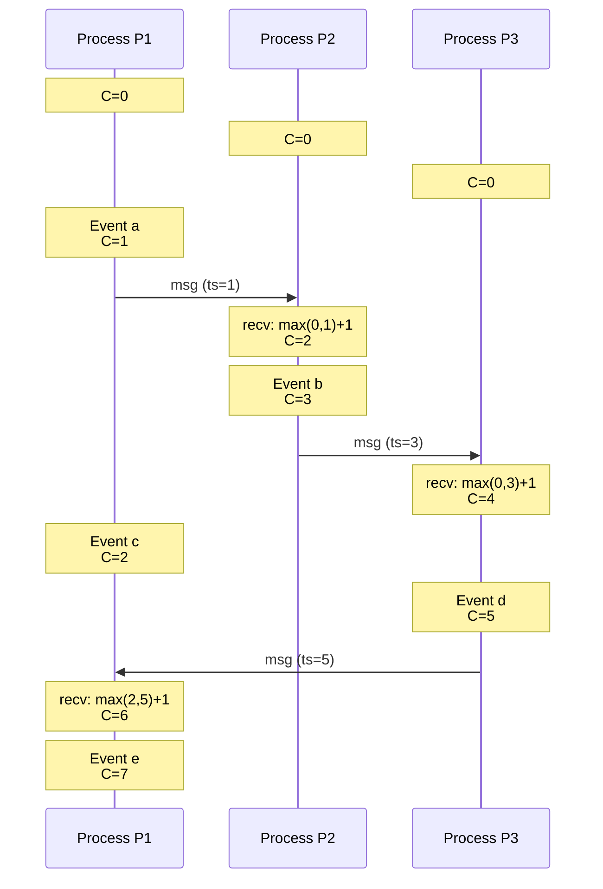
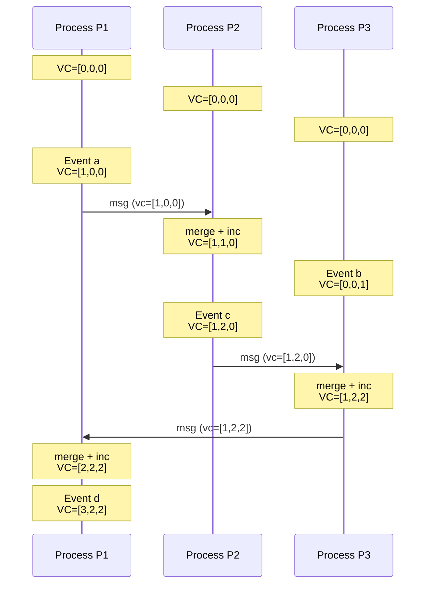
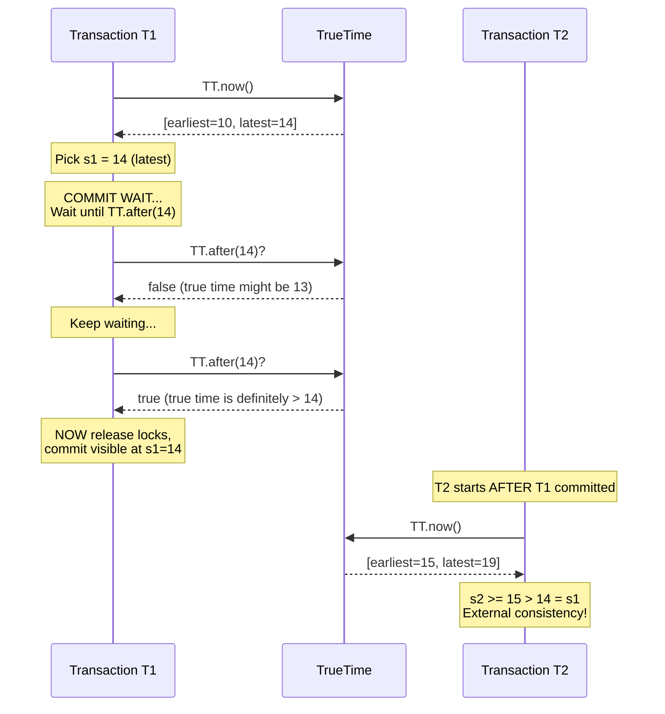
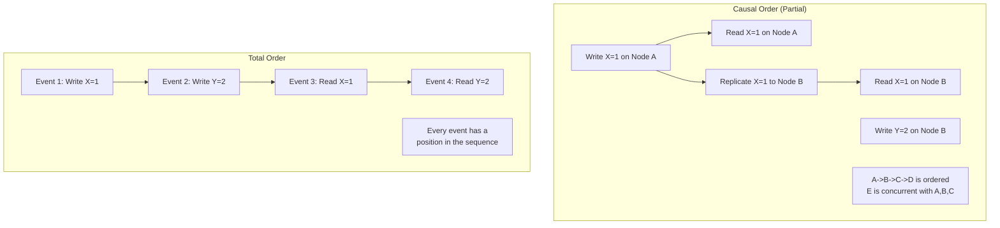
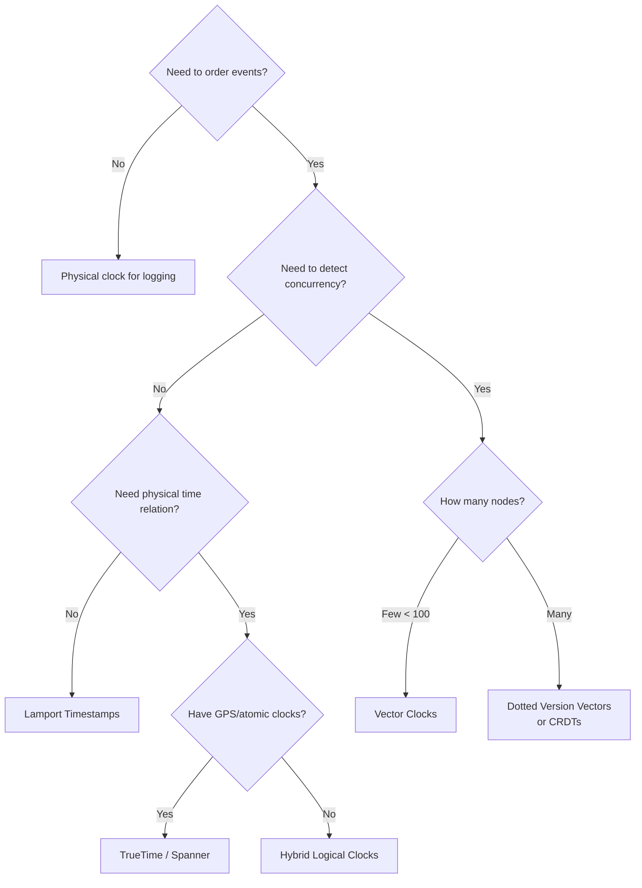

# Clocks and Ordering in Distributed Systems

## Why Clocks Matter

In a single-machine program, events have a natural total order: instruction A executes before instruction B based on the CPU's program counter. In a distributed system, this total order vanishes. Without a shared clock, two events on different machines have no inherent ordering -- yet many operations require one:

- **Database writes**: Which write happened last? (last-writer-wins conflict resolution)
- **Cache invalidation**: Is this cache entry stale?
- **Distributed transactions**: Did the lock acquisition happen before the write?
- **Event sourcing**: What is the correct order of events?
- **Audit logs**: Regulatory compliance requires accurate ordering

The core problem: **"What happened first?" has no universal answer without a shared notion of time.**

---

## Physical Clocks

### Wall Clock Time

Every machine has a hardware clock (typically a quartz crystal oscillator) that tracks wall-clock time. The operating system reads this clock and reports it as "the current time."

**The problem**: Quartz clocks drift. A typical server clock drifts 10-200 parts per million (ppm):
- At 100 ppm, the clock gains or loses ~8.6 seconds per day
- After one week without synchronization: potentially ~1 minute off

### Clock Drift and Skew

| Term | Definition |
|------|-----------|
| **Clock drift** | The rate at which a clock deviates from true time (measured in ppm) |
| **Clock skew** | The difference between two clocks at a specific point in time |
| **Clock offset** | The difference between a node's clock and a reference clock |

```
True Time:    |----|----|----|----|----|----|
              0    1    2    3    4    5    6  seconds

Node A Clock: |----|----|-----|----|-----|----|
              0    1    2     3    4     5    6  (drifts slow)

Node B Clock: |---|---|---|---|---|---|---|
              0   1   2   3   4   5   6   7  (drifts fast)

At true time = 6s:
  Node A thinks it is 5.8s  (skew = -0.2s)
  Node B thinks it is 6.3s  (skew = +0.3s)
  Skew between A and B = 0.5s
```

### NTP (Network Time Protocol)

NTP synchronizes clocks across machines by querying time servers arranged in a hierarchy (strata):

```
Stratum 0: Atomic clocks, GPS receivers (reference clocks)
    |
Stratum 1: Servers directly connected to Stratum 0
    |
Stratum 2: Servers synchronized to Stratum 1
    |
Stratum 3: Servers synchronized to Stratum 2
    ...
```

**How NTP works (simplified)**:
1. Client sends request to NTP server, recording send time t1
2. Server receives at t2, responds at t3
3. Client receives at t4
4. Offset = ((t2 - t1) + (t3 - t4)) / 2
5. Round-trip delay = (t4 - t1) - (t3 - t2)

**NTP limitations**:
- Best case accuracy: ~1ms on LAN, ~10-100ms over internet
- NTP can adjust the clock backward (monotonicity violation)
- Network jitter degrades accuracy
- Under asymmetric routing, offset calculation is wrong
- **NTP is NOT sufficient for ordering events across machines at fine granularity**

### When Physical Clocks Are Dangerous

```python
# DANGEROUS: Using wall clock for conflict resolution
def last_writer_wins(existing_record, new_record):
    # If Node A's clock is 50ms ahead of Node B's clock,
    # Node A's writes will ALWAYS win over Node B's writes
    # even if Node B's write truly happened later.
    if new_record.timestamp > existing_record.timestamp:
        return new_record
    return existing_record
```

This is why systems like Cassandra (which uses last-writer-wins) can lose writes silently when clocks are skewed.

---

## Lamport Timestamps (Logical Clocks)

Leslie Lamport's 1978 paper introduced the idea that you do not need physical time -- you need a way to capture **causal ordering**.

### The Happens-Before Relation

Lamport defined the "happens-before" relation (denoted ->):
1. **Within a process**: If event a occurs before event b in the same process, then a -> b
2. **Message sending**: If a is the send of a message and b is the receipt of that message, then a -> b
3. **Transitivity**: If a -> b and b -> c, then a -> c

If neither a -> b nor b -> a, then a and b are **concurrent** (a || b).

### The Algorithm

Each process maintains a counter `C`:
1. Before each local event, increment: `C = C + 1`
2. When sending a message, attach the current counter value
3. When receiving a message with timestamp `T_msg`:
   - `C = max(C, T_msg) + 1`

### Step-by-Step Example



### Properties of Lamport Timestamps

**What they guarantee**:
- If a -> b, then L(a) < L(b) (causality is respected)

**What they do NOT guarantee**:
- If L(a) < L(b), we CANNOT conclude a -> b (the converse is false)
- Concurrent events may get arbitrary timestamp ordering
- Cannot detect concurrency

```
Key Property:
  a -> b  IMPLIES  L(a) < L(b)     [TRUE]
  L(a) < L(b)  IMPLIES  a -> b     [FALSE - could be concurrent!]
```

### Creating a Total Order

Lamport timestamps alone do not give a total order (concurrent events have no ordering). To create a total order, break ties using process ID:

```
Total order: (timestamp, process_id)
Event (3, P1) < Event (3, P2) because P1 < P2 when timestamps are equal
```

This total order is **consistent** with causality but is **arbitrary** for concurrent events.

---

## Vector Clocks

Vector clocks (Fidge, 1988; Mattern, 1989) solve the limitation of Lamport timestamps: they can detect concurrency.

### The Algorithm

For a system with N processes, each process maintains a vector of N counters:

```
Process Pi maintains VC[i] = [c1, c2, ..., cN]
  where VC[i][j] = "the latest event count from Pj that Pi knows about"
```

**Rules**:
1. Before each local event on process Pi: `VC[i][i] = VC[i][i] + 1`
2. When Pi sends a message: attach entire vector VC[i]
3. When Pi receives a message with vector VC_msg:
   - For each j: `VC[i][j] = max(VC[i][j], VC_msg[j])`
   - Then: `VC[i][i] = VC[i][i] + 1`

### Worked Example with Three Processes



### How to Compare Vector Clocks

Given two vector clocks VA and VB:

```
VA <= VB  iff  for ALL i: VA[i] <= VB[i]    (VA happened-before or equals VB)
VA < VB   iff  VA <= VB AND VA != VB          (VA strictly happened-before VB)
VA || VB  iff  NOT(VA <= VB) AND NOT(VB <= VA) (concurrent!)
```

**Example comparisons**:
```
[1,2,0] < [1,3,1]   -->  happened-before (every element <=, not equal)
[2,1,0] || [1,2,0]  -->  concurrent (2>1 but 1<2, neither dominates)
[3,2,2] > [1,2,2]   -->  happened-after
[1,1,1] = [1,1,1]   -->  same event knowledge
```

### Vector Clock Conflict Detection (Dynamo-style)

```python
def compare_vector_clocks(vc_a, vc_b):
    """
    Returns:
      'BEFORE'     if vc_a < vc_b  (vc_a happened before vc_b)
      'AFTER'      if vc_a > vc_b  (vc_a happened after vc_b)
      'CONCURRENT' if vc_a || vc_b (concurrent, conflict!)
      'EQUAL'      if vc_a == vc_b
    """
    a_less = False
    b_less = False
    
    for a_val, b_val in zip(vc_a, vc_b):
        if a_val < b_val:
            a_less = True
        elif a_val > b_val:
            b_less = True
    
    if a_less and b_less:
        return 'CONCURRENT'   # conflict! need resolution
    elif a_less:
        return 'BEFORE'       # vc_a happened first
    elif b_less:
        return 'AFTER'        # vc_b happened first
    else:
        return 'EQUAL'
```

### Limitations of Vector Clocks

| Issue | Details |
|-------|---------|
| **Size grows with nodes** | Vector has one entry per node. With 1000 nodes, every message carries a 1000-element vector. |
| **Garbage collection** | Need pruning strategies for systems where nodes join and leave. |
| **Client-managed versions** | Amazon Dynamo used vector clocks but found them impractical for client-side conflict resolution at scale. |

### Dotted Version Vectors

An optimization where only the node that coordinates the write gets its counter incremented, reducing the size problem. Used in Riak.

---

## Hybrid Logical Clocks (HLC)

HLC (Kulkarni et al., 2014) combines physical time and logical ordering into a single timestamp. It gives you the best of both worlds.

### Motivation
- Lamport clocks: good ordering, no relation to real time
- Physical clocks: relate to real time, but cannot capture causality
- HLC: captures causality AND stays close to physical time

### The Algorithm

Each HLC timestamp is a pair `(l, c)` where:
- `l` = the maximum physical time the node is aware of
- `c` = a logical counter for events at the same `l` value

```python
class HLC:
    def __init__(self):
        self.l = physical_time()  # wall clock
        self.c = 0

    def local_event(self):
        """Called before each local event."""
        l_old = self.l
        self.l = max(l_old, physical_time())
        if self.l == l_old:
            self.c += 1
        else:
            self.c = 0
        return (self.l, self.c)

    def send_event(self):
        """Called when sending a message. Returns timestamp to attach."""
        return self.local_event()

    def receive_event(self, msg_l, msg_c):
        """Called when receiving a message with timestamp (msg_l, msg_c)."""
        l_old = self.l
        self.l = max(l_old, msg_l, physical_time())
        if self.l == l_old == msg_l:
            self.c = max(self.c, msg_c) + 1
        elif self.l == l_old:
            self.c = self.c + 1
        elif self.l == msg_l:
            self.c = msg_c + 1
        else:
            self.c = 0
        return (self.l, self.c)
```

### Properties of HLC
- `(l, c)` is monotonically increasing on each node
- If `e -> f`, then `hlc(e) < hlc(f)` (respects causality)
- `l` value is always within clock drift of physical time (bounded divergence)
- Compact: just two integers, regardless of number of nodes

### When to Use HLC
- CockroachDB uses HLC for transaction timestamps
- Any system that needs causal ordering with timestamps close to real time
- Snapshot reads at a "physical time" that respects causal ordering

---

## Google's TrueTime

TrueTime is Google's proprietary time API, used in Spanner (their globally distributed database). It represents time as a **confidence interval** rather than a single point.

### Hardware Infrastructure
- Every Google data center has a mix of **GPS receivers** and **atomic clocks**
- GPS gives absolute time; atomic clocks provide stability between GPS fixes
- Multiple time masters per data center for redundancy
- Daemon on each machine polls multiple time masters

### The API

```
TrueTime API:
  
  TT.now()    ->  TTinterval [earliest, latest]
  TT.after(t) ->  true if t is definitely in the past
  TT.before(t)->  true if t is definitely in the future
```

The interval `[earliest, latest]` represents the uncertainty: the true time is guaranteed to be within this range. Typical uncertainty: **1-7 milliseconds** (much better than NTP).

```
                 True Time (unknown exact value)
                        |
   [earliest =========== | =================== latest]
                         ^
                    Somewhere in here
                    
   Uncertainty (epsilon) = (latest - earliest) / 2
   
   Typical epsilon: 1-7 ms
   Average epsilon: ~4 ms
```

### How Spanner Uses TrueTime for External Consistency

**External consistency**: If transaction T1 commits before transaction T2 starts (in real time), then T1's commit timestamp < T2's commit timestamp.

**The commit-wait protocol**:
1. Transaction T1 acquires all locks
2. T1 picks commit timestamp `s1 = TT.now().latest`
3. T1 **waits** until `TT.after(s1)` is true (the "commit wait")
4. Only then does T1 release locks and become visible



**Why commit-wait works**: By waiting until the uncertainty window passes, you guarantee that any future transaction will get a timestamp strictly greater than s1.

**Cost of commit-wait**: Average wait = ~7ms. This is why TrueTime's tight bounds (low epsilon) are critical -- larger uncertainty = longer waits = higher latency.

---

## Causal Ordering vs Total Ordering

### Causal Order (Partial Order)
- Only events with a causal relationship are ordered
- Concurrent events have no defined order
- Captured by: vector clocks, HLC
- Weaker guarantee, but more available (does not require coordination)

### Total Order
- ALL events in the system have a defined order
- Every pair of events is comparable
- Captured by: Lamport timestamps (with tie-breaking), consensus protocols
- Stronger guarantee, but requires coordination (single leader or consensus)



### Causal Consistency
A consistency model where:
- If operation A causally precedes operation B, all nodes see A before B
- Concurrent operations may be seen in different orders by different nodes
- Stronger than eventual consistency, weaker than linearizability
- Does NOT require a single leader or global coordination

---

## When to Use Which Clock Type

| Clock Type | Use When | Examples |
|-----------|----------|---------|
| **Physical (NTP)** | Rough timestamps for logging, human-readable times, TTLs | Log timestamps, certificate expiry |
| **Lamport** | You need a total order and can tolerate arbitrary ordering of concurrent events | Mutual exclusion, total order broadcast |
| **Vector** | You need to detect concurrent updates and resolve conflicts | Dynamo-style eventual consistency, CRDTs |
| **HLC** | You need causal ordering with timestamps close to physical time | CockroachDB, snapshot isolation |
| **TrueTime** | You need external consistency with bounded uncertainty | Google Spanner (requires specialized hardware) |

### Decision Tree



---

## Interview Questions and Answers

### Q1: Why can't we just use NTP to order events across machines?

**A**: NTP synchronizes clocks to within 1-100ms, but many events happen within that window. Two writes happening 5ms apart on different machines cannot be reliably ordered by NTP-synced clocks. If machine A's clock is 10ms ahead of machine B's clock, machine A's write will appear to have happened after machine B's write, even if the opposite is true. This can lead to lost writes in last-writer-wins systems.

### Q2: What is the key difference between Lamport timestamps and vector clocks?

**A**: Lamport timestamps capture a total order consistent with causality (if a -> b then L(a) < L(b)), but you cannot determine from timestamps alone whether two events are causally related or concurrent. Vector clocks preserve the full causal history: given two vector clocks, you can determine if one happened before the other, or if they are concurrent. The tradeoff is that vector clocks grow linearly with the number of nodes.

### Q3: How does CockroachDB handle the lack of TrueTime?

**A**: CockroachDB uses Hybrid Logical Clocks (HLC). Since it does not have TrueTime's tight uncertainty bounds, it cannot use commit-wait like Spanner. Instead, CockroachDB uses a "read refresh" mechanism: if a transaction's reads might be stale due to clock skew, it can retry the reads at a later timestamp. It also uses a configurable maximum clock offset (default 500ms) and nodes that exceed this offset are removed from the cluster.

### Q4: Why does Spanner wait during commit?

**A**: Spanner's commit-wait ensures external consistency. After choosing a commit timestamp `s` (the latest value from TrueTime), it waits until TrueTime confirms that the real time has passed `s`. This guarantees that any transaction starting after the commit in real time will choose a timestamp greater than `s`. The wait duration equals the TrueTime uncertainty (typically 1-7ms), which is why Google invested in GPS and atomic clock infrastructure -- smaller uncertainty means shorter waits.

### Q5: When would you choose vector clocks over CRDTs?

**A**: Vector clocks are used to detect conflicts and present them to the application for resolution (as in original Dynamo). CRDTs (Conflict-free Replicated Data Types) are designed so that concurrent operations automatically merge without conflict. Use vector clocks when you need custom conflict resolution logic. Use CRDTs when you can model your data as a type with a mathematically provable merge function (counters, sets, registers). CRDTs eliminate the need for conflict resolution at the cost of constraining your data model.

---

## Summary Table

| Property | Physical | Lamport | Vector | HLC | TrueTime |
|----------|----------|---------|--------|-----|----------|
| Detects causality | No | Partial | Yes | Yes | N/A |
| Detects concurrency | No | No | Yes | No | N/A |
| Relates to real time | Yes | No | No | Yes | Yes |
| Size per timestamp | 8 bytes | 8 bytes | 8B * N | 16 bytes | 16 bytes |
| Requires coordination | NTP server | No | No | No | GPS + atomic clocks |
| Used by | Everywhere | Mutex algorithms | Dynamo, Riak | CockroachDB | Google Spanner |
