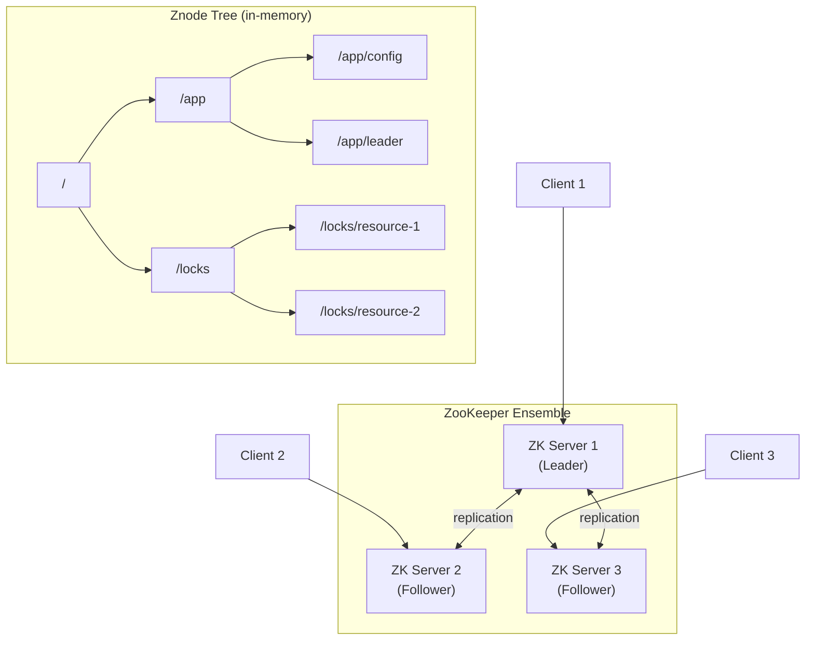
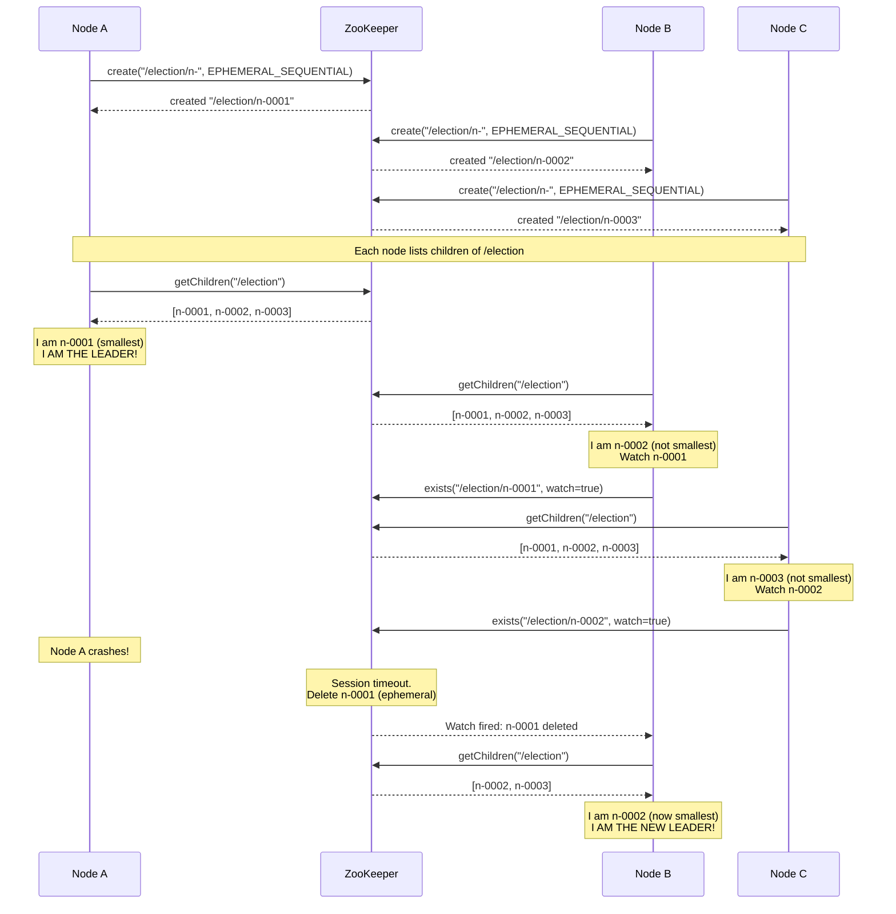
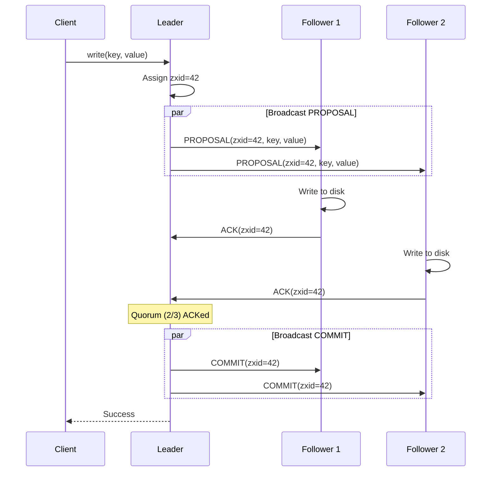
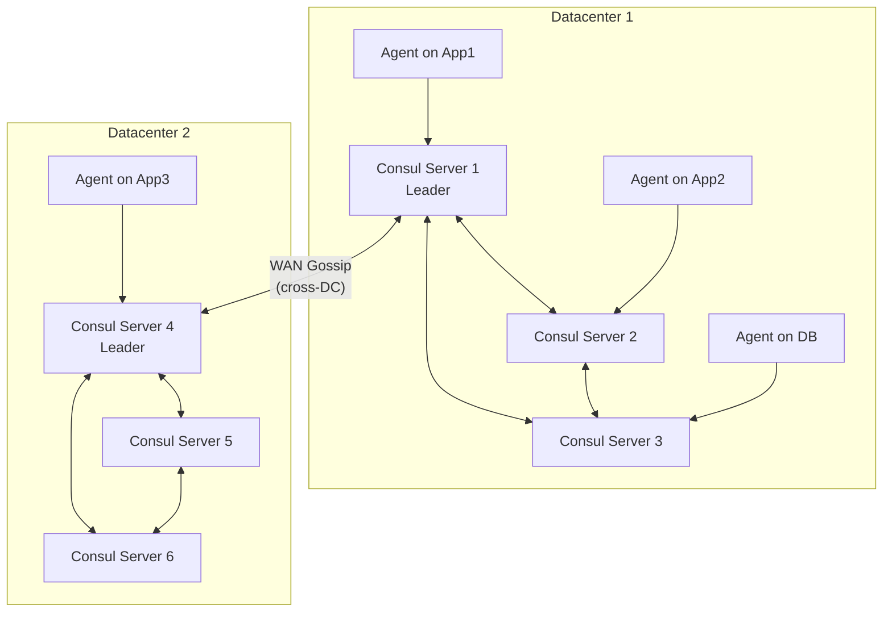
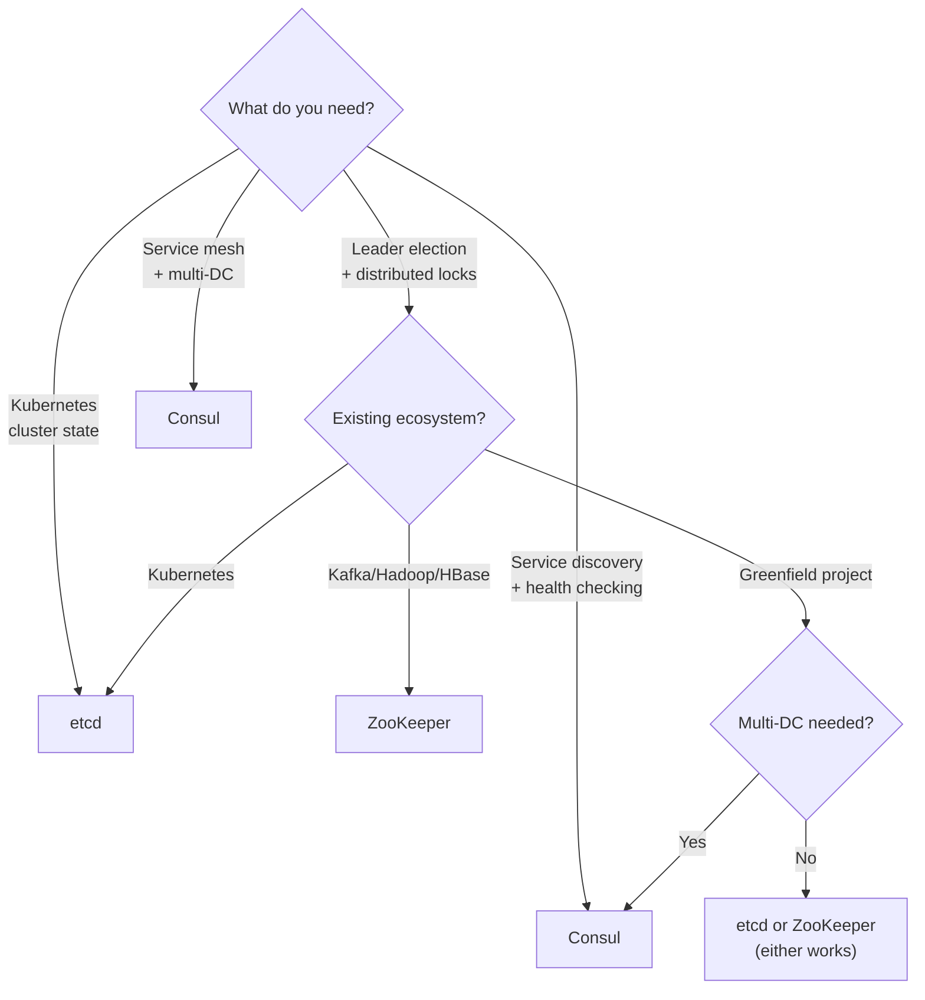

# Coordination Services in Distributed Systems

## What Coordination Services Do

In a distributed system, multiple nodes need to agree on shared state without a single point of failure. Coordination services provide building blocks for these patterns:

| Function | Problem It Solves |
|----------|------------------|
| **Leader election** | Which node is the current primary? |
| **Distributed locks** | Ensure only one process performs an operation at a time |
| **Configuration management** | All nodes see the same config; updates propagate reliably |
| **Service discovery** | Where is the current instance of Service X? |
| **Group membership** | Which nodes are currently alive in the cluster? |
| **Barrier synchronization** | All nodes wait until everyone is ready, then proceed together |
| **Distributed queues** | Ordered task assignment across nodes |

These are hard to build correctly from scratch. Off-the-shelf coordination services encode decades of research into usable APIs.

---

## Apache ZooKeeper

ZooKeeper (originally from Yahoo, now Apache) is the most battle-tested coordination service. It is used by Kafka, HBase, Hadoop, Solr, and many others.

### Architecture

ZooKeeper runs as an ensemble of servers (typically 3, 5, or 7). One server is the **leader**; the rest are **followers**. All writes go through the leader; reads can be served by any server.



### Core Concepts

**Znodes**: ZooKeeper's data model is a hierarchical namespace (like a filesystem). Each node is called a znode.

```
Znode Tree:
/
├── /app
│   ├── /app/config          (persistent, stores config data)
│   ├── /app/leader           (ephemeral, whoever created it is the leader)
│   └── /app/workers
│       ├── /app/workers/w-001  (ephemeral + sequential)
│       ├── /app/workers/w-002  (ephemeral + sequential)
│       └── /app/workers/w-003  (ephemeral + sequential)
└── /locks
    └── /locks/resource-1
        ├── /locks/resource-1/lock-001  (ephemeral + sequential)
        └── /locks/resource-1/lock-002  (ephemeral + sequential)
```

**Znode types**:

| Type | Behavior |
|------|----------|
| **Persistent** | Exists until explicitly deleted. Survives client disconnect. |
| **Ephemeral** | Automatically deleted when the client session ends (disconnect/timeout). |
| **Sequential** | ZooKeeper appends a monotonically increasing number to the name. |
| **Ephemeral + Sequential** | Combines both -- used for locks and leader election. |

**Watches**: A client can set a watch on a znode. When the znode changes (data modified, children changed, deleted), ZooKeeper sends a one-time notification to the client.

- Watches are one-shot: after firing, you must re-register
- Watches are ordered: a client sees the watch notification before seeing the new data
- Used to avoid polling

**Sessions**: A client establishes a session with the ensemble. The session has a timeout. If the client does not heartbeat within the timeout, the session expires and all ephemeral znodes created by that client are deleted.

### ZooKeeper Recipes

#### Leader Election



**Key design choice**: Each node watches only the node immediately before it in the sequence (not the leader node directly). This avoids a "thundering herd" where all nodes react when the leader dies.

#### Distributed Lock

```python
# Pseudocode for ZooKeeper distributed lock
class ZKDistributedLock:
    def __init__(self, zk_client, lock_path):
        self.zk = zk_client
        self.lock_path = lock_path
        self.my_node = None
    
    def acquire(self):
        # 1. Create ephemeral sequential node
        self.my_node = self.zk.create(
            self.lock_path + "/lock-",
            ephemeral=True,
            sequential=True
        )
        
        while True:
            # 2. Get all children, sorted
            children = sorted(self.zk.get_children(self.lock_path))
            
            # 3. If I am the smallest, I have the lock
            if self.my_node == self.lock_path + "/" + children[0]:
                return  # Lock acquired!
            
            # 4. Otherwise, watch the node just before me
            my_index = children.index(self.my_node.split("/")[-1])
            prev_node = self.lock_path + "/" + children[my_index - 1]
            
            # 5. Wait for it to be deleted
            event = self.zk.exists(prev_node, watch=True)
            if event is not None:
                wait_for_watch()  # blocks until watch fires
    
    def release(self):
        self.zk.delete(self.my_node)
```

#### Barrier (All-Ready Gate)

All N processes must arrive at a point before any can proceed:
1. Each process creates an ephemeral node under `/barrier/ready-`
2. Each process watches the children count of `/barrier`
3. When children count equals N, all processes proceed

#### Queue (FIFO Task Distribution)

1. Producer creates sequential persistent node: `/queue/task-`
2. Consumer lists children, takes the smallest, processes it, deletes it
3. If no children, consumer watches for new children

### ZAB Protocol (ZooKeeper Atomic Broadcast)

ZAB is the consensus protocol that keeps the ZooKeeper ensemble consistent.

**Two phases**:

**Phase 1 -- Leader Election / Discovery**:
- Nodes exchange proposals to elect a leader
- The leader is the node with the most up-to-date transaction log
- Once elected, followers synchronize their state with the leader

**Phase 2 -- Atomic Broadcast**:
1. Client sends write to any ZK server
2. Server forwards write to the leader
3. Leader assigns a transaction ID (zxid) and broadcasts a PROPOSAL to all followers
4. Followers write the proposal to disk and send ACK
5. Once a majority (quorum) ACKs, leader broadcasts COMMIT
6. All servers apply the transaction



**Guarantees**:
- All committed transactions are delivered in the same order to all servers
- If a transaction is committed on one server, it will eventually be committed on all servers
- Transactions from a given leader are delivered in the order issued

---

## etcd

etcd is a distributed key-value store designed for reliability. It is the backbone of Kubernetes (stores all cluster state).

### Architecture

- **Raft consensus**: etcd uses Raft (not ZAB) for consensus among nodes
- **Key-value store**: Simple key-value with a flat namespace (but supports prefixed ranges for hierarchy)
- **MVCC**: Multi-version concurrency control -- every key change creates a new revision
- **gRPC API**: Modern, efficient protocol

### Core Features

**Watch API**: Stream changes to keys or key ranges. Unlike ZooKeeper's one-shot watches, etcd watches are persistent streams.

```
# Watch all keys with prefix "/services/"
etcdctl watch /services/ --prefix

# Client receives a stream:
# PUT /services/web-1 -> {"host": "10.0.1.1", "port": 8080}
# PUT /services/web-2 -> {"host": "10.0.1.2", "port": 8080}
# DELETE /services/web-1
```

**Lease mechanism**: A lease is a time-to-live (TTL) grant. Keys attached to a lease are automatically deleted when the lease expires (similar to ephemeral znodes).

```
# Create a lease with 10s TTL
lease_id = etcd.lease_grant(ttl=10)

# Attach a key to the lease
etcd.put("/services/web-1", value, lease=lease_id)

# Keep the lease alive (heartbeat)
etcd.lease_keep_alive(lease_id)  # must call before TTL expires

# If the client dies, the lease expires after 10s,
# and /services/web-1 is automatically deleted.
```

**Compare-and-Swap (Transactions)**: Atomic read-modify-write operations.

```
# Atomic: set key only if current value matches expected
etcd.transaction(
    compare=[etcd.compare("/leader", "=", "node-A")],
    success=[etcd.put("/leader", "node-B")],
    failure=[]  # do nothing if compare fails
)
```

### etcd in Kubernetes

```
Kubernetes Control Plane:

  kubectl ──> API Server ──> etcd cluster
                  |              (all state here:
                  |               pods, services,
                  |               deployments,
                  |               secrets, configmaps)
                  v
             Scheduler
             Controller Manager
```

Every piece of Kubernetes state (pod definitions, service endpoints, secrets, config maps) lives in etcd. The API server is the only component that talks to etcd directly.

---

## Consul

Consul (by HashiCorp) combines service discovery, health checking, KV store, and service mesh into one tool.

### Architecture



### Core Features

**Service Discovery**: Services register themselves with the local Consul agent. Other services query Consul (via DNS or HTTP) to find healthy instances.

```
# Register a service
{
  "service": {
    "name": "web",
    "port": 8080,
    "check": {
      "http": "http://localhost:8080/health",
      "interval": "10s"
    }
  }
}

# Discover via DNS
dig @127.0.0.1 web.service.consul
# Returns: 10.0.1.1, 10.0.1.2, 10.0.1.3 (healthy instances)
```

**Health Checking**: Each agent runs health checks against local services. Unhealthy services are removed from discovery results. Types: HTTP, TCP, script, TTL, gRPC.

**KV Store**: Hierarchical key-value store with watches, CAS operations, and sessions (similar to etcd leases / ZK ephemeral nodes).

**Service Mesh (Connect)**: Provides mutual TLS between services, traffic management, and authorization policies.

**Multi-Datacenter**: First-class support for multiple data centers. WAN gossip protocol connects data centers. Queries can specify which datacenter to target.

---

## Chubby (Google)

Chubby is Google's internal distributed lock service. It is not open source, but its design heavily influenced ZooKeeper.

### Design Philosophy

Chubby provides **coarse-grained** locks (held for hours or days, not milliseconds). This is deliberate:
- Fine-grained locks require high throughput (many lock/unlock per second)
- Coarse-grained locks are simpler: used for leader election, master selection
- Lock holder can cache data locally for the duration of the lock

### Architecture

```
Chubby Cell (typically 5 replicas):

  Client ──> Chubby Client Library ──> Chubby Cell
                                        ├── Replica 1 (Master)
                                        ├── Replica 2
                                        ├── Replica 3
                                        ├── Replica 4
                                        └── Replica 5
                                        
  Master elected via Paxos.
  All reads and writes go through Master.
  Master lease: other replicas promise not to
  elect a new master for the lease duration.
```

### Key Concepts

**Lock files**: Like ZK znodes but modeled as files. A client opens a lock file and acquires the lock.

**Sequencer**: Chubby's version of a fencing token. When a client acquires a lock, it gets a sequencer (a string describing the lock holder, generation number). The client passes this sequencer to other services, which can verify it with Chubby.

**Events**: Clients can subscribe to events on files (similar to ZK watches): file contents changed, child node added, lock acquired, conflicting lock requested.

**Master lease**: The Chubby master holds a lease. During the lease period, other replicas will not elect a new master. This avoids split brain during brief network issues.

### Use Cases at Google

| System | How It Uses Chubby |
|--------|-------------------|
| **GFS (Google File System)** | Master election for the GFS master |
| **Bigtable** | Master election; storing Bigtable schema; discovering tablet servers |
| **MapReduce** | Master election for the MapReduce coordinator |
| **DNS** | Chubby-based DNS provides consistent service discovery |

---

## Comparison Table

| Feature | ZooKeeper | etcd | Consul |
|---------|-----------|------|--------|
| **Consensus protocol** | ZAB | Raft | Raft |
| **Data model** | Hierarchical znodes | Flat key-value (prefix ranges) | Hierarchical KV + service catalog |
| **Ephemeral nodes** | Native (znode type) | Via leases (TTL) | Via sessions |
| **Watch mechanism** | One-shot watches (must re-register) | Persistent watch streams | Blocking queries or watch |
| **Service discovery** | Build-your-own with ephemeral nodes | Build-your-own or third-party | Native first-class feature |
| **Health checking** | Session heartbeats only | Via lease keep-alive | Native (HTTP, TCP, script, gRPC, TTL) |
| **Multi-datacenter** | Not built-in (use separate ensembles) | Not built-in (use separate clusters) | Native WAN gossip |
| **Service mesh** | No | No | Yes (Consul Connect) |
| **Primary users** | Kafka, HBase, Hadoop, Solr | Kubernetes, CoreDNS | HashiCorp stack, general microservices |
| **API** | Custom TCP protocol | gRPC + HTTP/JSON | HTTP + DNS + gRPC |
| **Language** | Java | Go | Go |
| **Typical ensemble** | 3 or 5 servers | 3 or 5 servers | 3 or 5 servers |
| **Max data per node** | 1 MB per znode | Recommended < 1 MB per key | No hard limit (practical ~512 KB) |
| **Linearizable reads** | Yes (sync mode) | Yes (serializable read) | Yes (consistent mode) |

### When to Choose What



---

## Common Patterns Across All Coordination Services

### Leader Election Pattern

Regardless of which coordination service you use, the pattern is the same:

```
1. Each candidate creates an ephemeral/leased node
2. The node with the lowest sequence number (or first to create) is the leader
3. Non-leaders watch the leader's node
4. When the leader dies, its ephemeral node disappears
5. The next candidate becomes the leader
6. The new leader gets a higher fencing token
```

### Distributed Lock Pattern

```
1. Create a node under a lock path (ephemeral + sequential)
2. List all children under the lock path
3. If your node has the smallest sequence number, you hold the lock
4. If not, watch the node with the next-smaller sequence number
5. When that node is deleted (lock released or session expired), re-check
6. To release the lock, delete your node
```

### Service Discovery Pattern

```
1. Service starts and registers with coordination service (ephemeral)
2. Registration includes: service name, host, port, health check
3. Clients query the coordination service for healthy instances
4. When a service dies, its registration disappears (ephemeral node)
5. Clients watch for changes and update their local routing tables
```

---

## Interview Questions and Answers

### Q1: Why use ZooKeeper instead of building your own coordination with a database?

**A**: Databases are not designed for the coordination use case. Coordination requires:
1. **Ephemeral state**: Automatic cleanup when a client disconnects (try implementing this reliably with a PostgreSQL row)
2. **Watches/notifications**: Clients need to be notified of changes in real-time (polling a DB is inefficient and high-latency)
3. **Strong ordering guarantees**: ZAB/Raft ensures all clients see changes in the same order
4. **Designed for many small reads**: Coordination services handle millions of small reads per second; databases are optimized for larger queries
5. **Consensus baked in**: You would need to implement your own consensus on top of a database

### Q2: What happens when the ZooKeeper leader fails?

**A**: The followers detect the leader failure via the heartbeat mechanism. They run leader election (part of ZAB Phase 1). The follower with the most complete transaction log is elected. During election (~200ms typically), the ensemble cannot process writes. Once the new leader is elected, it synchronizes with the followers and resumes normal operation. Reads can continue being served by followers during this period (though they may be slightly stale).

### Q3: Why does Kubernetes use etcd and not ZooKeeper?

**A**: Several reasons:
1. **Language and ecosystem**: etcd is written in Go (like Kubernetes). ZooKeeper is Java (heavier JVM dependency).
2. **Watch model**: etcd's persistent watch streams are simpler than ZooKeeper's one-shot watches for Kubernetes' continuous reconciliation model.
3. **gRPC API**: Modern, well-documented, auto-generated client libraries.
4. **Simpler data model**: Kubernetes stores JSON objects as values; etcd's flat key-value with prefix ranges maps well to this.
5. **Historical**: etcd was created by CoreOS (Kubernetes' early infrastructure partner).

### Q4: How do you handle the coordination service itself being a single point of failure?

**A**: The coordination service is NOT a single point of failure:
1. It runs as a replicated ensemble (3, 5, or 7 nodes)
2. It tolerates f failures with 2f+1 nodes (ZK/etcd/Consul)
3. Clients connect to any node; if one is down, they reconnect to another
4. For geographic redundancy, run separate ensembles per region with application-level failover
5. However, if the entire ensemble is unavailable, dependent services cannot elect leaders or acquire locks. This is why the ensemble must be treated as critical infrastructure with aggressive monitoring and capacity planning.

### Q5: You need to implement a rate limiter shared across 10 application servers. Which coordination service features would you use?

**A**: Two approaches:

**Approach 1 -- Centralized counter in etcd/ZK**:
- Store the counter as a key in etcd
- Use compare-and-swap to atomically increment
- Problem: high contention on a single key at high request rates

**Approach 2 -- Token bucket with lease**:
- Pre-allocate tokens to each server (e.g., 100 tokens per second per server for 1000 total QPS)
- Each server tracks its own token count locally (fast)
- Periodically rebalance allocations via the coordination service
- If a server dies, its lease expires and its tokens are reallocated
- Much better throughput: no per-request coordination

For most rate limiting scenarios, approach 2 is preferred because coordination services are not designed for per-request operations at high throughput.

### Q6: Compare Chubby's sequencer with ZooKeeper's approach to fencing.

**A**: Chubby explicitly provides a **sequencer** -- an opaque token containing the lock name, mode, and generation number. The lock holder passes this to downstream services, which can verify it by calling Chubby. ZooKeeper does not have a built-in equivalent. You must implement fencing yourself, typically by using the zxid (transaction ID) or the sequential node number as a fencing token. The application and storage layers must explicitly track and validate these tokens. Chubby's approach is more integrated but less flexible; ZooKeeper's approach requires more work from the developer but is more general.

---

## Quick Reference: Coordination Recipes

| Recipe | ZooKeeper | etcd | Consul |
|--------|-----------|------|--------|
| Leader election | Ephemeral sequential znodes | Compare-and-swap + lease | Session + KV lock |
| Distributed lock | Ephemeral sequential + watch predecessor | Transaction + lease | Session + KV acquire |
| Service registry | Ephemeral znode per instance | Key with lease per instance | Native service register API |
| Config management | Persistent znode + watch | Key-value + watch | KV store + blocking query |
| Health checking | Session timeout = death | Lease expiry = death | Native health checks |
| Barrier | Children count watch | Key count with prefix watch | KV + session |
