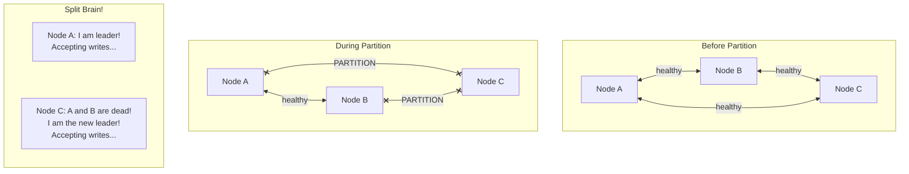
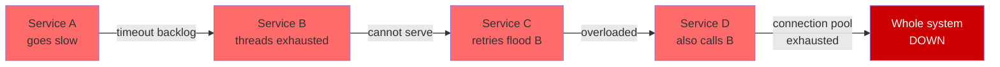
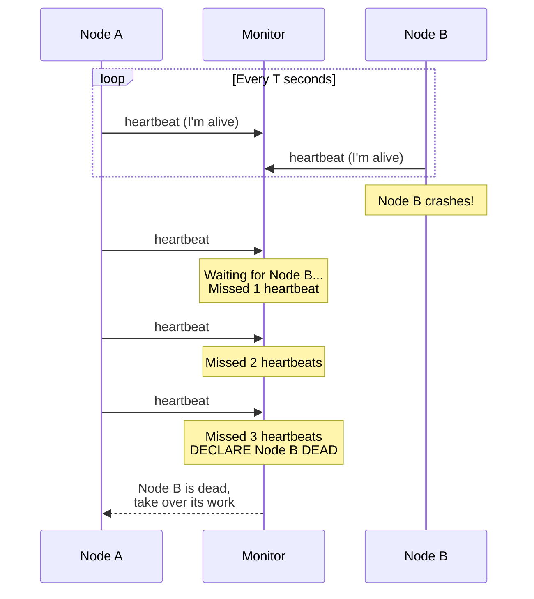
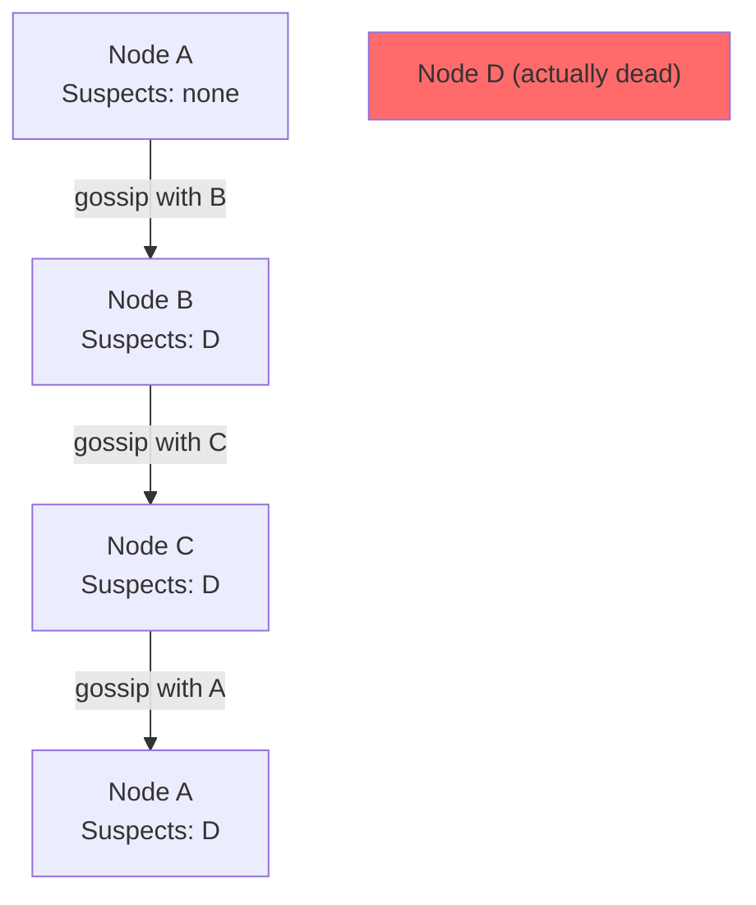
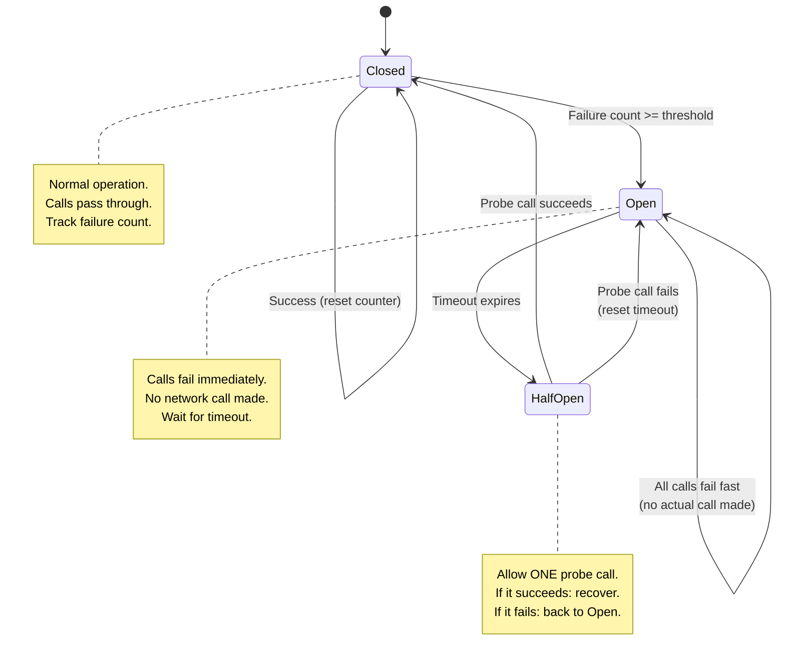
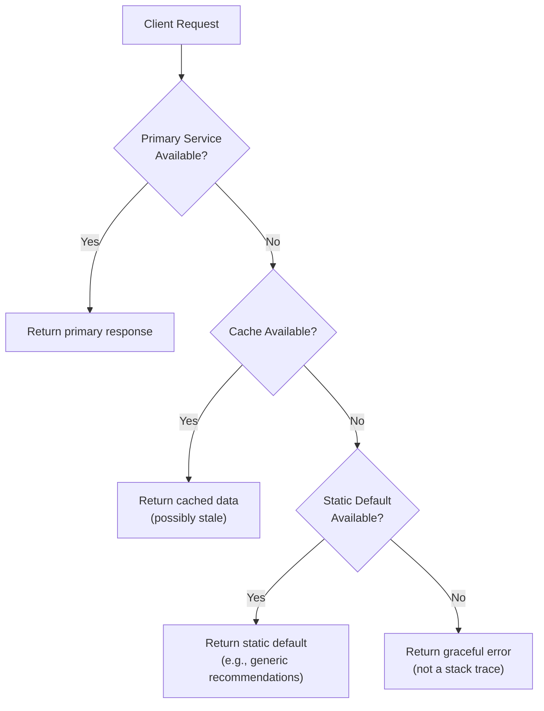
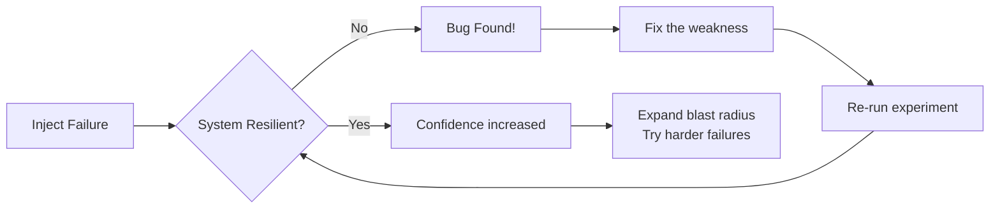
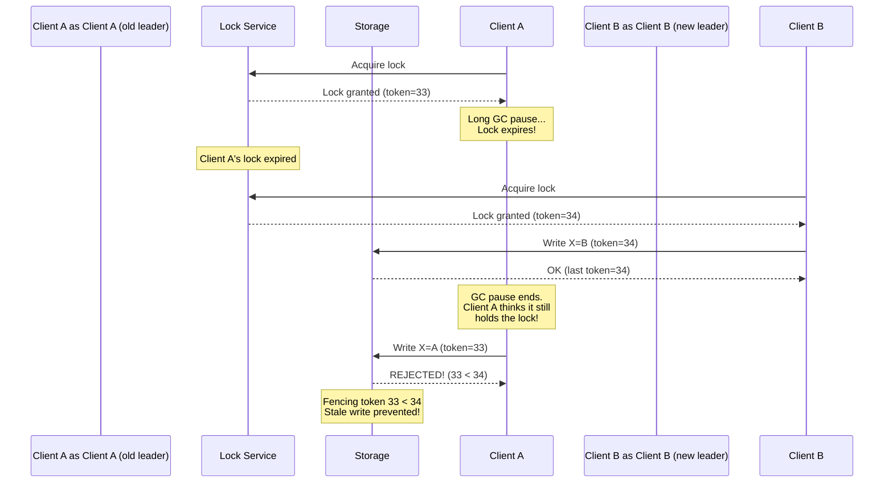

# Failure Handling in Distributed Systems

## Types of Failures

### Fail-Stop
The node stops executing and remains stopped. Other nodes can detect the failure. This is the simplest model -- the node either works or is permanently dead.
- Example: a server's power supply fails permanently
- Easy to handle: detect and route around

### Crash-Recovery
The node crashes (loses volatile state) but may restart and recover from durable storage. This is far more common than fail-stop in real systems.
- Example: a process is OOM-killed, then the service manager restarts it
- Challenge: the node may have partially completed operations before crashing

### Byzantine Failures
The node behaves arbitrarily -- it may send wrong messages, lie about its state, or actively try to subvert the system. This is the most general and hardest failure model.
- Requires 3f+1 nodes to tolerate f faults
- Example: compromised node, hardware corruption sending bad data
- Relevant in: blockchain, multi-party computation, safety-critical systems

### Gray Failures (The Silent Killers)

Gray failures are partial failures that are difficult to detect. The node is not fully down, but it is not fully healthy either. These cause the most insidious production issues.

| Type | Description | Example |
|------|-------------|---------|
| **Performance degradation** | Node responds but slowly | GC pauses, disk thrashing, noisy neighbor |
| **Partial functionality** | Some operations work, others fail | One CPU core is bad, one disk is degraded |
| **Intermittent failures** | Fails occasionally, works most of the time | Flaky network cable, marginal power supply |
| **Silent data corruption** | Node returns wrong results without error | Bit flip in memory, filesystem corruption |
| **Limplock** | Node holds locks but is too slow to release them | Long GC pause while holding a distributed lock |

```
         Detection Difficulty
         
  Easy                                          Hard
    |                                             |
    v                                             v
  Fail-Stop --- Crash --- Crash-Recovery --- Gray --- Byzantine
  
  "It is dead"   "It may    "It might      "It seems   "It is
                 come back"  have state"    slow..."    actively
                                                        lying"
```

---

## Network Partitions

A network partition occurs when nodes cannot communicate with each other, splitting the cluster into isolated groups.

### What Happens During a Partition



### Split Brain Problem

Split brain occurs when a partition causes two or more groups of nodes to independently believe they are the sole authority. Both groups accept writes, creating conflicting state.

**Why split brain is dangerous**:
- Two leaders accept conflicting writes
- When the partition heals, the system has divergent state
- Merging conflicting state may be impossible (e.g., two different users claimed the same username)

**Prevention strategies**:
1. **Quorum-based decisions**: Require a majority (N/2 + 1) to proceed. Only one partition can have a majority.
2. **Fencing tokens**: Every leader gets an incrementing token. Stale leaders with old tokens are rejected.
3. **STONITH** (Shoot The Other Node In The Head): If you suspect split brain, kill the other partition's nodes.
4. **Witness/Tiebreaker**: An odd-numbered set of nodes, or a lightweight witness node, ensures one side always has majority.

---

## Cascading Failures

A cascading failure occurs when the failure of one component causes additional components to fail, which causes still more failures, creating a chain reaction.



### How Cascading Failures Happen

1. **Thread pool exhaustion**: Service A is slow. Service B's threads are all waiting on A. B can no longer serve its own callers.
2. **Connection pool exhaustion**: Similar to thread pools -- finite connections all blocked.
3. **Memory exhaustion**: Queued requests pile up in memory. OOM kills the process.
4. **Retry storms**: Service C retries failed calls to B, multiplying the load on an already struggling system.

### Prevention
- Circuit breakers (see below)
- Bulkheads (see below)
- Timeouts on every network call
- Back-pressure mechanisms
- Load shedding

---

## Thundering Herd Problem

When many clients simultaneously retry or reconnect, the resulting spike can overwhelm the recovering system.

**Scenario**: A cache (e.g., Redis or Memcached) goes down temporarily. When it comes back:
- All application servers simultaneously discover the cache is empty
- All simultaneously query the database to rebuild the cache
- The database is overwhelmed by the sudden spike

```
Normal:       Cache hit -> fast response
                 |
Cache dies:   All 1000 servers -> DB simultaneously
                 |
DB overwhelmed: Everything fails again
```

**Solutions**:
1. **Staggered expiration**: Add random jitter to TTLs so cache entries do not all expire at once
2. **Request coalescing**: Only one server rebuilds the cache; others wait for it
3. **Locking on cache miss**: First request that sees a cache miss acquires a lock and rebuilds; others wait or serve stale
4. **Circuit breaker on DB**: Limit concurrent DB queries
5. **Exponential backoff with jitter on reconnection**: Clients reconnect at random intervals, not all at once

---

## Failure Detection

### Heartbeat Mechanism

The simplest failure detector: nodes periodically send "I am alive" messages. If a node misses several heartbeats, it is declared dead.



**Tradeoffs**:
| Parameter | Short Heartbeat Interval | Long Heartbeat Interval |
|-----------|------------------------|------------------------|
| Detection speed | Fast (seconds) | Slow (tens of seconds) |
| False positives | More (network blip = "dead") | Fewer |
| Network overhead | Higher | Lower |
| Typical value | 1-5 seconds | 10-30 seconds |

### Phi Accrual Failure Detector

Used by Apache Cassandra. Instead of a binary "alive/dead" decision, it computes a **suspicion level** (phi) that increases over time since the last heartbeat.

**How it works**:
1. Track the distribution of inter-arrival times of heartbeats
2. When a heartbeat is late, compute the probability that the node has actually failed
3. Express this as phi = -log10(P(heartbeat_will_still_arrive))
4. Higher phi = more suspicious. Declare failure when phi exceeds a configurable threshold.

```
Phi Accrual Failure Detector:

  Heartbeat inter-arrival times:
  [1.0s, 1.1s, 0.9s, 1.2s, 1.0s, 0.8s, 1.1s, ...]
  
  Mean = 1.01s, StdDev = 0.13s
  
  If last heartbeat was 1.5s ago:
    P(late by > 0.5s given normal distribution) = 0.0001
    phi = -log10(0.0001) = 4.0
    
  If threshold = 8:
    phi(4.0) < 8 -> still considered alive
    
  If last heartbeat was 3.0s ago:
    phi = 12.0 -> DECLARE DEAD

  Advantage: adapts to network conditions automatically.
  Slow network = wider distribution = more tolerance.
```

**Why this is better than fixed timeouts**:
- Adapts to actual network conditions
- A node on a congested network gets more tolerance automatically
- Configurable sensitivity via the phi threshold

### Gossip-Based Failure Detection

Each node periodically picks a random peer and exchanges information about which nodes it believes are alive or dead. Information propagates epidemically through the cluster.



**Properties**:
- **Scalable**: O(log N) rounds to propagate information to all nodes
- **Decentralized**: No single monitor is a single point of failure
- **Probabilistic**: Not instantaneous, but convergence is fast
- **Used by**: Cassandra, Consul, SWIM protocol

---

## Failure Handling Patterns

### Circuit Breaker

Inspired by electrical circuit breakers. Prevents a service from repeatedly calling a failing dependency, giving the dependency time to recover.



**Implementation**:

```python
import time
from enum import Enum

class State(Enum):
    CLOSED = "closed"
    OPEN = "open"
    HALF_OPEN = "half_open"

class CircuitBreaker:
    def __init__(self, failure_threshold=5, recovery_timeout=30,
                 half_open_max_calls=1):
        self.state = State.CLOSED
        self.failure_count = 0
        self.failure_threshold = failure_threshold
        self.recovery_timeout = recovery_timeout
        self.last_failure_time = None
        self.half_open_max_calls = half_open_max_calls
    
    def call(self, func, *args, **kwargs):
        if self.state == State.OPEN:
            if self._timeout_expired():
                self.state = State.HALF_OPEN
            else:
                raise CircuitOpenError("Circuit is OPEN, failing fast")
        
        try:
            result = func(*args, **kwargs)
            self._on_success()
            return result
        except Exception as e:
            self._on_failure()
            raise e
    
    def _on_success(self):
        self.failure_count = 0
        if self.state == State.HALF_OPEN:
            self.state = State.CLOSED  # recovered!
    
    def _on_failure(self):
        self.failure_count += 1
        self.last_failure_time = time.time()
        if self.failure_count >= self.failure_threshold:
            self.state = State.OPEN
    
    def _timeout_expired(self):
        if self.last_failure_time is None:
            return False
        return time.time() - self.last_failure_time >= self.recovery_timeout
```

**Key parameters to tune**:
- `failure_threshold`: How many failures before opening the circuit (typically 5-10)
- `recovery_timeout`: How long to wait in OPEN before trying HALF_OPEN (typically 15-60s)
- `half_open_max_calls`: How many probe calls to allow in HALF_OPEN (typically 1-3)

### Bulkhead Pattern

Named after ship bulkheads that prevent water from flooding the entire ship. Isolate different parts of the system so a failure in one does not bring down everything.

```
Without Bulkhead:
+------------------------------------------+
|           Shared Thread Pool (50)         |
|  Payment API  |  Search API  |  User API |
|    15 threads  |  20 threads  | 15 threads|
+------------------------------------------+
If Payment API gets slow, ALL 50 threads eventually
blocked waiting on Payment -> Search and User also fail.

With Bulkhead:
+-------------+ +-------------+ +-------------+
| Payment Pool| | Search Pool | |  User Pool  |
|  15 threads | | 20 threads  | |  15 threads |
+-------------+ +-------------+ +-------------+
If Payment API gets slow, only its 15 threads block.
Search and User continue operating normally.
```

**Implementation strategies**:
1. **Thread pool isolation**: Each downstream service gets its own thread pool (Hystrix pattern)
2. **Connection pool isolation**: Separate connection pools per dependency
3. **Process isolation**: Run different services in different containers/processes
4. **Semaphore isolation**: Limit concurrent calls per dependency via semaphores

### Retry with Exponential Backoff + Jitter

When a call fails, retry with increasing delays to avoid overwhelming the recovering service.

**Base formula**:
```
wait_time = min(base * 2^attempt, max_wait)
```

**With full jitter (recommended)**:
```
wait_time = random(0, min(base * 2^attempt, max_wait))
```

**With equal jitter**:
```
half = min(base * 2^attempt, max_wait) / 2
wait_time = half + random(0, half)
```

**With decorrelated jitter (AWS recommendation)**:
```
wait_time = min(max_wait, random(base, previous_wait * 3))
```

**Why jitter matters**:

Without jitter, if 1000 clients fail at the same time and all use `base * 2^attempt`:
- After attempt 1: all 1000 retry at exactly t+1s
- After attempt 2: all 1000 retry at exactly t+3s
- The spikes in load are perfectly synchronized -- thundering herd!

With jitter, retries are spread randomly across the backoff window.

```python
import random
import time

def retry_with_backoff(func, max_retries=5, base_delay=1.0, 
                       max_delay=60.0):
    """Retry with exponential backoff and full jitter."""
    for attempt in range(max_retries):
        try:
            return func()
        except RetryableError:
            if attempt == max_retries - 1:
                raise  # final attempt, propagate error
            
            # Exponential backoff with full jitter
            exp_delay = min(base_delay * (2 ** attempt), max_delay)
            actual_delay = random.uniform(0, exp_delay)
            
            time.sleep(actual_delay)
    
    raise MaxRetriesExceeded()
```

```
Without jitter (1000 clients):

Load
  |  *        *            *
  |  *        *            *    <- synchronized spikes
  |  *        *            *
  +--1s-------3s-----------7s-----> time

With jitter (1000 clients):

Load
  |   *       ****        **  * ** 
  |  ****    *** **     ** ** *****  <- spread out
  | ** ** *  *  ***   **** **** * *
  +--1s-------3s-----------7s-----> time
```

### Timeout Strategies

Every network call needs a timeout. Two types to configure separately:

| Timeout Type | What It Covers | Typical Value |
|-------------|---------------|---------------|
| **Connection timeout** | Time to establish TCP connection | 1-5 seconds |
| **Read timeout** (socket timeout) | Time to wait for response after sending request | 5-30 seconds |
| **Total timeout** | Overall time for the entire operation including retries | 10-120 seconds |

**Rules of thumb**:
- Connection timeout should be short (1-3s): if you cannot connect quickly, the server is likely down
- Read timeout depends on the operation: simple reads (5s), complex queries (30s)
- Always set both. A missing timeout = unbounded wait = thread leak = cascading failure
- Set timeouts based on p99 latency, not p50

### Fallback Patterns

When the primary operation fails, degrade gracefully rather than returning an error.



**Examples**:
| Service | Fallback |
|---------|----------|
| Recommendation engine down | Show trending/popular items |
| User profile service down | Show cached profile, hide dynamic data |
| Payment service down | Queue the payment for later processing |
| Search ranking slow | Return results without personalization |

### Load Shedding

When the system is overloaded, deliberately reject some requests to preserve the ability to serve others.

**Strategies**:
1. **Random drop**: Drop N% of incoming requests when load exceeds threshold
2. **Priority-based**: Drop low-priority requests first (e.g., drop analytics before payments)
3. **LIFO queue**: Serve the newest request first (older requests have likely already timed out on the client)
4. **CoDel (Controlled Delay)**: Drop requests that have been in the queue too long

```python
class LoadShedder:
    def __init__(self, max_concurrent=1000, max_queue=500):
        self.active_count = 0
        self.max_concurrent = max_concurrent
        self.max_queue = max_queue
        self.queue_size = 0
    
    def should_accept(self, request):
        if self.active_count >= self.max_concurrent:
            if self.queue_size >= self.max_queue:
                # Shed load: reject with 503
                return False, 503
            if request.priority == "low":
                # Shed low-priority requests first
                return False, 503
        return True, None
```

**Key insight**: It is better to serve 80% of requests successfully than to attempt 100% and have all of them fail due to overload.

### Graceful Degradation

Serve partial or reduced-quality results instead of failing completely.

```
Full Service:
  [Personalized recommendations] + [User reviews] + [Price from inventory]
  + [Social proof] + [Related items] + [Dynamic pricing]

Degraded Service (some dependencies down):
  [Generic popular items] + [Cached reviews] + [Last known price]
  + [Static content only]

Still useful to the user! Much better than an error page.
```

---

## Chaos Engineering

### Philosophy
Instead of waiting for failures to happen in production and reacting, **proactively inject failures** to discover weaknesses before they cause outages.

### Netflix Simian Army

| Tool | What It Does |
|------|-------------|
| **Chaos Monkey** | Randomly terminates VM instances in production |
| **Chaos Gorilla** | Simulates entire AWS availability zone failure |
| **Chaos Kong** | Simulates entire AWS region failure |
| **Latency Monkey** | Injects artificial delays into network calls |
| **Conformity Monkey** | Finds instances not following best practices |
| **Janitor Monkey** | Cleans up unused resources |

### Chaos Engineering Principles

1. **Define steady state**: Know what "normal" looks like (request rate, error rate, latency)
2. **Hypothesize**: "If we kill this service, the system should fail over to the backup within 30s"
3. **Inject real-world failures**: Kill nodes, partition networks, fill disks, corrupt packets
4. **Observe**: Does the system behave as hypothesized?
5. **Minimize blast radius**: Start small (one instance), expand gradually
6. **Run in production**: Staging environments do not have real traffic patterns
7. **Automate**: Run chaos experiments continuously, not just once

### Gremlin (Chaos Engineering Platform)

Commercial platform that provides:
- **Resource attacks**: CPU, memory, disk, I/O
- **Network attacks**: Latency, packet loss, DNS failure, blackhole
- **State attacks**: Process kill, time travel (clock skew), shutdown
- **Scenario orchestration**: Multi-step attack sequences
- **Safety controls**: Automatic rollback, blast radius limits

### What Chaos Engineering Reveals



Common discoveries:
- Missing timeouts (infinite waits)
- Missing circuit breakers (cascading failures)
- Insufficient health checks (traffic routed to dead nodes)
- Improper retry behavior (retry storms)
- Single points of failure that were assumed to be redundant
- Monitoring blind spots (failure not detected for hours)

---

## Fencing Tokens

Fencing tokens prevent stale leaders (or stale lock holders) from causing damage after a new leader has been elected.

### The Problem



### How Fencing Tokens Work

1. The lock service issues a monotonically increasing token with each lock grant
2. Every write to the storage system must include the token
3. The storage system rejects any write with a token lower than the highest token it has seen
4. A stale leader with an old token cannot corrupt data

### Implementation Requirements

- The lock service must issue strictly increasing tokens (easy with a consensus protocol)
- The storage system must track and validate tokens (requires cooperation from the storage layer)
- This is why Martin Kleppmann argues that Redlock (Redis distributed lock) is fundamentally flawed -- Redis does not support fencing tokens natively

```python
class FencedStorage:
    def __init__(self):
        self.data = {}
        self.max_token = {}  # key -> highest token seen
    
    def write(self, key, value, fencing_token):
        if key in self.max_token and fencing_token < self.max_token[key]:
            raise StaleTokenError(
                f"Token {fencing_token} < max seen {self.max_token[key]}"
            )
        self.max_token[key] = fencing_token
        self.data[key] = value
```

---

## Failure Handling Decision Matrix

| Failure Type | Detection Method | Handling Pattern |
|-------------|-----------------|-----------------|
| Service down | Heartbeat / health check | Circuit breaker + fallback |
| Service slow | Timeout + phi accrual | Timeout + circuit breaker |
| Network partition | Quorum check | Fencing tokens + quorum |
| Overload | Queue depth / latency spike | Load shedding + backpressure |
| Thundering herd | Sudden load spike post-recovery | Jittered backoff + request coalescing |
| Cascading failure | Upstream error rates rising | Bulkhead + circuit breaker |
| Data corruption | Checksums / audits | Byzantine fault tolerance |
| Clock skew | NTP monitoring | Logical clocks / TrueTime |

---

## Interview Questions and Answers

### Q1: Your service depends on three downstream services. One of them starts responding in 30 seconds instead of 100ms. What happens and how do you prevent it?

**A**: Without protection, thread pools fill up waiting for the slow service. Other requests that do not even need that service cannot be served (thread starvation). This cascades: our callers time out, their callers time out, and so on.

Prevention:
1. **Read timeout**: Set a 2s read timeout on the slow service call. Fail fast.
2. **Circuit breaker**: After 5 timeouts, open the circuit. Return fallback for the next 30s.
3. **Bulkhead**: Give the slow service its own thread pool (e.g., 10 threads). Even if all 10 are blocked, the other 40 threads serve the other two services.
4. **Fallback**: When the circuit is open, return cached data or a default value.

### Q2: How would you implement leader election that is safe against network partitions?

**A**: Use a consensus-backed lock with fencing tokens.
1. Acquire a lease from a coordination service (ZooKeeper, etcd) that uses majority quorum
2. The lease includes a monotonically increasing fencing token
3. All writes by the leader include the fencing token
4. Storage rejects writes with tokens lower than the maximum seen
5. When the partition heals, the stale leader's writes are rejected

### Q3: What is the difference between a timeout, a circuit breaker, and a retry?

**A**:
- **Timeout**: Limits how long you wait for a single call. Without it, you wait forever.
- **Retry**: Repeats a failed call hoping for success. Without backoff, this amplifies load.
- **Circuit breaker**: Stops calling a known-broken dependency. Without it, you keep timing out and retrying a dead service.

They work together: Timeout detects the failure. Retry gives it another chance. Circuit breaker stops trying after repeated failures. Fallback provides a response when the circuit is open.

### Q4: Why is jitter important in retry backoff?

**A**: Without jitter, if 10,000 clients all fail at the same time (e.g., a database restart), they all retry at the exact same times (t+1s, t+3s, t+7s...), creating synchronized load spikes (thundering herd). With jitter, retries are spread across the backoff window. This converts a sharp spike into a smooth distribution, giving the recovering service a much better chance of absorbing the load gradually.

### Q5: What makes gray failures harder to handle than crash failures?

**A**: Crash failures are binary -- the node is dead, health checks detect it, and the system routes around it. Gray failures are partial: the node passes health checks (it responds to pings) but degrades in ways that are hard to detect -- slow responses, occasional errors, corrupt data. The system keeps routing traffic to a node that is performing badly. Detection requires deeper health checks (latency histograms, error rate monitoring, end-to-end checks) rather than simple heartbeats.
