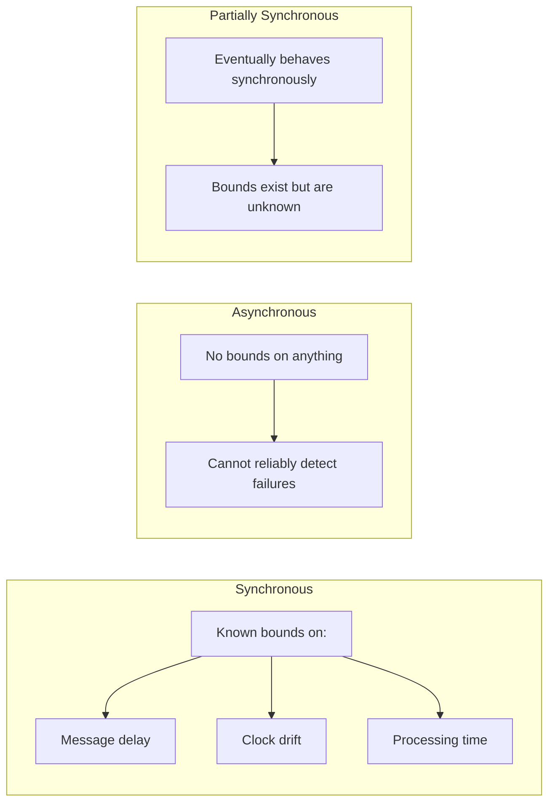
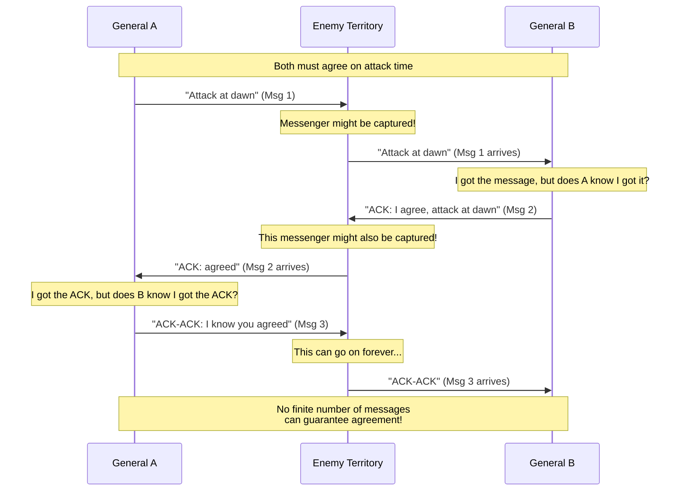
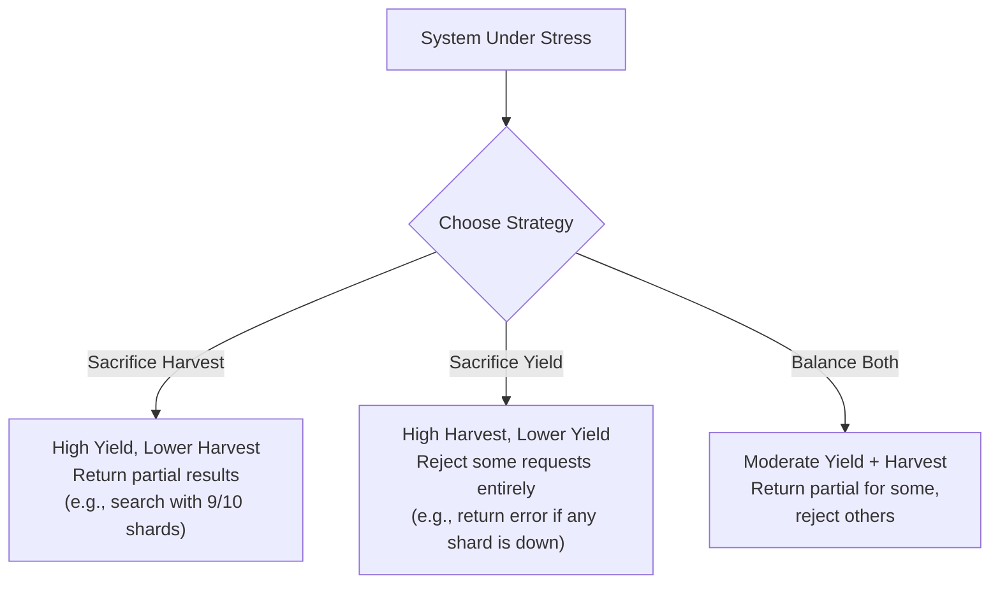

# Distributed Systems Fundamentals

## What Makes a System "Distributed"?

A distributed system is a collection of independent computers that appears to its users as a single coherent system. Three defining characteristics separate distributed systems from centralized ones:

### 1. Multiple Machines (Nodes)
The system runs across two or more physical or virtual machines. Each node has its own local memory and processor -- there is no shared memory between them.

### 2. Network Communication
Nodes communicate exclusively by passing messages over a network. This introduces latency, potential message loss, and ordering ambiguity that simply do not exist in single-machine programs.

### 3. No Shared Global Clock
There is no single clock that all nodes agree on. Each machine has its own local clock, and those clocks drift apart over time. This makes "what happened first?" a fundamentally hard question.

```
+----------+        Network         +----------+
|  Node A  | <---  (unreliable) --> |  Node B  |
| Clock: T1|     messages can:      | Clock: T2|
| Memory: M|     - be delayed       | Memory: N|
+----------+     - be lost          +----------+
       \         - arrive out        /
        \         of order          /
         \                         /
          +-------+-------+-------+
          |       Node C          |
          |      Clock: T3        |
          |      Memory: P        |
          +-----------------------+
          
  T1 != T2 != T3  (no shared clock)
  M, N, P are disjoint (no shared memory)
```

---

## Why Distribute? The Four Motivations

### 1. Scale (Handle More Load)
A single machine has finite CPU, memory, disk, and network bandwidth. Distributing work across many machines lets you handle orders of magnitude more requests.

- **Horizontal scaling**: Add more machines (scale out)
- **Vertical scaling**: Upgrade a single machine (scale up) -- has hard limits

### 2. Availability (Stay Up When Things Break)
Hardware fails. Disks die. Power goes out. By replicating data and logic across multiple machines, the system survives individual node failures.

- A single server with 99.9% uptime = ~8.7 hours down per year
- Three replicas independently: probability all three fail simultaneously = 0.001^3 = 10^-9

### 3. Latency (Geographic Proximity)
Physics imposes hard limits. Light takes ~67ms to travel from New York to London through fiber. By placing servers close to users, you reduce round-trip time.

| Route               | Fiber Latency (one-way) |
|---------------------|------------------------|
| NYC to London       | ~67 ms                 |
| NYC to Tokyo        | ~100 ms                |
| NYC to San Francisco| ~40 ms                 |
| Same data center    | ~0.5 ms                |

### 4. Fault Tolerance (Survive Partial Failures)
In a distributed system, part of the system can fail while the rest continues to operate. This is impossible with a single machine -- it is either up or down.

---

## Fundamental Challenges

### Network Unreliability
Messages can be lost, delayed, duplicated, or reordered. You can never distinguish between "the remote node is down" and "the network between us is down."

### Clock Skew
Even with NTP synchronization, clocks on different machines differ by milliseconds to hundreds of milliseconds. Two events happening "at the same time" on different machines have no inherent ordering.

### Partial Failures
Some nodes fail while others continue. The system must handle this gracefully. Worse: you often cannot tell whether a remote node has failed or is merely slow.

### Split Brain
When a network partition divides nodes into groups that cannot communicate, each group may independently believe it is the sole authority. Both groups may accept writes, leading to conflicting state.

---

## Fallacies of Distributed Computing

Peter Deutsch (and others at Sun Microsystems) identified eight assumptions that developers new to distributed systems incorrectly make. Each fallacy leads to real bugs in production.

### The Eight Fallacies

| # | Fallacy | Reality |
|---|---------|---------|
| 1 | **The network is reliable** | Packets are dropped, cables are cut, switches fail. Plan for message loss. |
| 2 | **Latency is zero** | Every network hop adds milliseconds. Cross-datacenter calls add 10-100ms. |
| 3 | **Bandwidth is infinite** | Sending 1GB over the network is not the same as reading 1GB from local disk. |
| 4 | **The network is secure** | Every message can be intercepted, spoofed, or tampered with. |
| 5 | **Topology doesn't change** | Servers are added, removed, and moved. Routers and switches are reconfigured. |
| 6 | **There is one administrator** | Different teams, companies, and jurisdictions operate different parts. |
| 7 | **Transport cost is zero** | Serialization, deserialization, and network I/O have real CPU and memory costs. |
| 8 | **The network is homogeneous** | Systems run different OS versions, hardware, protocols, and configurations. |

### Why These Matter in Interviews

When designing any distributed system, explicitly address these:
- **Fallacy 1**: What happens when a message is lost? Do you retry? Is the operation idempotent?
- **Fallacy 2**: How many network hops does the critical path require?
- **Fallacy 3**: How much data are you moving across the network? Can you reduce it?
- **Fallacy 4**: Is communication encrypted? Are endpoints authenticated?

---

## Synchronous vs Asynchronous Distributed Systems

### Synchronous Model
- Known upper bound on message delivery time
- Known upper bound on clock drift rate
- Known upper bound on process step execution time
- Timeouts are reliable: if you do not get a response in T time, the remote node is dead
- **Does not exist in practice** for internet-scale systems

### Asynchronous Model
- No upper bound on message delivery time (messages can be delayed arbitrarily)
- No upper bound on clock drift
- No upper bound on processing time
- Timeouts are unreliable: no response could mean crash OR slow
- **This is the real world** for most distributed systems

### Partially Synchronous Model
- The system behaves asynchronously most of the time, but there exists some (unknown) bound after which messages arrive
- **Most practical systems assume partial synchrony** -- they use timeouts but accept they might be wrong



---

## Failure Models

Failure models classify what can go wrong, from least severe to most severe.

### Fail-Stop
- A node either works correctly or stops permanently
- Other nodes can detect the failure (it is observable)
- Simplest model. Easy to reason about.
- Example: a server crashes and never comes back

### Crash-Recovery (Fail-Recovery)
- A node may crash and later recover
- It may lose its in-memory state but can recover from durable storage
- More realistic than fail-stop
- Example: a server reboots after a power outage

### Crash (Fail-Silent)
- A node stops sending messages, with no way for others to distinguish crash from network partition
- No notification to other nodes
- Example: a process is killed silently

### Byzantine Failures
- A node may behave arbitrarily: send wrong data, lie about its state, collude with other faulty nodes
- Most general and hardest to handle
- Requires 3f+1 nodes to tolerate f Byzantine faults (BFT)
- Relevant for: blockchain, financial systems, adversarial environments

```
Failure Severity Spectrum:

  Fail-Stop  <  Crash-Recovery  <  Crash (Silent)  <  Omission  <  Byzantine
  
  (easy to                                               (hardest to
   handle)                                                handle)
   
  - Detectable    - May recover     - Undetectable   - Arbitrary
  - Permanent     - Lose memory     - Silent         - Malicious
  - Clean         - Disk survives   - No signal      - Can lie
```

---

## The Two Generals Problem

The Two Generals Problem is the foundational impossibility result for unreliable communication channels.

### Setup
Two generals (A and B) must agree on a time to attack a city. They can only communicate by sending messengers through enemy territory (an unreliable channel). A messenger may be captured (message lost).

### The Dilemma



### Why It Is Impossible
- General A sends "attack at dawn." If B does not reply, A does not know if B got the message.
- B replies with an ACK. But B does not know if A got the ACK.
- A sends an ACK-ACK. But A does not know if B got the ACK-ACK.
- This regress is infinite. No finite exchange of messages can guarantee both generals know the other will attack.

### Practical Impact
This is why TCP uses a three-way handshake but still cannot guarantee perfect reliability. Real systems accept probabilistic guarantees (retry N times, give up after timeout) rather than perfect agreement over unreliable channels.

---

## FLP Impossibility Result

The Fischer-Lynch-Paterson (FLP) result (1985) is one of the most important theoretical results in distributed computing.

### Statement
**In an asynchronous distributed system where even one process can crash (fail-stop), there is no deterministic algorithm that solves consensus.**

### What This Means
- You cannot build a consensus protocol that is guaranteed to terminate in all possible executions if even one node might crash
- The key word is **deterministic** -- randomized algorithms can circumvent this (e.g., randomized consensus)
- The key assumption is **asynchronous** -- if you have timing bounds (partial synchrony), you can solve consensus

### Why This Matters
- It does NOT mean consensus is impossible in practice
- It means every practical consensus protocol (Paxos, Raft, PBFT) makes additional assumptions:
  - **Paxos/Raft**: Assume partial synchrony (progress when network is well-behaved)
  - **Randomized protocols**: Use randomization to break symmetry
  - **Timeout-based**: Use failure detectors that may be wrong

### The Three Properties of Consensus

A consensus protocol must satisfy:
1. **Agreement**: All non-faulty nodes decide the same value
2. **Validity**: The decided value was proposed by some node
3. **Termination**: All non-faulty nodes eventually decide

FLP says you cannot guarantee all three simultaneously in an asynchronous system with even one crash failure.

```
       FLP Impossibility Triangle:

              Agreement
               /    \
              /      \
             /  PICK  \
            /   TWO    \
           /            \
     Termination ------- Validity
     (liveness)         (safety)
     
  In async system with 1 crash:
  cannot guarantee all three.
  
  Practical protocols sacrifice termination
  (they may stall temporarily but resume
  when the network stabilizes).
```

---

## Harvest and Yield Model

Proposed by Fox and Brewer (1999), this model provides a more nuanced alternative to the binary "available or not" view from the CAP theorem.

### Definitions

- **Harvest**: Completeness of the answer. Fraction of the data reflected in the response.
  - Harvest = data in response / total data that should be in response
  - Full harvest = 1.0 (complete answer)
  - Reduced harvest = returning results from 9 of 10 shards (0.9)

- **Yield**: Probability of completing a request. Fraction of requests that get a response.
  - Yield = successful requests / total requests
  - Similar to availability, but measured per-request

### The Tradeoff
When the system is under stress (partition, overload, failures), you can trade harvest for yield or vice versa:



### Real-World Examples

| System | Under Failure | Strategy |
|--------|--------------|----------|
| Google Search | One index shard down | Sacrifice harvest: return results from available shards (users never notice) |
| Banking Transfer | Database partition | Sacrifice yield: reject request entirely rather than give wrong balance |
| News Feed | Recommendation service down | Sacrifice harvest: show chronological feed without personalization |
| E-commerce Cart | Inventory service slow | Sacrifice harvest: show cart but mark some items as "availability unknown" |

### Why This Beats Binary CAP Thinking
- CAP says "pick 2 of 3" -- but that oversimplifies
- Harvest/Yield says "you have dials to turn, not switches to flip"
- Different parts of the same system can make different tradeoffs
- The payment page demands full harvest; the recommendation sidebar does not

---

## Putting It All Together: Interview Framework

When discussing distributed systems in interviews, use this mental checklist:

```
1. WHY distribute?
   [ ] Scale beyond one machine
   [ ] Availability despite failures
   [ ] Low latency via geographic placement
   [ ] Fault tolerance

2. WHAT can go wrong?
   [ ] Network failures (partitions, message loss)
   [ ] Node failures (crash, Byzantine)
   [ ] Clock skew (ordering ambiguity)
   [ ] Split brain (conflicting authorities)

3. WHAT model are you in?
   [ ] Synchronous / Partially synchronous / Asynchronous
   [ ] Fail-stop / Crash-recovery / Byzantine

4. WHAT tradeoffs are you making?
   [ ] Consistency vs Availability (CAP)
   [ ] Harvest vs Yield
   [ ] Latency vs Consistency
   [ ] Simplicity vs Fault tolerance

5. WHAT impossibility results apply?
   [ ] Two Generals: no perfect agreement over lossy channel
   [ ] FLP: no deterministic consensus in async + 1 crash
   [ ] CAP: cannot have C + A + P simultaneously
```

---

## Key Definitions Quick Reference

| Term | Definition |
|------|-----------|
| **Node** | A single machine (physical or virtual) in the distributed system |
| **Message** | Data sent between nodes over the network |
| **Partition** | Network failure that splits nodes into disconnected groups |
| **Quorum** | Minimum number of nodes that must agree for an operation to proceed |
| **Consensus** | Process by which nodes agree on a single value |
| **Replication** | Maintaining copies of data on multiple nodes |
| **Idempotent** | An operation that produces the same result regardless of how many times it is applied |
| **Linearizable** | Operations appear to take effect at a single point in time |
| **Split brain** | Two or more groups of nodes independently believe they are the authority |
| **Liveness** | Something good eventually happens (the system makes progress) |
| **Safety** | Something bad never happens (the system never enters an invalid state) |

---

## Further Reading

- Lamport, "Time, Clocks, and the Ordering of Events in a Distributed System" (1978)
- Fischer, Lynch, Paterson, "Impossibility of Distributed Consensus with One Faulty Process" (1985)
- Brewer, "CAP Twelve Years Later: How the Rules Have Changed" (2012)
- Deutsch, "The Eight Fallacies of Distributed Computing"
- Kleppmann, "Designing Data-Intensive Applications" -- Chapters 5, 8, 9
