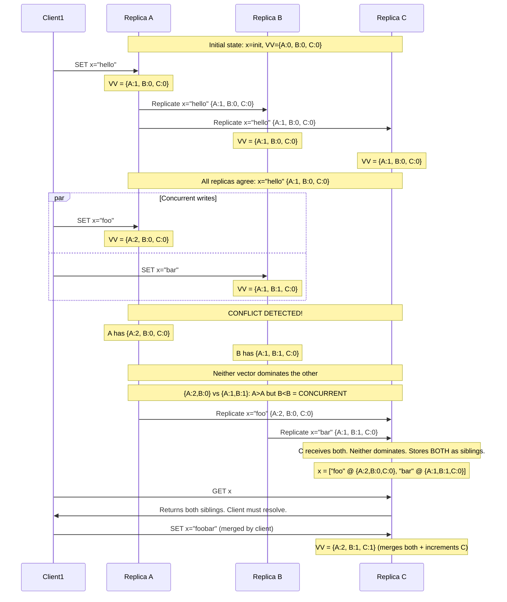
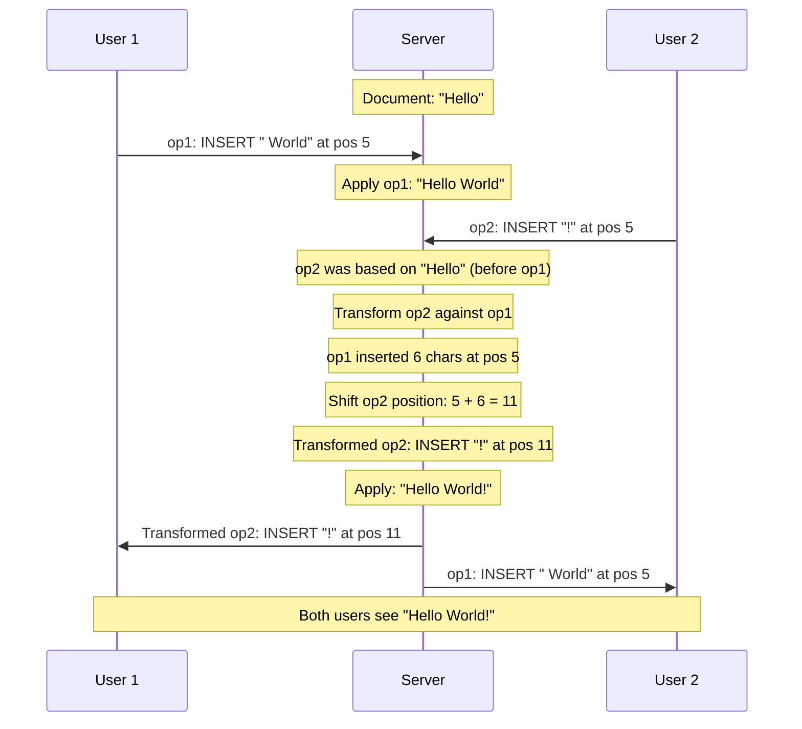

# Conflict Resolution in Distributed Systems

## Why Conflicts Happen

In any system where multiple replicas can accept writes independently
(multi-leader or leaderless), two clients can concurrently modify the same
data on different replicas. When those replicas sync, the changes conflict.

```
  Timeline ------>

  Replica A:  x=1  ----  client sets x=5  ----  sync  ---- ???
  Replica B:  x=1  ----  client sets x=8  ----  sync  ---- ???

  After sync: Replica A has x=5, Replica B has x=8.
  Which one wins? Both are "correct" from their replica's perspective.
  This is a write-write conflict.
```

Single-leader systems avoid this by funneling all writes through one node,
which serializes them. The moment you allow concurrent writes to different
replicas, you need a conflict resolution strategy.

---

## Last-Writer-Wins (LWW)

The simplest strategy: attach a timestamp (or unique ID) to each write.
When two writes conflict, the one with the higher timestamp wins.

```
  Replica A receives: SET x=5 at timestamp T=100
  Replica B receives: SET x=8 at timestamp T=102

  After replication:
    Both replicas compare timestamps.
    T=102 > T=100, so x=8 wins.
    Both replicas converge to x=8.
    The write x=5 is silently discarded.
```

**Problems with LWW:**

| Problem | Description |
|---------|-------------|
| **Data loss** | The "losing" write is silently discarded. If both writes were meaningful (e.g., two users adding items to a cart), one user's item disappears. |
| **Clock skew** | Distributed systems do not have perfectly synchronized clocks. A write that happened "later" in real time may have an earlier timestamp. NTP drift can be milliseconds to seconds. |
| **Not causal** | LWW does not respect causality. A write that causally depends on another write might "lose" to an unrelated write with a higher timestamp. |
| **Last = arbitrary** | With clock skew, "last" is essentially arbitrary. The "winner" is determined by which replica's clock runs faster, not by which write actually happened last. |

**When LWW is acceptable:**
- Immutable data (each key written once, then only read).
- Cache entries where losing a write means a cache miss, not data loss.
- Systems where simplicity and convergence matter more than correctness.

**Used by:** Cassandra (default conflict resolution), DynamoDB (if two puts
race), Redis (for basic key/value operations).

---

## Version Vectors

Instead of discarding one write, detect that a conflict exists and let the
application (or user) decide how to resolve it.

**Core idea:** Each replica maintains a vector of counters, one per replica.
When a replica processes a write, it increments its own counter. By comparing
version vectors, replicas can determine whether two writes are causally
related (one happened before the other) or concurrent (neither happened
before the other -- a conflict).

### How Version Vectors Work

```
  Version vector for an item: {A: 2, B: 1, C: 3}
  Meaning: Replica A has done 2 writes, B has done 1, C has done 3.

  Comparison rules:
    V1 <= V2  if every component of V1 is <= the corresponding component of V2
    V1 < V2   if V1 <= V2 and at least one component is strictly less
    V1 || V2  (concurrent) if neither V1 <= V2 nor V2 <= V1
```

### Step-by-Step Example with 3 Replicas



**Key insight:** When version vectors are concurrent (incomparable), the
system knows there is a conflict and preserves both values. The application
or user resolves it.

### Dotted Version Vectors (Improvement)

Standard version vectors can generate false conflicts: if a client reads
a value, does nothing, and writes it back, the system may treat it as
concurrent with another write that happened in between. Dotted version
vectors solve this by tracking the exact "dot" (event) associated with
each value, not just the vector clock.

```
  Standard VV: x="foo" @ {A:3, B:2}
    Problem: Was this value written at A:3? Or at A:1 and unchanged since?
    Cannot tell. May falsely detect conflict.

  Dotted VV: x="foo" @ dot=(A, 3), context={A:2, B:2}
    Clear: This value was written by event A:3.
    Context says the writer had seen A:2 and B:2 before writing.
    Any event covered by the context is NOT concurrent.
```

**Used by:** Riak (since version 2.0).

---

## CRDTs (Conflict-free Replicated Data Types)

CRDTs are data structures specifically designed so that concurrent updates
on different replicas can **always be merged automatically** without
conflicts. No coordination needed. No conflict resolution needed.

**Core property:** For any two replica states S1 and S2, a **merge**
function exists such that `merge(S1, S2)` is deterministic, commutative,
associative, and idempotent. Replicas converge by merging.

### G-Counter (Grow-Only Counter)

A counter that can only be incremented (never decremented).

**Problem with naive approach:**
```
  Replica A: counter = 5
  Replica B: counter = 3
  After merge: counter = ??? Is it 5? 8? 5+3=8 double-counts!
```

**G-Counter solution:** Each replica maintains its own count. The total is
the sum of all counts.

```
  Replica A's view: {A: 5, B: 3, C: 2}   total = 10
  Replica B's view: {A: 4, B: 3, C: 2}   total = 9

  (A has incremented once since last sync with B)

  Merge: take MAX of each component
  Merged: {A: max(5,4)=5, B: max(3,3)=3, C: max(2,2)=2}  total = 10
```

**Implementation:**

```python
class GCounter:
    def __init__(self, replica_id, num_replicas):
        self.id = replica_id
        self.counts = [0] * num_replicas  # one slot per replica

    def increment(self):
        self.counts[self.id] += 1

    def value(self):
        return sum(self.counts)

    def merge(self, other):
        """Merge another G-Counter into this one."""
        for i in range(len(self.counts)):
            self.counts[i] = max(self.counts[i], other.counts[i])


# Example:
# Replica 0 increments 3 times
a = GCounter(replica_id=0, num_replicas=3)
a.increment()  # counts = [1, 0, 0]
a.increment()  # counts = [2, 0, 0]
a.increment()  # counts = [3, 0, 0]

# Replica 1 increments 2 times
b = GCounter(replica_id=1, num_replicas=3)
b.increment()  # counts = [0, 1, 0]
b.increment()  # counts = [0, 2, 0]

# Merge: a.merge(b)
# a.counts = [max(3,0), max(0,2), max(0,0)] = [3, 2, 0]
# a.value() = 5  (correct! 3 + 2 = 5)
```

### PN-Counter (Positive-Negative Counter)

A counter that supports both increment and decrement.

**Implementation:** Two G-Counters: one for increments (P), one for
decrements (N). Value = P.value() - N.value().

```
  P (positive): {A: 5, B: 3}   -> total increments = 8
  N (negative): {A: 1, B: 2}   -> total decrements = 3
  Value = 8 - 3 = 5

  Merge: merge P counters, merge N counters independently.
```

### G-Set (Grow-Only Set)

A set where elements can only be added, never removed.

```
  Replica A: {apple, banana}
  Replica B: {banana, cherry}
  Merge: UNION = {apple, banana, cherry}
```

Merge is just set union. Elements never disappear once added.

### OR-Set (Observed-Remove Set)

A set that supports both add and remove. The tricky part: if one replica
adds an element while another removes it concurrently, what happens?

**Rule:** Add wins over concurrent remove. But if the remove happened
**after** observing the add (causally after), the remove wins.

**Implementation:** Each add generates a unique tag. Remove removes specific
tags. If a new add happens concurrently with a remove, the new tag survives.

```python
import uuid


class ORSet:
    def __init__(self):
        self.elements = {}  # element -> set of (unique_tag)

    def add(self, element):
        """Add element with a fresh unique tag."""
        tag = str(uuid.uuid4())
        if element not in self.elements:
            self.elements[element] = set()
        self.elements[element].add(tag)

    def remove(self, element):
        """Remove all currently observed tags for this element."""
        if element in self.elements:
            self.elements[element] = set()  # remove all known tags

    def lookup(self, element):
        """Check if element is in the set."""
        return element in self.elements and len(self.elements[element]) > 0

    def value(self):
        """Return all elements currently in the set."""
        return {e for e, tags in self.elements.items() if len(tags) > 0}

    def merge(self, other):
        """Merge another OR-Set into this one."""
        all_elements = set(self.elements.keys()) | set(other.elements.keys())
        for elem in all_elements:
            my_tags = self.elements.get(elem, set())
            other_tags = other.elements.get(elem, set())
            # Union of all tags
            self.elements[elem] = my_tags | other_tags


# Example:
# Replica A adds "milk", gets tag "abc"
# Replica B adds "milk", gets tag "def"
# Replica A removes "milk" (removes tag "abc")
# After merge: "milk" still in set because tag "def" from B survives
```

### LWW-Register (Last-Writer-Wins Register)

A single value register where the last write wins. Each write carries a
timestamp. On merge, the write with the highest timestamp wins.

```
  Replica A: value="hello", timestamp=100
  Replica B: value="world", timestamp=105

  Merge: timestamp 105 > 100, so value = "world"
```

This is technically a CRDT (merge is deterministic and convergent) but has
the same data-loss problem as LWW conflict resolution.

### Summary of CRDT Types

```
  +---------------+----------------------------+---------------------+
  | CRDT          | Operations Supported       | Merge Strategy      |
  +---------------+----------------------------+---------------------+
  | G-Counter     | increment                  | max per replica     |
  | PN-Counter    | increment, decrement       | max per counter     |
  | G-Set         | add                        | union               |
  | OR-Set        | add, remove                | union of tags       |
  | LWW-Register  | write                      | highest timestamp   |
  | LWW-Map       | put, delete                | per-key LWW         |
  | RGA           | insert, delete (list/text) | causal ordering     |
  +---------------+----------------------------+---------------------+
```

**Used by:**
- **Riak:** Ships multiple CRDT types (counters, sets, maps, flags).
- **Redis (CRDTs):** Redis Enterprise supports CRDT-based active-active
  geo-replication for counters, sets, and strings.
- **Figma:** Uses CRDTs for real-time collaborative design editing.
- **Apple Notes:** Uses CRDTs for multi-device sync.

---

## Operational Transformation (OT)

OT is the technique behind Google Docs, Google Sheets, and many real-time
collaborative editors. It predates CRDTs and takes a fundamentally different
approach.

### Core Idea

Instead of merging states, OT transforms **operations** so they can be
applied in any order and still produce the same result.

### Example: Two Users Typing Concurrently

```
  Initial document: "ABCD"

  User 1: INSERT 'X' at position 1  (between A and B)
           Expected result: "AXBCD"

  User 2: DELETE position 3          (delete 'D')
           Expected result: "ABC"

  Problem: If we apply both naively:
    Apply User 1 first: "ABCD" -> "AXBCD"
    Then User 2's DELETE at position 3: "AXBCD" -> "AXBD"  (deleted C, not D!)
    WRONG! User 2 intended to delete D, not C.
```

**OT solution:** Transform User 2's operation against User 1's operation.

```
  User 1's op: INSERT at position 1
  User 2's op: DELETE at position 3

  Transform: User 1 inserted before position 3, so shift User 2's
             position by +1.

  Transformed User 2's op: DELETE at position 4

  Apply:
    "ABCD" -> "AXBCD" (User 1's insert)
    "AXBCD" -> "AXBC" (User 2's transformed delete at pos 4)

  Result: "AXBC" -- both users' intentions preserved!
```

### How Google Docs Uses OT



**Key points:**
- The server is the source of truth for operation ordering.
- Each client sends operations based on its local state.
- The server transforms incoming operations against all operations that have
  been applied since the client's last known state.
- Transformed operations are broadcast to all other clients.

### Transformation Functions

For a text editor, you need transform functions for every pair of operation
types:

```
  transform(INSERT, INSERT):
    If ins1.pos <= ins2.pos: shift ins2.pos by ins1.length
    Else: shift ins1.pos by ins2.length

  transform(INSERT, DELETE):
    If ins.pos <= del.pos: shift del.pos by ins.length
    If ins.pos > del.pos: shift ins.pos by -1

  transform(DELETE, DELETE):
    If del1.pos < del2.pos: shift del2.pos by -1
    If del1.pos > del2.pos: shift del1.pos by -1
    If del1.pos == del2.pos: both delete same char, one becomes no-op
```

**Complexity:** The number of transformation functions grows quadratically
with the number of operation types. For rich text (bold, italic, indent,
lists, tables), this becomes extremely complex.

---

## OT vs CRDTs Comparison

| Aspect | OT | CRDTs |
|--------|----|----|
| **Approach** | Transform operations | Merge states |
| **Server Required?** | Yes (for ordering) | No (peer-to-peer works) |
| **Complexity** | O(n^2) transform functions for n op types | Complex data structure design, simpler merge |
| **Correctness** | Notoriously hard to prove correct | Mathematically provable convergence |
| **Offline Support** | Difficult (need server for transforms) | Excellent (merge when reconnected) |
| **Metadata Overhead** | Low (just operations) | High (version vectors, tombstones, tags) |
| **Latency** | Low (small operation deltas) | Low (small state updates) |
| **Undo Support** | Natural (inverse operations) | Difficult (no operation history) |
| **Maturity** | 30+ years (since 1989) | ~15 years (since ~2011 for practical use) |
| **Used By** | Google Docs, Google Sheets, Apache Wave | Figma, Apple Notes, Riak, Redis Enterprise |
| **Best For** | Text editing with central server | Distributed databases, P2P collaboration |

---

## Application-Level Merge Functions

When neither LWW nor CRDTs are sufficient, applications implement custom
merge logic.

### Strategy: Store All Conflicts, Resolve Later

```
  Database stores conflicting versions as "siblings":

  Key: shopping_cart
  Sibling 1: {items: [milk, eggs]}       @ version {A:1}
  Sibling 2: {items: [milk, bread]}      @ version {B:1}

  On next read, application receives both siblings.
  Application merges: {items: [milk, eggs, bread]}   (union)
  Application writes merged result back.
```

**Used by:** Riak (siblings), CouchDB (revision trees).

### Strategy: Domain-Specific Rules

```
  E-commerce cart:
    Conflict: User added "eggs" on phone, added "bread" on laptop
    Resolution: UNION of items (add both)

  Bank account:
    Conflict: Two concurrent debits
    Resolution: APPLY BOTH (both debits are real transactions)

  User profile:
    Conflict: Name changed to "Alice" on one device, "Alicia" on another
    Resolution: PRESENT BOTH to user, ask which is correct

  Inventory count:
    Conflict: Two warehouses report different stock levels
    Resolution: Take the MINIMUM (conservative -- prevents overselling)
```

### Strategy: Conflict-Free by Design

Structure your data model so conflicts cannot happen:

```
  Instead of: UPDATE counter SET value = value + 1   (conflict-prone)
  Use:        INSERT INTO increments (counter_id, delta) VALUES (42, +1)
              (append-only, no conflicts, sum on read)

  Instead of: UPDATE user SET address = '123 Main St'  (conflict-prone)
  Use:        INSERT INTO address_changes (user_id, address, timestamp)
              (append-only, take latest on read)
```

Event sourcing and append-only logs naturally avoid write-write conflicts
because you never modify existing data -- you only add new events.

---

## Conflict Resolution Decision Tree

```
  Do you need conflict resolution?
  |
  +-- Single-leader? --> NO. Leader serializes all writes.
  |
  +-- Multi-leader or leaderless?
      |
      +-- Is data loss acceptable?
      |   |
      |   +-- YES --> Last-Writer-Wins (LWW). Simple, fast, lossy.
      |   +-- NO  --> Continue below.
      |
      +-- Is the data a counter, set, or simple register?
      |   |
      |   +-- YES --> Use CRDTs. Auto-merge, no conflicts, proven correct.
      |   +-- NO  --> Continue below.
      |
      +-- Is it collaborative text editing?
      |   |
      |   +-- YES, with central server --> OT (Google Docs model)
      |   +-- YES, peer-to-peer       --> CRDTs (Yjs, Automerge)
      |   +-- NO  --> Continue below.
      |
      +-- Complex domain logic?
          |
          +-- Use version vectors to DETECT conflicts.
          +-- Store siblings (all conflicting versions).
          +-- Resolve with application-specific merge function.
```

---

## Interview Questions

**Q: Cassandra uses LWW. How can a developer prevent data loss from
concurrent writes?**

A: Avoid concurrent writes to the same key. Route all writes for a given
entity to the same coordinator. If unavoidable, use Cassandra's collection
types (which are CRDTs internally -- set additions and map updates merge
correctly). For general data, use lightweight transactions (Paxos-based
compare-and-set) for critical writes, though this sacrifices performance.

**Q: How do CRDTs achieve eventual consistency without coordination?**

A: CRDTs are designed so their merge function is commutative (order does not
matter), associative (grouping does not matter), and idempotent (merging the
same state twice is harmless). This means replicas can apply updates in any
order, merge at any time, and always converge to the same state. No leader,
no consensus, no locks needed.

**Q: Why did Google choose OT over CRDTs for Google Docs?**

A: Google Docs was built in the mid-2000s when CRDTs for text were not yet
practical. OT was mature and well-understood for text editing. OT also has
lower metadata overhead (just operations, not full state tracking) and
natural undo support. CRDTs for text (like Yjs, Automerge) have only
recently become efficient enough for production use.

**Q: How would you implement a collaborative shopping cart that syncs across
a user's phone and laptop?**

A: Model the cart as an OR-Set CRDT. Adding an item adds it with a unique
tag. Removing an item removes all observed tags. If one device adds item A
while the other removes item B, the merge naturally preserves both
operations (A is added, B is removed). If one device adds and the other
removes the same item concurrently, the add wins (OR-Set semantics), which
is the safer default for a shopping cart.

**Q: What are the downsides of CRDTs?**

A: (1) Metadata overhead -- version vectors, tombstones, and unique tags
grow over time. (2) Garbage collection is hard -- deleted items leave
tombstones that must be cleaned up. (3) Limited expressiveness -- not all
data structures have known CRDT implementations. (4) Complex to implement
correctly for non-trivial types. (5) Semantics may not match business
requirements (e.g., add-wins may not be desired for all use cases).

**Q: Explain the difference between a version vector and a vector clock.**

A: They are closely related but differ in what they track. A vector clock
tracks events per **process** (client or operation). A version vector tracks
updates per **replica** (server). In practice, version vectors are used for
replica-to-replica conflict detection (Dynamo-style), while vector clocks
track causal ordering of client operations. Riak switched from vector clocks
to dotted version vectors to reduce false conflicts caused by client-centric
tracking.
