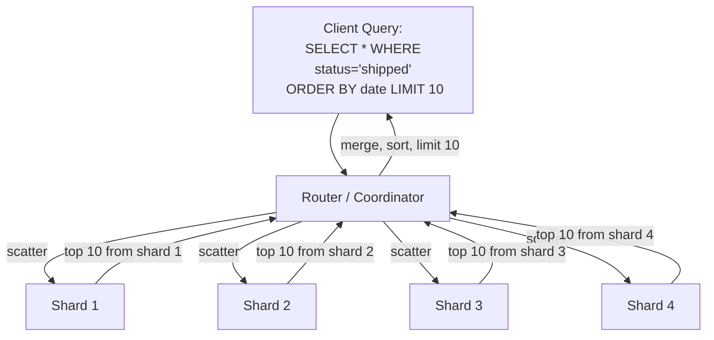
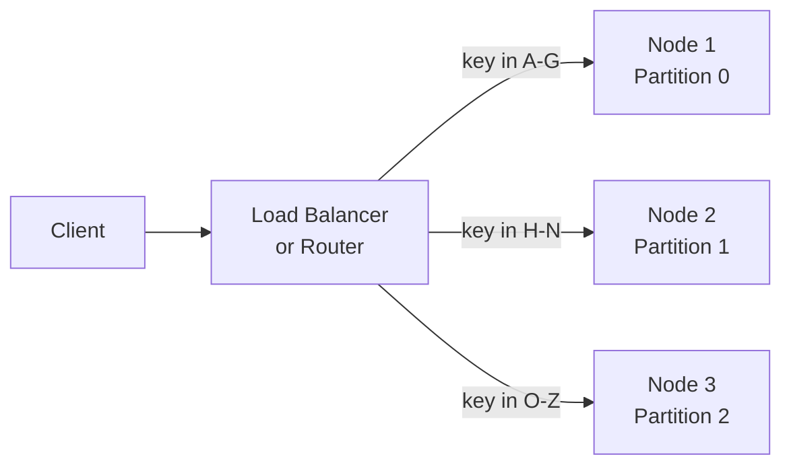

# Partitioning (Sharding) in Distributed Systems

## Why Partition?

When a dataset is too large for a single machine -- or when a single machine
cannot handle the query throughput -- you split the data across multiple
machines. Each piece is a **partition** (also called a **shard**, **vBucket**,
or **region** depending on the system).

```
  Single Machine (saturated)          Partitioned Across 4 Machines
  +---------------------------+       +--------+ +--------+ +--------+ +--------+
  |                           |       | Part 0 | | Part 1 | | Part 2 | | Part 3 |
  | 10 TB of data             |  -->  | 2.5 TB | | 2.5 TB | | 2.5 TB | | 2.5 TB |
  | 50,000 QPS                |       | 12.5K  | | 12.5K  | | 12.5K  | | 12.5K  |
  |                           |       | QPS    | | QPS    | | QPS    | | QPS    |
  +---------------------------+       +--------+ +--------+ +--------+ +--------+
```

**Two goals of partitioning:**
1. **Storage scaling:** Spread data so no single disk is the bottleneck.
2. **Query parallelism:** Spread load so no single CPU is the bottleneck.

**The hard part:** Choosing how to split the data so that queries are
efficient and load is evenly distributed.

---

## Partitioning Strategies

### 1. Range-Based Partitioning

Divide the key space into contiguous ranges. Each partition owns a range.

```
  Key Range            Partition
  ==================   =========
  A - G                Partition 0
  H - N                Partition 1
  O - T                Partition 2
  U - Z                Partition 3
```

**How routing works:**
- To find partition for key "Charlie" -> first letter C -> falls in A-G ->
  Partition 0.
- To find partition for key "Zebra" -> first letter Z -> falls in U-Z ->
  Partition 3.

**Pros:**
- Range queries are efficient. `SELECT * WHERE name BETWEEN 'Alice' AND 'Dave'`
  hits only Partition 0. No need to query all partitions.
- Data locality for sequential access patterns.
- Easy to understand and debug.

**Cons:**
- **Hotspots.** If keys are not uniformly distributed, some partitions get
  far more data and traffic. Classic example: partitioning by timestamp.
  All current writes go to the partition for "today." Historical partitions
  sit idle.
- Requires knowledge of key distribution to set range boundaries.
- Boundaries may need manual adjustment as data grows.

**Used by:** HBase (region servers), BigTable, traditional RDBMS table
partitioning.

### 2. Hash-Based Partitioning

Apply a hash function to the key, then assign to a partition based on the
hash value.

```
  partition = hash(key) % num_partitions

  Example with 4 partitions:
    hash("user_123") = 2918374  -> 2918374 % 4 = 2 -> Partition 2
    hash("user_456") = 8371029  -> 8371029 % 4 = 1 -> Partition 1
    hash("user_789") = 5028371  -> 5028371 % 4 = 3 -> Partition 3
```

**Pros:**
- Even distribution. A good hash function spreads keys uniformly across
  partitions, eliminating hotspots from skewed key distributions.
- No need to know the key distribution in advance.

**Cons:**
- **Range queries are destroyed.** Adjacent keys (user_123, user_124) hash
  to completely different partitions. A range scan must hit ALL partitions
  (scatter-gather).
- Adding/removing partitions with `hash % N` causes massive reshuffling
  (almost all keys change partition). Consistent hashing mitigates this.

**Used by:** DynamoDB (with consistent hashing), Cassandra (Murmur3
partitioner), Memcached.

### 3. Directory-Based Partitioning

A separate lookup service (directory) maps each key (or key range) to a
partition. The directory is a table:

```
  +---------------+-----------+
  | Key / Range   | Partition |
  +---------------+-----------+
  | user_1 - 1000 | Shard A   |
  | user_1001-2000| Shard B   |
  | user_2001-3000| Shard C   |
  +---------------+-----------+
```

**Pros:**
- Most flexible. Can move data between partitions without changing the
  partitioning scheme -- just update the directory.
- Supports arbitrary mappings (not constrained to range or hash).

**Cons:**
- The directory is a single point of failure and a bottleneck.
- Every query requires a lookup before accessing data.
- Directory must be highly available and low-latency (often cached).

**Used by:** HDFS NameNode, Apache Helix.

### 4. Compound Partitioning (Cassandra Approach)

Combine hash and range: hash the **first** part of the key to choose a
partition, then use **range** ordering within that partition.

```
  Table: user_posts
  Primary Key: (user_id, post_timestamp)
                  ^              ^
            partition key    clustering key
            (hashed)         (range-ordered within partition)

  hash(user_id) determines which partition stores the user's posts.
  Within that partition, posts are sorted by post_timestamp.

  Query: "Get all posts by user_42 from last 7 days"
    Step 1: hash("user_42") -> Partition 7
    Step 2: Within Partition 7, range scan on post_timestamp
    Result: Hits only ONE partition. Efficient!
```

**Why this is powerful:**
- The partition key (hash) distributes data evenly across nodes.
- The clustering key (range) enables efficient range queries within a
  partition.
- Best of both worlds -- if you design your keys correctly.

**Used by:** Cassandra (partition key + clustering columns), ScyllaDB.

---

## Shard Key Selection (CRITICAL)

The shard key determines how data is distributed. A bad shard key causes
hotspots, uneven load, and expensive queries. This is arguably the most
important decision in a sharded architecture.

### Properties of a Good Shard Key

| Property | Why It Matters |
|----------|---------------|
| **High cardinality** | Many distinct values = even spread. Shard key with only 5 values cannot spread across 100 shards. |
| **Even distribution** | Values should be roughly equally popular. A shard key where 80% of rows have the same value creates a hotspot. |
| **Matches query pattern** | Most queries should be able to target a single shard. If every query must hit all shards, you get scatter-gather overhead. |
| **Not monotonically increasing** | Timestamps, auto-increment IDs always write to the "latest" shard. Use hashing or compound keys. |
| **Immutable** | If the shard key changes, the row must be moved to a different shard. Expensive and error-prone. |

### Properties of a Bad Shard Key

| Bad Shard Key | Problem |
|---------------|---------|
| **Timestamp** | Monotonic -- all writes go to the latest partition. Read load is uneven (recent data is hot, old data is cold). |
| **Country code** | Low cardinality -- ~200 countries, but US/India/China have vastly more users. Massive hotspot on a few shards. |
| **Boolean field** | Only 2 values. Cannot spread across more than 2 shards. |
| **Frequently updated field** | Changing the shard key requires moving the row. |

### Worked Example: E-Commerce System

You have an `orders` table with columns: `order_id`, `user_id`,
`product_id`, `order_date`, `total`, `status`.

**Option A: Shard by `user_id`**
```
  Pros:
  - High cardinality (millions of users)
  - "Get all orders for user X" hits ONE shard (most common query)
  - Even distribution if user base is diverse

  Cons:
  - "Get all orders for product X" requires scatter-gather
  - Power users (enterprises with 100K orders) create shard hotspots
  - "Get all orders from last hour" hits ALL shards

  Verdict: GOOD choice if primary query pattern is by user.
```

**Option B: Shard by `order_date`**
```
  Pros:
  - Range queries by date are efficient

  Cons:
  - TERRIBLE for writes -- all new orders go to the "today" shard
  - Historical shards sit idle while current shard is overloaded
  - "Get orders for user X" hits ALL shards

  Verdict: BAD choice. Classic hotspot problem.
```

**Option C: Shard by `product_id`**
```
  Pros:
  - "Get all orders for product X" hits ONE shard
  - Moderate cardinality

  Cons:
  - Popular products (iPhone launch) create massive hotspot
  - "Get orders for user X" hits ALL shards
  - Very uneven distribution (bestsellers vs niche products)

  Verdict: BAD choice. Uneven distribution guaranteed.
```

**Option D: Shard by `order_id` (hashed)**
```
  Pros:
  - Perfectly even distribution (random hash)
  - No hotspots
  - High cardinality

  Cons:
  - EVERY query except by order_id requires scatter-gather
  - "Get all orders for user X" hits ALL shards
  - No range query support

  Verdict: OK if you mostly look up individual orders. Poor for analytics.
```

**Best approach:** Compound key `(user_id, order_date)`. Hash `user_id` for
partition selection, use `order_date` as clustering key within the partition.
Efficiently supports "all orders for user X in date range Y" -- the most
common query pattern.

---

## Hotspot Mitigation

Even with a good shard key, hotspots can emerge. Strategies:

### Salting

Add a random prefix to the shard key to spread writes across multiple
partitions.

```
  Without salting:
    Key "celebrity_user_99" -> hash -> always Shard 7
    All 10M followers writing to celebrity's feed -> Shard 7 overloaded

  With salting (salt = random number 0-9):
    Key "3_celebrity_user_99" -> hash -> Shard 2
    Key "7_celebrity_user_99" -> hash -> Shard 5
    Key "1_celebrity_user_99" -> hash -> Shard 9
    Writes spread across 10 shards!

  Cost: Reading requires querying all 10 salted versions and merging.
```

### Composite Keys

For time-series data, combine a high-cardinality field with the timestamp:

```
  Instead of:  partition_key = timestamp     (hotspot!)
  Use:         partition_key = sensor_id     (spread across sensors)
               clustering_key = timestamp    (range queries within sensor)
```

### Application-Level Routing

Detect hot keys in the application layer and handle them specially.

```
  if key in HOT_KEYS:
      # Split this key across multiple shards with a random suffix
      actual_key = f"{key}_{random.randint(0, 9)}"
  else:
      actual_key = key
```

Instagram does this for celebrity accounts -- posts from celebrities are
fanned out differently than posts from normal users.

---

## Cross-Shard Queries (Scatter-Gather)

When a query cannot be routed to a single shard, it must be sent to all
shards, and the results are gathered and merged. This is the
**scatter-gather** pattern.



**Performance characteristics:**
- Latency = latency of the **slowest** shard (tail latency problem).
- Each shard returns its local top-10. The coordinator merges 4 x 10 = 40
  results and picks the global top-10.
- For `LIMIT N` queries, each shard must return its own top-N, so total
  data transferred = N x num_shards.
- For aggregations (COUNT, SUM, AVG), each shard computes a partial result
  and the coordinator merges.

**Why scatter-gather is expensive:**
- Network roundtrip to every shard.
- Coordinator must wait for the slowest shard.
- Does not scale linearly -- adding shards increases scatter overhead.
- If one shard is down, the entire query fails (or returns partial results).

---

## Secondary Indexes with Partitioned Data

Secondary indexes (e.g., "find all orders with status=shipped") are
challenging in a partitioned system because the index must span data across
multiple partitions.

### Local Index (Document-Partitioned Index)

Each partition maintains its own secondary index covering only the data
in that partition.

```
  Partition 0 (users A-G)          Partition 1 (users H-N)
  +------------------------+      +------------------------+
  | Data:                  |      | Data:                  |
  |   Alice: red car       |      |   Harry: red car       |
  |   Bob: blue car        |      |   Ivan: green car      |
  |   Carol: red car       |      |   Kim: red car         |
  |                        |      |                        |
  | Local Index:           |      | Local Index:           |
  |   red -> [Alice,Carol] |      |   red -> [Harry,Kim]   |
  |   blue -> [Bob]        |      |   green -> [Ivan]      |
  +------------------------+      +------------------------+
```

**Query: "Find all users with red cars"**
- Must query BOTH partitions (scatter-gather).
- Partition 0 returns [Alice, Carol].
- Partition 1 returns [Harry, Kim].
- Coordinator merges: [Alice, Carol, Harry, Kim].

**Pros:** Writes are fast (update only the local index on the partition
that owns the data). No cross-partition coordination for writes.

**Cons:** Reads on the secondary index require scatter-gather. Latency
= slowest partition.

**Used by:** MongoDB, Cassandra, Elasticsearch (each shard has local index).

### Global Index (Term-Partitioned Index)

One global index covers all data, but the index itself is partitioned
(by the indexed term, not by the primary key).

```
  Data Partitions:               Index Partitions:
  +------------------+           +----------------------------+
  | Partition 0      |           | Index Partition: colors a-m|
  |   Alice: red     |           |   blue -> [Bob(P0)]       |
  |   Bob: blue      |           |   green -> [Ivan(P1)]     |
  +------------------+           +----------------------------+
  | Partition 1      |           | Index Partition: colors n-z|
  |   Harry: red     |           |   red -> [Alice(P0),      |
  |   Ivan: green    |           |           Carol(P0),      |
  +------------------+           |           Harry(P1),      |
                                 |           Kim(P1)]        |
                                 +----------------------------+
```

**Query: "Find all users with red cars"**
- Route to the index partition for "red" (colors n-z). ONE partition.
- Get [Alice, Carol, Harry, Kim] directly.
- No scatter-gather on reads!

**Pros:** Reads on the secondary index hit ONE index partition. Fast.

**Cons:** Writes are expensive. Inserting a new user with a red car requires
updating the index partition for "red," which may be on a different node
than the data partition. Cross-partition writes needed.

**Used by:** DynamoDB Global Secondary Indexes, Amazon Aurora.

### Comparison

| Aspect | Local Index | Global Index |
|--------|------------|-------------|
| **Write Speed** | Fast (local only) | Slow (cross-partition index update) |
| **Read Speed (secondary)** | Slow (scatter-gather) | Fast (single partition) |
| **Consistency** | Immediate | Often async (eventually consistent) |
| **Complexity** | Low | High |
| **Best When** | Write-heavy, rare secondary lookups | Read-heavy on secondary index |

---

## Rebalancing

Over time, partitions become uneven: some grow larger (more data), some
receive more traffic (hotter keys), or you add/remove nodes. Rebalancing
redistributes partitions across nodes.

### Strategy 1: Fixed Number of Partitions

Create many more partitions than nodes at the start. Assign multiple
partitions per node. When a new node joins, it steals partitions from
existing nodes.

```
  Initial: 3 nodes, 12 partitions (4 per node)

  Node A: [P0, P1, P2, P3]
  Node B: [P4, P5, P6, P7]
  Node C: [P8, P9, P10, P11]

  Add Node D: steal 1 partition from each existing node

  Node A: [P0, P1, P2]
  Node B: [P4, P5, P6]
  Node C: [P8, P9, P10]
  Node D: [P3, P7, P11]    <-- 1 from each
```

**Pros:** Simple. No splitting needed. Partition-to-node mapping changes but
partition boundaries do not.

**Cons:** Must choose the number of partitions upfront. Too few = cannot
split further when data grows. Too many = overhead per partition. Hard to
pick the right number for a dataset that grows 100x.

**Used by:** Elasticsearch, Riak, Couchbase, Voldemort.

### Strategy 2: Dynamic Splitting

Start with one partition. When it exceeds a size threshold, split it in half.
When it shrinks below a threshold, merge with an adjacent partition.

```
  Start:    [P0: 0-Z]

  P0 grows past 10 GB:
  Split:    [P0: 0-M] [P1: N-Z]

  P0 grows past 10 GB again:
  Split:    [P0: 0-F] [P2: G-M] [P1: N-Z]

  P1 grows past 10 GB:
  Split:    [P0: 0-F] [P2: G-M] [P1: N-S] [P3: T-Z]
```

**Pros:** Adapts to data size. Small datasets have few partitions (low
overhead). Large datasets have many (good parallelism).

**Cons:** Initially all data is on one partition (bottleneck during ramp-up).
Can be mitigated with pre-splitting.

**Used by:** HBase, MongoDB, RethinkDB.

### Strategy 3: Proportional to Nodes

Each node has a fixed number of partitions (e.g., 256 per node). When a new
node joins, it randomly splits existing partitions and takes half.

```
  Node A: 256 partitions
  Node B: 256 partitions

  Node C joins:
    Randomly picks 256 partitions from A and B.
    Splits each in half. Takes one half.

  Result: A ~171 partitions, B ~171 partitions, C ~170 partitions
```

**Pros:** Number of partitions grows with cluster size. Each node has
roughly equal load.

**Used by:** Cassandra (virtual nodes / vnodes).

### Rebalancing Comparison

| Strategy | Partition Count | When to Use | Pitfall |
|----------|----------------|-------------|---------|
| Fixed | Set at creation | Known data size, stable growth | Wrong initial choice |
| Dynamic Split | Grows/shrinks | Unpredictable data growth | Cold start (1 partition) |
| Node-Proportional | Grows with nodes | Elastic clusters | Random splits can be uneven |

---

## Request Routing

How does a client know which partition (and which node) to query?



**Three approaches:**

1. **Client-side routing:** Client knows the partition map and routes
   directly to the correct node. Fast (no extra hop) but clients must stay
   updated when partitions move.

2. **Routing tier:** A dedicated proxy/router maintains the partition map.
   Clients send all requests to the router. Adds latency but simplifies
   clients.

3. **Gossip protocol:** Nodes gossip partition ownership among themselves.
   Client can contact any node; if that node does not own the partition, it
   forwards the request.

| Approach | Latency | Client Complexity | Used By |
|----------|---------|-------------------|---------|
| Client-side | Lowest (direct) | High (must track partitions) | Cassandra driver |
| Routing tier | Medium (extra hop) | Low (just knows router) | MongoDB mongos, Redis Cluster Proxy |
| Gossip/Forward | Medium (possible forward) | Low (any node works) | Cassandra (gossip), Redis Cluster |

**ZooKeeper/etcd pattern:** A coordination service (ZooKeeper, etcd) stores
the authoritative partition map. When partitions are reassigned, ZooKeeper
notifies all routers/clients. Used by HBase, Kafka, SolrCloud.

---

## Interview Questions

**Q: You're designing a social media feed. How would you partition the posts
table?**

A: Shard by `user_id`. Most queries are "get posts by user X" which hits one
shard. The user's feed is built by fetching posts from followed users --
each fetch targets one shard. For the home timeline, fan-out-on-write
pre-computes the feed per user, which is also partitioned by `user_id`.
Avoid sharding by `post_id` (scatter-gather for user feeds) or by timestamp
(write hotspot on current time).

**Q: How do you handle a query that must access all shards?**

A: Scatter-gather. The coordinator sends the query to all shards in parallel.
Each shard returns a partial result. The coordinator merges. For `LIMIT N`,
each shard returns its top-N and the coordinator picks the global top-N.
For aggregations, each shard computes a partial aggregate. Optimize by
reducing the number of such queries through denormalization or pre-computed
materialized views.

**Q: A partition is much larger than others. What do you do?**

A: This is a hot partition or data skew problem.
1. If using fixed partitions, split the hot partition (requires dynamic
   splitting support or manual resharding).
2. If the hotspot is caused by a single key (e.g., celebrity user), use
   salting: add a random prefix to spread writes across multiple partitions,
   then scatter-gather on reads.
3. Long-term: re-evaluate the shard key. It may have low cardinality or
   poor distribution.

**Q: What is the difference between partitioning and replication?**

A: Partitioning splits data across nodes (each node has a different subset).
Replication copies the same data across nodes (each node has the same data).
They are complementary: partition for scale, replicate each partition for
availability. A typical setup: 4 partitions, each replicated 3 times =
12 total copies across the cluster.

**Q: You add a new node to a hash-partitioned cluster. How do you minimize
data movement?**

A: Use consistent hashing. Instead of `hash(key) % N` (which reshuffles
almost everything when N changes), assign each node to positions on a hash
ring. A new node takes over only the keys in its segment of the ring.
With virtual nodes, each physical node occupies multiple positions for
better load distribution. Only ~1/N of the data needs to move.

**Q: When would you use a global secondary index vs a local secondary
index?**

A: Use global when reads on the secondary index are frequent and must be
fast (one partition lookup). Use local when writes are frequent and the
secondary index is queried rarely (avoids cross-partition index updates).
DynamoDB GSIs are eventually consistent because updating the global index
asynchronously avoids slowing down writes.
