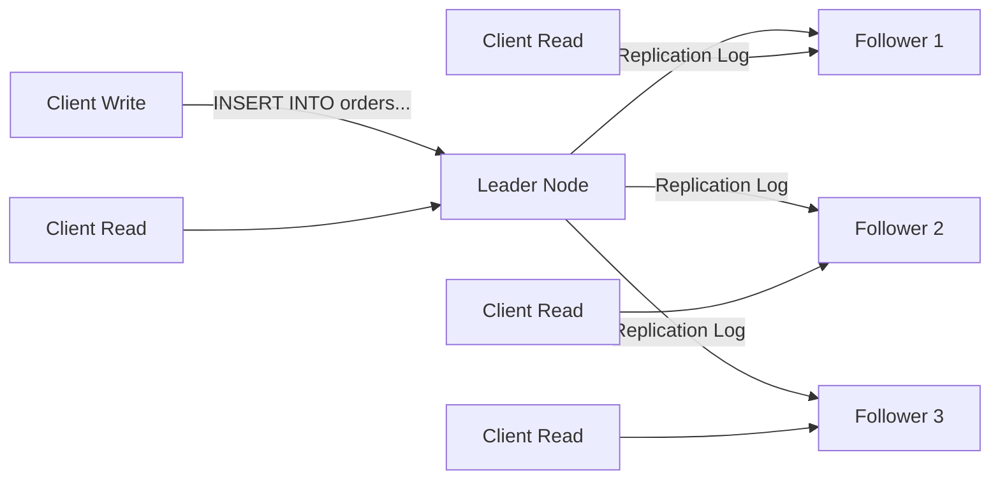
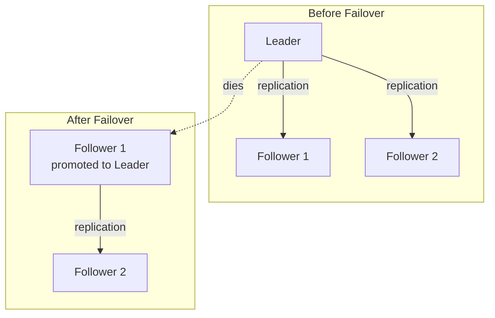
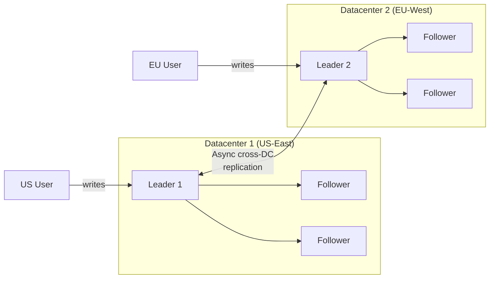
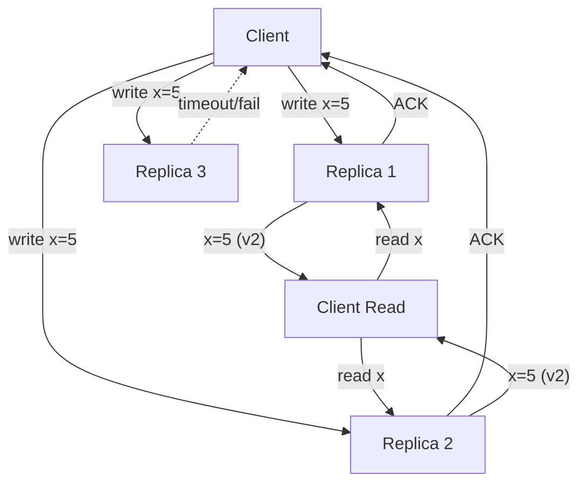

# Replication in Distributed Systems

## Why Replicate?

Replication means keeping copies of the same data on multiple machines.
Every serious distributed system uses replication for three fundamental reasons:

```
  +------------------+--------------------------------------------------+
  | Goal             | How Replication Helps                            |
  +------------------+--------------------------------------------------+
  | Availability     | If one node dies, others still serve requests.   |
  |                  | Tolerate N-1 failures with N replicas.           |
  +------------------+--------------------------------------------------+
  | Read Scaling     | Spread read load across many replicas.           |
  |                  | Write load still funnels through leader(s).      |
  +------------------+--------------------------------------------------+
  | Geographic       | Place replicas near users. EU users read from    |
  | Locality         | EU replica; US users from US replica.            |
  |                  | Latency drops from 200ms to 5ms.                 |
  +------------------+--------------------------------------------------+
  | Durability       | Data survives disk failures, rack fires,         |
  |                  | datacenter outages.                              |
  +------------------+--------------------------------------------------+
```

The hard problem is not copying data -- it is keeping replicas **consistent**
as data changes. Every replication strategy is a different answer to that
problem.

---

## Single-Leader Replication (Master-Slave)

The most common replication topology. One node is the **leader** (master);
all others are **followers** (slaves/replicas). All writes go to the leader.
The leader streams changes to followers.

### How It Works



**Step-by-step:**
1. Client sends a write to the leader.
2. Leader writes to its local storage and appends to its **replication log**
   (WAL in Postgres, binlog in MySQL, oplog in MongoDB).
3. Leader sends the log entry to all followers.
4. Each follower applies the log entry to its own copy of the data.
5. Reads can go to **any** node (leader or follower).

### Synchronous vs Asynchronous Replication

The critical question: does the leader wait for followers to confirm before
acknowledging the write to the client?

| Aspect | Synchronous | Asynchronous |
|--------|------------|--------------|
| **Durability** | Write confirmed on 2+ nodes before ACK | Write confirmed on leader only |
| **Latency** | Higher -- must wait for slowest follower | Lower -- leader ACKs immediately |
| **Availability** | One slow/dead follower blocks all writes | Writes proceed even if followers lag |
| **Data Loss Risk** | Zero (confirmed on multiple nodes) | Possible (leader dies before replication) |
| **Consistency** | Strong -- followers always up to date | Eventual -- followers may lag behind |
| **Throughput** | Lower -- bounded by network RTT | Higher -- leader is not bottlenecked |
| **Used By** | Etcd, ZooKeeper (via consensus) | MySQL default, Postgres streaming |

### Semi-Synchronous Replication

Pure synchronous is impractical (any one slow follower blocks everything).
Pure async risks data loss. The compromise:

```
  Leader -----> Follower A (SYNCHRONOUS)  -- must ACK before client gets OK
         \
          +---> Follower B (ASYNC)        -- best-effort, may lag
          +---> Follower C (ASYNC)        -- best-effort, may lag
```

**Rules:**
- Exactly **one** follower is synchronous at any time.
- If the sync follower becomes slow or unresponsive, another follower is
  promoted to be the sync one.
- Guarantees that at least **two** nodes (leader + one follower) have every
  confirmed write.

**Used by:** MySQL semi-sync replication, PostgreSQL synchronous_commit.

### Replication Lag

With async replication, followers can fall behind the leader. The difference
between the leader's latest write and a follower's latest applied write is
the **replication lag**.

```
  Timeline ------>

  Leader:    W1  W2  W3  W4  W5  W6  W7  W8
                                              ^-- current position

  Follower:  W1  W2  W3  W4  W5
                                ^-- lag = 3 writes behind
```

**What causes lag:**
- Network congestion between leader and follower
- Follower is under heavy read load (CPU starved for applying writes)
- Large transactions (e.g., bulk INSERT of 10M rows)
- Follower is geographically remote (cross-continent replication)

**How to measure:**
- MySQL: `SHOW SLAVE STATUS` -> `Seconds_Behind_Master`
- PostgreSQL: `pg_stat_replication` -> `replay_lag`
- Custom: write a timestamp to leader, read from follower, compute delta

**Why it matters:** Lag causes users to see stale data. The next sections
describe the specific anomalies and how to prevent them.

---

### Read-After-Write Consistency

**The problem:** A user writes data, then immediately reads it back, but
their read hits a follower that has not yet received the write. The user
thinks their write was lost.

```
  User writes comment --> Leader (write applied)
  User reads comments --> Follower (write NOT yet replicated)
  Result: "Where's my comment?!"
```

**Four strategies to guarantee read-after-write consistency:**

**Strategy 1: Read from Leader for User's Own Data**
- After a user writes, route their subsequent reads for that data to the
  leader (not a follower).
- Simple but increases leader load. Works well when users mostly read their
  own data (e.g., profile page).

**Strategy 2: Timestamp-Based Routing**
- Track the timestamp of the user's last write (in a cookie or session).
- When the user reads, only route to followers whose replication position
  is past that timestamp.
- If no follower is caught up, read from the leader.

**Strategy 3: Logical Log Position**
- After a write, return the **log sequence number** (LSN) to the client.
- Client includes LSN in subsequent reads.
- The follower serving the read blocks until it has applied up to that LSN.
- Used by Amazon Aurora (reader endpoint waits for LSN).

**Strategy 4: User-Recent-Write Flag**
- Set a short-lived flag (e.g., 10 seconds) in the user's session after a
  write.
- While the flag is active, route all reads to the leader.
- After the flag expires, assume replication has caught up. Route to any node.
- Simplest to implement but relies on lag being bounded.

```
  +---------------------+------------+-------------+-----------+
  | Strategy            | Complexity | Leader Load | Precision |
  +---------------------+------------+-------------+-----------+
  | Read from leader    | Low        | High        | Perfect   |
  | Timestamp routing   | Medium     | Low         | Good      |
  | LSN-based           | High       | Low         | Perfect   |
  | Recent-write flag   | Low        | Medium      | Approx    |
  +---------------------+------------+-------------+-----------+
```

### Monotonic Reads

**The problem:** A user makes two reads in sequence. The first read hits
Follower A (which is caught up) and sees new data. The second read hits
Follower B (which is lagging) and sees **older** data. From the user's
perspective, data went **back in time**.

```
  Read 1 --> Follower A (up to date)   --> Sees comment posted at 10:05
  Read 2 --> Follower B (lagging)      --> Comment is GONE (not yet replicated)
  User: "The comment appeared and then disappeared!"
```

**Solution:** Ensure each user always reads from the **same** follower.
- Hash the user ID to a specific follower.
- If that follower dies, reassign, but the user may see an older snapshot
  (acceptable -- they just cannot go backward).
- This is called **session stickiness** or **monotonic reads guarantee**.

### Consistent Prefix Reads

**The problem:** If writes have a causal dependency (A causes B), a reader
might see B before A due to different replication speeds.

```
  User A writes: "How's the weather?"    (arrives at Follower X first)
  User B writes: "It's sunny!"           (arrives at Follower X second)

  Reader sees on Follower Y:
    "It's sunny!"              <-- arrived first (faster replication)
    "How's the weather?"       <-- arrived second

  Conversation looks backwards!
```

**Solution:** Ensure causally related writes go through the same partition
so their order is preserved.

---

### Failover

When the leader dies, a follower must be promoted to become the new leader.
This is **failover**.



**How failover works:**
1. **Detection:** Followers or a monitor notice the leader is unresponsive
   (typically via heartbeat timeout, e.g., 30 seconds).
2. **Election:** Followers elect a new leader. Usually the one with the most
   up-to-date replication log wins. Consensus (Raft, Paxos) may be used.
3. **Reconfiguration:** Clients and remaining followers are notified to send
   writes to the new leader.

**What can go wrong:**

| Problem | Description | Consequence |
|---------|-------------|-------------|
| **Lost writes** | The old leader had writes that were not yet replicated to the new leader. | Data loss. Those writes are permanently gone unless manually recovered. |
| **Split brain** | The old leader comes back online and still thinks it is the leader. Two leaders accept writes simultaneously. | Data divergence. Two conflicting versions of the same data. |
| **Premature failover** | A temporary network hiccup triggers failover. The old leader was actually fine. | Unnecessary disruption, possible split brain. |
| **Cascading failures** | The new leader is overloaded because it now handles writes + its existing reads. | New leader also fails, triggering another failover. |

**Mitigation:**
- **Fencing tokens:** After failover, issue an incrementing token. Only the
  node with the highest token can write to storage. Old leader's writes are
  rejected because its token is stale.
- **Kill the old leader:** Before promoting a new leader, ensure the old one
  is truly dead (STONITH: Shoot The Other Node In The Head).
- **Longer timeouts:** Reduce false positives but increase downtime during
  real failures.

---

## Multi-Leader Replication (Master-Master)

Each datacenter (or site) has its own leader. Each leader accepts writes
and replicates to all other leaders asynchronously.

### When to Use Multi-Leader

| Use Case | Why Single-Leader Fails | How Multi-Leader Helps |
|----------|------------------------|----------------------|
| **Multi-datacenter** | All writes must cross the WAN to one datacenter | Each DC has a local leader; low-latency writes everywhere |
| **Offline clients** | Mobile apps cannot reach the leader when offline | Each device is a "leader"; syncs when reconnected |
| **Collaborative editing** | Single leader is a bottleneck for concurrent edits | Each user's session acts as a leader |

### Architecture



### Conflict Resolution

The fundamental problem: two users concurrently write to different leaders.
When the writes are replicated, they conflict.

```
  User A in DC1: UPDATE users SET name='Alice' WHERE id=42
  User B in DC2: UPDATE users SET name='Bob'   WHERE id=42

  After replication: DC1 says 'Alice', DC2 says 'Bob'. Conflict!
```

**Resolution strategies:**

**Last-Writer-Wins (LWW)**
- Attach a timestamp to each write. The write with the latest timestamp wins.
- Simple but **loses data silently**. If two users edit concurrently, one
  edit is discarded without notification.
- Used by Cassandra by default.

**Merge Functions**
- Instead of picking a winner, merge the values.
- For a name field: concatenate ("Alice/Bob") or keep both versions.
- For a counter: add both increments.
- Requires domain-specific logic.

**Application-Level Resolution**
- Store all conflicting versions (siblings).
- Present them to the user or application for manual resolution.
- Most flexible but pushes complexity to the application.
- Used by CouchDB (revision trees).

### Conflict Avoidance

The best way to handle conflicts is to avoid them entirely:

- **Route by user:** All writes for a given user go to the same leader.
  User 42 always writes to DC1. No concurrent writes to different leaders
  for the same user.
- **Route by record:** Assign each record a "home" leader. Only that leader
  accepts writes for it.
- **Breaks down when:** The home leader fails, or the user travels to a
  different region and you want low-latency writes.

---

## Leaderless Replication (Dynamo-Style)

No leader at all. The client (or a coordinator node) writes to **multiple**
replicas directly and reads from **multiple** replicas directly.

### How It Works



**Write path:** Client sends write to all N replicas. Write succeeds if at
least **W** replicas acknowledge.

**Read path:** Client reads from all N replicas (or at least R). If replicas
disagree, client takes the value with the highest version number.

### Quorum: R + W > N

The quorum formula guarantees that reads and writes overlap on at least one
node that has the latest value.

```
  N = total replicas
  W = write quorum (min ACKs for write to succeed)
  R = read quorum  (min replicas to read from)

  Rule: R + W > N
```

**Common configurations:**

| N | W | R | R+W > N? | Trade-off |
|---|---|---|----------|-----------|
| 3 | 2 | 2 | 4 > 3 Yes | Balanced. Tolerates 1 failure for reads and writes. |
| 3 | 3 | 1 | 4 > 3 Yes | Strong writes, fast reads. Write blocked if any replica down. |
| 3 | 1 | 3 | 4 > 3 Yes | Fast writes, strong reads. Read must hit all replicas. |
| 5 | 3 | 3 | 6 > 5 Yes | High availability. Tolerates 2 failures. Used by large clusters. |
| 3 | 1 | 1 | 2 > 3 NO | Not a quorum. Reads may miss the latest write. |
| 3 | 2 | 1 | 3 > 3 NO | Not a quorum. Same problem: read might miss latest. |

**Why it works (visual):**

```
  N=3, W=2, R=2

  Replica 1: [x=5 v2]   <-- write landed here
  Replica 2: [x=5 v2]   <-- write landed here
  Replica 3: [x=3 v1]   <-- write did NOT land here (slow/failed)

  Read from any 2 replicas:
    {R1, R2} -> both have v2 -> return x=5  (correct)
    {R1, R3} -> R1 has v2, R3 has v1 -> return x=5 from v2  (correct)
    {R2, R3} -> R2 has v2, R3 has v1 -> return x=5 from v2  (correct)

  No matter which 2 replicas you read from, at least one has the latest write!
```

### Read Repair

When a client reads from multiple replicas and detects a stale replica, it
writes the latest value back to the stale replica.

```
  Client reads from R1 and R3:
    R1 returns x=5 (v2)   <-- up to date
    R3 returns x=3 (v1)   <-- stale

  Client detects R3 is stale.
  Client writes x=5 (v2) to R3.   <-- READ REPAIR

  Now R3 is up to date.
```

Read repair is **passive** -- it only fixes replicas that are actually read.
Rarely-read data may remain stale indefinitely. That is where anti-entropy
comes in.

### Anti-Entropy with Merkle Trees

A background process continuously compares replicas and fixes differences.
To avoid transferring all data, replicas use **Merkle trees** (hash trees).

```
  Merkle Tree for Replica Data
  ============================

  Each leaf is the hash of a key-value pair.
  Each internal node is the hash of its children.
  The root summarizes ALL data.

                     Root: H(AB|CD)
                    /              \
               H(AB)               H(CD)
              /     \             /      \
          H(A)     H(B)      H(C)      H(D)
           |        |         |         |
         key:A    key:B     key:C     key:D
         val:1    val:2     val:3     val:4

  Comparison between two replicas:
  ================================

  Step 1: Compare root hashes.
          If equal -> replicas are identical. Done.
          If different -> descend.

  Step 2: Compare H(AB) and H(CD) between replicas.
          Suppose H(AB) matches but H(CD) differs.

  Step 3: Compare H(C) and H(D).
          Suppose H(C) matches but H(D) differs.

  Step 4: Transfer only key:D between replicas.

  Result: Only the differing data is transferred.
          For 1 billion keys, only ~30 hash comparisons needed (log2).
```

**Advantage:** Minimal data transfer. Instead of comparing all keys, you
compare O(log N) hashes to find the differences.

**Used by:** DynamoDB, Cassandra, Riak.

### Sloppy Quorum and Hinted Handoff

A strict quorum requires W of the N **designated** replicas to be available.
But what if some of the N replicas are temporarily unreachable?

**Sloppy quorum:** Accept writes on **any** W reachable nodes, even if they
are not among the N designated replicas for that key. This improves write
availability at the cost of temporarily weaker consistency.

**Hinted handoff:** When a non-designated node accepts a write on behalf of
an unavailable replica, it keeps a "hint" -- a note saying "this data
belongs to replica X." When replica X comes back online, the hint is
forwarded to it.

```
  Normal: Key K maps to replicas {R1, R2, R3}
  R3 is temporarily down.

  Sloppy quorum:
    Client writes K to R1, R2, and R4 (R4 is not designated for K)
    R4 stores the write with a hint: "forward to R3 when it recovers"

  When R3 comes back online:
    R4 sends the hinted write to R3.
    R4 deletes its copy.
```

**Trade-off:** Higher write availability, but R + W > N no longer guarantees
you read the latest value (because the write may be on a non-designated node
that you do not read from).

---

## Chain Replication

A specialized topology for strong consistency with high throughput.

```
  Client Write --> [Head] --> [Middle] --> [Middle] --> [Tail] --> Client ACK
                                                          |
                                                   Client Read <--+
```

**How it works:**
1. Writes enter at the **head** of the chain.
2. Each node applies the write and forwards it to the next node.
3. The write is acknowledged only when the **tail** receives and applies it.
4. Reads are served **only** from the tail.

**Why it provides strong consistency:**
- The tail has seen every committed write (it is the last to receive them).
- Reads from the tail always see the latest committed state.
- No stale reads possible.

**Trade-offs:**

| Advantage | Disadvantage |
|-----------|-------------|
| Strong consistency without consensus protocol | Write latency = sum of all inter-node latencies |
| High read throughput (reads only from tail) | Single chain = single point of failure at each link |
| Simple to understand and implement | Adding/removing nodes requires reconfiguration |
| Write throughput can be high (pipelined) | Tail is a bottleneck for reads |

**Used by:** Microsoft Azure Storage (internally), CRAQ (Chain Replication
with Apportioned Queries -- allows reads from middle nodes for better
throughput while maintaining strong consistency).

---

## Replication Topology Comparison

| Property | Single-Leader | Multi-Leader | Leaderless | Chain |
|----------|:------------:|:------------:|:----------:|:-----:|
| **Write Target** | Leader only | Any leader | Any replica | Head only |
| **Read Target** | Any node | Any node | Any replica | Tail only |
| **Consistency** | Strong (sync) or Eventual (async) | Eventual (conflicts possible) | Eventual (quorum helps) | Strong |
| **Write Latency** | Low (async) or High (sync) | Low (local leader) | Low (parallel writes) | High (chain length) |
| **Conflict Handling** | None (single writer) | Required (LWW, merge, app-level) | Required (version vectors) | None (single chain) |
| **Availability** | Failover needed when leader dies | Tolerates DC failure | Tolerates minority failures | Chain break = reconfigure |
| **Complexity** | Low | High (conflict resolution) | Medium (quorum logic) | Low |
| **Best For** | Most OLTP workloads | Multi-DC writes, offline | High availability, low latency | Strong consistency, high throughput |
| **Examples** | PostgreSQL, MySQL, MongoDB | CouchDB, Tungsten | DynamoDB, Cassandra, Riak | Azure Storage, CRAQ |

---

## Replication Log Implementation

How does the leader actually send changes to followers? There are several
approaches to implementing the replication log.

### Statement-Based Replication

Send the actual SQL statements (INSERT, UPDATE, DELETE) to followers.

**Problem:** Non-deterministic functions like `NOW()`, `RAND()`, or
auto-incrementing columns produce different results on different replicas.
Side effects (triggers, stored procedures) may behave differently.
Largely abandoned.

### Write-Ahead Log (WAL) Shipping

Send the leader's WAL (the low-level byte changes to disk pages) to
followers. Followers replay the exact same byte-level changes.

**Used by:** PostgreSQL streaming replication.

**Problem:** WAL is tightly coupled to the storage engine format. You cannot
run different software versions on leader and followers (blocks zero-downtime
upgrades).

### Logical (Row-Based) Log Replication

Send a logical description of changes:
- INSERT: new values for all columns
- DELETE: primary key of the deleted row
- UPDATE: primary key + new values of changed columns

**Advantages:** Decoupled from storage format. Different versions can
coexist. Easy to consume by external systems (CDC -- Change Data Capture).

**Used by:** MySQL binlog (row-based format), Debezium, Maxwell.

### Trigger-Based Replication

Application-level triggers fire on data changes and write to a separate
changelog table. A separate process reads the changelog and replicates.

**Used by:** Oracle GoldenGate, Databus.
**Trade-off:** Most flexible but highest overhead and most error-prone.

---

## Setting Up a New Follower

When you add a new follower to an existing cluster, how does it catch up?

1. **Snapshot the leader:** Take a consistent snapshot of the leader's data
   at a known log position (e.g., PostgreSQL `pg_basebackup`).
2. **Copy snapshot to follower:** Transfer the snapshot to the new follower.
3. **Catch up:** The follower connects to the leader and requests all changes
   since the snapshot's log position.
4. **Steady state:** Once caught up, the follower processes ongoing changes
   in real time.

This avoids locking the leader during setup.

---

## Interview Questions

**Q: You have a MySQL primary with 3 read replicas. A user writes a comment
and immediately refreshes the page, but the comment is missing. What's
happening and how do you fix it?**

A: Classic replication lag problem. The write went to the primary but has not
yet replicated to the follower serving the read. Fixes:
1. Read from primary for the user's own data (read-after-write consistency).
2. Use timestamp-based routing: record the write timestamp, route reads to
   followers that are past that timestamp.
3. Use LSN-based: return the write's LSN to the client, have the follower
   wait until it reaches that LSN before serving the read.

**Q: How would you handle failover in a single-leader setup without losing
writes?**

A: Use semi-synchronous replication (one sync follower always has the latest
writes). On failover, promote the sync follower. To prevent split brain,
use fencing tokens -- the new leader gets a higher token, and the storage
layer rejects writes from the old leader's lower token.

**Q: When would you choose multi-leader over single-leader?**

A: When you need low-latency writes from multiple geographic regions and can
tolerate the complexity of conflict resolution. Example: a global SaaS app
with users in US, EU, and Asia. Each region gets a local leader so writes
do not cross the ocean. Conflicts are rare if you route users to their
home datacenter.

**Q: Why does DynamoDB use leaderless replication?**

A: DynamoDB prioritizes availability and low latency over strong consistency.
Leaderless with sloppy quorum means writes can succeed even when some
replicas are temporarily down. This gives predictable single-digit ms
latency at massive scale. The trade-off is eventual consistency (though
strongly consistent reads are available by reading from all replicas).

**Q: Explain the trade-off between R, W, and N in a quorum system.**

A: With N replicas, W is the number of ACKs needed for a write, R is the
number of replicas read. R + W > N guarantees overlap between read and
write sets, ensuring at least one replica in every read has the latest write.
Increasing W improves write durability but reduces write availability.
Increasing R improves read consistency but increases read latency. The
sweet spot depends on the read/write ratio and availability requirements.

**Q: What is the difference between read repair and anti-entropy?**

A: Read repair is reactive -- it fixes stale replicas when a client happens
to read from them and detects the staleness. Anti-entropy is proactive -- a
background process continuously compares replicas using Merkle trees and
syncs differences. Read repair misses data that is never read; anti-entropy
eventually fixes everything but consumes background resources.
