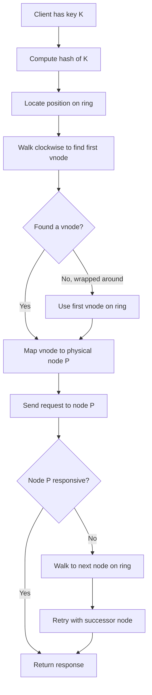
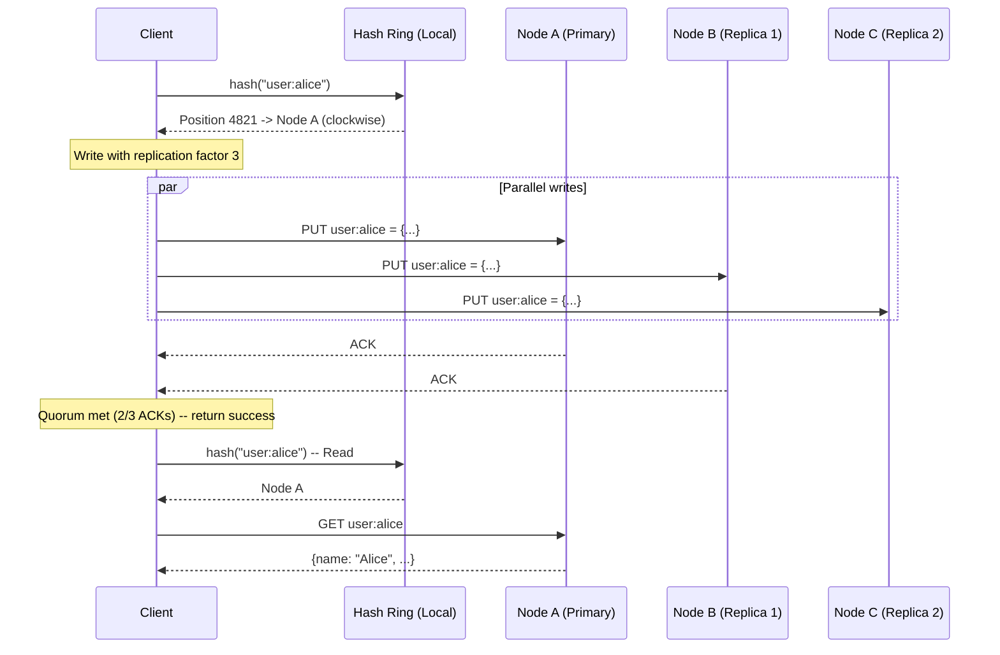

# Consistent Hashing

---

## The Problem: Naive Hashing Breaks at Scale

### Simple Hash Mod N

The most intuitive way to distribute keys across N servers:

```
server = hash(key) % N
```

This works perfectly -- until you add or remove a server.

```
Setup: 4 servers (N=4)

  hash("user:alice")   = 7      -> 7 % 4 = 3  -> Server 3
  hash("user:bob")     = 12     -> 12 % 4 = 0  -> Server 0
  hash("user:charlie") = 19     -> 19 % 4 = 3  -> Server 3
  hash("session:xyz")  = 25     -> 25 % 4 = 1  -> Server 1
  hash("cache:img42")  = 33     -> 33 % 4 = 1  -> Server 1
  hash("order:9001")   = 44     -> 44 % 4 = 0  -> Server 0
  hash("cart:abc")     = 51     -> 51 % 4 = 3  -> Server 3
  hash("pref:dave")    = 60     -> 60 % 4 = 0  -> Server 0
```

Now add a 5th server (N becomes 5):

```
  hash("user:alice")   = 7      -> 7 % 5 = 2  -> Server 2  MOVED (was 3)
  hash("user:bob")     = 12     -> 12 % 5 = 2  -> Server 2  MOVED (was 0)
  hash("user:charlie") = 19     -> 19 % 5 = 4  -> Server 4  MOVED (was 3)
  hash("session:xyz")  = 25     -> 25 % 5 = 0  -> Server 0  MOVED (was 1)
  hash("cache:img42")  = 33     -> 33 % 5 = 3  -> Server 3  MOVED (was 1)
  hash("order:9001")   = 44     -> 44 % 5 = 4  -> Server 4  MOVED (was 0)
  hash("cart:abc")     = 51     -> 51 % 5 = 1  -> Server 1  MOVED (was 3)
  hash("pref:dave")    = 60     -> 60 % 5 = 0  -> Server 0  stayed
```

**7 out of 8 keys moved -- that is 87.5% remapping.**

### Why This Is Catastrophic

In a distributed cache with hash mod N:

```
Before: 4 memcached servers, 10 million cached objects, 95% hit rate

Event: Add server #5

After:  ~80% of keys now map to wrong server
        -> Cache miss storm
        -> All requests hit the database
        -> Database overwhelmed
        -> Cascading failure

This is called a "thundering herd" or "cache stampede"
```

### The Math of the Damage

When going from N to N+1 servers:

```
Fraction of keys that move = N / (N+1)

  N=4  -> N=5:   4/5  = 80% keys move
  N=9  -> N=10:  9/10 = 90% keys move
  N=99 -> N=100: 99%  keys move

The more servers you have, the WORSE it gets.
```

The ideal would be moving only **1/N** of the keys (the minimum necessary). That is exactly what consistent hashing achieves.

---

## Consistent Hashing: The Hash Ring

### Core Concept

Instead of `hash(key) % N`, imagine the hash output space as a **ring** (circle):

1. The hash function outputs values from **0** to **2^32 - 1** (using something like MD5, SHA-1, or xxHash)
2. Conceptually connect the ends: position 0 is right after position 2^32 - 1
3. Place each **node** on the ring at position `hash(node_id)`
4. Place each **key** on the ring at position `hash(key)`
5. Walk **clockwise** from the key's position -- the first node you hit is responsible for that key

### ASCII Diagram: The Hash Ring

```
                          0 / 2^32
                            |
                     Node A (pos: 50)
                       /         \
                      /           \
                     /             \
                    /   Key k1      \
                   /    (pos: 120)   \
                  /        |          \
    Node D      /          v           \      Node B
  (pos: 900)  *     k1 -> Node B       *   (pos: 230)
                \                      /
                 \                    /
                  \    Key k2        /
                   \   (pos: 520)   /
                    \      |       /
                     \     v      /
                      \  k2->C   /
                       \       /
                     Node C (pos: 600)
                            |
                         ~2^32/2

  Ring positions (simplified to 0-999 for readability):

         0
         |
    900--+--50          Node A @ 50
    |         |
    |         |         Node B @ 230
   D|         |B
    |         230
    |         |
    |    C    |
    600--+--  |         Node C @ 600
         |
                        Node D @ 900
```

### Detailed Ring with Keys

```
  Hash Ring (0 to 999, wrapping around):

  Position:  0    50   120  230  380  520  600  750  900  999->0
             |    |    |    |    |    |    |    |    |    |
             +----A----+----B----+----+----C----+----D----+
                  ^    ^    ^         ^         ^    ^
                  |    |    |         |         |    |
               Node A  k1  Node B    k2     Node C  Node D
                       |              |
                       v              v
                  Walks CW to B   Walks CW to C

  Key Assignment:
    k1 (pos 120) -> walk clockwise -> hits Node B (pos 230)  => B owns k1
    k2 (pos 520) -> walk clockwise -> hits Node C (pos 600)  => C owns k2
    k3 (pos 750) -> walk clockwise -> hits Node D (pos 900)  => D owns k3
    k4 (pos 920) -> walk clockwise -> wraps past 999 -> hits Node A (pos 50) => A owns k4

  Each node owns the arc from itself back (counter-clockwise) to the previous node.
    Node A owns: (900, 50]     -- everything after D up to A
    Node B owns: (50, 230]     -- everything after A up to B
    Node C owns: (230, 600]    -- everything after B up to C
    Node D owns: (600, 900]    -- everything after C up to D
```

---

## Adding and Removing Nodes

### Adding a Node

Suppose we add **Node E** at position 400:

```
  BEFORE (4 nodes):
  Position:  0    50        230             600        900   999
             +----A---------B---------------C----------D-----+
                            |<--- B's arc --|
                            B owns (50, 230]
                            C owns (230, 600]

  AFTER adding E at 400 (5 nodes):
  Position:  0    50        230       400   600        900   999
             +----A---------B---------E-----C----------D-----+
                                      |
                            C's arc shrinks:
                            C now owns (400, 600]    -- was (230, 600]
                            E now owns (230, 400]    -- took from C

  Keys that move: ONLY keys in range (230, 400]
  Keys outside that range: UNCHANGED
```

**Only K/N keys move on average** (where K = total keys, N = number of nodes). This is the theoretical minimum.

### Removing a Node

Suppose Node B (position 230) fails:

```
  BEFORE (4 nodes):
  Position:  0    50   230             600        900   999
             +----A----B---------------C----------D-----+
                       |               |
                  B owns (50, 230]
                  C owns (230, 600]

  AFTER removing B (3 nodes):
  Position:  0    50                   600        900   999
             +----A--------------------C----------D-----+
                                       |
                  C now owns (50, 600]  -- absorbed B's keys
                  All of B's keys go to C (the next node clockwise)
                  No other keys move at all.
```

### Concrete Numeric Example

```
Setup: 3 nodes, hash space 0-99

  Node A @ position 15
  Node B @ position 45
  Node C @ position 75

  Key Distribution:
    A owns (75, 15]  -> positions 76-99, 0-15  (40 positions)
    B owns (15, 45]  -> positions 16-45         (30 positions)
    C owns (45, 75]  -> positions 46-75         (30 positions)

  10 keys placed:
    key1 @ 5   -> A     key6 @ 55  -> C
    key2 @ 12  -> A     key7 @ 62  -> C
    key3 @ 22  -> B     key8 @ 80  -> A
    key4 @ 33  -> B     key9 @ 88  -> A
    key5 @ 48  -> C     key10 @ 95 -> A

  Distribution: A=5, B=2, C=3

  ADD Node D @ position 60:
    A owns (75, 15]  -> same                    (still 40 positions)
    B owns (15, 45]  -> same                    (still 30 positions)
    D owns (45, 60]  -> NEW, took from C        (15 positions)
    C owns (60, 75]  -> shrunk                  (15 positions)

  Keys that moved:
    key5 @ 48 -> was C, now D   MOVED
    key6 @ 55 -> was C, now D   MOVED
    Everything else: unchanged

  Only 2 out of 10 keys moved (20%) -- close to ideal 1/N = 25%
```

---

## Virtual Nodes (Vnodes)

### The Problem with Basic Consistent Hashing

With only a few physical nodes, the ring is **unevenly partitioned**:

```
  3 physical nodes, hash space 0-999:

  Ideal: each node owns ~333 positions (33.3%)

  Reality (depends on hash positions):
    Node A @ 100  -> owns (800, 100] = 300 positions (30%)
    Node B @ 350  -> owns (100, 350] = 250 positions (25%)
    Node C @ 800  -> owns (350, 800] = 450 positions (45%)  <-- HOT SPOT

  C handles 45% of all keys while A handles 30%.
  With 3 nodes, standard deviation is enormous.
```

When a node goes down, the problem gets worse:

```
  Node A fails:
    Node B absorbs ALL of A's keys
    B now handles 25% + 30% = 55% of traffic
    C still handles 45%
    B:C ratio = 55:45 (should be 50:50)
```

### Virtual Nodes: The Solution

Each physical node creates **multiple virtual nodes** (vnodes) on the ring:

```
  Physical Node A -> vnode A-0, A-1, A-2, ... A-149   (150 vnodes)
  Physical Node B -> vnode B-0, B-1, B-2, ... B-149   (150 vnodes)
  Physical Node C -> vnode C-0, C-1, C-2, ... C-149   (150 vnodes)

  Total ring positions: 450 vnodes scattered around the ring
```

### ASCII Diagram: Ring with Virtual Nodes

```
  Without vnodes (3 physical nodes):

       0
       |
   C---+---A                      Uneven arcs!
   |       |                      A: 30%, B: 25%, C: 45%
   |       |
   C-------B
       |

  With vnodes (3 physical nodes, 4 vnodes each = 12 total):

       0
       |
  B2---+---A0
  |    A2  |
  C1       B0                     Much more evenly distributed!
  |    C0  |                      Each physical node's vnodes
  A1-------B1                     are spread around the ring.
  |    C2  |
  A3-------C3
       |

  Positions (simplified to 0-999):
    A0 @ 50    B0 @ 230   C0 @ 410
    A1 @ 320   B1 @ 520   C1 @ 150
    A2 @ 680   B2 @ 770   C2 @ 890
    A3 @ 940   B3 @ 610   C3 @ 70

  Sorted ring: C3(70), A0(50).. actually let's sort:
    50(A), 70(C), 150(C), 230(B), 320(A), 410(C), 520(B), 610(B), 680(A), 770(B), 890(C), 940(A)

  Now each physical node has 4 arcs spread around the ring.
  Statistical load balance is much better.
```

### How Many Virtual Nodes?

```
  Vnodes per node    Std Dev of load     Memory for routing
  ----------------   -----------------   -------------------
        1            Very high (~50%)    Tiny
       10            ~15%                Small
       50            ~7%                 Moderate
      100            ~5%                 ~100 entries/node
      150            ~4%                 150 entries/node (Cassandra default range)
      200            ~3.5%               200 entries/node
      500            ~2%                 Significant
     1000            ~1.5%               Large

  Sweet spot: 100-200 vnodes per physical node
  Amazon DynamoDB: ~200 virtual nodes
  Apache Cassandra: 256 vnodes (default since Cassandra 4.0 recommends tuning)
```

### Heterogeneous Hardware

Virtual nodes let you assign capacity proportional to hardware:

```
  Powerful server (32 cores, 256GB RAM):  300 vnodes  -> handles ~3x traffic
  Standard server (8 cores, 64GB RAM):   100 vnodes  -> handles 1x traffic
  Small server (4 cores, 32GB RAM):       50 vnodes  -> handles ~0.5x traffic

  The ring naturally routes proportional traffic to each machine.
```

### Trade-offs of Virtual Nodes

```
  Pros:
    + Much better load distribution
    + Smooth capacity transitions (add vnodes gradually)
    + Support heterogeneous hardware
    + When a node fails, its load is spread across ALL remaining nodes
      (not dumped onto one successor)

  Cons:
    - More memory for the routing table
      (N_physical * V_vnodes * entry_size)
      e.g., 100 nodes * 200 vnodes = 20,000 entries (~few hundred KB)
    - Rebalancing sends data to multiple nodes (more coordination)
    - Slightly more complex implementation
    - Token metadata overhead in gossip protocols
```

---

## Implementation

### Data Structure: Sorted Map / TreeMap

The ring is implemented as a **sorted map** (TreeMap in Java, SortedDict in Python):

```
Ring = TreeMap<Integer, String>  // hash_position -> node_id

Lookup algorithm:
  1. Compute hash(key) -> position
  2. Find the smallest key in the TreeMap >= position (ceiling)
  3. If no such key exists, wrap around to the first entry
  4. Return the associated node

Time complexity: O(log V)  where V = total virtual nodes on ring
Space complexity: O(V)
```

### Full Working Implementation (Python)

```python
import hashlib
from bisect import bisect_right


class ConsistentHashRing:
    """
    Consistent hash ring with virtual nodes.
    
    Used in: distributed caches, database sharding, load balancing.
    """
    
    def __init__(self, num_vnodes=150):
        self.num_vnodes = num_vnodes
        self.ring = {}              # hash_position -> physical_node
        self.sorted_keys = []       # sorted list of hash positions
        self.nodes = set()          # set of physical nodes
    
    def _hash(self, key: str) -> int:
        """
        Hash a string to a position on the ring [0, 2^32).
        Using MD5 for uniform distribution (not for security).
        """
        digest = hashlib.md5(key.encode('utf-8')).hexdigest()
        return int(digest[:8], 16)  # Use first 32 bits
    
    def add_node(self, node: str, num_vnodes: int = None) -> list:
        """
        Add a physical node with its virtual nodes to the ring.
        Returns list of (position, vnode_label) added.
        """
        if num_vnodes is None:
            num_vnodes = self.num_vnodes
        
        self.nodes.add(node)
        added = []
        
        for i in range(num_vnodes):
            vnode_key = f"{node}#vnode{i}"
            position = self._hash(vnode_key)
            self.ring[position] = node
            added.append((position, vnode_key))
        
        # Rebuild sorted keys (O(V log V) but done rarely)
        self.sorted_keys = sorted(self.ring.keys())
        return added
    
    def remove_node(self, node: str) -> int:
        """
        Remove a physical node and all its virtual nodes.
        Returns count of vnodes removed.
        """
        if node not in self.nodes:
            raise ValueError(f"Node {node} not found")
        
        self.nodes.discard(node)
        removed = 0
        
        # Remove all vnodes for this physical node
        positions_to_remove = [
            pos for pos, n in self.ring.items() if n == node
        ]
        for pos in positions_to_remove:
            del self.ring[pos]
            removed += 1
        
        self.sorted_keys = sorted(self.ring.keys())
        return removed
    
    def get_node(self, key: str) -> str:
        """
        Find which node is responsible for a given key.
        Walks clockwise from hash(key) to find the first node.
        
        Time: O(log V) where V = total virtual nodes
        """
        if not self.ring:
            raise Exception("Ring is empty")
        
        position = self._hash(key)
        
        # Binary search: find first ring position >= key's position
        idx = bisect_right(self.sorted_keys, position)
        
        # Wrap around if we've gone past the end
        if idx == len(self.sorted_keys):
            idx = 0
        
        ring_position = self.sorted_keys[idx]
        return self.ring[ring_position]
    
    def get_nodes_for_replication(self, key: str, replicas: int = 3) -> list:
        """
        Get N distinct physical nodes for replicating a key.
        Walks clockwise, skipping vnodes of already-selected physical nodes.
        """
        if len(self.nodes) < replicas:
            replicas = len(self.nodes)
        
        position = self._hash(key)
        idx = bisect_right(self.sorted_keys, position)
        
        selected = []
        seen_nodes = set()
        
        for _ in range(len(self.sorted_keys)):
            if idx >= len(self.sorted_keys):
                idx = 0
            
            ring_pos = self.sorted_keys[idx]
            node = self.ring[ring_pos]
            
            if node not in seen_nodes:
                selected.append(node)
                seen_nodes.add(node)
                if len(selected) == replicas:
                    break
            
            idx += 1
        
        return selected
    
    def get_distribution(self) -> dict:
        """
        Calculate what fraction of the ring each node owns.
        Useful for monitoring balance.
        """
        if not self.sorted_keys:
            return {}
        
        ownership = {node: 0 for node in self.nodes}
        total = 2**32
        
        for i in range(len(self.sorted_keys)):
            curr_pos = self.sorted_keys[i]
            prev_pos = self.sorted_keys[i - 1] if i > 0 else self.sorted_keys[-1]
            
            # Arc size from previous position to current
            if curr_pos > prev_pos:
                arc = curr_pos - prev_pos
            else:
                arc = (total - prev_pos) + curr_pos
            
            node = self.ring[curr_pos]
            ownership[node] += arc
        
        # Convert to percentages
        return {node: (count / total) * 100 
                for node, count in ownership.items()}


# ---------- Demo ----------

if __name__ == "__main__":
    ring = ConsistentHashRing(num_vnodes=150)
    
    # Add 4 nodes
    for node in ["cache-server-1", "cache-server-2", 
                  "cache-server-3", "cache-server-4"]:
        ring.add_node(node)
    
    print("=== Distribution with 4 nodes ===")
    for node, pct in sorted(ring.get_distribution().items()):
        print(f"  {node}: {pct:.1f}%")
    
    # Look up some keys
    test_keys = ["user:alice", "user:bob", "session:xyz", 
                 "order:9001", "product:42"]
    
    print("\n=== Key -> Node mapping ===")
    assignments_before = {}
    for key in test_keys:
        node = ring.get_node(key)
        assignments_before[key] = node
        print(f"  {key} -> {node}")
    
    # Add a 5th node
    ring.add_node("cache-server-5")
    
    print("\n=== After adding cache-server-5 ===")
    moved = 0
    for key in test_keys:
        node = ring.get_node(key)
        status = "MOVED" if node != assignments_before[key] else "same"
        if status == "MOVED":
            moved += 1
        print(f"  {key} -> {node}  ({status})")
    
    print(f"\n  Keys moved: {moved}/{len(test_keys)}"
          f" ({moved/len(test_keys)*100:.0f}%)")
    print(f"  Ideal (1/N): {1/5*100:.0f}%")
    
    # Replication example
    print("\n=== Replication for 'user:alice' (3 replicas) ===")
    replicas = ring.get_nodes_for_replication("user:alice", replicas=3)
    for i, node in enumerate(replicas):
        role = "primary" if i == 0 else f"replica-{i}"
        print(f"  {role}: {node}")
```

### Java Implementation (TreeMap-Based)

```java
import java.security.MessageDigest;
import java.security.NoSuchAlgorithmException;
import java.util.*;

public class ConsistentHashRing<T> {
    
    private final TreeMap<Long, T> ring = new TreeMap<>();
    private final Map<T, Integer> nodeVnodeCount = new HashMap<>();
    private final int defaultVnodes;
    
    public ConsistentHashRing(int defaultVnodes) {
        this.defaultVnodes = defaultVnodes;
    }
    
    private long hash(String key) {
        try {
            MessageDigest md = MessageDigest.getInstance("MD5");
            byte[] digest = md.digest(key.getBytes());
            // Use first 4 bytes as a long
            return ((long)(digest[0] & 0xFF) << 24)
                 | ((long)(digest[1] & 0xFF) << 16)
                 | ((long)(digest[2] & 0xFF) << 8)
                 | ((long)(digest[3] & 0xFF));
        } catch (NoSuchAlgorithmException e) {
            throw new RuntimeException(e);
        }
    }
    
    public void addNode(T node) {
        addNode(node, defaultVnodes);
    }
    
    public void addNode(T node, int vnodes) {
        nodeVnodeCount.put(node, vnodes);
        for (int i = 0; i < vnodes; i++) {
            long position = hash(node.toString() + "#vnode" + i);
            ring.put(position, node);
        }
    }
    
    public void removeNode(T node) {
        int vnodes = nodeVnodeCount.getOrDefault(node, defaultVnodes);
        for (int i = 0; i < vnodes; i++) {
            long position = hash(node.toString() + "#vnode" + i);
            ring.remove(position);
        }
        nodeVnodeCount.remove(node);
    }
    
    /**
     * O(log N) lookup -- TreeMap.ceilingEntry is a red-black tree search.
     */
    public T getNode(String key) {
        if (ring.isEmpty()) {
            throw new IllegalStateException("Ring is empty");
        }
        long position = hash(key);
        
        // ceilingEntry: smallest key >= position
        Map.Entry<Long, T> entry = ring.ceilingEntry(position);
        
        // Wrap around
        if (entry == null) {
            entry = ring.firstEntry();
        }
        return entry.getValue();
    }
    
    /**
     * Get N distinct physical nodes for replication.
     */
    public List<T> getNodesForReplication(String key, int replicas) {
        if (ring.isEmpty()) {
            return Collections.emptyList();
        }
        
        long position = hash(key);
        List<T> result = new ArrayList<>();
        Set<T> seen = new HashSet<>();
        
        // Get tail map starting from position, then wrap
        SortedMap<Long, T> tailMap = ring.tailMap(position);
        
        for (T node : tailMap.values()) {
            if (seen.add(node)) {
                result.add(node);
                if (result.size() == replicas) return result;
            }
        }
        // Wrap around from beginning
        for (T node : ring.values()) {
            if (seen.add(node)) {
                result.add(node);
                if (result.size() == replicas) return result;
            }
        }
        return result;
    }
}
```

### Complexity Analysis

```
Operation           Time Complexity    Notes
-----------------   ----------------   ------------------------------------
Add node            O(V log V)         V = vnodes for that node; rebuild sorted list
Remove node         O(V log V)         Same -- remove V entries, rebuild
Lookup key          O(log T)           T = total vnodes across all nodes
Get N replicas      O(N log T)         Walk ring, skip duplicates
Rebalance data      O(K/N)             K = total keys, N = nodes (data movement)
```

---

## Rendezvous Hashing (Highest Random Weight)

### An Alternative Approach

Rendezvous hashing (also called HRW hashing) takes a fundamentally different approach than consistent hashing. Instead of a ring, it computes a **score** for every node and picks the highest.

### How It Works

```
For a given key:
  1. For each node in the cluster:
       score(key, node) = hash(key + node)
  2. Pick the node with the highest score

That's it. No ring, no sorted map, no virtual nodes.
```

### Example

```
Key = "user:alice"
Nodes = [A, B, C, D]

  hash("user:alice" + "A") = 847291    
  hash("user:alice" + "B") = 123905    
  hash("user:alice" + "C") = 991204    <-- HIGHEST -> node C wins
  hash("user:alice" + "D") = 562847    

Key = "session:xyz"
  hash("session:xyz" + "A") = 338102    
  hash("session:xyz" + "B") = 772503   <-- HIGHEST -> node B wins
  hash("session:xyz" + "C") = 445921    
  hash("session:xyz" + "D") = 291847    
```

### What Happens When a Node is Added or Removed?

```
Remove node B:
  Key = "user:alice"
    hash("user:alice" + "A") = 847291    
    hash("user:alice" + "C") = 991204    <-- still HIGHEST
    hash("user:alice" + "D") = 562847    
    
    Result: still maps to C. No change!

  Only keys where B had the highest score are affected.
  Those keys move to their SECOND-highest-scoring node.
  Minimal disruption: exactly 1/N keys move.
```

### Python Implementation

```python
import hashlib

class RendezvousHash:
    """
    Rendezvous / Highest Random Weight hashing.
    Simple, minimal disruption, O(N) per lookup.
    """
    
    def __init__(self):
        self.nodes = {}  # node_name -> weight
    
    def add_node(self, node: str, weight: float = 1.0):
        self.nodes[node] = weight
    
    def remove_node(self, node: str):
        del self.nodes[node]
    
    def _score(self, key: str, node: str, weight: float) -> float:
        """Compute weighted score for a key-node pair."""
        h = hashlib.sha256(f"{key}:{node}".encode()).hexdigest()
        hash_val = int(h[:16], 16)
        # Apply weight: higher weight = higher score on average
        # Using -log(hash/max) * weight for proper weighted distribution
        return weight * hash_val
    
    def get_node(self, key: str) -> str:
        """
        O(N) -- must compute score for every node.
        """
        best_node = None
        best_score = -1
        
        for node, weight in self.nodes.items():
            score = self._score(key, node, weight)
            if score > best_score:
                best_score = score
                best_node = node
        
        return best_node
    
    def get_top_n(self, key: str, n: int) -> list:
        """
        Get top N nodes by score (for replication).
        O(N log N) due to sorting.
        """
        scores = []
        for node, weight in self.nodes.items():
            score = self._score(key, node, weight)
            scores.append((score, node))
        
        scores.sort(reverse=True)
        return [node for _, node in scores[:n]]
```

### Consistent Hashing vs Rendezvous Hashing

```
Criteria                Consistent Hashing       Rendezvous Hashing
---------------------   ----------------------   ----------------------
Lookup time             O(log N) with vnodes     O(N) -- check every node
Memory                  O(N * V) ring entries    O(N) -- just node list
Add/remove node         Rebuild part of ring     Just update node list
Keys moved              ~K/N (with vnodes)       Exactly K/N
Implementation          Moderate complexity       Very simple
Virtual nodes needed?   Yes, for balance          No -- naturally balanced
Weighted nodes          Via vnode count           Native weight parameter
Best for                Large N (100+ nodes)      Small N (< 50 nodes)

Where N = number of nodes, V = vnodes per node, K = total keys
```

### When to Use Each

```
Use Consistent Hashing when:
  - Large number of nodes (100+)
  - Need O(log N) lookups
  - Building distributed storage systems
  - Examples: DynamoDB, Cassandra, Memcached

Use Rendezvous Hashing when:
  - Small number of nodes (< 50)
  - Need simplest possible implementation
  - Need perfect minimal disruption guarantees
  - Need weighted distribution without virtual nodes
  - Examples: CDN origin selection, small cache clusters,
    GitHub load balancer (GLB), Microsoft's cache array routing
```

---

## Jump Hash (Google)

### A Third Option for Sequential Node IDs

Google's Jump Hash (2014 paper) is worth knowing. It only works when nodes are numbered 0 to N-1 (no arbitrary node names), but has remarkable properties:

```python
def jump_hash(key: int, num_buckets: int) -> int:
    """
    Google's Jump Consistent Hash.
    O(ln N) time, O(1) space, perfect balance, minimal disruption.
    Only works with sequential bucket IDs (0 to num_buckets-1).
    """
    b, j = -1, 0
    while j < num_buckets:
        b = j
        key = ((key * 2862933555777941757) + 1) & 0xFFFFFFFFFFFFFFFF
        j = int((b + 1) * (1 << 31) / ((key >> 33) + 1))
    return b
```

```
Properties:
  - O(ln N) time, O(1) space
  - Perfectly balanced: each bucket gets exactly 1/N of keys
  - Minimal disruption: exactly K/N keys move when going from N to N+1
  - Limitation: buckets must be numbered 0..N-1 (cannot remove arbitrary nodes)
  - Use case: sharding with sequential shard IDs, range-based partitioning
```

---

## Choosing a Hash Function

The hash function used in consistent hashing must prioritize **uniform distribution**, not cryptographic security:

```
Hash Function    Speed        Distribution    Common Usage
-------------    ----------   -------------   --------------------------
MD5              Moderate     Excellent       Memcached (ketama)
SHA-1            Moderate     Excellent       General purpose
MurmurHash3      Fast         Excellent       Cassandra, many apps
xxHash           Very fast    Excellent       High-throughput systems
FNV-1a           Fast         Good            Simple implementations
CRC32            Very fast    Adequate        Redis Cluster (CRC16)

Recommendation:
  - Production: MurmurHash3 or xxHash (fast + excellent distribution)
  - Prototyping: MD5 or SHA-1 (built into every standard library)
  - Avoid: naive string hash functions (poor distribution)
```

---

## Common Edge Cases and Pitfalls

### 1. Hash Collisions on the Ring

```
Problem: Two vnodes hash to the same ring position.
Solution: Ring implementation must handle this.
  - TreeMap naturally overwrites (last write wins) -- BUG!
  - Use a multimap or linked list at each position
  - In practice: with 2^32 space and ~20,000 vnodes, collision probability
    is very low (~0.005%) but nonzero
```

### 2. Hotspot Keys

```
Problem: Consistent hashing distributes keys evenly, but not load.
  One key might get 1000x more requests than average (celebrity tweet).

Solution: Not a hashing problem -- solve at application layer:
  - Read replicas for hot keys
  - Local caching with short TTL
  - Key splitting: "hot_key" -> "hot_key#shard0", "hot_key#shard1"
```

### 3. Rebalancing Data on Node Changes

```
Problem: When a node is added, keys need to physically MOVE.
  The ring tells you WHERE keys should be, not how to get them there.

Solution:
  1. New node determines its responsible key range
  2. Pulls data from the node that previously owned that range
  3. Old node continues serving until transfer completes
  4. Atomic switchover (or gradual with dual-reads)
```

### 4. Node Flapping

```
Problem: A node keeps joining and leaving the ring rapidly.
  Each change triggers data rebalancing.

Solution:
  - Delay ring changes (30-60 second stabilization window)
  - Use SWIM or similar protocol with suspicion mechanism
  - Uber Ringpop: "faulty" state before full removal
  - Cassandra: requires manual decommission for permanent removal
```

---

## Interview Framework: Consistent Hashing in 5 Minutes

When an interviewer asks "How would you distribute data across servers?" or "Design a distributed cache":

```
Step 1: State the problem with naive hashing (30 seconds)
  "hash(key) % N remaps nearly all keys when N changes"
  
Step 2: Introduce the hash ring (60 seconds)
  "Map hash space to a ring, place nodes and keys, walk clockwise"
  Draw a quick ring with 3-4 nodes

Step 3: Show the benefit (30 seconds)
  "Adding a node only moves K/N keys instead of ~all keys"

Step 4: Virtual nodes (60 seconds)
  "Physical nodes get 100-200 virtual positions for even distribution"
  "Handles heterogeneous hardware via proportional vnodes"

Step 5: Connect to the design (60 seconds)
  "In our cache design, each cache server is a node on the ring"
  "Client hashes the key, finds the server, sends request directly"
  "For replication: walk clockwise past the first node, pick next N-1 distinct nodes"

Step 6: Mention real-world usage (30 seconds)
  "DynamoDB, Cassandra, and Memcached all use variants of this"
```





---

## Summary: Key Numbers to Remember

```
+------------------------------------------+----------------------------+
| Metric                                   | Value                      |
+------------------------------------------+----------------------------+
| Keys moved with hash mod N (N -> N+1)    | ~N/(N+1) = nearly all     |
| Keys moved with consistent hashing       | ~K/N (minimum possible)    |
| Typical vnodes per node                  | 100-200                    |
| Cassandra default vnodes                 | 256 (tunable)              |
| DynamoDB vnodes                          | ~200 per node              |
| Ring lookup time                         | O(log V) with sorted map   |
| Rendezvous lookup time                   | O(N) per key               |
| Jump hash lookup time                    | O(ln N), O(1) space        |
| Hash space size                          | 2^32 (common) or 2^128     |
| Recommended hash function                | MurmurHash3 or xxHash      |
+------------------------------------------+----------------------------+
```
