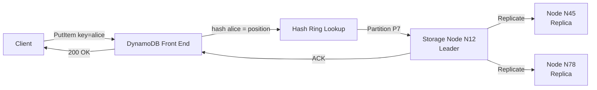
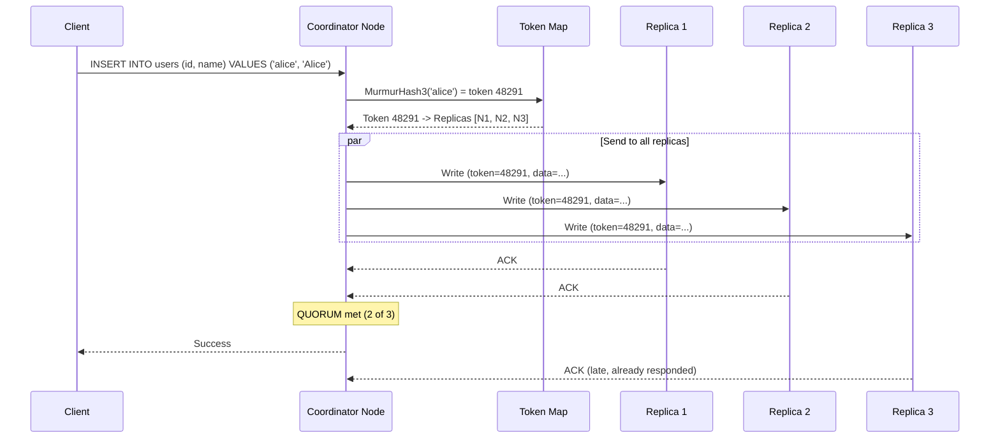
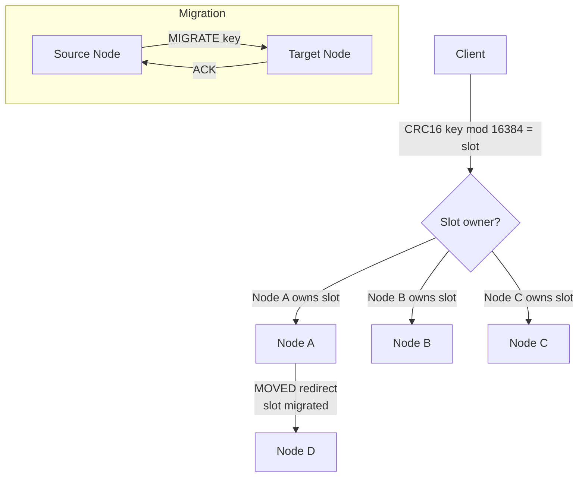
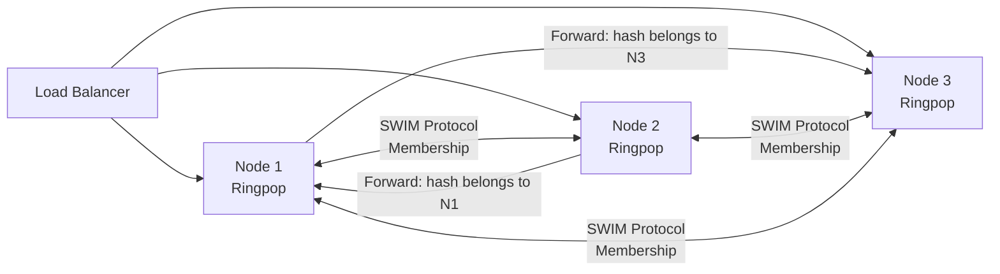
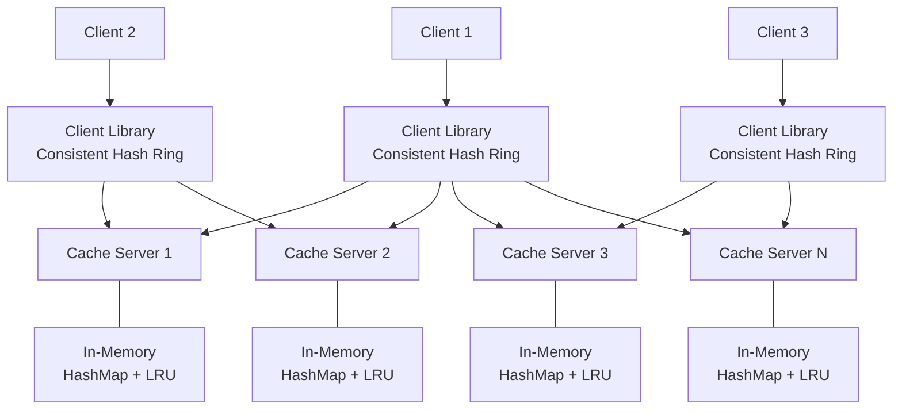

# Consistent Hashing: Real-World Usage

---

## Amazon DynamoDB

### How DynamoDB Uses Consistent Hashing

DynamoDB uses consistent hashing as the backbone of its partition assignment. Every table is split into partitions, and consistent hashing determines which partition (and therefore which storage node) owns a given item.

```
Write flow:
  1. Client sends PutItem(table="Users", key="alice")
  2. DynamoDB front-end hashes the partition key: hash("alice") -> position
  3. Consistent hash ring maps position -> partition P7
  4. P7 is hosted on storage node group [N12, N45, N78] (3 replicas)
  5. Write goes to leader of that replica group
```

### Key Design Decisions

```
- Virtual nodes: ~200 per physical node
- Hash function: MD5 (original Dynamo paper), evolved over time
- Replication: walk clockwise on ring, pick N distinct physical nodes
- Preference list: ordered list of nodes responsible for a key range
- Coordinator: first node in the preference list handles client requests
- Hinted handoff: if a node is down, neighbor temporarily stores its writes
```

### DynamoDB's Evolution

```
Original Dynamo (2007 paper):
  - Classic consistent hashing with virtual nodes
  - Each node independently chose random token positions
  - Problem: uneven ranges, complex rebalancing

Modern DynamoDB (production):
  - Moved toward controlled partition assignment
  - Automatic splitting when partitions get hot
  - Partition assignment is more centralized now
  - Still uses the hash ring concept for routing
```



---

## Apache Cassandra

### Token Ring Architecture

Cassandra's data distribution is built entirely on consistent hashing, which it calls the "token ring."

```
Cassandra Token Ring:
  - Hash space: -2^63 to 2^63-1 (using Murmur3Partitioner)
  - Each node owns a set of token ranges
  - Partition key -> token via MurmurHash3 -> assigned to owning node

  Example with 4 nodes in a single datacenter:

  Token Range          Node
  -------------------  ------
  (-2^63,   -2^62]     Node A
  (-2^62,    0]        Node B
  (0,        2^62]     Node C
  (2^62,     2^63-1]   Node D
```

### Virtual Nodes (vnodes) in Cassandra

```
Without vnodes (Cassandra < 1.2):
  - Each node gets ONE token (one position on the ring)
  - Manual token assignment required
  - Adding a node: manually recalculate all tokens
  - Rebalancing: single stream (slow)

With vnodes (default since Cassandra 1.2):
  - Each node gets 256 tokens (num_tokens in cassandra.yaml)
  - Tokens assigned randomly on bootstrap
  - Adding a node: automatically takes token ranges from all existing nodes
  - Rebalancing: parallel streams from multiple nodes (fast)

  num_tokens setting (cassandra.yaml):
    num_tokens: 256    # Default (Cassandra 3.x)
    num_tokens: 16     # Recommended for Cassandra 4.0+ with token allocation
```

### Cassandra Write Path with Consistent Hashing



### Token Allocation Strategies

```
Strategy 1: Random (original)
  - Each vnode gets a random token
  - Simple but can create imbalance
  - With 256 vnodes, balance is acceptable (within ~5%)

Strategy 2: Algorithmic (Cassandra 4.0+)
  - allocate_tokens_for_local_replication_factor setting
  - New node inspects existing token distribution
  - Chooses tokens that maximize balance
  - Recommended: num_tokens=16 with algorithmic allocation
    (better balance than num_tokens=256 random, less overhead)
```

---

## Memcached: Client-Side Consistent Hashing

### The Ketama Algorithm

Memcached servers have no knowledge of each other. Consistent hashing lives entirely on the **client side**. The standard implementation is called Ketama, originally developed at Last.fm.

```
Memcached Architecture:

  +--------+      +--------+      +--------+
  | Client |      | Client |      | Client |
  | (ring) |      | (ring) |      | (ring) |
  +---+----+      +---+----+      +---+----+
      |               |               |
      +-------+-------+-------+-------+
              |               |
         +---------+     +---------+     +---------+
         | Memcache|     | Memcache|     | Memcache|
         | Server 1|     | Server 2|     | Server 3|
         +---------+     +---------+     +---------+

  - Servers are independent (no inter-server communication)
  - Every client has the SAME hash ring configuration
  - Clients hash the key, determine which server to talk to
  - If all clients use the same ring, they agree on key placement
```

### Ketama Implementation Details

```
Ketama Algorithm:
  1. For each server, generate 100-200 points on the ring
     Points: MD5(server_address + "-" + i) for i in 0..N
  2. Each MD5 digest (16 bytes) produces 4 ring positions
     (using 4 groups of 4 bytes each)
  3. Total: ~160 positions per server on the ring (40 hashes * 4 points)

  Key lookup:
  1. MD5(key) -> 16 bytes -> use first 4 bytes as ring position
  2. Binary search the sorted ring for nearest clockwise server
  3. Send request to that server

Ketama Properties:
  - Adding a server: ~1/N keys move (minimal cache misses)
  - Removing a server: that server's keys distribute to others
  - All clients independently reach the same routing decision
  - Weights supported: more points on ring for higher-capacity servers
```

### Client Library Configuration

```python
# Python: pylibmc with consistent hashing
import pylibmc

mc = pylibmc.Client(
    ["10.0.1.1:11211", "10.0.1.2:11211", "10.0.1.3:11211"],
    behaviors={
        "ketama": True,           # Enable consistent hashing
        "ketama_weighted": True,  # Weight-aware distribution
        "remove_failed": 1,       # Remove dead servers from ring
        "retry_timeout": 1,       # Retry dead server after 1 second
        "dead_timeout": 60,       # Fully dead after 60 seconds
    }
)

# All operations automatically routed via consistent hashing
mc.set("user:alice", {"name": "Alice"})
result = mc.get("user:alice")  # Goes to same server
```

---

## Redis Cluster: Hash Slots (Not Consistent Hashing)

### A Different Approach

Redis Cluster does **not** use consistent hashing. Instead, it uses a fixed set of **16,384 hash slots**:

```
Redis Cluster Hashing:
  slot = CRC16(key) mod 16384

  Key "user:alice"  -> CRC16("user:alice")  mod 16384 = slot 9821
  Key "user:bob"    -> CRC16("user:bob")    mod 16384 = slot 4023
  Key "order:9001"  -> CRC16("order:9001")  mod 16384 = slot 12307

Slot Assignment (example with 3 nodes):
  Node A: slots 0-5460       (5461 slots)
  Node B: slots 5461-10922   (5462 slots)
  Node C: slots 10923-16383  (5461 slots)

  -> user:alice (slot 9821)  -> Node B
  -> user:bob   (slot 4023)  -> Node A
  -> order:9001 (slot 12307) -> Node C
```

### Why 16,384 Slots?

```
Redis chose 16384 = 2^14 for specific reasons:

1. Cluster metadata: each node sends a bitmap of slots it owns
   16384 bits = 2KB -- fits easily in heartbeat messages
   65536 (2^16) would be 8KB -- too large for frequent gossip

2. Practical limit: Redis Cluster recommends max ~1000 nodes
   16384 / 1000 = ~16 slots per node minimum -- sufficient granularity

3. CRC16 produces 16-bit output (0-65535)
   mod 16384 is fast (mask with 0x3FFF)
```

### Slot Migration (Resharding)

```
Adding Node D to a 3-node cluster:

  Before:
    Node A: [0, 5460]
    Node B: [5461, 10922]
    Node C: [10923, 16383]

  After (redistributing ~25% of slots to D):
    Node A: [0, 4095]           gave 1365 slots to D
    Node B: [5461, 9556]        gave 1366 slots to D
    Node C: [10923, 15018]      gave 1365 slots to D
    Node D: [4096,5460] + [9557,10922] + [15019,16383]

  Migration process for a single slot (e.g., slot 5000 from A to D):
    1. CLUSTER SETSLOT 5000 MIGRATING on Node A
    2. CLUSTER SETSLOT 5000 IMPORTING on Node D
    3. MIGRATE each key in slot 5000 from A to D
    4. CLUSTER SETSLOT 5000 NODE <D-id> on all nodes

  During migration:
    - Reads for slot 5000: A checks locally, if not found, sends ASK redirect to D
    - Writes for slot 5000: clients follow MOVED/ASK redirects
```



### Hash Tags for Multi-Key Operations

```
Redis requires multi-key operations to hit the SAME slot.
Hash tags force specific keys to the same slot:

  Normal:     CRC16("user:1000")      -> slot 7283
              CRC16("user:1000:cart") -> slot 12091  -- DIFFERENT slot!

  Hash tags:  CRC16("{user:1000}")      -> slot based on "user:1000"
              CRC16("{user:1000}:cart") -> slot based on "user:1000" -- SAME slot!

  Rule: if key contains {...}, only the content inside {} is hashed.
  This enables MGET, transactions, and Lua scripts on related keys.
```

---

## Uber Ringpop

### Consistent Hashing for Request Routing

Uber's Ringpop is an open-source library that provides application-layer consistent hashing with membership management.

```
Ringpop Architecture:
  - Each application instance is a node on a consistent hash ring
  - SWIM protocol detects node failures and membership changes
  - Requests are routed to the "owner" of a key via consistent hashing
  - If a request arrives at the wrong node, it's forwarded to the owner

Use case at Uber:
  - Trip management: hash(trip_id) -> specific service instance
  - Ensures all requests for a trip go to the same instance
  - Enables in-memory state (no external store needed for hot data)
  - Automatic rebalancing when instances scale up/down
```



### SWIM Protocol for Membership

```
SWIM (Scalable Weakly-consistent Infection-style Membership):

  1. Each node periodically PINGs a random other node
  2. If no ACK: ask K other nodes to PING-REQ the suspect
  3. If still no response: mark as SUSPECT
  4. After timeout: declare FAULTY and remove from ring
  5. Membership changes disseminated via piggybacked gossip

  Properties:
    - O(1) message load per node per period
    - Detection time: O(log N) protocol periods
    - False positive rate: tunable via suspicion timeout
    - Eventually consistent membership view across all nodes
```

---

## CDNs: Consistent Hashing for Cache Distribution

### The CDN Cache Routing Problem

```
CDN with 100 edge servers in a region:
  - Millions of unique URLs to cache
  - Each URL should be cached on ONE server (avoid duplication)
  - When a server goes down, minimize cache invalidation
  - Solution: consistent hashing on URL -> edge server

  Without consistent hashing:
    hash(URL) % 100 -> server
    Server #47 goes down -> 99% of URLs remap -> massive cache miss storm

  With consistent hashing:
    Only URLs assigned to server #47 remap -> ~1% cache misses
    Those URLs spread across remaining 99 servers (with vnodes)
```

### Multi-Tier CDN Hashing

```
Tier 1: Regional DNS
  User in Tokyo -> Tokyo PoP (based on latency/geography)

Tier 2: Within a PoP (consistent hashing)
  hash(URL) -> specific edge server within the PoP
  
  Benefits:
    - Cache deduplication: each URL lives on one server
    - Higher effective cache capacity (no duplicated content)
    - Predictable routing: same URL always goes to same server

Akamai's Approach:
  - Consistent hashing with virtual buckets
  - "Content-based hashing" for URL -> edge server mapping
  - Combined with load-aware rebalancing (hot URLs may be replicated)
```

---

## Load Balancers: Consistent Hashing for Sticky Routing

### The Sticky Session Problem

```
Traditional sticky sessions:
  - Hash the client IP or session cookie
  - Route to server = hash(session) % N
  - Server removed -> all sessions remap -> users lose state

Consistent hashing sticky sessions:
  - Hash the session ID onto the ring
  - Server removed -> only that server's sessions move
  - New server added -> only 1/N sessions move

  Nginx example (upstream consistent hashing):

    upstream backend {
        hash $request_uri consistent;   # <-- consistent hashing
        server 10.0.1.1:8080;
        server 10.0.1.2:8080;
        server 10.0.1.3:8080;
    }

  HAProxy example:

    backend app_servers
        balance uri                      # hash the URI
        hash-type consistent             # <-- consistent hashing
        server s1 10.0.1.1:8080
        server s2 10.0.1.2:8080
        server s3 10.0.1.3:8080
```

### Envoy Proxy Ring Hash Load Balancer

```yaml
# Envoy configuration for consistent hashing
clusters:
  - name: my_service
    lb_policy: RING_HASH
    ring_hash_lb_config:
      minimum_ring_size: 1024      # Minimum vnodes on ring
      maximum_ring_size: 8388608   # Maximum vnodes (8M)
      # Each host gets ring_size / num_hosts entries
    load_assignment:
      cluster_name: my_service
      endpoints:
        - lb_endpoints:
            - endpoint:
                address:
                  socket_address:
                    address: 10.0.1.1
                    port_value: 8080
```

---

## Kafka: Hash-Based Partition Assignment

### Not Consistent Hashing, But Related

Kafka uses hash-based partitioning, but with a fixed number of partitions (not a hash ring):

```
Kafka Partitioning:
  partition = hash(key) % num_partitions

  This IS the naive hash mod N approach!
  Why doesn't it break?
  
  Because num_partitions is FIXED at topic creation time.
  Partitions are then assigned to brokers separately.
  Adding a broker doesn't change num_partitions.

  Two-level mapping:
    Level 1: key -> partition  (hash mod, never changes)
    Level 2: partition -> broker (rebalancing, can change)

  Topic "orders" with 12 partitions, 3 brokers:
    Partition 0-3   -> Broker 1
    Partition 4-7   -> Broker 2
    Partition 8-11  -> Broker 3

  Add Broker 4:
    Partition 0-2   -> Broker 1   (gave up partition 3)
    Partition 4-5   -> Broker 2   (gave up partitions 6,7)
    Partition 8-9   -> Broker 3   (gave up partitions 10,11)
    Partition 3,6,7,10,11 -> Broker 4

  Keys never remap -- only partitions move between brokers.
```

### Why Kafka Doesn't Need Consistent Hashing

```
1. Partition count is fixed after creation (no hash(key) mod N problem)
2. Partition-to-broker assignment is managed by the controller
3. Rebalancing moves entire partitions (not individual keys)
4. Consumer group protocol handles partition assignment to consumers

Kafka's approach is closer to Redis Cluster's hash slots:
  - Fixed number of logical buckets (partitions / slots)
  - Buckets assigned to physical nodes
  - Adding nodes -> move some buckets, keys within them follow
```

---

## Comparison Table

```
+--------------------+-------------------+-------------------+-------------------+
| Feature            | Consistent        | Hash Slots        | Rendezvous        |
|                    | Hashing           | (Redis Cluster)   | Hashing (HRW)     |
+--------------------+-------------------+-------------------+-------------------+
| Lookup time        | O(log V)          | O(1)              | O(N)              |
| Keys moved on      | ~K/N              | Depends on slots  | Exactly K/N       |
| node change        |                   | moved             |                   |
+--------------------+-------------------+-------------------+-------------------+
| Memory             | O(N * V)          | O(S) where S=16K  | O(N)              |
| Balance            | Good with vnodes  | Perfect (equal    | Perfect           |
|                    |                   | slot distribution)|                   |
+--------------------+-------------------+-------------------+-------------------+
| Complexity         | Moderate          | Simple            | Very simple       |
| Heterogeneous      | Yes (vary vnode   | Yes (vary slot    | Yes (native       |
| hardware           | count)            | count)            | weights)          |
+--------------------+-------------------+-------------------+-------------------+
| Node naming        | Arbitrary         | Arbitrary         | Arbitrary         |
| Multi-key ops      | Not guaranteed    | Hash tags         | Not guaranteed    |
|                    | same node         | enable co-locate  | same node         |
+--------------------+-------------------+-------------------+-------------------+
| Used by            | DynamoDB,         | Redis Cluster     | GitHub GLB,       |
|                    | Cassandra,        |                   | MS CARP,          |
|                    | Memcached         |                   | Small clusters    |
+--------------------+-------------------+-------------------+-------------------+
| Best for           | Large distributed | Fixed cluster     | Small N,          |
|                    | systems, 100+     | with known size   | weighted dists,   |
|                    | nodes             |                   | simplicity        |
+--------------------+-------------------+-------------------+-------------------+

V = vnodes per node, N = number of nodes, K = total keys, S = slot count
```

---

## Interview Application: "Design a Distributed Cache"

### Walking Through the Design

This is one of the most common system design interview questions. Consistent hashing is the core of the answer.

```
Interviewer: "Design a distributed cache like Memcached."

Step 1: Requirements
  - Store key-value pairs across multiple servers
  - Handle server additions/removals without major cache misses
  - Sub-millisecond lookups
  - Support 100+ cache servers

Step 2: High-Level Architecture
```



```
Step 3: Key Routing (Consistent Hashing)
  - Each client has a local copy of the consistent hash ring
  - Ring uses 150 vnodes per server (MurmurHash3)
  - Client hashes the key, finds the server, sends GET/SET directly
  - No central router -- clients route independently
  - All clients have the same ring config (via config service or gossip)

Step 4: Server List Management
  - ZooKeeper/etcd watches for server health
  - When a server joins/leaves, ring config is updated
  - Clients are notified and update their local ring
  - Only ~1/N of keys are affected by the change

Step 5: Handling Server Failure
  "What happens when cache-server-3 goes down?"
  - Health checker detects failure (missed heartbeats)
  - Ring removes cache-server-3
  - Keys that mapped to server-3 now map to the next clockwise server
  - Those keys will be cache misses (data wasn't replicated)
  - Misses go to the database, repopulate the new cache server
  - ~1/N keys affected, not all keys

Step 6: Replication (if asked)
  "How would you add replication?"
  - For each key, walk clockwise past the primary to find 2 more servers
  - Write to all 3 (write-behind or synchronous, depending on requirements)
  - Read from primary; on miss, try replicas before hitting DB
  - Trade-off: 3x memory usage for higher availability

Step 7: Hot Key Handling (if asked)
  "What about a viral key that gets 100x normal traffic?"
  - Detect hot keys via per-key request counting
  - Replicate hot keys to multiple servers (temporary)
  - Client-side caching with short TTL for hot keys
  - Key splitting: "hot_key" -> "hot_key#0", "hot_key#1" (random suffix)
```

---

## Common Follow-Up Questions with Answers

### Q1: "Why not just use hash(key) mod N?"

```
A: When N changes (server added/removed), hash mod N remaps ~N/(N+1)
keys. With 10 servers, adding one server remaps ~91% of keys. In a cache,
this means 91% cache miss rate, which can take down your database.

Consistent hashing remaps only ~1/N of keys (the minimum possible),
reducing cache miss storms from catastrophic to manageable.
```

### Q2: "How do clients know the ring configuration?"

```
A: Three common approaches:

1. Configuration service (ZooKeeper, etcd, Consul):
   - Ring config stored in a coordination service
   - Clients watch for changes and update their local ring
   - Used by: most production systems

2. Gossip protocol:
   - Nodes share ring state with each other
   - Eventually consistent -- all nodes converge
   - Used by: Cassandra, Uber Ringpop

3. Static configuration:
   - Ring config in a config file or DNS
   - Updated via deployment pipeline
   - Used by: simple Memcached setups
```

### Q3: "What if two vnodes hash to the same position?"

```
A: Hash collisions on a 2^32 ring are extremely rare with a good hash
function (birthday problem: ~0.005% chance with 20,000 vnodes). When they
do occur:

Options:
  1. One overwrites the other (simple, slightly unfair to one node)
  2. Chain them: position maps to a list of nodes
  3. Perturbation: rehash the colliding vnode with a different salt

In practice, most implementations just let one overwrite and accept
the negligible imbalance.
```

### Q4: "How does consistent hashing interact with replication?"

```
A: Walk clockwise from the key's position and select N distinct PHYSICAL
nodes (skip vnodes belonging to already-selected physical nodes).

Example (replication factor 3):
  Key hashes to position 500.
  Clockwise: vnode-B2 (520), vnode-A1 (540), vnode-B3 (570), vnode-C1 (600)
  
  Skip vnode-A1? No, A not selected yet.
  Skip vnode-B3? Yes, B already selected.
  
  Result: [B, A, C] -- three distinct physical nodes.

This ensures replicas are on different machines.
Cassandra adds rack-awareness: replicas on different racks too.
DynamoDB adds AZ-awareness: replicas in different availability zones.
```

### Q5: "Consistent hashing vs. hash slots -- which is better?"

```
A: Neither is universally better. They solve the problem differently:

Consistent Hashing (DynamoDB, Cassandra):
  + Decentralized -- each node can independently compute routing
  + Natural fit for peer-to-peer architectures
  + Smooth scaling with virtual nodes
  - Slightly complex implementation
  - Routing table can be large (N * vnodes entries)

Hash Slots (Redis Cluster):
  + Fixed, manageable number of slots (16384)
  + Simple mental model (each node owns a range of slots)
  + Slot migration is well-defined and atomic
  + Multi-key operations via hash tags
  - Slot count is fixed at design time
  - Slot redistribution can be uneven without careful planning
  - More centralized control needed for rebalancing

Choose consistent hashing for: large-scale, decentralized systems.
Choose hash slots for: smaller clusters with strong consistency needs.
```

### Q6: "What hash function should I use?"

```
A: For consistent hashing, you need UNIFORMITY, not security.

Recommended:
  1. MurmurHash3 -- fast, excellent distribution (Cassandra uses this)
  2. xxHash -- fastest, great distribution
  3. MD5 -- good distribution, slower (original Memcached ketama)

Avoid:
  - String.hashCode() / default language hash -- poor distribution
  - CRC32 alone -- designed for error detection, not uniform distribution
  - Cryptographic hashes (SHA-256) -- overkill, too slow

In interviews, just say "MurmurHash3 for consistent hashing" and
you'll sound like you know what you're doing.
```

### Q7: "How do you handle data migration when a node is added?"

```
A: This is the operational reality behind consistent hashing.

When Node E joins the ring:
  1. E determines its responsible key ranges (based on its vnodes)
  2. E contacts the nodes that previously owned those ranges
  3. Those nodes stream the relevant keys to E
  4. During transfer: reads can still go to old nodes (they still have data)
  5. After transfer: ring is updated, future requests go to E
  6. Old nodes can garbage-collect the transferred keys

Cassandra's approach:
  - New node bootstraps by streaming data from multiple existing nodes
  - Uses vnodes: data comes from ALL nodes (parallel, faster)
  - Streaming is throttled to avoid impacting live traffic
  - Takes minutes to hours depending on data volume

DynamoDB's approach:
  - Partition splits handled automatically
  - B-tree based storage allows fast range splitting
  - New partition starts serving immediately with transferred data
```

### Q8: "What are the limitations of consistent hashing?"

```
A: Consistent hashing is not a silver bullet:

1. Does not solve hot keys: uniform distribution of keys does not mean
   uniform distribution of LOAD. One key can get 1000x more requests.

2. Does not handle range queries: keys are hashed, destroying ordering.
   You cannot ask "give me all keys from user:100 to user:200".
   (Cassandra solves this with partition key + clustering key separation.)

3. Requires data migration: when the ring changes, affected data must
   physically move. This takes time and network bandwidth.

4. Eventual consistency of ring state: in decentralized systems,
   different nodes may have slightly different views of the ring.
   This can cause brief misrouting.

5. Not needed for fixed topologies: if your cluster size never changes,
   simple hash mod N works fine and is simpler.
```

---

## Quick Reference: Who Uses What

```
System              Technique                Hash Function    Vnodes
------------------  -----------------------  --------------   --------
Amazon DynamoDB     Consistent hashing       MD5 (evolved)    ~200
Apache Cassandra    Token ring (CH)          MurmurHash3      256 (tunable)
Memcached           Ketama (client-side CH)  MD5              ~160
Redis Cluster       Hash slots (16384)       CRC16            N/A
Apache Kafka        hash mod partitions      murmur2          N/A
Riak                Consistent hashing       Erlang phash2    64
Uber Ringpop        Consistent hashing       FarmHash         Configurable
Akka Cluster        Consistent hashing       MurmurHash3      Configurable
Envoy Proxy         Ring hash LB             xxHash           Configurable
Nginx               Ketama-style CH          CRC32            160
Akamai CDN          Consistent hashing       Proprietary      Proprietary
Vimeo (via Haproxy) Consistent hashing       djb2/siphash     Configurable
```
