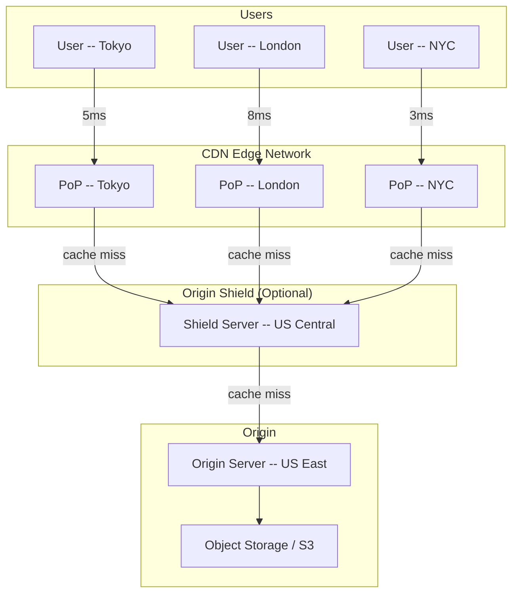
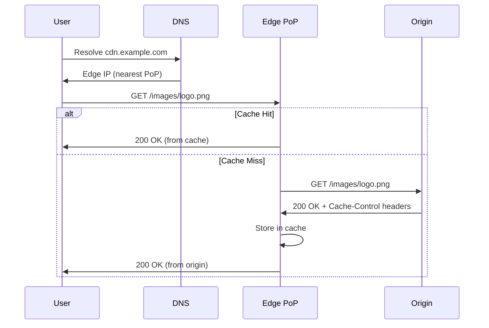
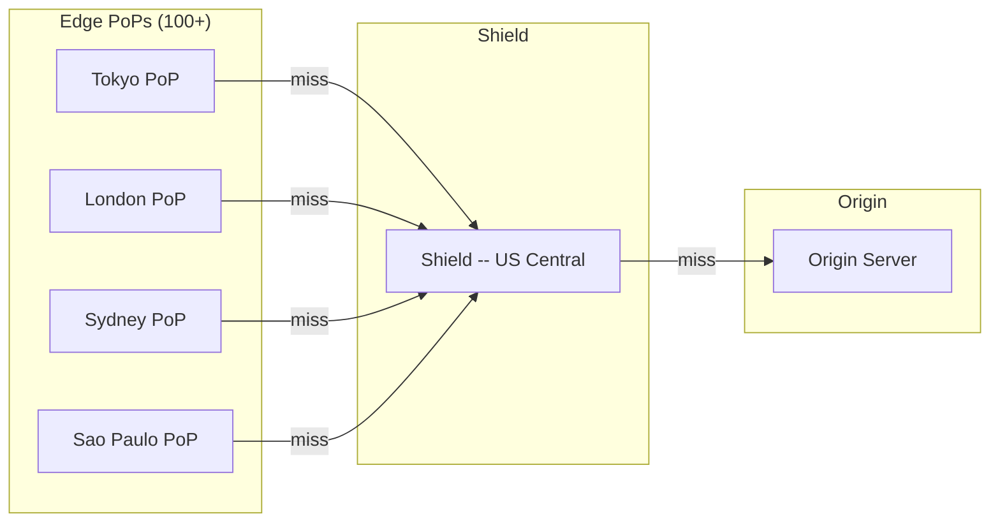
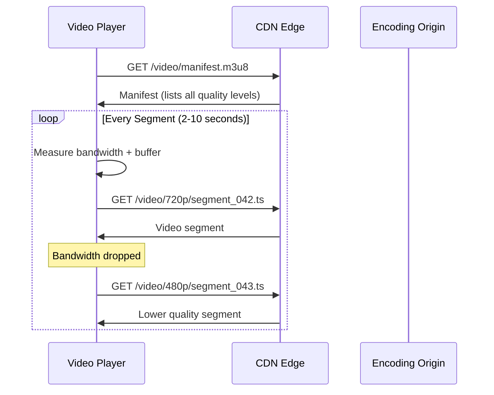
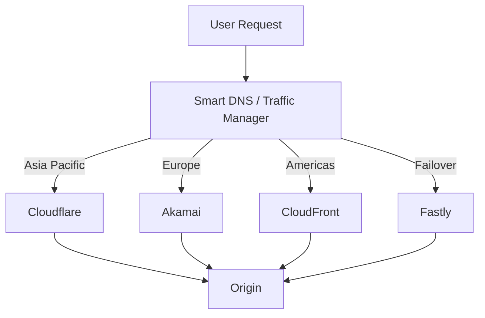
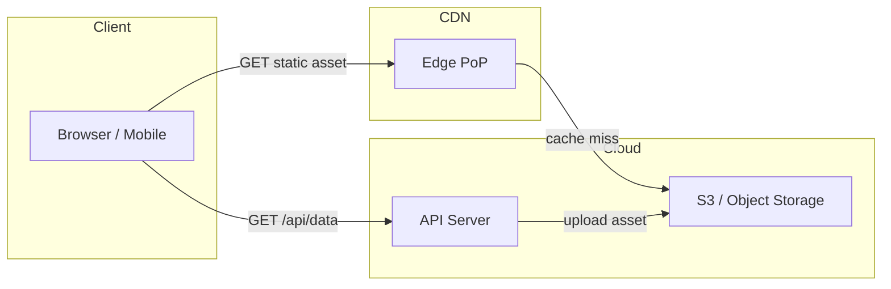

# Content Delivery Networks (CDN) -- Deep Dive

## Overview

A CDN is a geographically distributed network of cache servers (called edge servers or
Points of Presence -- PoPs) that serve content from the location nearest to the user.
Instead of every request traveling thousands of miles to your origin server, the CDN
intercepts the request and serves it from a nearby PoP.

```
  Without CDN:                          With CDN:

  User (Tokyo)                          User (Tokyo)
      |                                     |
      | 200ms RTT                           | 5ms RTT
      v                                     v
  Origin (US-East)                      Edge PoP (Tokyo)
                                            |  cache miss only
                                            | 200ms RTT
                                            v
                                        Origin (US-East)
```

---

## Why CDN Matters

| Problem                  | How CDN Solves It                                         |
|--------------------------|-----------------------------------------------------------|
| High latency             | Serves from nearest edge -- 5-20ms instead of 100-300ms   |
| Origin overload          | Edge absorbs 90%+ of traffic, origin sees fraction        |
| Traffic spikes           | Distributed capacity handles viral content                |
| DDoS vulnerability       | Massive edge network absorbs attack traffic               |
| Global user base         | Consistent performance regardless of geography            |
| TLS handshake overhead   | Terminates TLS at edge -- fewer round trips                |

**Key stat:** CDNs typically offload 60-95% of all traffic from the origin server.

---

## Architecture: How a CDN Works



### Request Flow (Pull CDN)



---

## Push CDN vs Pull CDN

### Pull CDN (Lazy / On-Demand)

Content is pulled from origin on the first request (cache miss). Subsequent requests
for the same content are served from the edge cache until TTL expires.

```
  First Request:    User --> Edge (MISS) --> Origin --> Edge (store) --> User
  Second Request:   User --> Edge (HIT) --> User
```

**How it works:**
1. User requests content through CDN URL
2. Edge checks local cache -- if miss, fetches from origin
3. Edge caches the response based on Cache-Control headers
4. Future requests served from edge cache until TTL expires

### Push CDN (Proactive / Pre-populated)

The origin server pushes content to CDN edge servers before any user requests it.
You explicitly upload assets to the CDN.

```
  Setup Phase:      Origin --> Push to all Edge PoPs
  User Request:     User --> Edge (HIT) --> User  (always a hit)
```

**How it works:**
1. Developer/CI pipeline uploads assets to CDN storage
2. CDN distributes to all or selected PoPs
3. Every user request is a cache hit (unless content evicted)

### Comparison

| Aspect              | Pull CDN                              | Push CDN                            |
|---------------------|---------------------------------------|-------------------------------------|
| First request       | Cache miss -- slow                     | Always fast (pre-populated)         |
| Setup complexity    | Low -- just point DNS                  | Higher -- need upload pipeline      |
| Storage cost        | Lower -- only caches requested items   | Higher -- all content at all edges  |
| Origin load         | Spikes on cold cache / TTL expiry     | Minimal after initial push          |
| Content freshness   | Controlled by TTL / invalidation      | Explicit -- you control when to push|
| Best for            | Dynamic sites, long-tail content      | Static assets, known content set    |
| Examples            | Cloudflare, CloudFront (default)      | Akamai NetStorage, S3 + CloudFront  |

### When to Use Which

- **Pull CDN:** Most web applications. Content is too dynamic or too large to pre-push.
  The origin defines caching rules via HTTP headers. Great for long-tail content where
  only a fraction is popular at any given time.

- **Push CDN:** Game patches, firmware updates, large media libraries. You know exactly
  what content exists and want guaranteed instant delivery. Good when origin cannot handle
  even one cache-miss spike.

- **Hybrid:** Most real-world setups. Static assets (JS, CSS, images) are pushed or
  have long TTLs. API responses and HTML pages are pulled with short TTLs.

---

## Cache Invalidation Strategies

Cache invalidation is one of the two hard problems in computer science. CDNs provide
several mechanisms, each with different trade-offs.

### 1. TTL-Based Expiration

The origin sets a Time-to-Live via HTTP headers. Edge servers discard the cached copy
after TTL expires.

```
  Cache-Control: public, max-age=86400       (cache for 24 hours)
  Cache-Control: public, s-maxage=3600       (CDN caches 1 hour, browser may differ)
  Cache-Control: no-cache                     (revalidate every time)
  Cache-Control: no-store                     (never cache)
```

**Pros:** Simple, automatic, no coordination needed.
**Cons:** Content is stale until TTL expires. Setting TTL is a balancing act --
too short means more origin hits, too long means stale content.

### 2. Purge / Invalidation API

Explicitly tell the CDN to evict specific URLs or patterns. Every major CDN offers this.

```
  # Cloudflare API -- purge specific files
  POST /zones/{zone_id}/purge_cache
  { "files": ["https://example.com/css/app.css"] }

  # CloudFront -- create invalidation
  aws cloudfront create-invalidation \
    --distribution-id EDFDVBD6EXAMPLE \
    --paths "/images/*" "/css/*"
```

**Pros:** Immediate freshness when you know what changed.
**Cons:** Propagation takes 1-30 seconds across all PoPs. Purge limits apply (CloudFront:
1000 free invalidations/month). Wildcard purges are expensive. Does not scale for
frequently-changing content.

### 3. Versioned URLs (Cache Busting)

Append a hash or version to the filename. When content changes, the URL changes, so
the CDN treats it as entirely new content. Old cached copies become irrelevant.

```
  Before: /css/app.css
  After:  /css/app.a3f8b2c1.css         (content hash in filename)
  
  Or:     /css/app.css?v=a3f8b2c1       (query string version)
  Or:     /css/v2/app.css               (path-based version)
```

**Pros:** Instant freshness. No purge needed. Old and new versions coexist safely.
Previous deployments can still load (important during rolling deploys). Browsers and
CDN never serve stale content.
**Cons:** Requires build pipeline to generate hashed filenames. HTML referencing these
files must be updated. Cannot use this for HTML pages themselves.

### 4. Stale-While-Revalidate

Serve stale content immediately while fetching fresh content in the background.

```
  Cache-Control: public, max-age=3600, stale-while-revalidate=86400
  
  Timeline:
  0-1h:    Serve fresh content
  1h-25h:  Serve stale immediately, revalidate in background
  25h+:    Cache expired, must fetch from origin
```

**Pros:** Users never wait for origin response. Best of both worlds -- freshness + speed.
**Cons:** Brief window of stale content. Not all CDNs support it fully.

### Best Practice: Combine Strategies

```
  HTML pages:    Cache-Control: no-cache (or short TTL + stale-while-revalidate)
  JS/CSS/Images: Versioned filenames + Cache-Control: max-age=31536000 (1 year)
  API responses: Cache-Control: s-maxage=60 (CDN caches 60s, browser does not)
```

---

## Cache Keys: What Determines a Cache Hit

A cache key is the unique identifier the CDN uses to store and look up cached content.
Two requests with the same cache key return the same cached response.

### Default Cache Key
Most CDNs use: **scheme + host + path + query string**

```
  https://example.com/api/users?page=2&sort=name
  
  Cache key = "https://example.com/api/users?page=2&sort=name"
```

### Controlling Cache Key Components

| Component     | Include?     | Why                                                      |
|---------------|--------------|----------------------------------------------------------|
| URL path      | Always       | Different paths = different content                      |
| Query params  | Selective    | Include only params that change content (page, sort)     |
| Host header   | Usually yes  | Multi-tenant apps serve different content per domain     |
| Accept header | Sometimes    | Serve WebP vs PNG based on browser support               |
| Cookie        | Rarely       | Destroys cache hit rate -- each user gets unique key     |
| Device type   | Sometimes    | Serve mobile vs desktop variant                          |
| Country/Geo   | Sometimes    | Geo-specific content or compliance                       |

**Critical mistake:** Including unnecessary components in the cache key (like session
cookies or random query params) destroys your cache hit rate. A CDN with 5% hit rate
is just an expensive proxy.

```
  BAD:  Cache-Key includes Set-Cookie header
        --> Every user gets a unique cache entry. 0% hit rate.
  
  GOOD: Strip cookies, normalize query params, ignore tracking params
        --> GET /product/123 hits cache regardless of utm_source
```

### Vary Header

The `Vary` header tells the CDN which request headers should be included in the cache key.

```
  Vary: Accept-Encoding          (cache gzip and br separately)
  Vary: Accept-Encoding, Accept  (also vary by content type -- WebP vs JPEG)
  Vary: *                        (NEVER cache -- defeats the purpose)
```

---

## Origin Shield

An intermediate cache layer between edge PoPs and the origin server. Instead of N edge
servers each hitting the origin on cache miss, they hit the shield first.



### How It Helps

| Without Origin Shield                    | With Origin Shield                         |
|------------------------------------------|--------------------------------------------|
| 100 PoPs each miss = 100 origin requests | 100 PoPs miss = 1 shield request to origin |
| Origin sees N*unique_content requests    | Origin sees 1x unique_content requests     |
| Origin must scale globally               | Origin can be a single region              |
| Popular content storms the origin        | Shield absorbs the storm                   |

### When to Use
- Your origin is a single-region server or database
- You serve globally popular content that expires frequently
- You want to reduce origin egress costs
- You cannot scale your origin horizontally

**CloudFront:** Enable "Origin Shield" in distribution settings, pick a region.
**Cloudflare:** Argo Tiered Caching serves as origin shield automatically.

---

## Dynamic Content Acceleration

CDNs are not just for static content. Modern CDNs accelerate dynamic, uncacheable
content through network-level optimizations.

### Techniques

| Technique                | How It Works                                                    |
|--------------------------|-----------------------------------------------------------------|
| TCP optimization         | Pre-established connections, TCP tuning at edge                 |
| Connection keep-alive    | Persistent connections between edge and origin -- no handshake  |
| Route optimization       | CDN's private backbone avoids congested public internet paths   |
| TLS termination at edge  | TLS handshake at edge (1 RTT), then optimized path to origin   |
| Request collapsing       | Multiple identical requests collapsed into one origin fetch     |
| HTTP/2 multiplexing      | Multiple requests over single connection to origin              |
| Early hints (103)        | Push critical assets before origin responds                     |

### Why It Matters

Even for a dynamic API response that cannot be cached (Cache-Control: no-store),
routing through a CDN can reduce latency by 30-50% because:

1. User connects to nearby edge (low RTT for TLS handshake)
2. Edge has persistent, optimized connection to origin
3. CDN uses private backbone instead of public internet hops

```
  Without CDN:  User --[5 hops, public internet]--> Origin    = 200ms
  With CDN:     User --[1 hop]--> Edge --[CDN backbone]--> Origin = 80ms
```

---

## Video Streaming: Adaptive Bitrate

CDNs are the backbone of video streaming. Understanding adaptive bitrate streaming
protocols is essential for designing video platforms.

### How Adaptive Bitrate Works



### Protocol Comparison

| Protocol | Full Name                      | Format     | Segment Size | Used By                     |
|----------|--------------------------------|------------|-------------|-----------------------------|
| HLS      | HTTP Live Streaming            | .m3u8 + .ts| 6s default  | Apple, most browsers        |
| DASH     | Dynamic Adaptive Streaming     | .mpd + .mp4| 2-10s       | YouTube, Netflix            |
| CMAF     | Common Media App Format        | .mp4 (fMP4)| 2-6s        | Unified HLS+DASH            |

### HLS Deep Dive
1. Video is encoded at multiple bitrates (e.g., 360p, 480p, 720p, 1080p, 4K)
2. Each bitrate is split into small segments (typically 6 seconds)
3. A master playlist (.m3u8) lists all available quality levels
4. The player downloads the manifest, then requests segments one at a time
5. Player monitors download speed and buffer level, switches quality adaptively

### CDN Considerations for Video
- **Segment caching:** Each segment is a small HTTP-cacheable file -- perfect for CDN
- **Origin offload:** Popular videos get 99%+ cache hit rate
- **Prefetch:** CDN can prefetch the next segment before player requests it
- **Regional encoding:** Encode at origin, cache everywhere
- **Live streaming:** Segments are generated in real time, CDN caches each as produced

---

## Multi-CDN Strategy

Large-scale services use multiple CDN providers simultaneously for resilience and
performance optimization.

### Why Multi-CDN

| Reason             | Detail                                                         |
|--------------------|----------------------------------------------------------------|
| Resilience         | CDN outage does not take your site down (Fastly 2021 outage)   |
| Performance        | No single CDN is fastest everywhere on earth                   |
| Cost optimization  | Negotiate better pricing, use cheapest per-region              |
| Feature access     | Use Cloudflare Workers + CloudFront real-time logs together    |

### How It Works: DNS-Level Switching



**Implementation:** Use a DNS-based traffic manager (AWS Route 53, NS1, Cloudflare Load
Balancer) that routes to different CDN providers based on:
- Geographic proximity
- Real-time latency measurements
- CDN health checks
- Cost thresholds

---

## CDN Provider Comparison

| Feature            | Cloudflare         | CloudFront (AWS)    | Akamai              | Fastly             |
|--------------------|--------------------|---------------------|----------------------|--------------------|
| PoPs               | 310+               | 600+                | 4000+                | 90+                |
| Free tier          | Yes (generous)     | 1TB/month free      | No                   | No                 |
| Edge compute       | Workers (V8)       | Lambda@Edge, CF Fn  | EdgeWorkers          | Compute@Edge (Wasm)|
| Purge speed        | ~2-5s global       | 1-2 min             | ~5s                  | ~150ms (fastest)   |
| DDoS protection    | Included           | AWS Shield          | Kona Site Defender   | Signal Sciences    |
| Video streaming    | Stream product     | MediaLive/Package   | Media Services       | Media Shield       |
| Pricing model      | Request + BW       | Request + BW        | Commit-based         | Request + BW       |
| Origin shield      | Tiered Caching     | Origin Shield       | SureRoute            | Shielding          |
| Best for           | General web, DDoS  | AWS-native apps     | Enterprise, media    | Fast purge, devs   |

---

## Edge Computing: Code at the Edge

Modern CDNs allow running code at edge servers, turning CDNs from passive caches into
distributed compute platforms.

### Cloudflare Workers

- **Runtime:** V8 isolates (same as Chrome) -- not containers, not VMs
- **Cold start:** 0ms (isolates are pre-warmed)
- **Limits:** 50ms CPU time (free), 30s (paid). 128MB memory
- **Languages:** JavaScript, TypeScript, Rust (via Wasm), Python
- **Use cases:** A/B testing, auth at edge, URL rewriting, API routing, geolocation

### AWS Lambda@Edge & CloudFront Functions

| Aspect            | Lambda@Edge                  | CloudFront Functions         |
|-------------------|------------------------------|------------------------------|
| Runtime           | Node.js, Python              | JavaScript only              |
| Execution time    | 5-30s                        | 1ms max                      |
| Memory            | 128-3008 MB                  | 2 MB                         |
| Network access    | Yes                          | No                           |
| Trigger points    | Viewer/origin req/resp       | Viewer request/response only |
| Cost              | Higher                       | 1/6 the cost of Lambda@Edge  |
| Best for          | Complex logic, API calls     | Header manipulation, redirects|

### Edge Computing Use Cases

```
  1. A/B Testing at Edge
     Edge receives request --> hash user cookie --> route to variant A or B
     No round-trip to origin needed for routing decision.

  2. Authentication at Edge
     Edge validates JWT token --> reject unauthorized before hitting origin.
     Origin never sees unauthenticated traffic.

  3. Image Optimization
     Edge receives image request --> resize/convert on the fly (WebP, AVIF)
     Serve optimized images without storing every variant.

  4. Geolocation-Based Routing
     Edge detects user's country --> serve localized content or redirect.
     No need for origin to handle geo-routing logic.

  5. Bot Detection & Rate Limiting
     Edge analyzes request patterns --> block bots before they reach origin.
     WAF rules execute at edge with near-zero latency.
```

---

## CDN in System Design Interviews

### When to Add a CDN

Add a CDN when your system:
- Serves users globally (latency matters)
- Has static content (images, CSS, JS, videos)
- Needs to handle traffic spikes (viral content, product launches)
- Has read-heavy workloads (content is read far more than written)
- Requires DDoS protection

### How to Discuss CDN in Interviews

**Step 1: Identify static vs dynamic content**
- Static: images, CSS, JS bundles, videos, firmware -> CDN with long TTL
- Semi-static: product pages, user profiles -> CDN with short TTL + invalidation
- Dynamic: real-time feeds, search results -> CDN for TCP optimization only

**Step 2: Define caching strategy**
- Set appropriate TTLs per content type
- Use versioned URLs for immutable assets
- Use Cache-Control headers to control behavior

**Step 3: Address cache invalidation**
- Explain how updates propagate (purge API, TTL expiry, versioned URLs)
- Mention stale-while-revalidate for latency-sensitive content

**Step 4: Mention origin shield if global scale**
- Reduces origin load from N * PoPs to 1x
- Important when origin is a single-region database

**Step 5: Address edge cases**
- Cache stampede: many simultaneous requests for expired popular content
  - Solution: request collapsing (single flight), stale-while-revalidate
- Cache poisoning: attacker causes CDN to cache malicious content
  - Solution: strict cache key rules, no caching of error responses
- Personalized content: do not cache per-user content at CDN
  - Solution: separate cacheable shell from personalized data (ESI)

### Architecture Pattern: CDN + Object Storage

This is the most common static content architecture in interviews.



---

## Interview Questions with Answers

### Q1: A user in Australia reports your US-based website is slow. How do you fix it?

**Answer:**
1. Deploy a CDN with PoPs in Australia (Cloudflare, CloudFront)
2. Point DNS to CDN -- static assets (images, JS, CSS) served from Sydney PoP
3. Set Cache-Control headers: immutable assets get max-age=31536000, HTML gets short TTL
4. Enable origin shield to reduce load on US origin
5. For dynamic API calls, CDN still helps via TCP optimization and route optimization
6. Consider deploying a read replica or regional API server in ap-southeast if latency
   for dynamic content is still too high

### Q2: You deploy a broken CSS file. How do you fix it with a CDN in front?

**Answer:**
1. **Immediate fix:** Use CDN purge API to invalidate the cached CSS globally
2. **Deploy correct file** to origin with same or new filename
3. **Prevention:** Use content-hashed filenames (app.a3f8b2c1.css). A broken deploy
   means the HTML references a new hash. Users loading new HTML get the new CSS. Users
   with cached HTML still get the old (working) CSS until HTML TTL expires.
4. **Long-term:** HTML pages should have short TTL (60s) or no-cache. Asset files should
   have content hashes and max-age=31536000.

### Q3: How would you design a CDN for a video streaming platform?

**Answer:**
1. **Encoding pipeline:** Transcode video into multiple bitrates (360p to 4K) using
   adaptive bitrate (HLS or DASH). Each quality level is split into 6s segments.
2. **Storage:** Store segments in object storage (S3). Segments are small, HTTP-friendly.
3. **CDN layer:** CDN caches manifest files (short TTL) and segments (long TTL).
   Popular videos get 95%+ cache hit rate.
4. **Origin shield:** Shield absorbs misses from 100+ PoPs. Origin only serves each
   segment once to the shield.
5. **Live streaming:** Segments generated in real time. CDN caches each segment as it
   becomes available. Short TTL on the manifest (2-6s) so players discover new segments.
6. **Multi-CDN:** DNS-based failover between CDN providers. If one CDN degrades, shift
   traffic to another. Measure real user metrics (RUM) per-CDN to route optimally.

### Q4: What is a cache stampede and how do you prevent it?

**Answer:**
A cache stampede (thundering herd) happens when a popular cached item expires and
hundreds of simultaneous requests all miss the cache and hit the origin at once.

**Solutions:**
1. **Request collapsing (coalescing):** CDN holds duplicate requests and forwards only
   one to origin. All waiting requests get the same response.
2. **Stale-while-revalidate:** Serve stale content to all users while one background
   request refreshes the cache. Users never wait.
3. **Jittered TTL:** Add random offset to TTL so not all cached copies expire at once.
   e.g., TTL = 3600 + random(0, 600).
4. **Background refresh:** Proactively refresh popular items before they expire.

### Q5: Your CDN costs are 3x what you expected. How do you reduce them?

**Answer:**
1. **Audit cache hit rate.** If it is below 80%, fix cache key configuration. Strip
   unnecessary query params, cookies, and headers from cache key.
2. **Optimize TTLs.** Increase TTL for content that changes rarely. Use versioned URLs
   so you can set max-age=31536000 safely.
3. **Enable compression.** Brotli or gzip at the edge reduces bandwidth (CDN charges
   per GB transferred).
4. **Use origin shield.** Reduces redundant origin fetches, lowers origin egress.
5. **Review storage classes.** Some CDNs charge for cached storage -- purge stale content.
6. **Negotiate commit pricing.** If you push 100+ TB/month, commit-based pricing from
   Akamai or volume discounts from CloudFront can cut costs 30-50%.
7. **Move to cheaper provider.** Cloudflare has no bandwidth charges on most plans.

### Q6: How does a CDN handle HTTPS/TLS?

**Answer:**
1. CDN terminates TLS at the edge PoP (closest to user)
2. User does TLS handshake with edge -- low latency (nearby server)
3. Edge connects to origin via separate TLS connection (or HTTP if trusted network)
4. CDN manages SSL certificates (auto-renewal, Let's Encrypt, or customer-uploaded)
5. Benefit: TLS handshake is 1-2 RTT. With CDN, that RTT is 5ms (edge) instead of
   200ms (origin). This alone can save 200-400ms on first connection.

---

## Quick Reference: CDN Caching Headers Cheatsheet

```
  Header                          Meaning
  -----------------------------------------------------------------------
  Cache-Control: public           Any cache (CDN, browser) can cache
  Cache-Control: private          Only browser can cache, NOT CDN
  Cache-Control: no-cache         Cache can store, but must revalidate every time
  Cache-Control: no-store         Do NOT cache at all
  Cache-Control: max-age=N        Cache for N seconds
  Cache-Control: s-maxage=N       CDN caches for N seconds (overrides max-age for CDN)
  Cache-Control: stale-while-revalidate=N   Serve stale for N sec while revalidating
  Cache-Control: immutable        Content will never change (do not revalidate)
  
  ETag: "abc123"                  Content fingerprint for conditional requests
  Last-Modified: <date>           Timestamp for conditional requests
  Vary: Accept-Encoding           Cache separately per encoding (gzip, br)
  
  CDN-Cache-Control: max-age=60   CDN-specific header (Cloudflare, Fastly)
  Surrogate-Control: max-age=60   CDN-specific header (Akamai, Fastly)
```

---

## Key Takeaways for Interviews

1. **CDN = geographically distributed cache.** Reduces latency and origin load.
2. **Pull CDN** is the default -- content is fetched on first miss. **Push CDN** is for
   known, pre-uploadable content.
3. **Cache invalidation:** Use versioned URLs for assets, short TTLs for HTML, purge API
   for emergency fixes.
4. **Origin shield** collapses N PoP misses into 1 origin request. Critical for global scale.
5. **Adaptive bitrate streaming** (HLS/DASH) is how video platforms work -- small segments
   cached at CDN, player switches quality based on bandwidth.
6. **Edge computing** turns CDNs into distributed compute platforms -- run auth, A/B tests,
   and routing logic at the edge with near-zero latency.
7. **Multi-CDN** for resilience -- no single CDN is reliable or fast enough globally.
8. **In interviews:** Always specify what you are caching, the TTL strategy, and how you
   handle invalidation. These three details show depth.
