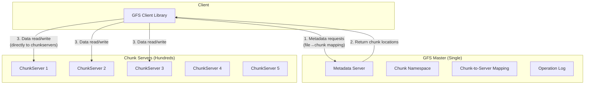
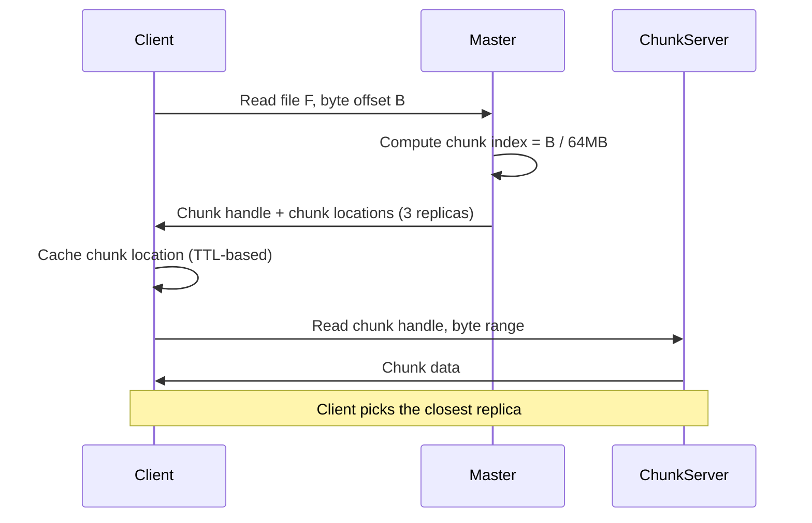
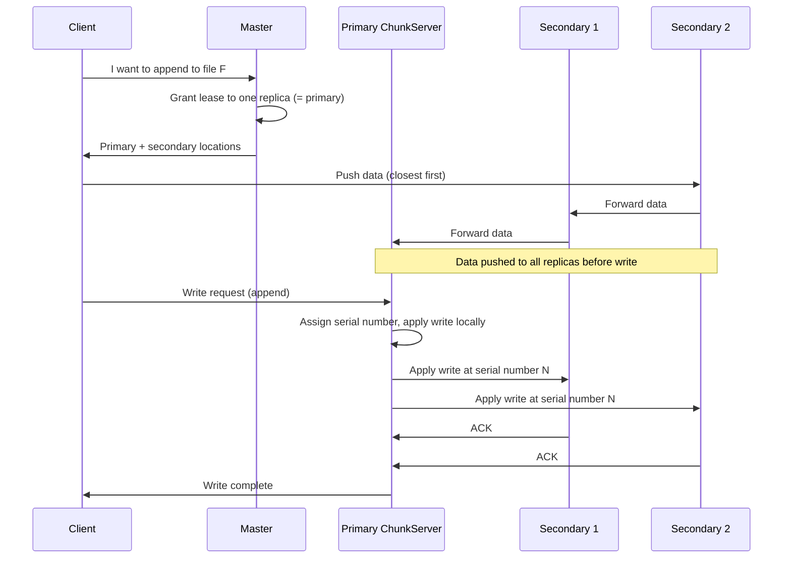
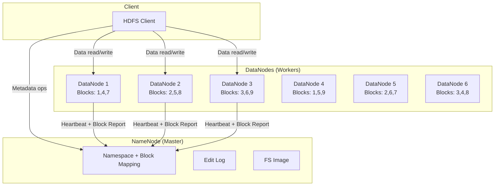
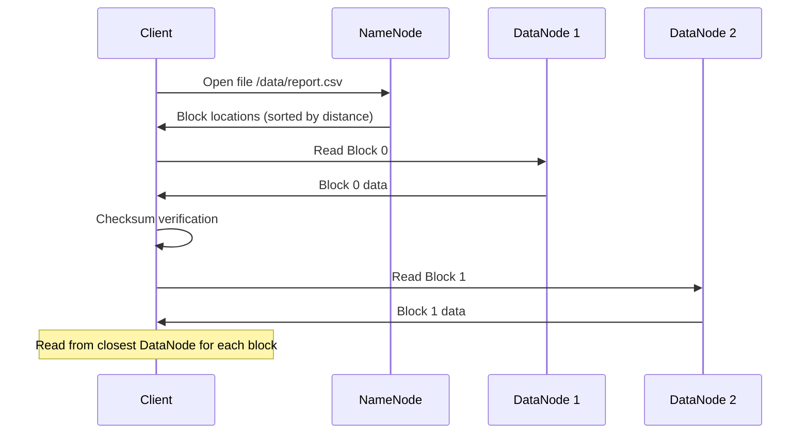
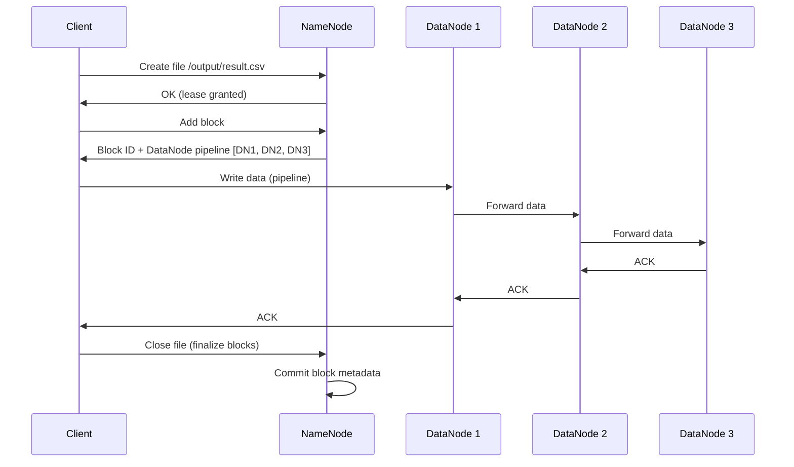
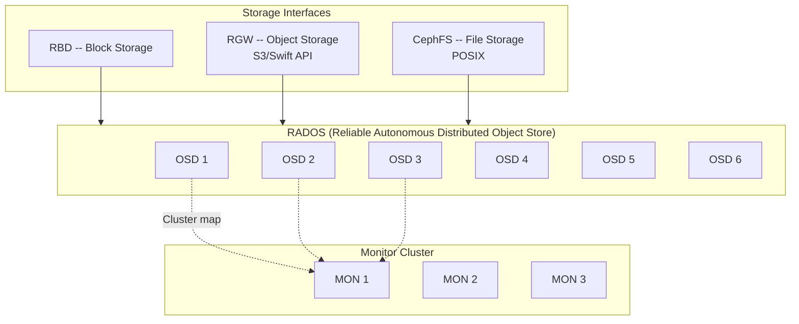

# Distributed File Systems -- Deep Dive

## Overview

Distributed file systems store data across multiple machines, providing a unified
namespace that applications access as if it were a single filesystem. They emerged to
handle datasets too large for any single machine -- Google's web index, Hadoop analytics
workloads, and modern cloud storage backends.

```
  Single Machine FS:         Distributed FS:
  
  /data/file.txt             /data/file.txt
  [One Disk]                 [Chunk A: Node 1, Node 3, Node 5]
                             [Chunk B: Node 2, Node 4, Node 6]
                             [Chunk C: Node 1, Node 4, Node 5]
                             
                             Looks like one file, spread across many machines.
```

---

## GFS (Google File System)

Published in 2003, the GFS paper is the foundation of all modern distributed file
systems. It was purpose-built for Google's workloads: large files (multi-GB), append-heavy
writes, and sequential reads.

### Architecture



### Core Design Decisions

| Decision                   | What                                          | Why                                              |
|----------------------------|-----------------------------------------------|--------------------------------------------------|
| Single master              | One master server manages all metadata         | Simplifies design, avoids distributed consensus   |
| 64 MB chunks               | Files split into 64 MB fixed-size chunks       | Reduces metadata (fewer chunks per file)          |
| 3x replication             | Each chunk stored on 3 different chunkservers  | Tolerates 2 server failures per chunk             |
| Append-optimized           | Primary use case is append, not random write   | Matches Google's workload (logs, crawl data)      |
| Relaxed consistency        | "Defined" (not strict) after concurrent writes | Performance over strict consistency               |
| Client-side caching        | Clients cache metadata, NOT data               | Data is too large to cache, metadata is small     |

### Chunk Details

```
  File: /crawl/web-2003-10.data (12 GB)
  
  Split into 64MB chunks:
  Chunk 0:  [64 MB] --> ChunkServer 2, 5, 7   (chunk handle: 0x2a3f)
  Chunk 1:  [64 MB] --> ChunkServer 1, 3, 8   (chunk handle: 0x2a40)
  Chunk 2:  [64 MB] --> ChunkServer 4, 6, 9   (chunk handle: 0x2a41)
  ...
  Chunk 191: [last ~64 MB] --> ChunkServer 2, 4, 7
  
  Master metadata per chunk: ~64 bytes
  Total metadata for 12 GB file: ~12 KB  (tiny!)
```

**Why 64 MB?** Larger chunks mean fewer chunks per file, which means less metadata on
the master. Fewer chunks also mean fewer master interactions per read. The trade-off is
internal fragmentation for small files, but GFS was designed for large files.

### Read Flow



**Key insight:** The master is NOT in the data path. It only serves metadata. All data
flows directly between client and chunkserver. This prevents the master from becoming
a bottleneck.

### Write Flow (Record Append)



**Key details:**
1. **Data flow is decoupled from control flow.** Data is pushed through a chain of
   chunkservers (pipeline), control goes from client to primary to secondaries.
2. **Primary assigns order.** The primary serializes all concurrent writes by assigning
   sequence numbers, ensuring all replicas apply writes in the same order.
3. **Lease mechanism.** The master grants a 60-second lease to one chunkserver (the
   primary). The primary can extend its lease. If it fails, master waits for lease
   to expire before assigning a new primary.

### Master Metadata

The master stores three types of metadata, all in memory:
1. **File and chunk namespace** (directory tree)
2. **File-to-chunk mapping** (which chunks belong to which file)
3. **Chunk-to-location mapping** (which chunkservers hold each chunk)

```
  Types 1 and 2: Persisted to an operation log on disk (write-ahead log)
                 + periodic checkpoints.
  
  Type 3: NOT persisted. Rebuilt on startup by polling all chunkservers.
           (ChunkServers are the source of truth for what chunks they hold.)
```

**Master recovery:** Replay operation log from last checkpoint. Then poll chunkservers
for chunk locations. Recovery time is proportional to log size since last checkpoint.

### GFS Limitations

- **Single master:** Bottleneck for metadata operations. Cannot scale beyond one machine's
  memory for the entire namespace.
- **Small files:** 64MB chunks cause internal fragmentation. Hot small files create
  hotspots on the few chunkservers that hold them.
- **Consistency model:** "At least once" append semantics can leave duplicates and padding.
  Applications must handle this.

---

## HDFS (Hadoop Distributed File System)

HDFS is an open-source implementation heavily inspired by the GFS paper. It became the
storage backbone of the Hadoop ecosystem for big data processing.

### Architecture



### GFS vs HDFS Mapping

| GFS Term          | HDFS Term         | Description                               |
|-------------------|-------------------|-------------------------------------------|
| Master            | NameNode          | Metadata server                           |
| ChunkServer       | DataNode          | Data storage server                       |
| Chunk             | Block             | Unit of data storage                      |
| 64 MB chunks      | 128 MB blocks     | HDFS uses larger default block size       |
| Operation Log     | Edit Log          | Write-ahead log for metadata changes      |
| Checkpoint        | FS Image          | Snapshot of namespace metadata            |

### Block Size and Replication

**Default block size: 128 MB** (was 64 MB in early versions, increased for performance).

```
  File: /data/sales_2024.parquet (500 MB)
  
  Block 0: [128 MB] --> DataNode 1, DataNode 4, DataNode 6
  Block 1: [128 MB] --> DataNode 2, DataNode 3, DataNode 5
  Block 2: [128 MB] --> DataNode 1, DataNode 3, DataNode 4
  Block 3: [116 MB] --> DataNode 2, DataNode 5, DataNode 6
  
  Replication factor: 3 (default, configurable per file)
  Total storage: 500 MB * 3 = 1.5 GB
```

### Rack-Aware Placement

HDFS is aware of the physical rack topology of the data center. It places replicas
strategically to balance between fault tolerance and network bandwidth.

```
  Default placement policy (replication factor = 3):
  
  Rack 1                    Rack 2
  ┌──────────────┐          ┌──────────────┐
  │ DataNode A   │          │ DataNode C   │
  │ [Replica 1]  │          │ [Replica 3]  │
  │              │          │              │
  │ DataNode B   │          │ DataNode D   │
  │ [Replica 2]  │          │              │
  └──────────────┘          └──────────────┘
  
  Rule: First replica on local node. Second replica on a different node
  in the SAME rack (fast intra-rack transfer). Third replica on a node
  in a DIFFERENT rack (survives rack failure).
```

**Why this placement?**
- Same rack for 2 replicas: fast writes (intra-rack bandwidth is higher)
- Different rack for 1 replica: survives entire rack failure (power, TOR switch)
- Compromise: not as resilient as all-different-racks, but much better write performance

### NameNode High Availability

The single NameNode is a single point of failure. HDFS HA solves this.

```mermaid
flowchart TB
    subgraph NN["NameNode HA"]
        Active[Active NameNode]
        Standby[Standby NameNode]
    end

    subgraph JN["Journal Nodes (Quorum)"]
        J1[Journal Node 1]
        J2[Journal Node 2]
        J3[Journal Node 3]
    end

    subgraph ZK["ZooKeeper Ensemble"]
        ZK1[ZK Node 1]
        ZK2[ZK Node 2]
        ZK3[ZK Node 3]
    end

    Active -->|"Write edits"| J1
    Active -->|"Write edits"| J2
    Active -->|"Write edits"| J3
    Standby -->|"Read edits\n(stay in sync)"| J1
    Standby -->|"Read edits"| J2
    Standby -->|"Read edits"| J3

    Active -->|"Holds lock"| ZK1
    Standby -->|"Watches lock"| ZK1
    
    Note over Active,Standby: If Active fails, ZK triggers failover.\nStandby replays remaining edits and becomes Active.
```

**Components:**
- **Active NameNode:** Handles all client requests. Writes edits to JournalNodes.
- **Standby NameNode:** Continuously reads edits from JournalNodes. Hot standby.
- **Journal Nodes (3+):** Shared edit log storage. Writes require quorum (majority).
  Prevents split-brain (only one NameNode can write at a time).
- **ZooKeeper:** Manages leader election. Active holds a lock. If it fails, ZK
  triggers failover to Standby.
- **Fencing:** Ensures the old Active is truly dead before Standby takes over. Prevents
  split-brain scenario where two NameNodes think they are Active.

### HDFS Read Flow



### HDFS Write Flow



**Pipeline replication:** Data flows through a chain: Client -> DN1 -> DN2 -> DN3.
ACKs flow backward. This uses network bandwidth efficiently -- each node sends data
once (to the next in the pipeline) instead of the client sending 3 separate copies.

---

## Colossus (GFS Successor)

Colossus is Google's next-generation distributed file system, replacing GFS around 2010.
While not fully public, key improvements are known from Google publications.

### Key Improvements Over GFS

| GFS Limitation             | Colossus Solution                                |
|----------------------------|--------------------------------------------------|
| Single master bottleneck   | Distributed metadata -- metadata is itself stored in a distributed database (BigTable/Spanner) |
| 3x replication overhead    | Reed-Solomon erasure coding (1.5x overhead)       |
| 64 MB chunk size           | ~1 MB "slices" for finer granularity              |
| Master memory limit        | Metadata in scalable database (no single-machine limit)|
| Single point of failure    | Multiple metadata servers with automatic failover |

### Architecture Differences

```
  GFS:                               Colossus:
  
  [Single Master]                    [Distributed Metadata Service]
       |                                  |    |    |
  [ChunkServers]                     [  Custodians (storage)  ]
  64 MB chunks, 3x replicated       1 MB slices, erasure coded
  
  Master stores ALL metadata         Metadata sharded across many servers
  in memory of ONE machine.          using a distributed key-value store.
```

### Reed-Solomon Encoding

```
  GFS (3x replication):
  1 GB data --> 3 GB stored (3x overhead = 200% extra)
  
  Colossus (Reed-Solomon):
  1 GB data --> 1.5 GB stored (1.5x overhead = 50% extra)
  
  At Google's scale (exabytes), this saves MILLIONS of disks.
```

Reed-Solomon encoding is a form of erasure coding. Data is split into k data strips and
m parity strips. Any k out of (k+m) strips can reconstruct the original data.

---

## Ceph

Ceph is an open-source distributed storage platform that uniquely provides block, object,
AND file storage interfaces on a single unified cluster.

### Architecture



### CRUSH Algorithm

CRUSH (Controlled Replication Under Scalable Hashing) is Ceph's key innovation. It is
a pseudo-random placement algorithm that computes where data lives -- no lookup table needed.

```
  Traditional approach:   Object --> Lookup table --> Storage node
                          (Table must be stored, updated, distributed)
  
  CRUSH approach:         Object --> CRUSH(object_id, cluster_map, rules) --> Storage node
                          (Deterministic computation -- no lookup table!)
```

**How CRUSH works:**
1. Hash the object name to get a placement group (PG)
2. Apply CRUSH rules (which encode the cluster topology -- racks, hosts, disks)
3. CRUSH outputs a deterministic set of OSDs for each PG
4. Any node can compute this independently -- no central metadata server

**Benefits:**
- No metadata lookup bottleneck (unlike GFS master or HDFS NameNode)
- Cluster can scale by adding OSDs -- CRUSH automatically rebalances
- Topology-aware: can enforce replicas on different racks/DCs

### Ceph Components

| Component        | Role                                                          |
|------------------|---------------------------------------------------------------|
| OSD (Object Storage Daemon) | Stores data, handles replication, recovery, rebalancing |
| Monitor (MON)    | Maintains cluster map (topology), quorum-based consensus      |
| MDS (Metadata Server) | Metadata for CephFS only. Not needed for block/object.   |
| Manager (MGR)    | Monitoring, metrics, dashboard                               |

---

## When to Use What: Decision Framework

| Requirement                           | Use                              | Why                                    |
|---------------------------------------|----------------------------------|----------------------------------------|
| Store images/videos for web app       | Object Storage (S3)              | HTTP API, CDN-friendly, cheap, durable |
| Database disk (PostgreSQL, MySQL)     | Block Storage (EBS)              | Low latency, POSIX, mountable          |
| Share files between multiple servers  | File Storage (EFS, NFS)          | Concurrent access, POSIX semantics     |
| Process petabytes with MapReduce/Spark| Distributed FS (HDFS)            | Data locality, large block size        |
| Store exabytes at Google scale        | Colossus-like system             | Distributed metadata, erasure coding   |
| Unified block + object + file needs   | Ceph                             | Single cluster, CRUSH algorithm        |
| Cheap long-term archive               | Object Storage (S3 Glacier)      | Lowest cost per GB                     |
| Real-time random reads/writes         | Block Storage                    | Sub-millisecond latency                |
| Append-heavy log files                | Distributed FS or Object Storage | Sequential write optimized             |

### Object Storage vs Distributed FS

```
  Object Storage (S3):
  + HTTP API (accessible from anywhere)
  + Virtually unlimited scale
  + Managed service (no ops)
  + Built-in CDN integration
  + 11 9's durability
  - Higher latency (HTTP overhead)
  - No partial update (replace entire object)
  - No POSIX semantics
  
  Distributed FS (HDFS):
  + Data locality (compute where data lives)
  + POSIX-like operations (append, seek)
  + Optimized for large sequential reads
  + Tight integration with processing frameworks (Spark, MapReduce)
  - Requires cluster management
  - NameNode is a potential bottleneck
  - Not HTTP-native
```

**Modern trend:** Object storage is winning. Cloud providers increasingly offer compute-on-storage
(Athena, BigQuery) that eliminates HDFS's data locality advantage. Many organizations
are migrating from HDFS to S3-based data lakes.

---

## Interview Questions with Answers

### Q1: Why did Google choose a single master in GFS? What are the trade-offs?

**Answer:**
**Why single master:**
- Simplifies design enormously -- no distributed consensus for metadata
- Master's metadata fits in memory (~64 bytes per chunk, total ~few GB)
- Google's workload had far more data operations than metadata operations
- Easy to reason about consistency

**Trade-offs:**
- Single point of failure (mitigated by operation log + shadow masters)
- Metadata scalability limited by single machine's memory
- All metadata operations serialized through one server
- This limitation is why Google eventually built Colossus with distributed metadata

### Q2: Explain how HDFS achieves fault tolerance.

**Answer:**
1. **Replication:** Each block stored on 3 DataNodes (default). Can lose any 2 replicas.
2. **Rack awareness:** Replicas placed across racks. Survives entire rack failure.
3. **Heartbeats:** DataNodes send heartbeats every 3 seconds. If missed for 10 minutes, NameNode considers it dead and triggers re-replication.
4. **Block reports:** DataNodes periodically report all blocks they hold. NameNode cross-references to detect missing replicas.
5. **Checksums:** Each block has a checksum. DataNodes verify on read. Corrupt blocks are replaced from healthy replicas.
6. **NameNode HA:** Active-Standby with JournalNodes and ZooKeeper for automatic failover.
7. **FS Image + Edit Log:** NameNode metadata persisted to disk and replicated. Recoverable after restart.

### Q3: Compare GFS, HDFS, and Colossus.

**Answer:**

| Aspect              | GFS (2003)            | HDFS (2006+)            | Colossus (2010+)         |
|---------------------|-----------------------|-------------------------|--------------------------|
| Metadata            | Single master         | Single NameNode (HA)    | Distributed metadata     |
| Chunk/Block size    | 64 MB                 | 128 MB                  | ~1 MB                    |
| Durability method   | 3x replication        | 3x replication          | Erasure coding (RS)      |
| Storage overhead    | 3x                    | 3x                      | ~1.5x                    |
| Open source         | No                    | Yes (Apache)            | No                       |
| Scale               | Petabytes             | Petabytes               | Exabytes                 |
| Consistency         | Relaxed               | Strong (single writer)  | Strong                   |

### Q4: How does the CRUSH algorithm in Ceph avoid the need for a centralized metadata server?

**Answer:**
CRUSH is a deterministic pseudo-random placement algorithm. Given an object identifier
and the cluster map (topology of racks, hosts, disks), any node can independently compute
which OSDs store a given object. No lookup table or central metadata server is needed.

**Process:**
1. Object ID is hashed to a Placement Group (PG)
2. PG + cluster map + CRUSH rules are fed into the CRUSH algorithm
3. Algorithm outputs a deterministic set of OSDs (e.g., 3 for replication)
4. Every client and OSD computes the same result independently

**Benefit:** Adding or removing OSDs only changes the cluster map. CRUSH recomputes
placements, and minimal data is moved (only data that needs to shift to new OSDs).
No master server needs to be updated or queried.

### Q5: Your company is migrating from HDFS to S3 for analytics. What challenges do you anticipate?

**Answer:**
1. **Data locality loss:** HDFS co-locates compute with data. S3 requires pulling data over the network. Mitigate with columnar formats (Parquet) and predicate pushdown.
2. **Consistency model:** HDFS is strongly consistent. S3 is now strongly consistent (since Dec 2020), but older applications may have assumptions about eventual consistency.
3. **Rename is not atomic:** HDFS rename is a metadata operation (fast). S3 "rename" requires copy + delete (slow for large datasets). Affects Spark/Hive output committers.
4. **Small file problem:** HDFS handles many small files (NameNode overhead). S3 handles it better scalability-wise, but reading millions of tiny S3 objects is slow. Solution: compact small files into larger Parquet files.
5. **Tooling changes:** Replace HDFS CLI/API calls with S3 API. Hadoop S3A connector needed.
6. **Cost model shift:** HDFS cost = hardware + ops. S3 cost = storage + requests + egress. High-request workloads can be surprisingly expensive on S3.
7. **Migration volume:** Moving petabytes takes days/weeks. Need incremental migration strategy with dual-read capability during transition.

### Q6: Design a distributed file system for storing 1 million small files (1-10 KB each).

**Answer:**
Standard DFS (GFS/HDFS) handles this poorly because:
- 1M chunks of metadata overhead for tiny files
- Each file occupies a full block (128 MB) on disk, wasting space
- NameNode memory consumed by millions of metadata entries

**Better approaches:**
1. **Object storage (S3):** Designed for this. Flat namespace, no per-file metadata overhead on your side. S3 handles millions of small objects natively.
2. **Packed file format:** Concatenate small files into large tar/sequence files. Store one large file with an index. Read the index to locate individual files within the archive.
3. **Embedded key-value store:** Use RocksDB or LevelDB to store small files as key-value pairs. The LSM-tree handles small writes efficiently.
4. **CephFS with MDS:** Ceph's metadata server handles small file metadata well. CRUSH places data without NameNode bottleneck.

---

## Key Takeaways for Interviews

1. **GFS/HDFS architecture:** Single master (metadata) + many data servers (chunkservers/DataNodes). Master is NOT in the data path -- clients read/write directly to data servers.
2. **Chunk/block size matters.** 64-128 MB reduces metadata overhead and master interactions. Trade-off is waste for small files.
3. **Replication vs erasure coding:** GFS/HDFS use 3x replication (simple, fast reads). Colossus/S3 use erasure coding (space efficient, slower reads). Same fault tolerance.
4. **NameNode HA** uses JournalNodes (shared edit log) + ZooKeeper (leader election) + fencing to prevent split brain.
5. **Rack-aware placement** balances write performance (same-rack replicas) with fault tolerance (cross-rack replica).
6. **CRUSH algorithm** (Ceph) eliminates centralized metadata by computing placement deterministically. Any node can independently determine where data lives.
7. **Modern trend:** Object storage (S3) is replacing HDFS for analytics workloads. Compute-storage separation + managed services make HDFS less necessary.
8. **In interviews:** If asked about large-scale storage, start with GFS/HDFS concepts (master-worker, chunking, replication), then discuss trade-offs and modern alternatives (erasure coding, distributed metadata, object storage).
