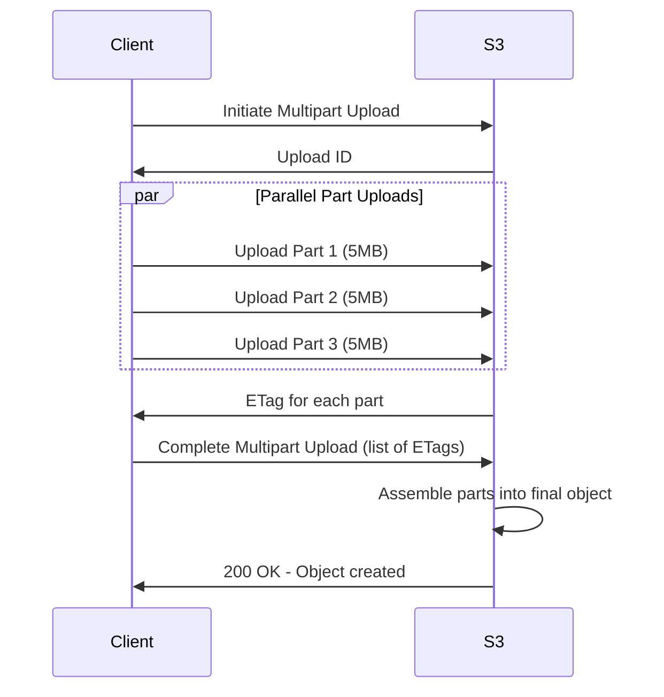
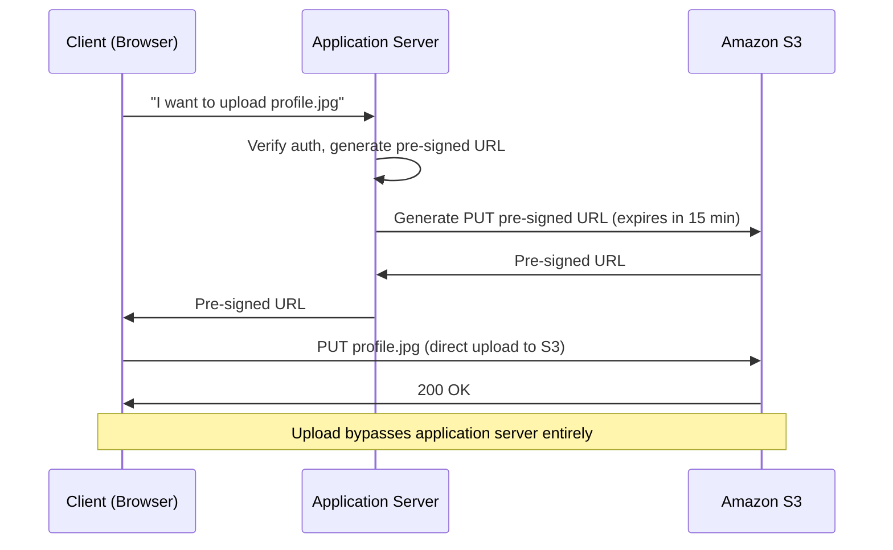
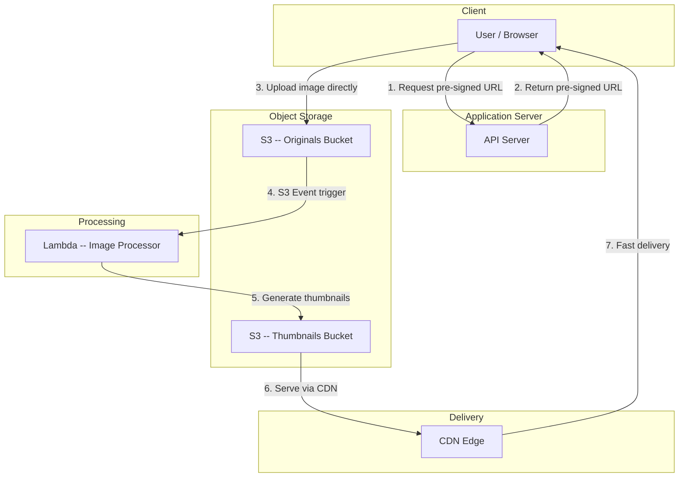
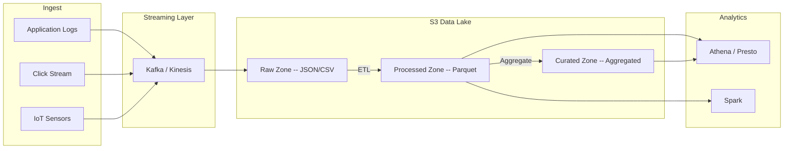

# Object Storage (Blob Storage) -- Deep Dive

## Overview

Object storage stores data as discrete objects in a flat namespace. Each object
contains the data itself (blob), metadata (key-value pairs), and a globally unique
identifier (key). Unlike file systems, there are no directories or hierarchy -- the
"path" is just part of the key string.

```
  Object Storage Structure:
  
  Bucket: my-app-images
  ├── users/profile/alice.jpg          <-- key (looks like path, but it is flat)
  │   ├── Data: [binary image bytes]
  │   ├── Metadata: { content-type: image/jpeg, uploaded-by: alice, size: 45KB }
  │   └── ID: users/profile/alice.jpg
  ├── users/profile/bob.png
  └── thumbnails/alice_128x128.jpg
```

**Access model:** HTTP API (PUT/GET/DELETE). No mounting, no POSIX file operations.

---

## Object Storage vs Block Storage vs File Storage

| Aspect             | Object Storage          | Block Storage           | File Storage            |
|--------------------|-------------------------|-------------------------|-------------------------|
| Data unit          | Object (blob + metadata)| Fixed-size blocks       | Files in directories    |
| Namespace          | Flat (key-based)        | Block addresses         | Hierarchical (paths)    |
| Access protocol    | HTTP REST API           | iSCSI, Fibre Channel    | NFS, SMB/CIFS           |
| Metadata           | Rich, custom per object | None (raw blocks)       | Limited (POSIX attrs)   |
| Scalability        | Virtually unlimited     | Limited by volume       | Limited by filesystem   |
| Performance        | High throughput, higher latency | Lowest latency  | Medium latency          |
| Mutability         | Immutable (replace whole object) | Mutable (edit bytes) | Mutable (edit in place) |
| Use cases          | Images, videos, backups | Databases, VMs, OS disks| Shared file access, NAS |
| Cost               | Cheapest per GB         | Most expensive per GB   | Medium per GB           |
| Examples           | S3, GCS, Azure Blob     | EBS, Persistent Disk    | EFS, FSx, NFS server    |

### When to Use Each

```
  Need to store images/videos for a web app?           --> Object Storage
  Need a disk for a database (PostgreSQL, MySQL)?      --> Block Storage
  Need shared files between multiple servers?          --> File Storage
  Need to archive 50TB of logs cheaply?                --> Object Storage (Glacier)
  Need sub-millisecond I/O for a VM?                   --> Block Storage
  Need a shared home directory for a team?             --> File Storage
```

---

## Amazon S3 Deep Dive

S3 (Simple Storage Service) is the gold standard for object storage. Understanding
S3 deeply is critical because every cloud provider's object storage mirrors its API.

### Core Concepts

**Buckets:**
- Top-level container for objects. Globally unique name across all of AWS.
- Region-specific -- data stays in the region you create the bucket in.
- Flat namespace within bucket. "Folders" in the S3 console are just key prefixes.

**Objects:**
- The data you store. Up to 5TB per object.
- Identified by a key (string, up to 1024 bytes).
- Includes metadata, version ID (if versioning enabled), and an ETag (MD5 hash).

**Keys:**
- The "path" to your object: `photos/2024/january/sunset.jpg`
- Purely a string. S3 does not actually have directories.
- Key design matters for performance (S3 partitions by key prefix).

```
  s3://my-bucket/photos/2024/january/sunset.jpg
  |    |         |
  |    |         └── Key (full object path)
  |    └── Bucket name
  └── Protocol
```

### Storage Classes

| Class               | Durability     | Availability | Min Duration | Retrieval     | Cost (GB/mo)  | Use Case                          |
|---------------------|----------------|--------------|-------------|---------------|---------------|------------------------------------|
| Standard            | 11 9's         | 99.99%       | None        | Instant       | ~$0.023       | Frequently accessed data           |
| Intelligent-Tiering | 11 9's         | 99.9%        | None        | Instant       | ~$0.023 + fee | Unknown access patterns            |
| Standard-IA         | 11 9's         | 99.9%        | 30 days     | Instant       | ~$0.0125      | Infrequent but fast access needed  |
| One Zone-IA         | 11 9's*        | 99.5%        | 30 days     | Instant       | ~$0.01        | Reproducible infrequent data       |
| Glacier Instant     | 11 9's         | 99.9%        | 90 days     | Milliseconds  | ~$0.004       | Archive, instant access needed     |
| Glacier Flexible    | 11 9's         | 99.99%**     | 90 days     | 1-12 hours    | ~$0.0036      | Archive, hours retrieval OK        |
| Glacier Deep Archive| 11 9's         | 99.99%**     | 180 days    | 12-48 hours   | ~$0.00099     | Long-term archive, rare access     |

*One Zone-IA: 11 9's within a single AZ. Data lost if AZ is destroyed.
**After restore.

### Versioning

When enabled, S3 keeps every version of every object. Deleting an object just adds a
"delete marker" -- previous versions remain accessible.

```
  PUT sunset.jpg (v1)  -->  Object: sunset.jpg, Version: v1
  PUT sunset.jpg (v2)  -->  Object: sunset.jpg, Version: v2 (v1 still exists)
  DELETE sunset.jpg    -->  Delete marker added (v1 and v2 still exist)
  GET sunset.jpg       -->  404 (delete marker)
  GET sunset.jpg?versionId=v1  -->  Returns v1
```

**Use cases:**
- Accidental deletion protection
- Audit trail / compliance
- Rollback to previous version
- Data recovery from application bugs

**Cost impact:** Every version is stored and billed. Use lifecycle policies to expire
old versions after N days.

### Lifecycle Policies

Automate transitions between storage classes and expiration of objects.

```
  Example Lifecycle Policy:
  
  Day 0:    Object created in Standard
  Day 30:   Auto-transition to Standard-IA
  Day 90:   Auto-transition to Glacier Flexible
  Day 365:  Auto-transition to Glacier Deep Archive
  Day 730:  Auto-delete
  
  Old versions: Delete after 30 days
  Incomplete multipart uploads: Abort after 7 days
```

This is critical for cost optimization. Without lifecycle policies, data grows
indefinitely at the most expensive tier.

### S3 Durability: 11 9's (99.999999999%)

**What it means:** If you store 10 million objects, you can expect to lose 1 object
every 10,000 years.

**How it is achieved:**
1. Object is split into fragments using erasure coding
2. Fragments are distributed across a minimum of 3 Availability Zones
3. Each AZ has independent power, cooling, and networking
4. S3 continuously verifies data integrity (checksums)
5. If a fragment is lost (disk failure), S3 automatically rebuilds it from remaining fragments
6. No single AZ failure can cause data loss

```
  Object "photo.jpg" (1 MB)
      |
      | Erasure coding (Reed-Solomon)
      v
  [Frag 1] [Frag 2] [Frag 3] [Frag 4] [Frag 5] [Frag 6]
      |        |        |        |        |        |
     AZ-a    AZ-a     AZ-b    AZ-b     AZ-c     AZ-c

  Can lose any 2 fragments and still reconstruct the original object.
  Can lose an entire AZ and still have full data.
```

### S3 Availability

| Class          | Availability SLA | Downtime/Year |
|----------------|------------------|---------------|
| Standard       | 99.99%           | ~53 minutes   |
| Standard-IA    | 99.9%            | ~8.7 hours    |
| One Zone-IA    | 99.5%            | ~1.8 days     |
| Glacier        | 99.99%           | ~53 minutes   |

**Durability vs Availability:** S3 almost never loses your data (durability), but
the service itself may be temporarily unavailable (availability). Your data survives
even if you cannot access it for a few minutes.

### Multipart Upload

For objects larger than 100MB, use multipart upload. Required for objects over 5GB.



**Benefits:**
- Upload parts in parallel (faster)
- Resume failed uploads (only re-upload failed parts)
- Begin upload before you know the total size (streaming)
- Parts can be 5MB to 5GB each. Up to 10,000 parts per upload.

**Critical:** Always set a lifecycle policy to abort incomplete multipart uploads.
They silently consume storage and cost money.

### Pre-Signed URLs

Generate a temporary URL that grants time-limited access to a specific S3 object
without requiring AWS credentials. The URL contains a cryptographic signature.



**Why pre-signed URLs matter:**
- Application server never handles large file uploads (no memory/bandwidth bottleneck)
- Client uploads directly to S3 (scalable, fast)
- Time-limited security (URL expires after configured duration)
- Can restrict to specific HTTP method, key, content type

```
  Pre-signed URL anatomy:
  https://my-bucket.s3.amazonaws.com/uploads/file.jpg
    ?X-Amz-Algorithm=AWS4-HMAC-SHA256
    &X-Amz-Credential=AKIA.../s3/aws4_request
    &X-Amz-Date=20240115T120000Z
    &X-Amz-Expires=900                          (15 minutes)
    &X-Amz-Signature=a3f8b2c1...               (cryptographic signature)
```

### S3 Event Notifications

S3 can trigger events when objects are created, deleted, or restored. These events
can invoke Lambda functions, SQS queues, or SNS topics.

```
  Trigger Events:
  s3:ObjectCreated:*           Any object created (PUT, POST, COPY, multipart)
  s3:ObjectCreated:Put         Only PUT
  s3:ObjectRemoved:*           Any deletion
  s3:ObjectRestore:Completed   Glacier restore finished
  
  Destinations:
  - AWS Lambda (serverless processing)
  - SQS Queue (decouple processing)
  - SNS Topic (fan-out to multiple consumers)
  - EventBridge (complex routing rules)
```

**Common pattern:** Upload image to S3 -> S3 event triggers Lambda -> Lambda generates
thumbnails -> Lambda stores thumbnails back in S3.

### S3 Select

Query data inside S3 objects without downloading the entire object. Works with CSV,
JSON, and Parquet files.

```
  Without S3 Select:
  Download 1GB CSV --> Parse in application --> Extract 10 rows = 1GB transferred
  
  With S3 Select:
  Send SQL query to S3 --> S3 filters in-place --> Return 10 rows = 1KB transferred
  
  Query: SELECT s.name, s.age FROM S3Object s WHERE s.age > 30
```

**Limitations:** Simple queries only. For complex analytics, use Athena (full SQL on S3).

---

## Erasure Coding vs Replication

Two fundamental approaches to achieving durability in distributed storage systems.

### Replication

Store N complete copies of the data on N different nodes/disks.

```
  3x Replication:
  
  Original Data (1 MB)
      |
      ├── Copy 1 (1 MB) --> Node A
      ├── Copy 2 (1 MB) --> Node B
      └── Copy 3 (1 MB) --> Node C
  
  Total storage used: 3 MB (3x overhead)
  Can survive: 2 node failures
```

### Erasure Coding

Split data into k data fragments + m parity fragments using mathematical encoding
(Reed-Solomon). Any k of the (k+m) fragments can reconstruct the original data.

```
  Reed-Solomon (6,4) Erasure Coding:
  
  Original Data (1 MB)
      |
      | Split into 4 data fragments + compute 2 parity fragments
      v
  [D1: 256KB] [D2: 256KB] [D3: 256KB] [D4: 256KB] [P1: 256KB] [P2: 256KB]
      |           |           |           |           |           |
    Node A      Node B      Node C      Node D      Node E      Node F

  Total storage used: 1.5 MB (1.5x overhead)
  Can survive: 2 node failures (any 4 of 6 fragments suffice)
```

### Comparison

| Aspect              | Replication (3x)              | Erasure Coding (6,4)          |
|---------------------|-------------------------------|-------------------------------|
| Storage overhead    | 3x (200% overhead)            | 1.5x (50% overhead)          |
| Fault tolerance     | Survives 2 failures           | Survives 2 failures          |
| Read performance    | Fast -- read from any copy     | Slower -- must read k fragments|
| Write performance   | Fast -- write 3 copies         | Slower -- compute parity      |
| Repair speed        | Fast -- copy from surviving    | Slower -- decode + re-encode  |
| Complexity          | Simple                        | Complex math (Galois fields)  |
| Best for            | Hot data, low latency needed  | Cold/warm data, cost matters  |

**Key insight:** Erasure coding achieves the SAME fault tolerance as replication with
MUCH less storage overhead. This is why S3 and all modern object stores use it.

**S3 specifically:** Uses a form of erasure coding that spreads fragments across 3+
AZs. The exact parameters are not public, but the durability guarantee (11 9's) and
the ability to survive a full AZ loss are the result.

---

## Content-Addressable Storage (CAS)

In CAS, the key (address) of an object is derived from its content -- typically a
cryptographic hash (SHA-256).

```
  Traditional Storage:
  Key: "photos/sunset.jpg"  -->  Value: [binary data]
  Key is chosen by user. Same content uploaded twice = two objects.

  Content-Addressable Storage:
  Key: SHA256(content) = "a3f8b2c1d4e5..."  -->  Value: [binary data]
  Key is derived from content. Same content uploaded twice = same key = one object.
```

### Benefits

| Benefit         | How                                                            |
|-----------------|----------------------------------------------------------------|
| Deduplication   | Identical files automatically share the same storage           |
| Integrity       | Hash verifies data has not been corrupted or tampered with     |
| Immutability    | Content cannot change without changing the key                 |
| Caching         | Content at a given hash is guaranteed to never change          |

### Real-World Uses
- **Git:** Every commit, tree, and blob is content-addressed (SHA-1/SHA-256)
- **Docker:** Container image layers are content-addressed
- **IPFS:** Distributed content-addressed file system
- **Package managers:** npm, pip verify package integrity with content hashes
- **CDN cache busting:** /app.a3f8b2c1.js -- hash of JS content is in the filename

### Deduplication Example

```
  User A uploads photo.jpg (5 MB)  -->  SHA256 = abc123
  User B uploads photo.jpg (5 MB)  -->  SHA256 = abc123  (same content!)
  
  Without CAS:  10 MB stored (two copies)
  With CAS:      5 MB stored (one copy, two references)
  
  At scale (millions of users), CAS can reduce storage by 30-60% for
  workloads with duplicate content (backup systems, file sharing).
```

---

## Cloud Provider Comparison

| Feature               | Amazon S3               | Google Cloud Storage     | Azure Blob Storage       |
|-----------------------|-------------------------|--------------------------|--------------------------|
| Storage classes       | 7 (Standard to Deep Archive)| 4 (Standard to Coldline) | 4 (Hot to Archive)      |
| Max object size       | 5 TB                    | 5 TB                     | ~4.75 TB (block blob)   |
| Durability            | 11 9's                  | 11 9's                   | 16 9's (RA-GRS)         |
| Versioning            | Yes                     | Yes                      | Yes (snapshots + versions)|
| Lifecycle policies    | Yes                     | Yes                      | Yes                      |
| Event triggers        | Lambda, SQS, SNS, EB    | Cloud Functions, Pub/Sub | Azure Functions, Event Grid|
| Encryption at rest    | SSE-S3, SSE-KMS, SSE-C  | Google-managed, CMEK, CSEK| Microsoft-managed, CMK  |
| Pre-signed URLs       | Yes                     | Yes (signed URLs)        | Yes (SAS tokens)         |
| Multi-region          | Cross-Region Replication | Dual/Multi-region buckets| RA-GRS, RA-GZRS         |
| Query in-place        | S3 Select, Athena       | BigQuery external tables | Azure Data Lake Analytics|
| Free tier             | 5 GB, 12 months         | 5 GB, always free        | 5 GB, 12 months         |
| API compatibility     | S3 API (de facto standard)| S3-compatible + native | Native only              |

**Important note:** S3's API has become the de facto standard. GCS offers S3-compatible
endpoints. Many open-source tools (MinIO, Ceph) implement the S3 API. Designing around
S3's API means you are not locked into AWS.

---

## Design Patterns

### Pattern 1: Image Upload Pipeline

The most common object storage pattern in system design interviews.



**Step-by-step flow:**
1. Client requests upload permission from API server
2. API server authenticates user, generates pre-signed PUT URL for S3
3. Client uploads image directly to S3 (bypasses API server entirely)
4. S3 event notification triggers Lambda function
5. Lambda reads original, generates thumbnails (128x128, 256x256, 512x512)
6. Lambda writes thumbnails to a separate bucket (or prefix)
7. Thumbnails are served via CDN with long cache TTL (immutable content)

**Why this pattern works:**
- API server never handles large file uploads (saves CPU, memory, bandwidth)
- S3 handles storage durability (11 9's)
- Lambda scales automatically (1000 concurrent image processings)
- CDN ensures fast delivery globally
- Pre-signed URLs provide security without credential exposure

### Pattern 2: Data Lake Architecture



### Pattern 3: Backup and Disaster Recovery

```
  Backup Strategy with S3 Lifecycle:
  
  Active DB  -->  Daily backup to S3 Standard
                      |
                      | 7 days: Transition to Standard-IA
                      | 30 days: Transition to Glacier Flexible
                      | 365 days: Transition to Glacier Deep Archive
                      | 7 years: Delete (compliance retention met)
  
  Cross-region replication for disaster recovery:
  S3 (us-east-1)  -->  S3 (eu-west-1)  -->  S3 (ap-southeast-1)
  
  RPO: Minutes (replication lag)
  RTO: Hours (restore from Glacier) or Minutes (restore from Standard)
```

---

## Performance Optimization

### S3 Request Rate Limits

S3 supports at least 3,500 PUT/COPY/POST/DELETE and 5,500 GET/HEAD requests per second
per partitioned prefix.

**Key prefix partitioning:**

```
  BAD (all objects share one prefix):
  s3://bucket/data/2024-01-15-file001.csv
  s3://bucket/data/2024-01-15-file002.csv
  s3://bucket/data/2024-01-15-file003.csv
  --> All requests hit same partition. Throttled at 5,500 GET/s.

  GOOD (spread across prefixes):
  s3://bucket/a1/data/2024-01-15-file001.csv
  s3://bucket/b2/data/2024-01-15-file002.csv
  s3://bucket/c3/data/2024-01-15-file003.csv
  --> Requests spread across partitions. Each gets 5,500 GET/s.
```

**Note:** S3 now auto-partitions by prefix. The old advice of adding random prefixes is
less critical, but understanding the concept matters for interviews.

### Transfer Acceleration

S3 Transfer Acceleration routes uploads through CloudFront edge locations and then over
AWS's optimized backbone network to the S3 bucket.

```
  Without Acceleration:
  User (Australia) --[public internet]--> S3 (US-East)    Slow, variable

  With Transfer Acceleration:
  User (Australia) --> CloudFront Edge (Sydney) --[AWS backbone]--> S3 (US-East)   Faster
```

Typical improvement: 50-500% for long-distance transfers.

---

## Interview Questions with Answers

### Q1: How would you design an image hosting service like Imgur?

**Answer:**
1. **Upload flow:** Client requests pre-signed URL from API -> uploads directly to S3
2. **Processing:** S3 event triggers Lambda to generate multiple sizes (thumbnail, medium, full)
3. **Storage:** Original in S3 Standard. If not accessed for 30 days, lifecycle transitions to IA.
4. **Delivery:** All images served through CDN. Content-hashed URLs with 1-year TTL.
5. **Metadata:** Store image metadata (uploader, dimensions, tags) in a database (DynamoDB or PostgreSQL), not in S3 metadata.
6. **Deduplication:** Hash the image content on upload. If hash exists, return existing URL instead of storing duplicate.
7. **Deletion:** Soft delete (add delete marker). Hard delete after grace period.

### Q2: Explain the difference between S3 durability and availability.

**Answer:**
- **Durability (11 9's):** The probability that your data will NOT be lost. Over 10,000 years, you might lose 1 out of 10 million objects. Achieved through erasure coding across multiple AZs.
- **Availability (99.99%):** The probability that the service is operational and you can read/write data. This means up to ~53 minutes of downtime per year. S3 might be temporarily unreachable, but your data is safe.
- **Analogy:** A bank vault has high durability (your gold is safe) even if the bank is closed on holidays (lower availability).

### Q3: When would you use S3 Glacier vs just deleting old data?

**Answer:**
Use Glacier when:
- Legal/compliance requires retaining data for N years (HIPAA, SOX, GDPR)
- Data might be needed for audits or investigations (rare but critical access)
- Data has future analytical value (ML training on historical data)
- Cost of keeping data in Glacier ($1/TB/month) is cheaper than re-creating it

Delete data when:
- No compliance requirement
- Data is easily reproducible (cache, derived data, temp files)
- Storage costs outweigh potential future value

### Q4: How does pre-signed URL security work?

**Answer:**
1. Server generates URL containing: bucket, key, expiration time, and HMAC signature
2. Signature is computed using the server's AWS secret key (never exposed)
3. Client uses URL to upload/download directly to/from S3
4. S3 verifies the signature, checks expiration, and validates the operation
5. If the URL is intercepted after expiration, it is useless
6. Can restrict to specific HTTP method (PUT only), key, content type, and file size

**Security considerations:**
- Set short expiration (5-15 minutes for uploads)
- Include content-type restriction to prevent uploading executable files
- Use separate buckets for user uploads (isolate from application data)
- Scan uploaded files for malware before making them public

### Q5: You need to store 100TB of log data per day. Design the storage.

**Answer:**
1. **Ingest:** Stream logs through Kafka/Kinesis into S3
2. **Format:** Store as compressed Parquet (columnar, ~10x compression vs JSON)
3. **Partitioning:** `s3://logs/year=2024/month=01/day=15/hour=14/` for efficient querying
4. **Lifecycle policy:**
   - 0-7 days: Standard (active analysis)
   - 7-30 days: Standard-IA (occasional access)
   - 30-90 days: Glacier Instant Retrieval
   - 90-365 days: Glacier Flexible
   - 365+ days: Deep Archive or delete
5. **Querying:** Athena for ad-hoc SQL queries on Parquet files in S3
6. **Cost estimate:** 100TB/day = 3PB/month raw. With compression ~300TB.
   Standard: $6,900/mo -> IA after 7 days: $3,750/mo -> Glacier: $1,080/mo

### Q6: How would you migrate from one object storage provider to another?

**Answer:**
1. **Dual-write phase:** New uploads go to both old and new storage
2. **Background migration:** Copy existing objects using a migration tool (rclone, AWS DataSync, or custom worker fleet)
3. **Verification:** Compare object counts, sizes, and checksums between providers
4. **DNS switch:** Update CDN origin to point to new storage
5. **Read fallback:** If object not found in new storage, fall back to old (for migration stragglers)
6. **Cleanup:** After verification period, decommission old storage
7. **Key consideration:** If using S3-compatible API on new provider, application code changes are minimal

---

## Key Takeaways for Interviews

1. **Object storage** = flat namespace, HTTP API, immutable objects. Best for unstructured
   data (images, videos, logs, backups).
2. **S3's 11 9's durability** comes from erasure coding across 3+ AZs. Understand the
   difference between durability and availability.
3. **Pre-signed URLs** are the standard pattern for user uploads. Client uploads directly
   to S3, bypassing your application server entirely.
4. **Lifecycle policies** are essential for cost management. Data should automatically
   transition from hot to cold storage tiers.
5. **Erasure coding** achieves the same fault tolerance as replication with ~50% overhead
   instead of 200%. This is why it is used in all modern object stores.
6. **Image upload pipeline** (pre-signed URL -> S3 -> Lambda -> thumbnail -> CDN) is the
   most common object storage pattern in interviews. Know it cold.
7. **Content-addressable storage** enables deduplication -- identical content maps to the
   same key. Used in Git, Docker, and backup systems.
8. **In interviews:** Always mention how you handle upload (pre-signed URL), processing
   (event-driven Lambda), storage tiers (lifecycle), and delivery (CDN).
