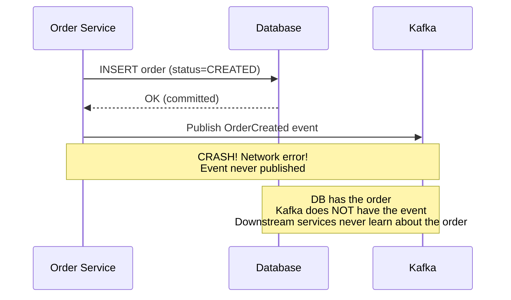
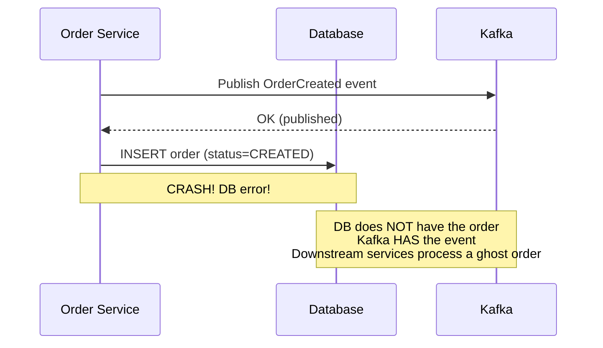
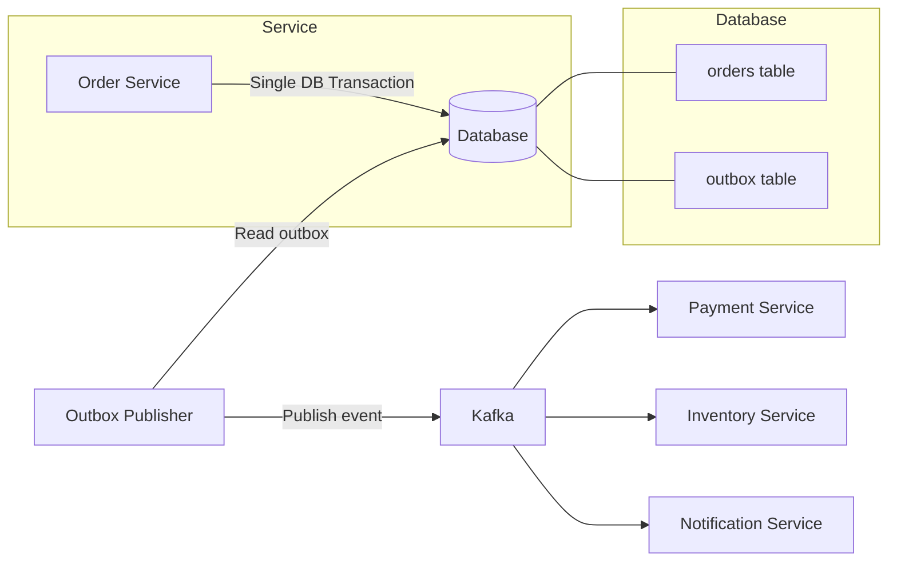
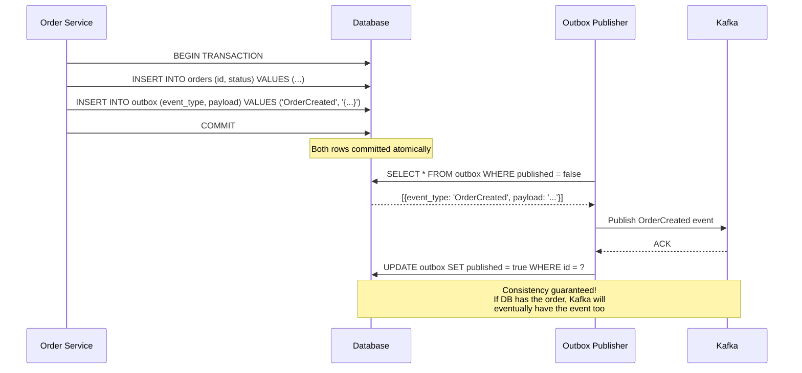
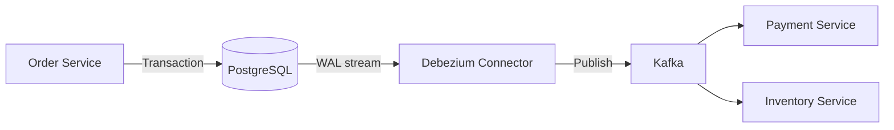
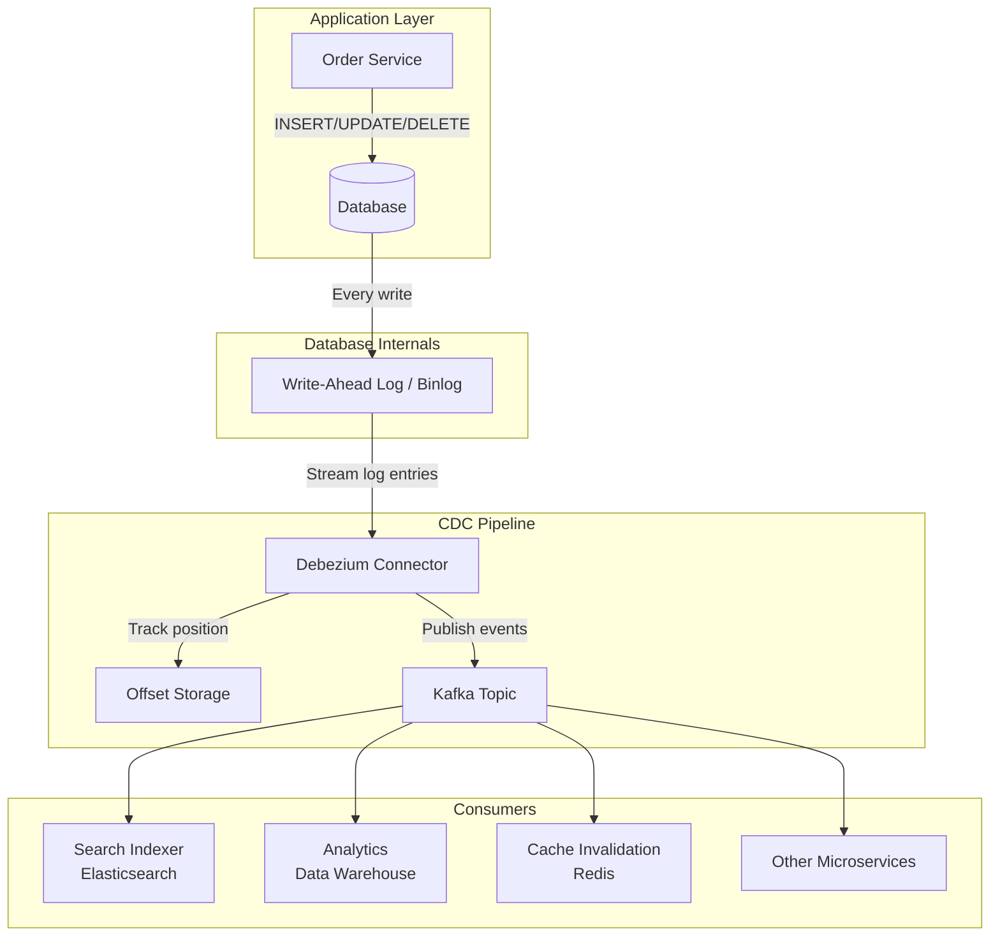
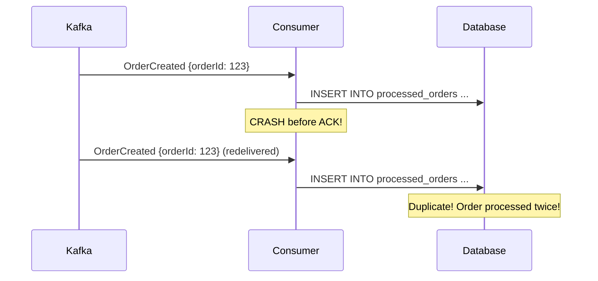
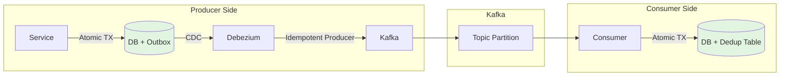

# Transactional Outbox Pattern and Change Data Capture (CDC)

## The Dual-Write Problem

One of the most common bugs in microservice architectures: a service needs to update its database AND publish an event to a message broker (Kafka, RabbitMQ). These are two separate systems, and there is no atomic transaction spanning both.

### What Goes Wrong



The inverse is equally bad:



**Neither order of operations is safe.** Publishing first risks ghost events. Committing first risks lost events. You cannot make two independent systems consistent without a protocol.

### Why Not Just Use a Transaction?

Databases and message brokers are different systems with different transaction protocols. You cannot wrap a PostgreSQL INSERT and a Kafka publish in the same transaction. Some brokers support transactions (Kafka does), but not cross-system transactions with your database.

---

## The Transactional Outbox Pattern

### Core Idea

Instead of publishing the event directly to the message broker, **write the event to an "outbox" table in the SAME database transaction as the business data**. A separate process then reads the outbox and publishes to the broker.

This works because a single database transaction IS atomic. Either both the business data AND the outbox row are committed, or neither is.

### Architecture



### Step by Step



### Outbox Table Schema

```sql
CREATE TABLE outbox (
    id              UUID PRIMARY KEY DEFAULT gen_random_uuid(),
    aggregate_type  VARCHAR(100) NOT NULL,    -- e.g., 'Order', 'Payment'
    aggregate_id    VARCHAR(100) NOT NULL,    -- e.g., order-123
    event_type      VARCHAR(100) NOT NULL,    -- e.g., 'OrderCreated'
    payload         JSONB NOT NULL,           -- Full event data
    created_at      TIMESTAMP NOT NULL DEFAULT NOW(),
    published       BOOLEAN NOT NULL DEFAULT FALSE,
    published_at    TIMESTAMP,
    retry_count     INT DEFAULT 0
);

-- Index for the publisher to efficiently find unpublished events
CREATE INDEX idx_outbox_unpublished ON outbox (created_at) 
    WHERE published = FALSE;

-- Partition by time for easy cleanup of old published events
-- (optional, for high-volume systems)
```

### The Business Transaction (Application Code)

```java
@Transactional  // Single database transaction
public Order createOrder(CreateOrderRequest request) {
    // 1. Business logic
    Order order = new Order(request.getCustomerId(), request.getItems());
    order.setStatus(OrderStatus.CREATED);
    orderRepository.save(order);

    // 2. Write event to outbox (same transaction!)
    OutboxEvent event = new OutboxEvent(
        "Order",                           // aggregate type
        order.getId().toString(),           // aggregate id
        "OrderCreated",                     // event type
        objectMapper.writeValueAsString(    // payload
            new OrderCreatedEvent(order.getId(), order.getItems(), order.getTotal())
        )
    );
    outboxRepository.save(event);

    return order;
    // When this method returns, BOTH the order AND the outbox event
    // are committed in a single atomic transaction
}
```

---

## Two Approaches to Publishing from the Outbox

### Approach 1: Polling Publisher

A background process periodically queries the outbox table for unpublished events and publishes them.

```java
@Scheduled(fixedRate = 1000)  // Every 1 second
public void publishOutboxEvents() {
    List<OutboxEvent> events = outboxRepo.findUnpublished(BATCH_SIZE);
    
    for (OutboxEvent event : events) {
        try {
            kafkaTemplate.send(
                event.getEventType(),          // topic name
                event.getAggregateId(),        // key (for partitioning)
                event.getPayload()             // value
            ).get();  // Wait for Kafka ACK
            
            event.setPublished(true);
            event.setPublishedAt(Instant.now());
            outboxRepo.save(event);
            
        } catch (Exception e) {
            event.setRetryCount(event.getRetryCount() + 1);
            outboxRepo.save(event);
            
            if (event.getRetryCount() > MAX_RETRIES) {
                // Move to dead letter for manual investigation
                deadLetterService.handle(event);
            }
        }
    }
}
```

**Pros:**
- Simple to implement
- Works with any database
- Easy to understand and debug

**Cons:**
- Polling delay: events are published with up to N seconds of latency
- Database load: constant queries against the outbox table
- Scaling: multiple publisher instances need leader election to avoid duplicates
- Tricky to get right: what about publisher crashes between publish and marking published?

### Approach 2: CDC-Based (Change Data Capture)

Instead of polling, read the database's transaction log (binlog/WAL) directly. A CDC tool like Debezium watches the outbox table for new rows and publishes them to Kafka automatically.



**Pros:**
- Near real-time: events published within milliseconds of commit
- No polling overhead on the database
- No missed events: the transaction log is the source of truth
- Handles publisher crashes: Debezium tracks its position in the log

**Cons:**
- More infrastructure: Debezium, Kafka Connect
- Database-specific: different connectors for MySQL, PostgreSQL, MongoDB
- Operational complexity: monitoring Debezium connectors, handling schema changes

**CDC is the recommended approach for production systems.** The operational overhead is worth the reliability and latency benefits.

---

## Change Data Capture (CDC) Deep Dive

### What Is CDC?

Change Data Capture reads the internal changelog of a database (the write-ahead log/WAL in PostgreSQL, the binlog in MySQL) and publishes each change as an event. Every INSERT, UPDATE, and DELETE becomes an event with before and after values.

### How It Works Internally

```
1. Application writes to database
2. Database writes to WAL/binlog (this is how databases work internally anyway)
3. CDC tool (Debezium) reads the WAL/binlog as a stream
4. CDC tool converts each log entry to a structured event
5. CDC tool publishes the event to Kafka (or another target)
6. CDC tool periodically checkpoints its position in the log
```



### Event Format (Debezium)

When a row changes, Debezium publishes an event with this structure:

```json
{
  "before": null,
  "after": {
    "id": "order-123",
    "customer_id": "cust-456",
    "status": "CREATED",
    "total": 99.99,
    "created_at": 1680000000000
  },
  "source": {
    "version": "2.4.0",
    "connector": "postgresql",
    "name": "orders-db",
    "ts_ms": 1680000000123,
    "db": "orders",
    "schema": "public",
    "table": "orders"
  },
  "op": "c",
  "ts_ms": 1680000000456
}
```

| Field | Meaning |
|---|---|
| `before` | Row state before the change (null for INSERT) |
| `after` | Row state after the change (null for DELETE) |
| `op` | Operation: `c` = create, `u` = update, `d` = delete, `r` = snapshot read |
| `source.ts_ms` | Timestamp of the database change |
| `source.table` | Which table changed |

For an UPDATE:

```json
{
  "before": {
    "id": "order-123",
    "status": "CREATED",
    "total": 99.99
  },
  "after": {
    "id": "order-123",
    "status": "CONFIRMED",
    "total": 99.99
  },
  "op": "u"
}
```

### Debezium Connectors

| Database | Log Type | Connector | Notes |
|---|---|---|---|
| PostgreSQL | WAL (logical replication) | `io.debezium.connector.postgresql` | Requires `wal_level=logical` |
| MySQL | Binlog | `io.debezium.connector.mysql` | Requires `binlog_format=ROW` |
| MongoDB | Oplog / Change Streams | `io.debezium.connector.mongodb` | Uses change streams (4.0+) |
| SQL Server | CT (Change Tracking) | `io.debezium.connector.sqlserver` | Requires CDC to be enabled |
| Oracle | LogMiner / XStream | `io.debezium.connector.oracle` | Complex setup |

### Debezium Configuration Example (PostgreSQL)

```json
{
  "name": "orders-outbox-connector",
  "config": {
    "connector.class": "io.debezium.connector.postgresql.PostgresConnector",
    "database.hostname": "orders-db",
    "database.port": "5432",
    "database.user": "debezium",
    "database.password": "secret",
    "database.dbname": "orders",
    "database.server.name": "orders-db",
    "table.include.list": "public.outbox",
    "transforms": "outbox",
    "transforms.outbox.type": "io.debezium.transforms.outbox.EventRouter",
    "transforms.outbox.table.field.event.key": "aggregate_id",
    "transforms.outbox.table.field.event.type": "event_type",
    "transforms.outbox.table.field.event.payload": "payload",
    "transforms.outbox.route.topic.replacement": "${routedByValue}",
    "transforms.outbox.table.expand.json.payload": true
  }
}
```

The `EventRouter` transform is specifically designed for the outbox pattern -- it routes outbox rows to the correct Kafka topic based on the event type and uses the aggregate ID as the Kafka message key.

---

## CDC Use Cases Beyond Outbox

### 1. Sync Databases

Replicate data from an operational database to an analytical database without impacting the source.

```
PostgreSQL (OLTP) --CDC--> Kafka --> Snowflake (OLAP)
```

### 2. Feed Search Index

Keep Elasticsearch in sync with the source of truth database.

```
MySQL (orders table) --CDC--> Kafka --> Elasticsearch Consumer
                                        --> Index order documents
```

### 3. Build Materialized Views

Aggregate data from multiple tables/services into a read-optimized view.

```
Orders DB --CDC--> Kafka -+
                          |--> Materializer --> Denormalized View DB
Customers DB --CDC--> Kafka -+
```

### 4. Cache Invalidation

Invalidate or update cache entries when the underlying data changes.

```
PostgreSQL --CDC--> Kafka --> Cache Invalidation Consumer --> Redis DEL key
```

### 5. Audit Log

Capture every change to a table as an immutable audit trail.

```
Users table --CDC--> Kafka --> Audit Log Consumer --> audit_log table
                                                     (who changed what, when)
```

### 6. Event Sourcing Bridge

If you are not ready for full event sourcing, CDC gives you an event stream from a traditional CRUD database.

---

## Idempotent Consumers

Because messages can be delivered more than once (broker retry, consumer crash before acknowledging), consumers MUST handle duplicates gracefully.

### The Problem



### Solution: Idempotency Key + Dedup Table

```sql
-- Deduplication table
CREATE TABLE processed_events (
    event_id    VARCHAR(255) PRIMARY KEY,  -- Idempotency key
    processed_at TIMESTAMP NOT NULL DEFAULT NOW()
);
```

```java
@Transactional
public void handleOrderCreated(OrderCreatedEvent event) {
    // 1. Check if already processed
    if (processedEventRepo.existsById(event.getEventId())) {
        log.info("Event {} already processed, skipping", event.getEventId());
        return;
    }

    // 2. Execute business logic
    paymentService.createPaymentIntent(event.getOrderId(), event.getTotal());

    // 3. Record that we processed this event (same transaction as step 2!)
    processedEventRepo.save(new ProcessedEvent(event.getEventId(), Instant.now()));
}
```

The dedup check and business logic happen in the **same database transaction**. This ensures:
- If the business logic commits, the dedup record also commits
- If the consumer crashes, neither commits, and the retry will be handled correctly

### Natural Idempotency

Some operations are naturally idempotent and do not need a dedup table:

```sql
-- Naturally idempotent (SET operations):
UPDATE users SET email = 'new@example.com' WHERE id = 123;
-- Running this twice has the same effect as running it once

-- NOT naturally idempotent (INCREMENT operations):
UPDATE accounts SET balance = balance + 50 WHERE id = 123;
-- Running this twice doubles the effect!
```

Design for natural idempotency when possible:

```sql
-- Instead of incrementing a counter:
UPDATE inventory SET quantity = quantity - 1 WHERE product_id = ?;

-- Use a reservation record (idempotent):
INSERT INTO inventory_reservations (reservation_id, product_id, quantity)
VALUES (?, ?, 1)
ON CONFLICT (reservation_id) DO NOTHING;
-- The actual inventory count is derived: stock - SUM(reservations)
```

---

## Exactly-Once Semantics: The Full Picture

True exactly-once processing requires three things working together:

### 1. Producer Idempotency

Kafka supports idempotent producers. Each producer gets a unique ID, and each message gets a sequence number. Kafka deduplicates based on (producer_id, sequence_number).

```java
Properties props = new Properties();
props.put("enable.idempotence", "true");  // Kafka producer idempotency
props.put("acks", "all");                 // Required for idempotency
KafkaProducer<String, String> producer = new KafkaProducer<>(props);
```

### 2. Transactional Consumer (Read-Process-Write)

Consume a message, process it, and write the result in a single atomic operation. In Kafka, this means using consumer offsets within a Kafka transaction.

```java
// Kafka Streams exactly-once
Properties props = new Properties();
props.put(StreamsConfig.PROCESSING_GUARANTEE_CONFIG, "exactly_once_v2");
```

### 3. Consumer-Side Deduplication

For consumers that write to an external database (not back to Kafka), use the dedup table pattern described above.

### The Complete Pipeline



```
End-to-end exactly-once:

1. Producer: DB + Outbox in ONE transaction      (no lost events)
2. CDC:      Reads WAL, idempotent publish        (no duplicates into Kafka)
3. Kafka:    Idempotent producer, exactly-once    (no duplicates in topic)
4. Consumer: Business logic + dedup in ONE TX     (no duplicate processing)
```

---

## Real-World Implementations

### Stripe

Stripe uses the outbox pattern internally. When a payment is processed:
1. Payment record and outbox event are written in a single PostgreSQL transaction
2. A publisher reads the outbox and publishes to their internal event bus
3. Downstream services (fraud, analytics, webhooks) consume events
4. Stripe exposes `Idempotency-Key` headers for merchant-side deduplication

### Uber

Uber's Cherami (and later Kafka-based) event pipeline uses CDC:
1. Trip updates are written to MySQL
2. Debezium captures binlog changes
3. Events flow to Kafka topics consumed by dispatch, pricing, and ETA services

### Netflix

Netflix uses CDC to:
- Sync their MySQL databases with Elasticsearch for search
- Feed their data warehouse for analytics
- Invalidate caches when source data changes

### Shopify

Shopify processes millions of events per second using the outbox pattern:
1. Order modifications and outbox events written together in MySQL
2. Custom CDC tool reads binlog
3. Events published to their internal message bus
4. Downstream: inventory, payments, notifications, analytics

---

## Operational Considerations

### Outbox Table Cleanup

Published events accumulate in the outbox table. Clean them up:

```sql
-- Delete published events older than 7 days
DELETE FROM outbox 
WHERE published = TRUE 
AND created_at < NOW() - INTERVAL '7 days';

-- Or use table partitioning by day for instant drops:
-- DROP partition for events older than 7 days
```

### Monitoring

Key metrics to monitor:

| Metric | What It Means | Alert Threshold |
|---|---|---|
| Outbox lag (unpublished count) | Publisher falling behind | > 1000 unpublished events |
| Publish latency (created_at to published_at) | How stale events are | > 5 seconds |
| CDC connector lag | Debezium falling behind WAL | > 10 seconds |
| Consumer lag | Consumer falling behind Kafka | > 10,000 messages |
| Dead letter queue size | Unprocessable events | > 0 (investigate every one) |
| Dedup hit rate | Duplicate deliveries | > 5% may indicate infrastructure issues |

### Schema Evolution

As your event payload changes over time, you need a strategy:
- **Schema Registry** (Confluent): register Avro/Protobuf schemas, enforce compatibility
- **Backward compatible changes only**: add fields with defaults, never remove or rename
- **Versioned events**: `OrderCreated.v1`, `OrderCreated.v2`

---

## Interview Cheat Sheet

```
Q: "How do you ensure a database update and an event publish happen atomically?"

Answer Framework:
1. State the dual-write problem clearly
2. "You cannot do a distributed transaction across DB and Kafka"
3. "The solution is the Transactional Outbox pattern"
4. Explain: write event to outbox table in same DB transaction
5. Two ways to publish: polling (simple) or CDC (better)
6. Mention Debezium for CDC
7. Consumer side: idempotent consumers with dedup table

Q: "What is CDC and when would you use it?"

Answer:
- CDC reads the database's internal transaction log (WAL/binlog)
- Every INSERT/UPDATE/DELETE becomes a structured event
- Use cases: outbox publishing, search sync, cache invalidation,
  analytics pipeline, audit logs
- Debezium is the standard tool (connects to MySQL, PostgreSQL, MongoDB)
- Much better than dual-writes or polling

Key Phrases:
- "Outbox table in the same transaction as business data"
- "CDC reads the write-ahead log, not the table"
- "At-least-once delivery requires idempotent consumers"
- "Dedup table in the same transaction as business logic"
- "Exactly-once = idempotent producer + transactional consumer + dedup"
```

---

## Summary

| Concept | Key Point |
|---|---|
| Dual-write problem | Cannot atomically update DB + publish event |
| Outbox pattern | Write event to outbox table in same DB transaction |
| Polling publisher | Simple but adds latency and DB load |
| CDC publisher | Reads WAL/binlog, near real-time, recommended |
| Debezium | Standard CDC tool, connectors for all major databases |
| CDC event format | Before/after values, operation type, source metadata |
| Idempotent consumer | Dedup table + business logic in same transaction |
| Natural idempotency | Design SET operations over INCREMENT operations |
| Exactly-once | Producer idempotency + transactional consumer + dedup |
| Outbox cleanup | Delete old published rows or use table partitioning |
