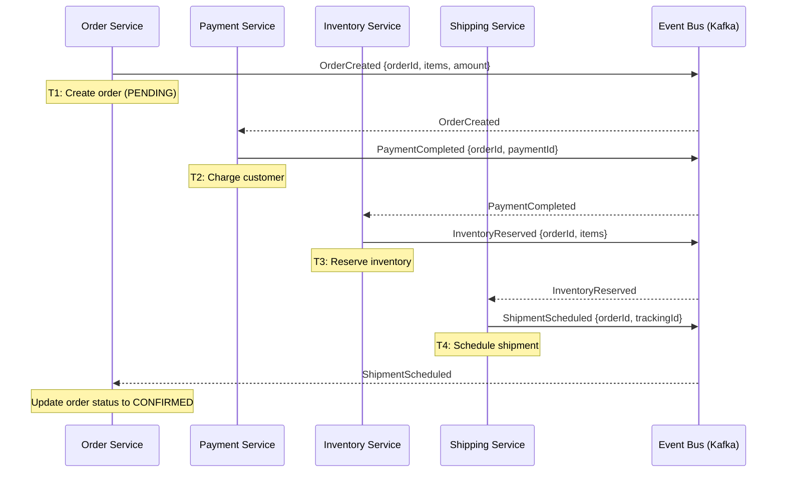
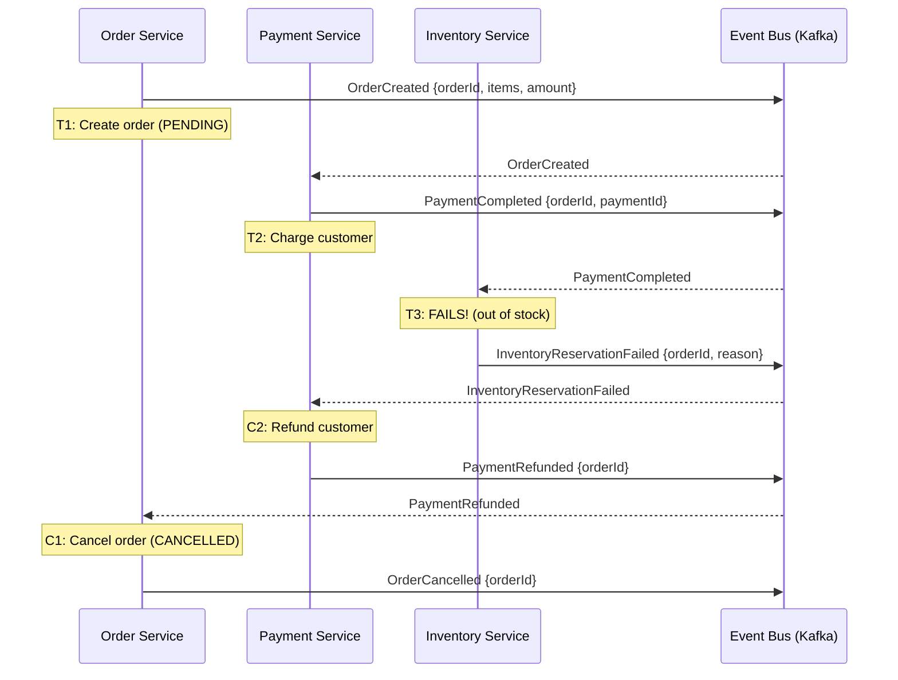
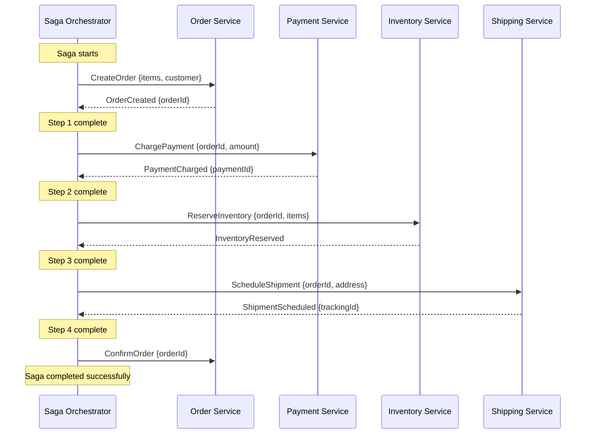
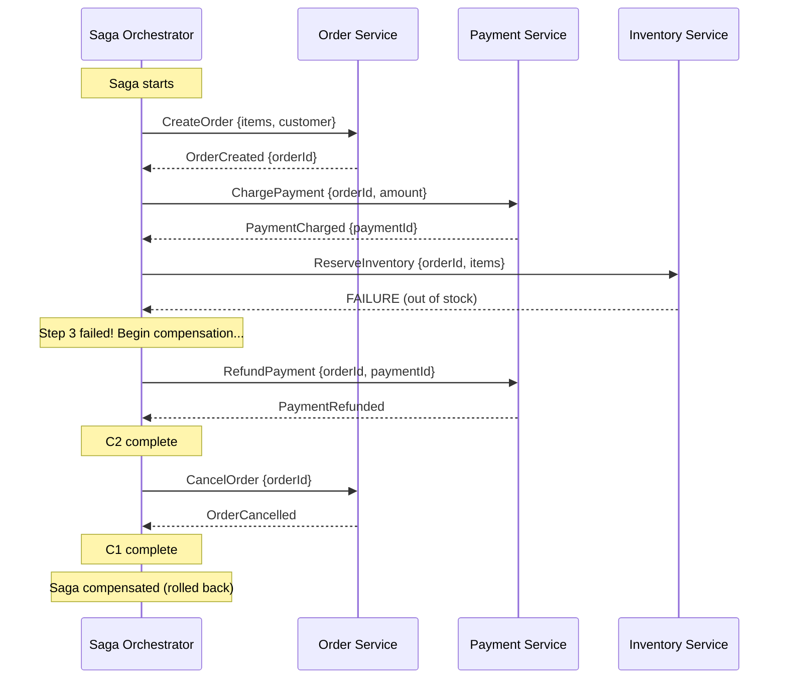
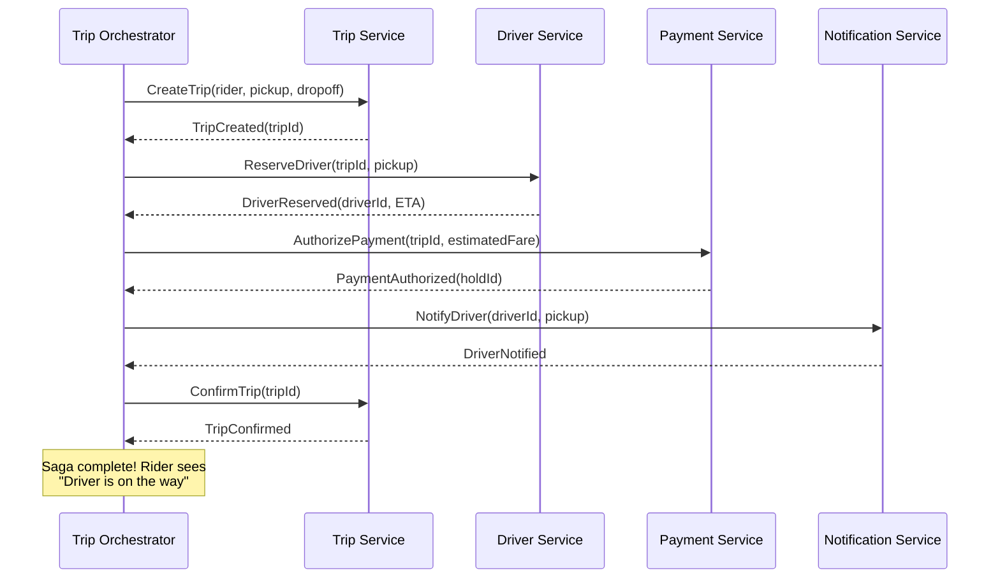
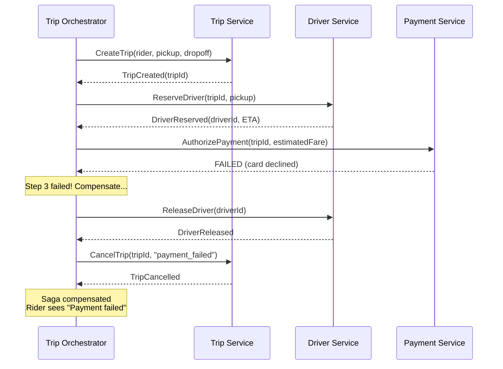

# Saga Pattern

## Why Sagas Exist

Two-Phase Commit (2PC) does not work for microservices. The reasons are fundamental:

1. **Lock duration**: 2PC holds locks across network round-trips. In a microservice architecture where a business transaction spans 5-10 services, this means seconds of lock time. Throughput collapses.
2. **Coupling**: 2PC requires all participants to be available simultaneously and to speak the same transaction protocol. Microservices are independently deployed, independently scaled, and may use different databases.
3. **Availability**: 2PC is a blocking protocol. If the coordinator or any participant is down, the entire transaction blocks. This violates the microservice promise of independent availability.

The Saga pattern is the answer: **break a distributed transaction into a sequence of local transactions, each in its own service, coordinated through events or commands.**

---

## What Is a Saga?

A saga is a sequence of local transactions T1, T2, ..., Tn where:

- Each Ti updates a single service's database and publishes an event/message
- If all Ti succeed, the saga completes successfully
- If any Ti fails, compensating transactions C(i-1), C(i-2), ..., C1 are executed in reverse order to undo the effects of the preceding transactions

```
Happy path:
  T1 -----> T2 -----> T3 -----> T4 -----> DONE (success)

Failure at T3:
  T1 -----> T2 -----> T3 (FAIL!)
                        |
                        v
                 C2 <----- C1 <----- DONE (compensated)
```

### Compensating Transactions

A compensating transaction is the **semantic inverse** of the original transaction. It is NOT a rollback -- it is a new forward transaction that undoes the business effect.

| Original Transaction | Compensating Transaction |
|---|---|
| Charge credit card $50 | Refund $50 to credit card |
| Reserve 1 unit of inventory | Release 1 unit of inventory |
| Create order with status PENDING | Update order status to CANCELLED |
| Send confirmation email | Send cancellation email |
| Reserve a driver | Release driver, mark available |

Key insight: some transactions **cannot be compensated**. Sending a physical package cannot be undone. This is why:
- Order the saga steps carefully: put non-compensatable steps last
- Use the concept of **pivot transactions** -- the step after which the saga can only go forward

```
Compensatable steps      Pivot       Retryable steps
  T1 ----> T2 ----> T3 (pivot) ----> T4 ----> T5
  ^                   ^                        ^
  Can be undone     Point of no return    Must succeed (retry)
```

---

## Two Coordination Approaches

### 1. Choreography-Based Saga

Each service listens for events and reacts by executing its local transaction and publishing the next event. There is no central coordinator -- services collaborate through an event bus.

#### Happy Path



#### Failure Path (Inventory Fails)



#### Choreography Pros and Cons

**Pros:**
- Simple to implement for small sagas (3-4 steps)
- No single point of failure -- fully decentralized
- Loose coupling -- services only know about events, not each other
- Each service is independently deployable
- Natural fit for event-driven architectures

**Cons:**
- Hard to understand the full flow -- logic is spread across services
- Difficult to debug -- tracing a saga requires correlating events across services
- Risk of cyclic dependencies (Service A listens to Service B which listens to Service A)
- Adding a new step requires modifying multiple services
- No single place to see the saga's current state
- Implicit ordering makes it easy to accidentally break the flow

---

### 2. Orchestration-Based Saga

A central **Saga Orchestrator** (also called a process manager) coordinates the entire saga. It sends commands to each service and waits for responses. The orchestrator maintains the saga's state and knows what to do next -- including compensation on failure.

#### Happy Path



#### Failure Path (Inventory Fails)



#### Orchestration Pros and Cons

**Pros:**
- Easy to understand -- the entire flow is in one place
- Easy to debug -- the orchestrator has the saga's state
- Easy to add/remove steps -- modify the orchestrator only
- Explicit compensation logic -- clear what happens on failure
- Services are simpler -- they just execute commands, no event routing logic
- Saga state is queryable (what step is this order on?)

**Cons:**
- Orchestrator complexity -- it must handle all failure modes
- Potential single point of failure (mitigated by replication)
- Risk of centralizing too much logic in the orchestrator
- Orchestrator can become a bottleneck at extreme scale
- Tighter coupling between orchestrator and services (orchestrator knows all services)

---

## Choreography vs Orchestration: Comparison

| Criteria | Choreography | Orchestration |
|---|---|---|
| **Coordination** | Decentralized (events) | Centralized (commands) |
| **Coupling** | Loose (event-based) | Tighter (orchestrator knows services) |
| **Visibility** | Hard to trace full flow | Single place to see state |
| **Debugging** | Difficult (distributed logic) | Easier (centralized logic) |
| **Adding steps** | Modify multiple services | Modify orchestrator only |
| **Failure handling** | Each service handles compensation | Orchestrator handles all compensation |
| **SPOF risk** | None | Orchestrator (mitigated with HA) |
| **Best for** | Simple sagas (2-4 steps) | Complex sagas (5+ steps) |
| **Used by** | Event-driven microservices | Uber, Netflix, Airbnb |
| **Scalability** | Better (no bottleneck) | Good (orchestrator can be scaled) |

**Rule of thumb**: Start with orchestration. It is easier to understand, debug, and maintain. Only use choreography if you have a strong reason (extreme decoupling requirements, very simple flows, or organizational boundaries where no single team owns the full flow).

---

## Saga Implementation Details

### 1. Idempotency: The Non-Negotiable Requirement

Every saga step MUST be idempotent -- safe to execute multiple times with the same effect. Why? Because messages can be delivered more than once (at-least-once delivery is the standard in distributed systems).

```java
// BAD: Not idempotent -- executing twice charges the customer twice
public void chargePayment(String orderId, BigDecimal amount) {
    paymentGateway.charge(customerId, amount);
    db.save(new Payment(orderId, amount, "COMPLETED"));
}

// GOOD: Idempotent -- check if already processed
public void chargePayment(String orderId, BigDecimal amount) {
    if (db.existsByOrderIdAndStatus(orderId, "COMPLETED")) {
        log.info("Payment already processed for order {}", orderId);
        return;  // Already done, skip
    }
    paymentGateway.charge(customerId, amount);
    db.save(new Payment(orderId, amount, "COMPLETED"));
}
```

**Idempotency key pattern**: Include a unique idempotency key in every command/event. The consumer checks if it has already processed this key before executing.

```sql
CREATE TABLE processed_messages (
    idempotency_key VARCHAR(255) PRIMARY KEY,
    processed_at    TIMESTAMP NOT NULL,
    result          JSONB
);

-- Consumer logic (pseudocode):
-- 1. BEGIN TRANSACTION
-- 2. INSERT INTO processed_messages (key, processed_at) -- fails if duplicate
-- 3. Execute business logic
-- 4. COMMIT TRANSACTION
```

### 2. Lack of Isolation: The Saga's Weakness

Unlike ACID transactions, sagas do NOT provide isolation. During a saga's execution, intermediate states are visible to other transactions. This is called the **dirty read** problem in sagas.

**Example**: While processing an order saga:
1. T1: Order created (PENDING) -- visible to queries
2. T2: Payment charged -- customer sees money deducted
3. T3: Inventory check FAILS
4. C2: Payment refunded
5. C1: Order cancelled

Between steps 2 and 4, the customer sees their money deducted but no confirmed order. Other services may read the "charged" state and act on it before the compensation runs.

#### Countermeasures for Lack of Isolation

**Semantic Locks:**
Flag resources as "in-progress" during the saga so other transactions know the state is tentative.

```sql
-- Order table with semantic lock
CREATE TABLE orders (
    id          UUID PRIMARY KEY,
    status      VARCHAR(20),  -- PENDING, CONFIRMED, CANCELLED
    saga_status VARCHAR(20),  -- PROCESSING, COMPLETED, COMPENSATING
    ...
);

-- Other queries should respect saga_status:
-- "Don't show this order in reports until saga_status = COMPLETED"
```

**Commutative Updates:**
Design operations so their order does not matter. Instead of setting a value, increment or decrement it.

```sql
-- Non-commutative (order matters):
UPDATE inventory SET quantity = 10;

-- Commutative (order doesn't matter):
UPDATE inventory SET quantity = quantity - 1;
```

**Pessimistic View:**
When reading data that might be in the middle of a saga, assume the worst case. For example, if you see an order in PENDING state, treat its inventory as already reserved even if the reservation step has not run yet.

**Reread Value:**
Before making a decision based on a value, re-read it to check if it has changed since the saga started.

**Version File (Optimistic Locking):**
Record the version of each entity and reject operations on stale versions.

```sql
UPDATE orders 
SET status = 'CONFIRMED', version = version + 1 
WHERE id = ? AND version = ?;
-- If 0 rows affected -> stale version, retry
```

### 3. Timeout Handling

Every saga step needs a timeout. Without it, a failed or slow service causes the saga to hang forever.

```java
// Saga step with timeout
CompletableFuture<PaymentResult> future = paymentService.charge(orderId, amount);

PaymentResult result;
try {
    result = future.get(5, TimeUnit.SECONDS);  // 5-second timeout
} catch (TimeoutException e) {
    // Option 1: Retry
    // Option 2: Start compensation
    // Option 3: Move to dead letter queue for manual intervention
    sagaState.markStepFailed(stepId, "TIMEOUT");
    startCompensation();
}
```

### 4. Dead Letter Queues (DLQ)

When a saga step fails repeatedly (after retries), the message goes to a dead letter queue for manual investigation. This prevents infinite retry loops and provides visibility into systemic issues.

```
Normal flow:
  Command Queue --> Consumer --> Process --> Next step

After N failures:
  Command Queue --> Consumer --> FAIL (3 retries)
       |
       v
  Dead Letter Queue --> Alert --> Human investigation
```

### 5. Saga State Machine

A well-implemented orchestrator models the saga as a state machine:

```
                    +--> PAYMENT_PENDING
                    |         |
  ORDER_CREATED ----+    [success]
       |                     |
  [failure]           INVENTORY_PENDING
       |                     |
  ORDER_FAILED        [success]  [failure]
                        |           |
                  SHIPPING_PENDING  PAYMENT_COMPENSATING
                        |                |
                   [success]        ORDER_COMPENSATING
                        |                |
                   COMPLETED          COMPENSATED
```

---

## Real-World Example: Uber Ride Booking Saga

When a rider requests a ride, Uber executes a saga that spans multiple services.

### The Steps

| Step | Service | Transaction | Compensating Transaction |
|---|---|---|---|
| T1 | Trip Service | Create trip (PENDING) | Cancel trip |
| T2 | Driver Service | Reserve nearest driver | Release driver |
| T3 | Payment Service | Authorize payment hold | Release payment hold |
| T4 | Notification Service | Notify driver of pickup | Notify driver of cancellation |
| T5 | Trip Service | Confirm trip (ACTIVE) | -- (pivot, no compensation) |

### Happy Path



### Failure Path: Payment Authorization Fails



### Why Uber Uses Orchestration

- A ride saga has 5+ steps and complex branching (driver not found, payment fails, driver cancels)
- Uber needs to query saga state: "What step is this ride on?"
- Centralized error handling and retry logic
- The orchestrator (Cadence/Temporal) provides durability -- saga state survives crashes

---

## Real-World Example: Stripe Payment Processing

Stripe processes payments as a saga internally:

1. **Validate request** -- check API key, amount, currency
2. **Fraud check** -- run ML models, check velocity
3. **Authorize with card network** -- call Visa/Mastercard
4. **Record transaction** -- persist to Stripe's database
5. **Trigger webhooks** -- notify the merchant

If the fraud check fails after authorization, Stripe sends a reversal to the card network. This is a compensating transaction.

Stripe exposes an **idempotency key** header (`Idempotency-Key`) so merchants can safely retry failed requests without double-charging.

---

## Orchestrator Code Skeleton (Java)

```java
public class OrderSagaOrchestrator {

    private final OrderService orderService;
    private final PaymentService paymentService;
    private final InventoryService inventoryService;
    private final ShippingService shippingService;
    private final SagaStateRepository sagaStateRepo;

    public void execute(OrderRequest request) {
        SagaState saga = SagaState.create(request.getOrderId());
        sagaStateRepo.save(saga);

        try {
            // Step 1: Create Order
            saga.setStep("CREATE_ORDER");
            OrderResult order = orderService.create(request);
            saga.setOrderId(order.getId());
            sagaStateRepo.save(saga);

            // Step 2: Charge Payment
            saga.setStep("CHARGE_PAYMENT");
            PaymentResult payment = paymentService.charge(
                order.getId(), request.getAmount()
            );
            saga.setPaymentId(payment.getId());
            sagaStateRepo.save(saga);

            // Step 3: Reserve Inventory
            saga.setStep("RESERVE_INVENTORY");
            inventoryService.reserve(order.getId(), request.getItems());
            sagaStateRepo.save(saga);

            // Step 4: Schedule Shipping
            saga.setStep("SCHEDULE_SHIPPING");
            ShippingResult shipping = shippingService.schedule(
                order.getId(), request.getAddress()
            );
            saga.setTrackingId(shipping.getTrackingId());
            sagaStateRepo.save(saga);

            // All steps succeeded
            saga.setStatus("COMPLETED");
            sagaStateRepo.save(saga);

        } catch (SagaStepException e) {
            compensate(saga, e);
        }
    }

    private void compensate(SagaState saga, SagaStepException failure) {
        saga.setStatus("COMPENSATING");
        sagaStateRepo.save(saga);

        String failedStep = saga.getStep();

        // Compensate in reverse order, starting from the step BEFORE the failure
        // (the failed step never completed, so it doesn't need compensation)

        switch (failedStep) {
            case "SCHEDULE_SHIPPING":
                // Shipping failed -- compensate inventory, payment, order
                compensateInventory(saga);
                // fall through
            case "RESERVE_INVENTORY":
                compensatePayment(saga);
                // fall through
            case "CHARGE_PAYMENT":
                compensateOrder(saga);
                // fall through
            case "CREATE_ORDER":
                // Nothing to compensate
                break;
        }

        saga.setStatus("COMPENSATED");
        sagaStateRepo.save(saga);
    }

    private void compensateOrder(SagaState saga) {
        retryWithBackoff(() -> 
            orderService.cancel(saga.getOrderId())
        );
    }

    private void compensatePayment(SagaState saga) {
        retryWithBackoff(() -> 
            paymentService.refund(saga.getPaymentId())
        );
    }

    private void compensateInventory(SagaState saga) {
        retryWithBackoff(() -> 
            inventoryService.release(saga.getOrderId())
        );
    }

    private void retryWithBackoff(Runnable action) {
        int maxRetries = 3;
        for (int i = 0; i < maxRetries; i++) {
            try {
                action.run();
                return;
            } catch (Exception e) {
                if (i == maxRetries - 1) {
                    // Send to dead letter queue for manual intervention
                    deadLetterQueue.send(action, e);
                }
                sleep(Duration.ofMillis(100 * (long) Math.pow(2, i)));
            }
        }
    }
}
```

### Saga State Entity

```java
@Entity
@Table(name = "saga_state")
public class SagaState {
    @Id
    private UUID id;
    private UUID orderId;
    private UUID paymentId;
    private String trackingId;
    private String step;        // Current step: CREATE_ORDER, CHARGE_PAYMENT, etc.
    private String status;      // RUNNING, COMPLETED, COMPENSATING, COMPENSATED, FAILED
    private Instant createdAt;
    private Instant updatedAt;
    private int retryCount;
    private String failureReason;
}
```

```sql
CREATE TABLE saga_state (
    id              UUID PRIMARY KEY,
    order_id        UUID,
    payment_id      UUID,
    tracking_id     VARCHAR(100),
    step            VARCHAR(50) NOT NULL,
    status          VARCHAR(20) NOT NULL,
    created_at      TIMESTAMP NOT NULL DEFAULT NOW(),
    updated_at      TIMESTAMP NOT NULL DEFAULT NOW(),
    retry_count     INT DEFAULT 0,
    failure_reason  TEXT
);

CREATE INDEX idx_saga_status ON saga_state(status);
CREATE INDEX idx_saga_order ON saga_state(order_id);
```

---

## Saga Frameworks and Tools

| Tool | Type | Language | Notes |
|---|---|---|---|
| **Temporal** | Workflow engine | Any (Go, Java, Python SDKs) | Used by Uber, Netflix, Stripe. Durable execution. |
| **Cadence** | Workflow engine | Go, Java | Uber's original, Temporal forked from this |
| **Axon Framework** | CQRS/Event Sourcing | Java | Built-in saga support |
| **MassTransit** | Message bus | .NET | Saga/state machine support |
| **Eventuate Tram** | Saga framework | Java | Chris Richardson's framework |
| **AWS Step Functions** | Managed workflow | Any (via Lambda) | Visual saga definition, built-in retries |

### Temporal Example (Go)

```go
func OrderSagaWorkflow(ctx workflow.Context, order OrderRequest) error {
    // Step 1: Create order
    var orderResult OrderResult
    err := workflow.ExecuteActivity(ctx, CreateOrder, order).Get(ctx, &orderResult)
    if err != nil {
        return err
    }
    // Register compensation
    defer func() {
        if err != nil {
            workflow.ExecuteActivity(ctx, CancelOrder, orderResult.ID)
        }
    }()

    // Step 2: Charge payment
    var paymentResult PaymentResult
    err = workflow.ExecuteActivity(ctx, ChargePayment, orderResult.ID, order.Amount).
        Get(ctx, &paymentResult)
    if err != nil {
        return err
    }
    defer func() {
        if err != nil {
            workflow.ExecuteActivity(ctx, RefundPayment, paymentResult.ID)
        }
    }()

    // Step 3: Reserve inventory
    err = workflow.ExecuteActivity(ctx, ReserveInventory, orderResult.ID, order.Items).
        Get(ctx, nil)
    if err != nil {
        return err  // Deferred compensations run automatically
    }

    return nil  // Saga succeeded, no compensations needed
}
```

---

## Interview Cheat Sheet

```
Q: "How would you handle a distributed transaction across microservices?"

Answer Framework:
1. "2PC doesn't work for microservices because..." (blocking, coupling, availability)
2. "Instead, I'd use the Saga pattern"
3. Explain orchestration vs choreography (default to orchestration)
4. Walk through happy path and failure path
5. Mention critical details:
   - Every step must be idempotent
   - Compensating transactions undo business effects
   - Order steps carefully (non-compensatable steps last)
   - Use semantic locks for isolation
   - Dead letter queue for unrecoverable failures
6. Name-drop: "Uber uses Temporal for saga orchestration"

Q: "What about data consistency?"

Answer:
- Sagas provide eventual consistency, not ACID
- Trade-off: availability and scalability for immediate consistency
- Countermeasures: semantic locks, commutative updates, reread values
- For most business processes, eventual consistency is acceptable
  (e.g., it's OK if an order is in PENDING state for a few seconds)

Key Phrases:
- "Compensating transaction, not rollback"
- "Orchestration for complex flows, choreography for simple ones"
- "Every step must be idempotent"
- "Sagas trade isolation for availability"
- "Pivot transaction: point of no return"
```

---

## Summary

| Aspect | Details |
|---|---|
| What a saga is | Sequence of local transactions with compensating transactions |
| Why not 2PC | Blocking, coupling, poor availability for microservices |
| Choreography | Decentralized events, good for simple flows |
| Orchestration | Central coordinator, good for complex flows |
| Idempotency | Non-negotiable requirement for every step |
| Isolation gap | Countermeasures: semantic locks, commutative updates |
| Compensation | Semantic inverse, not database rollback |
| Pivot transaction | Point after which saga can only move forward |
| Key tools | Temporal, Cadence, AWS Step Functions, Axon |
| Used by | Uber, Netflix, Stripe, Airbnb |
