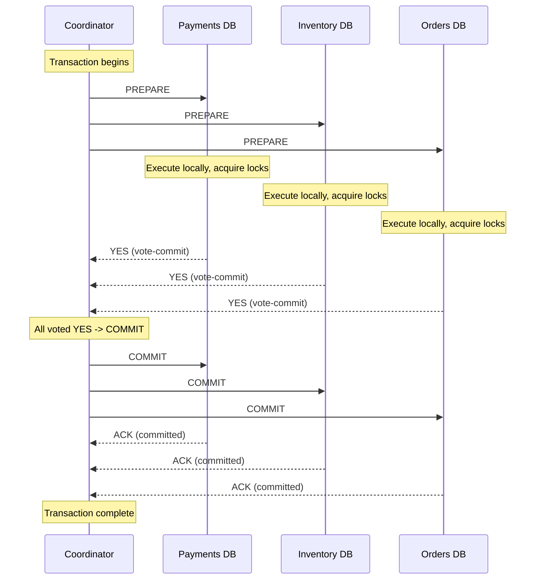
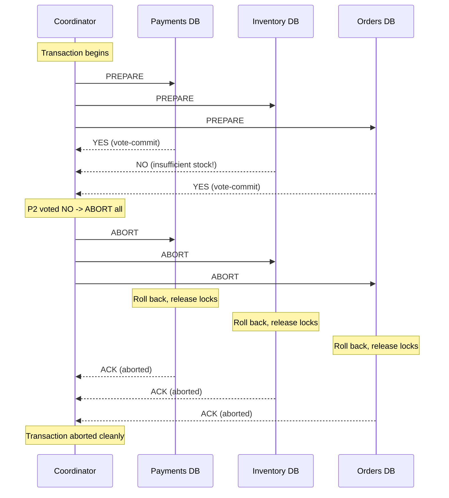
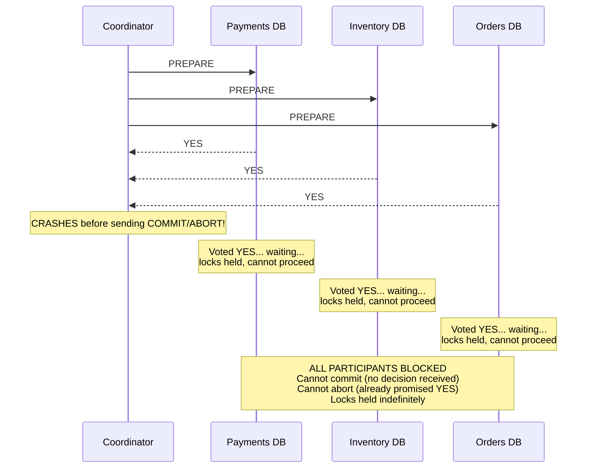

# Two-Phase Commit (2PC)

## The Problem: Distributed Agreement

You have an e-commerce order that must atomically:
1. Debit the customer's account in the **Payments** database
2. Decrement inventory in the **Inventory** database
3. Create the order record in the **Orders** database

If any one of these fails, ALL must roll back. On a single database this is trivial -- wrap it in a transaction. But across three separate databases on three separate machines, there is no shared transaction log. Each database can only commit or abort its own local transaction independently.

The fundamental question: **How do multiple independent databases agree to commit or abort together?**

```
                     The Problem
  +-----------+    +-----------+    +-----------+
  | Payments  |    | Inventory |    |  Orders   |
  |   DB      |    |    DB     |    |    DB     |
  +-----------+    +-----------+    +-----------+
       |                |                |
   Debit $50       Decrement by 1    Create order
       |                |                |
       v                v                v
   COMMIT?           COMMIT?          COMMIT?

   What if Payments commits but Inventory fails?
   --> Customer charged, but no item deducted.
   --> Inconsistent state. Money lost from customer's perspective.
```

This is the **atomic commitment problem**, and Two-Phase Commit (2PC) is the classical solution.

---

## The 2PC Protocol

2PC introduces a **coordinator** (also called the transaction manager) that orchestrates all **participants** (the databases/services involved).

### Phase 1: Prepare (Voting Phase)

1. Coordinator sends `PREPARE` to every participant.
2. Each participant:
   - Executes the transaction locally (acquires locks, writes to WAL)
   - If it CAN commit: responds `YES` (vote-commit)
   - If it CANNOT commit: responds `NO` (vote-abort)
3. Crucially: after voting YES, the participant has **promised** it can commit. It must persist this promise to its local log so it survives a crash.

### Phase 2: Commit or Abort (Decision Phase)

- **If ALL participants voted YES**: Coordinator sends `COMMIT` to all. Each participant makes the transaction permanent and releases locks.
- **If ANY participant voted NO** (or timed out): Coordinator sends `ABORT` to all. Each participant rolls back and releases locks.

### The Golden Rule

> Once a participant votes YES, it cannot unilaterally abort. It must wait for the coordinator's decision. This is the source of 2PC's blocking problem.

---

## Happy Path: All Participants Commit



---

## Failure Path: One Participant Aborts



---

## Failure Path: Coordinator Crash (The Blocking Problem)

This is 2PC's Achilles' heel.



After voting YES, no participant can safely abort on its own -- what if the coordinator actually decided COMMIT and the message just has not arrived yet? The participants are **stuck** until the coordinator recovers.

---

## Problems with 2PC

### 1. Blocking Protocol

If the coordinator crashes between Phase 1 and Phase 2, participants hold their locks and wait indefinitely. No progress is possible until the coordinator recovers. In a high-throughput system, this means:
- Database rows are locked
- Other transactions queue up behind those locks
- Throughput drops to zero for affected rows
- Cascading timeouts across the system

### 2. Single Point of Failure (Coordinator)

The coordinator is a SPOF. If it crashes:
- Active transactions cannot complete
- Participants remain blocked
- Recovery requires the coordinator's transaction log to be intact

You can replicate the coordinator for availability, but that adds complexity (now you need consensus for the coordinator itself).

### 3. Performance: Locks Held Across Network Round-Trips

The lock duration spans at minimum **two network round-trips**:
1. Coordinator -> Participants: PREPARE
2. Participants -> Coordinator: votes
3. Coordinator -> Participants: COMMIT/ABORT
4. Participants -> Coordinator: ACK

At 1-2ms per hop within a data center, that is 4-8ms of lock time minimum. Across regions, it can be hundreds of milliseconds. Compare to local transactions where locks are held for microseconds.

```
Lock duration comparison:

Local transaction:    |--lock--|  (~microseconds)
2PC same datacenter:  |------lock------|  (~4-8 ms)
2PC cross-region:     |------------------lock------------------|  (~100-300 ms)
```

### 4. Network Partitions

If the network partitions between coordinator and participants:
- Participants that voted YES are stuck (cannot reach coordinator)
- Coordinator cannot tell if participants crashed or are just unreachable
- Timeouts do not help because timing out a YES-voted participant risks inconsistency

### 5. Scalability

2PC does not scale with the number of participants. Every additional participant:
- Adds another network round-trip
- Increases the probability that at least one participant fails or is slow
- Extends lock duration for all participants (everyone waits for the slowest)

| Participants | P(all healthy) at 99.9% each | Expected Latency |
|---|---|---|
| 2 | 99.8% | 2ms + network |
| 5 | 99.5% | 5ms + network |
| 10 | 99.0% | 10ms + network |
| 20 | 98.0% | 20ms + network |

---

## Three-Phase Commit (3PC)

3PC was designed to address the blocking problem by adding an intermediate phase.

### The Three Phases

1. **CanCommit?** -- Coordinator asks participants if they can commit (like 2PC Phase 1 but without acquiring locks)
2. **PreCommit** -- If all say yes, coordinator sends PreCommit. Participants acquire locks and acknowledge. This is the new intermediate step.
3. **DoCommit** -- Coordinator sends the final commit command.

### Why 3PC Reduces Blocking

The key insight: in 3PC, if a participant times out waiting for DoCommit after receiving PreCommit, it can **safely commit on its own** because:
- It knows ALL participants received PreCommit (otherwise coordinator would have aborted)
- Therefore all participants are in a state where they CAN commit

### Why 3PC Is Rarely Used

3PC solves the blocking problem ONLY under the assumption of **no network partitions**. In a real network:
- A partition can cause some participants to receive PreCommit while others do not
- The ones that did not receive it may time out and abort
- The ones that did receive it may time out and commit
- Result: inconsistency -- worse than blocking

> 3PC trades the possibility of blocking for the possibility of inconsistency. In practice, inconsistency is usually considered worse than temporary blocking.

| Property | 2PC | 3PC |
|---|---|---|
| Blocking on coordinator failure | Yes | No (in theory) |
| Network partition safe | No | No |
| Message complexity | 2n | 3n |
| Used in practice | Yes (widely) | Rarely |
| Solves the real problem | Partially | Not really |

---

## When 2PC Is Appropriate

### Good Use Cases

**Single database engine with distributed transactions:**
- PostgreSQL coordinating across multiple nodes in a single cluster
- MySQL with InnoDB using internal XA transactions
- The coordinator and participants share the same trust domain and failure mode

**XA Transactions (Java/JTA):**
- Application server coordinates between a database and a JMS message queue
- Both resources are within the same data center
- Transaction volume is moderate (not millions per second)

```java
// XA Transaction with JTA (Java Transaction API)
UserTransaction tx = (UserTransaction) ctx.lookup("java:comp/UserTransaction");
try {
    tx.begin();
    
    // Operation 1: Update database
    Connection dbConn = xaDataSource.getConnection();
    dbConn.prepareStatement("UPDATE accounts SET balance = balance - 50 WHERE id = 123")
          .executeUpdate();
    
    // Operation 2: Send message to queue
    Session jmsSession = xaConnection.createSession(true, Session.SESSION_TRANSACTED);
    jmsSession.createProducer(queue).send(
        jmsSession.createTextMessage("Order placed")
    );
    
    tx.commit();  // 2PC happens here across DB + JMS
} catch (Exception e) {
    tx.rollback();
}
```

**Distributed databases that use 2PC internally:**
- Google Spanner uses 2PC internally but adds Paxos for coordinator fault tolerance
- CockroachDB uses a variant of 2PC with Raft-replicated transaction records
- These systems make 2PC work by combining it with consensus protocols

### When 2PC Is NOT Appropriate

**Microservices spanning multiple independent databases:**
- Each service owns its database -- no shared transaction manager
- Services may be written in different languages
- Network between services is unreliable (especially cross-region)
- Lock duration across services would destroy throughput
- Services need independent deployability -- 2PC couples them

**Long-running business processes:**
- An order that involves payment, inventory, shipping, notification
- The process takes seconds to minutes, not milliseconds
- Holding locks for that duration is unacceptable

**Cross-organization transactions:**
- No shared trust domain
- Cannot require external partners to participate in your 2PC protocol

For all of these cases, **use the Saga pattern instead** (see saga-pattern.md).

---

## 2PC in Real Systems

### Google Spanner

Spanner uses 2PC for cross-shard transactions but makes the coordinator fault-tolerant using Paxos replication. The coordinator's decision is replicated to a Paxos group, so if the coordinator leader crashes, a new leader can pick up the decision. This eliminates the SPOF problem but at the cost of additional latency (Paxos round-trip).

### PostgreSQL Prepared Transactions

PostgreSQL supports 2PC via `PREPARE TRANSACTION` and `COMMIT PREPARED`:

```sql
-- Phase 1: Prepare
PREPARE TRANSACTION 'order-123-payment';

-- Later, after coordinator decides:
-- Phase 2a: Commit
COMMIT PREPARED 'order-123-payment';

-- Or Phase 2b: Abort
ROLLBACK PREPARED 'order-123-payment';
```

Prepared transactions survive PostgreSQL restarts -- the WAL entry ensures the promise persists.

### CockroachDB

CockroachDB writes a **transaction record** to a Raft-replicated range. This serves as the coordinator state. If the coordinating node crashes, any other node can read the transaction record and drive the protocol to completion. This is similar to Spanner's approach but uses Raft instead of Paxos.

---

## Interview Cheat Sheet

```
Q: "How do you ensure atomicity across multiple databases?"

Answer Framework:
1. State the problem clearly (atomic commitment)
2. Explain 2PC briefly (prepare/commit, coordinator/participants)
3. Immediately discuss its problems (blocking, SPOF, lock duration)
4. Pivot to alternatives:
   - Same DB engine? 2PC with replicated coordinator (Spanner model)
   - Microservices? Saga pattern
   - DB + event? Transactional outbox pattern
5. Mention that modern distributed DBs (Spanner, CockroachDB) solve this
   internally by combining 2PC with consensus protocols

Key Phrases:
- "2PC is a blocking protocol"
- "The coordinator is a single point of failure"
- "Locks are held across network round-trips"
- "Sagas trade atomicity for availability"
- "Spanner combines 2PC with Paxos for fault-tolerant coordination"
```

---

## Summary

| Aspect | Details |
|---|---|
| What 2PC solves | Atomic commit across multiple participants |
| How it works | Prepare (vote) -> Commit/Abort (decision) |
| Key weakness | Blocking if coordinator fails after prepare |
| Lock duration | Spans multiple network round-trips |
| 3PC improvement | Adds pre-commit phase, reduces blocking |
| 3PC limitation | Not partition-tolerant, rarely used |
| Modern approach | 2PC + consensus (Spanner, CockroachDB) |
| Microservices alternative | Saga pattern (eventual consistency) |
