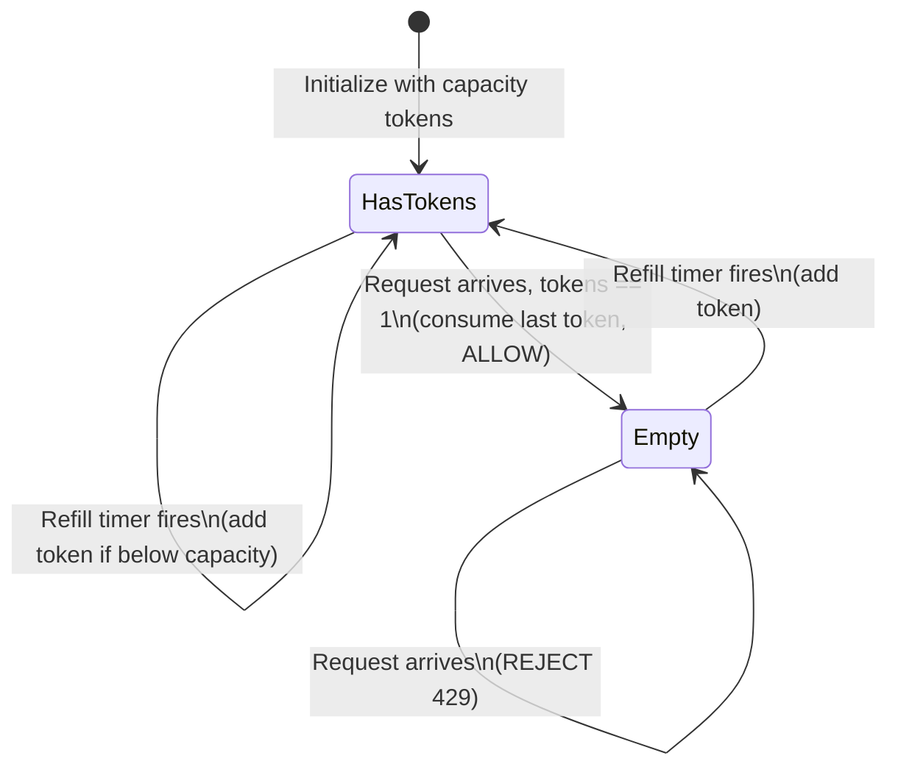
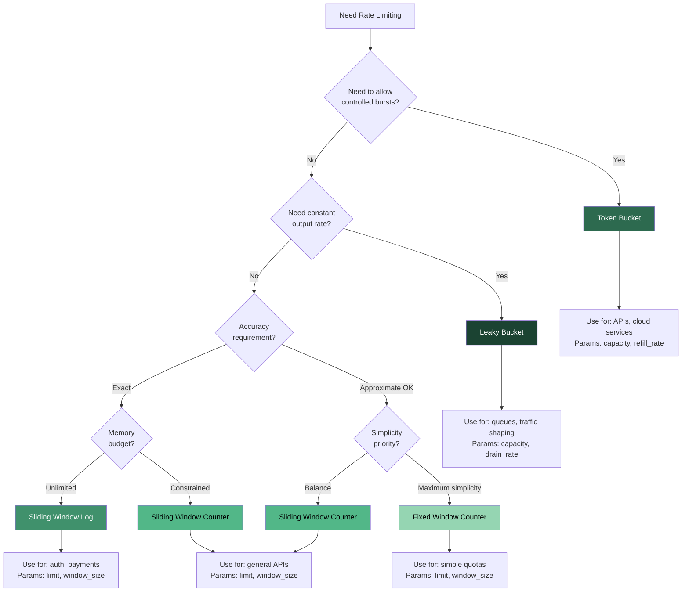

# Rate Limiting Algorithms -- Deep Dive

## Overview

Rate limiting controls the rate of requests a client can make to a server. The choice of
algorithm determines accuracy, memory usage, burst tolerance, and implementation complexity.

```
Request Flow with Rate Limiting:

  Client ----> [ Rate Limiter ] ----> Backend Service
                   |
                   |  ALLOWED? Check algorithm state
                   |
                   +---> YES: Forward request
                   +---> NO:  Return 429 Too Many Requests
```

---

## 1. Token Bucket Algorithm

### How It Works

A bucket holds tokens up to a maximum capacity. Tokens are added at a fixed **refill rate**.
Each incoming request must consume one (or more) tokens. If the bucket is empty, the request
is rejected. Because the bucket can accumulate tokens up to its capacity, it naturally
**allows bursts** up to that capacity.

```
TOKEN BUCKET VISUALIZATION
==========================

    Capacity = 5 tokens          Refill: 1 token / second
    +-----------+
    |  [TOKEN]  |   <-- bucket can hold up to 5
    |  [TOKEN]  |
    |  [TOKEN]  |   3 tokens available
    |           |
    |           |
    +-----------+

  Request arrives:
    - Tokens >= 1?  YES --> consume 1 token, ALLOW request
    - Tokens == 0?  NO  --> REJECT request (429)

  Time passes (1 second):
    - Add 1 token (if below capacity)

EXAMPLE OVER TIME (capacity=4, refill_rate=1/sec):

  t=0   [T][T][T][T]   4 tokens (full)
  t=0   req1 -> ALLOW   [T][T][T][ ]   3 tokens
  t=0   req2 -> ALLOW   [T][T][ ][ ]   2 tokens
  t=0   req3 -> ALLOW   [T][ ][ ][ ]   1 token
  t=0   req4 -> ALLOW   [ ][ ][ ][ ]   0 tokens  (burst of 4!)
  t=0   req5 -> REJECT  [ ][ ][ ][ ]   0 tokens
  t=1   +1 token        [T][ ][ ][ ]   1 token   (refill)
  t=1   req6 -> ALLOW   [ ][ ][ ][ ]   0 tokens
  t=2   +1 token        [T][ ][ ][ ]   1 token
  t=3   +1 token        [T][T][ ][ ]   2 tokens
  t=4   +1 token        [T][T][T][ ]   3 tokens
```

### State Diagram



### Python Implementation

```python
import time
import threading


class TokenBucket:
    """
    Token Bucket rate limiter.

    Parameters:
        capacity    -- max tokens the bucket can hold (burst size)
        refill_rate -- tokens added per second
    """

    def __init__(self, capacity: int, refill_rate: float):
        self.capacity = capacity
        self.refill_rate = refill_rate          # tokens per second
        self.tokens = capacity                  # start full
        self.last_refill_time = time.monotonic()
        self.lock = threading.Lock()

    def _refill(self):
        """Add tokens based on elapsed time since last refill."""
        now = time.monotonic()
        elapsed = now - self.last_refill_time
        new_tokens = elapsed * self.refill_rate
        self.tokens = min(self.capacity, self.tokens + new_tokens)
        self.last_refill_time = now

    def allow_request(self, tokens_needed: int = 1) -> bool:
        """Return True if the request is allowed, False otherwise."""
        with self.lock:
            self._refill()
            if self.tokens >= tokens_needed:
                self.tokens -= tokens_needed
                return True
            return False


# Usage
limiter = TokenBucket(capacity=10, refill_rate=2)  # 10 burst, 2/sec steady

for i in range(15):
    result = "ALLOWED" if limiter.allow_request() else "REJECTED"
    print(f"Request {i+1}: {result}")
```

### Pros, Cons, When to Use

| Aspect | Detail |
|--------|--------|
| **Pros** | Simple to implement; allows controlled bursts; memory-efficient (2 numbers per key) |
| **Cons** | Choosing capacity and refill_rate requires tuning; burst can spike backend load |
| **Memory** | O(1) per key -- store `tokens` (float) + `last_refill_time` (float) = ~16 bytes |
| **When to use** | APIs that want to allow short bursts (e.g., page load fires 10 requests at once) |
| **Real-world** | AWS API Gateway, Stripe API, most cloud provider rate limiters |

---

## 2. Leaky Bucket Algorithm

### How It Works

Requests enter a FIFO queue (the "bucket"). The queue is drained (processed) at a **fixed rate**.
If the queue is full when a new request arrives, it is rejected. This **smooths out bursts**
-- even if many requests arrive at once, they are processed evenly.

```
LEAKY BUCKET VISUALIZATION
===========================

  Incoming requests pour in from the top:

       req req req req      <-- burst of requests
         \  |  |  /
    +------------------+
    |  [req5] overflow |----> REJECT (bucket full)
    +------------------+
    |  [req4]          |
    |  [req3]          |    Bucket (queue) capacity = 4
    |  [req2]          |
    |  [req1]          |
    +--------|---------+
             |
             v              Drains at fixed rate: 1 req/sec
         [ Process ]

TIMELINE (capacity=3, drain_rate=1/sec):

  t=0   req1 arrives -> queue: [req1]            ALLOW (queued)
  t=0   req2 arrives -> queue: [req1, req2]      ALLOW (queued)
  t=0   req3 arrives -> queue: [req1, req2, req3] ALLOW (queued)
  t=0   req4 arrives -> queue full               REJECT
  t=1   drain req1   -> queue: [req2, req3]      (processed)
  t=1   req5 arrives -> queue: [req2, req3, req5] ALLOW
  t=2   drain req2   -> queue: [req3, req5]      (processed)
```

### Queue-Based Implementation (Python)

```python
import time
import threading
from collections import deque


class LeakyBucket:
    """
    Leaky Bucket rate limiter.

    Requests are queued and processed at a fixed drain rate.
    If the queue is full, new requests are rejected.

    Parameters:
        capacity   -- max requests the queue can hold
        drain_rate -- requests processed per second
    """

    def __init__(self, capacity: int, drain_rate: float):
        self.capacity = capacity
        self.drain_rate = drain_rate
        self.queue = deque()
        self.lock = threading.Lock()
        self.last_drain_time = time.monotonic()

    def _drain(self):
        """Remove processed requests based on elapsed time."""
        now = time.monotonic()
        elapsed = now - self.last_drain_time
        items_to_drain = int(elapsed * self.drain_rate)
        if items_to_drain > 0:
            actual_drained = min(items_to_drain, len(self.queue))
            for _ in range(actual_drained):
                self.queue.popleft()
            self.last_drain_time = now

    def allow_request(self) -> bool:
        """Attempt to add request to the queue."""
        with self.lock:
            self._drain()
            if len(self.queue) < self.capacity:
                self.queue.append(time.monotonic())
                return True
            return False


# Counter-based variant (simpler, no actual queue)
class LeakyBucketCounter:
    """
    Counter-based leaky bucket -- does not actually queue requests,
    just decides allow/reject. Equivalent logic, lower memory.
    """

    def __init__(self, capacity: int, drain_rate: float):
        self.capacity = capacity
        self.drain_rate = drain_rate
        self.water = 0.0  # current "water level"
        self.last_check = time.monotonic()
        self.lock = threading.Lock()

    def allow_request(self) -> bool:
        with self.lock:
            now = time.monotonic()
            elapsed = now - self.last_check
            self.last_check = now

            # Drain water
            self.water = max(0.0, self.water - elapsed * self.drain_rate)

            # Try to add
            if self.water + 1 <= self.capacity:
                self.water += 1
                return True
            return False
```

### Pros, Cons, When to Use

| Aspect | Detail |
|--------|--------|
| **Pros** | Smooths bursts to constant output rate; predictable backend load |
| **Cons** | Bursts fill queue and later requests wait or get rejected; not ideal when bursts are desirable |
| **Memory** | O(bucket_size) if queue-based; O(1) if counter-based |
| **When to use** | When you need a steady, predictable processing rate (e.g., message queue ingestion) |
| **Real-world** | Nginx (`limit_req` uses leaky bucket), network traffic shaping (ATM, routers) |

### Token Bucket vs Leaky Bucket

```
TOKEN BUCKET (allows bursts):

  Input:  |||||||.........|||||||
  Output: |||||||.........|||||||   <-- bursts pass through
                                       (up to capacity)

LEAKY BUCKET (smooths bursts):

  Input:  |||||||.........|||||||
  Output: |.|.|.|.|.|.|.|.|.|.|.   <-- constant output rate
```

---

## 3. Fixed Window Counter

### How It Works

Time is divided into fixed windows (e.g., each minute: 00:00-00:59, 01:00-01:59, ...).
A counter tracks requests in the current window. If the counter exceeds the limit, the
request is rejected. The counter resets at the start of each new window.

```
FIXED WINDOW COUNTER
=====================

  Limit: 5 requests per minute

  Window 1 (00:00 - 00:59)       Window 2 (01:00 - 01:59)
  +---------------------------+   +---------------------------+
  |  req req req req req      |   |  req req                  |
  |  count = 5  (at limit)    |   |  count = 2                |
  +---------------------------+   +---------------------------+
                                         ^
                                         | counter resets to 0


THE BOUNDARY BURST PROBLEM:
============================

  Limit: 5 requests per minute

  Window 1 (00:00 - 00:59)       Window 2 (01:00 - 01:59)
  +---------------------------+   +---------------------------+
  |                 |||||     |   |  |||||                    |
  |           5 reqs at 00:55 |   |  5 reqs at 01:00         |
  +---------------------------+   +---------------------------+
                    |<-- 10 sec ->|
                    
  10 requests in 10 seconds!  That is 2x the intended limit.
  Each window sees only 5 (within limit), but the burst at the
  boundary effectively doubles the rate.
```

### Python Implementation

```python
import time
import threading


class FixedWindowCounter:
    """
    Fixed Window Counter rate limiter.

    Parameters:
        limit       -- max requests per window
        window_size -- window duration in seconds
    """

    def __init__(self, limit: int, window_size: int):
        self.limit = limit
        self.window_size = window_size
        self.counters: dict[str, dict] = {}  # key -> {window_start, count}
        self.lock = threading.Lock()

    def _get_window_start(self) -> int:
        """Return the start timestamp of the current window."""
        now = time.time()
        return int(now // self.window_size) * self.window_size

    def allow_request(self, key: str) -> bool:
        with self.lock:
            window_start = self._get_window_start()

            if key not in self.counters:
                self.counters[key] = {"window_start": window_start, "count": 0}

            entry = self.counters[key]

            # New window -- reset counter
            if entry["window_start"] != window_start:
                entry["window_start"] = window_start
                entry["count"] = 0

            if entry["count"] < self.limit:
                entry["count"] += 1
                return True
            return False


# Redis implementation (single-server)
def fixed_window_redis(redis_client, key, limit, window_size):
    """
    Redis fixed window using INCR + EXPIRE.
    Simple but has a race condition between INCR and EXPIRE.
    Use a Lua script or MULTI/EXEC in production.
    """
    window_key = f"rate:{key}:{int(time.time() // window_size)}"
    current = redis_client.incr(window_key)
    if current == 1:
        redis_client.expire(window_key, window_size)
    return current <= limit
```

### Pros, Cons, When to Use

| Aspect | Detail |
|--------|--------|
| **Pros** | Very simple; low memory (1 counter + 1 timestamp per key) |
| **Cons** | Boundary burst problem -- up to 2x limit at window edges |
| **Memory** | O(1) per key -- ~12 bytes (counter + window_start) |
| **When to use** | When simplicity matters and approximate limiting is acceptable |
| **Real-world** | Simple API quotas, basic DDoS protection |

---

## 4. Sliding Window Log

### How It Works

Every request's timestamp is stored in a sorted set. When a new request arrives:
1. Remove all timestamps older than `now - window_size`
2. Count remaining entries
3. If count < limit, add the new timestamp and allow; otherwise reject

This is the **most accurate** algorithm but has the **highest memory cost** because it
stores every individual request timestamp.

```
SLIDING WINDOW LOG
==================

  Limit: 5 requests per 60 seconds
  Current time: t=75

  Sorted set of timestamps:
  [12, 25, 38, 55, 62, 70]

  Step 1: Remove entries older than 75 - 60 = 15
          Remove: [12]
          Remaining: [25, 38, 55, 62, 70]  --> count = 5

  Step 2: count (5) >= limit (5)?  YES --> REJECT

  ---

  If current time: t=90
  Step 1: Remove entries older than 90 - 60 = 30
          Remove: [25]
          Remaining: [38, 55, 62, 70]  --> count = 4

  Step 2: count (4) < limit (5)?   YES --> ALLOW, add 90
          Set: [38, 55, 62, 70, 90]
```

### Python + Redis ZSET Implementation

```python
import time
import threading


class SlidingWindowLog:
    """
    Sliding Window Log rate limiter.

    Stores every request timestamp. Most accurate, highest memory.

    Parameters:
        limit       -- max requests per window
        window_size -- window duration in seconds
    """

    def __init__(self, limit: int, window_size: int):
        self.limit = limit
        self.window_size = window_size
        self.logs: dict[str, list[float]] = {}  # key -> sorted timestamps
        self.lock = threading.Lock()

    def allow_request(self, key: str) -> bool:
        with self.lock:
            now = time.time()
            cutoff = now - self.window_size

            if key not in self.logs:
                self.logs[key] = []

            # Remove expired timestamps
            log = self.logs[key]
            while log and log[0] <= cutoff:
                log.pop(0)

            if len(log) < self.limit:
                log.append(now)
                return True
            return False
```

```python
# Redis ZSET Implementation (production-grade)
# Using sorted sets: score = timestamp, member = unique request ID

SLIDING_WINDOW_LUA = """
local key = KEYS[1]
local limit = tonumber(ARGV[1])
local window = tonumber(ARGV[2])
local now = tonumber(ARGV[3])
local request_id = ARGV[4]

-- Remove expired entries
redis.call('ZREMRANGEBYSCORE', key, '-inf', now - window)

-- Count remaining
local count = redis.call('ZCARD', key)

if count < limit then
    -- Add new entry with timestamp as score
    redis.call('ZADD', key, now, request_id)
    -- Set TTL to auto-cleanup
    redis.call('EXPIRE', key, window)
    return 1  -- allowed
else
    return 0  -- rejected
end
"""

# Usage with redis-py:
# allowed = redis_client.evalsha(
#     script_sha, 1,
#     f"rate_limit:{user_id}",   # key
#     100,                        # limit
#     60,                         # window (seconds)
#     time.time(),                # now
#     str(uuid.uuid4())           # unique request id
# ) == 1
```

### Pros, Cons, When to Use

| Aspect | Detail |
|--------|--------|
| **Pros** | Most accurate -- no boundary issues; exact count within any rolling window |
| **Cons** | High memory: stores every timestamp (100 req/min = 100 entries per key) |
| **Memory** | O(limit) per key -- each timestamp ~8 bytes, so 1000 req limit = ~8 KB per key |
| **When to use** | When accuracy is critical and request volume is manageable |
| **Real-world** | Rate limiting for expensive operations (login attempts, payment APIs) |

---

## 5. Sliding Window Counter

### How It Works

This is a **hybrid** of Fixed Window Counter and Sliding Window Log. It uses two
adjacent fixed windows and computes a weighted count based on how far the current
time has progressed into the current window.

```
SLIDING WINDOW COUNTER
=======================

  Formula:
  +-------------------------------------------------------------+
  |                                                              |
  |  weighted_count = prev_window_count * overlap_pct            |
  |                 + curr_window_count                          |
  |                                                              |
  |  overlap_pct = 1 - (elapsed_in_current_window               |
  |                      / window_size)                          |
  |                                                              |
  +-------------------------------------------------------------+

EXAMPLE:
  Window size: 60 seconds
  Limit: 10 requests per window
  Previous window (00:00-00:59): 8 requests
  Current window  (01:00-01:59): 3 requests
  Current time: 01:20

  elapsed = 20 seconds into current window
  overlap_pct = 1 - (20 / 60) = 0.6667  (66.67% of prev window overlaps)

  weighted_count = 8 * 0.6667 + 3 = 5.33 + 3 = 8.33

  8.33 < 10  -->  ALLOW


  Visualization of the "sliding" effect:

  prev window                  curr window
  +---------------------------+---------------------------+
  |        8 requests         |   3 requests   |          |
  +---------------------------+-----|----------+-----------+
                              |<--->|<-------->|
                              overlap  elapsed
                              (66.7%)  (20 sec)
                                    ^
                                    | current time (01:20)

  The "virtual" sliding window:
         |<------------ 60 seconds ----------->|
         |  prev portion (66.7%)  | curr (100%)|
         |   ~5.33 requests       | 3 requests |
         |<--------  total: ~8.33  ----------->|
```

### Python Implementation

```python
import time
import threading


class SlidingWindowCounter:
    """
    Sliding Window Counter rate limiter.

    Combines fixed window efficiency with sliding window accuracy.
    Best balance of memory and precision.

    Parameters:
        limit       -- max requests per window
        window_size -- window duration in seconds
    """

    def __init__(self, limit: int, window_size: int):
        self.limit = limit
        self.window_size = window_size
        self.windows: dict[str, dict] = {}
        self.lock = threading.Lock()

    def allow_request(self, key: str) -> bool:
        with self.lock:
            now = time.time()
            current_window = int(now // self.window_size) * self.window_size
            prev_window = current_window - self.window_size

            if key not in self.windows:
                self.windows[key] = {}

            state = self.windows[key]

            # Get counts for previous and current windows
            prev_count = state.get(prev_window, 0)
            curr_count = state.get(current_window, 0)

            # Calculate overlap percentage of previous window
            elapsed = now - current_window
            overlap_pct = 1.0 - (elapsed / self.window_size)

            # Weighted count
            weighted = prev_count * overlap_pct + curr_count

            if weighted < self.limit:
                state[current_window] = curr_count + 1
                # Clean up old windows
                keys_to_remove = [
                    w for w in state if w < prev_window
                ]
                for k in keys_to_remove:
                    del state[k]
                return True
            return False
```

```python
# Redis implementation with Lua script
SLIDING_WINDOW_COUNTER_LUA = """
local key_prefix = KEYS[1]
local limit = tonumber(ARGV[1])
local window_size = tonumber(ARGV[2])
local now = tonumber(ARGV[3])

local current_window = math.floor(now / window_size) * window_size
local prev_window = current_window - window_size

local curr_key = key_prefix .. ":" .. current_window
local prev_key = key_prefix .. ":" .. prev_window

local prev_count = tonumber(redis.call('GET', prev_key) or "0")
local curr_count = tonumber(redis.call('GET', curr_key) or "0")

local elapsed = now - current_window
local overlap = 1.0 - (elapsed / window_size)
local weighted = prev_count * overlap + curr_count

if weighted < limit then
    redis.call('INCR', curr_key)
    redis.call('EXPIRE', curr_key, window_size * 2)
    return 1
else
    return 0
end
"""
```

### Pros, Cons, When to Use

| Aspect | Detail |
|--------|--------|
| **Pros** | Good accuracy (avoids boundary burst); low memory like fixed window |
| **Cons** | Approximate (statistical, not exact); slightly more complex than fixed window |
| **Memory** | O(1) per key -- 2 counters + 2 timestamps = ~32 bytes |
| **When to use** | Default choice for most rate limiting needs |
| **Real-world** | Cloudflare rate limiting, many production API gateways |

---

## Giant Comparison Table

| Criterion | Token Bucket | Leaky Bucket | Fixed Window | Sliding Window Log | Sliding Window Counter |
|---|---|---|---|---|---|
| **Accuracy** | Good (exact burst control) | Good (exact drain rate) | Poor (boundary burst) | Excellent (perfect) | Very Good (~99.7% accurate) |
| **Memory per key** | ~16 B (2 floats) | ~16 B counter / O(n) queue | ~12 B (counter+ts) | O(limit) -- 8 B per entry | ~32 B (2 counters + 2 ts) |
| **Burst handling** | Allows bursts up to capacity | Smooths all bursts | Allows 2x burst at boundary | No boundary bursts | Minimal boundary effect |
| **Output rate** | Variable (bursty) | Constant (smooth) | Variable | Variable | Variable |
| **Implementation** | Simple | Simple | Very Simple | Moderate | Moderate |
| **Best for** | Most APIs, general use | Queue processing, traffic shaping | Simple quotas | Security-critical limits | Production API gateways |
| **Used by** | AWS, Stripe, GCP | Nginx, network routers | Basic counters | Login/auth rate limiting | Cloudflare, Kong |
| **Distributed** | Easy (2 values in Redis) | Medium (queue state) | Easy (INCR + EXPIRE) | Medium (sorted set) | Easy (2 keys in Redis) |

---

## Memory Usage at Scale

```
Scenario: 1 million unique users, limit = 100 req/min

Token Bucket:         1M * 16 B  =  ~16 MB
Leaky Bucket (ctr):   1M * 16 B  =  ~16 MB
Fixed Window:         1M * 12 B  =  ~12 MB
Sliding Window Log:   1M * 100 * 8 B  =  ~800 MB   <-- major difference!
Sliding Window Ctr:   1M * 32 B  =  ~32 MB
```

---

## Decision Guide



---

## Quick Reference: Which Algorithm for Which Scenario?

| Scenario | Recommended | Why |
|----------|-------------|-----|
| General-purpose API rate limiting | **Token Bucket** or **Sliding Window Counter** | Good balance of burst tolerance and accuracy |
| Login attempt limiting | **Sliding Window Log** | Must be exact -- cannot allow boundary exploits |
| Traffic shaping / queue ingestion | **Leaky Bucket** | Need constant, predictable output rate |
| Simple daily/monthly quota | **Fixed Window Counter** | Window boundary issues irrelevant at large window sizes |
| High-traffic CDN / API gateway | **Sliding Window Counter** | Low memory, good accuracy, easy distributed implementation |
| DDoS mitigation (first layer) | **Token Bucket** | Fast O(1) check, allows legit burst traffic |
| Payment processing rate limit | **Sliding Window Log** | Accuracy critical for financial operations |

---

## Common Interview Questions

**Q: Can you combine algorithms?**
Yes. A common pattern is hierarchical rate limiting:
- Token Bucket for per-second burst control (capacity=10, refill=5/sec)
- Sliding Window Counter for per-minute sustained limit (100/min)
- Fixed Window Counter for daily quota (10,000/day)

**Q: How does Token Bucket handle variable-cost requests?**
Consume multiple tokens per request based on cost. A simple GET consumes 1 token;
an expensive analytics query consumes 10 tokens. The `allow_request(tokens_needed=10)`
parameter in the implementation above supports this.

**Q: Why not just use Sliding Window Log everywhere?**
Memory. At 1M users with 1000 req/min limit, the log stores 1 billion timestamps.
At 8 bytes each, that is ~8 GB -- versus ~16 MB for Token Bucket. For most use cases,
the ~0.3% inaccuracy of Sliding Window Counter is acceptable.

**Q: What happens during a Redis failover with distributed rate limiting?**
Options: (1) fail-open -- allow all requests (risk overload), (2) fail-closed -- reject
all requests (risk availability), (3) fall back to local in-memory rate limiting per
server (approximate but functional). Most production systems choose fail-open with
alerting, because availability trumps exact rate enforcement.
