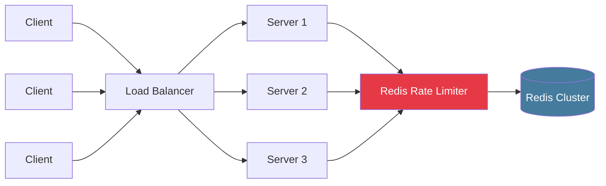
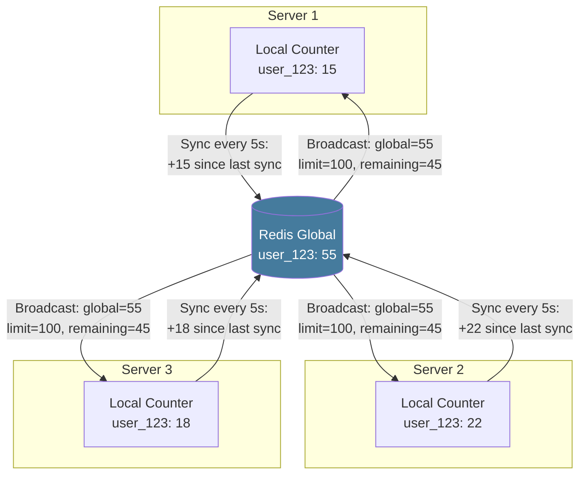
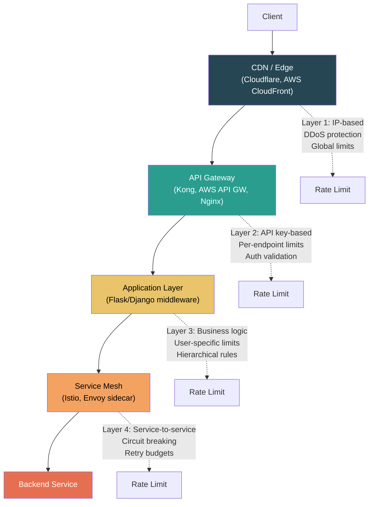
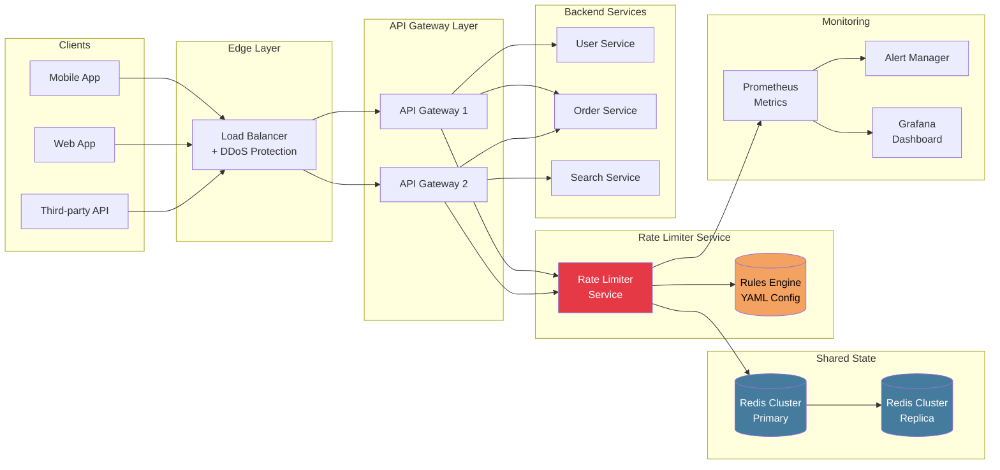

# Distributed Rate Limiting

## The Core Challenge

In a distributed system with N servers behind a load balancer, each server independently
enforcing a rate limit of R requests/minute effectively allows N * R requests/minute
globally. A user routed to different servers via round-robin can exceed the intended limit.

```
THE PROBLEM:

  Limit: 100 req/min per user

  Server A (local counter): user_123 = 80 requests   ALLOW
  Server B (local counter): user_123 = 75 requests   ALLOW
  Server C (local counter): user_123 = 90 requests   ALLOW
  ---------------------------------------------------
  Total for user_123:       245 requests/min          2.45x over limit!
```

---

## Approach 1: Centralized Rate Limiter (Redis)

The most common production approach. All servers check rate limits against a single
shared data store -- typically Redis.



### Redis: Fixed Window with INCR + EXPIRE

```python
import time
import redis


def fixed_window_check(r: redis.Redis, key: str, limit: int, window: int) -> bool:
    """
    Basic fixed window counter in Redis.
    
    PROBLEM: Race condition between INCR and EXPIRE.
    If the process crashes after INCR but before EXPIRE,
    the key lives forever and the user is permanently blocked.
    """
    window_key = f"rl:{key}:{int(time.time() // window)}"
    count = r.incr(window_key)
    if count == 1:
        r.expire(window_key, window)
    return count <= limit
```

The above has a race condition. Fix with a **Lua script** for atomicity:

```python
# Atomic fixed window -- Lua script runs as a single Redis operation
FIXED_WINDOW_ATOMIC_LUA = """
local key = KEYS[1]
local limit = tonumber(ARGV[1])
local window = tonumber(ARGV[2])

local current = redis.call('INCR', key)
if current == 1 then
    redis.call('EXPIRE', key, window)
end

if current <= limit then
    return 1
else
    return 0
end
"""

class RedisFixedWindow:
    def __init__(self, redis_client: redis.Redis, limit: int, window: int):
        self.r = redis_client
        self.limit = limit
        self.window = window
        self.script = self.r.register_script(FIXED_WINDOW_ATOMIC_LUA)

    def allow_request(self, key: str) -> bool:
        window_key = f"rl:{key}:{int(time.time() // self.window)}"
        result = self.script(keys=[window_key], args=[self.limit, self.window])
        return result == 1
```

### Redis: Token Bucket via Lua Script

```python
TOKEN_BUCKET_LUA = """
local key = KEYS[1]
local capacity = tonumber(ARGV[1])
local refill_rate = tonumber(ARGV[2])    -- tokens per second
local now = tonumber(ARGV[3])
local tokens_needed = tonumber(ARGV[4])

-- Get current state
local data = redis.call('HMGET', key, 'tokens', 'last_refill')
local tokens = tonumber(data[1])
local last_refill = tonumber(data[2])

-- Initialize if new key
if tokens == nil then
    tokens = capacity
    last_refill = now
end

-- Refill tokens based on elapsed time
local elapsed = math.max(0, now - last_refill)
tokens = math.min(capacity, tokens + elapsed * refill_rate)

-- Check if request can be allowed
local allowed = 0
if tokens >= tokens_needed then
    tokens = tokens - tokens_needed
    allowed = 1
end

-- Save state
redis.call('HMSET', key, 'tokens', tostring(tokens), 'last_refill', tostring(now))
redis.call('EXPIRE', key, math.ceil(capacity / refill_rate) * 2)

return allowed
"""

class RedisTokenBucket:
    def __init__(self, redis_client: redis.Redis, capacity: int, refill_rate: float):
        self.r = redis_client
        self.capacity = capacity
        self.refill_rate = refill_rate
        self.script = self.r.register_script(TOKEN_BUCKET_LUA)

    def allow_request(self, key: str, tokens_needed: int = 1) -> dict:
        now = time.time()
        result = self.script(
            keys=[f"rl:tb:{key}"],
            args=[self.capacity, self.refill_rate, now, tokens_needed]
        )
        return {"allowed": result == 1}
```

### Redis: Sliding Window Counter via Lua Script

```python
SLIDING_WINDOW_COUNTER_LUA = """
local key = KEYS[1]
local limit = tonumber(ARGV[1])
local window_size = tonumber(ARGV[2])
local now = tonumber(ARGV[3])

local current_window = math.floor(now / window_size) * window_size
local prev_window = current_window - window_size

local curr_key = key .. ":" .. current_window
local prev_key = key .. ":" .. prev_window

local prev_count = tonumber(redis.call('GET', prev_key) or "0")
local curr_count = tonumber(redis.call('GET', curr_key) or "0")

local elapsed = now - current_window
local weight = 1.0 - (elapsed / window_size)
local weighted_count = prev_count * weight + curr_count

if weighted_count < limit then
    redis.call('INCR', curr_key)
    redis.call('EXPIRE', curr_key, window_size * 2)
    return {1, math.floor(limit - weighted_count - 1)}  -- {allowed, remaining}
else
    local reset_at = current_window + window_size
    return {0, 0, reset_at}  -- {rejected, remaining=0, reset_time}
end
"""
```

### Why Lua Scripts?

```
WITHOUT Lua (race condition):

  Thread A                    Thread B
  --------                    --------
  GET count -> 99             GET count -> 99
  count < 100? YES            count < 100? YES
  INCR -> 100                 INCR -> 101     <-- OVER LIMIT!

WITH Lua (atomic):

  Redis executes Lua script as a single atomic operation.
  No other command can interleave between GET and INCR.
  
  Thread A: run_script -> count=99, INCR -> 100, return ALLOW
  Thread B: run_script -> count=100, return REJECT
```

### MULTI/EXEC Alternative

```python
# Redis transactions (optimistic locking) as an alternative to Lua
def fixed_window_with_transaction(r: redis.Redis, key: str, limit: int, window: int):
    """
    Use WATCH + MULTI/EXEC for atomic check-and-increment.
    Retry on conflict (optimistic concurrency).
    """
    window_key = f"rl:{key}:{int(time.time() // window)}"
    
    with r.pipeline() as pipe:
        while True:
            try:
                pipe.watch(window_key)
                count = pipe.get(window_key)
                count = int(count) if count else 0
                
                if count >= limit:
                    pipe.unwatch()
                    return False
                
                pipe.multi()
                pipe.incr(window_key)
                pipe.expire(window_key, window)
                pipe.execute()
                return True
            except redis.WatchError:
                # Another client modified the key -- retry
                continue
```

**Lua vs MULTI/EXEC**: Lua scripts are preferred because they execute server-side with
no round trips. MULTI/EXEC requires WATCH + retry logic and multiple round trips. Lua
is simpler and faster for rate limiting.

---

## Approach 2: Local + Global Sync

Each server maintains a **local counter** and periodically syncs with a **global counter**
in Redis. Less accurate but more performant -- fewer Redis calls.



```python
import time
import threading


class LocalGlobalRateLimiter:
    """
    Local counter with periodic global sync.
    
    Each server keeps a local count and periodically pushes
    increments to Redis and pulls the global count.
    
    Trade-off: fewer Redis calls, but can overshoot limit
    by up to (num_servers * sync_interval * request_rate).
    """

    def __init__(self, redis_client, key: str, limit: int, 
                 window: int, sync_interval: float = 5.0):
        self.r = redis_client
        self.key = key
        self.limit = limit
        self.window = window
        self.sync_interval = sync_interval

        self.local_count = 0
        self.global_count = 0
        self.local_since_sync = 0
        self.lock = threading.Lock()

        # Start sync thread
        self._start_sync()

    def _start_sync(self):
        def sync_loop():
            while True:
                time.sleep(self.sync_interval)
                self._sync_with_global()
        t = threading.Thread(target=sync_loop, daemon=True)
        t.start()

    def _sync_with_global(self):
        with self.lock:
            # Push local increments to global
            if self.local_since_sync > 0:
                self.r.incrby(f"rl:global:{self.key}", self.local_since_sync)
                self.local_since_sync = 0
            # Pull global count
            global_val = self.r.get(f"rl:global:{self.key}")
            self.global_count = int(global_val) if global_val else 0

    def allow_request(self) -> bool:
        with self.lock:
            estimated_total = self.global_count + self.local_since_sync
            if estimated_total < self.limit:
                self.local_since_sync += 1
                return True
            return False
```

**When to use**: Very high throughput systems where Redis round-trip latency is
unacceptable for every request (e.g., CDN edge nodes, 100K+ req/sec).

---

## Approach 3: Sticky Sessions

Route the same client to the same server. Each server only handles "its" clients,
so local rate limiting is sufficient.

```
Sticky Sessions via Load Balancer:

  Client A (IP: 1.2.3.4) -----> always Server 1
  Client B (IP: 5.6.7.8) -----> always Server 2
  Client C (IP: 9.10.11.12) --> always Server 3

  Implementation: hash(client_IP) % num_servers
  Or: cookie-based session affinity
```

**Pros**: Simple, no shared state needed.
**Cons**: Uneven distribution, server failure orphans clients, adding/removing
servers reshuffles all assignments, doesn't work with multiple client IPs.

---

## Rate Limiting Dimensions

### By IP Address

```python
# Simple but problematic
def get_rate_limit_key_by_ip(request):
    return f"rl:ip:{request.remote_addr}"
```

**Problems**:
- NAT: thousands of users behind one corporate IP share the same limit
- IPv6: one user can have millions of addresses
- VPNs/proxies: easy to rotate IPs to bypass limits
- Shared hosting: multiple services behind one IP

### By User ID / API Key

```python
# Best for authenticated APIs
def get_rate_limit_key_by_user(request):
    api_key = request.headers.get("X-API-Key")
    return f"rl:apikey:{api_key}"
```

**Best approach for authenticated APIs**. Each user/key gets a clean, independent limit.
Used by Stripe, GitHub, Twitter/X, and most production APIs.

### By Endpoint / Resource

```python
# Different limits for different endpoints
ENDPOINT_LIMITS = {
    "GET /api/users": {"limit": 1000, "window": 60},
    "POST /api/users": {"limit": 10, "window": 60},
    "POST /api/payments": {"limit": 5, "window": 60},
    "GET /api/search": {"limit": 30, "window": 60},
}

def get_rate_limit_key_by_endpoint(request):
    endpoint = f"{request.method} {request.path}"
    return f"rl:endpoint:{endpoint}", ENDPOINT_LIMITS.get(endpoint)
```

### Hierarchical / Combination Rate Limiting

```python
# Apply multiple rate limits -- ALL must pass
class HierarchicalRateLimiter:
    """
    Apply rate limits at multiple levels.
    A request must pass ALL levels to be allowed.
    """
    
    def __init__(self, redis_client):
        self.r = redis_client
        self.limiters = {
            # Per-second burst control
            "burst": RedisTokenBucket(redis_client, capacity=10, refill_rate=5),
            # Per-minute sustained limit
            "sustained": RedisFixedWindow(redis_client, limit=100, window=60),
            # Daily quota
            "daily": RedisFixedWindow(redis_client, limit=10000, window=86400),
        }
    
    def allow_request(self, user_id: str, endpoint: str) -> dict:
        results = {}
        for level_name, limiter in self.limiters.items():
            key = f"{user_id}:{endpoint}:{level_name}"
            allowed = limiter.allow_request(key)
            results[level_name] = allowed
            if not allowed:
                return {"allowed": False, "blocked_by": level_name, "detail": results}
        return {"allowed": True, "detail": results}
```

```
HIERARCHICAL RATE LIMITING EXAMPLE:

  User: api_key_xyz
  Endpoint: POST /api/orders

  Level 1 (Burst):     Token Bucket   10 req burst, 5/sec refill   PASS
  Level 2 (Sustained): Sliding Window  200 req / minute             PASS
  Level 3 (Daily):     Fixed Window   5,000 req / day               PASS
  Level 4 (Global):    Fixed Window   1,000,000 req / day (all users) PASS
  
  ALL pass --> ALLOW request
  ANY fail --> REJECT with 429 + headers indicating which limit hit
```

---

## Rate Limiting HTTP Headers

Standard headers that inform clients about their rate limit status:

```
HTTP/1.1 200 OK
X-RateLimit-Limit: 100              # max requests allowed in window
X-RateLimit-Remaining: 42           # requests remaining in current window
X-RateLimit-Reset: 1672531260       # Unix timestamp when window resets
X-RateLimit-Policy: 100;w=60        # IETF draft: 100 per 60-second window

---

HTTP/1.1 429 Too Many Requests
X-RateLimit-Limit: 100
X-RateLimit-Remaining: 0
X-RateLimit-Reset: 1672531260
Retry-After: 30                     # seconds until client should retry
Content-Type: application/json

{
    "error": {
        "code": "rate_limit_exceeded",
        "message": "Rate limit exceeded. Retry after 30 seconds.",
        "retry_after": 30,
        "limit": 100,
        "window": "60s"
    }
}
```

### Python Middleware for Rate Limit Headers

```python
from flask import Flask, request, jsonify, make_response
import time

app = Flask(__name__)


class RateLimitMiddleware:
    """Flask middleware that adds rate limit headers to every response."""
    
    def __init__(self, limiter, limit, window):
        self.limiter = limiter
        self.limit = limit
        self.window = window
    
    def check_and_annotate(self, key):
        result = self.limiter.allow_request(key)
        
        # Calculate reset time (next window boundary)
        now = time.time()
        reset_time = int((now // self.window + 1) * self.window)
        
        headers = {
            "X-RateLimit-Limit": str(self.limit),
            "X-RateLimit-Remaining": str(max(0, result.get("remaining", 0))),
            "X-RateLimit-Reset": str(reset_time),
        }
        
        if not result["allowed"]:
            retry_after = reset_time - int(now)
            headers["Retry-After"] = str(retry_after)
            response = make_response(jsonify({
                "error": {
                    "code": "rate_limit_exceeded",
                    "message": f"Rate limit exceeded. Retry after {retry_after} seconds.",
                    "retry_after": retry_after,
                }
            }), 429)
            for k, v in headers.items():
                response.headers[k] = v
            return response
        
        return None, headers  # None means allowed; attach headers to actual response
```

---

## Graceful Degradation

Instead of a hard 429 reject, consider degraded responses:

```
DEGRADATION STRATEGIES:

  1. Serve cached response (stale data, but no error)
     - Best for read-heavy endpoints (GET /api/feed)
  
  2. Reduce response quality
     - Return fewer items (10 instead of 100)
     - Skip expensive computations (no recommendations, no analytics)
  
  3. Queue the request for later processing
     - Return 202 Accepted with a callback URL
     - Process when rate allows
  
  4. Tiered degradation:
     +-----------+-------------------------------------------+
     | Load      | Response                                  |
     +-----------+-------------------------------------------+
     | < 80%     | Full response                             |
     | 80-95%    | Cached/reduced response                   |
     | 95-100%   | Minimal response (IDs only)               |
     | > 100%    | 429 Too Many Requests                     |
     +-----------+-------------------------------------------+
```

```python
class GracefulRateLimiter:
    """Rate limiter with tiered degradation instead of hard cutoff."""
    
    def __init__(self, redis_client, limit: int, window: int):
        self.limiter = RedisTokenBucket(redis_client, capacity=limit, refill_rate=limit/window)
        self.limit = limit
    
    def check_request(self, key: str) -> str:
        """Returns degradation level: 'full', 'reduced', 'minimal', 'rejected'."""
        # Check multiple token costs
        if self.limiter.allow_request(key, tokens_needed=1):
            # Check remaining capacity for degradation level
            remaining = self._get_remaining(key)
            ratio = remaining / self.limit
            
            if ratio > 0.20:
                return "full"       # Plenty of budget left
            elif ratio > 0.05:
                return "reduced"    # Running low -- reduce quality
            else:
                return "minimal"    # Almost out -- bare minimum
        return "rejected"           # Over limit -- 429
```

---

## Rate Limiting at Different Layers



| Layer | What it does | Tool examples |
|-------|-------------|---------------|
| **CDN / Edge** | Block DDoS, IP-based limits, geographic filtering | Cloudflare Rate Limiting, AWS WAF |
| **API Gateway** | Per-API-key limits, per-endpoint limits, auth | Kong, AWS API Gateway, Nginx `limit_req` |
| **Application** | Business-logic rules, user-tier limits, hierarchical | Custom middleware, express-rate-limit |
| **Service Mesh** | Service-to-service rate limiting, circuit breaking | Istio, Envoy, Linkerd |

---

## Full Architecture Diagram



### Request Flow (Step by Step)

```
1. Client sends request to Load Balancer
2. Load Balancer forwards to an API Gateway instance
3. API Gateway extracts rate limit key (API key, IP, user ID)
4. API Gateway calls Rate Limiter Service (or checks directly via Redis)
5. Rate Limiter Service:
   a. Loads rules for this key (from YAML config / rules engine)
   b. Runs Lua script against Redis (atomic check-and-increment)
   c. Returns: {allowed: true/false, remaining: N, reset: timestamp}
6. If ALLOWED:
   - API Gateway forwards to backend service
   - Response includes X-RateLimit-* headers
7. If REJECTED:
   - API Gateway returns 429 with Retry-After header
   - Metric incremented for monitoring
```

---

## Edge Cases and Production Concerns

### Clock Synchronization

```
PROBLEM: Servers have slightly different clocks.

  Server A clock: 12:00:00.000
  Server B clock: 12:00:00.150  (150ms ahead)
  
  At the window boundary, Server A and Server B may disagree
  about which window a request belongs to.

SOLUTION:
  - Use Redis server time (redis.call('TIME')) instead of client time
  - Or use NTP with tight sync (< 10ms drift)
  - The Lua scripts above use ARGV[3] (client time); in production,
    replace with Redis TIME for consistency:
    
    local time = redis.call('TIME')
    local now = tonumber(time[1]) + tonumber(time[2]) / 1000000
```

### Redis Failover

```
STRATEGY OPTIONS:

  1. Fail-Open (allow all)
     - Risk: backend overload during Redis outage
     - Mitigation: local rate limiting as fallback
     - Best for: most APIs (availability > strict enforcement)

  2. Fail-Closed (reject all)
     - Risk: complete service outage if Redis goes down
     - Best for: security-critical endpoints only (login, payment)

  3. Fallback to Local
     - Each server maintains local token bucket
     - Less accurate (limit * num_servers worst case)
     - Best balance: some protection without total dependency on Redis

  4. Redis Sentinel / Cluster
     - Automatic failover to replica
     - Brief window of stale data during failover
     - Production standard
```

```python
class ResilientRateLimiter:
    """Rate limiter with Redis failover to local fallback."""
    
    def __init__(self, redis_client, local_limiter, limit, window):
        self.redis_limiter = RedisTokenBucket(redis_client, limit, limit / window)
        self.local_limiter = local_limiter  # In-memory TokenBucket
        self.redis_healthy = True
    
    def allow_request(self, key: str) -> bool:
        try:
            result = self.redis_limiter.allow_request(key)
            self.redis_healthy = True
            return result
        except redis.ConnectionError:
            self.redis_healthy = False
            # Fallback to local -- less accurate but functional
            # Use limit / num_servers for approximate per-server share
            return self.local_limiter.allow_request(key)
```

### Hot Keys

```
PROBLEM: A single popular API key generates millions of requests/sec.
All hitting the same Redis key = hot key bottleneck.

SOLUTIONS:
  1. Local caching: cache REJECT decisions locally for 1-2 seconds
     (if we know user is over limit, no need to ask Redis again)
  
  2. Redis Cluster sharding: spread keys across shards
  
  3. Probabilistic early rejection:
     if local_count > limit * 0.9:
         reject with 90% probability  # reduces Redis load
```

---

## Comparison of Distributed Approaches

| Approach | Accuracy | Latency | Complexity | Failure mode |
|----------|----------|---------|------------|-------------|
| **Centralized Redis** | Exact (with Lua) | +1-2ms per request | Medium | Redis outage = no limiting |
| **Local + Global Sync** | Approximate (~10% error) | Near zero | High | Graceful degradation |
| **Sticky Sessions** | Exact (per server) | Zero | Low | Server failure = lost state |
| **Redis + Local Fallback** | Exact normally, approx in failure | +1-2ms normally | High | Best of both worlds |
