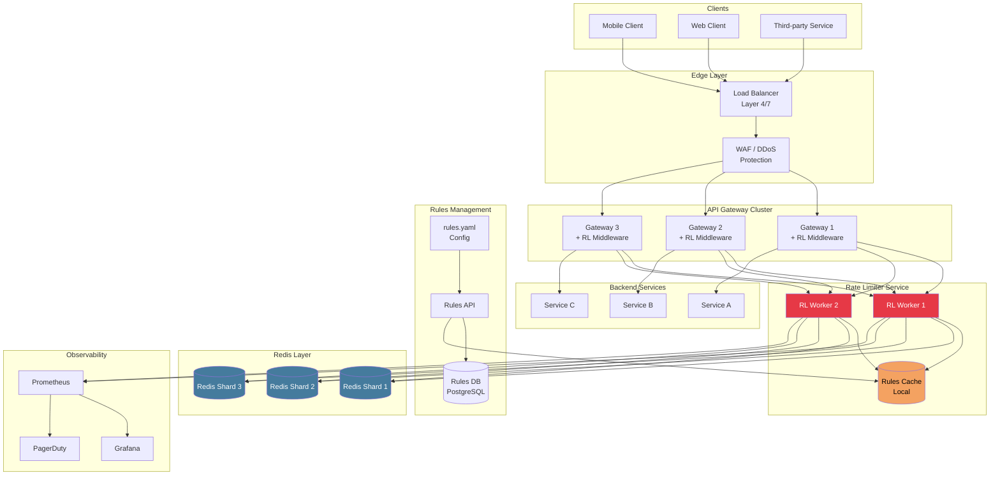

# System Design: Design a Rate Limiter

## Full Interview Walkthrough

This document walks through the "Design a Rate Limiter" problem as you would in a
45-minute system design interview, following the standard four-step framework.

---

## Step 1: Requirements Clarification

Always start by asking clarifying questions. Do not jump into design.

### Questions to Ask the Interviewer

```
1. What kind of rate limiter? (API rate limiter? Network-level? Application-level?)
2. Does it throttle by IP, user ID, API key, or something else?
3. What scale? (How many users, requests per second?)
4. Is this a standalone service or part of application code?
5. Do we need to inform users when they are throttled? (HTTP headers, retry-after)
6. Is the system distributed? How many servers?
7. Do different API endpoints have different rate limits?
8. Should rate limits be configurable without code deployment?
9. What happens when a user is rate-limited? Hard reject or graceful degradation?
10. Do we need to support tiered rate limits? (Free vs Pro vs Enterprise)
```

### Functional Requirements

| Requirement | Detail |
|-------------|--------|
| Limit request rates | Per user/API-key, per endpoint, per time window |
| Multiple limit dimensions | Support IP, user, endpoint, and combination-based limits |
| Configurable rules | Change limits without code deployment (YAML/DB config) |
| Accurate counting | Minimize false positives (blocking legitimate users) |
| Informative responses | Return 429 with rate limit headers and retry-after |
| Support different algorithms | Token bucket, sliding window, etc. per use case |

### Non-Functional Requirements

| Requirement | Target |
|-------------|--------|
| **Low latency** | Rate check must add < 5ms to request path |
| **High availability** | Rate limiter failure should not take down the service |
| **Scalability** | Handle 10M+ unique keys, 1M+ req/sec |
| **Consistency** | At most ~1-5% overshoot acceptable (not banking-grade) |
| **Fault tolerance** | Degrade gracefully if Redis is down (fail-open or local fallback) |
| **Observability** | Metrics on rate-limited requests, alerting on spikes |

### Back-of-Envelope Estimation

```
Given: 10 million users, peak 500K req/sec

Rate limit state per user:
  - Sliding window counter: ~32 bytes/key
  - Total: 10M * 32 B = ~320 MB (fits in one Redis instance)

Redis throughput:
  - Single Redis instance: ~100K-200K operations/sec
  - Need: 500K/sec
  - Solution: Redis Cluster with 3-5 shards

Network bandwidth:
  - Each rate limit check: ~200 bytes (request + response)
  - 500K * 200 B = ~100 MB/sec = ~800 Mbps
  - Within standard network capacity
```

---

## Step 2: High-Level Design



### Component Responsibilities

| Component | Role |
|-----------|------|
| **Load Balancer** | Distribute traffic, TLS termination |
| **WAF** | Block known bad IPs, DDoS protection (L3/L4 rate limiting) |
| **API Gateway** | Authentication, routing, calls rate limiter before forwarding |
| **Rate Limiter Service** | Core logic: check rules, run algorithm, return allow/deny |
| **Rules Cache** | In-memory cache of rules (refreshed periodically from DB) |
| **Rules DB / Config** | Source of truth for rate limit rules |
| **Redis Cluster** | Shared state for counters/tokens across all servers |
| **Observability** | Metrics, dashboards, alerts |

### Request Flow

```
1. Client --> Load Balancer --> WAF (IP-level filtering)
2. WAF --> API Gateway (extract API key from header)
3. API Gateway --> Rate Limiter Service:
   - Input: {api_key, endpoint, client_ip}
   - Rate Limiter looks up rules for this key+endpoint
   - Executes algorithm (e.g., token bucket Lua script) against Redis
   - Returns: {allowed, remaining, reset_at}
4. If allowed:
   - Gateway forwards to backend service
   - Adds X-RateLimit-* headers to response
5. If rejected:
   - Gateway returns 429 + Retry-After header
   - Logs metric: rate_limit_rejected{key, endpoint}
```

---

## Step 3: Deep Dive

### 3.1 Algorithm Choice

For a general-purpose API rate limiter, use **Token Bucket** or **Sliding Window Counter**.

**Recommendation: Token Bucket for per-second burst control + Sliding Window Counter
for per-minute sustained limits.** This gives both burst tolerance and accurate
sustained rate enforcement.

```python
# Two-tier rate limiting
class TwoTierRateLimiter:
    """
    Tier 1: Token Bucket for burst control (short window)
    Tier 2: Sliding Window Counter for sustained rate (long window)
    
    Request must pass BOTH tiers.
    """
    
    def __init__(self, redis_client, burst_capacity, burst_refill, 
                 sustained_limit, sustained_window):
        self.burst = RedisTokenBucket(redis_client, burst_capacity, burst_refill)
        self.sustained = RedisSlidingWindowCounter(
            redis_client, sustained_limit, sustained_window
        )
    
    def allow_request(self, key: str) -> dict:
        burst_ok = self.burst.allow_request(f"{key}:burst")
        if not burst_ok:
            return {"allowed": False, "reason": "burst_limit_exceeded"}
        
        sustained_ok = self.sustained.allow_request(f"{key}:sustained")
        if not sustained_ok:
            return {"allowed": False, "reason": "sustained_limit_exceeded"}
        
        return {"allowed": True}
```

### 3.2 Redis Implementation Details

**Key schema**:
```
rl:tb:{api_key}:{endpoint}       -- Token bucket state (hash)
rl:sw:{api_key}:{endpoint}:{ts}  -- Sliding window counter (string)
rl:rules:{api_key}               -- Cached rules for this key (hash)
```

**Token Bucket Lua Script** (atomic, production-grade):

```python
TOKEN_BUCKET_WITH_HEADERS_LUA = """
local key = KEYS[1]
local capacity = tonumber(ARGV[1])
local refill_rate = tonumber(ARGV[2])
local now = tonumber(ARGV[3])
local tokens_needed = tonumber(ARGV[4])

-- Get or initialize state
local data = redis.call('HMGET', key, 'tokens', 'last_refill')
local tokens = tonumber(data[1])
local last_refill = tonumber(data[2])

if tokens == nil then
    tokens = capacity
    last_refill = now
end

-- Refill
local elapsed = math.max(0, now - last_refill)
tokens = math.min(capacity, tokens + elapsed * refill_rate)

-- Attempt to consume
local allowed = 0
local remaining = 0

if tokens >= tokens_needed then
    tokens = tokens - tokens_needed
    allowed = 1
end

remaining = math.floor(tokens)

-- Persist state
redis.call('HMSET', key, 'tokens', tostring(tokens), 'last_refill', tostring(now))
redis.call('EXPIRE', key, math.ceil(capacity / refill_rate) * 2)

-- Return: allowed, remaining, reset_time (time until full refill)
local reset_time = math.ceil((capacity - tokens) / refill_rate)
return {allowed, remaining, reset_time}
"""
```

### 3.3 Distributed Challenges

**Race conditions** are solved by Lua scripts (see above).

**Redis Cluster partitioning**: Use consistent hashing on the rate limit key.
All counters for a given user land on the same shard.

**Failover strategy**:

```python
class ProductionRateLimiter:
    """Production-grade rate limiter with failover."""
    
    def __init__(self, redis_client, config):
        self.redis = redis_client
        self.config = config
        self.local_fallback = {}  # key -> TokenBucket
        self.metrics = MetricsCollector()
    
    def allow_request(self, key: str, endpoint: str) -> dict:
        rule = self.config.get_rule(key, endpoint)
        
        try:
            result = self._check_redis(key, rule)
            self.metrics.record("rate_limit_check", status="redis_ok")
            return result
        except Exception as e:
            self.metrics.record("rate_limit_check", status="redis_error")
            
            if self.config.fail_mode == "open":
                return {"allowed": True, "degraded": True}
            elif self.config.fail_mode == "local":
                return self._check_local(key, rule)
            else:  # fail_mode == "closed"
                return {"allowed": False, "reason": "rate_limiter_unavailable"}
```

---

## Step 4: Rate Limiting Rules Engine

Rules should be configurable without code deployment.

### YAML Configuration

```yaml
# rate_limit_rules.yaml

global_defaults:
  algorithm: sliding_window_counter
  window: 60        # seconds
  limit: 100        # requests per window
  fail_mode: open   # open | closed | local

rules:
  # Per-client overrides
  - client_id: "stripe_webhook"
    endpoint: "POST /api/webhooks/stripe"
    limit: 1000
    window: 60
    algorithm: token_bucket
    burst_capacity: 50
    refill_rate: 17   # 1000/60 ~ 17/sec

  - client_id: "free_tier"
    endpoint: "*"       # all endpoints
    limit: 60
    window: 60
    algorithm: sliding_window_counter

  - client_id: "pro_tier"
    endpoint: "*"
    limit: 600
    window: 60
    algorithm: sliding_window_counter

  - client_id: "enterprise_tier"
    endpoint: "*"
    limit: 6000
    window: 60
    algorithm: token_bucket
    burst_capacity: 200
    refill_rate: 100

  # Per-endpoint rules (apply to all clients unless overridden)
  - client_id: "*"
    endpoint: "POST /api/auth/login"
    limit: 5
    window: 300       # 5 attempts per 5 minutes
    algorithm: sliding_window_log   # exact -- security critical

  - client_id: "*"
    endpoint: "POST /api/payments"
    limit: 10
    window: 60
    algorithm: sliding_window_log

  - client_id: "*"
    endpoint: "GET /api/search"
    limit: 30
    window: 60
    algorithm: sliding_window_counter
```

### Rules Engine Implementation

```python
import yaml
from dataclasses import dataclass
from typing import Optional


@dataclass
class RateLimitRule:
    client_id: str
    endpoint: str
    limit: int
    window: int
    algorithm: str
    burst_capacity: Optional[int] = None
    refill_rate: Optional[float] = None
    fail_mode: str = "open"


class RulesEngine:
    """
    Loads and matches rate limit rules.
    Rules are loaded from YAML config, cached in memory,
    and refreshed periodically.
    """
    
    def __init__(self, config_path: str):
        self.config_path = config_path
        self.rules: list[RateLimitRule] = []
        self.defaults: dict = {}
        self.reload()
    
    def reload(self):
        """Reload rules from YAML config file."""
        with open(self.config_path) as f:
            config = yaml.safe_load(f)
        
        self.defaults = config.get("global_defaults", {})
        self.rules = [
            RateLimitRule(**{**self.defaults, **rule})
            for rule in config.get("rules", [])
        ]
    
    def get_rule(self, client_id: str, endpoint: str) -> RateLimitRule:
        """
        Find the most specific matching rule.
        Priority: exact client+endpoint > exact client+wildcard > 
                  wildcard client+exact endpoint > global default
        """
        best_match = None
        best_score = -1
        
        for rule in self.rules:
            score = 0
            
            # Check client match
            if rule.client_id == client_id:
                score += 2
            elif rule.client_id == "*":
                score += 1
            else:
                continue
            
            # Check endpoint match
            if rule.endpoint == endpoint:
                score += 2
            elif rule.endpoint == "*":
                score += 1
            else:
                continue
            
            if score > best_score:
                best_score = score
                best_match = rule
        
        if best_match:
            return best_match
        
        # Return global default
        return RateLimitRule(
            client_id=client_id,
            endpoint=endpoint,
            **self.defaults
        )
```

---

## Monitoring and Alerting

### Key Metrics to Track

```python
# Prometheus metrics for rate limiting
from prometheus_client import Counter, Histogram, Gauge

# Count of rate limit decisions
rate_limit_decisions = Counter(
    'rate_limit_decisions_total',
    'Total rate limit decisions',
    ['key_type', 'endpoint', 'decision']  # decision: allowed | rejected
)

# Latency of rate limit checks
rate_limit_latency = Histogram(
    'rate_limit_check_duration_seconds',
    'Time to perform rate limit check',
    ['algorithm'],
    buckets=[0.0005, 0.001, 0.0025, 0.005, 0.01, 0.025, 0.05, 0.1]
)

# Current utilization (how close to limit)
rate_limit_utilization = Gauge(
    'rate_limit_utilization_ratio',
    'Current usage as ratio of limit (0.0 to 1.0+)',
    ['client_id', 'endpoint']
)

# Redis health
redis_errors = Counter(
    'rate_limit_redis_errors_total',
    'Redis errors during rate limit checks',
    ['error_type']
)
```

### Alerting Rules

```yaml
# Prometheus alerting rules
groups:
  - name: rate_limiting
    rules:
      # Alert if too many users hitting rate limits
      - alert: HighRateLimitRejectionRate
        expr: |
          sum(rate(rate_limit_decisions_total{decision="rejected"}[5m]))
          /
          sum(rate(rate_limit_decisions_total[5m]))
          > 0.10
        for: 5m
        labels:
          severity: warning
        annotations:
          summary: "More than 10% of requests are being rate-limited"

      # Alert if rate limit check latency spikes (Redis issue)
      - alert: RateLimitLatencyHigh
        expr: |
          histogram_quantile(0.99, rate(rate_limit_check_duration_seconds_bucket[5m]))
          > 0.010
        for: 2m
        labels:
          severity: critical
        annotations:
          summary: "P99 rate limit check latency exceeds 10ms"

      # Alert if Redis errors spike
      - alert: RateLimitRedisErrors
        expr: rate(rate_limit_redis_errors_total[5m]) > 10
        for: 1m
        labels:
          severity: critical
        annotations:
          summary: "Redis errors spiking -- rate limiter may be degraded"

      # Alert if a single client is consuming disproportionate rate limit
      - alert: SingleClientHighUtilization
        expr: rate_limit_utilization_ratio > 0.95
        for: 10m
        labels:
          severity: info
        annotations:
          summary: "Client {{ $labels.client_id }} near rate limit for 10+ minutes"
```

### Grafana Dashboard Panels

```
DASHBOARD: Rate Limiting Overview

Row 1: Summary
  [Total Requests/sec]  [Rejected/sec]  [Rejection Rate %]  [P99 Latency]

Row 2: Decisions Over Time
  [Time series: allowed vs rejected requests, stacked area chart]

Row 3: Top Rate-Limited Clients
  [Table: client_id, endpoint, requests, rejections, utilization%]

Row 4: Algorithm Performance
  [Histogram: rate limit check latency by algorithm type]

Row 5: Redis Health
  [Redis ops/sec]  [Redis memory usage]  [Redis errors]  [Failover events]
```

---

## Edge Cases

### 1. Clock Synchronization Across Servers

```
PROBLEM:
  Server A: 12:00:59.999   (thinks it is Window 1)
  Server B: 12:01:00.001   (thinks it is Window 2)
  Same request routed to different servers gets different windows.

SOLUTIONS:
  a) Use Redis server time in Lua scripts:
     local time = redis.call('TIME')
     local now = tonumber(time[1]) + tonumber(time[2]) / 1000000
  
  b) NTP sync with < 10ms drift (standard for cloud instances)
  
  c) For sliding window counter, small clock drift has minimal
     impact on weighted calculation (self-correcting)
```

### 2. Redis Failover

```
SCENARIO: Redis primary goes down, sentinel promotes replica.

RISK: 
  - Brief period where writes to old primary are lost
  - Counters reset to slightly stale values
  - Some users may briefly exceed limits

MITIGATION:
  - Redis Sentinel for automatic failover (< 30 sec)
  - Accept brief overcounting during failover (fail-open)
  - Local in-memory fallback during failover window
  - Monitor redis_replication_offset for data loss detection
```

### 3. Race Conditions

```
SCENARIO: Two requests for same user arrive simultaneously on different servers.

WITHOUT atomic operations:
  Server A: GET count -> 99   |   Server B: GET count -> 99
  Server A: 99 < 100? ALLOW   |   Server B: 99 < 100? ALLOW
  Server A: SET count -> 100   |   Server B: SET count -> 100
  
  Both allowed! Real count should be 101 (over limit).

WITH Lua scripts:
  Lua executes atomically on Redis -- no interleaving possible.
  Server A's script runs fully, THEN Server B's script runs.
  Server A: count 99 -> 100, ALLOW
  Server B: count 100 -> 100, REJECT (correct!)
```

### 4. Distributed Rate Limiting Across Regions

```
Multi-region deployment:

  US-East: Redis Cluster (primary for US users)
  EU-West: Redis Cluster (primary for EU users)
  AP-Southeast: Redis Cluster (primary for APAC users)

  Global user (API key used from multiple regions):
  Option A: Route all rate limit checks to one region (latency cost)
  Option B: Per-region limits (limit/3 per region, inaccurate)
  Option C: Cross-region sync (CRDTs or periodic merge, eventual consistency)
  
  Most practical: Option B with monitoring for cross-region abuse.
```

---

## Real-World Examples

### Stripe API Rate Limiting

```
Stripe uses token bucket per API key:

  - Test mode:  25 req/sec (burst up to 25)
  - Live mode: 100 req/sec (burst up to 100)
  - Per-endpoint limits for expensive operations

Headers returned:
  Stripe-RateLimit-Limit: 100
  Stripe-RateLimit-Remaining: 95
  Stripe-RateLimit-Reset: 1672531260

Key design decisions:
  - Separate limits for read vs write operations
  - Higher limits for idempotent requests
  - Webhook delivery has its own limits
  - Dashboard shows real-time rate limit utilization
```

### GitHub API Rate Limiting

```
GitHub uses fixed window per user:

  Authenticated:   5,000 requests / hour
  Unauthenticated: 60 requests / hour (by IP)
  GitHub Apps:     5,000 + 50/user (up to 12,500)
  Search API:      30 requests / minute (authenticated)

Headers:
  X-RateLimit-Limit: 5000
  X-RateLimit-Remaining: 4987
  X-RateLimit-Reset: 1672531260  (Unix epoch)
  X-RateLimit-Used: 13
  X-RateLimit-Resource: core  (which limit category)

Key design decisions:
  - Separate "resources" (core, search, graphql, code_search)
  - Conditional requests (If-None-Match) do NOT count against limit
  - GraphQL: 5,000 points/hour (complexity-based, not request-based)
```

### Twitter/X API Rate Limiting

```
Twitter uses sliding window per endpoint per user:

  GET /tweets:           300 req / 15 min
  POST /tweets:          200 req / 15 min  (v2)
  GET /users/me:         75 req / 15 min
  
  App-level limits (all users of your app combined):
  GET /tweets/search:    300 req / 15 min (app)
                         450 req / 15 min (app, Academic Research)

Headers:
  x-rate-limit-limit: 300
  x-rate-limit-remaining: 295
  x-rate-limit-reset: 1672531260

Key design decisions:
  - Per-endpoint limits (not global)
  - Both user-level AND app-level limits
  - Different tiers (Basic, Pro, Enterprise) with different limits
  - 15-minute windows (not 1-hour or 1-minute)
```

---

## Interview Questions with Answers

### Q1: How would you handle a spike in traffic that exceeds your rate limiter's capacity?

**Answer**: Multi-layer defense:
1. CDN/Edge absorbs L3/L4 attacks before traffic reaches rate limiter
2. Rate limiter itself is horizontally scalable (stateless workers + Redis)
3. Redis Cluster shards handle key distribution
4. If Redis becomes bottleneck, use local-first with async sync pattern
5. Circuit breaker: if rate limiter latency exceeds threshold, bypass it temporarily
   (fail-open) to avoid cascading failure

### Q2: How do you rate limit a distributed system with servers in multiple regions?

**Answer**: Three approaches by ascending complexity:
1. **Single-region Redis**: All rate limit checks go to one Redis in one region. Adds
   latency for remote regions (~100-200ms cross-region) but is simple and accurate.
2. **Per-region limits**: Divide global limit by number of regions. Each region has its own
   Redis. Simple but inaccurate if traffic is uneven across regions.
3. **CRDT-based counters**: Each region maintains local counters. Periodically merge using
   conflict-free replicated data types (G-Counter). Eventually consistent but handles
   cross-region traffic. Used by sophisticated systems like Cloudflare.

### Q3: Should the rate limiter be a separate service or middleware in the API gateway?

**Answer**: It depends on scale:
- **Small/medium scale**: Middleware in the API gateway. Simpler deployment, fewer network hops.
  The gateway checks Redis directly.
- **Large scale**: Separate service. Allows independent scaling, different team ownership,
  shared across multiple gateways/services. The gateway makes a lightweight gRPC call to the
  rate limiter service.
- **Most production systems**: Start as middleware, extract to service when complexity demands it.

### Q4: How do you prevent a malicious user from enumerating rate limit boundaries?

**Answer**:
1. Do not expose exact remaining count in headers (return approximate values)
2. Add jitter to rate limit responses (vary the reset time slightly)
3. Use exponential backoff on 429 responses (double the retry-after each time)
4. Shadow ban: allow requests but return empty/fake data for abusive users
5. IP reputation scoring: lower limits for suspicious IPs

### Q5: What is the difference between rate limiting and throttling?

**Answer**:
- **Rate limiting**: Hard cap. Once limit is exceeded, all requests are rejected (429).
  Binary: allowed or denied.
- **Throttling**: Gradual degradation. As load increases, responses are slowed (added latency),
  quality is reduced (fewer results), or requests are queued. Proportional response rather
  than binary cutoff.
- In practice, the best systems combine both: throttle first (degrade gracefully), then
  rate limit (hard reject) if load continues to increase.

### Q6: How would you test a rate limiter?

**Answer**:
```python
# Unit tests for algorithm correctness
def test_token_bucket_allows_burst():
    tb = TokenBucket(capacity=5, refill_rate=1)
    for i in range(5):
        assert tb.allow_request() is True  # Burst of 5
    assert tb.allow_request() is False     # 6th rejected

def test_token_bucket_refills():
    tb = TokenBucket(capacity=5, refill_rate=1)
    for i in range(5):
        tb.allow_request()  # Drain all
    time.sleep(1.1)
    assert tb.allow_request() is True  # Refilled 1 token

def test_sliding_window_no_boundary_burst():
    # Verify no 2x burst at window boundary
    sw = SlidingWindowCounter(limit=10, window_size=60)
    # Fill end of previous window (simulated)
    # Fill start of current window
    # Verify total never exceeds limit

# Load tests
def test_concurrent_rate_limiting():
    """Spin up 100 threads, all hitting same key.
    Verify total allowed requests <= limit + small margin."""
    # ... thread pool executor, shared limiter, count allows

# Chaos tests
def test_redis_failover():
    """Kill Redis primary, verify rate limiter degrades gracefully."""
    # ... docker-compose down redis-primary, check fail-open behavior
```

---

## Design Summary Cheat Sheet

```
+-------------------------------------------------------------------+
|                     RATE LIMITER DESIGN                            |
+-------------------------------------------------------------------+
|                                                                   |
|  ALGORITHM:   Token Bucket (burst) + Sliding Window (sustained)   |
|  STORAGE:     Redis Cluster (3-5 shards)                          |
|  ATOMICITY:   Lua scripts (no race conditions)                    |
|  FAILOVER:    Fail-open + local fallback + alerting               |
|  RULES:       YAML config, hot-reloadable, tiered per client      |
|  HEADERS:     X-RateLimit-{Limit,Remaining,Reset} + Retry-After   |
|  MONITORING:  Prometheus + Grafana + PagerDuty alerts              |
|  PLACEMENT:   API Gateway middleware (extract to service at scale) |
|  KEY SCHEMA:  rl:{algo}:{client_id}:{endpoint}                    |
|  DEGRADATION: Cached -> Reduced -> Minimal -> 429                 |
|                                                                   |
+-------------------------------------------------------------------+
```
