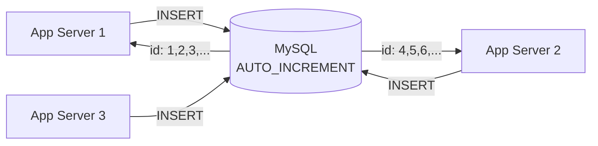
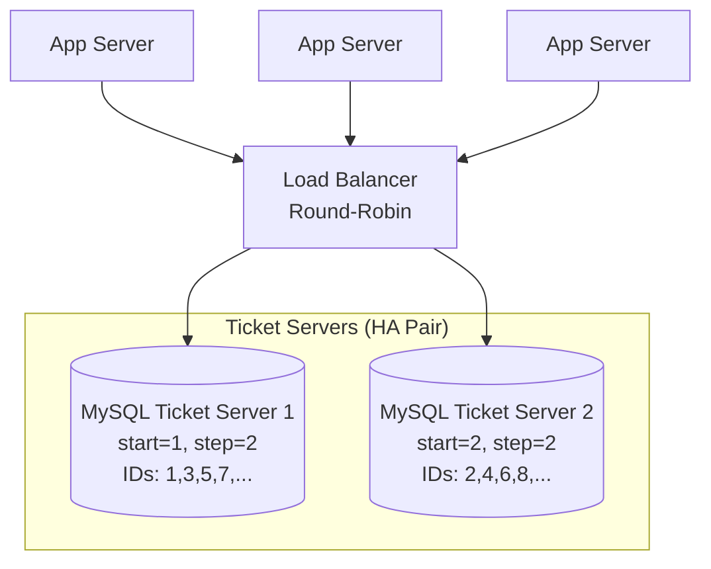
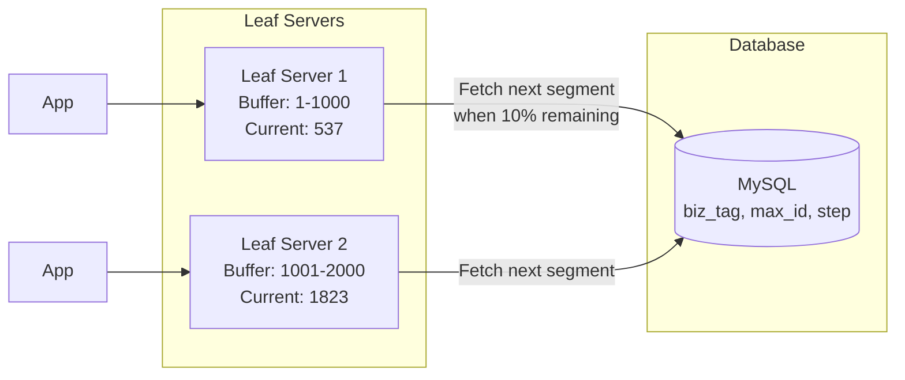
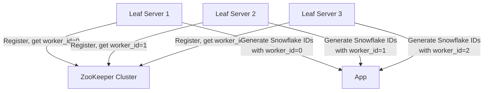
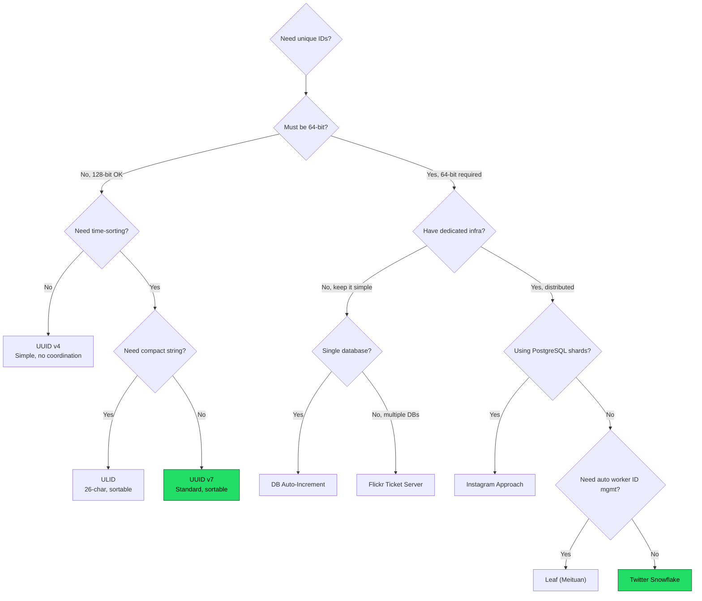

# Unique ID Generation in Distributed Systems -- All Approaches

## Why This Matters

Every distributed system needs a way to uniquely identify entities -- users, orders, messages,
transactions. The challenge: multiple servers running simultaneously cannot coordinate on
"who gets the next number" without introducing bottlenecks. This document covers every
major approach, with bit layouts, code, and tradeoffs.

---

## 1. UUID (Universally Unique Identifier)

UUIDs are 128-bit identifiers standardized by RFC 4122. They are the most widely deployed
unique ID scheme, represented as 36-character hexadecimal strings:

```
550e8400-e29b-41d4-a716-446655440000
```

### 1.1 UUID v1 -- Timestamp + MAC Address

**How it works:** Combines a 60-bit timestamp (100-nanosecond intervals since October 15, 1582),
a 14-bit clock sequence (guards against clock regression), and a 48-bit MAC address (node ID).

```
 UUID v1 Bit Layout (128 bits total)
 ┌─────────────────────────────────────────────────────────────────┐
 │  time_low (32)  │ time_mid (16) │ ver(4) │ time_hi (12)        │
 ├─────────────────┼───────────────┼────────┼─────────────────────┤
 │  Bits 0-31      │ Bits 32-47    │ 0001   │ Bits 48-59          │
 ├─────────────────────────────────────────────────────────────────┤
 │ var(2) │ clk_seq (14)  │         node / MAC address (48)       │
 ├────────┼───────────────┼───────────────────────────────────────┤
 │   10   │ Bits 60-73    │ Bits 74-121 (MAC address)             │
 └─────────────────────────────────────────────────────────────────┘
```

**Ordering:** Partially sortable. The timestamp is split across non-contiguous fields,
so naive lexicographic sorting does NOT yield time order. You must reassemble the timestamp.

**Collision risk:** Effectively zero if MAC addresses are unique. Two machines with the
same MAC generating IDs in the same 100ns window could collide (astronomically unlikely).

**Privacy concern:** The MAC address is embedded in the ID. This leaks hardware identity.
Famously, the Melissa virus author was tracked through UUID v1 in a Word document.

```python
import uuid

# Generate UUID v1
id_v1 = uuid.uuid1()
print(id_v1)            # e.g., 6fa459ea-ee8a-11e1-a60a-3c970e96b3d0
print(id_v1.node)       # MAC address as integer
print(id_v1.time)       # 60-bit timestamp
```

| Property          | Value                                       |
|-------------------|---------------------------------------------|
| Size              | 128 bits (36 chars as string)               |
| Sortable          | Partially (timestamp fields are scattered)  |
| Coordination      | None                                        |
| Throughput         | Unlimited (no central authority)            |
| Privacy           | Leaks MAC address                           |

---

### 1.2 UUID v4 -- Fully Random

**How it works:** 122 random bits + 6 bits for version (4) and variant (10).
No timestamp, no MAC, no ordering. Pure randomness.

```
 UUID v4 Bit Layout (128 bits total)
 ┌─────────────────────────────────────────────────────────────────┐
 │           random_a (48 bits)            │ ver(4) │ random_b(12)│
 ├─────────────────────────────────────────┼────────┼─────────────┤
 │  48 random bits                         │  0100  │ 12 random   │
 ├─────────────────────────────────────────────────────────────────┤
 │ var(2) │                  random_c (62 bits)                    │
 ├────────┼───────────────────────────────────────────────────────┤
 │   10   │  62 random bits                                       │
 └─────────────────────────────────────────────────────────────────┘

 Total random bits: 48 + 12 + 62 = 122 bits
```

**Collision risk (Birthday Problem):**
- With 122 random bits, you need to generate ~2^61 (~2.3 x 10^18) UUIDs before
  a 50% chance of collision.
- At 1 billion UUIDs/second, it would take ~73 years to hit 50% collision probability.
- In practice: collision risk is negligible for any real system.

**Database index problem:** Random UUIDs cause B-tree index fragmentation. Each new insert
lands at a random position in the index, causing page splits and poor cache locality.
This can degrade write throughput by 2-10x compared to sequential IDs on large tables.

```python
import uuid

id_v4 = uuid.uuid4()
print(id_v4)  # e.g., f47ac10b-58cc-4372-a567-0e02b2c3d479
```

| Property          | Value                                       |
|-------------------|---------------------------------------------|
| Size              | 128 bits (36 chars as string)               |
| Sortable          | No                                          |
| Coordination      | None                                        |
| Throughput         | Unlimited                                   |
| Index performance | Poor (random inserts fragment B-trees)      |

---

### 1.3 UUID v7 -- Timestamp + Random (New Standard)

**How it works:** Defined in RFC 9562 (2024). Embeds a 48-bit Unix timestamp in milliseconds
at the most-significant bits, followed by random data. This makes UUIDs naturally sortable
by creation time while preserving the benefits of randomness.

```
 UUID v7 Bit Layout (128 bits total)
 ┌─────────────────────────────────────────────────────────────────┐
 │              unix_ts_ms (48 bits)                               │
 ├─────────────────────────────────────────────────────────────────┤
 │  Milliseconds since Unix epoch (1970-01-01)                    │
 ├────────────────────────────────────────┬────────┬──────────────┤
 │                                        │ ver(4) │ rand_a (12)  │
 │                                        │  0111  │              │
 ├────────┬───────────────────────────────────────────────────────┤
 │ var(2) │                  rand_b (62 bits)                      │
 │   10   │                                                        │
 └─────────────────────────────────────────────────────────────────┘

 48-bit timestamp: ~8900 years from epoch before overflow
 74 random bits total (12 + 62)
```

**Why v7 is the future:**
- Time-sortable: lexicographic order = chronological order
- Great for database primary keys (sequential inserts, no B-tree fragmentation)
- Still 128 bits, still no coordination required
- Monotonic within the same millisecond (implementations increment rand_a)

```python
import uuid

# Python 3.13+ has native uuid7 support
id_v7 = uuid.uuid7()
print(id_v7)  # e.g., 018f1234-5678-7abc-8def-0123456789ab
               # Notice: starts with timestamp prefix, so IDs sort chronologically
```

| Property          | Value                                       |
|-------------------|---------------------------------------------|
| Size              | 128 bits (36 chars as string)               |
| Sortable          | Yes (millisecond precision)                 |
| Coordination      | None                                        |
| Throughput         | Unlimited                                   |
| Index performance | Excellent (sequential inserts)              |

---

### UUID Summary

| Version | Sortable | Privacy | Index Performance | Use Case                  |
|---------|----------|---------|-------------------|---------------------------|
| v1      | Partial  | Leaks MAC | Medium          | Legacy systems            |
| v4      | No       | Safe    | Poor              | Most common today         |
| v7      | Yes      | Safe    | Excellent         | New projects, databases   |

---

## 2. Database Auto-Increment

The simplest approach: let the database assign sequential integers.

### 2.1 Single Server

```sql
CREATE TABLE orders (
    id BIGINT AUTO_INCREMENT PRIMARY KEY,
    ...
);

INSERT INTO orders (...) VALUES (...);
-- Returns: id = 1, then 2, then 3, ...
```



**Problem:** Single point of failure. If the database goes down, no IDs can be generated.
The database becomes a bottleneck for write throughput.

### 2.2 Multi-Master Replication

Assign each master a different starting point and step size:

```
 Server 1 (start=1, step=3):  1, 4, 7, 10, 13, 16, ...
 Server 2 (start=2, step=3):  2, 5, 8, 11, 14, 17, ...
 Server 3 (start=3, step=3):  3, 6, 9, 12, 15, 18, ...
```

```sql
-- Server 1
SET @@auto_increment_offset = 1;
SET @@auto_increment_increment = 3;

-- Server 2
SET @@auto_increment_offset = 2;
SET @@auto_increment_increment = 3;
```

**Problems with multi-master:**
- Cannot easily add/remove servers (step size is baked in)
- IDs are NOT globally sorted by time (server 2 might generate id=8 before server 1 generates id=7)
- Cross-shard joins become complicated
- Scaling beyond a handful of masters is impractical

| Property          | Value                                       |
|-------------------|---------------------------------------------|
| Size              | 64 bits (BIGINT)                            |
| Sortable          | Yes (single master) / Partial (multi-master)|
| Coordination      | Required (DB is central authority)          |
| Throughput         | ~1K-10K IDs/sec per server                  |
| Uniqueness        | Guaranteed within a single master           |

---

## 3. Twitter Snowflake (MOST IMPORTANT)

The gold standard for distributed ID generation. Twitter created Snowflake in 2010 to
generate unique IDs for tweets at scale. It produces 64-bit, time-sortable, unique IDs
with no coordination between generators.

### Bit Layout

```
 Twitter Snowflake ID (64 bits)
 ┌──────────────────────────────────────────────────────────────────────┐
 │ 0 │        Timestamp (41 bits)        │ DC(5) │ Machine(5) │Seq(12)│
 ├───┼──────────────────────────────────┼───────┼────────────┼───────┤
 │ 0 │ ms since custom epoch             │ 0-31  │   0-31     │0-4095 │
 │   │ (2^41 ms = ~69.7 years)           │       │            │       │
 └───┴──────────────────────────────────┴───────┴────────────┴───────┘
  Bit  63  62                        22    21  17  16      12  11    0
```

### Field Breakdown

| Field      | Bits | Range   | Purpose                                     |
|------------|------|---------|---------------------------------------------|
| Sign       | 1    | 0       | Always 0 (positive number in signed 64-bit) |
| Timestamp  | 41   | 0-2^41  | Milliseconds since custom epoch (~69 years) |
| Datacenter | 5    | 0-31    | Up to 32 datacenters                        |
| Machine    | 5    | 0-31    | Up to 32 machines per datacenter            |
| Sequence   | 12   | 0-4095  | Up to 4096 IDs per millisecond per machine  |

### Throughput Calculation

```
Per machine:    4,096 IDs/ms = 4,096,000 IDs/sec
Per datacenter: 4,096,000 x 32 machines = 131,072,000 IDs/sec
Total system:   131,072,000 x 32 DCs = 4,194,304,000 IDs/sec (~4 billion/sec)
```

### Implementation (Python)

```python
import time
import threading

class Snowflake:
    # Twitter's epoch: Nov 04, 2010 01:42:54 UTC
    EPOCH = 1288834974657

    TIMESTAMP_BITS = 41
    DATACENTER_BITS = 5
    MACHINE_BITS = 5
    SEQUENCE_BITS = 12

    MAX_DATACENTER_ID = (1 << DATACENTER_BITS) - 1   # 31
    MAX_MACHINE_ID = (1 << MACHINE_BITS) - 1          # 31
    MAX_SEQUENCE = (1 << SEQUENCE_BITS) - 1            # 4095

    MACHINE_SHIFT = SEQUENCE_BITS                       # 12
    DATACENTER_SHIFT = SEQUENCE_BITS + MACHINE_BITS     # 17
    TIMESTAMP_SHIFT = SEQUENCE_BITS + MACHINE_BITS + DATACENTER_BITS  # 22

    def __init__(self, datacenter_id: int, machine_id: int):
        if datacenter_id > self.MAX_DATACENTER_ID or datacenter_id < 0:
            raise ValueError(f"Datacenter ID must be between 0 and {self.MAX_DATACENTER_ID}")
        if machine_id > self.MAX_MACHINE_ID or machine_id < 0:
            raise ValueError(f"Machine ID must be between 0 and {self.MAX_MACHINE_ID}")

        self.datacenter_id = datacenter_id
        self.machine_id = machine_id
        self.sequence = 0
        self.last_timestamp = -1
        self._lock = threading.Lock()

    def _current_millis(self) -> int:
        return int(time.time() * 1000)

    def _wait_for_next_millis(self, last_ts: int) -> int:
        ts = self._current_millis()
        while ts <= last_ts:
            ts = self._current_millis()
        return ts

    def generate(self) -> int:
        with self._lock:
            timestamp = self._current_millis()

            # CLOCK WENT BACKWARD -- critical edge case
            if timestamp < self.last_timestamp:
                raise Exception(
                    f"Clock moved backwards by {self.last_timestamp - timestamp}ms. "
                    f"Refusing to generate ID."
                )

            # Same millisecond: increment sequence
            if timestamp == self.last_timestamp:
                self.sequence = (self.sequence + 1) & self.MAX_SEQUENCE
                if self.sequence == 0:
                    # Sequence overflow: wait for next millisecond
                    timestamp = self._wait_for_next_millis(self.last_timestamp)
            else:
                # New millisecond: reset sequence
                self.sequence = 0

            self.last_timestamp = timestamp

            # Assemble the 64-bit ID
            return (
                ((timestamp - self.EPOCH) << self.TIMESTAMP_SHIFT) |
                (self.datacenter_id << self.DATACENTER_SHIFT) |
                (self.machine_id << self.MACHINE_SHIFT) |
                self.sequence
            )

# Usage
gen = Snowflake(datacenter_id=1, machine_id=5)
for _ in range(5):
    print(gen.generate())
```

### Extracting Components from a Snowflake ID

```python
def parse_snowflake(snowflake_id: int, epoch: int = 1288834974657):
    """Reverse-engineer a Snowflake ID into its components."""
    timestamp = ((snowflake_id >> 22) & 0x1FFFFFFFFFF) + epoch
    datacenter = (snowflake_id >> 17) & 0x1F
    machine = (snowflake_id >> 12) & 0x1F
    sequence = snowflake_id & 0xFFF

    from datetime import datetime, timezone
    dt = datetime.fromtimestamp(timestamp / 1000, tz=timezone.utc)

    return {
        "timestamp_ms": timestamp,
        "datetime": dt.isoformat(),
        "datacenter_id": datacenter,
        "machine_id": machine,
        "sequence": sequence,
    }
```

| Property          | Value                                       |
|-------------------|---------------------------------------------|
| Size              | 64 bits                                     |
| Sortable          | Yes (roughly time-ordered)                  |
| Coordination      | None at runtime (pre-assigned DC/machine)   |
| Throughput         | 4,096,000 IDs/sec per machine               |
| Uniqueness        | Guaranteed (timestamp + worker + sequence)  |

---

## 4. ULID (Universally Unique Lexicographically Sortable Identifier)

ULIDs solve the UUID v4 sortability problem with a cleaner design than UUID v7.

### Bit Layout

```
 ULID (128 bits = 26 Crockford Base32 characters)
 ┌────────────────────────────────────────────────────────────────────┐
 │        Timestamp (48 bits)          │         Randomness (80 bits)│
 ├─────────────────────────────────────┼─────────────────────────────┤
 │  Unix time in milliseconds          │  Cryptographically random   │
 │  (2^48 ms = ~8,919 years)           │  (1.2 x 10^24 values)      │
 └─────────────────────────────────────┴─────────────────────────────┘

 String representation (26 chars):
 ┌──────────────┬─────────────────────────┐
 │  01AN4Z07BY  │  79KA1307SR9X4MV3      │
 │  (10 chars)  │  (16 chars)             │
 │  Timestamp   │  Randomness             │
 └──────────────┴─────────────────────────┘
```

### Why Crockford Base32?

Standard UUID: `f47ac10b-58cc-4372-a567-0e02b2c3d479` (36 chars)
ULID:          `01ARZ3NDEKTSV4RRFFQ69G5FAV`           (26 chars)

Crockford Base32 uses `0123456789ABCDEFGHJKMNPQRSTVWXYZ` -- excludes I, L, O, U to
avoid confusion with 1, 1, 0, and profanity.

### Monotonicity Within Same Millisecond

When multiple ULIDs are generated within the same millisecond, the random portion is
incremented (not regenerated) to maintain sort order:

```
 ms=1000  random=AAA  ->  01B3F2133TAAA...
 ms=1000  random=AAB  ->  01B3F2133TAAB...  (incremented, not random)
 ms=1000  random=AAC  ->  01B3F2133TAAC...
 ms=1001  random=XYZ  ->  01B3F2133UXYZ...  (new ms, new random)
```

### Implementation

```python
import os
import time
import threading

CROCKFORD_BASE32 = "0123456789ABCDEFGHJKMNPQRSTVWXYZ"

class ULIDGenerator:
    def __init__(self):
        self._lock = threading.Lock()
        self._last_time = 0
        self._last_random = 0

    def generate(self) -> str:
        with self._lock:
            now_ms = int(time.time() * 1000)

            if now_ms == self._last_time:
                # Same millisecond: increment random part (monotonic)
                self._last_random += 1
                if self._last_random >= (1 << 80):
                    raise OverflowError("ULID random overflow in same millisecond")
            else:
                # New millisecond: generate fresh random
                self._last_time = now_ms
                self._last_random = int.from_bytes(os.urandom(10), 'big')

            return self._encode(now_ms, self._last_random)

    def _encode(self, timestamp: int, randomness: int) -> str:
        # Encode timestamp (10 chars)
        ts_chars = []
        for _ in range(10):
            ts_chars.append(CROCKFORD_BASE32[timestamp & 0x1F])
            timestamp >>= 5
        ts_chars.reverse()

        # Encode randomness (16 chars)
        rand_chars = []
        for _ in range(16):
            rand_chars.append(CROCKFORD_BASE32[randomness & 0x1F])
            randomness >>= 5
        rand_chars.reverse()

        return ''.join(ts_chars) + ''.join(rand_chars)

gen = ULIDGenerator()
print(gen.generate())  # e.g., 01HQJK3P00G4Y2E8C7XBSZ9M3P
```

| Property          | Value                                       |
|-------------------|---------------------------------------------|
| Size              | 128 bits (26 chars Crockford Base32)        |
| Sortable          | Yes (lexicographic = chronological)         |
| Coordination      | None                                        |
| Throughput         | Limited by monotonic increment overflow     |
| Index performance | Excellent (sequential inserts)              |

---

## 5. Flickr Ticket Server

Flickr's 2010 solution: dedicated MySQL servers whose only job is generating unique IDs.

### Architecture



### How It Works

Each ticket server has a table:

```sql
CREATE TABLE tickets_64 (
    id BIGINT UNSIGNED NOT NULL AUTO_INCREMENT,
    stub CHAR(1) NOT NULL DEFAULT '',
    PRIMARY KEY (id),
    UNIQUE KEY stub (stub)
) ENGINE=InnoDB;

-- To get a new ID:
REPLACE INTO tickets_64 (stub) VALUES ('a');
SELECT LAST_INSERT_ID();
```

The `REPLACE INTO` with a unique stub means the table always has exactly one row.
Each call increments the auto-increment counter and returns the new ID.

**Two servers for HA:**
- Server 1: `auto_increment_offset=1, auto_increment_increment=2` (odd IDs)
- Server 2: `auto_increment_offset=2, auto_increment_increment=2` (even IDs)
- Load balancer alternates between them

**Pros:**
- Dead simple to implement and understand
- Compact 64-bit IDs
- Proven at scale (Flickr used this for years)

**Cons:**
- Centralized dependency (ticket servers are SPOFs even with HA)
- Network round-trip for every ID (or batch allocation)
- Not time-sortable (odd/even interleaving)
- Scaling beyond 2 servers requires changing increment for all servers

| Property          | Value                                       |
|-------------------|---------------------------------------------|
| Size              | 64 bits                                     |
| Sortable          | Roughly (within same server)                |
| Coordination      | Required (central ticket servers)           |
| Throughput         | ~10K-50K IDs/sec per server (network bound) |
| Uniqueness        | Guaranteed (DB-managed)                     |

---

## 6. Instagram's ID Generation

Instagram needed 64-bit sortable IDs that encoded the originating shard.
Their solution is a Snowflake variant implemented as a PostgreSQL function.

### Bit Layout

```
 Instagram ID (64 bits)
 ┌──────────────────────────────────────────────────────────────────────┐
 │        Timestamp (41 bits)         │  Shard ID (13) │ Sequence (10) │
 ├────────────────────────────────────┼────────────────┼───────────────┤
 │  ms since custom epoch             │  0-8191        │  0-1023       │
 │  (Jan 1, 2011 00:00:00 UTC)       │  (logical      │  (per-shard   │
 │  (~69 years of IDs)                │   shard ID)    │   counter)    │
 └────────────────────────────────────┴────────────────┴───────────────┘
  Bit  63                          23   22          10   9            0
```

### PostgreSQL Implementation

```sql
CREATE OR REPLACE FUNCTION instagram_next_id(
    shard_id INT DEFAULT 0,
    OUT result BIGINT
) AS $$
DECLARE
    our_epoch BIGINT := 1314220021721;  -- Sep 01, 2011 ~midnight UTC
    seq_id BIGINT;
    now_millis BIGINT;
BEGIN
    SELECT nextval('table_id_seq') % 1024 INTO seq_id;
    SELECT FLOOR(EXTRACT(EPOCH FROM clock_timestamp()) * 1000) INTO now_millis;

    result := (now_millis - our_epoch) << 23;
    result := result | (shard_id << 10);
    result := result | seq_id;
END;
$$ LANGUAGE PLPGSQL;
```

### Key Differences from Twitter Snowflake

| Aspect         | Twitter Snowflake            | Instagram                     |
|----------------|------------------------------|-------------------------------|
| Shard concept  | Datacenter + Machine (10 bits)| Logical shard ID (13 bits)   |
| Sequence       | 12 bits (4096/ms)            | 10 bits (1024/ms per shard)  |
| Implementation | Standalone service           | PostgreSQL stored function    |
| Shards         | 1024 workers                 | 8192 logical shards           |
| IDs per ms     | 4096 per worker              | 1024 per shard                |

| Property          | Value                                       |
|-------------------|---------------------------------------------|
| Size              | 64 bits                                     |
| Sortable          | Yes (timestamp is MSB)                      |
| Coordination      | Minimal (shard IDs pre-assigned)            |
| Throughput         | 1,024 IDs/ms per shard                      |
| Uniqueness        | Guaranteed (shard + sequence + timestamp)   |

---

## 7. Leaf (Meituan's ID Generator)

Meituan (China's food delivery giant) open-sourced Leaf, which offers two modes.

### 7.1 Segment Mode (Batch Allocation)

Pre-allocate ID ranges from a central database, then dispense locally without DB calls.



**Database table:**

```sql
CREATE TABLE leaf_alloc (
    biz_tag VARCHAR(128) NOT NULL,   -- business type (e.g., "order", "user")
    max_id  BIGINT NOT NULL,          -- current max allocated ID
    step    INT NOT NULL,             -- segment size (e.g., 1000)
    update_time TIMESTAMP,
    PRIMARY KEY (biz_tag)
);
```

**Double buffering:** Each server maintains two segments. When the current segment is
70% consumed, it pre-fetches the next segment asynchronously. This eliminates pauses
when a segment runs out.

```
 Double Buffer Strategy:
 ┌─────────────────────────────┐
 │ Segment A: [1, 1000]        │  <-- currently dispensing (at ID 723)
 ├─────────────────────────────┤
 │ Segment B: [1001, 2000]     │  <-- pre-fetched, ready when A exhausts
 └─────────────────────────────┘
   When A reaches 70%: fetch Segment C [2001, 3000] into B's slot
```

### 7.2 Snowflake Mode (with ZooKeeper)

An improved Snowflake that uses ZooKeeper for worker ID assignment:



**Clock drift protection:** On startup, each Leaf server compares its clock against
other servers registered in ZooKeeper. If the local clock is behind the majority by
more than a threshold, it refuses to start.

| Mode     | Pros                          | Cons                          |
|----------|-------------------------------|-------------------------------|
| Segment  | DB-tolerant (survives outage) | Not time-sortable             |
| Snowflake| Time-sortable, distributed    | Needs ZooKeeper               |

---

## Master Comparison Table

| Approach         | Size   | Sortable | Coordination | Throughput/machine | Collision Risk | Best For                     |
|------------------|--------|----------|--------------|-------------------|----------------|------------------------------|
| UUID v4          | 128-bit| No       | None         | Unlimited          | ~0 (122 random)| Simple apps, no sort needed  |
| UUID v7          | 128-bit| Yes      | None         | Unlimited          | ~0 (74 random) | New projects, need sort      |
| DB Auto-Incr     | 64-bit | Yes*     | Required     | ~10K/sec           | None           | Small-scale, single-DB       |
| Twitter Snowflake| 64-bit | Yes      | Pre-assigned | 4.1M/sec           | None           | Large-scale distributed      |
| ULID             | 128-bit| Yes      | None         | Unlimited          | ~0 (80 random) | APIs, logs, events           |
| Flickr Ticket    | 64-bit | Partial  | Required     | ~50K/sec           | None           | Simple HA requirements       |
| Instagram        | 64-bit | Yes      | Pre-assigned | 1.0M/sec per shard | None           | Sharded PostgreSQL           |
| Leaf Segment     | 64-bit | No       | Periodic DB  | ~100K/sec          | None           | Batch allocation needed      |
| Leaf Snowflake   | 64-bit | Yes      | ZooKeeper    | 4.1M/sec           | None           | Snowflake + auto worker mgmt |

*DB auto-increment is sortable within a single server only.

---

## Decision Guide



### Quick Rules of Thumb

1. **Default choice for most systems:** UUID v7 (sortable, no coordination, well-supported)
2. **Interview default answer:** Twitter Snowflake (shows depth of knowledge)
3. **Need 64-bit IDs at massive scale:** Twitter Snowflake or Instagram variant
4. **Simple CRUD app:** Database auto-increment is fine
5. **Already using PostgreSQL shards:** Instagram's approach
6. **Need IDs without any infrastructure dependency:** UUID v4 or ULID
7. **Chinese tech stack / Meituan-style:** Leaf with segment mode

---

## Performance Benchmarks (Approximate)

```
 Throughput Comparison (single node)
 ┌────────────────────────────────────────────────────────────────┐
 │ UUID v4          ████████████████████████████████████  ~5M/sec │
 │ UUID v7          ███████████████████████████████████   ~4M/sec │
 │ Snowflake        ████████████████████████████████████  ~4M/sec │
 │ ULID             ███████████████████████████████████   ~3M/sec │
 │ Leaf Segment     ██████████████████████████            ~100K/s │
 │ Flickr Ticket    █████████████                         ~50K/s  │
 │ DB Auto-Incr     ██████████                            ~10K/s  │
 └────────────────────────────────────────────────────────────────┘
 Note: UUID/Snowflake/ULID are CPU-bound (local generation).
       Ticket/DB are network-bound (round-trip to database).
```

---

## Storage and Index Impact

Why ID format matters for databases:

```
 B-Tree Insert Patterns
 ─────────────────────────

 Sequential IDs (Snowflake, UUID v7, ULID, Auto-Increment):
 ┌─────┬─────┬─────┬─────┬─────┬─────┐
 │  1  │  2  │  3  │  4  │  5  │ NEW │  <-- always append to the end
 └─────┴─────┴─────┴─────┴─────┴─────┘
 Result: leaf pages fill sequentially, minimal page splits, great cache hit rate

 Random IDs (UUID v4):
 ┌─────┬─────┬─────┬─────┬─────┬─────┐
 │ a3f │     │ NEW │     │ d7b │     │  <-- inserts land at random positions
 └─────┴─────┴─────┴─────┴─────┴─────┘
 Result: constant page splits, poor cache locality, 2-10x slower writes at scale
```

This is why UUID v4 is a poor primary key choice for write-heavy tables in MySQL/PostgreSQL.
UUID v7, ULID, and Snowflake all avoid this problem through time-ordering.

---

## Key Takeaways

1. **No single best approach** -- the right choice depends on your constraints
2. **64-bit vs 128-bit** is the first fork: 64-bit needs coordination, 128-bit does not
3. **Time-sortability** matters for databases, debugging, and "show me recent items"
4. **Snowflake is the interview answer** -- it demonstrates understanding of bit manipulation,
   distributed coordination, clock issues, and scalability
5. **UUID v7 is the pragmatic answer** -- works everywhere, no infrastructure needed,
   sortable, and is now an actual standard
