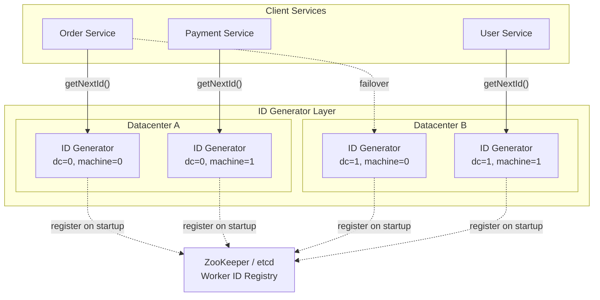
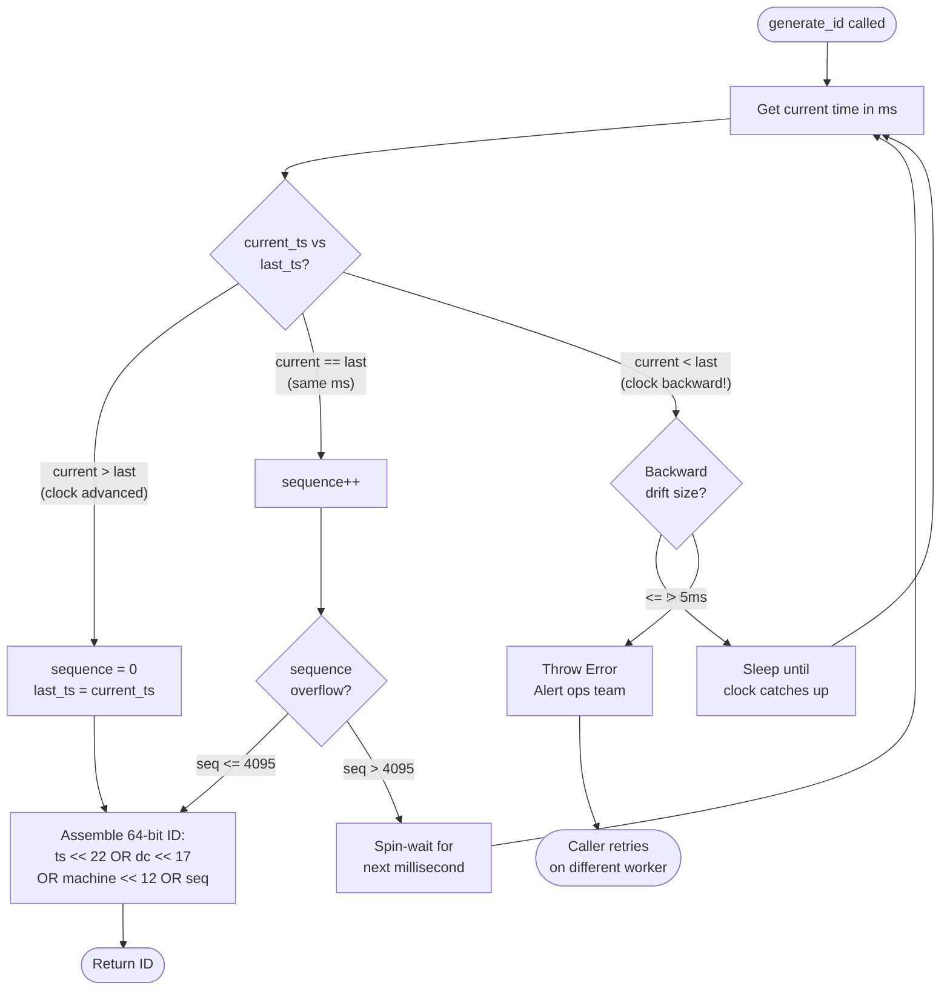

# Design a Unique ID Generator -- Interview Walkthrough

## The Prompt

> "Design a system that generates unique IDs for a large-scale distributed system."

This is a classic system design interview question. It tests your understanding of
distributed systems fundamentals, bit manipulation, clock synchronization, and
tradeoff analysis. Here is exactly how to structure your answer.

---

## Step 1: Clarify Requirements (2-3 minutes)

Ask these questions first. Never jump straight into a solution.

### Functional Requirements

| Question                                  | Typical Answer                       |
|-------------------------------------------|--------------------------------------|
| Must IDs be globally unique?              | Yes, across all servers              |
| Must IDs be sortable by time?             | Yes, roughly ordered by generation   |
| What is the ID format? Numeric or string? | Numeric (64-bit integer preferred)   |
| Must IDs be sequential (no gaps)?         | No, gaps are acceptable              |
| Can IDs be predictable?                   | Predictability is acceptable         |

### Non-Functional Requirements

| Question                                  | Typical Answer                       |
|-------------------------------------------|--------------------------------------|
| Target throughput?                        | 10,000+ IDs/sec per server           |
| Latency requirement?                      | < 1ms per ID generation              |
| Availability requirement?                 | 99.99% (no single point of failure)  |
| How many servers/datacenters?             | Multiple DCs, dozens of servers      |
| Expected system lifespan?                 | 50+ years                            |

### Summarize Back

> "So we need a system that generates globally unique, 64-bit, time-sortable IDs
> at 10K+ IDs/sec per server, with no single point of failure, supporting multiple
> datacenters, and lasting 50+ years. Correct?"

---

## Step 2: Explore Approaches (5 minutes)

Walk through the main options. This shows breadth of knowledge.

### Approach Comparison

```
 ┌─────────────────┬─────────┬──────────┬──────────────┬────────────┐
 │ Approach         │ 64-bit? │ Sortable │ Coordination │ SPOF?      │
 ├─────────────────┼─────────┼──────────┼──────────────┼────────────┤
 │ UUID v4          │ No(128) │ No       │ None         │ No         │
 │ UUID v7          │ No(128) │ Yes      │ None         │ No         │
 │ DB Auto-Incr     │ Yes     │ Yes      │ Central DB   │ YES        │
 │ Multi-Master DB  │ Yes     │ Partial  │ Per-master   │ Partial    │
 │ Flickr Ticket    │ Yes     │ Partial  │ Ticket SVR   │ Partial    │
 │ Twitter Snowflake│ Yes     │ Yes      │ None*        │ No         │
 └─────────────────┴─────────┴──────────┴──────────────┴────────────┘
  * Snowflake requires pre-assigned worker IDs, but no runtime coordination
```

### Elimination Reasoning

> "UUID v4 is 128 bits, doesn't meet the 64-bit requirement, and is not sortable.
> UUID v7 is sortable but still 128 bits. Database auto-increment creates a single
> point of failure and bottleneck. Multi-master DB with offset/step doesn't scale
> easily and IDs aren't globally sorted. Flickr Ticket Servers still have centralized
> dependencies. **Twitter Snowflake** meets all requirements: 64-bit, sortable,
> no runtime coordination, no SPOF, and massively high throughput."

---

## Step 3: High-Level Design (5 minutes)

### Architecture



### Deployment Options

**Option A: Embedded library** -- Each service embeds the Snowflake generator as a library.
No network call needed. Simplest, fastest, but each instance needs a unique worker ID.

**Option B: Dedicated ID service** -- A standalone microservice that generates IDs via RPC.
Adds a network hop but centralizes worker ID management.

> "I recommend **Option A** (embedded library) for performance-critical paths and
> **Option B** for cases where worker ID management is complex."

---

## Step 4: Deep Dive -- Snowflake Design (10-15 minutes)

### Bit Layout

```
 64-bit Snowflake ID:
 ┌───┬────────────────────────────────────────┬───────┬──────────┬────────────┐
 │ 0 │            Timestamp (41 bits)          │DC (5) │Mach (5)  │ Seq (12)   │
 └───┴────────────────────────────────────────┴───────┴──────────┴────────────┘
  63  62                                    22  21  17  16     12  11         0

 Field capacities:
  - Timestamp: 2^41 ms = ~69.7 years from custom epoch
  - Datacenter: 2^5 = 32 datacenters
  - Machine: 2^5 = 32 machines per DC (1024 total workers)
  - Sequence: 2^12 = 4096 IDs per millisecond per machine
```

### Walk Through the Fields

**Sign bit (bit 63):** Always 0. Ensures the ID is positive in languages with signed
64-bit integers (Java, Go). Avoids negative number surprises.

**Timestamp (bits 62-22):** Milliseconds since our custom epoch. We set the epoch to
our system's launch date to maximize the 69.7-year window. At the MSB position, this
makes IDs naturally increase over time -- newer IDs are always larger.

**Datacenter ID (bits 21-17):** Identifies which datacenter generated the ID. Pre-assigned
during deployment. 5 bits = 32 datacenters.

**Machine ID (bits 16-12):** Identifies which machine within a datacenter. Combined with
datacenter, gives us 1024 unique workers. Assigned via ZooKeeper, config file, or
derived from IP address.

**Sequence (bits 11-0):** Monotonically increasing counter within the same millisecond.
Resets to 0 when the clock ticks to the next millisecond. 12 bits = 4096 IDs before
we must wait for the next millisecond.

### ID Generation Flow



### Throughput Math

```
 Per machine:
   4,096 IDs/ms x 1,000 ms/sec = 4,096,000 IDs/sec

 Requirement: 10,000 IDs/sec per server
 Headroom: 4,096,000 / 10,000 = 409x headroom per machine

 Total system (32 DCs x 32 machines):
   4,096,000 x 1,024 = 4,194,304,000 IDs/sec
   = ~4.2 billion IDs per second
```

---

## Step 5: Edge Cases (5 minutes)

### Edge Case 1: Clock Goes Backward

**Cause:** NTP synchronization adjusts the system clock backward.

**Impact:** Could generate duplicate IDs (same timestamp + worker + sequence as a
previously issued ID).

**Solution:**
1. For small drifts (< 5ms): wait until the clock catches up
2. For large drifts: reject the request, log an alert, let the caller retry on another worker
3. Prevention: configure NTP to only slew (gradual adjustment), never step (instant jump)

### Edge Case 2: Machine Failure and Replacement

**Scenario:** Machine 7 in datacenter 2 crashes. A replacement comes online.

**Risk:** If the replacement gets the SAME worker ID and the clock happens to overlap
with the old machine's last timestamps, duplicates could occur.

**Solution:**
- Use ZooKeeper with ephemeral nodes -- the old machine's node disappears, the new
  machine gets a new sequence number
- Or: wait a safe interval (e.g., 1 second) before the replacement starts generating
  IDs, ensuring no timestamp overlap

### Edge Case 3: Datacenter Failover

**Scenario:** Entire datacenter goes offline. All traffic routes to another DC.

**Impact:** The surviving datacenter must handle all traffic. Does it have enough capacity?

**Solution:** Each datacenter already has independent ID space (different DC IDs). Failover
only increases throughput demand, not uniqueness risk. Ensure each DC is provisioned
for 2x normal load to absorb failover traffic.

### Edge Case 4: Sequence Overflow

**Scenario:** A single machine receives > 4096 ID requests in one millisecond.

**Solution:** Spin-wait until the next millisecond, then resume. This adds at most 1ms
of latency, which is acceptable. If this happens frequently, add more machines.

### Edge Case 5: Epoch Exhaustion

**Scenario:** 69.7 years after the epoch, timestamp bits overflow.

**Solution:** Plan for epoch migration well in advance. Options:
- Choose a new epoch and version the ID format
- Migrate to a larger ID format (128-bit)
- In practice, 69.7 years is longer than most systems survive

---

## Step 6: Extensions and Follow-ups

### Common Follow-up Questions

**Q: How would you make IDs unpredictable (for security)?**

> Snowflake IDs are predictable (timestamp leaks creation time, worker ID is guessable).
> For security-sensitive use cases, apply a bijective transform: encrypt the Snowflake ID
> with a block cipher (e.g., Format-Preserving Encryption) to produce an opaque 64-bit
> value that can be decrypted back to the original Snowflake internally.

**Q: How would you handle multi-region with eventual consistency?**

> Each region has its own datacenter ID, so IDs are guaranteed unique across regions
> without any cross-region communication. IDs from different regions will interleave
> in time order (not be strictly sequential), which is acceptable for most use cases.

**Q: What if you need more than 1024 workers?**

> Reallocate bits. For example: steal 2 bits from sequence (reduce to 10 bits = 1024/ms)
> and add them to the worker field (12 bits = 4096 workers). The bit allocation is a
> tunable tradeoff.

```
 Custom allocation for more workers:
 ┌───┬───────────────────────────────┬────────────────┬────────┐
 │ 0 │      Timestamp (41 bits)      │ Worker (12)    │Seq(10) │
 └───┴───────────────────────────────┴────────────────┴────────┘
  63  62                           22  21           10  9      0
  Workers: 4096    Sequences/ms: 1024
```

**Q: What if you need IDs to be globally sequential (no gaps, strict order)?**

> This requires coordination and sacrifices availability. Use a centralized approach
> like Flickr Ticket Servers or a Raft-based consensus protocol. Accept that throughput
> will drop to ~10K-50K IDs/sec due to network round trips.

**Q: How does this compare to UUID v7?**

> UUID v7 is conceptually similar (timestamp + random) but 128 bits. Use Snowflake when
> you need compact 64-bit IDs (e.g., database foreign keys where storage matters at scale).
> Use UUID v7 when 128 bits is acceptable and you want zero infrastructure (no worker
> ID assignment needed).

**Q: How would you test this system?**

> 1. **Unit tests:** Verify bit layout, sequence rollover, clock backward handling
> 2. **Concurrency tests:** Multiple threads generating IDs simultaneously, verify uniqueness
> 3. **Clock manipulation:** Mock the system clock going backward, verify behavior
> 4. **Load tests:** Generate IDs at max throughput, verify no duplicates in billions of IDs
> 5. **Integration tests:** Multiple workers generating simultaneously, collect all IDs,
>    verify global uniqueness

**Q: What monitoring would you add?**

> - IDs generated per second (per worker)
> - Sequence overflow events (indicates high load)
> - Clock backward events (indicates NTP issues)
> - Worker registration events (ZooKeeper)
> - ID range consumption rate (time until epoch exhaustion)

---

## Interview Answer Structure -- Template

Use this template to organize your answer during the interview:

```
 1. REQUIREMENTS                     (2-3 min)
    - Unique, 64-bit, sortable, 10K+/sec, multi-DC, 50+ year lifespan
    - Availability > consistency for ID generation

 2. HIGH-LEVEL APPROACHES            (3-5 min)
    - UUID: no coordination but 128-bit
    - DB auto-increment: simple but SPOF
    - Snowflake: 64-bit, sortable, no SPOF  <-- CHOSEN

 3. SNOWFLAKE DESIGN                 (10-15 min)
    - Bit layout: [sign 1][timestamp 41][dc 5][machine 5][seq 12]
    - Epoch selection: system launch date
    - Worker ID assignment: ZooKeeper / config
    - Sequence handling: increment within ms, wait on overflow

 4. EDGE CASES                       (5 min)
    - Clock drift: wait or reject
    - Machine failure: ZooKeeper ephemeral nodes
    - Sequence overflow: spin-wait for next ms
    - DC failover: independent ID spaces

 5. EXTENSIONS                       (if time permits)
    - Security: FPE on top of Snowflake
    - Bit reallocation for different scale requirements
    - Monitoring and alerting
```

---

## Quick Revision Cheat Sheet

```
 ╔════════════════════════════════════════════════════════════════════╗
 ║              UNIQUE ID GENERATION -- CHEAT SHEET                  ║
 ╠════════════════════════════════════════════════════════════════════╣
 ║                                                                    ║
 ║  SNOWFLAKE (64 bits):                                             ║
 ║  [0][timestamp 41][datacenter 5][machine 5][sequence 12]          ║
 ║  - 4,096 IDs/ms/machine = ~4.1M IDs/sec/machine                  ║
 ║  - 1,024 total workers (32 DC x 32 machines)                      ║
 ║  - ~69.7 years from custom epoch                                  ║
 ║  - Time-sortable (newer IDs > older IDs)                          ║
 ║  - No runtime coordination                                       ║
 ║                                                                    ║
 ║  CLOCK DRIFT: wait if small (<5ms), reject if large               ║
 ║  SEQUENCE OVERFLOW: spin-wait for next millisecond                ║
 ║  EPOCH: set to system launch date (not Unix epoch!)               ║
 ║  WORKER ID: ZooKeeper, config, or IP-derived                      ║
 ║                                                                    ║
 ╠════════════════════════════════════════════════════════════════════╣
 ║                                                                    ║
 ║  WHEN TO USE WHAT:                                                ║
 ║  - 64-bit + sortable + distributed = Snowflake                    ║
 ║  - 128-bit + sortable + zero infra = UUID v7                      ║
 ║  - 128-bit + sortable + compact string = ULID                     ║
 ║  - Simple + single DB = Auto-increment                            ║
 ║  - Simple + HA = Flickr Ticket Server                             ║
 ║  - PostgreSQL shards = Instagram approach                          ║
 ║                                                                    ║
 ╠════════════════════════════════════════════════════════════════════╣
 ║                                                                    ║
 ║  KEY NUMBERS TO REMEMBER:                                         ║
 ║  - UUID collision at 1B/sec: ~73 years to 50% chance              ║
 ║  - Snowflake: 4,096 IDs/ms = 4.1M IDs/sec per machine            ║
 ║  - 41-bit timestamp: ~69.7 years                                  ║
 ║  - 48-bit timestamp: ~8,919 years (UUID v7 / ULID)               ║
 ║  - Twitter Snowflake epoch: Nov 4, 2010                           ║
 ║  - Discord epoch: Jan 1, 2015                                     ║
 ║                                                                    ║
 ╠════════════════════════════════════════════════════════════════════╣
 ║                                                                    ║
 ║  INTERVIEW RED FLAGS (things to mention):                          ║
 ║  - Clock backward (NTP) -- always mention this!                   ║
 ║  - Why custom epoch, not Unix epoch (saves 40+ years of bits)     ║
 ║  - UUID v4 is bad for DB indexes (random = page splits)           ║
 ║  - JavaScript can't handle 64-bit ints (use string/BigInt)        ║
 ║  - Sign bit = 0 keeps ID positive in signed int64                 ║
 ║                                                                    ║
 ╚════════════════════════════════════════════════════════════════════╝
```

---

## Whiteboard Diagram (Draw This in Interview)

The minimum you should draw on the whiteboard:

```
 ┌──────────────────────────────────────────────────────────┐
 │                   Bit Layout                              │
 │  [0] [timestamp 41] [dc 5] [machine 5] [sequence 12]     │
 │   ^        ^           ^        ^            ^            │
 │   |   ms since epoch   |   machine       counter         │
 │  sign                datacenter        per ms             │
 └──────────────────────────────────────────────────────────┘

 ┌─────────────────────────────────────────────────────────┐
 │                  Architecture                            │
 │                                                          │
 │  Service A ──> [ID Gen (dc=0,m=0)] ──> ID: 12345678    │
 │  Service B ──> [ID Gen (dc=0,m=1)] ──> ID: 12345679    │
 │  Service C ──> [ID Gen (dc=1,m=0)] ──> ID: 12349999    │
 │                                                          │
 │  Each generator: independent, no communication           │
 │  Uniqueness: guaranteed by (dc + machine + timestamp)    │
 └─────────────────────────────────────────────────────────┘

 ┌─────────────────────────────────────────────────────────┐
 │              Edge Cases to Mention                       │
 │                                                          │
 │  1. Clock backward -> wait or reject                     │
 │  2. Sequence overflow -> wait for next ms                │
 │  3. Machine failure -> ZooKeeper reassignment             │
 │  4. Epoch exhaustion -> plan migration at ~60 years      │
 └─────────────────────────────────────────────────────────┘
```
