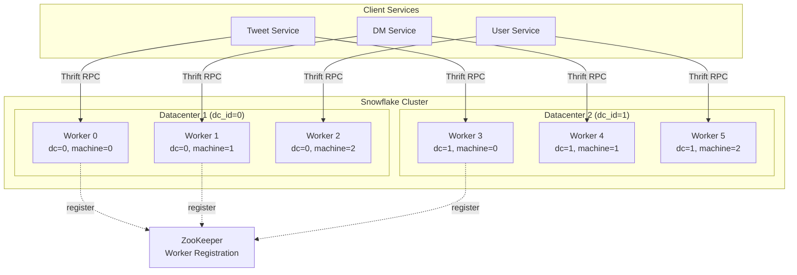

# Twitter Snowflake -- Deep Dive

## Origin Story

Twitter created Snowflake in 2010 when they migrated from MySQL to Cassandra. Cassandra
does not have auto-incrementing IDs, so Twitter needed a distributed ID generator that
could produce unique, roughly-sorted, 64-bit IDs at massive scale without coordination.

The result: a simple, elegant system that has influenced ID generation at Discord, Instagram,
Uber, Sony, and hundreds of other companies.

---

## Architecture Overview



Each Snowflake worker is a lightweight, stateless service. It maintains only three
pieces of state in memory: `datacenter_id`, `machine_id`, and `last_timestamp + sequence`.

---

## Bit Layout -- Detailed Breakdown

```
 ┌───┬────────────────────────────────────────┬───────┬──────────┬────────────┐
 │ 0 │            Timestamp (41 bits)          │DC (5) │Mach (5)  │ Seq (12)   │
 └───┴────────────────────────────────────────┴───────┴──────────┴────────────┘
  63  62                                    22  21  17  16     12  11         0

 Detailed bit positions:
 ┌─────────────────────────────────────────────────────────────────────────────┐
 │ Bit 63    : Sign bit (always 0, keeps ID positive in signed int64)         │
 │ Bits 62-22: Timestamp -- milliseconds since custom epoch (41 bits)         │
 │ Bits 21-17: Datacenter ID (5 bits = 0..31)                                 │
 │ Bits 16-12: Machine/Worker ID (5 bits = 0..31)                             │
 │ Bits 11-0 : Sequence number (12 bits = 0..4095)                            │
 └─────────────────────────────────────────────────────────────────────────────┘
```

### Why Each Field Exists

**Sign bit (1 bit):** Languages like Java use signed 64-bit longs. Keeping bit 63 as 0
ensures the ID is always positive, avoiding issues with negative number comparisons.

**Timestamp (41 bits):**
- 2^41 milliseconds = 2,199,023,255,552 ms = ~69.7 years
- Twitter chose a custom epoch of `1288834974657` (Nov 4, 2010 01:42:54 UTC)
- This means IDs are valid until approximately year 2080
- Using Unix epoch (1970) would waste 40 years of bit space

**Datacenter ID (5 bits):**
- Supports up to 32 datacenters
- Assigned statically during deployment
- Ensures no two datacenters produce overlapping IDs

**Machine ID (5 bits):**
- Supports up to 32 machines per datacenter
- Combined with datacenter: 10 bits = 1024 unique workers total
- Assigned via ZooKeeper or static configuration

**Sequence (12 bits):**
- 0-4095 per millisecond per machine
- Resets to 0 when the millisecond advances
- If exhausted within one millisecond, the worker spins until the next millisecond

---

## Epoch Selection -- Why Not Unix Epoch?

The epoch determines when your timestamp bits "start counting." Choosing wisely
is critical because every wasted millisecond burns a precious bit of range.

```
 Unix Epoch (Jan 1, 1970):
 ──────────────────────────────────
 1970 .............. 2010 ......... 2039
 │<-- 40 years WASTED -->│<-- 29 years usable -->│
                          ▲ System launched

 Custom Epoch (Nov 4, 2010):
 ──────────────────────────────────
                     2010 ......................... 2080
                     │<-------- 69.7 years usable -------->│
                     ▲ Epoch = system launch date

 SAVINGS: ~40 additional years of ID space!
```

### Epoch Examples from Real Systems

| System    | Custom Epoch                  | Epoch ms            |
|-----------|-------------------------------|---------------------|
| Twitter   | Nov 04, 2010 01:42:54 UTC     | 1288834974657       |
| Discord   | Jan 01, 2015 00:00:00 UTC     | 1420070400000       |
| Instagram | Sep 01, 2011 ~00:00:00 UTC    | 1314220021721       |

**Rule of thumb:** Set your epoch to your system's launch date (or shortly before).

---

## Clock Drift -- The Hardest Problem

NTP (Network Time Protocol) can adjust system clocks, sometimes backward. If a worker's
clock goes backward, it could generate IDs with timestamps earlier than previously issued
IDs, breaking the sortability guarantee or (worse) generating duplicate IDs.

### Scenarios

```
 Normal operation:
 Time:  100ms  101ms  102ms  103ms  104ms
 IDs:   A      B      C      D      E
 Sort:  A < B < C < D < E  (correct)

 Clock jumps backward by 2ms after generating ID C:
 Time:  100ms  101ms  102ms  100ms! 101ms! 102ms  103ms
 IDs:   A      B      C      ???
                              ▲
                              Clock went backward!
                              Could collide with A's timestamp!
```

### Handling Strategies

**Strategy 1: Reject and throw error (Twitter's approach)**

```python
if timestamp < self.last_timestamp:
    raise ClockMovedBackwardError(
        f"Clock moved backwards by {self.last_timestamp - timestamp}ms"
    )
```

Simple but harsh. The service becomes temporarily unavailable. Upstream callers must
retry on a different worker.

**Strategy 2: Wait until clock catches up**

```python
if timestamp < self.last_timestamp:
    # Clock went backward, wait for it to catch up
    while timestamp <= self.last_timestamp:
        time.sleep(0.001)  # sleep 1ms
        timestamp = current_millis()
    # Now safe to generate
```

Better availability but adds latency. Only works for small drifts (a few ms).

**Strategy 3: Tolerant window (Leaf's approach)**

```python
MAX_BACKWARD_MS = 5  # tolerate up to 5ms backward drift

if timestamp < self.last_timestamp:
    offset = self.last_timestamp - timestamp
    if offset <= MAX_BACKWARD_MS:
        # Small drift: wait it out
        time.sleep(offset / 1000.0)
        timestamp = current_millis()
    else:
        # Large drift: something is very wrong
        raise ClockMovedBackwardError(f"Clock moved backwards by {offset}ms")
```

**Strategy 4: Logical clock extension**

Instead of using wall clock time, maintain a logical timestamp that never goes backward:

```python
def get_timestamp(self):
    physical = current_millis()
    if physical > self.last_timestamp:
        return physical  # clock advanced, use it
    else:
        # Clock hasn't advanced (or went backward)
        # Use last_timestamp and rely on sequence to differentiate
        return self.last_timestamp
```

---

## Datacenter and Machine ID Assignment

### Strategy 1: Static Configuration

Each machine has its IDs baked into config files or environment variables:

```yaml
# config.yml
snowflake:
  datacenter_id: 3
  machine_id: 17
```

**Pros:** Simple, no runtime dependencies.
**Cons:** Manual management, risk of misconfiguration (duplicate assignments).

### Strategy 2: ZooKeeper Sequential Nodes

```
 ZooKeeper node tree:
 /snowflake/
 ├── workers/
 │   ├── worker-0000000000  (data: "10.0.1.5:9090")
 │   ├── worker-0000000001  (data: "10.0.1.6:9090")
 │   ├── worker-0000000002  (data: "10.0.2.3:9090")
 │   └── worker-0000000003  (data: "10.0.2.4:9090")
```

Each worker creates an ephemeral sequential node. The sequence number becomes the worker ID.
Ephemeral nodes auto-delete when the worker disconnects, freeing the ID.

**Problem:** If a worker reconnects, it gets a NEW sequence number, potentially exceeding
the 10-bit limit (1024 workers). Solution: use persistent nodes and clean up stale ones.

### Strategy 3: IP/MAC-Based Derivation

```python
import socket
import struct

def derive_worker_id():
    """Derive a 10-bit worker ID from the machine's IP address."""
    ip = socket.gethostbyname(socket.gethostname())
    ip_int = struct.unpack("!I", socket.inet_aton(ip))[0]
    return ip_int & 0x3FF  # lower 10 bits
```

**Risk:** IP collisions in the lower 10 bits. Works if your IP allocation is carefully planned.

### Strategy 4: Database Registry

```sql
CREATE TABLE snowflake_workers (
    worker_id INT PRIMARY KEY,
    hostname VARCHAR(255),
    last_heartbeat TIMESTAMP,
    UNIQUE (hostname)
);

-- On startup:
INSERT INTO snowflake_workers (worker_id, hostname, last_heartbeat)
SELECT COALESCE(MAX(worker_id), -1) + 1, 'host-abc', NOW()
FROM snowflake_workers;
```

---

## Sequence Number Overflow

When a single machine generates more than 4096 IDs in one millisecond:

```python
if timestamp == self.last_timestamp:
    self.sequence = (self.sequence + 1) & 0xFFF  # 12-bit mask
    if self.sequence == 0:
        # Overflowed! All 4096 sequences used in this millisecond.
        # Must wait for the next millisecond.
        timestamp = self._wait_for_next_millis(self.last_timestamp)
else:
    self.sequence = 0  # new millisecond, reset
```

```
 Sequence overflow timeline:
 ┌─────────────────────────────────────────────────────────────────┐
 │ ms=1000: seq=0, 1, 2, ... 4094, 4095 -- FULL!                 │
 │          spin-wait...                                          │
 │ ms=1001: seq=0  -- resume generating                           │
 └─────────────────────────────────────────────────────────────────┘
```

At 4096 IDs/ms, overflow happens when sustained throughput exceeds ~4.1 million IDs/sec
on a single machine. This is rarely a problem in practice.

---

## Full Working Implementation (Python)

```python
"""
Complete Snowflake ID generator with all edge cases handled.
Thread-safe, production-ready reference implementation.
"""
import time
import threading
from dataclasses import dataclass
from typing import Optional


@dataclass
class SnowflakeConfig:
    """Configuration for the Snowflake generator."""
    epoch: int = 1288834974657          # Twitter epoch (ms)
    datacenter_bits: int = 5
    machine_bits: int = 5
    sequence_bits: int = 12
    max_clock_backward_ms: int = 5      # tolerated backward drift


class SnowflakeGenerator:
    def __init__(self, datacenter_id: int, machine_id: int,
                 config: Optional[SnowflakeConfig] = None):
        self.config = config or SnowflakeConfig()

        # Validate IDs
        max_dc = (1 << self.config.datacenter_bits) - 1
        max_machine = (1 << self.config.machine_bits) - 1
        if not (0 <= datacenter_id <= max_dc):
            raise ValueError(f"datacenter_id must be 0..{max_dc}, got {datacenter_id}")
        if not (0 <= machine_id <= max_machine):
            raise ValueError(f"machine_id must be 0..{max_machine}, got {machine_id}")

        self.datacenter_id = datacenter_id
        self.machine_id = machine_id

        # Precompute shifts and masks
        self._seq_mask = (1 << self.config.sequence_bits) - 1
        self._machine_shift = self.config.sequence_bits
        self._dc_shift = self.config.sequence_bits + self.config.machine_bits
        self._ts_shift = (self.config.sequence_bits +
                          self.config.machine_bits +
                          self.config.datacenter_bits)
        self._max_ts = (1 << 41) - 1

        # Mutable state (protected by lock)
        self._lock = threading.Lock()
        self._last_timestamp: int = -1
        self._sequence: int = 0

        # Stats
        self._ids_generated: int = 0
        self._clock_waits: int = 0

    @staticmethod
    def _current_millis() -> int:
        return int(time.time() * 1000)

    def _wait_next_millis(self, last_ts: int) -> int:
        """Spin-wait until the clock advances past last_ts."""
        ts = self._current_millis()
        while ts <= last_ts:
            ts = self._current_millis()
        self._clock_waits += 1
        return ts

    def generate(self) -> int:
        """Generate the next unique Snowflake ID. Thread-safe."""
        with self._lock:
            timestamp = self._current_millis()

            # --- Handle clock going backward ---
            if timestamp < self._last_timestamp:
                backward = self._last_timestamp - timestamp
                if backward <= self.config.max_clock_backward_ms:
                    # Small drift: wait for clock to catch up
                    time.sleep(backward / 1000.0)
                    timestamp = self._current_millis()
                    if timestamp < self._last_timestamp:
                        raise RuntimeError(
                            f"Clock still behind after waiting. "
                            f"Backward by {self._last_timestamp - timestamp}ms"
                        )
                else:
                    raise RuntimeError(
                        f"Clock moved backwards by {backward}ms "
                        f"(exceeds tolerance of {self.config.max_clock_backward_ms}ms)"
                    )

            # --- Same millisecond: increment sequence ---
            if timestamp == self._last_timestamp:
                self._sequence = (self._sequence + 1) & self._seq_mask
                if self._sequence == 0:
                    # Sequence exhausted for this millisecond
                    timestamp = self._wait_next_millis(self._last_timestamp)
            else:
                # New millisecond: reset sequence
                self._sequence = 0

            self._last_timestamp = timestamp

            # --- Check timestamp overflow ---
            ts_offset = timestamp - self.config.epoch
            if ts_offset > self._max_ts:
                raise OverflowError(
                    f"Timestamp overflow: {ts_offset} exceeds 41-bit max. "
                    f"Time to choose a new epoch!"
                )
            if ts_offset < 0:
                raise ValueError(
                    f"Current time {timestamp}ms is before epoch {self.config.epoch}ms"
                )

            # --- Assemble the 64-bit ID ---
            snowflake_id = (
                (ts_offset << self._ts_shift) |
                (self.datacenter_id << self._dc_shift) |
                (self.machine_id << self._machine_shift) |
                self._sequence
            )

            self._ids_generated += 1
            return snowflake_id

    def generate_batch(self, count: int) -> list[int]:
        """Generate multiple IDs. More efficient than calling generate() in a loop."""
        return [self.generate() for _ in range(count)]

    def stats(self) -> dict:
        return {
            "ids_generated": self._ids_generated,
            "clock_waits": self._clock_waits,
            "last_timestamp": self._last_timestamp,
            "current_sequence": self._sequence,
        }


def parse_snowflake_id(snowflake_id: int,
                       epoch: int = 1288834974657) -> dict:
    """
    Decompose a Snowflake ID back into its constituent fields.

    >>> parse_snowflake_id(1541815603606036480)
    {
        'timestamp_ms': ...,
        'datetime_utc': '2022-06-28T...',
        'datacenter_id': ...,
        'machine_id': ...,
        'sequence': ...,
        'binary': '0001010101...'
    }
    """
    from datetime import datetime, timezone

    ts_offset = (snowflake_id >> 22) & 0x1FFFFFFFFFF  # 41 bits
    datacenter = (snowflake_id >> 17) & 0x1F            # 5 bits
    machine = (snowflake_id >> 12) & 0x1F               # 5 bits
    sequence = snowflake_id & 0xFFF                     # 12 bits

    timestamp_ms = ts_offset + epoch
    dt = datetime.fromtimestamp(timestamp_ms / 1000, tz=timezone.utc)

    return {
        "id": snowflake_id,
        "binary": format(snowflake_id, '064b'),
        "timestamp_ms": timestamp_ms,
        "datetime_utc": dt.strftime('%Y-%m-%d %H:%M:%S.%f UTC'),
        "datacenter_id": datacenter,
        "machine_id": machine,
        "sequence": sequence,
    }


# ----- Example Usage -----
if __name__ == "__main__":
    gen = SnowflakeGenerator(datacenter_id=1, machine_id=5)

    # Generate 10 IDs
    ids = gen.generate_batch(10)
    for sid in ids:
        parsed = parse_snowflake_id(sid)
        print(f"ID: {sid:>20}  |  seq={parsed['sequence']:>4}  |  {parsed['datetime_utc']}")

    print(f"\nStats: {gen.stats()}")
```

---

## Throughput Calculation

```
 Per-machine capacity:
 ┌──────────────────────────────────────────────────────────────────┐
 │ 4,096 sequences/ms x 1,000 ms/sec = 4,096,000 IDs/sec/machine  │
 └──────────────────────────────────────────────────────────────────┘

 Per-datacenter capacity (32 machines):
 ┌──────────────────────────────────────────────────────────────────┐
 │ 4,096,000 x 32 = 131,072,000 IDs/sec/datacenter               │
 └──────────────────────────────────────────────────────────────────┘

 Total system capacity (32 datacenters):
 ┌──────────────────────────────────────────────────────────────────┐
 │ 131,072,000 x 32 = 4,194,304,000 IDs/sec (~4.2 billion/sec)   │
 └──────────────────────────────────────────────────────────────────┘

 Comparison with requirements:
 ┌──────────────────────────────────────────────────────────────────┐
 │ Twitter peak tweets:     ~15,000/sec                            │
 │ Single Snowflake worker: ~4,096,000/sec                         │
 │ Headroom factor:         ~273x                                  │
 │                                                                  │
 │ Even a single worker can handle Twitter's peak tweet rate       │
 │ with 99.97% capacity to spare.                                  │
 └──────────────────────────────────────────────────────────────────┘
```

---

## Extracting Timestamp from a Snowflake ID

One powerful property: you can extract the creation time from any Snowflake ID
without querying a database. This is invaluable for debugging and analytics.

```python
def snowflake_to_datetime(snowflake_id: int, epoch_ms: int = 1288834974657):
    """Convert a Snowflake ID to a datetime."""
    from datetime import datetime, timezone
    timestamp_ms = (snowflake_id >> 22) + epoch_ms
    return datetime.fromtimestamp(timestamp_ms / 1000, tz=timezone.utc)

# Example: Twitter tweet ID
tweet_id = 1541815603606036480
print(snowflake_to_datetime(tweet_id))
# Output: 2022-06-28 18:20:48.xxx UTC
```

### Discord's Timestamp Extraction

Discord uses a different epoch (Jan 1, 2015):

```python
DISCORD_EPOCH = 1420070400000

def discord_snowflake_to_datetime(snowflake_id: int):
    from datetime import datetime, timezone
    timestamp_ms = (snowflake_id >> 22) + DISCORD_EPOCH
    return datetime.fromtimestamp(timestamp_ms / 1000, tz=timezone.utc)
```

---

## Real-World Variants

### Discord's Modified Snowflake

```
 Discord Snowflake (64 bits)
 ┌──────────────────────────────────────────────────────────────────────┐
 │       Timestamp (42 bits)        │ Worker (5) │ Process(5)│ Seq(12) │
 ├──────────────────────────────────┼────────────┼───────────┼─────────┤
 │  ms since Jan 1, 2015            │  Worker ID │ Process ID│ 0-4095  │
 └──────────────────────────────────┴────────────┴───────────┴─────────┘
```

**Key difference:** Discord uses "worker" and "process" instead of "datacenter" and "machine".
This maps better to their Erlang-based architecture where a single machine runs
multiple processes.

Discord also stores Snowflake IDs as **strings** in their API (JavaScript cannot handle
64-bit integers without losing precision due to IEEE 754 double limitations: Number.MAX_SAFE_INTEGER = 2^53 - 1).

### Instagram's PostgreSQL Variant

```
 Instagram (64 bits)
 ┌──────────────────────────────────────────────────────────────────────┐
 │        Timestamp (41 bits)         │  Shard ID (13) │ Sequence (10) │
 ├────────────────────────────────────┼────────────────┼───────────────┤
 │  ms since Sep 1, 2011              │  Logical shard │ Auto-incr     │
 └────────────────────────────────────┴────────────────┴───────────────┘
```

**Key difference:** 13-bit shard ID (8192 shards) instead of 10-bit worker.
10-bit sequence (1024/ms) instead of 12-bit (4096/ms). Implemented as a PostgreSQL
stored procedure, not a standalone service.

### Uber's Approach

Uber uses a modified Snowflake where the bit allocation is tuned for their ride-matching
infrastructure. They prioritize datacenter awareness because ride data must be processed
in the geographically nearest datacenter.

### Sony's Sonyflake

```
 Sonyflake (64 bits)
 ┌──────────────────────────────────────────────────────────────────────┐
 │       Timestamp (39 bits)          │ Sequence (8) │ Machine (16)    │
 ├────────────────────────────────────┼──────────────┼─────────────────┤
 │  10ms units since custom epoch     │   0-255      │  0-65535        │
 │  (~174 years at 10ms resolution)   │              │  (IP-derived)   │
 └────────────────────────────────────┴──────────────┴─────────────────┘
```

**Key differences from Twitter Snowflake:**
- 10ms resolution (not 1ms) -- trades precision for longer lifespan (174 years)
- 16-bit machine ID (65536 machines) -- derived from private IP address
- Only 8-bit sequence (256/10ms = 25,600/sec) -- lower throughput per machine
- No datacenter field -- machine ID is globally unique

---

## Common Pitfalls

### 1. JavaScript Number Precision

```javascript
// DANGER: JavaScript loses precision on large 64-bit integers
const id = 1541815603606036480;
console.log(id);  // 1541815603606036500  <-- WRONG! Last digits corrupted

// SOLUTION: Use BigInt or transmit as string
const idBigInt = 1541815603606036480n;  // BigInt literal
const idString = "1541815603606036480";  // String representation
```

### 2. NTP Adjustments

NTP can make "slew" adjustments (gradual, safe) or "step" adjustments (instant, dangerous).
A step adjustment backward is the most dangerous scenario for Snowflake generators.

**Mitigation:** Configure NTP to only slew (never step) after initial sync:
```
# /etc/ntp.conf
tinker panic 0    # don't panic on large offsets
```

### 3. Virtual Machine Clock Issues

VMs often have poor clock resolution and can experience large time jumps when the
hypervisor migrates or snapshots the VM. Cloud instances (EC2, GCP) generally handle
this well with hardware clocks, but be aware in on-premise virtualized environments.

### 4. Predictability

Snowflake IDs leak information:
- **Timestamp:** When the entity was created
- **Worker ID:** Which server generated it
- **Sequence:** Approximate generation rate

This is usually acceptable, but consider it for security-sensitive applications.
If you need unpredictable IDs, hash the Snowflake output or use UUID v4.

---

## Summary Cheat Sheet

```
 Snowflake Quick Reference
 ═══════════════════════════════════════════════════════════════
 Total bits:     64 (fits in a long/int64)
 Layout:         [0][timestamp 41][datacenter 5][machine 5][sequence 12]
 Epoch:          Custom (Twitter: Nov 4, 2010)
 Lifespan:       ~69.7 years from epoch
 IDs/ms/machine: 4,096
 Total workers:  1,024 (32 DCs x 32 machines)
 Max throughput:  ~4.2 billion IDs/sec (all workers)
 Sortable:       Yes (roughly chronological)
 Coordination:   None at runtime
 Clock drift:    Must handle (reject, wait, or tolerate small drift)
 ═══════════════════════════════════════════════════════════════
```
