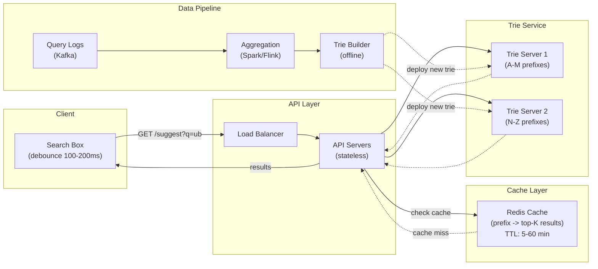

# Autocomplete and Typeahead

## Why Autocomplete Matters

Autocomplete (typeahead) suggests completions as a user types, typically before they finish their query. It is one of the most latency-sensitive features in any application -- users expect suggestions to appear within **100ms** of each keystroke, otherwise the experience feels sluggish and unusable.

Every major search product has it: Google Search, Amazon product search, Uber location search, Spotify song search, GitHub code search.

---

## Trie (Prefix Tree)

### What Is a Trie?

A trie is a tree-based data structure where each node represents a single character. Paths from root to leaf (or marked nodes) form complete words. The key property: **all words with the same prefix share the same path from the root**.

### How It Works

- Each node stores a character and pointers to child nodes
- A boolean flag marks whether a node represents the end of a valid word
- To search for a prefix, follow the path character by character from the root
- To get all completions, find the prefix node, then collect all words in its subtree

### ASCII Diagram: Trie with Words

Words: "uber", "uber eats", "united", "unix", "upload"

```
                          (root)
                         /      \
                       u          (other letters...)
                      /
                    /
                   *
                 / | \
                b  n  p
               /   |   \
              e    i    l
             /    / \    \
            r    t   x    o
           /     |   |     \
         [*]    e   [*]    a
         /      |          |
        ' '   d [*]       d
        |                  |
        e                 [*]
        |
        a
        |
        t
        |
        s
       [*]

[*] = end of valid word

Paths:
  root -> u -> b -> e -> r                     = "uber"
  root -> u -> b -> e -> r -> ' ' -> e -> ... = "uber eats"
  root -> u -> n -> i -> t -> e -> d           = "united"
  root -> u -> n -> i -> x                     = "unix"
  root -> u -> p -> l -> o -> a -> d           = "upload"
```

### Trie Operations and Complexity

```
Operation       Time Complexity    Space Complexity
──────────────  ─────────────────  ────────────────
Insert word     O(L)               O(L) new nodes worst case
Search word     O(L)               O(1)
Search prefix   O(L)               O(1) to find prefix node
Get all         O(L + K)           O(K) to collect results
completions     where K = total chars in all completions

L = length of the word/prefix
```

### Implementation: Basic Trie in Python

```python
class TrieNode:
    def __init__(self):
        self.children = {}        # char -> TrieNode
        self.is_end = False       # marks complete word
        self.frequency = 0        # search popularity score
        self.top_k = []           # pre-computed top-K completions

class Trie:
    def __init__(self):
        self.root = TrieNode()

    def insert(self, word, frequency=1):
        """Insert a word with its popularity frequency."""
        node = self.root
        for char in word:
            if char not in node.children:
                node.children[char] = TrieNode()
            node = node.children[char]
        node.is_end = True
        node.frequency = frequency

    def search_prefix(self, prefix):
        """Find the node where this prefix ends. Returns None if prefix not found."""
        node = self.root
        for char in prefix:
            if char not in node.children:
                return None
            node = node.children[char]
        return node

    def get_completions(self, prefix, limit=10):
        """Return all words starting with prefix, sorted by frequency."""
        prefix_node = self.search_prefix(prefix)
        if prefix_node is None:
            return []
        results = []
        self._dfs(prefix_node, prefix, results)
        results.sort(key=lambda x: -x[1])  # sort by frequency descending
        return [word for word, freq in results[:limit]]

    def _dfs(self, node, current_word, results):
        """Depth-first search to collect all words from this node."""
        if node.is_end:
            results.append((current_word, node.frequency))
        for char, child in node.children.items():
            self._dfs(child, current_word + char, results)


# Usage
trie = Trie()
trie.insert("uber", frequency=10000)
trie.insert("uber eats", frequency=8000)
trie.insert("uber freight", frequency=2000)
trie.insert("united airlines", frequency=5000)
trie.insert("unix commands", frequency=3000)
trie.insert("upload file", frequency=1500)

print(trie.get_completions("ub"))
# ['uber', 'uber eats', 'uber freight']

print(trie.get_completions("uni"))
# ['united airlines', 'unix commands']
```

---

## Space Optimization: Compressed Trie (Radix Tree)

### The Problem with Standard Tries

A standard trie creates one node per character. Long words with unique suffixes waste space on chains of single-child nodes.

### Radix Tree: Merge Single-Child Chains

```
Standard Trie for "uber", "uber eats", "upload":

  (root) -> u -> b -> e -> r -> [*] -> ' ' -> e -> a -> t -> s -> [*]
                  \
                   p -> l -> o -> a -> d -> [*]

Radix Tree (compressed):

  (root) -> u ─┬─ "ber" ─[*]─ " eats" ─[*]
               │
               └─ "pload" ─[*]

Savings: 16 nodes reduced to 6 nodes
```

### Radix Tree Internals

```
Radix Tree Node:
┌──────────────────────────────────────────┐
│ edge_label: "ber"                        │  (can be multi-character)
│ is_end: true                             │
│ frequency: 10000                         │
│ children: {                              │
│   " ": Node(edge=" eats", is_end=true)   │
│ }                                        │
└──────────────────────────────────────────┘

Key difference from trie:
  - Trie node: single character, many children
  - Radix node: multi-character edge label, fewer children
  - Radix splits edges when a new word shares only part of an edge
```

### When Radix Trees Split

```
Existing: "upload"    edge: (root) -"upload"-> [*]

Insert "uber":
  "upload" and "uber" share prefix "u" but diverge at position 1.

  Split:
  (root) -> "u" ──┬── "pload" -> [*]
                   └── "ber"   -> [*]
```

---

## Ranking: Top-K Suggestions

### The Naive Approach (Too Slow)

Find the prefix node, DFS to collect ALL completions, sort by score, return top K.

Problem: If "u" has 1 million completions, collecting and sorting all of them on every keystroke is too slow.

### Pre-Computed Top-K at Each Node

Store the top-K results at every node in the trie, pre-computed during build time.

```
Pre-computed Top-K (K=3) at each node:
======================================

Node for "u":
  top_3: [("uber", 10000), ("uber eats", 8000), ("united airlines", 5000)]

Node for "ub":
  top_3: [("uber", 10000), ("uber eats", 8000), ("uber freight", 2000)]

Node for "ube":
  top_3: [("uber", 10000), ("uber eats", 8000), ("uber freight", 2000)]

Node for "uber":
  top_3: [("uber", 10000), ("uber eats", 8000), ("uber freight", 2000)]
```

**Lookup**: Traverse to the prefix node (O(prefix length)), then return the pre-stored top-K -- O(1).

**Trade-off**: More memory (storing K results at every node) for faster query time.

### Scoring Formula

```
Score = w1 * popularity + w2 * recency + w3 * personalization + w4 * trending

Where:
  popularity     = total query count (all time)
  recency        = time-decayed query count (recent queries weighted higher)
  personalization = user-specific boost (if user searched this before)
  trending       = velocity of query count increase

Example weights:
  Score = 0.4 * log(total_count) + 0.3 * recent_count_7d + 0.2 * user_searched + 0.1 * trend_score
```

---

## System Design: Typeahead Service

### Architecture



### Request Flow

```
1. User types "ub" in search box
2. Client debounces (waits 100-200ms for more typing)
3. Client sends: GET /api/suggest?q=ub&limit=10
4. API server checks Redis cache for key "suggest:ub"
   - Cache HIT: return cached results immediately (~1ms)
   - Cache MISS: query trie service
5. Trie service looks up prefix "ub", returns pre-computed top-10
6. API caches result in Redis with TTL (5-60 minutes)
7. API returns JSON response to client

Total latency budget: < 100ms
  - Network (client -> API): ~20ms
  - Cache lookup: ~1ms
  - Trie lookup (on miss): ~5ms
  - Network (API -> client): ~20ms
  - Rendering: ~10ms
  - Buffer: ~44ms
```

### Data Collection Pipeline

```
How suggestions are ranked:
============================

1. COLLECT: Every search query is logged to Kafka
   {user_id: "u123", query: "uber airport ride", timestamp: "2024-03-15T10:30:00Z"}

2. AGGREGATE: Spark job runs every 1-4 hours
   - Count queries: "uber" appeared 50,000 times this week
   - Compute recency-weighted scores
   - Filter offensive/spam queries
   - Merge with editorial curated suggestions

3. BUILD: Generate new trie from aggregated data
   - Top 10M most popular prefixes with their top-K completions
   - Serialize trie to binary format

4. DEPLOY: Ship new trie to trie servers
   - Blue/green deployment (build new trie, swap atomically)
   - Or: trie servers poll for new versions every N minutes
```

### Trie Update Strategy

```
Offline Rebuild (simpler, batch):
  - Rebuild entire trie every 1-4 hours
  - Deploy via blue/green: new trie built, swap when ready
  - Pro: Simple, consistent
  - Con: Trending queries take hours to appear

Online Update (complex, real-time):
  - Stream query counts via Kafka -> trie server
  - Trie server updates counts and re-sorts top-K in place
  - Pro: Near real-time trending suggestions
  - Con: Complex, consistency challenges across replicas

Hybrid (production recommendation):
  - Batch rebuild every few hours (base trie)
  - Small real-time overlay for trending queries
  - Merge overlay with base trie on read
```

### Personalization

```
Personalization Layer:
======================

Global trie:      "ub" -> ["uber", "uber eats", "ubuntu"]
User history:     user_123 recently searched "uber freight" 5 times

Personalized result for user_123:
  "ub" -> ["uber freight",   <-- boosted by personal history
           "uber",
           "uber eats",
           "ubuntu"]

Implementation options:

1. Client-side overlay (simple):
   - Store recent searches in browser localStorage
   - Mix into autocomplete results client-side
   - Pro: No server state per user
   - Con: Lost on device switch

2. Server-side user model (rich):
   - Store per-user search history in Redis/DynamoDB
   - Merge user history with global suggestions at query time
   - Pro: Cross-device, richer signals
   - Con: Storage for millions of users
```

---

## Multi-Language Support

### Unicode and CJK Challenges

```
English: Words separated by spaces -> easy tokenization
  "uber ride sharing" -> ["uber", "ride", "sharing"]

Chinese/Japanese/Korean (CJK): No spaces between words!
  "共享出行服务" -> needs dictionary-based or ML segmentation
  Possible: ["共享", "出行", "服务"] = ["sharing", "travel", "service"]

Arabic/Hebrew: Right-to-left, characters change form based on position

Thai: No spaces, no punctuation, complex rules

Solutions:
  - ICU tokenizer (Unicode-aware segmentation)
  - Language-specific tokenizers (e.g., kuromoji for Japanese)
  - Per-language tries (one trie per language)
  - Transliteration support: user types in Latin script,
    matches non-Latin results
```

### Multi-Language Trie Architecture

```
Language Router:
  1. Detect input language (script detection + user locale)
  2. Route to appropriate trie
  3. Optionally query multiple tries and merge results

  User types: "tok"
    -> English trie: "tokyo tower", "token", "tokens"
    -> Japanese trie (romanized): "tokyo", "tokaido"
    -> Merge and rank by relevance to user's locale
```

---

## Fuzzy Matching: Handling Typos

### The Problem

Users make typos constantly. If your autocomplete is purely prefix-based, "ubr" returns nothing instead of suggesting "uber".

### Edit Distance Approach

```
User types "ubr" (missing 'e')

1. For each known word, compute Levenshtein distance to "ubr":
   "uber"    -> distance 1 (insert 'e')
   "uber eats" -> distance 1 (at prefix level)
   "ubuntu"  -> distance 2

2. Return words within edit distance 1-2, ranked by:
   score = popularity / (1 + edit_distance)

Problem: Computing edit distance against millions of words is too slow.
```

### BK-Tree for Fuzzy Lookup

```
BK-Tree: A tree where nodes are words, and edges are labeled
         with edit distances. Enables pruning impossible branches.

Structure:
                   "uber" (root)
                  /    |     \
           d=1  /  d=2 |  d=3 \
              /        |        \
          "user"    "upper"   "under"
          /    \       |
    d=1  /  d=2 \   d=1 |
        /        \      |
    "uses"    "user1" "upper"

Fuzzy search for "ubr" with max distance 1:
  - Start at root "uber", distance("ubr","uber") = 1 <= 1 -> MATCH
  - Check children with edge label in range [1-1, 1+1] = [0, 2]
  - Prune branches outside this range
  - Much faster than brute force
```

### Practical Fuzzy Matching for Autocomplete

```
Production approach (used by Google, Elasticsearch):
====================================================

1. N-gram index: Index all 2-grams and 3-grams for every word
   "uber" -> {"ub", "be", "er", "ube", "ber"}
   "ubr"  -> {"ub", "br", "ubr"}

2. Query: Find words sharing the most n-grams with the input
   "ubr" shares "ub" with "uber" -> candidate!

3. Verify: Compute actual edit distance only for candidates
   This reduces distance computations from millions to hundreds.

4. Combine with prefix matching:
   - First: return exact prefix matches (highest confidence)
   - Then: return fuzzy matches (lower confidence, visually distinct)

   User types "ubr":
   Exact prefix: (none)
   Fuzzy (edit distance 1):
     "uber"       (insert 'e')
     "uber eats"  (insert 'e')
```

---

## Latency Optimization Techniques

### Client-Side Optimizations

```
1. Debouncing: Don't send a request on EVERY keystroke.
   Wait 100-200ms after the user stops typing.
   
   Typing "uber":
   Without debounce: 4 requests (u, ub, ube, uber)
   With debounce:    1 request  (uber)  -- 75% reduction!

2. Request cancellation: If user types another character before
   the previous response arrives, cancel the old request.
   
   AbortController in JavaScript:
   const controller = new AbortController();
   fetch('/suggest?q=ub', { signal: controller.signal });
   // User types 'e' -> cancel previous
   controller.abort();
   fetch('/suggest?q=ube', { signal: controller.signal });

3. Local cache: Cache recent prefix->results in memory.
   If user types "u", "ub", "ube", "uber", "ube" (backspace):
   "ube" result is already cached from earlier -- no network call.

4. Optimistic rendering: Show results immediately from local cache
   while fetching fresh results in background.
```

### Server-Side Optimizations

```
1. Redis cache with prefix keys:
   Key: "suggest:ub"  -> Value: ["uber", "uber eats", ...]
   TTL: 5 minutes (popular prefixes always warm)
   
   Cache hit rate for top prefixes: > 95%

2. Trie sharding by prefix range:
   Server 1: a-m prefixes (half the trie)
   Server 2: n-z prefixes (other half)
   
   Consistent hashing for better distribution.

3. Pre-warming: Load most popular prefixes into cache on deploy.
   Top 10,000 prefixes cover 80%+ of queries.

4. Connection pooling: Keep persistent connections between
   API servers and trie servers (avoid TCP handshake per request).

5. Protocol: Use gRPC between services (binary, faster than HTTP/JSON)
   for internal service-to-service calls.
```

---

## Real-World Autocomplete Systems

### Google Search

```
Scale: ~8.5 billion searches/day, 15% are new (never seen before)
Features:
  - Real-time trending suggestions (sports scores, breaking news)
  - Personalized (your search history, location)
  - Multi-language with transliteration
  - Handles 100ms latency budget globally
  - Predictions update as you type (not just completions, but full queries)
  - "People also search for" post-search suggestions
Architecture (estimated):
  - Massive distributed trie sharded across data centers
  - Per-region caching layers
  - Real-time streaming pipeline for trending queries
  - Offensive query filtering via ML classifiers
```

### Amazon Product Search

```
Scale: 350M+ products, billions of searches/month
Features:
  - Category-aware: "iphone" -> suggests "iphone 15", "iphone case", "iphone charger"
  - Structured suggestions: product name + category + price
  - Spell correction inline ("iphon" -> "iphone")
  - Visual suggestions (show product thumbnail alongside text)
Architecture:
  - Product catalog indexed into tries per category
  - Aggregated query logs for popularity
  - A/B testing on suggestion ranking (directly impacts revenue)
```

### Uber Location Search

```
Scale: Millions of ride requests/day, each starting with location autocomplete
Features:
  - Geo-aware: suggestions based on user's current location
  - Combines: saved places + recent destinations + popular places + address search
  - Fuzzy matching for address typos
  - Supports 70+ countries with local address formats
Architecture:
  - Google Maps / Mapbox API for address geocoding
  - User-specific trie overlay (recent + saved places)
  - Geo-filtered ranking: nearby places ranked higher
  - Pre-cached popular destinations per city
```

---

## Interview Questions and Answers

### Q: Design an autocomplete system for a search engine with 1 billion queries/day.

```
Key decisions:

1. STORAGE: Compressed trie (radix tree) with pre-computed top-K at each node
   - Top 50M unique prefixes (up to 20 characters each)
   - ~10-50 GB per trie server (fits in memory)

2. ARCHITECTURE:
   - Client -> CDN (cache popular prefixes at edge) -> API -> Redis -> Trie servers
   - Trie sharded by prefix range across 10-20 servers
   - Each shard replicated 3x for availability

3. DATA PIPELINE:
   - Kafka ingests query logs
   - Spark aggregates hourly: query -> count, with recency weighting
   - Trie builder creates new trie, deploys via blue/green

4. LATENCY:
   - Target: < 100ms end-to-end
   - CDN cache hit: ~10ms
   - Redis cache hit: ~20ms
   - Trie lookup (cache miss): ~50ms

5. SCALING:
   - Reads: Add trie replicas (10 replicas per shard = 100-200 servers)
   - Writes: Batch rebuild, not per-query updates
   - Storage: Prune long-tail prefixes (keep top 50M by query volume)
```

### Q: How do you handle trending queries in real-time?

```
Two-tier architecture:

Base trie (rebuilt every 4 hours):
  - Stable, covers 99% of queries
  - Pre-computed top-K based on historical popularity

Trending overlay (updated every 5-15 minutes):
  - Small trie with only trending queries
  - Fed by real-time Flink job monitoring query velocity
  - Detection: query count in last 15 min >> average for this hour
  - Merge at query time: trending results boosted above base results

Example:
  Normal day: "uber" -> ["uber app", "uber eats", "uber stock"]
  Super Bowl: "uber" -> ["uber super bowl ad", "uber app", "uber eats"]
              (trending overlay injects "uber super bowl ad")
```

### Q: How do you prevent offensive suggestions?

```
Multi-layer filtering:

1. Blocklist: Maintain a list of banned terms/phrases.
   Checked at both indexing time and query time.

2. ML classifier: Train a model on labeled offensive/safe queries.
   Run on all candidates before adding to trie.

3. Human review: Flag borderline cases for manual review.
   Especially important for new trending queries.

4. Rate limiting: If a query suddenly spikes (possible coordinated
   manipulation), hold it for review before promoting to suggestions.

5. Demographic sensitivity: Some queries are fine in isolation but
   offensive when suggested for certain prefixes. Context-aware filtering.
```
