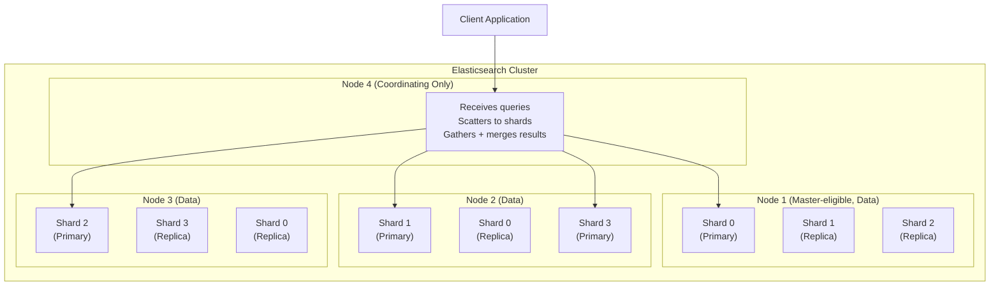
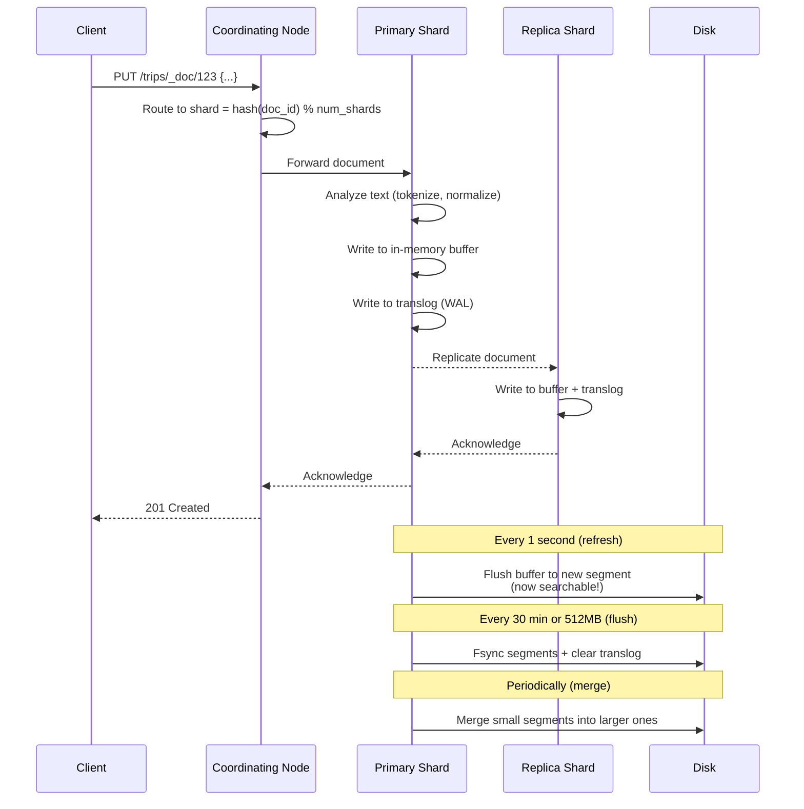
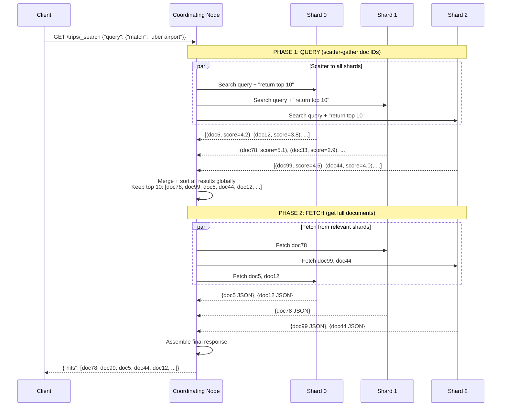
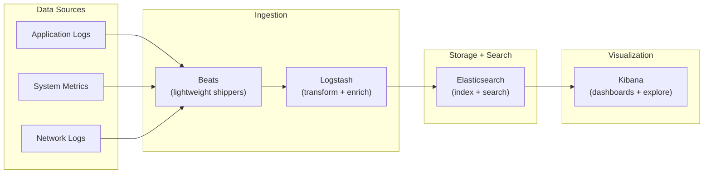

# Elasticsearch

## What Is Elasticsearch?

Elasticsearch is an **open-source, distributed search and analytics engine** built on top of Apache Lucene. It provides a REST API for indexing, searching, and analyzing large volumes of data in near real-time.

**Core identity**: Lucene handles the low-level indexing and search. Elasticsearch adds distribution, replication, REST APIs, schema management, aggregations, and operational tooling on top.

**Why it matters**: Elasticsearch is the dominant search engine in the industry. If you are building search, log analytics, or full-text query features, you will almost certainly encounter it.

---

## Architecture Overview

### Hierarchy

```
Cluster
  └── Node (a single ES server process)
        └── Index (like a "database" -- a logical namespace)
              └── Shard (a single Lucene index -- the unit of distribution)
                    └── Segment (an immutable chunk of the inverted index on disk)
```

### Cluster Architecture



### Node Types

| Node Type     | Role                                                    | Typical Count |
|---------------|---------------------------------------------------------|---------------|
| Master        | Cluster state management, shard allocation, index creation | 3 (odd number for quorum) |
| Data          | Stores shards, executes search and indexing              | Many (scale horizontally) |
| Coordinating  | Routes requests, scatters queries, gathers results       | 2+ behind load balancer |
| Ingest        | Pre-processes documents before indexing (pipelines)       | Optional, 1-3 |
| Machine Learning | Runs ML jobs (anomaly detection, inference)           | Optional |

### Why Separate Node Types?

```
Problem: If a node is simultaneously master + data + coordinating:
  - A heavy search query can starve the master election process
  - A large indexing bulk can delay search queries
  - Master instability can cause split-brain

Solution: Dedicate roles in production:
  - 3 dedicated master nodes (small instances, rock-solid stability)
  - N data nodes (large instances, scale with data volume)
  - 2+ coordinating nodes (medium instances, scale with query load)
```

---

## Indexing Flow

### How a Document Gets Indexed



### Near Real-Time Search

Elasticsearch is **near real-time** (NRT), not real-time. New documents become searchable after a **refresh**, which happens every 1 second by default.

```
Timeline of a Document's Life:
=================================

T=0ms     Document arrives, written to in-memory buffer + translog
          STATUS: NOT searchable, but durable (translog on disk)

T=1000ms  Refresh: buffer flushed to a new Lucene segment in memory
          STATUS: SEARCHABLE (segment is open for reads)

T=30min   Flush: segments fsync'd to disk, translog cleared
          STATUS: Fully persisted to disk

T=varies  Merge: small segments combined into larger segments
          STATUS: Fewer segments = faster search
```

### The Translog (Write-Ahead Log)

The translog provides durability between flushes, exactly like a WAL in databases:

```
Why: Segments in memory (after refresh) would be lost on crash.
     The translog persists every write to disk immediately.

Recovery:
  1. Node crashes
  2. Node restarts, reads last committed segments from disk
  3. Replays translog to recover documents indexed since last flush
  4. Full state restored
```

### Segments: Immutable Building Blocks

```
Lucene Segment Internals:
========================

Each segment contains:
  ┌─────────────────────────────────┐
  │ Inverted Index                  │  term -> [doc_ids, positions]
  ├─────────────────────────────────┤
  │ Stored Fields                   │  original JSON source (_source)
  ├─────────────────────────────────┤
  │ Doc Values (column store)       │  for sorting, aggregations
  ├─────────────────────────────────┤
  │ Term Vectors (optional)         │  per-doc term frequencies
  ├─────────────────────────────────┤
  │ Norms                           │  field length normalization
  ├─────────────────────────────────┤
  │ Deletion Bitmap                 │  marks deleted docs (lazy delete)
  └─────────────────────────────────┘

Key property: IMMUTABLE
  - Once written, a segment never changes
  - Deletes mark docs in a bitmap, not remove them
  - Updates = delete old version + index new version in new segment
  - Merging combines segments and physically removes deleted docs
```

---

## Search Flow: Query Then Fetch

### Two-Phase Search

Elasticsearch search operates in two phases to avoid transferring full documents across the network unnecessarily.



### Why Two Phases?

```
With 100 shards, requesting top 10 results:

Naive (single phase):
  Each shard sends full documents for its top 10
  = 100 shards x 10 docs x ~5KB per doc = 5MB over network
  But we only need 10 docs total!

Two-phase:
  Query: each shard sends (doc_id, score) for top 10
  = 100 shards x 10 x ~20 bytes = 20KB over network
  Fetch: only fetch the 10 winning docs = 50KB

  Savings: ~100x less network traffic
```

---

## Mapping (Schema)

Mapping defines how documents and their fields are stored and indexed.

### Explicit Mapping Example

```json
PUT /trips
{
  "mappings": {
    "properties": {
      "trip_id":      { "type": "keyword" },
      "driver_name":  { "type": "text", "analyzer": "standard" },
      "pickup_location": {
        "type": "geo_point"
      },
      "fare_amount":  { "type": "float" },
      "start_time":   { "type": "date", "format": "epoch_millis" },
      "status":       { "type": "keyword" },
      "notes":        { "type": "text" },
      "tags":         { "type": "keyword" },
      "route": {
        "type": "nested",
        "properties": {
          "waypoint":   { "type": "geo_point" },
          "timestamp":  { "type": "date" }
        }
      }
    }
  }
}
```

### Key Field Types

| Type       | Use Case                  | Indexed For            | Example                |
|------------|---------------------------|------------------------|------------------------|
| `text`     | Full-text search          | Inverted index         | Description, title     |
| `keyword`  | Exact match, aggregations | Doc values             | Status, email, UUID    |
| `integer`  | Numeric range queries     | BKD tree               | Age, count             |
| `float`    | Decimal numbers           | BKD tree               | Price, score           |
| `date`     | Time-based queries        | BKD tree               | Timestamp, created_at  |
| `boolean`  | True/false filters        | Doc values             | is_active, is_premium  |
| `geo_point`| Location queries          | BKD tree               | Lat/lon coordinates    |
| `nested`   | Objects with independent  | Separate hidden docs   | Order line items       |
|            | query scope               |                        |                        |

### Dynamic Mapping

If you index a document without defining a mapping, Elasticsearch guesses field types:

```
Dynamic mapping rules:
  "true"          -> boolean (if exact match)
  "2024-01-15"    -> date (if matches date formats)
  42              -> long
  3.14            -> float
  "hello world"   -> text + keyword (multi-field)
  {"nested": ...} -> object

Danger: Dynamic mapping can create wrong types that are hard to fix later.
Best practice: Always define explicit mappings in production.
```

---

## Analyzers

An analyzer processes text during indexing AND during searching. It consists of three stages:

```
Analyzer Pipeline:
  Raw Text -> [Character Filters] -> [Tokenizer] -> [Token Filters] -> Tokens

Example with Standard Analyzer:
  Input: "Uber's ride-sharing is AMAZING!!!"

  Character Filters: (none in standard)
  Tokenizer (standard): ["Uber's", "ride", "sharing", "is", "AMAZING"]
  Token Filters:
    - lowercase: ["uber's", "ride", "sharing", "is", "amazing"]

  Final tokens indexed: ["uber's", "ride", "sharing", "is", "amazing"]
```

### Built-in Analyzers

| Analyzer     | Behavior                                | Output for "Uber's ride-sharing"      |
|-------------|-----------------------------------------|---------------------------------------|
| standard    | Unicode text, lowercase                  | [uber's, ride, sharing]               |
| simple      | Split on non-letter, lowercase           | [uber, s, ride, sharing]              |
| whitespace  | Split on whitespace only                 | [Uber's, ride-sharing]                |
| keyword     | No tokenization (entire string as one)   | [Uber's ride-sharing]                 |
| english     | Standard + stemming + stop words         | [uber, ride, share]                   |

### Custom Analyzer

```json
PUT /trips
{
  "settings": {
    "analysis": {
      "analyzer": {
        "trip_analyzer": {
          "type": "custom",
          "char_filter": ["html_strip"],
          "tokenizer": "standard",
          "filter": [
            "lowercase",
            "stop",
            "snowball"
          ]
        }
      }
    }
  },
  "mappings": {
    "properties": {
      "description": {
        "type": "text",
        "analyzer": "trip_analyzer"
      }
    }
  }
}
```

---

## Query DSL

### Match Query (Full-Text)

```json
GET /trips/_search
{
  "query": {
    "match": {
      "notes": "airport pickup delayed"
    }
  }
}
```

This analyzes "airport pickup delayed" into tokens and finds documents with ANY of these terms (OR by default).

### Term Query (Exact Match)

```json
GET /trips/_search
{
  "query": {
    "term": {
      "status": "completed"
    }
  }
}
```

No analysis. The string must match exactly. Use on `keyword` fields.

### Bool Query (Compound)

```json
GET /trips/_search
{
  "query": {
    "bool": {
      "must": [
        { "match": { "notes": "airport" } }
      ],
      "should": [
        { "match": { "notes": "VIP" } },
        { "range": { "fare_amount": { "gte": 50 } } }
      ],
      "must_not": [
        { "term": { "status": "cancelled" } }
      ],
      "filter": [
        { "range": { "start_time": { "gte": "2024-01-01" } } },
        { "term": { "tags": "premium" } }
      ]
    }
  }
}
```

**Key distinction**:
- `must` / `should`: Contribute to relevance score
- `filter`: Binary yes/no. Does NOT affect score. Cached for performance.
- `must_not`: Excludes documents. Does not affect score.

### Multi-Match Query

```json
GET /trips/_search
{
  "query": {
    "multi_match": {
      "query": "airport uber premium",
      "fields": ["notes^3", "driver_name", "tags^2"],
      "type": "best_fields"
    }
  }
}
```

`^3` means the `notes` field has 3x the weight.

### Range Query

```json
GET /trips/_search
{
  "query": {
    "range": {
      "fare_amount": {
        "gte": 25.00,
        "lte": 100.00
      }
    }
  }
}
```

### Nested Query

```json
GET /trips/_search
{
  "query": {
    "nested": {
      "path": "route",
      "query": {
        "bool": {
          "must": [
            { "geo_distance": { "distance": "1km", "route.waypoint": { "lat": 40.7128, "lon": -74.0060 } } }
          ]
        }
      }
    }
  }
}
```

---

## Aggregations

Aggregations are Elasticsearch's analytics engine -- they answer questions like "how many trips per status?" or "what's the average fare by city?"

### Bucket Aggregation (GROUP BY)

```json
GET /trips/_search
{
  "size": 0,
  "aggs": {
    "trips_by_status": {
      "terms": {
        "field": "status",
        "size": 10
      }
    }
  }
}
```

Response:
```json
{
  "aggregations": {
    "trips_by_status": {
      "buckets": [
        { "key": "completed", "doc_count": 8500 },
        { "key": "cancelled", "doc_count": 1200 },
        { "key": "in_progress", "doc_count": 300 }
      ]
    }
  }
}
```

### Metric Aggregation (SUM, AVG, etc.)

```json
GET /trips/_search
{
  "size": 0,
  "aggs": {
    "avg_fare": { "avg": { "field": "fare_amount" } },
    "max_fare": { "max": { "field": "fare_amount" } },
    "fare_stats": { "stats": { "field": "fare_amount" } }
  }
}
```

### Nested Aggregation (GROUP BY + metric)

```json
GET /trips/_search
{
  "size": 0,
  "aggs": {
    "by_status": {
      "terms": { "field": "status" },
      "aggs": {
        "avg_fare_per_status": {
          "avg": { "field": "fare_amount" }
        }
      }
    }
  }
}
```

---

## Scaling Elasticsearch

### Sharding Strategy

```
CRITICAL RULE: Number of primary shards is FIXED at index creation.
You CANNOT add primary shards to an existing index.

Options to "re-shard":
  1. Reindex into a new index with more shards
  2. Split API (doubles shard count -- limited use)
  3. Use time-based indices (logs-2024-01, logs-2024-02) with templates
```

### Shard Sizing Guidelines

| Guideline                | Value            | Reason                                    |
|--------------------------|------------------|-------------------------------------------|
| Target shard size        | 10-50 GB         | Smaller = too many shards, larger = slow merges |
| Max shards per node      | ~20 per GB heap  | Each shard consumes ~heap memory           |
| Shards per index         | 1-5 per node     | Depends on data size                       |
| Replicas                 | 1 (minimum)      | For HA and read throughput                 |

### Scaling Reads vs Writes

```
Scale READS:
  - Add replicas (each replica can serve search queries independently)
  - Add coordinating nodes (distribute query load)
  - Optimize queries (use filter context, avoid scripts)

Scale WRITES:
  - Add primary shards (more shards = more parallel indexing)
  - Increase refresh interval (less frequent segment creation)
  - Use bulk API (batch documents, 5-15MB per bulk request)
  - Disable replicas during bulk load, re-enable after

Scale STORAGE:
  - Add data nodes
  - Use hot-warm-cold architecture:
    - Hot: SSD, recent data, full indexing + search
    - Warm: HDD, older data, read-only search
    - Cold: Frozen / snapshots, archival
```

### Index Lifecycle Management (ILM)

```
Hot (0-7 days):
  - Write + search
  - SSD storage
  - Full replicas
      |
      v (rollover at 50GB or 7 days)
Warm (7-30 days):
  - Read-only
  - Force merge to 1 segment
  - Shrink replicas
  - Move to HDD nodes
      |
      v (after 30 days)
Cold (30-90 days):
  - Searchable snapshots
  - Minimal resources
      |
      v (after 90 days)
Delete
```

---

## Performance Tuning

### Indexing Performance

```
1. Use Bulk API:
   POST /_bulk
   {"index": {"_index": "trips", "_id": "1"}}
   {"trip_id": "1", "fare": 25.50, ...}
   {"index": {"_index": "trips", "_id": "2"}}
   {"trip_id": "2", "fare": 15.00, ...}

   Batch size: 5-15MB per request (not too many docs, not too few)

2. Increase refresh_interval:
   PUT /trips/_settings
   {"index": {"refresh_interval": "30s"}}
   
   Default 1s creates too many small segments during bulk loads.

3. Disable replicas during initial load:
   PUT /trips/_settings
   {"index": {"number_of_replicas": 0}}
   
   Re-enable after bulk load completes.

4. Use auto-generated IDs:
   POST /trips/_doc  (instead of PUT /trips/_doc/123)
   Skips the "check if ID exists" step.
```

### Search Performance

```
1. Use filter context for non-scoring clauses:
   Filters are cached as bitsets, much faster than scoring queries.

2. Avoid wildcards at the start of terms:
   BAD:  {"wildcard": {"name": "*uber"}}     (full index scan)
   GOOD: {"wildcard": {"name": "uber*"}}     (prefix lookup)

3. Limit result size:
   Use "size": 10, not "size": 10000.
   For deep pagination, use search_after instead of from/size.

4. Pre-warm caches:
   Use the _cache API or warmers for frequently searched terms.

5. Force merge read-only indices:
   POST /old-trips/_forcemerge?max_num_segments=1
   Fewer segments = faster search.
```

### Monitoring Key Metrics

```
Cluster Health:
  GET /_cluster/health
  Green:  all shards allocated
  Yellow: primary shards OK, some replicas unassigned
  Red:    some primary shards unassigned (data loss risk!)

Key Metrics to Watch:
  - Indexing rate (docs/sec)
  - Search latency (p50, p95, p99)
  - JVM heap usage (stay under 75%)
  - Segment count per shard (too many = slow searches)
  - Thread pool rejections (queue full = overloaded)
  - Disk watermarks (high/low/flood stage)
```

---

## ELK Stack: Elasticsearch + Logstash + Kibana



### Component Roles

| Component     | Role                                                        |
|---------------|-------------------------------------------------------------|
| Beats         | Lightweight agents that ship data (Filebeat, Metricbeat)     |
| Logstash      | Server-side pipeline: parse, transform, enrich, route        |
| Elasticsearch | Store, index, search logs                                    |
| Kibana        | Web UI: dashboards, visualizations, ad-hoc exploration       |

### Common Use Case: Application Log Analytics

```
Application emits JSON logs:
  {"timestamp": "2024-03-15T10:30:00Z", "level": "ERROR", "service": "payment", 
   "message": "Payment failed for trip_id=789", "trace_id": "abc123"}

Filebeat ships to Logstash:
  - Logstash parses fields, adds geo data, enriches with service metadata

Elasticsearch indexes:
  - Full-text search on message field
  - Keyword filter on level, service
  - Date range on timestamp

Kibana visualizes:
  - Error rate over time (line chart)
  - Top error messages (table)
  - Error distribution by service (pie chart)
  - Drill down from dashboard to raw log lines
```

---

## Real-World Elasticsearch at Scale

### Uber: Trip and Location Search

```
Scale: ~100M trips/day indexed
Use case: Search trips by rider, driver, location, time range
Architecture:
  - Geo-point indexing for pickup/dropoff locations
  - Time-based indices: trips-2024-03-15
  - Hot-warm-cold with ILM
  - Custom analyzers for address normalization
  - 50+ node cluster
```

### Netflix: Content Search

```
Scale: 200M+ subscribers, thousands of titles
Use case: Search movies/shows by title, actor, genre, description
Architecture:
  - Multi-language analyzers (30+ languages)
  - Personalized boosting (user viewing history affects ranking)
  - Synonym expansion ("sci-fi" = "science fiction")
  - Prefix-based autocomplete for title search
```

### GitHub: Code Search

```
Scale: 200M+ repositories, billions of files
Use case: Search code across all public repos
Architecture:
  - Custom tokenizers for programming languages
  - Trigram indexing for substring matching
  - Sharded by repository
  - Separate index per language for optimized analysis
  - Recently rebuilt with a custom Rust-based engine (Blackbird)
    supplementing Elasticsearch
```

---

## Interview Cheat Sheet

```
"Design a search system" -- Key Elasticsearch concepts to mention:

1. ARCHITECTURE: Cluster of nodes, data sharded across nodes,
   primary + replica for HA

2. INDEXING: Document -> analyze -> inverted index -> segment -> merge
   Near real-time (1s refresh). Translog for durability.

3. SEARCH: Two-phase query-then-fetch.
   Query: scatter to all shards, gather top-K IDs.
   Fetch: retrieve full docs from winning shards.

4. RANKING: BM25 by default. Custom scoring with function_score.
   For advanced: Learning to Rank plugin.

5. SCALING:
   - More shards = more write throughput (but fixed at creation!)
   - More replicas = more read throughput + HA
   - Hot-warm-cold for cost efficiency
   - Shard sizing: 10-50GB each

6. OPERATIONAL:
   - Monitor cluster health (green/yellow/red)
   - ILM for time-based data
   - Force merge read-only indices
   - Bulk API for high-throughput indexing

Common follow-up: "How would you handle 10TB of daily logs?"
  -> Time-based indices with ILM
  -> Hot (SSD, 7 days) -> Warm (HDD, 30 days) -> Cold (snapshot, 90 days) -> Delete
  -> Optimize shard count per index based on daily volume
```
