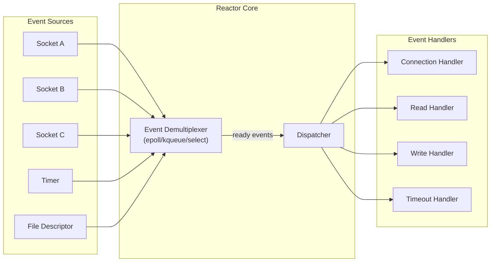
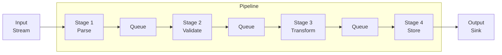
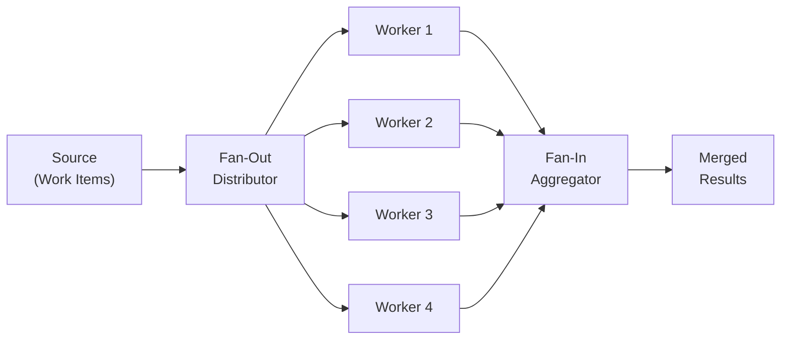
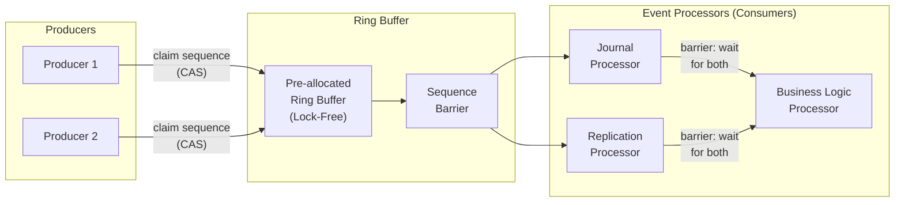
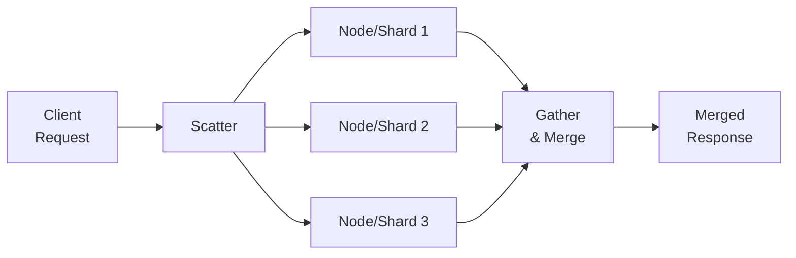

# Concurrency Patterns for System Design

## Why Concurrency Patterns Matter

Every high-scale system is fundamentally a concurrency problem. A single-threaded web server
handles one request at a time. Real systems handle millions. The patterns below are the
**vocabulary** architects use to reason about how work gets distributed, how I/O gets managed,
and how throughput gets maximized without sacrificing correctness.

---

## 1. Producer-Consumer

### What
Decouples the generation of work from the processing of work using a **bounded buffer** (queue)
between them. Producers enqueue items; consumers dequeue and process them.

### When to Use
- Work arrives at a different rate than it can be processed (rate mismatch).
- You need back-pressure: a full buffer slows producers down.
- Decoupling services in a microservice architecture (Kafka, SQS, RabbitMQ).

### How It Works

```
Producer-1 ──┐
Producer-2 ──┼──► [ Bounded Buffer / Queue ] ──┼──► Consumer-1
Producer-3 ──┘                                  └──► Consumer-2
```

The buffer provides:
- **Back-pressure**: producers block (or drop) when the buffer is full.
- **Smoothing**: absorbs bursts from producers.
- **Decoupling**: producers and consumers run at independent speeds.

### Code Example (Java)

```java
// Using java.util.concurrent.BlockingQueue
BlockingQueue<Task> queue = new ArrayBlockingQueue<>(1000); // bounded

// Producer thread
Runnable producer = () -> {
    while (true) {
        Task task = generateTask();
        queue.put(task); // blocks if queue is full (back-pressure)
    }
};

// Consumer thread
Runnable consumer = () -> {
    while (true) {
        Task task = queue.take(); // blocks if queue is empty
        process(task);
    }
};
```

### Real-World Usage
| System | Role |
|--------|------|
| **Kafka** | Producers write to topic partitions, consumer groups pull |
| **SQS** | Decouples microservices; messages sit in queue until processed |
| **Log aggregation** | App threads produce log entries; background thread flushes to disk |
| **Thread pool** | Submitted tasks sit in work queue until a thread picks them up |

---

## 2. Active Object

### What
Decouples **method invocation** from **method execution**. Each active object has its own thread
(or event loop) and a request queue. Callers submit requests asynchronously; the active object
processes them one at a time in its own thread.

### When to Use
- You need to serialize access to a resource without explicit locking.
- Actor model implementations (Erlang, Akka).
- Each "entity" needs its own processing context (game objects, device controllers).

### How It Works

```
Client ──invoke()──► [ Request Queue ] ──► Scheduler (own thread) ──► Servant (actual logic)
         returns                              picks next request
         Future<Result>                       executes it
                                              sets result on Future
```

### Code Example (Python-style pseudocode)

```python
import queue
import threading
from concurrent.futures import Future

class ActiveObject:
    def __init__(self):
        self._queue = queue.Queue()
        self._thread = threading.Thread(target=self._run, daemon=True)
        self._thread.start()

    def _run(self):
        while True:
            (method, args, future) = self._queue.get()
            try:
                result = method(*args)
                future.set_result(result)
            except Exception as e:
                future.set_exception(e)

    def invoke(self, method, *args):
        future = Future()
        self._queue.put((method, args, future))
        return future  # caller gets a future, doesn't block
```

### Real-World Usage
- **Akka actors**: each actor has a mailbox (queue) and processes messages sequentially.
- **Android Looper/Handler**: UI thread has a message queue; background threads post runnables.
- **Game engines**: each game object processes its update queue on its own timeline.

---

## 3. Reactor Pattern

### What
A **synchronous event demultiplexing** pattern. A single thread monitors multiple I/O sources
using OS primitives like `select`, `epoll`, or `kqueue`. When an event is ready, the reactor
dispatches it to the appropriate handler. The handler runs **synchronously** in the reactor
thread (or a small pool).

### When to Use
- High-connection-count servers where most connections are idle (C10K problem).
- Event-driven architectures that need to handle thousands of concurrent connections.
- When you want to avoid the overhead of one-thread-per-connection.

### Architecture



### The Event Loop (Pseudocode)

```python
# Simplified reactor loop
while running:
    ready_events = demuxer.wait(timeout)  # epoll_wait / kqueue / select
    for event in ready_events:
        handler = dispatch_table[event.fd]
        handler.handle_event(event.type)  # runs synchronously
```

### Key Constraint
Handlers must be **non-blocking and fast**. A slow handler blocks the entire reactor.
This is why Node.js warns against blocking the event loop.

### Real-World Usage
| System | Demuxer | Notes |
|--------|---------|-------|
| **Node.js** | libuv (epoll/kqueue/IOCP) | Single-threaded JS + thread pool for file I/O |
| **Nginx** | epoll (Linux), kqueue (BSD) | Worker processes, each running a reactor loop |
| **Redis** | ae library (epoll/kqueue/select) | Single-threaded command processing |
| **Netty** | NIO (Java), epoll transport | EventLoopGroup with multiple reactor threads |

### Single-Reactor vs Multi-Reactor

```
Single Reactor (Redis):
  [All connections] ──► [One epoll loop] ──► [One thread dispatches all]

Multi-Reactor (Netty, Nginx workers):
  [Connections shard 1] ──► [Reactor thread 1]
  [Connections shard 2] ──► [Reactor thread 2]
  [Connections shard 3] ──► [Reactor thread 3]
  Main acceptor distributes new connections round-robin.
```

---

## 4. Proactor Pattern

### What
Where the Reactor waits for I/O **readiness** ("socket is readable, go read it now"),
the Proactor initiates **asynchronous I/O operations** and gets notified on **completion**.
The OS performs the actual I/O; the application just handles the completed result.

### When to Use
- Platforms with strong async I/O support (Windows IOCP, Linux io_uring).
- When you want true async I/O without managing readiness events yourself.

### Reactor vs Proactor

| Aspect | Reactor | Proactor |
|--------|---------|----------|
| I/O model | Synchronous non-blocking | Asynchronous |
| Who does I/O? | Application (after notification) | OS kernel |
| Notification means | "Ready to read" | "Read completed, here's the data" |
| OS support | epoll, kqueue, select | IOCP (Windows), io_uring (Linux 5.1+) |
| Examples | Node.js, Nginx, Redis | Windows IOCP apps, Boost.Asio |

### How It Works

```
1. Application: "OS, please read 4KB from socket fd=42 into this buffer"
2. OS performs the read in the background (DMA, kernel thread, etc.)
3. OS: "Done. 4KB is now in your buffer. Here's a completion event."
4. Proactor dispatches completion event to the registered CompletionHandler.
```

### Code Example (Boost.Asio style)

```cpp
// Proactor: initiate async read, provide completion handler
socket.async_read_some(
    boost::asio::buffer(data, max_length),
    [this](boost::system::error_code ec, std::size_t bytes_transferred) {
        if (!ec) {
            process_data(data, bytes_transferred);  // data already in buffer
            do_read();  // chain next read
        }
    }
);

io_context.run();  // proactor loop - dispatches completion handlers
```

---

## 5. Half-Sync/Half-Async

### What
Splits a system into two layers:
- **Async layer**: handles I/O events without blocking (using reactor/proactor).
- **Sync layer**: processes work using regular blocking/synchronous code.
- **Queue**: bridges the two layers.

### When to Use
- You want the efficiency of async I/O but the simplicity of synchronous business logic.
- Web servers, database connection pools, network services.

### Architecture

```
┌─────────────────────────────────┐
│        Synchronous Layer        │  ← Worker threads, blocking code
│  Worker-1  Worker-2  Worker-3   │     (easy to write and reason about)
└──────┬─────────┬────────┬───────┘
       │         │        │
       ▼         ▼        ▼
┌─────────────────────────────────┐
│          Queue Layer            │  ← Bridges async and sync
│     [ Bounded Work Queue ]      │
└────────────────┬────────────────┘
                 │
┌────────────────▼────────────────┐
│       Asynchronous Layer        │  ← Event-driven, non-blocking I/O
│  Reactor / epoll event loop     │     (handles thousands of connections)
└─────────────────────────────────┘
```

### Real-World Usage
- **Tomcat**: NIO connector (async accept) + thread pool (sync servlet processing).
- **SEDA (Staged Event-Driven Architecture)**: each stage has async input + sync processing.
- **gRPC server**: async I/O layer + synchronous service implementations.

---

## 6. Leader/Followers

### What
A pool of threads take turns being the **leader**. The leader thread waits for events on the
I/O demultiplexer. When an event arrives, the leader:
1. Promotes another thread to leader.
2. Processes the event itself (now a follower doing work).
3. When done, rejoins the follower pool.

### When to Use
- When you want to avoid the overhead of a separate dispatching thread and queuing.
- Low-latency scenarios where passing work through a queue adds unacceptable delay.

### How It Works

```
Thread Pool: [T1=Leader] [T2=Follower] [T3=Follower] [T4=Follower]

Event arrives:
  T1 (leader): wakes up, promotes T2 to leader
  T1: processes event as a worker
  T2 (new leader): waits on demuxer for next event
  T1: finishes, joins follower pool
  Pool: [T2=Leader] [T3=Follower] [T4=Follower] [T1=Follower]
```

### Advantage Over Half-Sync/Half-Async
No queue between I/O and processing -- lower latency. But harder to implement correctly
(thread promotion must be lock-free or very fast).

---

## 7. Thread Pool

### What
Pre-create a fixed set of threads. Work items are submitted to a queue; idle threads pick
items from the queue and execute them.

### When to Use
- Almost everywhere. Thread pools are the workhorse of concurrent systems.
- When thread creation/destruction overhead is significant.
- When you need to bound the number of concurrent threads to control resource usage.

### Pool Types

| Type | Behavior | Use Case |
|------|----------|----------|
| **Fixed** | N threads, unbounded queue | Predictable resource usage |
| **Cached** | Creates threads on demand, reuses idle ones | Bursty short-lived tasks |
| **Scheduled** | Fixed pool + delayed/periodic execution | Timers, cron-like tasks |
| **Work-Stealing** | Each thread has its own deque; idle threads steal from others | ForkJoinPool, balanced load |

### Code Example (Java)

```java
// Fixed thread pool
ExecutorService pool = Executors.newFixedThreadPool(
    Runtime.getRuntime().availableProcessors()
);

// Submit work
Future<Result> future = pool.submit(() -> {
    return expensiveComputation();
});

// Get result (blocks if not ready)
Result result = future.get(5, TimeUnit.SECONDS);
```

### Sizing the Pool
- **CPU-bound tasks**: threads = number of CPU cores.
- **I/O-bound tasks**: threads = cores * (1 + wait_time / compute_time).
- **Little's Law**: threads = throughput * latency.

---

## 8. Pipeline Pattern

### What
Breaks processing into a sequence of **stages**, each connected by a queue. Each stage runs
independently (own thread or thread pool), reading from its input queue and writing to its
output queue.

### When to Use
- Data processing with distinct steps (parse, validate, transform, store).
- When different stages have different throughput characteristics.
- ETL pipelines, video encoding, request processing.

### Architecture



### Key Property: Independent Scaling
Each stage can have a different number of worker threads.

```
Parse (1 thread) ──► Queue ──► Validate (2 threads) ──► Queue ──► Store (4 threads)
                                                                    ↑
                                                         Bottleneck: scale this stage
```

### Code Example (Go)

```go
func pipeline() {
    // Stage 1: Generate
    gen := func(nums ...int) <-chan int {
        out := make(chan int)
        go func() {
            for _, n := range nums {
                out <- n
            }
            close(out)
        }()
        return out
    }

    // Stage 2: Square
    square := func(in <-chan int) <-chan int {
        out := make(chan int)
        go func() {
            for n := range in {
                out <- n * n
            }
            close(out)
        }()
        return out
    }

    // Stage 3: Print
    for v := range square(gen(2, 3, 4)) {
        fmt.Println(v) // 4, 9, 16
    }
}
```

### Real-World Usage
- **Unix pipes**: `cat file | grep pattern | sort | uniq -c`
- **Apache Kafka Streams**: topology of processors connected by internal topics.
- **Video encoding**: demux -> decode -> filter -> encode -> mux.

---

## 9. Fan-Out / Fan-In

### What
**Fan-Out**: distribute work from one source to multiple workers in parallel.
**Fan-In**: collect results from multiple workers back into a single stream.

### When to Use
- A task can be decomposed into independent sub-tasks.
- MapReduce-style processing.
- Parallel API calls (e.g., search across multiple backends simultaneously).

### Architecture



### Code Example (Go)

```go
func fanOutFanIn(tasks []Task) []Result {
    // Fan-out: launch workers
    resultChans := make([]<-chan Result, len(tasks))
    for i, task := range tasks {
        resultChans[i] = processAsync(task) // each returns a channel
    }

    // Fan-in: merge all result channels
    merged := make(chan Result)
    var wg sync.WaitGroup
    for _, ch := range resultChans {
        wg.Add(1)
        go func(c <-chan Result) {
            defer wg.Done()
            for r := range c {
                merged <- r
            }
        }(ch)
    }
    go func() {
        wg.Wait()
        close(merged)
    }()

    // Collect
    var results []Result
    for r := range merged {
        results = append(results, r)
    }
    return results
}
```

### Real-World Usage
- **MapReduce**: map phase (fan-out) + reduce phase (fan-in).
- **API Gateway**: query user-service, order-service, recommendation-service in parallel, merge.
- **Web crawler**: distribute URLs to crawl workers, collect pages in a single index.

---

## 10. Disruptor Pattern (LMAX)

### What
A **lock-free ring buffer** designed for extreme throughput inter-thread messaging.
Created by LMAX Exchange to process 6 million transactions per second on a single thread.
Replaces traditional queues (like `BlockingQueue`) which use locks and cause contention.

### Why It Exists
Traditional queues have three problems at scale:
1. **Lock contention**: every put/take acquires a lock.
2. **GC pressure**: queue nodes are allocated and collected.
3. **Cache misses**: queue nodes are scattered in memory.

### Ring Buffer Structure

```
    Disruptor Ring Buffer (pre-allocated, fixed-size, power of 2)
    ┌─────┬─────┬─────┬─────┬─────┬─────┬─────┬─────┐
    │  0  │  1  │  2  │  3  │  4  │  5  │  6  │  7  │
    └─────┴─────┴─────┴─────┴─────┴─────┴─────┴─────┘
       ▲                          ▲              ▲
       │                          │              │
    Consumer                   Consumer       Producer
    Sequence=0                 Sequence=3     Sequence=6

    - Slots are PRE-ALLOCATED (no GC pressure)
    - Size is power of 2 (index = sequence & (size-1), bitwise mod)
    - Sequences are monotonically increasing longs (no wrap-around issues)
    - Cache-line padded to prevent false sharing
```

### How It Works



### Why Faster Than BlockingQueue

| Aspect | BlockingQueue | Disruptor |
|--------|---------------|-----------|
| Synchronization | ReentrantLock (kernel context switch) | CAS on sequence counter |
| Memory allocation | New node per enqueue | Pre-allocated slots, reused |
| Cache behavior | Pointer chasing, random memory | Sequential access, cache-line friendly |
| False sharing | Not prevented | Sequence counters padded to cache lines |
| Throughput | ~5M ops/sec | ~100M+ ops/sec |
| GC pressure | High (node allocation) | Near zero |

### Key Concepts
- **Sequence**: each producer/consumer tracks a monotonically increasing sequence number.
- **Sequence Barrier**: consumers wait until a certain sequence is available.
- **Wait Strategy**: `BusySpinWaitStrategy` (lowest latency), `SleepingWaitStrategy` (CPU-friendly).
- **Event Processor**: a consumer that processes events from the ring buffer.
- **Dependency graph**: consumers can depend on other consumers (journal before business logic).

### Code Example (Java, LMAX Disruptor library)

```java
// Define event
public class OrderEvent {
    private long orderId;
    private double price;
    // getters, setters, reset()
}

// Event handler (consumer)
public class OrderHandler implements EventHandler<OrderEvent> {
    public void onEvent(OrderEvent event, long sequence, boolean endOfBatch) {
        processOrder(event.getOrderId(), event.getPrice());
    }
}

// Setup
Disruptor<OrderEvent> disruptor = new Disruptor<>(
    OrderEvent::new,          // factory (pre-allocates)
    1024,                     // ring buffer size (power of 2)
    DaemonThreadFactory.INSTANCE,
    ProducerType.MULTI,       // multiple producers
    new YieldingWaitStrategy()
);

disruptor.handleEventsWith(journalHandler, replicationHandler)
         .then(businessLogicHandler);  // dependency chain

disruptor.start();

// Publish
RingBuffer<OrderEvent> ringBuffer = disruptor.getRingBuffer();
long sequence = ringBuffer.next();  // claim slot (CAS)
try {
    OrderEvent event = ringBuffer.get(sequence);
    event.setOrderId(12345);
    event.setPrice(99.99);
} finally {
    ringBuffer.publish(sequence);  // make visible to consumers
}
```

---

## 11. Scatter-Gather

### What
Send the same request to multiple services/nodes, collect all responses, and merge them
into a single result. Unlike Fan-Out/Fan-In where different work goes to each worker,
Scatter-Gather sends the **same request** to everyone.

### When to Use
- Distributed search (query all shards, merge results).
- Price comparison (ask multiple vendors, return best price).
- Redundancy for reliability (send to 3 replicas, use first response).

### Architecture



### Critical Design Decisions

1. **Timeout policy**: Don't wait forever. Return partial results after a deadline.
2. **Failure handling**: Return results from nodes that responded. Log failures.
3. **Merge strategy**: Rank, deduplicate, sort, aggregate.

### Code Example (Java)

```java
public SearchResult scatterGather(String query, List<SearchShard> shards) {
    List<CompletableFuture<ShardResult>> futures = shards.stream()
        .map(shard -> CompletableFuture.supplyAsync(
            () -> shard.search(query))
            .orTimeout(200, TimeUnit.MILLISECONDS)   // don't wait forever
            .exceptionally(ex -> ShardResult.empty()) // partial results OK
        )
        .collect(Collectors.toList());

    // Gather all results
    List<ShardResult> results = futures.stream()
        .map(CompletableFuture::join)
        .collect(Collectors.toList());

    return mergeResults(results);  // rank, deduplicate, sort
}
```

### Real-World Usage
- **Elasticsearch**: query is scattered to all shards, results gathered and merged by coordinator.
- **DNS resolution**: query multiple resolvers, use first response.
- **Google search**: scatter query to thousands of index servers.

---

## 12. Circuit Breaker

### What
Prevents a system from repeatedly calling a failing downstream service. Like an electrical
circuit breaker: when failures exceed a threshold, the circuit "opens" and calls fail fast
without reaching the downstream. After a cooldown, it "half-opens" to test if the service
has recovered.

### State Machine

```
                     failure_count >= threshold
         ┌──────────────────────────────────────────┐
         │                                          ▼
    ┌─────────┐                               ┌─────────┐
    │ CLOSED  │                               │  OPEN   │
    │(normal) │                               │(failing │
    │         │                               │ fast)   │
    └─────────┘                               └────┬────┘
         ▲                                         │
         │    success                     timeout expires
         │                                         │
         │         ┌────────────┐                  │
         └─────────│ HALF-OPEN  │◄─────────────────┘
                   │(testing)   │
                   └────────────┘
                     failure → back to OPEN
```

### When to Use
- Calling remote services (HTTP APIs, databases, message brokers).
- Preventing cascade failures in microservice architectures.
- Any situation where a downstream failure can exhaust your resources (threads, connections).

### Code Example (Python-like pseudocode)

```python
class CircuitBreaker:
    def __init__(self, failure_threshold=5, recovery_timeout=30):
        self.state = "CLOSED"
        self.failure_count = 0
        self.failure_threshold = failure_threshold
        self.recovery_timeout = recovery_timeout
        self.last_failure_time = None

    def call(self, func, *args):
        if self.state == "OPEN":
            if time.time() - self.last_failure_time > self.recovery_timeout:
                self.state = "HALF_OPEN"
            else:
                raise CircuitOpenError("Circuit is open, failing fast")

        try:
            result = func(*args)
            self._on_success()
            return result
        except Exception as e:
            self._on_failure()
            raise

    def _on_success(self):
        self.failure_count = 0
        self.state = "CLOSED"

    def _on_failure(self):
        self.failure_count += 1
        self.last_failure_time = time.time()
        if self.failure_count >= self.failure_threshold:
            self.state = "OPEN"
```

### Real-World Usage
| Library | Language | Notes |
|---------|----------|-------|
| **Hystrix** (Netflix) | Java | Now in maintenance; pioneered the pattern |
| **Resilience4j** | Java | Hystrix successor, lighter weight |
| **Polly** | .NET | Fluent API for resilience policies |
| **Istio** | Any (sidecar) | Circuit breaking at the service mesh level |

---

## Pattern Comparison Matrix

| Pattern | Threading Model | Latency | Throughput | Complexity | Best For |
|---------|----------------|---------|------------|------------|----------|
| Producer-Consumer | Multi-threaded | Medium | High | Low | Decoupling, buffering |
| Active Object | Thread-per-object | Medium | Medium | Medium | Serialized access |
| Reactor | Single/few threads | Low | Very High | High | Many idle connections |
| Proactor | Async I/O | Low | Very High | High | True async I/O platforms |
| Half-Sync/Half-Async | Layered | Medium | High | Medium | Async I/O + sync logic |
| Leader/Followers | Pool | Low | High | High | Low-latency dispatch |
| Thread Pool | Pool | Medium | High | Low | General concurrency |
| Pipeline | Stage-per-thread | Medium | High | Medium | Multi-step processing |
| Fan-Out/Fan-In | Parallel workers | Low | Very High | Medium | Parallelizable tasks |
| Disruptor | Lock-free | Very Low | Extreme | Very High | Ultra-high throughput |
| Scatter-Gather | Parallel broadcast | Medium | High | Medium | Distributed queries |
| Circuit Breaker | Any | Low (fail-fast) | N/A | Low | Resilience |

---

## Choosing the Right Pattern

### Decision Tree

```
Need to handle many concurrent connections?
├── Yes: How does your OS handle I/O?
│   ├── readiness-based (epoll/kqueue) → Reactor
│   └── completion-based (IOCP/io_uring) → Proactor
│
├── Need to decouple producer from consumer?
│   ├── Simple buffering → Producer-Consumer
│   ├── Multi-step processing → Pipeline
│   └── Same work to many, merge results → Scatter-Gather
│
├── Need extreme throughput (>10M msg/sec)?
│   └── Disruptor
│
├── Need parallel decomposition?
│   ├── Independent sub-tasks → Fan-Out/Fan-In
│   └── Broadcast query → Scatter-Gather
│
├── Need resilience against downstream failures?
│   └── Circuit Breaker
│
└── Need serialized access without locks?
    └── Active Object
```

---

## How These Patterns Appear in System Design Interviews

### "Design a Message Queue"
- **Core**: Producer-Consumer (the queue itself).
- **I/O layer**: Reactor pattern (handle thousands of publisher/subscriber connections).
- **Internal processing**: Pipeline (receive -> persist -> replicate -> ack).
- **Consumer groups**: Fan-Out to partitions.

### "Design a Search Engine"
- **Query serving**: Scatter-Gather across index shards.
- **Indexing pipeline**: Pipeline pattern (crawl -> parse -> index -> replicate).
- **Connection handling**: Reactor (millions of query connections).

### "Design a Rate Limiter"
- **Token bucket/sliding window**: Active Object (each client's limiter serialized).
- **Distributed rate limiting**: Scatter-Gather (check all nodes for count).
- **Protection**: Circuit Breaker (if rate-limit service is down, fail open/closed policy).

### "Design a Real-Time Trading System"
- **Order matching**: Disruptor pattern (lock-free, ultra-low latency).
- **Market data distribution**: Fan-Out (one feed to many consumers).
- **Risk checks**: Pipeline (order -> risk -> match -> settle).
- **External service calls**: Circuit Breaker.
