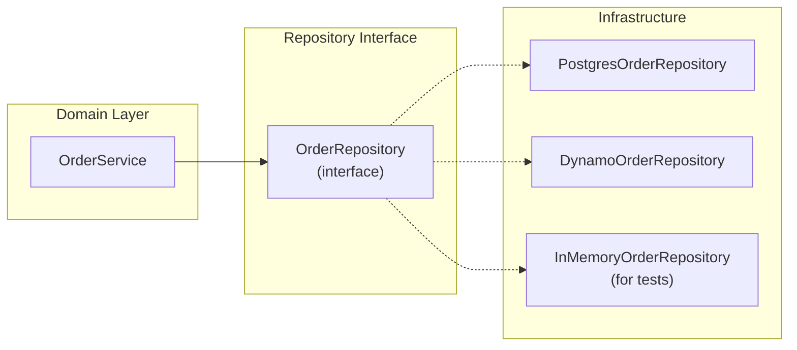
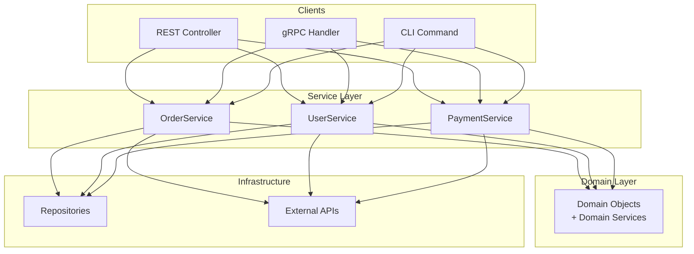
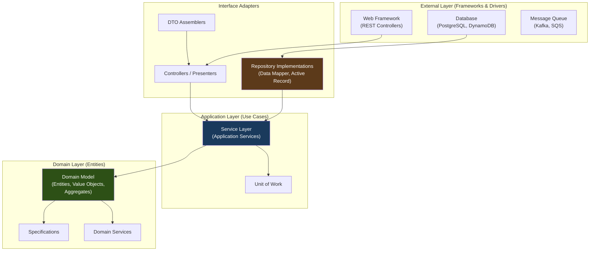

# Enterprise & Architectural Patterns for System Design

## Why Enterprise Patterns Matter

These patterns (many from Martin Fowler's *Patterns of Enterprise Application Architecture*)
define how data moves between layers, how persistence is abstracted, and how business logic
is organized. In system design interviews, you will be expected to know when a service uses
a thin "transaction script" vs a rich "domain model," and why the choice matters for
maintainability and scale.

---

## 1. Repository Pattern

### What
Provides a **collection-like interface** for accessing domain objects, hiding the details
of data storage. The domain layer talks to repositories as if they were in-memory
collections -- it never knows about SQL, ORM sessions, or REST APIs.

### When to Use
- You want to decouple domain logic from persistence technology.
- You need to swap data sources (Postgres -> DynamoDB) without changing business logic.
- You want testable domain logic (mock the repository in tests).

### Structure



### Code Example (Java)

```java
// Interface - lives in domain layer
public interface OrderRepository {
    Order findById(OrderId id);
    List<Order> findByCustomer(CustomerId customerId);
    void save(Order order);
    void delete(OrderId id);
}

// Implementation - lives in infrastructure layer
public class PostgresOrderRepository implements OrderRepository {
    private final JdbcTemplate jdbc;

    public Order findById(OrderId id) {
        return jdbc.queryForObject(
            "SELECT * FROM orders WHERE id = ?",
            new OrderRowMapper(), id.value()
        );
    }

    public void save(Order order) {
        // Handles both INSERT and UPDATE
        jdbc.update("INSERT INTO orders (...) VALUES (...) ON CONFLICT DO UPDATE ...",
            order.getId(), order.getStatus(), order.getTotal()
        );
    }
}

// In tests
public class InMemoryOrderRepository implements OrderRepository {
    private final Map<OrderId, Order> store = new HashMap<>();

    public Order findById(OrderId id) { return store.get(id); }
    public void save(Order order) { store.put(order.getId(), order); }
}
```

### Repository vs DAO
| Aspect | Repository | DAO |
|--------|-----------|-----|
| Abstraction level | Domain-oriented (speaks in Aggregates) | Data-oriented (speaks in tables/rows) |
| Return type | Domain objects | DTOs or raw data |
| Where it lives | Domain boundary | Infrastructure/persistence layer |
| Query language | Domain terms: `findOverdueOrders()` | Generic: `findByCriteria(criteria)` |

---

## 2. Unit of Work

### What
Maintains a list of objects affected by a business transaction. Coordinates the writing out
of changes and the resolution of concurrency problems. Tracks which objects are new, modified,
or deleted, and commits them all in a single batch.

### When to Use
- You need to batch multiple database writes into a single transaction.
- You want to avoid writing to the DB after every small change.
- ORMs (Hibernate Session, Entity Framework DbContext) implement this internally.

### How It Works

```
Business Transaction:
  1. Load Customer  → tracked as "clean"
  2. Change address → tracked as "dirty"
  3. Create Order   → tracked as "new"
  4. Delete old Cart → tracked as "removed"

  commit():
    BEGIN TRANSACTION
      UPDATE customers SET address = ... WHERE id = ?
      INSERT INTO orders (...) VALUES (...)
      DELETE FROM carts WHERE id = ?
    COMMIT
```

### Code Example (Python)

```python
class UnitOfWork:
    def __init__(self, session_factory):
        self.session = session_factory()
        self.new_objects = []
        self.dirty_objects = []
        self.removed_objects = []

    def register_new(self, obj):
        self.new_objects.append(obj)

    def register_dirty(self, obj):
        self.dirty_objects.append(obj)

    def register_removed(self, obj):
        self.removed_objects.append(obj)

    def commit(self):
        try:
            self.session.begin()
            for obj in self.new_objects:
                self.session.insert(obj)
            for obj in self.dirty_objects:
                self.session.update(obj)
            for obj in self.removed_objects:
                self.session.delete(obj)
            self.session.commit()
        except:
            self.session.rollback()
            raise
        finally:
            self.new_objects.clear()
            self.dirty_objects.clear()
            self.removed_objects.clear()
```

### Real-World Usage
- **Hibernate / JPA**: the `Session` / `EntityManager` IS a Unit of Work.
- **Entity Framework**: `DbContext` tracks changes and calls `SaveChanges()`.
- **SQLAlchemy**: `Session` object tracks pending changes.

---

## 3. Data Mapper

### What
A layer of mappers that moves data between objects and the database while keeping them
independent of each other and the mapper itself. The domain objects have **no knowledge**
of the database. The mapper handles all SQL and translation.

### When to Use
- Complex domain models where domain objects should be pure (no persistence logic).
- When the database schema differs significantly from the domain model.
- Enterprise applications with rich business rules.

### How It Works

```
Domain Object (Order)          Data Mapper            Database (orders table)
┌──────────────────┐    ┌──────────────────┐    ┌──────────────────────┐
│ orderId          │    │ toRow(order)     │    │ id         BIGINT    │
│ lineItems[]      │◄──►│ toDomain(row)    │◄──►│ status     VARCHAR   │
│ calculateTotal() │    │ insert(order)    │    │ total_cents INTEGER  │
│ applyDiscount()  │    │ update(order)    │    │ customer_id FK       │
└──────────────────┘    └──────────────────┘    └──────────────────────┘
     No DB knowledge      Handles translation       Raw storage
```

### Code Example (TypeScript)

```typescript
// Domain object - no database knowledge
class Order {
    constructor(
        public readonly id: string,
        public items: LineItem[],
        public status: OrderStatus
    ) {}

    calculateTotal(): Money {
        return this.items.reduce((sum, item) => sum.add(item.subtotal()), Money.zero());
    }
}

// Data Mapper - handles all persistence
class OrderMapper {
    async findById(id: string): Promise<Order | null> {
        const row = await db.query('SELECT * FROM orders WHERE id = $1', [id]);
        if (!row) return null;
        const items = await this.loadLineItems(id);
        return new Order(row.id, items, row.status as OrderStatus);
    }

    async save(order: Order): Promise<void> {
        await db.query(
            `INSERT INTO orders (id, status, total_cents)
             VALUES ($1, $2, $3)
             ON CONFLICT (id) DO UPDATE SET status = $2, total_cents = $3`,
            [order.id, order.status, order.calculateTotal().toCents()]
        );
        await this.saveLineItems(order.id, order.items);
    }
}
```

---

## 4. Active Record

### What
An object that wraps a row in a database table, encapsulates the database access, and
adds domain logic on that data. The object **knows how to persist itself**.

### When to Use
- Simple domain models where the database schema maps directly to objects.
- CRUD applications with little complex business logic.
- Rapid prototyping and simple web applications.

### Code Example (Ruby on Rails style)

```ruby
# Active Record: the object IS the row and knows how to save itself
class User < ApplicationRecord
    validates :email, presence: true, uniqueness: true
    has_many :orders

    def full_name
        "#{first_name} #{last_name}"
    end

    def deactivate!
        update!(status: 'inactive', deactivated_at: Time.now)
    end
end

# Usage - object handles its own persistence
user = User.find(42)
user.email = "new@email.com"
user.save!  # the object saves itself

# Querying - class methods on the model
admins = User.where(role: 'admin').order(:created_at)
```

### Active Record vs Data Mapper Comparison

| Aspect | Active Record | Data Mapper |
|--------|--------------|-------------|
| **Domain object** | Knows about DB (inherits from AR base) | Pure, no DB knowledge |
| **Persistence** | `user.save()` | `mapper.save(user)` |
| **Schema coupling** | Object fields = table columns | Object and table can differ |
| **Testing** | Needs DB (or heavy mocking) | Easy to test with in-memory mocks |
| **Complexity** | Low | Higher |
| **Best for** | CRUD apps, simple domains | Complex domains, DDD |
| **Examples** | Rails, Django ORM, Laravel Eloquent | Hibernate, SQLAlchemy (mapper mode), Doctrine |
| **When it breaks** | Domain logic grows complex, schema and model diverge | Never "breaks," but overkill for simple CRUD |

### Decision Guide

```
Is your domain logic complex (many business rules, aggregates, invariants)?
├── Yes → Data Mapper (keep domain pure)
└── No → Is your schema a direct mirror of your objects?
    ├── Yes → Active Record (simpler, faster to build)
    └── No → Data Mapper (handle the mismatch in the mapper)
```

---

## 5. Data Transfer Object (DTO)

### What
An object that carries data between processes or layers. It has **no behavior** -- just
fields and serialization. DTOs exist to shape data for a specific consumer (API response,
message payload, view model) without exposing internal domain structure.

### When to Use
- API responses should not expose internal domain objects.
- You need to aggregate data from multiple domain objects into one response.
- You want to control exactly what data crosses a network boundary.
- Serialization format differs from domain model structure.

### Code Example (Java)

```java
// Domain object (rich, with behavior)
public class Order {
    private OrderId id;
    private Customer customer;
    private List<LineItem> items;
    private OrderStatus status;
    public Money calculateTotal() { /* complex logic */ }
    public void applyDiscount(Coupon c) { /* modifies state */ }
}

// DTO (flat, no behavior, for API response)
public record OrderDTO(
    String orderId,
    String customerName,
    String customerEmail,
    int itemCount,
    String totalFormatted,
    String status
) {
    // Factory method to create from domain object
    public static OrderDTO from(Order order) {
        return new OrderDTO(
            order.getId().toString(),
            order.getCustomer().getFullName(),
            order.getCustomer().getEmail(),
            order.getItems().size(),
            order.calculateTotal().format(),
            order.getStatus().name()
        );
    }
}
```

### Why Not Just Return Domain Objects?
1. **Security**: domain object may have fields you do not want to expose (password hash, internal IDs).
2. **Stability**: API contract should not break when you refactor domain internals.
3. **Shape**: API consumer may need a flat structure; domain model may be deeply nested.
4. **Performance**: DTO can exclude heavy fields (e.g., skip loading `order.auditLog` for list views).

---

## 6. Service Layer

### What
Defines an application's boundary with a layer of services that establishes a set of
available operations and coordinates the application's response in each operation.
It is the **entry point** for use cases.

### When to Use
- You need a clear API for your application that multiple clients can use (REST, gRPC, CLI).
- Business operations span multiple domain objects and repositories.
- You need transaction management, authorization, and logging in a consistent place.

### Structure



### Code Example (Python)

```python
class OrderService:
    """Application service - coordinates use cases."""

    def __init__(self, order_repo, payment_gateway, event_bus):
        self.order_repo = order_repo
        self.payment_gateway = payment_gateway
        self.event_bus = event_bus

    @transactional
    def place_order(self, command: PlaceOrderCommand) -> OrderDTO:
        # 1. Validate
        customer = self.customer_repo.find_by_id(command.customer_id)
        if not customer:
            raise CustomerNotFoundError(command.customer_id)

        # 2. Domain logic
        order = Order.create(customer, command.items)  # domain object does validation

        # 3. Persist
        self.order_repo.save(order)

        # 4. Side effects
        self.payment_gateway.authorize(order.total, customer.payment_method)
        self.event_bus.publish(OrderPlacedEvent(order.id))

        # 5. Return DTO (not domain object)
        return OrderDTO.from(order)
```

### Service Layer vs Domain Service
| Aspect | Service Layer (Application Service) | Domain Service |
|--------|-------------------------------------|----------------|
| Purpose | Orchestrate use cases | Encapsulate domain logic that doesn't belong to one entity |
| Contains | Transaction mgmt, auth, coordination | Pure business rules |
| Depends on | Repositories, external services | Only domain objects |
| Example | `OrderService.placeOrder()` | `PricingService.calculateDiscount()` |

---

## 7. Domain Model

### What
A rich object model of the domain that incorporates both **behavior and data**. Objects
are not just data holders -- they enforce invariants, calculate derived values, and
encapsulate business rules.

### When to Use
- Complex business domains with many rules and edge cases.
- Domain-Driven Design (DDD) approach.
- When business logic is the core competitive advantage.

### Code Example (Java)

```java
public class BankAccount {
    private AccountId id;
    private Money balance;
    private AccountStatus status;
    private List<Transaction> transactions;

    // Business rule: can't withdraw from frozen account
    public void withdraw(Money amount) {
        if (status == AccountStatus.FROZEN) {
            throw new AccountFrozenException(id);
        }
        if (amount.isGreaterThan(balance)) {
            throw new InsufficientFundsException(balance, amount);
        }
        balance = balance.subtract(amount);
        transactions.add(Transaction.withdrawal(amount, Instant.now()));
    }

    // Business rule: overdraft protection
    public Money availableBalance() {
        return balance.add(overdraftLimit);
    }

    // Invariant enforced in constructor
    private BankAccount(AccountId id, Money initialDeposit) {
        if (initialDeposit.isLessThan(Money.of(100))) {
            throw new MinimumDepositException();
        }
        this.balance = initialDeposit;
        this.status = AccountStatus.ACTIVE;
    }
}
```

### Characteristics of a Good Domain Model
1. **Encapsulates invariants**: you cannot put the object in an invalid state.
2. **No anemic objects**: objects are not just getters/setters -- they have real behavior.
3. **Uses Value Objects**: `Money`, `EmailAddress`, `OrderId` -- not raw primitives.
4. **Aggregate boundaries**: a cluster of objects treated as a unit for changes.

---

## 8. Transaction Script

### What
Organizes business logic as a **single procedure per use case**. Each procedure handles
one request from the presentation layer -- getting data, processing it, and saving results.
No rich domain objects; logic lives in the script.

### When to Use
- Simple business logic with few cross-cutting rules.
- CRUD-heavy applications.
- When you want to get something working fast without DDD overhead.

### Code Example (Python)

```python
# Transaction Script: one function = one use case, procedural style
def place_order(customer_id: str, items: list[dict]) -> dict:
    # Get data
    customer = db.query("SELECT * FROM customers WHERE id = %s", customer_id)
    if not customer:
        raise ValueError("Customer not found")

    # Calculate
    total = 0
    for item in items:
        product = db.query("SELECT * FROM products WHERE id = %s", item["product_id"])
        if product["stock"] < item["qty"]:
            raise ValueError(f"Insufficient stock for {product['name']}")
        total += product["price"] * item["qty"]

    # Apply discount (business rule inline)
    if total > 100:
        total *= 0.9  # 10% discount

    # Save
    order_id = db.execute(
        "INSERT INTO orders (customer_id, total, status) VALUES (%s, %s, 'pending')",
        customer_id, total
    )
    for item in items:
        db.execute(
            "INSERT INTO order_items (order_id, product_id, qty) VALUES (%s, %s, %s)",
            order_id, item["product_id"], item["qty"]
        )
        db.execute(
            "UPDATE products SET stock = stock - %s WHERE id = %s",
            item["qty"], item["product_id"]
        )

    return {"order_id": order_id, "total": total}
```

### Domain Model vs Transaction Script

| Aspect | Domain Model | Transaction Script |
|--------|-------------|-------------------|
| **Logic location** | In domain objects | In procedures/functions |
| **Object richness** | Rich (behavior + data) | Anemic or none (just data rows) |
| **Duplication risk** | Low (logic in one place) | High (copy-paste between scripts) |
| **Complexity ceiling** | Handles high complexity well | Becomes spaghetti at scale |
| **Time to first feature** | Slower (design upfront) | Faster (just write the procedure) |
| **Testing** | Unit test domain objects | Integration test the whole procedure |
| **Best for** | Complex domains (banking, insurance, logistics) | Simple CRUD, early-stage startups |

### When to Migrate
Start with Transaction Script. When you notice:
- The same business rule appears in 3+ scripts.
- Scripts are 500+ lines long.
- A change in one rule requires updating many scripts.

Then refactor toward Domain Model.

---

## 9. Identity Map

### What
Ensures that each object gets loaded only once by keeping a map of every loaded object
indexed by its ID. If an object is requested again, it is returned from the map, not
loaded from the database again.

### When to Use
- ORM sessions that load many related objects (avoid loading the same `Customer` twice).
- Preventing inconsistencies from having two different in-memory copies of the same row.
- Performance optimization -- avoid redundant database queries.

### How It Works

```
Request: load Order #42      Request: load Order #42 again
         │                            │
         ▼                            ▼
  ┌─────────────┐              ┌─────────────┐
  │ Identity Map│              │ Identity Map│
  │             │              │ #42 → Order │ ← found!
  │ (empty)     │              │             │
  └──────┬──────┘              └──────┬──────┘
         │ miss                       │ hit
         ▼                            ▼
    ┌──────────┐                 Return cached
    │ Database │                 (no DB query)
    └──────────┘
```

### Code Example

```python
class IdentityMap:
    def __init__(self):
        self._map = {}  # {(type, id): object}

    def get(self, cls, id):
        return self._map.get((cls.__name__, id))

    def add(self, obj):
        self._map[(type(obj).__name__, obj.id)] = obj

    def remove(self, cls, id):
        self._map.pop((cls.__name__, id), None)


class OrderRepository:
    def __init__(self, identity_map, db):
        self.identity_map = identity_map
        self.db = db

    def find_by_id(self, order_id):
        # Check identity map first
        cached = self.identity_map.get(Order, order_id)
        if cached:
            return cached

        # Load from DB
        row = self.db.query("SELECT * FROM orders WHERE id = %s", order_id)
        order = Order(**row)

        # Register in identity map
        self.identity_map.add(order)
        return order
```

### Real-World Usage
- **Hibernate / JPA**: first-level cache (Session) IS an Identity Map.
- **SQLAlchemy**: `Session.identity_map` tracks all loaded objects.
- **Entity Framework**: `DbContext` change tracker serves as Identity Map.

---

## 10. Lazy Load

### What
An object that does not contain all the data you need but knows how to get it.
Defers the loading of expensive or rarely-needed data until the moment it is
actually accessed.

### When to Use
- Loading an object would trigger expensive joins or sub-queries.
- You often access an object without needing its related collections.
- Displaying a list of orders (don't load all line items upfront).

### Four Techniques

| Technique | How | Example |
|-----------|-----|---------|
| **Virtual Proxy** | Proxy object stands in; loads real object on first method call | Hibernate lazy associations |
| **Value Holder** | Wrapper that loads value on first `get()` | `Lazy<T>` in C# |
| **Ghost** | Partial object with just the ID; fully loads on any field access | ORM "lazy loading" |
| **Lazy Initialization** | Field is null; populated on first access | Simple getter pattern |

### Code Example (Python)

```python
class LazyLoader:
    """Generic lazy loader (Value Holder pattern)."""
    def __init__(self, loader_func):
        self._loader = loader_func
        self._value = None
        self._loaded = False

    @property
    def value(self):
        if not self._loaded:
            self._value = self._loader()
            self._loaded = True
        return self._value


class Order:
    def __init__(self, id, db):
        self.id = id
        self._line_items = LazyLoader(
            lambda: db.query("SELECT * FROM line_items WHERE order_id = %s", id)
        )

    @property
    def line_items(self):
        return self._line_items.value  # loads from DB on first access

    @property
    def item_count(self):
        # This triggers the lazy load only if accessed
        return len(self.line_items)
```

### The N+1 Problem

Lazy loading's biggest trap:

```python
orders = repo.find_all_orders()       # 1 query: SELECT * FROM orders
for order in orders:
    print(order.line_items)            # N queries: SELECT * FROM line_items WHERE order_id = ?
# Total: 1 + N queries (bad!)

# Fix: Eager load when you know you'll need the data
orders = repo.find_all_orders_with_items()  # 1-2 queries with JOIN or IN clause
```

---

## 11. Specification Pattern

### What
Encapsulates a **business rule** as a composable, reusable object. Specifications can
be combined with AND, OR, NOT to build complex rules from simple ones.

### When to Use
- Business rules that are reused in queries, validation, and filtering.
- You want to avoid duplicating rule logic across queries, validators, and UI.
- Complex filtering/selection criteria that should be composable.

### Code Example (Python)

```python
from abc import ABC, abstractmethod

class Specification(ABC):
    @abstractmethod
    def is_satisfied_by(self, candidate) -> bool:
        pass

    def and_(self, other):
        return AndSpecification(self, other)

    def or_(self, other):
        return OrSpecification(self, other)

    def not_(self):
        return NotSpecification(self)


class AndSpecification(Specification):
    def __init__(self, left, right):
        self.left = left
        self.right = right

    def is_satisfied_by(self, candidate):
        return self.left.is_satisfied_by(candidate) and self.right.is_satisfied_by(candidate)


# Concrete specifications
class IsActiveCustomer(Specification):
    def is_satisfied_by(self, customer):
        return customer.status == 'active'

class HasMinimumSpend(Specification):
    def __init__(self, minimum):
        self.minimum = minimum

    def is_satisfied_by(self, customer):
        return customer.total_spend >= self.minimum

class IsInRegion(Specification):
    def __init__(self, region):
        self.region = region

    def is_satisfied_by(self, customer):
        return customer.region == self.region


# Compose specifications
eligible_for_promo = (
    IsActiveCustomer()
    .and_(HasMinimumSpend(1000))
    .and_(IsInRegion('US'))
)

# Use in filtering
eligible_customers = [c for c in customers if eligible_for_promo.is_satisfied_by(c)]

# Use in validation
if not eligible_for_promo.is_satisfied_by(customer):
    raise NotEligibleError("Customer does not meet promotion criteria")

# Use in repository queries (translate to SQL)
customers = customer_repo.find_matching(eligible_for_promo)
```

### Real-World Usage
- **Spring Data Specifications**: `Specification<T>` interface for type-safe JPA queries.
- **Authorization rules**: `CanEditDocument = IsOwner.or(IsAdmin).or(HasRole('editor'))`.
- **E-commerce filters**: composable product search criteria.

---

## Clean Architecture and Where These Patterns Live



### Pattern-to-Layer Mapping

| Pattern | Layer | Role |
|---------|-------|------|
| **Domain Model** | Domain (innermost) | Core business rules and entities |
| **Specification** | Domain | Composable business rules |
| **Repository** (interface) | Domain | Abstract persistence contract |
| **Service Layer** | Application | Orchestrate use cases |
| **Unit of Work** | Application | Transaction management |
| **DTO** | Interface Adapters | Shape data for external consumers |
| **Data Mapper** | Interface Adapters | Translate between domain and DB |
| **Active Record** | Bridges Domain + Infrastructure | Simpler but tighter coupling |
| **Repository** (implementation) | Infrastructure | Actual DB queries |
| **Identity Map** | Infrastructure | Caching layer inside ORM |
| **Lazy Load** | Infrastructure | Deferred loading strategy |

---

## Pattern Decision Framework

### Choosing a Persistence Pattern

```
How complex is your domain logic?
│
├── Simple (CRUD, few rules)
│   ├── Fast iteration needed? → Active Record (Rails, Django)
│   └── Need explicit control? → Transaction Script + raw SQL
│
├── Moderate (some business rules, growing complexity)
│   └── Repository + Service Layer (good middle ground)
│
└── Complex (many rules, aggregates, invariants)
    └── Domain Model + Data Mapper + Repository + Unit of Work
        (full DDD approach)
```

### How These Patterns Appear in System Design Interviews

**"Design an E-commerce Platform"**
- **Domain Model**: `Order`, `Cart`, `Product` with rich behavior.
- **Repository**: `OrderRepository`, `ProductRepository` abstract DB access.
- **Service Layer**: `OrderService.placeOrder()` orchestrates payment, inventory, notification.
- **DTO**: API returns `OrderSummaryDTO`, not the full `Order` aggregate.
- **Unit of Work**: order creation + inventory decrement in one transaction.

**"Design a Banking System"**
- **Domain Model**: `Account`, `Transaction` with strict invariants.
- **Specification**: `IsEligibleForLoan = HasMinimumBalance.and(HasGoodCreditScore).and(IsActiveAccount)`.
- **Identity Map**: same `Account` loaded once per session (avoid double-charging).
- **Data Mapper**: domain `Money` type maps to `BIGINT` cents in DB.

**"Design a URL Shortener"**
- **Transaction Script**: simple enough that a procedure per use case works fine.
- **Active Record**: `ShortUrl.find_by_slug(slug)` -- no complex domain logic.
- Don't over-engineer with full DDD for a simple mapping service.

---

## Anti-Pattern: The Anemic Domain Model

A "domain model" where objects have only getters and setters -- no real behavior.
All logic lives in service classes that manipulate the dumb objects.

```java
// ANEMIC (anti-pattern)
class Order {
    private String status;
    public String getStatus() { return status; }
    public void setStatus(String s) { this.status = s; }
}

class OrderService {
    void cancelOrder(Order order) {
        if (order.getStatus().equals("shipped")) {
            throw new RuntimeException("Can't cancel shipped order");
        }
        order.setStatus("cancelled");  // logic in SERVICE, not in DOMAIN OBJECT
    }
}

// RICH (correct Domain Model)
class Order {
    private OrderStatus status;

    public void cancel() {
        if (status == OrderStatus.SHIPPED) {
            throw new CannotCancelShippedException();
        }
        this.status = OrderStatus.CANCELLED;  // logic IN the object
    }
}
```

The anemic model is just Transaction Script wearing a Domain Model costume.
If your "domain objects" are just data bags, call them what they are and use
Transaction Script honestly. Don't add the complexity of DDD without the benefit.
