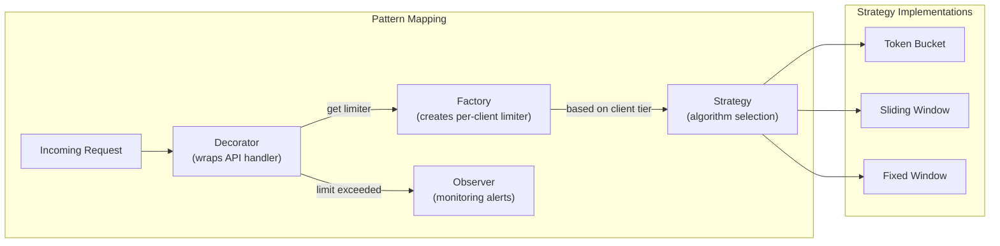
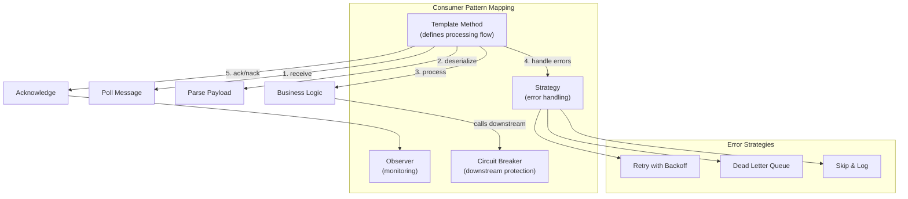
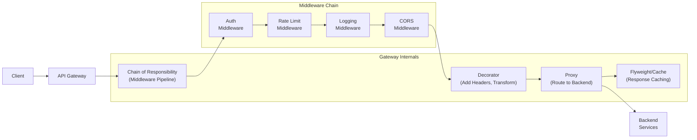

# Pattern Combinations in Real Systems

## Why Patterns Combine

No real system uses a single design pattern in isolation. Patterns are composable building
blocks. Knowing individual patterns is the vocabulary; knowing how they **combine** is
fluency. This document covers the most important combinations and how they appear in system
design.

---

## Classic GoF Combinations

### Strategy + Factory

**What**: A Factory selects and creates the right Strategy implementation based on runtime
input. The client does not need to know which concrete strategy it gets.

**When**: You have multiple algorithms and the choice depends on configuration, user input,
or runtime context.

```java
// Strategy interface
interface CompressionStrategy {
    byte[] compress(byte[] data);
}
class GzipCompression implements CompressionStrategy { /* ... */ }
class LZ4Compression implements CompressionStrategy { /* ... */ }
class ZstdCompression implements CompressionStrategy { /* ... */ }

// Factory creates the right strategy
class CompressionFactory {
    static CompressionStrategy create(String algorithm) {
        return switch (algorithm) {
            case "gzip" -> new GzipCompression();
            case "lz4"  -> new LZ4Compression();
            case "zstd" -> new ZstdCompression();
            default -> throw new IllegalArgumentException("Unknown: " + algorithm);
        };
    }
}

// Client code - doesn't know which strategy it gets
CompressionStrategy strategy = CompressionFactory.create(config.getCompression());
byte[] compressed = strategy.compress(rawData);
```

**System design example**: A rate limiter uses Strategy (token bucket, sliding window, fixed
window) and Factory creates the right one per client tier.

---

### Observer + Command

**What**: Events trigger observers, but instead of directly executing logic, the observers
create and execute Command objects. Commands can be queued, logged, and undone.

**When**: You need event-driven behavior with undo/redo, audit logging, or deferred execution.

```python
class TextEditor:
    def __init__(self):
        self.content = ""
        self.command_history = []
        self.observers = []  # for UI updates

    def execute(self, command):
        command.execute(self)
        self.command_history.append(command)
        for observer in self.observers:
            observer.on_change(self.content)  # notify observers

    def undo(self):
        if self.command_history:
            command = self.command_history.pop()
            command.undo(self)
            for observer in self.observers:
                observer.on_change(self.content)

class InsertTextCommand:
    def __init__(self, text, position):
        self.text = text
        self.position = position

    def execute(self, editor):
        editor.content = (editor.content[:self.position]
                         + self.text
                         + editor.content[self.position:])

    def undo(self, editor):
        editor.content = (editor.content[:self.position]
                         + editor.content[self.position + len(self.text):])
```

---

### State + Strategy

**What**: An object's state determines which strategy it uses. When the state changes,
the strategy changes automatically.

**When**: Behavior varies by state AND the behavior within each state has multiple
algorithm variants.

```java
// A shipping order's pricing strategy changes based on its state
class ShippingOrder {
    private OrderState state;
    private PricingStrategy pricingStrategy;

    public void advanceState() {
        switch (state) {
            case DRAFT -> {
                state = OrderState.CONFIRMED;
                pricingStrategy = new StandardPricing();
            }
            case CONFIRMED -> {
                state = OrderState.IN_TRANSIT;
                pricingStrategy = new ExpeditedPricing(); // different rates in transit
            }
            case IN_TRANSIT -> {
                state = OrderState.DELIVERED;
                pricingStrategy = new FinalPricing();
            }
        }
    }

    public Money calculateCost() {
        return pricingStrategy.calculate(this);
    }
}
```

---

### Composite + Visitor

**What**: Composite creates a tree structure. Visitor traverses it and performs operations
without modifying the tree classes.

**When**: You have a tree (file system, AST, UI widget tree, org chart) and need to
perform many different operations on it.

```java
// Composite: file system
interface FileSystemNode {
    void accept(Visitor visitor);
}

class File implements FileSystemNode {
    String name;
    long size;
    void accept(Visitor v) { v.visitFile(this); }
}

class Directory implements FileSystemNode {
    String name;
    List<FileSystemNode> children;
    void accept(Visitor v) {
        v.visitDirectory(this);
        for (var child : children) child.accept(v);
    }
}

// Visitors: different operations on the same tree
class SizeCalculator implements Visitor {
    long totalSize = 0;
    void visitFile(File f) { totalSize += f.size; }
    void visitDirectory(Directory d) { /* nothing extra */ }
}

class FileCounter implements Visitor {
    int count = 0;
    void visitFile(File f) { count++; }
    void visitDirectory(Directory d) { /* nothing extra */ }
}

class PermissionChecker implements Visitor {
    List<String> violations = new ArrayList<>();
    void visitFile(File f) { /* check file permissions */ }
    void visitDirectory(Directory d) { /* check dir permissions */ }
}
```

---

### Decorator + Proxy

**What**: Proxy controls access; Decorator adds behavior. Combined: you control who can
access something AND enhance its functionality.

**When**: API middleware stacks, layered I/O streams, service wrappers.

```
Client ──► AuthProxy ──► LoggingDecorator ──► CachingDecorator ──► RealService

AuthProxy:      "Are you allowed to call this?"
LoggingDecorator: "Let me log this request and response."
CachingDecorator: "I have a cached result, skip the real call."
RealService:     "Here's the actual computation."
```

```python
class Service:
    def get_data(self, key): ...

class AuthProxy(Service):
    def __init__(self, inner, auth_service):
        self.inner = inner
        self.auth = auth_service

    def get_data(self, key):
        if not self.auth.is_authorized(current_user()):
            raise UnauthorizedError()
        return self.inner.get_data(key)

class LoggingDecorator(Service):
    def __init__(self, inner, logger):
        self.inner = inner
        self.logger = logger

    def get_data(self, key):
        self.logger.info(f"get_data called with key={key}")
        result = self.inner.get_data(key)
        self.logger.info(f"get_data returned {len(result)} bytes")
        return result

class CachingDecorator(Service):
    def __init__(self, inner, cache):
        self.inner = inner
        self.cache = cache

    def get_data(self, key):
        cached = self.cache.get(key)
        if cached:
            return cached
        result = self.inner.get_data(key)
        self.cache.set(key, result, ttl=300)
        return result

# Compose the layers
service = AuthProxy(
    LoggingDecorator(
        CachingDecorator(
            RealService()
        , cache)
    , logger)
, auth_service)
```

---

### Builder + Factory

**What**: Factory decides WHICH builder to use. Builder handles the complex construction.

**When**: You have multiple product types, each requiring multi-step construction.

```java
// Factory picks the builder, builder constructs the object
class NotificationFactory {
    static Notification create(NotificationType type, NotificationData data) {
        NotificationBuilder builder = switch (type) {
            case EMAIL -> new EmailNotificationBuilder();
            case SMS   -> new SmsNotificationBuilder();
            case PUSH  -> new PushNotificationBuilder();
        };

        return builder
            .setRecipient(data.recipient())
            .setBody(data.body())
            .setPriority(data.priority())
            .build();  // each builder knows its own construction rules
    }
}
```

---

## Patterns in System Design Scenarios

### Rate Limiter



**Pattern breakdown**:
- **Decorator**: wraps every API handler transparently -- the handler doesn't know about rate limiting.
- **Factory**: creates the right limiter for each client (free tier gets 100 RPM, premium gets 10K RPM).
- **Strategy**: the rate limiting algorithm is interchangeable (token bucket for smooth rate, sliding window for burst-tolerant).
- **Observer**: when limits are hit, notify monitoring systems and alerting.

---

### Message Queue Consumer



**Pattern breakdown**:
- **Template Method**: defines the skeleton -- poll, deserialize, process, ack. Subclasses override `process()`.
- **Strategy**: error handling is pluggable -- retry with exponential backoff, send to DLQ, or skip and log.
- **Observer**: emit metrics (messages processed, failures, latency) for monitoring dashboards.
- **Circuit Breaker**: if downstream service is failing, stop processing and let messages accumulate.

---

### API Gateway



**Pattern breakdown**:
- **Chain of Responsibility**: each middleware decides to pass the request forward or reject it.
- **Proxy**: gateway proxies requests to backend services (routing, load balancing).
- **Decorator**: adds/modifies headers, transforms payloads, injects tracing IDs.
- **Strategy** (implicit): routing strategy (round-robin, weighted, canary).

---

### Event-Driven Microservice

```
Patterns at play:
  - Observer:           services subscribe to domain events
  - Command:            events carry a command payload (what happened + context)
  - Mediator:           event bus decouples publishers from subscribers
  - Saga:               long-running transaction coordinated by events
  - Repository:         each service has its own repository for its data
  - Circuit Breaker:    protect against failing downstream services
  - Outbox Pattern:     ensure event publication + DB write are atomic
```

---

## Anti-Patterns: When Patterns Become Harmful

### Singleton Overuse

**Problem**: Global mutable state disguised as a pattern.

```java
// This is everywhere and it's almost always wrong
DatabaseConnection.getInstance().query(...);  // global state
ConfigManager.getInstance().get("key");       // untestable
Logger.getInstance().log("message");          // hidden dependency
```

**Why it hurts**:
- **Testing**: can't substitute a mock without reflection hacks.
- **Concurrency**: shared mutable state is a race condition factory.
- **Hidden dependencies**: callers have a secret dependency on global state.
- **Lifecycle**: singleton lives forever -- no cleanup, no scope.

**Fix**: Use dependency injection. Pass dependencies explicitly.

```java
// Instead of this:
class OrderService {
    void process() {
        Database.getInstance().save(...);  // hidden dependency
    }
}

// Do this:
class OrderService {
    private final Database db;
    OrderService(Database db) { this.db = db; }  // explicit dependency
    void process() {
        db.save(...);  // testable, no global state
    }
}
```

---

### Observer Overuse: Event Spaghetti

**Problem**: Everything communicates via events. No direct calls. Debugging requires tracing
invisible event chains across 15 files.

```
User clicks "Place Order"
  → OrderCreatedEvent
    → InventoryService.onOrderCreated
      → InventoryReservedEvent
        → PaymentService.onInventoryReserved
          → PaymentProcessedEvent
            → ShippingService.onPaymentProcessed
              → ShippingCreatedEvent
                → NotificationService.onShippingCreated
                  → EmailSentEvent
                    → AnalyticsService.onEmailSent
                      → ... where does it end?
```

**Why it hurts**:
- **Debugging**: stack traces end at `eventBus.publish()`. Good luck.
- **Ordering**: which handler runs first? Non-deterministic without explicit ordering.
- **Error handling**: if step 4 fails, how do you compensate steps 1-3?
- **Cognitive load**: to understand "place order," you must find ALL listeners.

**Fix**: Use direct calls for the happy path. Use events only for cross-boundary notifications
where the publisher genuinely does not care about the subscriber.

---

### Factory Overuse: Unnecessary Abstraction

**Problem**: Creating a factory for objects that have trivial construction.

```java
// Overkill: a factory for something that needs no factory
class StringBuilderFactory {
    static StringBuilder create() {
        return new StringBuilder();
    }
}

// Overkill: factory + interface for a single implementation
interface UserValidator { void validate(User u); }
class DefaultUserValidator implements UserValidator { ... }
class UserValidatorFactory {
    static UserValidator create() { return new DefaultUserValidator(); }
}
// Just use DefaultUserValidator directly!
```

**When a factory IS justified**:
- Multiple implementations selected at runtime.
- Construction is genuinely complex (many dependencies, conditional logic).
- Object creation involves resource acquisition or pooling.

---

### Pattern Addiction: The Real Anti-Pattern

**Symptoms**:
- Every class has an interface with exactly one implementation.
- Simple operations require navigating 7 layers of indirection.
- Naming follows patterns, not domain: `AbstractSingletonProxyFactoryBean`.
- Code review comments: "This should use the Visitor pattern."
- New team members need a week to understand how a GET endpoint works.

**The Rule**:

> A pattern is justified when the problem it solves is ALREADY present, not when
> the problem MIGHT appear someday. Premature abstraction is just as costly as
> premature optimization.

**Decision checklist before applying a pattern**:

```
1. Can I name the specific problem this pattern solves RIGHT NOW?
   └── No → don't use the pattern.

2. Is the problem painful enough to justify the added complexity?
   └── No → live with the simpler solution.

3. Will other developers understand why this pattern is here?
   └── No → either the pattern is wrong or you need better naming.

4. Would I add this pattern if I were writing this code for the first time today?
   └── No → it's legacy complexity, not necessary complexity.
```

---

## Pattern Selection Guide for System Design

### By System Component

| Component | Primary Patterns | Why |
|-----------|-----------------|-----|
| **API Layer** | Chain of Responsibility, Decorator, Proxy | Middleware pipeline, cross-cutting concerns |
| **Business Logic** | Strategy, State, Template Method, Specification | Varying algorithms, state machines, composable rules |
| **Data Access** | Repository, Data Mapper, Unit of Work, Identity Map | Abstraction, translation, transactional consistency |
| **Event System** | Observer, Mediator, Command | Decoupled notification, event bus, undoable operations |
| **Caching** | Proxy, Decorator, Flyweight | Transparent caching layer, shared immutable state |
| **Concurrency** | Producer-Consumer, Pipeline, Thread Pool | Work distribution, staged processing |
| **Resilience** | Circuit Breaker, Retry (Strategy), Bulkhead | Failure isolation, graceful degradation |
| **Configuration** | Strategy + Factory, Builder | Runtime algorithm selection, complex object construction |

### By Scale of System

```
Small / MVP / Prototype:
  → Transaction Script, Active Record
  → Maybe 1-2 patterns total. Keep it simple.

Medium / Growing Team:
  → Service Layer, Repository, Strategy, Factory
  → Patterns that help teams work independently.

Large / Complex Domain:
  → Domain Model, Data Mapper, Specification, Unit of Work
  → Full DDD pattern stack for complex business rules.

Distributed / Microservices:
  → Circuit Breaker, Saga, Outbox, CQRS
  → Patterns for distributed coordination and resilience.
```

---

## Summary: The Patterns Toolbox

Patterns are tools. A carpenter does not use a hammer for every problem, and a software
architect should not use a Singleton for every shared resource.

**For interviews**: Know the top combinations (Strategy + Factory, Observer + Command,
Chain of Responsibility for middleware). Know when patterns are overkill. Know the
anti-patterns -- interviewers love hearing candidates explain when NOT to use something.

**For real systems**: Start simple. Add patterns when the pain of NOT having them
exceeds the cost of the abstraction. Every pattern is a trade: indirection for flexibility,
complexity for extensibility. Make the trade consciously.
