# Class Diagrams -- The Most Important UML for LLD Interviews

## Why Class Diagrams Matter Most

Class diagrams are the **single most requested UML artifact** in low-level design interviews. When an interviewer says "design the classes for X," they expect a class diagram. It captures the static structure of a system: what objects exist, what they know, what they can do, and how they relate to each other.

---

## Anatomy of a Class Box

Every class in a UML class diagram has three compartments:

```
+---------------------------+
|       ClassName           |   <-- Name compartment
+---------------------------+
| - privateAttr: Type       |   <-- Attributes compartment
| + publicAttr: Type        |
| # protectedAttr: Type     |
| ~ packageAttr: Type       |
+---------------------------+
| + publicMethod(): RetType |   <-- Methods compartment
| - privateHelper(): void   |
| # protectedOp(a: int): T |
+---------------------------+
```

### Visibility Modifiers

| Symbol | Meaning   | Who Can Access                        |
|--------|-----------|---------------------------------------|
| `-`    | private   | Only the class itself                 |
| `+`    | public    | Any other class                       |
| `#`    | protected | The class and its subclasses          |
| `~`    | package   | Classes in the same package (Java)    |

### Attribute Syntax

```
visibility name : Type [multiplicity] = defaultValue
```

Examples:
- `- balance: double = 0.0`
- `+ name: String`
- `# items: List<Item>`

### Method Syntax

```
visibility name(param: Type, ...): ReturnType
```

Examples:
- `+ withdraw(amount: double): boolean`
- `- validate(): void`
- `# calculateTax(price: double): double`

---

## Class Diagram in Mermaid -- Basic Syntax

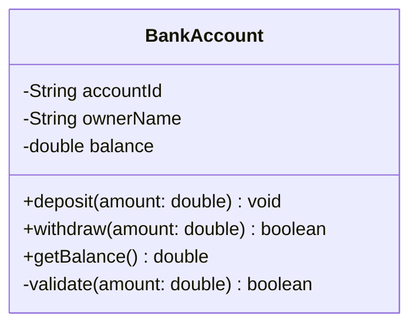

### Static and Abstract Members

- **Static** members are underlined in UML. In Mermaid, append `$` to the member name.
- **Abstract** methods are italicized in UML. In Mermaid, append `*` to the member name.

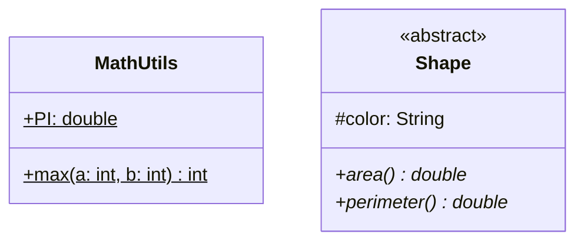

### Interfaces in Mermaid

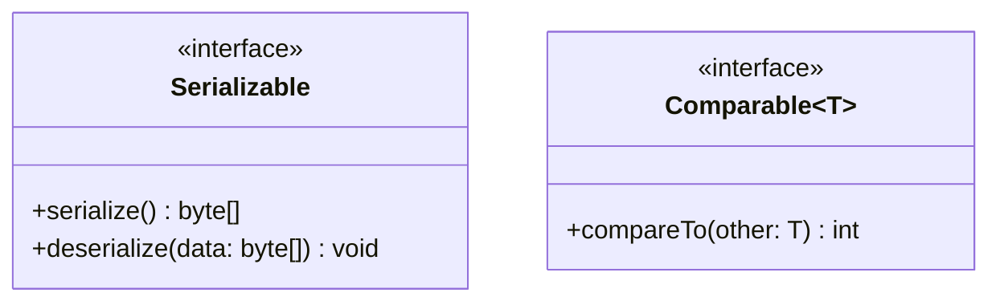

### Enumerations

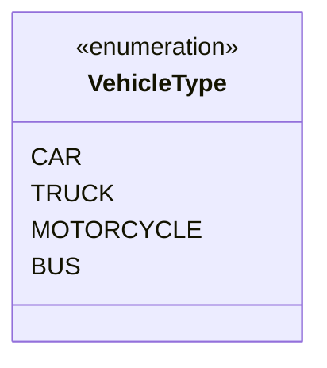

---

## The 6 Relationships -- From Weakest to Strongest

Understanding these six relationships and knowing when to use each one is **critical** for interviews. They are listed from weakest coupling to strongest.

### 1. Dependency (..>) -- "Uses Temporarily"

The weakest relationship. Class A uses Class B, but only transiently -- typically as a method parameter, local variable, or return type. If B changes, A might be affected, but A does not store a reference to B.

**Real-world analogy:** A person uses a taxi. The person does not own the taxi; they just use it temporarily.

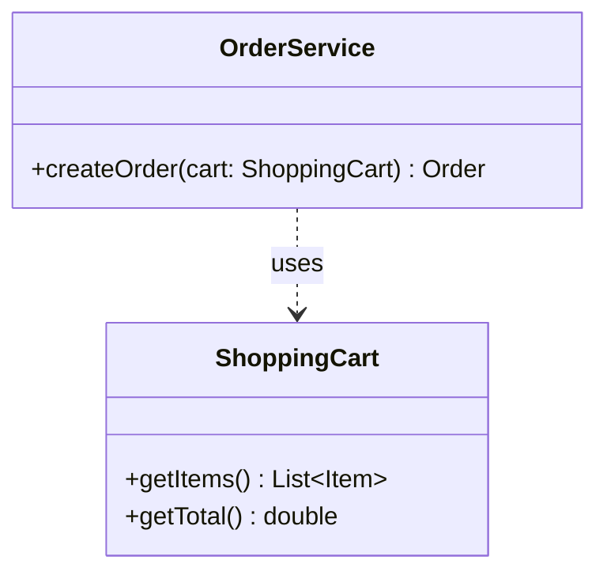

**When to use:** Method parameters, factory methods returning objects, utility class usage.

### 2. Association (-->) -- "Knows About"

A structural relationship where one class holds a reference to another as a field. The two objects have independent lifecycles -- destroying one does not destroy the other.

**Real-world analogy:** A student is enrolled in a course. Both exist independently.

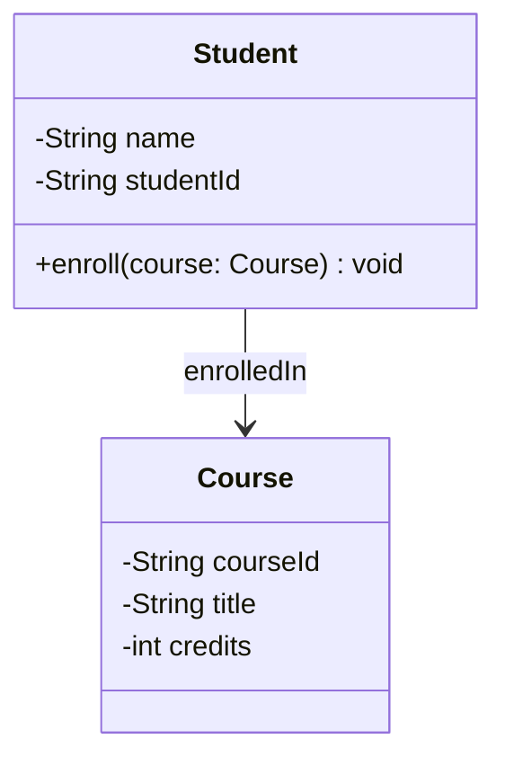

**When to use:** Objects that reference each other but live independently.

### 3. Aggregation (o--) -- "Has-A, Shared Lifetime"

A special form of association representing a whole-part relationship where the **part can exist without the whole**. The whole does not own the part exclusively -- parts can be shared.

**Real-world analogy:** A department has professors, but professors continue to exist if the department is dissolved.

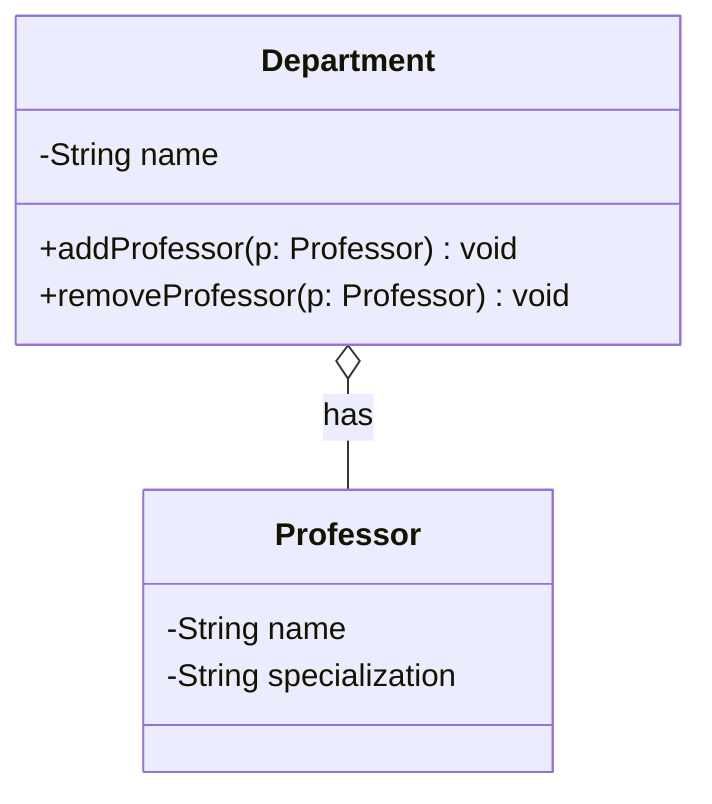

**When to use:** Collections where items are shared or outlive the container. Teams and players, playlists and songs, folders and files (if files can exist outside folders).

### 4. Composition (*--) -- "Has-A, Owned Lifetime"

The strongest whole-part relationship. The **part cannot exist without the whole**. When the whole is destroyed, all its parts are destroyed too. The part belongs exclusively to one whole.

**Real-world analogy:** A house has rooms. If the house is demolished, the rooms cease to exist.

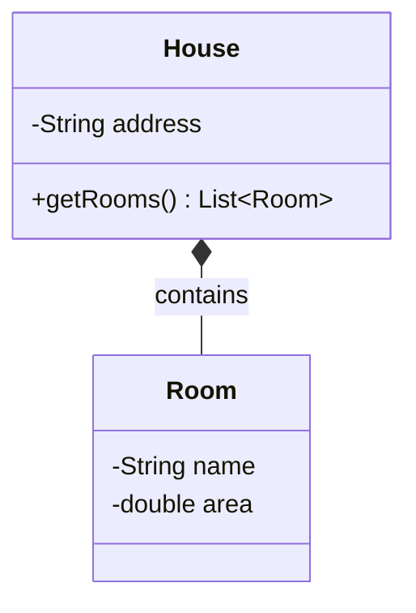

**When to use:** Parts that have no meaning without their parent. Order and OrderLineItems, Car and Engine, Invoice and InvoiceItems.

### 5. Inheritance (--|>) -- "IS-A"

The classic IS-A relationship. A subclass inherits the attributes and methods of a superclass. Represented by a solid line with a hollow triangle arrowhead pointing to the parent.

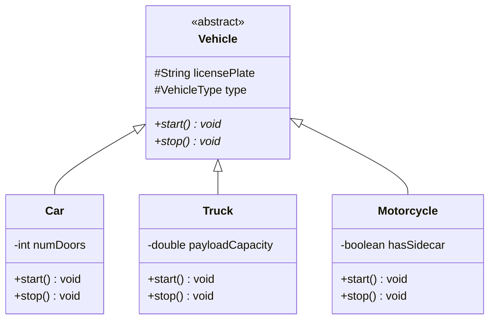

**When to use:** True IS-A relationships. Favor composition over inheritance in actual code, but use inheritance where it genuinely models the domain.

### 6. Realization (..|>) -- "Implements Interface"

A class promises to fulfill the contract defined by an interface. Represented by a dashed line with a hollow triangle arrowhead pointing to the interface.

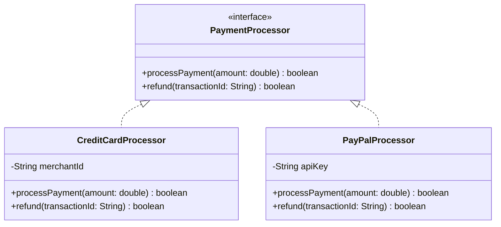

**When to use:** Strategy pattern, dependency injection, plugin architectures -- any time you code to an interface.

---

## Relationship Comparison at a Glance

| Relationship  | Mermaid     | Coupling  | Lifetime Dependency | Example                     |
|---------------|-------------|-----------|---------------------|-----------------------------|
| Dependency    | `..>`       | Weakest   | None                | Service uses DTO            |
| Association   | `-->`       | Weak      | Independent         | Student -> Course           |
| Aggregation   | `o--`       | Medium    | Shared              | Department o-- Professor    |
| Composition   | `*--`       | Strong    | Owned               | Order *-- LineItem          |
| Inheritance   | `--|>`      | Strongest | Permanent           | Car --|> Vehicle             |
| Realization   | `..|>`      | Strong    | Contract            | Processor ..|> PaymentIF    |

**Interview tip:** When unsure between aggregation and composition, ask: "If the parent is deleted, does the child still make sense?" If yes, aggregation. If no, composition.

---

## Multiplicity

Multiplicity indicates how many instances of one class relate to another.

| Notation | Meaning               |
|----------|-----------------------|
| `1`      | Exactly one           |
| `0..1`   | Zero or one           |
| `*`      | Zero or more          |
| `0..*`   | Zero or more (same)   |
| `1..*`   | One or more           |
| `2..5`   | Between 2 and 5       |

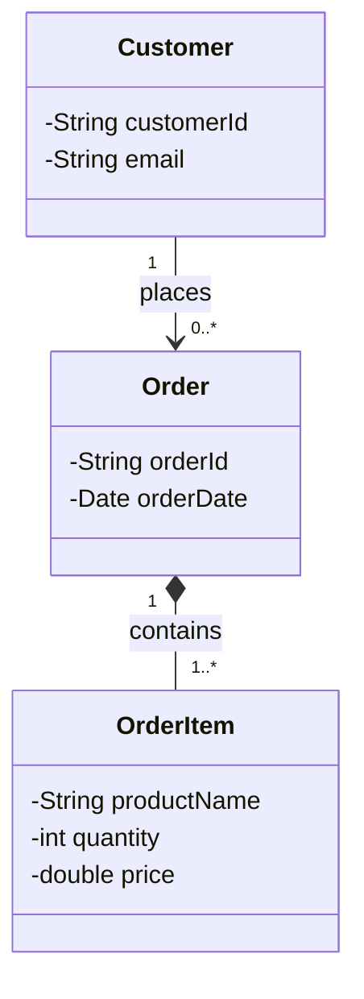

Read: "One Customer places zero or more Orders. One Order contains one or more OrderItems."

---

## Complete Example 1: Parking Lot System

This is the most commonly asked LLD question. Here is the full class diagram.

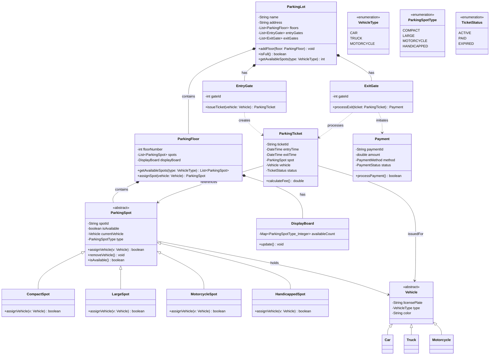

### Key Design Decisions

1. **ParkingSpot is abstract** -- each subclass validates whether a vehicle type fits.
2. **Composition** between ParkingLot -> ParkingFloor -> ParkingSpot. Floors and spots cannot exist without the lot.
3. **Association** between ParkingSpot and Vehicle. The vehicle exists independently; it is just parked there.
4. **Dependency** for EntryGate -> ParkingTicket. The gate creates tickets but does not own them.
5. **Enums** for VehicleType, ParkingSpotType, TicketStatus keep magic strings out of the design.

---

## Complete Example 2: Library Management System

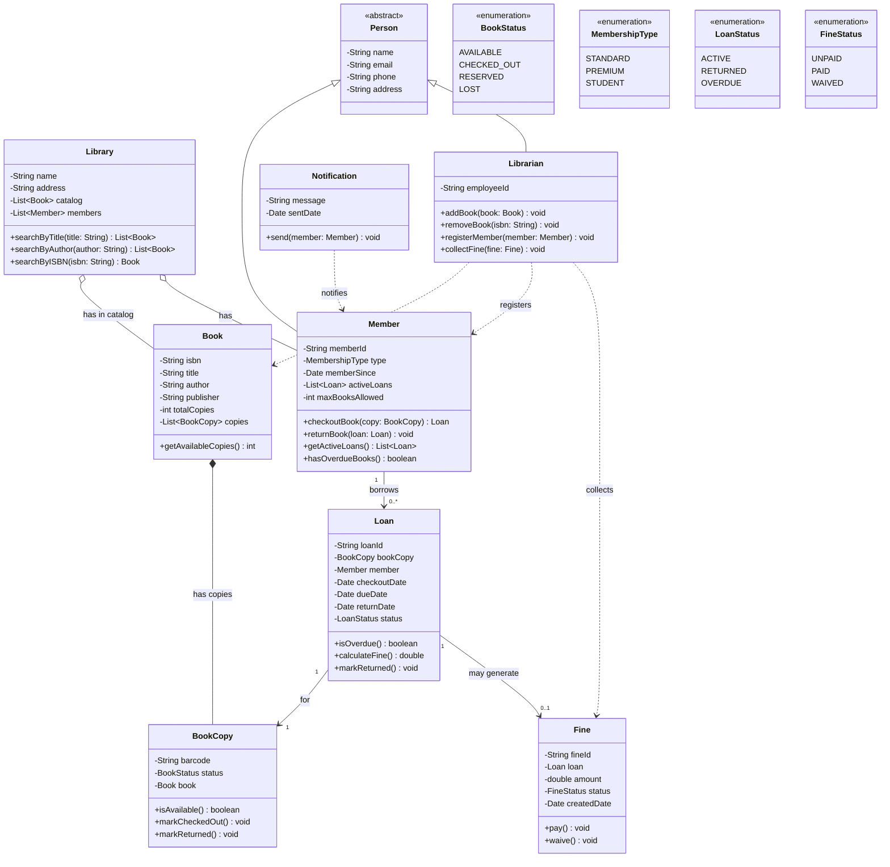

### Key Design Decisions

1. **Book vs BookCopy separation** -- a Book is a title (ISBN-level), while BookCopy is a physical copy with its own barcode and status. This is crucial for tracking which exact copy is checked out.
2. **Person as abstract superclass** -- both Member and Librarian share name, email, phone.
3. **Aggregation** for Library -> Book and Library -> Member. Books and members could conceptually be transferred to another library.
4. **Composition** for Book -> BookCopy. If the book title is removed from the system, its copies go too.
5. **Fine is associated with Loan**, not directly with Member. This traces exactly which checkout caused the fine.

---

## Complete Example 3: Elevator System

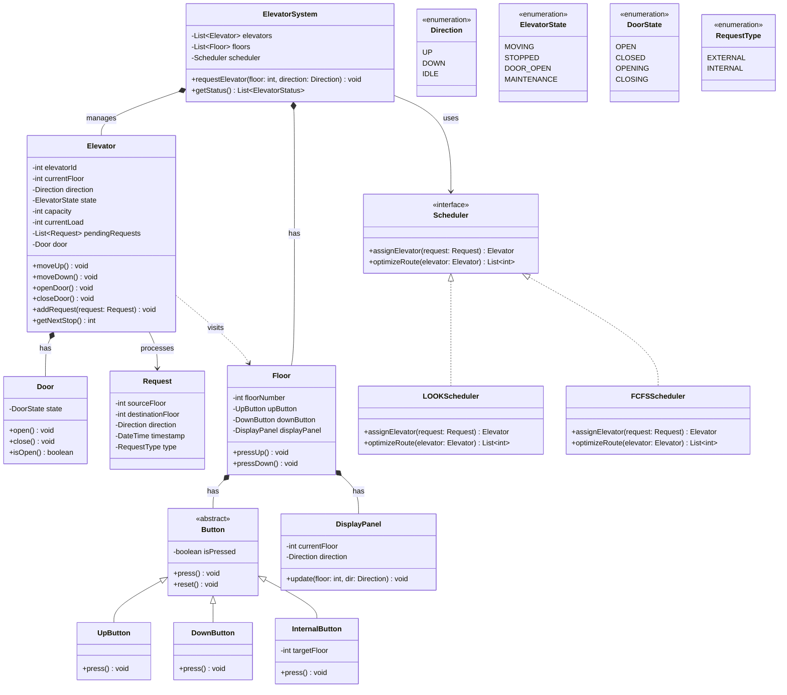

### Key Design Decisions

1. **Scheduler as interface** -- uses Strategy pattern so you can swap LOOK, FCFS, or Shortest-Seek-First algorithms.
2. **Request separates external (floor button) from internal (cabin button)** requests.
3. **Composition** for Elevator -> Door. A door cannot exist without its elevator.
4. **Button hierarchy** -- UpButton, DownButton, InternalButton all share press/reset behavior.
5. **DisplayPanel** on each floor shows which floor the elevator is on and its direction.

---

## How to Draw Class Diagrams in an Interview

Follow this systematic process. Practice it until it is automatic.

### Step 1: Identify Entities (Nouns)

Read the problem statement and extract all nouns. These become candidate classes.

Example for "Design a parking lot system":
> Nouns: parking lot, floor, parking spot, vehicle, car, truck, motorcycle, ticket, gate, payment, display board

**Filter out:** attributes (name, color), primitives (int, string), and duplicates.

### Step 2: Identify Attributes

For each class, ask: "What data does this entity need to hold?"

```
ParkingSpot -> spotId, isAvailable, type
Vehicle -> licensePlate, type, color
Ticket -> ticketId, entryTime, exitTime, status
```

### Step 3: Identify Methods (Verbs)

Extract verbs from the problem requirements. These become methods on the appropriate class.

> "A vehicle enters the lot" -> ParkingLot.assignSpot(vehicle)
> "System issues a ticket" -> EntryGate.issueTicket(vehicle)
> "Payment is calculated" -> Ticket.calculateFee()

### Step 4: Define Relationships

For every pair of classes that interact, pick the right relationship:
- "Does A temporarily use B?" -> Dependency
- "Does A hold a reference to B?" -> Association
- "Does A contain B, but B can exist alone?" -> Aggregation
- "Does A own B, and B dies with A?" -> Composition
- "Is A a kind of B?" -> Inheritance
- "Does A implement B's contract?" -> Realization

### Step 5: Add Multiplicity

For each relationship, state how many of each end participate:
- One ParkingLot has many Floors (1 to *)
- One Floor has many ParkingSpots (1 to *)
- One ParkingSpot holds zero or one Vehicle (1 to 0..1)

### Step 6: Refine

- Extract common fields into abstract base classes
- Introduce interfaces for swappable behavior (Strategy pattern)
- Add enums for fixed sets of values
- Check: does every class have a clear single responsibility?

---

## Common Mistakes to Avoid

### 1. Confusing Aggregation and Composition

**Wrong:** Using composition between Library and Member (members exist without the library).
**Right:** Aggregation for Library-Member, composition for Order-OrderLineItem.

### 2. Making Everything Public

**Wrong:** All attributes marked `+`.
**Right:** Attributes should almost always be `-` (private). Only methods that form the public API should be `+`.

### 3. God Class

**Wrong:** One class with 20+ methods that does everything.
**Right:** Split responsibilities. A ParkingLot should not also handle payment processing.

### 4. Missing Abstract Classes / Interfaces

**Wrong:** Repeating the same attributes in Car, Truck, Motorcycle without a Vehicle parent.
**Right:** Extract a common abstract Vehicle class.

### 5. Bidirectional Associations Everywhere

**Wrong:** Student knows Course AND Course knows Student for every relationship.
**Right:** Use unidirectional associations unless both directions are genuinely needed.

### 6. Putting Implementation Details in the Diagram

**Wrong:** Including HashMap, ArrayList, synchronized, getter/setter for every field.
**Right:** Use domain-level types. Show `List<Item>` not `ArrayList<Item>`. Omit trivial getters/setters.

### 7. Forgetting Enums

**Wrong:** Using raw strings for status fields like "ACTIVE", "PAID", "EXPIRED".
**Right:** Define an enum class and reference it as the attribute type.

### 8. No Multiplicity Labels

**Wrong:** Drawing lines without specifying how many objects participate.
**Right:** Always add multiplicity -- it conveys critical design information.

---

## Quick Reference: Mermaid Class Diagram Syntax

```
classDiagram
    %% Class definition
    class ClassName {
        -privateAttr: Type
        +publicMethod() ReturnType
    }

    %% Stereotypes
    class MyInterface {
        <<interface>>
    }
    class MyAbstract {
        <<abstract>>
    }
    class MyEnum {
        <<enumeration>>
    }

    %% Relationships
    A --|> B : inherits
    A ..|> B : implements
    A --> B : association
    A ..> B : dependency
    A o-- B : aggregation
    A *-- B : composition

    %% Multiplicity
    A "1" --> "0..*" B : label

    %% Generics
    class Container~T~ {
        +add(item: T) void
        +get(index: int) T
    }

    %% Notes
    note for ClassName "This is a note"
```

---

## Interview Cheat Sheet

| Situation | What to Draw |
|-----------|-------------|
| Interviewer says "Design X" | Start with class diagram immediately |
| Multiple similar objects | Create inheritance hierarchy |
| Swappable algorithms | Interface + multiple implementations |
| Whole-part with ownership | Composition (*--) |
| Whole-part without ownership | Aggregation (o--) |
| Object uses another briefly | Dependency (..>) |
| Object holds reference to another | Association (-->) |
| Fixed set of values | Enumeration |
| Shared behavior across classes | Abstract base class |

**Time budget in a 45-minute interview:**
- 5 minutes: clarify requirements, identify entities
- 10 minutes: draw class diagram with relationships
- 15 minutes: add key methods, discuss design patterns
- 15 minutes: add sequence diagrams for complex flows, discuss tradeoffs
