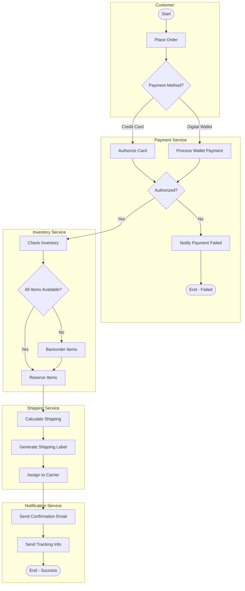
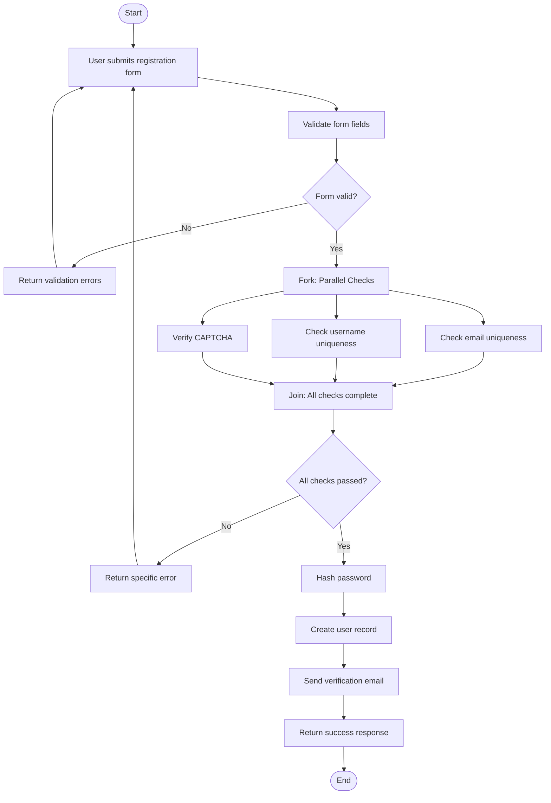
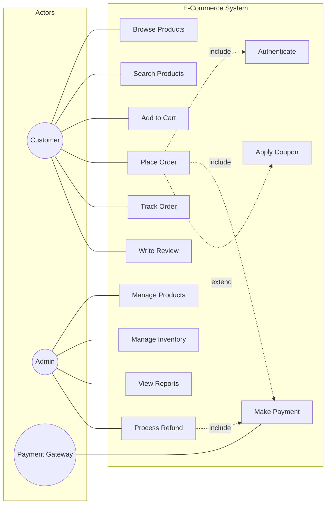
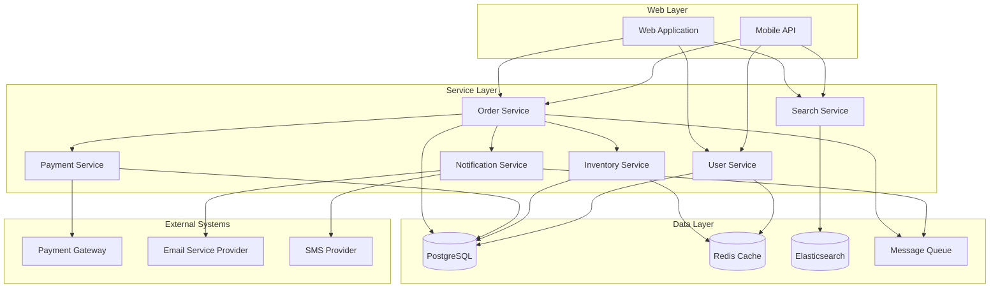
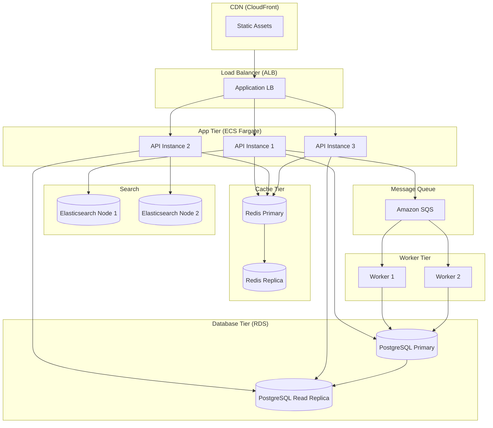

# Other UML Diagrams -- Activity, Use Case, Component, Deployment

## Overview

Class, sequence, and state diagrams handle 90% of LLD interview situations. The remaining diagrams are less commonly asked but can differentiate you when the interviewer asks about business processes, system actors, module boundaries, or physical infrastructure.

---

## 1. Activity Diagrams -- Modeling Workflows and Business Processes

Activity diagrams model the flow of activities in a process. Think of them as enhanced flowcharts with support for concurrency, swimlanes, and decision points.

### Core Elements

| Element | Description | Notation |
|---------|-------------|----------|
| Activity | A unit of work | Rounded rectangle |
| Initial node | Starting point | Filled circle |
| Final node | Ending point | Circled filled circle |
| Decision | Branching point | Diamond with `[guard]` labels |
| Merge | Rejoining branches | Diamond where paths converge |
| Fork | Splitting into parallel flows | Thick horizontal bar |
| Join | Synchronizing parallel flows | Thick horizontal bar |
| Swimlane | Responsibility partition | Vertical or horizontal lane |

### When to Use

- "Show me the business process for order fulfillment"
- "How does the checkout workflow work end to end?"
- Any time you need to show branching, looping, and parallel work in a process

### Key Difference from Sequence Diagrams

Sequence diagrams focus on **which objects** interact over time. Activity diagrams focus on **what activities** happen, in what order, and who is responsible for each (via swimlanes).

### Example: Order Processing Workflow with Swimlanes

This diagram shows an e-commerce order processing flow across four departments. Mermaid does not natively support swimlane activity diagrams, so we use a flowchart with subgraphs to represent lanes.



### Example: User Registration with Parallel Validation



### Activity Diagram Tips

- **Use swimlanes** to show which service/team/actor is responsible for each activity.
- **Show the fork/join** for activities that genuinely happen in parallel.
- **Decision diamonds** must have labeled outgoing paths covering all cases.
- Do not over-detail: an activity like "Validate Input" does not need to be broken down further unless the interviewer asks.

---

## 2. Use Case Diagrams -- Actors, System Boundaries, and Capabilities

Use case diagrams show what a system does from the user's perspective. They answer: "Who uses the system, and what can they do with it?"

### Core Elements

| Element | Description | Notation |
|---------|-------------|----------|
| Actor | External entity interacting with the system | Stick figure |
| Use Case | A capability the system provides | Oval / ellipse |
| System Boundary | The scope of the system | Rectangle around use cases |
| Association | Actor participates in use case | Solid line |
| Include | Use case always includes another | Dashed arrow with `<<include>>` |
| Extend | Use case optionally extends another | Dashed arrow with `<<extend>>` |
| Generalization | Actor or use case inheritance | Solid arrow with hollow triangle |

### Include vs Extend

**Include (<<include>>):** The base use case ALWAYS invokes the included use case. It is mandatory, like a function call.
- "Place Order" <<include>> "Authenticate User" -- you must authenticate to place an order.

**Extend (<<extend>>):** The extending use case OPTIONALLY enhances the base. It is conditional, like a plugin.
- "Place Order" <<extend>> "Apply Coupon" -- applying a coupon is optional during order placement.

### Example: E-Commerce System

Mermaid does not have native use case diagram syntax. We can approximate using a flowchart with descriptive structure.



### Use Case Description Table

For each use case, you should be able to describe it briefly:

| Use Case | Primary Actor | Description | Precondition |
|----------|--------------|-------------|--------------|
| Place Order | Customer | Customer checks out cart items | Cart is non-empty, user authenticated |
| Make Payment | Payment Gateway | Process payment for an order | Order total calculated |
| Apply Coupon | Customer | Apply discount code to order | Valid coupon exists |
| Track Order | Customer | View real-time order status | Order has been placed |
| Manage Products | Admin | CRUD operations on product catalog | Admin authenticated |
| Process Refund | Admin | Reverse a payment transaction | Order exists, payment was made |

### Actor Generalization

Actors can inherit from other actors. An Admin can do everything a Customer can do, plus more.

```
Admin --|> Customer    (Admin inherits Customer's use cases)
```

This means Admin can Browse Products, Place Orders, AND Manage Products.

### When to Use

- "What are the main features of this system?"
- "Who are the users and what can they do?"
- Early in a design discussion when scoping what to build
- Rarely asked to draw explicitly in LLD interviews, but the thinking behind it is useful for requirements gathering

---

## 3. Component Diagrams -- Module Boundaries and Interfaces

Component diagrams show the high-level modules of a system and how they interact through interfaces. They sit between class diagrams (too detailed) and deployment diagrams (too physical).

### Core Elements

| Element | Description |
|---------|-------------|
| Component | A module, service, or library | 
| Provided Interface | Interface the component exposes (lollipop) |
| Required Interface | Interface the component needs (socket) |
| Dependency | One component depends on another |
| Port | Connection point on a component |

### Example: E-Commerce Platform Components



### Provided and Required Interfaces

In a more detailed component diagram, each component declares:
- **Provided interfaces** -- what it offers to others (e.g., OrderService provides IOrderManagement)
- **Required interfaces** -- what it needs from others (e.g., OrderService requires IPaymentProcessing)

```
OrderService
    provides: IOrderManagement, IOrderQuery
    requires: IPaymentProcessing, IInventoryCheck, INotification

PaymentService
    provides: IPaymentProcessing, IRefund
    requires: IPaymentGateway (external)
```

This maps directly to dependency injection in code: each component depends on interfaces, not concrete implementations.

### When to Use

- "How would you structure the services?"
- "What are the main modules?"
- Showing a high-level architecture before diving into class-level detail
- Useful in HLD but also in LLD when justifying package/module boundaries

---

## 4. Deployment Diagrams -- Physical Infrastructure

Deployment diagrams show how software components map to physical or virtual infrastructure: servers, containers, cloud services.

### Core Elements

| Element | Description |
|---------|-------------|
| Node | Physical or virtual machine |
| Artifact | Deployable unit (JAR, Docker image, binary) |
| Communication path | Network connection between nodes |
| Execution environment | Runtime (JVM, Docker, Node.js) |

### Example: Cloud Deployment



### When to Use

- "How would you deploy this?"
- "Show me the infrastructure"
- Primarily a high-level design (HLD) artifact, but useful when the interviewer asks about scaling, replication, or failover

---

## Which Diagram for Which Interview Question

This is the most important table in these notes. Memorize it.

| Interview Situation | Primary Diagram | Why |
|---|---|---|
| "Design the classes for X" | **Class diagram** | Shows entities, attributes, methods, relationships |
| "Walk me through the flow of X" | **Sequence diagram** | Shows object interactions over time |
| "What states can X have?" | **State diagram** | Shows lifecycle, transitions, guards |
| "Show me the business process for X" | **Activity diagram** | Shows workflow with decisions, parallelism, swimlanes |
| "What are the system actors/features?" | **Use case diagram** | Shows who does what at a high level |
| "How are the modules organized?" | **Component diagram** | Shows service boundaries and interfaces |
| "How would you deploy this?" | **Deployment diagram** | Shows infrastructure and topology |
| "Design a vending machine / ATM" | **State + Class** | State machine for behavior, class diagram for structure |
| "Design an e-commerce system" | **Class + Sequence** | Class for entities, sequence for checkout/order flows |
| "How does authentication work?" | **Sequence diagram** | Shows the multi-step auth flow between services |

---

## Interview Strategy: Which Diagrams to Draw and When

### The Default Approach (Most LLD Interviews)

1. **Always start with a class diagram.** This is non-negotiable. It shows you can identify entities, define responsibilities, and model relationships.

2. **Add a sequence diagram for the most complex flow.** Pick the core use case (e.g., "place order", "book ticket", "process payment") and show how objects collaborate.

3. **Add a state diagram if the domain has lifecycle objects.** Orders, tickets, connections, machines -- anything with clearly defined states.

### Time Allocation

In a typical 45-minute LLD interview:

```
Minutes 0-5:    Clarify requirements, ask questions
Minutes 5-15:   Draw class diagram (entities, relationships, key methods)
Minutes 15-25:  Draw sequence diagram for core flow
Minutes 25-35:  Discuss design patterns, trade-offs, edge cases
Minutes 35-40:  Optional: state diagram if applicable
Minutes 40-45:  Wrap up, questions for interviewer
```

### Signals You Are Sending

| What You Draw | Signal to Interviewer |
|---|---|
| Clean class diagram with proper relationships | "This candidate understands OOP and can model a domain" |
| Sequence diagram with error handling | "This candidate thinks about failure modes" |
| State diagram | "This candidate understands stateful systems" |
| Activity diagram with swimlanes | "This candidate can model business processes" |
| All diagrams with correct notation | "This candidate has strong fundamentals" |

---

## Relationship Between Diagrams

The diagrams are not independent. They form a cohesive picture of the system:

```
Use Case Diagram (what the system does)
    |
    v
Class Diagram (what entities exist and how they relate)
    |
    +--> Sequence Diagram (how entities interact for each use case)
    |
    +--> State Diagram (how individual entities change over time)
    |
    v
Component Diagram (how classes group into modules)
    |
    v
Deployment Diagram (how modules map to infrastructure)
```

- **Use cases** drive which **classes** you need.
- **Classes** appear as participants in **sequence diagrams**.
- **State diagrams** model the lifecycle of individual classes.
- **Classes** group into **components**.
- **Components** deploy onto **infrastructure**.

---

## Quick Decision Framework

When the interviewer asks you to design something, mentally run through these questions:

1. **What are the entities?** --> Class diagram (always yes)
2. **Is there a complex multi-step flow?** --> Sequence diagram (usually yes)
3. **Does any entity have a lifecycle with distinct states?** --> State diagram (sometimes)
4. **Is there a business process with branching and parallelism?** --> Activity diagram (rarely in LLD)
5. **Are there multiple actor types with different permissions?** --> Use case diagram (rarely in LLD)

For most LLD interviews, you will draw (1) and (2), sometimes (3), and rarely (4) or (5).

---

## Final Tips

1. **Do not draw diagrams for the sake of drawing.** Every diagram should answer a question or clarify a design decision.

2. **Narrate as you draw.** Explain your thinking: "I am making ParkingSpot abstract because we have different spot types with different validation rules."

3. **Use correct notation.** Knowing the difference between composition and aggregation, or between include and extend, signals expertise.

4. **Keep diagrams clean.** 5-10 classes in a class diagram, 4-7 participants in a sequence diagram. Add more only if the interviewer asks for detail.

5. **Practice the top 10 LLD problems** with all applicable diagram types:
   - Parking Lot (class + state for spot availability)
   - Library Management (class + sequence for checkout flow)
   - Elevator System (class + state for elevator behavior)
   - Vending Machine (state + class for State pattern)
   - BookMyShow / Movie Booking (class + sequence for seat locking)
   - Chess / Tic-Tac-Toe (class + state for game state)
   - ATM (class + state + sequence for withdrawal flow)
   - Hotel Booking (class + sequence for reservation flow)
   - Food Delivery (class + sequence + state for order lifecycle)
   - Social Media (class + sequence for post/feed flow)
