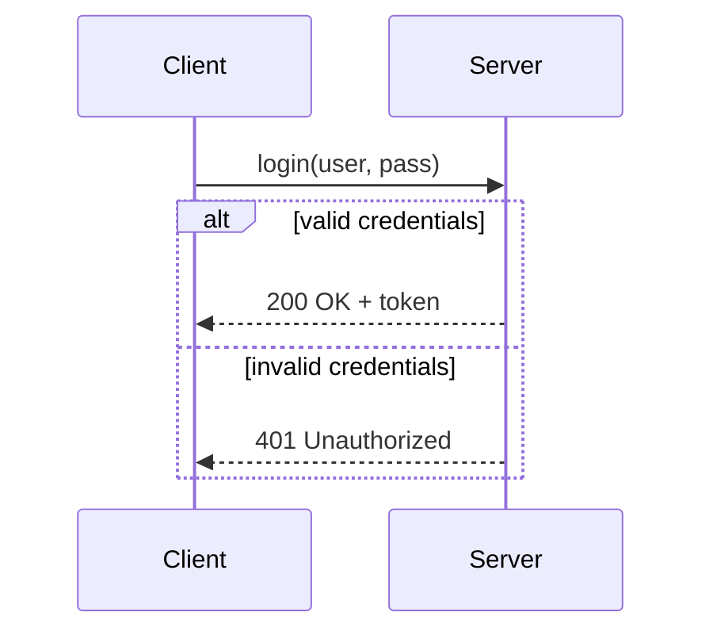
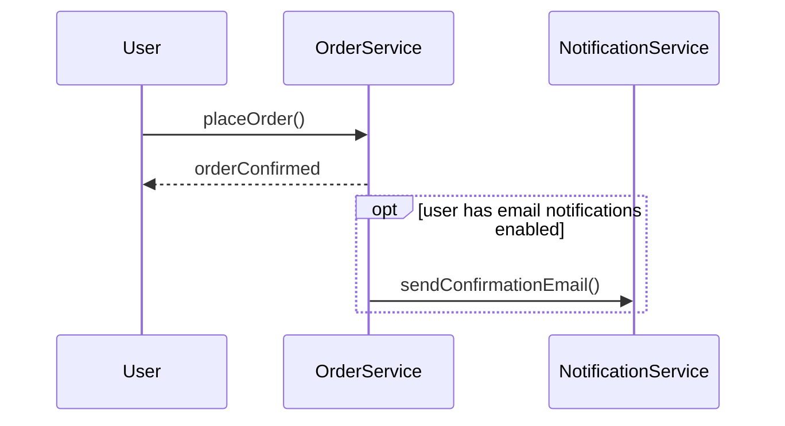
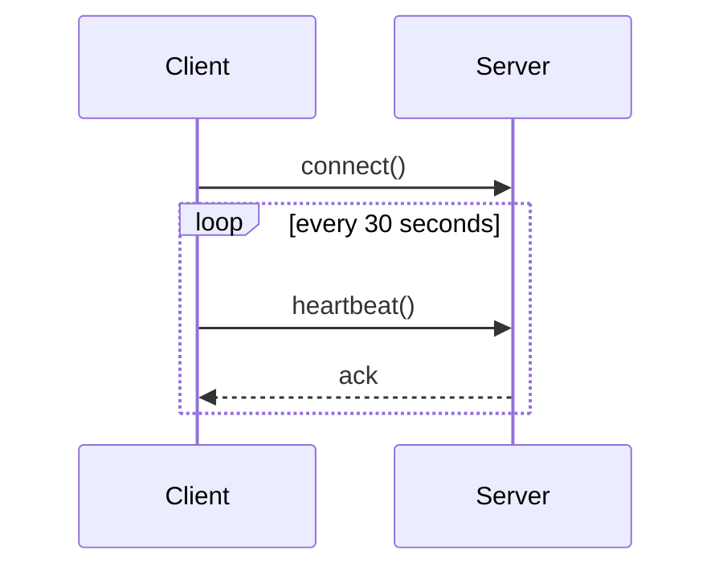
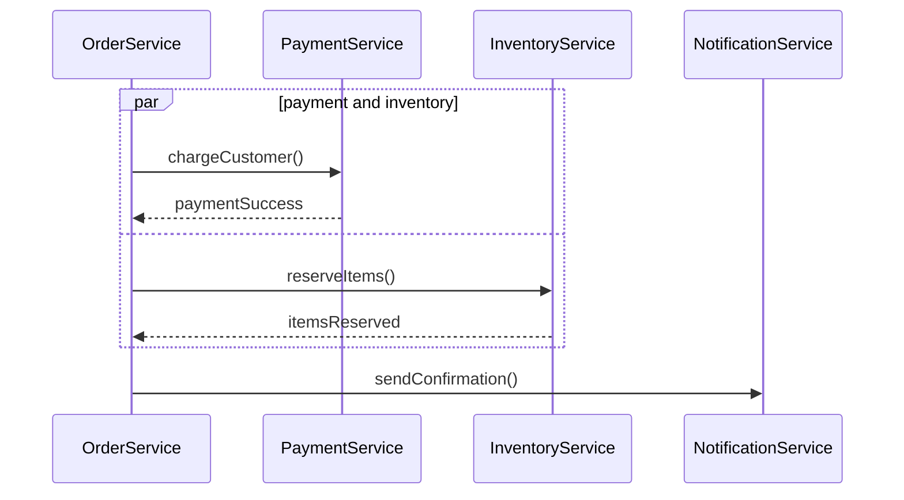
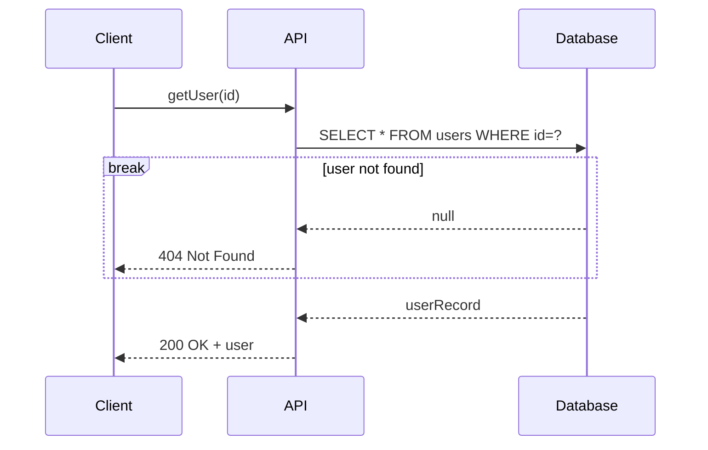
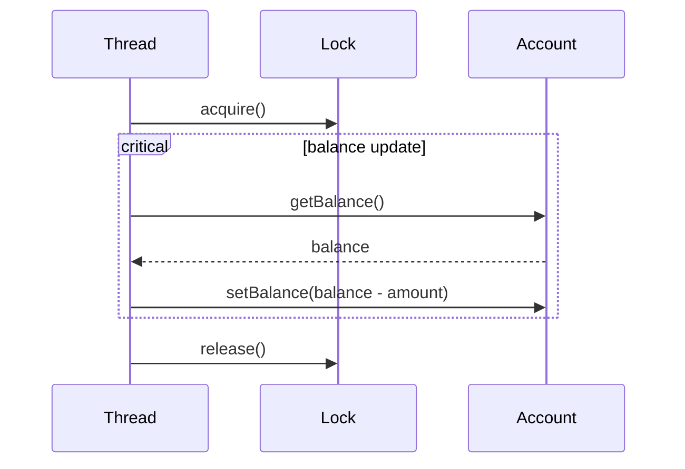
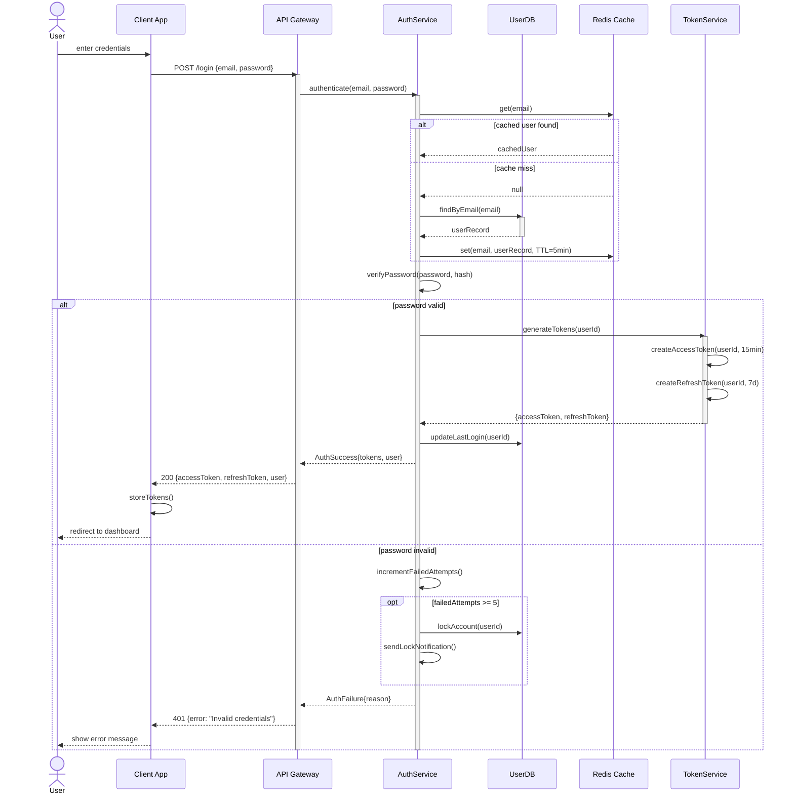
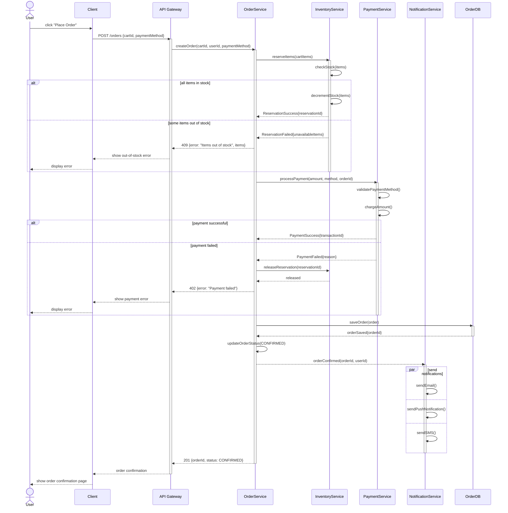
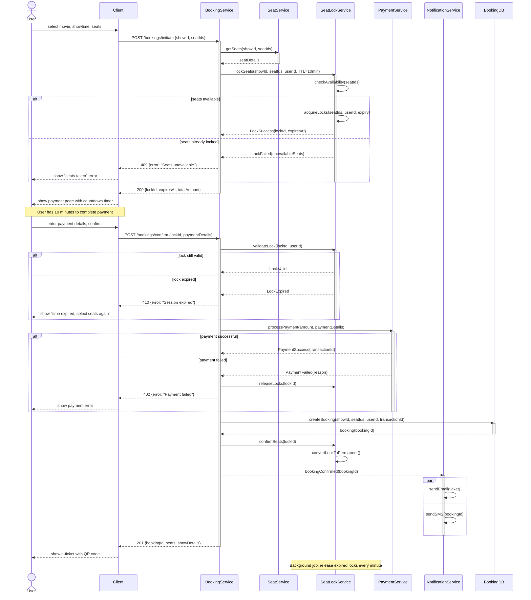

# Sequence Diagrams -- The Second Most Important UML for LLD Interviews

## Why Sequence Diagrams Matter

While class diagrams show the **static structure** (what exists), sequence diagrams show the **dynamic behavior** (what happens). When an interviewer says "walk me through the flow of placing an order" or "how do these objects interact?", they want a sequence diagram.

A sequence diagram shows:
- **Which objects** participate in a use case
- **What messages** they send to each other
- **In what order** those messages occur
- **What is returned** at each step

---

## Anatomy of a Sequence Diagram

### Core Elements

| Element | Description | Mermaid Syntax |
|---------|-------------|----------------|
| Participant / Lifeline | An object or actor involved | `participant A` or `actor A` |
| Solid arrow (->>)  | Synchronous message (call) | `A->>B: message` |
| Dashed arrow (-->>)  | Asynchronous message (fire-and-forget) | `A-->>B: message` |
| Dashed return (--)  | Return value | `B-->>A: response` |
| Activation box | Period when an object is processing | `activate B` / `deactivate B` |
| Self-message | Object calls itself | `A->>A: validate()` |
| Note | Annotation | `Note over A,B: text` |
| Destruction | Object is destroyed | `destroy B` |

### Message Types in Detail

```
Synchronous:   A->>B     Caller waits for response (method call)
Async:         A-->>B    Caller does not wait (event, queue message)
Return:        B-->>A    Return value (dashed, going back)
Create:        A->>+B    Create and activate B
```

---

## Fragments -- Modeling Control Flow

Fragments model conditional logic, loops, and parallel execution within a sequence diagram.

### alt (if/else)

Models conditional branching. Equivalent to if-else.



### opt (optional)

Models behavior that occurs only if a condition is true. Equivalent to a single if with no else.



### loop

Models repeated behavior.



### par (parallel)

Models actions that happen concurrently.



### break

Models an early exit when an exceptional condition is met.



### critical

Models a critical section where interactions must complete atomically.



---

## Complete Example 1: User Login Flow

This is a bread-and-butter interview question. Show the full authentication flow.



### What This Diagram Shows an Interviewer

1. **Cache-aside pattern** -- check Redis before hitting DB.
2. **Token-based auth** -- separate access and refresh tokens with different TTLs.
3. **Account lockout** -- brute-force protection after 5 failed attempts.
4. **Separation of concerns** -- API Gateway, AuthService, TokenService, and DB are distinct participants.
5. **Error handling** -- both the happy path and failure path are shown.

---

## Complete Example 2: Place Order Flow

An e-commerce order placement with payment, inventory, and notifications.



### What This Diagram Shows an Interviewer

1. **Saga-like compensation** -- if payment fails, inventory reservation is released.
2. **Sequential dependency** -- payment only runs after inventory is reserved.
3. **Async notifications** -- fire-and-forget (dashed arrow), does not block the order response.
4. **Parallel notifications** -- email, push, and SMS sent concurrently.
5. **Clear error handling** at each step with distinct HTTP status codes.

---

## Complete Example 3: Book Movie Ticket

A seat-locking flow with temporary reservation and timeout.



### What This Diagram Shows an Interviewer

1. **Optimistic locking with TTL** -- seats are temporarily locked with a 10-minute expiry.
2. **Two-phase booking** -- initiate (lock) then confirm (pay). This prevents double-booking.
3. **Countdown timer on client** -- user sees how much time remains to complete payment.
4. **Lock validation** before payment -- catches expired sessions.
5. **Background cleanup** -- a scheduled job releases locks that users abandoned.
6. **Compensation** -- if payment fails, locks are explicitly released.

---

## How to Draw Sequence Diagrams in an Interview

### Step 1: Pick ONE Use Case

Do not try to show the entire system. Pick the most interesting or complex use case and diagram just that flow.

Good choices:
- The "happy path" of the core functionality
- A flow with interesting error handling or concurrency
- A flow the interviewer specifically asks about

### Step 2: Identify Participants

List the objects (not classes -- specific instances or services) that participate in this use case. Draw them left to right in roughly the order they first appear.

Typical participants in an LLD sequence diagram:
- Actor (User, Admin)
- Client / UI
- Controller / API Gateway
- Domain Services (OrderService, PaymentService)
- External Services (email provider, payment gateway)
- Database / Cache

### Step 3: Draw the Happy Path First

Walk through the success scenario from left to right, top to bottom. Show each method call and its return value.

### Step 4: Add Error Handling

Use `alt` fragments to show what happens when things fail:
- Invalid input
- Insufficient inventory
- Payment declined
- Timeout

### Step 5: Add Activation Boxes

Show when each object is actively processing. This makes it clear which object is doing work at each point in time.

### Step 6: Mark Async vs Sync

Use solid arrows (->>)  for synchronous calls where the caller waits. Use dashed arrows (-->>) for fire-and-forget async calls (like sending to a message queue).

---

## When to Use Sequence Diagrams

| Situation | Use Sequence Diagram? |
|-----------|----------------------|
| "Walk me through how X works" | Yes -- this is exactly what sequence diagrams show |
| Complex multi-service interaction | Yes -- shows ordering and dependencies |
| API call chains with error handling | Yes -- alt fragments show branching |
| Simple CRUD operation | Probably not -- too trivial |
| "Show me all the classes" | No -- use a class diagram |
| Concurrent or parallel flows | Yes -- par fragment shows concurrency |
| Long-running saga with compensation | Yes -- shows rollback steps clearly |

---

## Mermaid Sequence Diagram Syntax Reference

```
sequenceDiagram
    %% Participants (left to right order)
    actor U as User
    participant A as ServiceA
    participant B as ServiceB

    %% Messages
    A->>B: synchronous call
    A-->>B: async message
    B-->>A: return value
    A->>A: self-call

    %% Activation
    activate A
    deactivate A
    %% Or shorthand:
    A->>+B: call (auto-activate)
    B-->>-A: return (auto-deactivate)

    %% Fragments
    alt condition
        A->>B: do this
    else other condition
        A->>B: do that
    end

    opt optional condition
        A->>B: maybe do this
    end

    loop description
        A->>B: repeated action
    end

    par parallel task 1
        A->>B: task 1
    and parallel task 2
        A->>C: task 2
    end

    critical critical section
        A->>B: atomic operation
    end

    break exception condition
        B-->>A: error
    end

    %% Notes
    Note over A: single participant note
    Note over A,B: spanning note
    Note left of A: left note
    Note right of B: right note

    %% Numbering
    autonumber
```

---

## Common Mistakes in Sequence Diagrams

### 1. Too Many Participants

**Wrong:** 15 participants making the diagram unreadable.
**Right:** Limit to 5-7 participants. Group related services if needed.

### 2. Missing Return Arrows

**Wrong:** Showing calls going right but never showing what comes back.
**Right:** Always show the return value, even if it is just "ack" or "void."

### 3. No Error Handling

**Wrong:** Only showing the happy path.
**Right:** Use alt/break fragments to show at least one failure scenario. Interviewers specifically look for this.

### 4. Wrong Arrow Types

**Wrong:** Using synchronous arrows for message queue interactions.
**Right:** Use dashed arrows (async) for queues, events, notifications.

### 5. No Activation Boxes

**Wrong:** Flat lifelines with no indication of which object is processing.
**Right:** Show activation boxes to clarify processing time and call depth.

### 6. Trying to Show Everything

**Wrong:** One massive sequence diagram covering login, search, order, payment, and delivery.
**Right:** One diagram per use case. Focus on depth, not breadth.

---

## Sequence Diagrams and Design Patterns

Sequence diagrams are excellent for illustrating how design patterns work at runtime:

| Pattern | What the Sequence Diagram Shows |
|---------|-------------------------------|
| Observer | Subject notifying all registered observers |
| Chain of Responsibility | Request passed from handler to handler |
| Strategy | Client calling the strategy interface, dispatched to concrete strategy |
| Command | Invoker executing a command, command calling receiver |
| Mediator | All participants communicating through the mediator |
| Proxy | Client calling proxy, proxy forwarding to real subject |

These runtime-behavior patterns are much clearer in sequence diagrams than in class diagrams alone.
