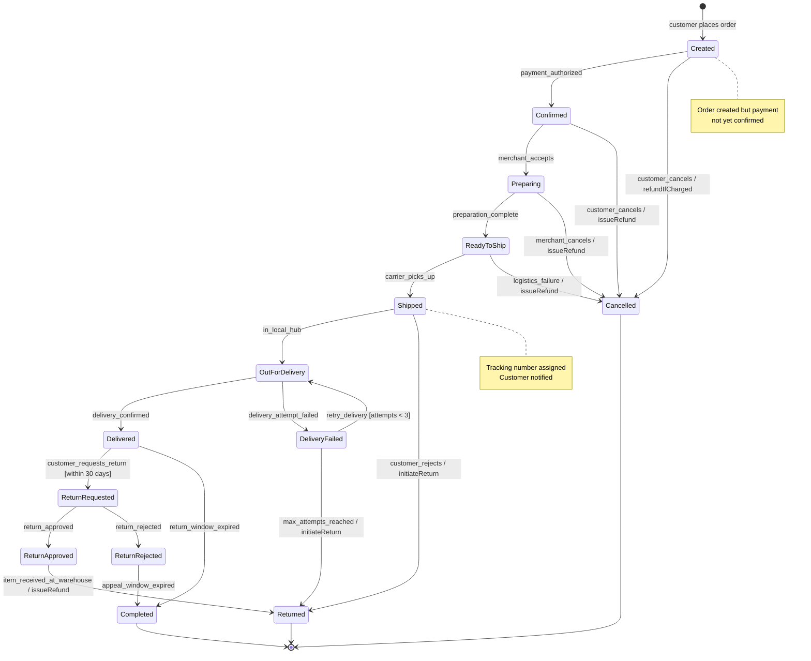
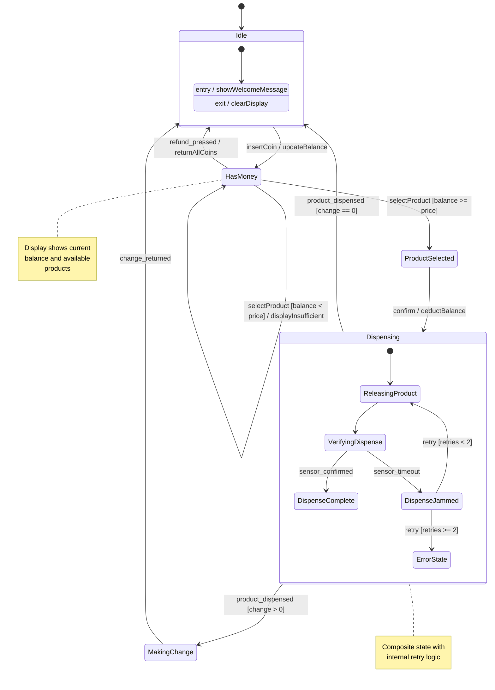
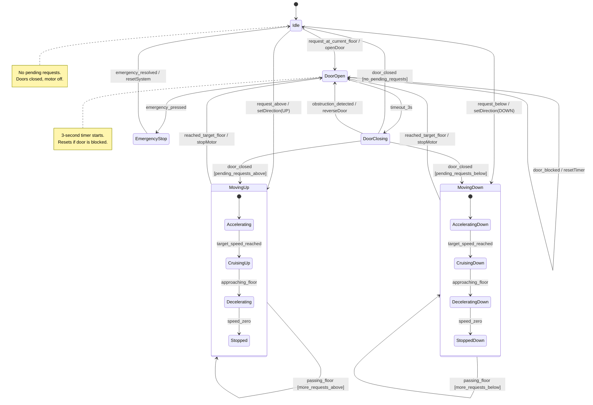
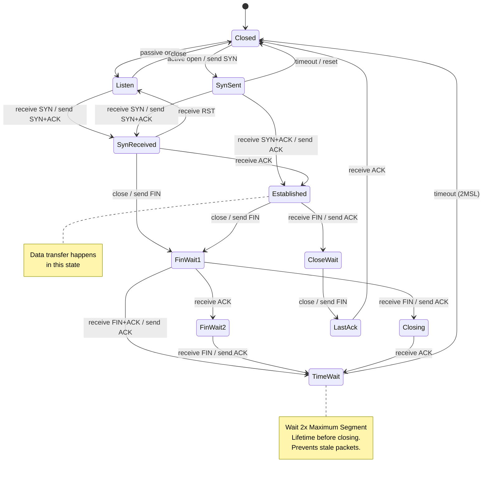
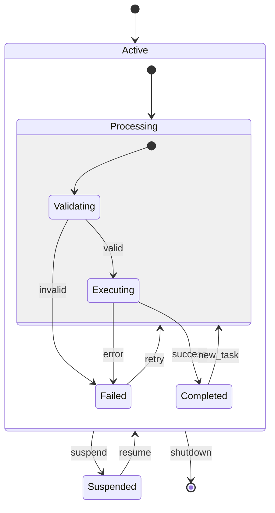
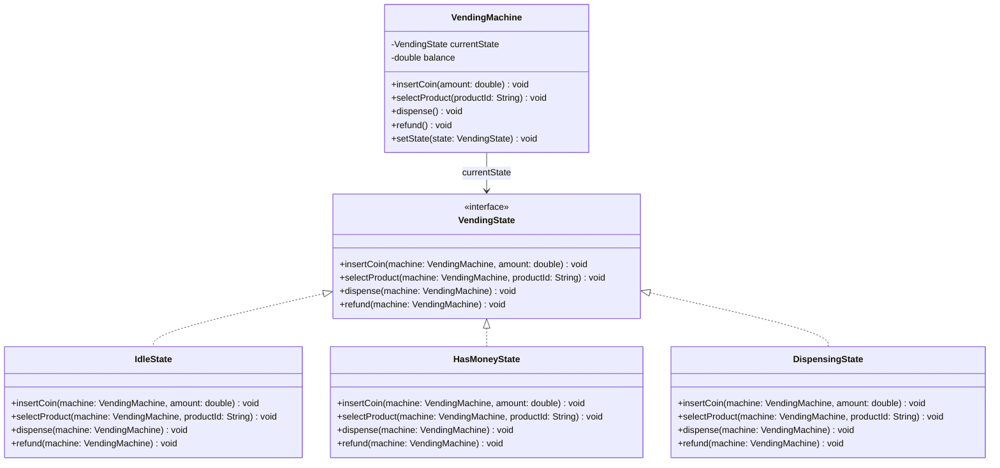

# State Diagrams -- Modeling Object Lifecycles

## When to Use State Diagrams

State diagrams shine when an object has a well-defined lifecycle with distinct states and transitions. If you hear any of these in an interview, think state diagram:

- "What are the different states of an order?"
- "Design a vending machine"
- "Model the elevator behavior"
- "How does a connection lifecycle work?"

The key question: **Does this object change behavior based on its current state?** If yes, draw a state diagram.

---

## Anatomy of a State Diagram

### Core Elements

| Element | Description | Notation |
|---------|-------------|----------|
| State | A condition the object is in | Rounded rectangle |
| Transition | A change from one state to another | Arrow with label |
| Event | What triggers the transition | Label on arrow |
| Guard | Condition that must be true | `[condition]` in brackets |
| Action | What happens during transition | `/ action` after event |
| Entry action | Runs when entering a state | `entry / action` inside state |
| Exit action | Runs when leaving a state | `exit / action` inside state |
| Initial state | Where the lifecycle begins | Filled circle |
| Final state | Where the lifecycle ends | Circled filled circle |

### Transition Syntax

```
event [guard] / action
```

Example: `payment_received [amount >= total] / generateReceipt`

- The **event** triggers the transition.
- The **guard** must be true for the transition to fire.
- The **action** executes as the transition occurs.

---

## Mermaid stateDiagram-v2 Syntax

```
stateDiagram-v2
    [*] --> State1          %% initial transition
    State1 --> State2 : event
    State2 --> State3 : event [guard]
    State3 --> [*]          %% final state

    state State1 {          %% composite state
        [*] --> SubState1
        SubState1 --> SubState2
    }

    note right of State1
        This is a note
    end note
```

---

## Complete Example 1: Order Lifecycle

This is the most commonly asked state diagram question. Orders have a rich lifecycle with multiple paths including cancellation and returns.



### Key Design Decisions

1. **Cancellation is possible from multiple states** but not after shipping (real-world constraint).
2. **DeliveryFailed has a guard** `[attempts < 3]` -- retry up to 3 times, then auto-return.
3. **Return window** is time-bounded: 30 days after delivery.
4. **Refund action** is explicitly noted on transitions where money moves back.
5. **Two terminal states** -- Completed (successful lifecycle) and Cancelled/Returned (unsuccessful).

---

## Complete Example 2: Vending Machine

A classic state machine interview question. The vending machine responds differently based on how much money has been inserted and whether a product has been selected.



### Key Design Decisions

1. **Guard conditions** prevent product selection when balance is insufficient.
2. **Self-transition** on HasMoney: inserting more coins stays in the same state but updates balance.
3. **Composite state** for Dispensing: internally handles the mechanical process including jam detection.
4. **Change-making** is a separate state -- do not return to Idle until change is fully dispensed.
5. **Refund** is available from HasMoney -- user can always get their money back before confirming.

---

## Complete Example 3: Elevator

An elevator is a stateful system where behavior depends on the current state, pending requests, and direction of travel.



### Key Design Decisions

1. **Three primary states** -- Idle, Moving (Up/Down), DoorOpen -- map to real elevator behavior.
2. **Composite states** for MovingUp and MovingDown capture the acceleration/deceleration physics.
3. **Door obstruction safety** -- DoorClosing reverts to DoorOpen if sensor detects something.
4. **Emergency stop** is reachable from DoorOpen and returns to Idle after resolution.
5. **Guard conditions** determine direction after door closes based on pending requests.

---

## Complete Example 4: TCP Connection

The TCP state machine is a classic and frequently referenced in system design interviews.



### Why This Matters

1. **Three-way handshake** is visible: SYN -> SYN+ACK -> ACK moves from Closed to Established.
2. **Four-way teardown** involves FIN/ACK exchanges moving through FinWait and CloseWait states.
3. **TimeWait** exists to handle delayed packets -- a common interview discussion point.
4. **Simultaneous open** (SynSent -> SynReceived) handles both sides connecting at once.

---

## Composite States (State Within a State)

A composite state contains its own internal state machine. The outer state represents a high-level phase, while inner states capture fine-grained behavior within that phase.



**When to use composites:** When a state has rich internal behavior that would clutter the top-level diagram. Examples: a vending machine's dispensing process, an elevator's movement phases, a connection's data-transfer sub-states.

---

## History States

A history state remembers which sub-state a composite state was in when it was exited. When the composite state is re-entered, it resumes from where it left off instead of starting over.

**Two types:**
- **Shallow history (H):** Remembers only the top-level sub-state.
- **Deep history (H*):** Remembers the full nesting of sub-states.

**Example scenario:** A media player is in PlayingState -> TrackPlaying. The user suspends (e.g., phone call). When they resume, the player should go back to TrackPlaying, not restart from the beginning of the playlist.

```
stateDiagram-v2
    state PlayingState {
        [*] --> TrackPlaying
        TrackPlaying --> TrackPaused : pause
        TrackPaused --> TrackPlaying : resume
        TrackPlaying --> NextTrack : track_ended
        NextTrack --> TrackPlaying : auto_play
    }

    PlayingState --> Suspended : interrupt
    Suspended --> PlayingState : resume  // returns to last sub-state via (H)
```

Note: Mermaid does not have explicit history state syntax, but you can annotate the diagram with notes to communicate the concept.

---

## How the State Pattern (GoF) Maps to State Diagrams

The State design pattern is the direct code implementation of a state diagram.

### Mapping

| State Diagram Element | State Pattern Element |
|-----------------------|----------------------|
| State | Concrete State class |
| Context (the object) | Context class holding a State reference |
| Transition | Context.setState(newState) |
| Event | Method call on Context |
| Action | Logic in ConcreteState.handle() |
| Entry action | Logic in ConcreteState constructor or onEnter() |

### Class Diagram for State Pattern



### The Direct Correspondence

Each state in the state diagram becomes a concrete class. Each transition's event becomes a method on the State interface. The guard conditions become if-checks inside the concrete state's method. The actions become the body of those methods.

```
// In IdleState:
insertCoin(machine, amount):
    machine.addToBalance(amount)        // action
    machine.setState(new HasMoneyState()) // transition to next state

// In HasMoneyState:
selectProduct(machine, productId):
    if machine.balance >= product.price:   // guard
        machine.setState(new DispensingState()) // transition
    else:
        display("Insufficient balance")    // stay in same state
```

---

## Interview Tips for State Diagrams

### When to Volunteer a State Diagram

- The problem involves an entity with a clear lifecycle (order, ticket, connection, machine).
- The interviewer asks "what states can this have?" or "what happens when X occurs in state Y?"
- You are implementing the State pattern and want to show the state machine it models.

### How to Draw in an Interview

1. **List all states** -- write them as bullet points first. Idle, Active, Paused, Completed, Cancelled.
2. **Mark start and end** -- which state does the object begin in? Which states are terminal?
3. **Draw transitions** -- for each state, ask "what events can happen here, and where do they lead?"
4. **Add guards** -- are there conditions that affect which transition fires?
5. **Add actions** -- what side effects occur on each transition?
6. **Look for composite states** -- if a state has complex internal behavior, nest a sub-diagram.

### Common Mistakes

1. **Missing transitions** -- every state must have at least one outgoing transition (except terminal states).
2. **Unreachable states** -- every state (except the initial) must have at least one incoming transition.
3. **No error/cancel paths** -- always show how the object gets out of intermediate states on failure.
4. **Too many states** -- if you have 15+ states, consider using composite states to group related ones.
5. **Confusing states with events** -- "PaymentReceived" is an event, not a state. "Paid" is a state.

---

## Quick Checklist Before You Finish

- [ ] Every state has a clear, noun-or-adjective name (not a verb).
- [ ] Start state is marked.
- [ ] Terminal states are marked.
- [ ] Every non-terminal state has at least one outgoing transition.
- [ ] Every non-initial state has at least one incoming transition.
- [ ] Guards are in square brackets.
- [ ] Actions use the slash notation.
- [ ] Error and cancellation paths are shown.
- [ ] Composite states used where appropriate.
