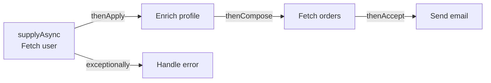
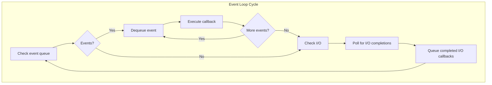
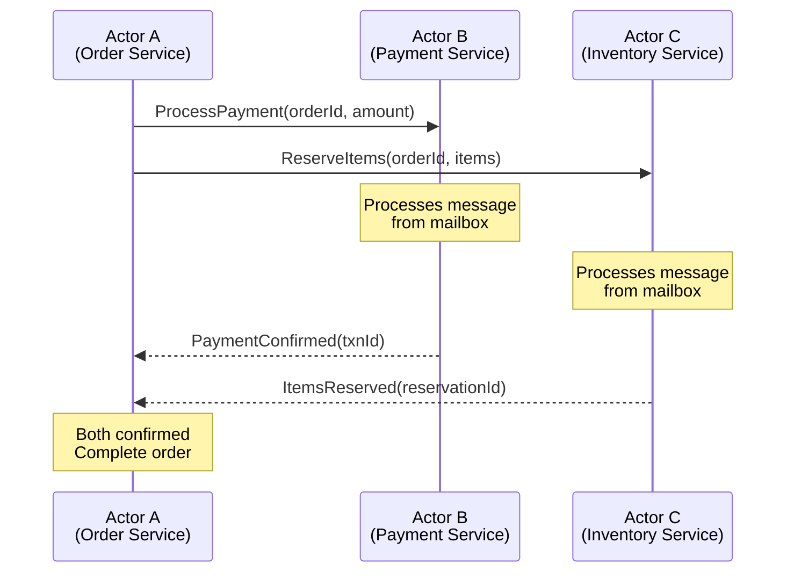

# Asynchronous Programming Models

## Overview

```
SYNC vs ASYNC vs CONCURRENT vs PARALLEL
==========================================

  Synchronous:   Do A, wait, do B, wait, do C.
                 [AAAA][BBBB][CCCC]

  Asynchronous:  Start A, start B, start C. Handle results as they arrive.
                 [A---][B---][C---]
                    \    |    /
                  results arrive out of order

  Concurrent:    Multiple tasks in progress (may share one thread).
                 Thread: [A][B][A][C][B][A]  (interleaved)

  Parallel:      Multiple tasks executing at the same physical time.
                 Core 1: [AAAA]
                 Core 2: [BBBB]
```

---

## Future / Promise

A **Future** is a placeholder for a result that will be available later. A **Promise** is the writable side (producer), a **Future** is the readable side (consumer).

```
FUTURE LIFECYCLE
==================
  Created  -->  Pending  -->  Completed (success OR failure)
                  |
                  +--> Thread is free to do other work
                  |
                  +--> Result retrieved via get() (blocks) or callback
```

### Java: Future (Basic)

```java
ExecutorService executor = Executors.newFixedThreadPool(4);

Future<String> future = executor.submit(() -> {
    Thread.sleep(2000);  // Simulate long computation
    return "result";
});

// Do other work here...

String result = future.get();           // Blocks until result is ready
String result = future.get(5, TimeUnit.SECONDS);  // Blocks with timeout
```

**Limitation**: `Future.get()` is blocking. Cannot chain, combine, or handle errors functionally.

---

## CompletableFuture (Java 8+)

A fully non-blocking, composable future. Supports chaining, combining, and exception handling.



### Chaining

```java
CompletableFuture.supplyAsync(() -> fetchUser(userId))         // Async: get user
    .thenApply(user -> enrichProfile(user))                     // Transform result
    .thenCompose(profile -> fetchOrders(profile.getId()))       // Chain async call
    .thenAccept(orders -> sendEmail(orders))                    // Terminal action
    .exceptionally(ex -> { log.error("Failed", ex); return null; }); // Error handling
```

### Combining Multiple Futures

```java
CompletableFuture<User> userFuture = CompletableFuture.supplyAsync(() -> fetchUser(id));
CompletableFuture<List<Order>> ordersFuture = CompletableFuture.supplyAsync(() -> fetchOrders(id));

// Combine when BOTH complete
CompletableFuture<UserProfile> combined = userFuture.thenCombine(ordersFuture,
    (user, orders) -> new UserProfile(user, orders));

// Wait for ALL to complete
CompletableFuture<Void> all = CompletableFuture.allOf(
    fetchUser(1), fetchUser(2), fetchUser(3));

// Wait for FIRST to complete (racing)
CompletableFuture<Object> fastest = CompletableFuture.anyOf(
    fetchFromCache(key), fetchFromDB(key), fetchFromRemote(key));
```

### Exception Handling

```java
CompletableFuture.supplyAsync(() -> riskyOperation())
    .thenApply(result -> transform(result))
    .exceptionally(ex -> fallbackValue)          // Recover from exception
    .handle((result, ex) -> {                    // Handle both success and failure
        if (ex != null) return fallback;
        return result;
    })
    .whenComplete((result, ex) -> {              // Side-effect (logging)
        if (ex != null) log.error("Error", ex);
    });
```

---

## Async/Await

Syntactic sugar that makes asynchronous code look synchronous. The compiler transforms it into callbacks/state machines under the hood.

### JavaScript

```javascript
// Without async/await (callback hell)
fetchUser(id)
  .then(user => fetchOrders(user.id))
  .then(orders => fetchDetails(orders[0].id))
  .then(details => console.log(details))
  .catch(err => console.error(err));

// With async/await (looks synchronous)
async function getOrderDetails(id) {
  try {
    const user = await fetchUser(id);         // Suspends, does NOT block thread
    const orders = await fetchOrders(user.id);
    const details = await fetchDetails(orders[0].id);
    return details;
  } catch (err) {
    console.error(err);
  }
}
```

### Kotlin Coroutines

```kotlin
suspend fun getOrderDetails(id: String): Details {
    val user = fetchUser(id)            // Suspends coroutine, not the thread
    val orders = fetchOrders(user.id)
    return fetchDetails(orders[0].id)
}

// Parallel execution
suspend fun loadDashboard(userId: String): Dashboard = coroutineScope {
    val user = async { fetchUser(userId) }      // Start in parallel
    val orders = async { fetchOrders(userId) }  // Start in parallel
    Dashboard(user.await(), orders.await())      // Wait for both
}
```

### Python

```python
import asyncio

async def get_order_details(user_id):
    user = await fetch_user(user_id)          # Suspends coroutine
    orders = await fetch_orders(user.id)
    return await fetch_details(orders[0].id)

# Run concurrent tasks
async def main():
    results = await asyncio.gather(
        fetch_user(1),
        fetch_user(2),
        fetch_user(3),
    )  # All three run concurrently on the event loop
```

---

## Reactive Streams

A standard for **asynchronous stream processing with backpressure**. Four interfaces:

```
REACTIVE STREAMS SPEC (java.util.concurrent.Flow)
====================================================

  Publisher  ---subscribe--->  Subscriber
                                 |
                            onSubscribe(Subscription)
                                 |
             <---request(N)--- Subscription  (BACKPRESSURE)
                                 |
             ---onNext(item)-->  (up to N items)
             ---onNext(item)-->
             ...
             ---onComplete()--> (or onError)
```

### Backpressure

The subscriber controls the rate of data flow. Without backpressure, a fast producer can overwhelm a slow consumer.

```
WITHOUT BACKPRESSURE:
  Producer: [====FAST=============>]
  Consumer: [==SLOW==]  BUFFER OVERFLOW / OOM!

WITH BACKPRESSURE:
  Consumer: "I can handle 10 items"
  Producer: sends 10, waits
  Consumer: "I can handle 5 more"
  Producer: sends 5, waits
  --> Producer never overwhelms consumer
```

### Project Reactor (Spring WebFlux)

```java
Flux.fromIterable(userIds)                   // Source of data
    .flatMap(id -> userService.findById(id)) // Async per-element
    .filter(user -> user.isActive())          // Filter
    .map(user -> user.getEmail())             // Transform
    .buffer(10)                               // Batch into groups of 10
    .subscribe(                               // Terminal operation
        emails -> sendBulkEmail(emails),      // onNext
        error -> log.error("Error", error),   // onError
        () -> log.info("Done")                // onComplete
    );
```

### RxJava

```java
Observable.interval(100, TimeUnit.MILLISECONDS)
    .observeOn(Schedulers.io())
    .flatMap(tick -> fetchData())
    .retry(3)
    .subscribe(data -> process(data));
```

---

## Event Loop

A **single-threaded** model that processes events from a queue. Handles thousands of concurrent connections by never blocking.



### How It Handles Thousands of Connections

```
EVENT LOOP (Node.js / Netty)
===============================

  1. Accept connection --> register with OS (epoll/kqueue)
  2. When data arrives, OS notifies the event loop
  3. Event loop invokes the callback for that connection
  4. Callback runs to completion (must NOT block!)
  5. If I/O needed, register callback and return immediately

  Single thread, but NEVER idle:
    Time:  [accept][read A][respond A][read B][DB callback A][respond B]
                                               ^
                                         DB result arrived
                                         (registered as event)

  1 thread handles 10K+ connections because it never waits.
```

```
COMPARISON: 10,000 CONCURRENT CONNECTIONS

  Thread-per-request:
    10,000 OS threads x 1MB stack = 10GB RAM just for stacks
    Massive context switching overhead
    Most threads IDLE (waiting on I/O)

  Event loop:
    1 thread, ~KB per connection state
    ~10MB RAM total
    CPU always busy processing events
    Throughput limited by CPU speed, not thread count
```

### Implementations

| Framework | Language | Notes |
|-----------|----------|-------|
| Node.js   | JS       | libuv event loop, single main thread + worker pool for I/O |
| Netty     | Java     | NIO-based, multiple event loop threads (one per core) |
| Vert.x    | JVM      | Multi-reactor pattern (event loop per core) |
| Nginx     | C        | Master + worker processes, each with event loop |
| Tokio     | Rust     | Multi-threaded async runtime |

**Critical rule**: Never block the event loop. CPU-intensive work must be offloaded to a worker thread/pool.

---

## Actor Model

Actors are **isolated units of computation** that communicate only via **message passing**. No shared state, no locks.



### Actor Properties

```
ACTOR = STATE + BEHAVIOR + MAILBOX
=====================================

  +------------------------------------------+
  |  ACTOR                                   |
  |                                          |
  |  [Mailbox]  msg1 -> msg2 -> msg3         |
  |      |                                   |
  |      v                                   |
  |  [Behavior]  process one message at a    |
  |              time (SEQUENTIAL!)           |
  |      |                                   |
  |      v                                   |
  |  [State]  private, never shared           |
  |                                          |
  |  Can:                                    |
  |    1. Send messages to other actors      |
  |    2. Create new actors                  |
  |    3. Change behavior for next message   |
  +------------------------------------------+
```

**No locks needed**: Each actor processes one message at a time. State is private. Communication is via immutable messages.

### Akka (JVM)

```java
// Define actor behavior
public class OrderActor extends AbstractBehavior<OrderCommand> {
    private OrderState state;

    @Override
    public Receive<OrderCommand> createReceive() {
        return newReceiveBuilder()
            .onMessage(PlaceOrder.class, this::onPlaceOrder)
            .onMessage(CancelOrder.class, this::onCancelOrder)
            .build();
    }

    private Behavior<OrderCommand> onPlaceOrder(PlaceOrder cmd) {
        state = state.place(cmd.items());
        // Send message to payment actor
        paymentActor.tell(new ProcessPayment(cmd.orderId(), cmd.amount()));
        return this;
    }
}

// Create and use
ActorSystem<OrderCommand> system = ActorSystem.create(OrderActor.create(), "orders");
system.tell(new PlaceOrder("order-123", items, 99.99));
```

### Erlang/Elixir

Erlang pioneered the actor model. Each Erlang process is a lightweight actor (~300 bytes). The BEAM VM can run millions of them.

**Let it crash** philosophy: If an actor fails, its supervisor restarts it. No defensive programming needed.

---

## CSP (Communicating Sequential Processes)

Like actors, but the focus is on **channels** rather than actors. Goroutines (lightweight threads) communicate by sending/receiving on typed channels.

```
CSP MODEL (Go)
================

  Goroutine A                Channel              Goroutine B
  +----------+              +-------+             +----------+
  | compute  | --send(x)--> |  ch   | --recv()--> | process  |
  +----------+              +-------+             +----------+

  Key difference from Actors:
  - Actors: send message TO a specific actor (identity-based)
  - CSP: send message TO a channel (any goroutine can read from it)
```

### Go Channels

```go
// Unbuffered channel (synchronous -- sender blocks until receiver is ready)
ch := make(chan int)

// Buffered channel (async up to capacity)
ch := make(chan int, 100)

// Producer-consumer with channels
func producer(ch chan<- int) {
    for i := 0; i < 100; i++ {
        ch <- i  // Send to channel (blocks if full)
    }
    close(ch)
}

func consumer(ch <-chan int) {
    for item := range ch {  // Receive until channel closed
        process(item)
    }
}

func main() {
    ch := make(chan int, 10)
    go producer(ch)
    consumer(ch)
}
```

### Select Statement (Multiplexing)

```go
select {
case msg := <-ch1:
    handle(msg)
case msg := <-ch2:
    handle(msg)
case ch3 <- result:
    // Sent result
case <-time.After(5 * time.Second):
    // Timeout
}
```

---

## Comparison Table: All Async Models

| Model              | Concurrency Unit  | Communication   | Complexity | Performance    | Debugging     | Best For                      |
|--------------------|-------------------|-----------------|------------|----------------|---------------|-------------------------------|
| Future/Promise     | Task              | Return value    | Low        | Good           | Easy          | Single async operation        |
| CompletableFuture  | Task chain        | Chained results | Medium     | Good           | Medium        | Composed async pipelines      |
| Async/Await        | Coroutine         | Return value    | Low        | Good           | Easy          | Sequential async code         |
| Reactive Streams   | Data stream       | Stream elements | High       | Excellent      | Hard          | High-throughput data pipelines|
| Event Loop         | Callback/Event    | Events          | Medium     | Excellent      | Hard          | I/O-heavy servers (10K+ conn)|
| Actor Model        | Actor             | Messages        | Medium     | Excellent      | Medium        | Distributed systems, fault tolerance |
| CSP (Channels)     | Goroutine/Process | Channel values  | Low-Medium | Excellent      | Medium        | Pipeline processing, Go apps  |
| Thread Pool        | Thread            | Shared memory   | Medium     | Good           | Hard          | CPU-bound parallel work       |
| Virtual Threads    | Virtual thread    | Shared memory   | Low        | Excellent      | Easy          | I/O-heavy with sync code style|

### When to Use What

```
DECISION GUIDE
================

"I need to make one async call and get the result"
  --> Future / CompletableFuture

"I need to chain multiple async calls sequentially"
  --> Async/Await (Kotlin, JS, Python) or CompletableFuture

"I need to process a stream of data with backpressure"
  --> Reactive Streams (Reactor, RxJava)

"I need to handle 10K+ concurrent connections"
  --> Event Loop (Node.js, Netty) or Virtual Threads (Java 21+)

"I need fault-tolerant distributed processing"
  --> Actor Model (Akka, Erlang)

"I need concurrent pipeline processing in Go"
  --> CSP with channels

"I need parallel CPU-bound computation"
  --> ForkJoinPool / Thread Pool (not async -- genuinely parallel)
```

---

## Real-World Architecture Patterns

### Pattern 1: API Gateway (Event Loop + Thread Pool)

```
  Clients (100K+)
       |
  [Netty Event Loop]        <-- Handles connections (non-blocking)
       |
  [Thread Pool]              <-- Offloads CPU work
       |
  [Async HTTP Client]       <-- Calls downstream services
       |
  [CompletableFuture chain] <-- Composes responses
```

### Pattern 2: Microservice with Virtual Threads

```
  Clients
       |
  [Tomcat with Virtual Threads]  <-- 1 virtual thread per request
       |                              Blocks on I/O? No problem.
  [JDBC / HTTP calls]            <-- Looks blocking, but VT unmounts
       |
  [Synchronous code]             <-- Easy to read, debug, profile
```

### Pattern 3: Event-Driven with Actors

```
  Events (Kafka)
       |
  [Actor System]
       |
  +----+----+----+
  | Actor   | Actor   | Actor   |
  | (Order) | (Pay)   | (Ship)  |
  +----+----+----+
       |
  Messages between actors (no shared state)
```

---

## Interview Cheat Sheet

```
Q: "Future vs CompletableFuture?"
A: Future.get() blocks. CompletableFuture supports non-blocking
   chaining (thenApply, thenCompose), combining (allOf, anyOf),
   and exception handling (exceptionally, handle).

Q: "How does an event loop handle 10K connections with 1 thread?"
A: Never blocks. Registers I/O with OS (epoll/kqueue). OS notifies
   when data is ready. Event loop runs callback. Moves to next event.
   One thread is always busy, never waiting.

Q: "Actor Model vs shared memory concurrency?"
A: Actors: isolated state, message passing, no locks, fault-tolerant.
   Shared memory: locks/CAS, harder to reason about, but lower overhead
   for fine-grained data sharing.

Q: "When would you use Reactive Streams?"
A: High-throughput data pipelines with backpressure. When producer
   is faster than consumer. NOT for simple request-response.

Q: "What are virtual threads and when to use them?"
A: Java 21 lightweight threads. Write blocking code, get non-blocking
   performance. Best for I/O-heavy workloads. Not useful for CPU-bound.
```
