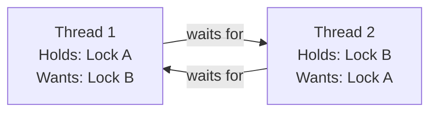

# Classic Concurrency Problems

## Why Study These?

Every classic concurrency problem maps to a real-world system design scenario:

```
CLASSIC PROBLEM          -->  REAL-WORLD EQUIVALENT
---------------------------------------------------------
Producer-Consumer        -->  Message queues (Kafka, RabbitMQ)
Readers-Writers          -->  Database read/write locks, caches
Dining Philosophers      -->  Resource ordering in distributed locks
Sleeping Barber          -->  Thread pools, connection pools
Deadlock                 -->  Distributed transaction failures
```

---

## 1. Producer-Consumer (Bounded Buffer)

### Problem Statement

- One or more **producers** generate items and place them in a buffer
- One or more **consumers** take items from the buffer
- The buffer has a **fixed capacity**
- Producers must wait when the buffer is full
- Consumers must wait when the buffer is empty

```
  Producer 1 --+            +-- Consumer 1
  Producer 2 --+--> [BUFFER] --+-- Consumer 2
  Producer 3 --+   (size=5) +-- Consumer 3

  Rules:
  1. Buffer full  --> Producer blocks
  2. Buffer empty --> Consumer blocks
  3. Only one thread modifies buffer at a time
```

### Why It Is Hard

1. **Mutual exclusion**: Two threads cannot modify the buffer simultaneously
2. **Condition synchronization**: Producers must wait when full, consumers when empty
3. **Avoiding deadlock**: If producer holds lock and waits, consumer cannot drain buffer

### Solution 1: BlockingQueue (Preferred in Practice)

```java
import java.util.concurrent.*;

public class ProducerConsumerBlockingQueue {
    private static final BlockingQueue<Integer> buffer = 
        new ArrayBlockingQueue<>(10);  // Capacity = 10

    public static void main(String[] args) {
        // Producers
        for (int i = 0; i < 3; i++) {
            final int producerId = i;
            new Thread(() -> {
                try {
                    int item = 0;
                    while (true) {
                        buffer.put(item);  // Blocks if full
                        System.out.println("P" + producerId + " produced: " + item++);
                    }
                } catch (InterruptedException e) {
                    Thread.currentThread().interrupt();
                }
            }).start();
        }

        // Consumers
        for (int i = 0; i < 2; i++) {
            final int consumerId = i;
            new Thread(() -> {
                try {
                    while (true) {
                        int item = buffer.take();  // Blocks if empty
                        System.out.println("C" + consumerId + " consumed: " + item);
                    }
                } catch (InterruptedException e) {
                    Thread.currentThread().interrupt();
                }
            }).start();
        }
    }
}
```

### Solution 2: Manual Implementation with Semaphores + Mutex

```java
import java.util.concurrent.Semaphore;

public class ProducerConsumerSemaphore {
    private static final int CAPACITY = 5;
    private static final int[] buffer = new int[CAPACITY];
    private static int count = 0, putIdx = 0, takeIdx = 0;

    // Semaphores for signaling
    private static final Semaphore empty = new Semaphore(CAPACITY); // Tracks empty slots
    private static final Semaphore full  = new Semaphore(0);        // Tracks full slots
    private static final Semaphore mutex = new Semaphore(1);        // Mutual exclusion

    static class Producer implements Runnable {
        public void run() {
            try {
                for (int i = 0; i < 20; i++) {
                    empty.acquire();   // Wait for empty slot (blocks if buffer full)
                    mutex.acquire();   // Enter critical section

                    buffer[putIdx] = i;
                    putIdx = (putIdx + 1) % CAPACITY;
                    count++;
                    System.out.println("Produced: " + i + " [count=" + count + "]");

                    mutex.release();   // Exit critical section
                    full.release();    // Signal that an item is available
                }
            } catch (InterruptedException e) {
                Thread.currentThread().interrupt();
            }
        }
    }

    static class Consumer implements Runnable {
        public void run() {
            try {
                for (int i = 0; i < 20; i++) {
                    full.acquire();    // Wait for item (blocks if buffer empty)
                    mutex.acquire();   // Enter critical section

                    int item = buffer[takeIdx];
                    takeIdx = (takeIdx + 1) % CAPACITY;
                    count--;
                    System.out.println("Consumed: " + item + " [count=" + count + "]");

                    mutex.release();   // Exit critical section
                    empty.release();   // Signal that a slot is available
                }
            } catch (InterruptedException e) {
                Thread.currentThread().interrupt();
            }
        }
    }

    public static void main(String[] args) {
        new Thread(new Producer()).start();
        new Thread(new Consumer()).start();
    }
}
```

```
SEMAPHORE STATE TRACE (capacity=3):
====================================
Event         | empty | full | mutex | buffer
--------------+-------+------+-------+--------
Initial       |   3   |  0   |   1   | [_, _, _]
P: acq empty  |   2   |  0   |   1   | [_, _, _]
P: acq mutex  |   2   |  0   |   0   | [_, _, _]
P: produce A  |   2   |  0   |   0   | [A, _, _]
P: rel mutex  |   2   |  0   |   1   | [A, _, _]
P: rel full   |   2   |  1   |   1   | [A, _, _]
C: acq full   |   2   |  0   |   1   | [A, _, _]
C: acq mutex  |   2   |  0   |   0   | [A, _, _]
C: consume A  |   2   |  0   |   0   | [_, _, _]
C: rel mutex  |   2   |  0   |   1   | [_, _, _]
C: rel empty  |   3   |  0   |   1   | [_, _, _]
```

---

## 2. Readers-Writers

### Problem Statement

- A shared resource (database, cache, file) is accessed by readers and writers
- **Multiple readers** can read simultaneously (no conflict)
- **Writers need exclusive access** (conflict with both readers and other writers)
- Goal: Maximize concurrency while ensuring correctness

### Why It Is Hard

Three flavors of fairness create different trade-offs:

```
READER-PREFERENCE:
  New readers can "cut in line" ahead of waiting writers.
  -> Maximizes read throughput
  -> Can STARVE writers indefinitely

WRITER-PREFERENCE:
  Once a writer is waiting, no new readers allowed.
  -> Ensures writers are not starved
  -> Can STARVE readers

FAIR (FIFO):
  Requests served in arrival order.
  -> No starvation
  -> Lower concurrency (readers behind a writer must wait)
```

### Solution: ReadWriteLock

```java
import java.util.concurrent.locks.*;

public class ReadersWriters {
    private final ReadWriteLock rwLock = new ReentrantReadWriteLock(true); // fair
    private final Map<String, String> data = new HashMap<>();

    // Multiple readers can execute concurrently
    public String read(String key) {
        rwLock.readLock().lock();
        try {
            System.out.println(Thread.currentThread().getName() + " reading");
            return data.get(key);
        } finally {
            rwLock.readLock().unlock();
        }
    }

    // Only one writer at a time, no concurrent readers
    public void write(String key, String value) {
        rwLock.writeLock().lock();
        try {
            System.out.println(Thread.currentThread().getName() + " writing");
            data.put(key, value);
        } finally {
            rwLock.writeLock().unlock();
        }
    }

    public static void main(String[] args) {
        ReadersWriters rw = new ReadersWriters();

        // 5 readers
        for (int i = 0; i < 5; i++) {
            new Thread(() -> {
                while (true) rw.read("key1");
            }, "Reader-" + i).start();
        }

        // 2 writers
        for (int i = 0; i < 2; i++) {
            final int id = i;
            new Thread(() -> {
                int v = 0;
                while (true) rw.write("key1", "value-" + id + "-" + v++);
            }, "Writer-" + i).start();
        }
    }
}
```

### Manual Implementation with Semaphores

```java
public class ReadersWritersManual {
    private int readerCount = 0;
    private final Semaphore mutex = new Semaphore(1);       // Protects readerCount
    private final Semaphore writeLock = new Semaphore(1);   // Exclusive write access

    public void readerAcquire() throws InterruptedException {
        mutex.acquire();
        readerCount++;
        if (readerCount == 1) {
            writeLock.acquire();  // First reader blocks writers
        }
        mutex.release();
    }

    public void readerRelease() throws InterruptedException {
        mutex.acquire();
        readerCount--;
        if (readerCount == 0) {
            writeLock.release();  // Last reader unblocks writers
        }
        mutex.release();
    }

    public void writerAcquire() throws InterruptedException {
        writeLock.acquire();  // Exclusive access
    }

    public void writerRelease() {
        writeLock.release();
    }
}
```

---

## 3. Dining Philosophers

### Problem Statement

Five philosophers sit at a round table. Between each pair is a single fork. Each philosopher alternates between thinking and eating. To eat, a philosopher needs BOTH the left and right fork.

```
         P0
      /      \
    F4        F0
    /          \
  P4            P1
    \          /
    F3        F1
      \      /
         P3
      /      \
    F2        
      \      
         P2
```

### Why It Is Hard

**Deadlock**: If all 5 philosophers pick up their left fork simultaneously, nobody can pick up their right fork. All wait forever.

```
DEADLOCK SCENARIO:
  P0 holds F0, waits for F4
  P1 holds F1, waits for F0
  P2 holds F2, waits for F1
  P3 holds F3, waits for F2
  P4 holds F4, waits for F3

  --> Circular wait! Nobody can proceed.
```

### Solution 1: Resource Ordering (Breaks Circular Wait)

Always pick up the lower-numbered fork first. This breaks the circular dependency.

```java
import java.util.concurrent.locks.ReentrantLock;

public class DiningPhilosophers {
    private static final int NUM = 5;
    private static final ReentrantLock[] forks = new ReentrantLock[NUM];

    static {
        for (int i = 0; i < NUM; i++) {
            forks[i] = new ReentrantLock();
        }
    }

    static class Philosopher implements Runnable {
        private final int id;

        Philosopher(int id) { this.id = id; }

        public void run() {
            int left = id;
            int right = (id + 1) % NUM;

            // RESOURCE ORDERING: always pick up lower-numbered fork first
            int first = Math.min(left, right);
            int second = Math.max(left, right);

            try {
                while (true) {
                    think();
                    forks[first].lock();    // Pick up lower fork first
                    try {
                        forks[second].lock();  // Pick up higher fork second
                        try {
                            eat();
                        } finally {
                            forks[second].unlock();
                        }
                    } finally {
                        forks[first].unlock();
                    }
                }
            } catch (InterruptedException e) {
                Thread.currentThread().interrupt();
            }
        }

        private void think() throws InterruptedException {
            System.out.println("Philosopher " + id + " thinking");
            Thread.sleep((long) (Math.random() * 1000));
        }

        private void eat() throws InterruptedException {
            System.out.println("Philosopher " + id + " eating");
            Thread.sleep((long) (Math.random() * 1000));
        }
    }

    public static void main(String[] args) {
        for (int i = 0; i < NUM; i++) {
            new Thread(new Philosopher(i)).start();
        }
    }
}
```

### Solution 2: Arbitrator (Central Lock)

Use a semaphore to limit the number of philosophers trying to eat at once to N-1.

```java
private static final Semaphore tableAccess = new Semaphore(NUM - 1);

// In philosopher's run():
tableAccess.acquire();   // At most 4 philosophers can try to eat
forks[left].lock();
forks[right].lock();
eat();
forks[right].unlock();
forks[left].unlock();
tableAccess.release();
```

### Solution 3: Chandy-Misra (Distributed)

Each fork is "dirty" or "clean". Philosophers request forks from neighbors via messages. Only works in distributed systems (message-passing model).

---

## 4. Sleeping Barber

### Problem Statement

- A barber shop has one barber, one barber chair, and N waiting chairs
- If no customers, the barber sleeps
- When a customer arrives:
  - If the barber is sleeping, wake the barber
  - If all waiting chairs are full, the customer leaves
  - Otherwise, the customer sits in a waiting chair

```
  WAITING ROOM          BARBER CHAIR
  +---+---+---+        +-----------+
  | C | C | _ |  --->  |  BARBER   |  --->  EXIT (done)
  +---+---+---+        +-----------+
  N waiting chairs       |
                        Sleeps if no customers
```

### Why It Is Hard

- **Race condition**: Customer checks if barber is sleeping while barber checks if customers exist. They can miss each other.
- **Synchronization**: Must coordinate wake-up without busy-waiting

### Solution: Semaphores

```java
import java.util.concurrent.Semaphore;
import java.util.concurrent.atomic.AtomicInteger;

public class SleepingBarber {
    private static final int WAITING_CHAIRS = 3;

    private static final Semaphore customers = new Semaphore(0);     // Waiting customers
    private static final Semaphore barberReady = new Semaphore(0);   // Barber is ready
    private static final Semaphore mutex = new Semaphore(1);         // Protects waitingCount
    private static final AtomicInteger waitingCount = new AtomicInteger(0);

    static class Barber implements Runnable {
        public void run() {
            while (true) {
                try {
                    customers.acquire();   // Sleep if no customers (blocks)
                    mutex.acquire();
                    waitingCount.decrementAndGet();
                    barberReady.release(); // Signal that barber is ready
                    mutex.release();
                    cutHair();             // Perform the haircut
                } catch (InterruptedException e) {
                    Thread.currentThread().interrupt();
                    break;
                }
            }
        }

        private void cutHair() throws InterruptedException {
            System.out.println("Barber: cutting hair...");
            Thread.sleep((long) (Math.random() * 2000));
            System.out.println("Barber: done");
        }
    }

    static class Customer implements Runnable {
        private final int id;
        Customer(int id) { this.id = id; }

        public void run() {
            try {
                mutex.acquire();
                if (waitingCount.get() < WAITING_CHAIRS) {
                    waitingCount.incrementAndGet();
                    customers.release();       // Wake barber if sleeping
                    mutex.release();
                    barberReady.acquire();      // Wait for barber to be ready
                    getHaircut();
                } else {
                    mutex.release();
                    System.out.println("Customer " + id + ": no seats, leaving");
                }
            } catch (InterruptedException e) {
                Thread.currentThread().interrupt();
            }
        }

        private void getHaircut() throws InterruptedException {
            System.out.println("Customer " + id + ": getting haircut");
            Thread.sleep((long) (Math.random() * 2000));
        }
    }

    public static void main(String[] args) throws InterruptedException {
        new Thread(new Barber()).start();
        for (int i = 0; i < 10; i++) {
            Thread.sleep((long) (Math.random() * 1000));
            new Thread(new Customer(i)).start();
        }
    }
}
```

---

## Deadlock

### The 4 Coffman Conditions

ALL four conditions must hold simultaneously for deadlock to occur:

```
1. MUTUAL EXCLUSION:    Resources cannot be shared (exclusive access)
2. HOLD AND WAIT:       Thread holds resource while waiting for another
3. NO PREEMPTION:       Resources cannot be forcibly taken away
4. CIRCULAR WAIT:       T1 waits for T2, T2 waits for T3, ..., Tn waits for T1
```



### Deadlock Example

```java
public class DeadlockExample {
    private static final Object lockA = new Object();
    private static final Object lockB = new Object();

    public static void main(String[] args) {
        Thread t1 = new Thread(() -> {
            synchronized (lockA) {           // Holds A
                sleep(100);                   // Ensure interleaving
                synchronized (lockB) {       // Waits for B
                    System.out.println("T1: got both locks");
                }
            }
        });

        Thread t2 = new Thread(() -> {
            synchronized (lockB) {           // Holds B
                sleep(100);
                synchronized (lockA) {       // Waits for A --> DEADLOCK
                    System.out.println("T2: got both locks");
                }
            }
        });

        t1.start(); t2.start();
    }
}
```

### Prevention Strategies (Break One Condition)

| Condition        | Prevention Strategy                                    |
|------------------|--------------------------------------------------------|
| Mutual exclusion | Use lock-free algorithms or concurrent data structures |
| Hold and wait    | Acquire all locks at once (atomic), or release and retry |
| No preemption    | Use tryLock with timeout; release if cannot acquire    |
| Circular wait    | **Resource ordering** -- always acquire locks in same order |

### Detection Strategies

```
1. TIMEOUT: tryLock with timeout. If lock cannot be acquired, back off.
   lock.tryLock(5, TimeUnit.SECONDS)

2. WAIT-FOR GRAPH: Build a graph of "who waits for whom."
   Cycle in graph = deadlock detected.
   Used by databases (e.g., MySQL InnoDB deadlock detector).

3. JVM DETECTION: jstack / Thread dump shows deadlocked threads.
   "Found one Java-level deadlock:"
```

---

## Livelock

Threads are **not blocked** but are actively changing state in response to each other without making progress. Like two people in a hallway who keep stepping aside in the same direction.

```
LIVELOCK EXAMPLE:
  Thread A: "I see B has the resource, I will wait and retry"
  Thread B: "I see A has the resource, I will wait and retry"

  Both release, both try again, both see conflict, both release...
  --> Infinite loop of politeness with zero progress
```

### Fix

Add **randomized backoff** so threads do not synchronize their retries:

```java
public void acquireWithBackoff(Lock lock1, Lock lock2) throws InterruptedException {
    Random random = new Random();
    while (true) {
        if (lock1.tryLock()) {
            try {
                if (lock2.tryLock()) {
                    return;  // Success -- both locks acquired
                }
            } finally {
                if (!lock2.tryLock(0, TimeUnit.SECONDS)) {
                    lock1.unlock();  // Release and retry
                }
            }
        }
        // Randomized backoff to break symmetry
        Thread.sleep(random.nextInt(100));
    }
}
```

---

## Starvation

A thread is **perpetually denied access** to a resource it needs, even though the resource becomes available. The thread is not deadlocked -- other threads keep taking the resource first.

```
STARVATION EXAMPLE:
  High-priority threads keep acquiring the lock.
  Low-priority thread waits in queue but is always passed over.

  Fix: Use FAIR locks.
       new ReentrantLock(true)  // FIFO ordering
       new ReentrantReadWriteLock(true)  // Fair read-write lock
```

---

## Priority Inversion

A **high-priority** thread is blocked waiting for a lock held by a **low-priority** thread. A **medium-priority** thread preempts the low-priority thread, indirectly blocking the high-priority thread.

```
PRIORITY INVERSION:

  High   [====BLOCKED==========]  Waiting for lock held by Low
  Medium [    ====RUNNING=======]  Preempts Low, runs freely
  Low    [=RUN=..PREEMPTED......]  Holds lock but cannot run

  Result: High-priority thread effectively has lower priority than Medium!
```

### The Mars Pathfinder Story (1997)

The Mars Pathfinder experienced system resets on Mars due to priority inversion:

1. **Low-priority** task held a mutex protecting the information bus
2. **High-priority** bus management task needed the mutex, got blocked
3. **Medium-priority** communication task preempted the low-priority task
4. The high-priority task missed its deadline, watchdog timer fired, system reset

**Fix: Priority Inheritance Protocol** -- When a low-priority thread holds a lock needed by a high-priority thread, the low-priority thread temporarily inherits the high priority, so medium-priority threads cannot preempt it.

```
WITH PRIORITY INHERITANCE:

  High   [====BLOCKED==RUN====]  Waits, then runs when Low releases
  Medium [    ....BLOCKED......]  Cannot preempt Low (Low has High's priority)
  Low    [=RUN(boosted)=DONE==]  Runs with inherited high priority, releases lock quickly
```

Java's `ReentrantLock` does NOT implement priority inheritance. This is an OS-level mechanism (POSIX `PTHREAD_PRIO_INHERIT`, RTOS schedulers).

---

## Summary Decision Table

| Problem             | Key Primitives               | Real-World Application          |
|---------------------|------------------------------|---------------------------------|
| Producer-Consumer   | BlockingQueue / Semaphores   | Message queues, thread pools    |
| Readers-Writers     | ReadWriteLock                | Database locks, cache systems   |
| Dining Philosophers | Resource ordering            | Distributed lock ordering       |
| Sleeping Barber     | Semaphores                   | Connection pools, thread pools  |
| Deadlock            | Lock ordering, tryLock       | DB transactions, microservices  |
| Livelock            | Randomized backoff           | Network retries, CAS loops      |
| Starvation          | Fair locks                   | Thread scheduling, rate limiting|
| Priority Inversion  | Priority inheritance         | Real-time / embedded systems    |

---

## Interview Cheat Sheet

```
Q: "How would you implement a producer-consumer system?"
A: Use a BlockingQueue (ArrayBlockingQueue for bounded).
   put() blocks when full, take() blocks when empty.
   For manual: two semaphores (empty + full) + mutex.

Q: "How do you prevent deadlock?"
A: Break one Coffman condition. Best approach: resource ordering
   (always acquire locks in the same global order). Or use
   tryLock with timeout for deadlock avoidance.

Q: "What is the difference between deadlock and livelock?"
A: Deadlock = threads blocked forever, zero CPU usage.
   Livelock = threads running but making zero progress.
   Fix livelock with randomized backoff.

Q: "Tell me about the Mars Pathfinder bug."
A: Priority inversion. Low-priority task held a lock needed
   by high-priority task. Medium-priority task preempted
   the low-priority task. Fix: priority inheritance.
```
