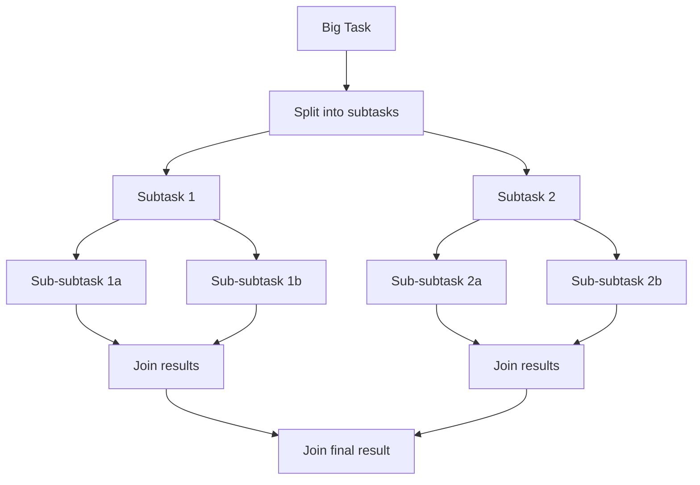

# Concurrent Data Structures

## Why Concurrent Data Structures?

Regular data structures (HashMap, ArrayList, LinkedList) are NOT thread-safe. Wrapping them with `synchronized` works but creates a global lock bottleneck. Concurrent data structures use fine-grained locking or lock-free algorithms for much higher throughput.

```
APPROACH COMPARISON (for a concurrent map):

  1. Collections.synchronizedMap(new HashMap<>())
     --> Single global lock. ALL operations serialize.
     --> Throughput: LOW

  2. ConcurrentHashMap
     --> Fine-grained locking (per-bucket in Java 8+)
     --> Reads often lock-free, writes lock only affected bucket
     --> Throughput: HIGH

  Performance gap widens with more threads:
    Threads:     1       4       16      64
    syncMap:    100%    ~30%    ~10%    ~3%    (relative throughput)
    CHM:       100%    ~380%   ~1200%  ~3000%
```

---

## ConcurrentHashMap

### Java 7: Segment-Based Locking

```
JAVA 7 ConcurrentHashMap
==========================
  Default: 16 segments, each with its own lock.
  Concurrent writes to different segments do NOT block each other.

  +----------+----------+----------+----------+
  | Segment0 | Segment1 | Segment2 | ...S15   |
  | Lock0    | Lock1    | Lock2    | Lock15   |
  |----------|----------|----------|----------|
  | bucket0  | bucket4  | bucket8  | ...      |
  | bucket1  | bucket5  | bucket9  | ...      |
  | bucket2  | bucket6  | bucket10 | ...      |
  | bucket3  | bucket7  | bucket11 | ...      |
  +----------+----------+----------+----------+

  put(key):
    1. hash(key) --> determine segment
    2. Lock ONLY that segment
    3. Insert into the bucket chain
    4. Unlock segment
```

### Java 8+: Node-Based Locking (CAS + synchronized)

```
JAVA 8+ ConcurrentHashMap
===========================
  No segments. Lock per-bucket (first node of the bucket).
  Uses CAS for empty buckets, synchronized for non-empty.

  Table:
  +------+------+------+------+------+------+
  | null | Node | null | Tree | null | Node |
  +------+------+------+------+------+------+
    [0]    [1]    [2]    [3]    [4]    [5]

  put(key, value):
    bucket = table[hash(key) & (n-1)]

    Case 1: bucket is null
      --> CAS to insert new node (lock-free!)

    Case 2: bucket is not null
      --> synchronized(firstNode) { insert into chain/tree }

    Case 3: bucket has 8+ nodes
      --> Convert linked list to red-black tree (treeifyBin)

  get(key):
    --> NO locking at all! Volatile reads ensure visibility.
    --> Nodes use volatile next pointers.
```

### Key Operations

```java
ConcurrentHashMap<String, Integer> map = new ConcurrentHashMap<>();

// Atomic compound operations
map.putIfAbsent("key", 1);                    // Insert only if absent
map.computeIfAbsent("key", k -> expensive()); // Compute only if absent
map.merge("key", 1, Integer::sum);            // Atomic read-modify-write

// Bulk operations (parallel, lock-free traversal)
map.forEach(2, (k, v) -> System.out.println(k + "=" + v)); // parallelism=2
long sum = map.reduceValuesToLong(2, v -> v, 0L, Long::sum);
```

---

## ConcurrentLinkedQueue

A **lock-free** FIFO queue based on the Michael-Scott algorithm. Uses CAS instead of locks.

```
ConcurrentLinkedQueue (Lock-Free)
===================================

  HEAD --> [A] --> [B] --> [C] --> null <-- TAIL

  offer(D):  CAS tail.next from null to D, then CAS tail to D
  poll():    CAS head to head.next, return old head's value

  No locks! Multiple threads can enqueue/dequeue concurrently.
  CAS retries on contention (optimistic concurrency).
```

```java
ConcurrentLinkedQueue<Task> queue = new ConcurrentLinkedQueue<>();

// Producer (any thread)
queue.offer(new Task("process-order"));

// Consumer (any thread)
Task task = queue.poll();  // Returns null if empty (non-blocking)
```

**When to use**: Unbounded, non-blocking producer-consumer where blocking is unacceptable. For bounded blocking, use `BlockingQueue` instead.

---

## ConcurrentSkipListMap

A **concurrent sorted map** based on skip lists. O(log n) for get/put/remove. Lock-free reads, fine-grained locking for writes.

```
SKIP LIST STRUCTURE
======================
  Level 3:  HEAD ----------------------------------------> 50 -> null
  Level 2:  HEAD ----------------> 20 ------------------> 50 -> null
  Level 1:  HEAD ------> 10 -----> 20 ------> 35 -------> 50 -> null
  Level 0:  HEAD -> 5 -> 10 -> 15 -> 20 -> 25 -> 35 -> 42 -> 50 -> null

  Search for 35:
    Start at Level 3 HEAD, go right to 50 (too far), go down
    Level 2 HEAD, go right to 20, go right to 50 (too far), go down
    Level 1: 20, go right to 35 -- FOUND!
```

```java
ConcurrentSkipListMap<Long, Order> orders = new ConcurrentSkipListMap<>();

orders.put(timestamp, order);
Order first = orders.firstEntry().getValue();        // Earliest order
NavigableMap<Long, Order> recent = orders.tailMap(cutoff, true); // Range query
```

**When to use**: Need a concurrent sorted map. Alternative to `TreeMap` + external locking.

---

## CopyOnWriteArrayList

Every write operation creates a **new copy** of the entire array. Reads access the existing array without locking.

```
COPY-ON-WRITE MECHANISM
=========================
  Initial:   array -> [A, B, C]

  Thread R reads:  reads from [A, B, C]  (no lock)

  Thread W writes "D":
    1. Lock (write lock)
    2. Copy: newArray = [A, B, C, D]
    3. Swap: array -> newArray
    4. Unlock

  Thread R still sees old [A, B, C] until next read.
  New readers see [A, B, C, D].
```

```java
CopyOnWriteArrayList<EventListener> listeners = new CopyOnWriteArrayList<>();

// Writes are expensive (full copy) but rare
listeners.add(new MyListener());

// Reads are fast (no locking) and common
for (EventListener l : listeners) {  // Snapshot iterator -- never throws ConcurrentModificationException
    l.onEvent(event);
}
```

**When to use**: Read-heavy, write-rare scenarios. Event listeners, configuration lists.

---

## BlockingQueue Variants

```
BLOCKINGQUEUE FAMILY
======================

  Interface: BlockingQueue<E>
    put(e)  -- blocks if full
    take()  -- blocks if empty
    offer() -- returns false if full (non-blocking)
    poll()  -- returns null if empty (non-blocking)

  +-------------------------+------------------+------------------+
  | Implementation          | Bounded?         | Ordering         |
  +-------------------------+------------------+------------------+
  | ArrayBlockingQueue      | Yes (fixed)      | FIFO             |
  | LinkedBlockingQueue     | Optional (cap)   | FIFO             |
  | PriorityBlockingQueue   | No (unbounded)   | Priority (heap)  |
  | DelayQueue              | No (unbounded)   | By delay time    |
  | SynchronousQueue        | Zero capacity    | Direct handoff   |
  +-------------------------+------------------+------------------+
```

### ArrayBlockingQueue

```java
// Fixed-size bounded buffer backed by an array
BlockingQueue<Task> queue = new ArrayBlockingQueue<>(100);

// Producer
queue.put(task);  // Blocks if queue has 100 items

// Consumer
Task t = queue.take();  // Blocks if queue is empty
```

### SynchronousQueue

Zero-capacity queue. Every `put()` must wait for a corresponding `take()`, and vice versa. Direct handoff.

```java
// Used by Executors.newCachedThreadPool() internally
SynchronousQueue<Task> handoff = new SynchronousQueue<>();

// Producer blocks until consumer is ready
handoff.put(task);  // Blocks until a take() is called

// Consumer blocks until producer is ready
Task t = handoff.take();
```

### DelayQueue

Elements become available only after their delay expires.

```java
public class ScheduledTask implements Delayed {
    private final long executeAt;
    private final Runnable task;

    public ScheduledTask(Runnable task, long delayMs) {
        this.task = task;
        this.executeAt = System.currentTimeMillis() + delayMs;
    }

    @Override
    public long getDelay(TimeUnit unit) {
        return unit.convert(executeAt - System.currentTimeMillis(), TimeUnit.MILLISECONDS);
    }

    @Override
    public int compareTo(Delayed other) {
        return Long.compare(this.getDelay(TimeUnit.MILLISECONDS),
                           other.getDelay(TimeUnit.MILLISECONDS));
    }
}

DelayQueue<ScheduledTask> queue = new DelayQueue<>();
queue.put(new ScheduledTask(() -> sendReminder(), 5000));  // Execute after 5s
ScheduledTask task = queue.take();  // Blocks until delay expires
task.task.run();
```

---

## Lock-Free Programming

### Compare-and-Swap (CAS)

CAS is a **hardware-level atomic instruction** that compares a memory location to an expected value and, only if they match, swaps it to a new value. All in one indivisible step.

```
CAS(address, expected, new):
  ATOMICALLY {
    if (*address == expected) {
      *address = new
      return true    // Success
    } else {
      return false   // Someone else changed it -- retry
    }
  }

  This is a SINGLE CPU instruction (CMPXCHG on x86).
  No locking needed.
```

### Java: AtomicInteger

```java
import java.util.concurrent.atomic.AtomicInteger;

public class AtomicCounter {
    private final AtomicInteger count = new AtomicInteger(0);

    public void increment() {
        // CAS loop: read current, try to set current+1
        // If another thread changed it, retry
        count.incrementAndGet();
    }

    // Under the hood (conceptual):
    public int incrementManual() {
        int oldValue, newValue;
        do {
            oldValue = count.get();
            newValue = oldValue + 1;
        } while (!count.compareAndSet(oldValue, newValue));  // CAS
        return newValue;
    }
}
```

### The ABA Problem

```
THE ABA PROBLEM
=================
  Thread 1: reads value A
  Thread 2: changes A -> B -> A
  Thread 1: CAS(A, newValue) -- SUCCEEDS! But the value went through B.

  Example:
    Lock-free stack: top -> [A] -> [B] -> [C]
    Thread 1: pop() reads top = A, next = B
    Thread 2: pop A, pop B, push A back.  Stack: [A] -> [C]
    Thread 1: CAS top from A to B -- succeeds! But B is no longer valid!

  Fix: AtomicStampedReference -- adds a version stamp.
       CAS checks BOTH the reference AND the stamp.
```

### Java: AtomicStampedReference

```java
import java.util.concurrent.atomic.AtomicStampedReference;

AtomicStampedReference<Node> top = new AtomicStampedReference<>(null, 0);

// Read with stamp
int[] stampHolder = new int[1];
Node current = top.get(stampHolder);
int stamp = stampHolder[0];

// CAS with stamp -- prevents ABA
top.compareAndSet(current, newNode, stamp, stamp + 1);
// Only succeeds if BOTH reference and stamp match
```

### Treiber Stack (Lock-Free Stack)

```java
import java.util.concurrent.atomic.AtomicReference;

public class TreiberStack<T> {
    private final AtomicReference<Node<T>> top = new AtomicReference<>(null);

    private static class Node<T> {
        final T value;
        final Node<T> next;

        Node(T value, Node<T> next) {
            this.value = value;
            this.next = next;
        }
    }

    public void push(T value) {
        Node<T> newNode;
        Node<T> oldTop;
        do {
            oldTop = top.get();
            newNode = new Node<>(value, oldTop);
        } while (!top.compareAndSet(oldTop, newNode));  // CAS loop
    }

    public T pop() {
        Node<T> oldTop;
        Node<T> newTop;
        do {
            oldTop = top.get();
            if (oldTop == null) return null;  // Stack empty
            newTop = oldTop.next;
        } while (!top.compareAndSet(oldTop, newTop));  // CAS loop
        return oldTop.value;
    }
}
```

```
TREIBER STACK PUSH VISUALIZATION
===================================
  State: top -> [B] -> [A] -> null

  Thread 1: push(C)
    1. Read oldTop = B
    2. Create newNode: C -> B
    3. CAS(top, B, C)  -- if top is still B, set to C

  Success: top -> [C] -> [B] -> [A] -> null

  If another thread pushed D between steps 1 and 3:
    top -> [D] -> [B] -> ...
    CAS fails (top != B). Retry from step 1.
```

### Michael-Scott Queue (Lock-Free Queue)

The canonical lock-free FIFO queue. Uses two CAS operations for enqueue:

```
MICHAEL-SCOTT QUEUE (Concept)
================================

  HEAD -> [sentinel] -> [A] -> [B] -> [C] -> null
                                              ^
                                             TAIL

  Enqueue(D):
    1. Read tail
    2. If tail.next == null:
         CAS(tail.next, null, D)     // Link new node
         CAS(tail, oldTail, D)       // Advance tail pointer
    3. If tail.next != null:
         CAS(tail, oldTail, tail.next) // Help advance tail (another thread is mid-enqueue)

  Dequeue:
    1. Read head.next (sentinel's next)
    2. CAS(head, sentinel, head.next)  // Advance head
    3. Return old head.next's value
```

Java's `ConcurrentLinkedQueue` implements this algorithm.

---

## ForkJoinPool

A thread pool designed for **recursive task decomposition**. Uses **work-stealing**: idle threads steal tasks from busy threads' queues.



```
WORK-STEALING
===============
  Thread 1 queue: [task_A, task_B, task_C]   (busy)
  Thread 2 queue: []                          (idle)

  Thread 2 STEALS task_C from Thread 1's queue (from the tail).
  Thread 1 pops from its own head (LIFO for locality).
  Thread 2 pops from Thread 1's tail (FIFO for load balancing).
```

### Java: ForkJoinPool Example

```java
import java.util.concurrent.*;

public class ParallelSum extends RecursiveTask<Long> {
    private static final int THRESHOLD = 10_000;
    private final long[] array;
    private final int start, end;

    public ParallelSum(long[] array, int start, int end) {
        this.array = array;
        this.start = start;
        this.end = end;
    }

    @Override
    protected Long compute() {
        int length = end - start;
        if (length <= THRESHOLD) {
            // Base case: sequential sum
            long sum = 0;
            for (int i = start; i < end; i++) sum += array[i];
            return sum;
        }
        // Recursive case: split
        int mid = start + length / 2;
        ParallelSum left  = new ParallelSum(array, start, mid);
        ParallelSum right = new ParallelSum(array, mid, end);

        left.fork();           // Submit left to pool (async)
        long rightResult = right.compute();  // Compute right in current thread
        long leftResult  = left.join();       // Wait for left's result

        return leftResult + rightResult;
    }

    public static void main(String[] args) {
        long[] array = new long[100_000_000];
        // fill array...

        ForkJoinPool pool = ForkJoinPool.commonPool();
        long sum = pool.invoke(new ParallelSum(array, 0, array.length));
    }
}
```

**Key pattern**: `fork()` the first subtask, `compute()` the second, then `join()` the first. This avoids needless thread creation.

---

## Disruptor Pattern (LMAX)

A **lock-free ring buffer** designed for ultra-low-latency inter-thread communication. Used in financial trading systems.

```
DISRUPTOR RING BUFFER
=======================

  Positions:  [0] [1] [2] [3] [4] [5] [6] [7]   (power of 2 size)
                           ^                 ^
                        Consumer          Producer
                        cursor            cursor

  Producer:
    1. Claim next sequence number (CAS on cursor)
    2. Write event to slot[sequence % bufferSize]
    3. Publish by advancing cursor

  Consumer:
    1. Wait until producer cursor > consumer cursor
    2. Read event from slot[sequence % bufferSize]
    3. Advance consumer cursor

  WHY FAST:
  - No locks (CAS-based sequencing)
  - No memory allocation (pre-allocated ring buffer)
  - Mechanical sympathy (cache-line padding prevents false sharing)
  - Single-writer principle per slot
```

### False Sharing and Cache-Line Padding

```
FALSE SHARING PROBLEM
=======================

  CPU Cache Line: 64 bytes
  +---+---+---+---+---+---+---+---+
  | counter1 | counter2 | padding |
  +---+---+---+---+---+---+---+---+
  <----------- 64 bytes ---------->

  Thread 1 writes counter1 --> Invalidates cache line for Thread 2
  Thread 2 writes counter2 --> Invalidates cache line for Thread 1
  Both counters are independent but share a cache line!

  FIX: Pad each counter to fill its own cache line.

  +---+---+---+---+---+---+---+---+---+---+---+---+---+---+---+---+
  | counter1 |     padding (56 bytes)     | counter2 |    padding   |
  +---+---+---+---+---+---+---+---+---+---+---+---+---+---+---+---+
  <----------- 64 bytes ----------------> <-------- 64 bytes ------>
  Now each counter has its own cache line. No false sharing.
```

### Disruptor vs BlockingQueue

| Aspect               | BlockingQueue         | Disruptor            |
|----------------------|-----------------------|----------------------|
| Locking              | Lock-based            | Lock-free            |
| Memory allocation    | Per-event allocation  | Pre-allocated slots  |
| Latency              | ~microseconds         | ~nanoseconds         |
| Throughput           | ~millions/sec         | ~100M+ ops/sec       |
| GC pressure          | High (object churn)   | Near-zero            |
| Use case             | General purpose       | Ultra-low-latency    |

---

## Data Structure Selection Guide

```
DECISION TREE
==============

Need a Map?
  +-- Thread-safe, general purpose --> ConcurrentHashMap
  +-- Thread-safe, sorted          --> ConcurrentSkipListMap
  +-- Read-heavy, write-rare       --> ConcurrentHashMap (or Collections.unmodifiableMap for immutable)

Need a Queue?
  +-- Bounded, blocking            --> ArrayBlockingQueue
  +-- Unbounded, blocking          --> LinkedBlockingQueue
  +-- Priority-ordered, blocking   --> PriorityBlockingQueue
  +-- Delayed elements             --> DelayQueue
  +-- Zero-capacity handoff        --> SynchronousQueue
  +-- Non-blocking, unbounded      --> ConcurrentLinkedQueue
  +-- Ultra-low-latency            --> Disruptor (LMAX)

Need a List?
  +-- Read-heavy, write-rare       --> CopyOnWriteArrayList
  +-- General purpose              --> Synchronized wrapper or segment list

Need a Counter?
  +-- Single counter               --> AtomicInteger / AtomicLong
  +-- High-contention counter      --> LongAdder (striped, better than AtomicLong)

Need a Stack?
  +-- Lock-free                    --> Treiber Stack (AtomicReference)
```

---

## Interview Cheat Sheet

```
Q: "How does ConcurrentHashMap achieve thread safety?"
A: Java 8+: CAS for empty buckets, synchronized on first node
   for occupied buckets. Reads are lock-free (volatile pointers).
   No global lock -- operations on different buckets are independent.

Q: "What is CAS and how does it work?"
A: Compare-and-Swap. Hardware atomic instruction. Reads value,
   compares to expected, writes new value ONLY if match.
   Forms the basis of all lock-free algorithms.

Q: "What is the ABA problem?"
A: CAS sees value A, another thread changes A->B->A, CAS
   succeeds thinking nothing changed. Fix: AtomicStampedReference
   (version counter alongside the reference).

Q: "When would you use ForkJoinPool?"
A: Recursive divide-and-conquer tasks (parallel sort, map-reduce).
   Work-stealing ensures load balance. Used by Java parallel streams.

Q: "What is the Disruptor pattern?"
A: Lock-free ring buffer with pre-allocated events. Avoids locks,
   allocation, false sharing. LMAX processes 6M orders/sec on one thread.
```
