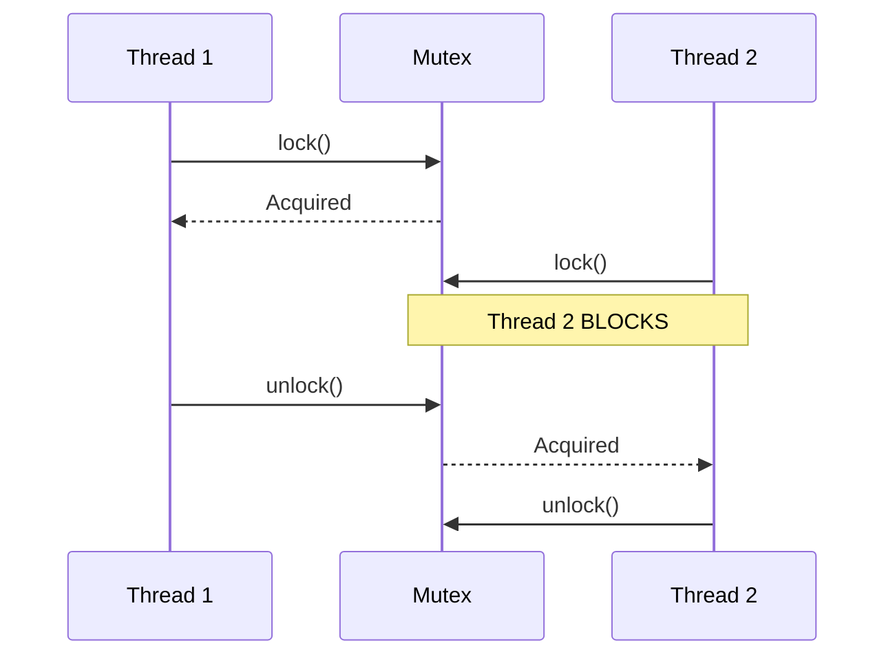
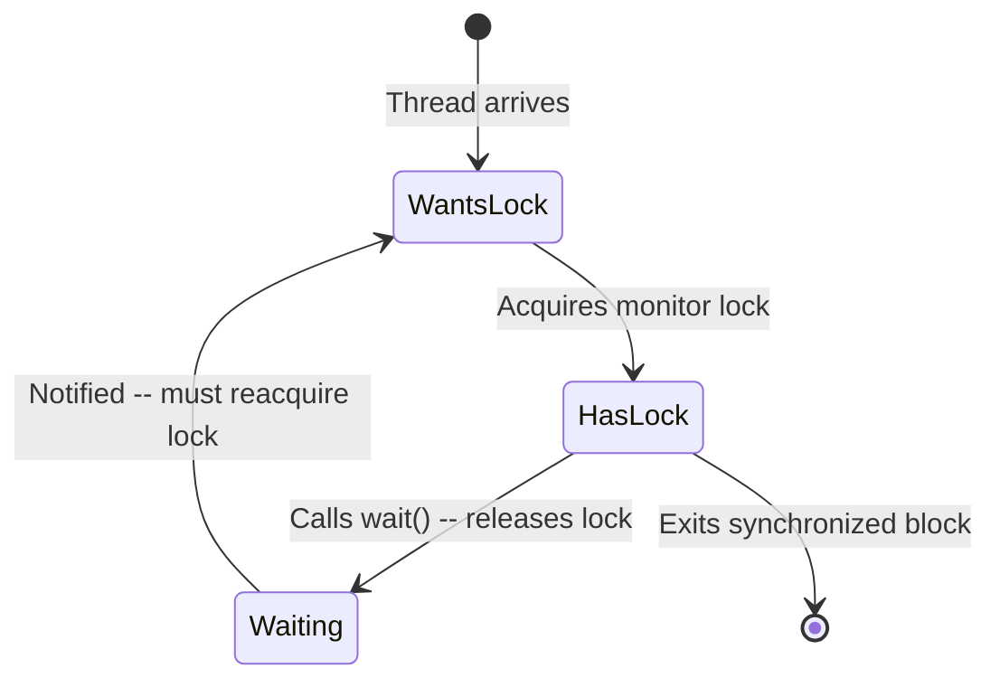
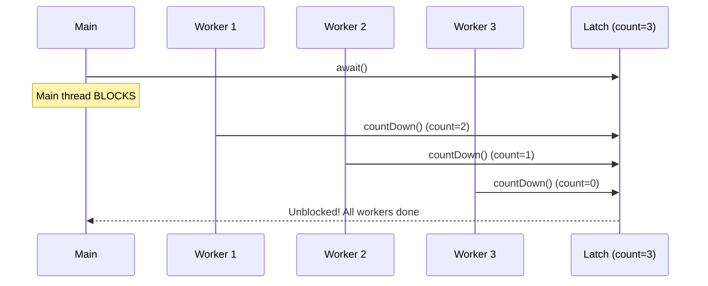
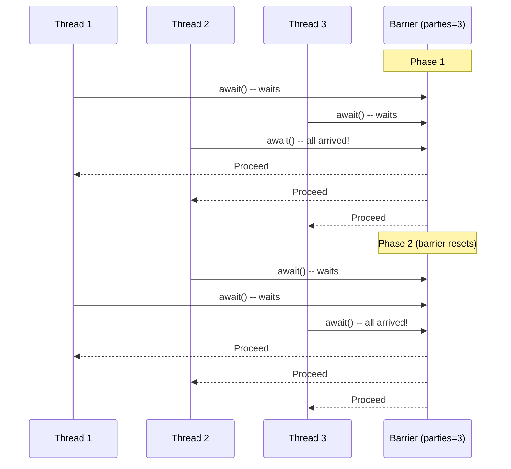

# Synchronization Primitives

## Overview of Primitives

```
SYNCHRONIZATION PRIMITIVE HIERARCHY
=====================================

  Lock-based                         Lock-free
  ---------                          ---------
  Mutex (1 thread)                   CAS (Compare-and-Swap)
  Semaphore (N threads)              AtomicInteger / AtomicRef
  Monitor (mutex + condition)        Lock-free queues/stacks
  ReadWriteLock (readers/writers)
  StampedLock (optimistic reads)
  Spinlock (busy-wait)

  Coordination                       
  ------------                       
  CountDownLatch (one-time gate)     
  CyclicBarrier (reusable sync)      
  Phaser (flexible phases)           
```

---

## Mutex (Mutual Exclusion)

A **mutex** is a binary lock: exactly one thread can hold it at a time. All other threads attempting to acquire it will block until it is released.



### Java: ReentrantLock as Mutex

```java
import java.util.concurrent.locks.ReentrantLock;

public class Counter {
    private int count = 0;
    private final ReentrantLock mutex = new ReentrantLock();

    public void increment() {
        mutex.lock();
        try {
            count++;  // Critical section -- only one thread at a time
        } finally {
            mutex.unlock();  // ALWAYS unlock in finally
        }
    }

    public int getCount() {
        mutex.lock();
        try {
            return count;
        } finally {
            mutex.unlock();
        }
    }
}
```

### Java: synchronized as Mutex

```java
public class Counter {
    private int count = 0;

    public synchronized void increment() {
        count++;  // Implicit mutex on 'this' object
    }

    public synchronized int getCount() {
        return count;
    }
}
```

**Key difference**: `synchronized` auto-releases on exception. `ReentrantLock` requires explicit `finally` block but offers tryLock(), timed lock, and fairness options.

---

## Semaphore

A **semaphore** maintains a count of available permits. Threads acquire permits (decrement) and release permits (increment). When permits = 0, acquiring threads block.

```
COUNTING SEMAPHORE (permits = 3)
=================================

Initial state:      [3 permits available]

Thread A acquires:  [2 permits available]  T-A holds 1
Thread B acquires:  [1 permit  available]  T-A, T-B hold
Thread C acquires:  [0 permits available]  T-A, T-B, T-C hold
Thread D acquires:  [BLOCKED -- waits]     No permits left

Thread A releases:  [0 permits -> 1]       T-D unblocks, acquires
```

### Binary Semaphore = Mutex (Almost)

A semaphore with permits=1 behaves like a mutex, with one difference: any thread can release a semaphore, but only the owner should release a mutex.

### Java: Semaphore

```java
import java.util.concurrent.Semaphore;

public class ConnectionPool {
    private final Semaphore semaphore;
    private final List<Connection> pool;

    public ConnectionPool(int maxConnections) {
        this.semaphore = new Semaphore(maxConnections, true); // fair=true
        this.pool = new ArrayList<>(maxConnections);
        for (int i = 0; i < maxConnections; i++) {
            pool.add(createConnection());
        }
    }

    public Connection acquire() throws InterruptedException {
        semaphore.acquire();  // Blocks if no permits available
        synchronized (pool) {
            return pool.remove(pool.size() - 1);
        }
    }

    public void release(Connection conn) {
        synchronized (pool) {
            pool.add(conn);
        }
        semaphore.release();  // Returns permit, unblocks waiting thread
    }
}
```

---

## Monitor

A **monitor** combines a mutex with one or more **condition variables**. It provides mutual exclusion plus the ability to wait for a condition to become true.

Java's `synchronized` + `wait()`/`notify()` is a monitor.



### Java: Monitor Pattern (Bounded Buffer)

```java
public class BoundedBuffer<T> {
    private final Object[] items;
    private int count, putIndex, takeIndex;

    public BoundedBuffer(int capacity) {
        items = new Object[capacity];
    }

    public synchronized void put(T item) throws InterruptedException {
        while (count == items.length) {  // Buffer full
            wait();  // Release monitor lock, wait for space
        }
        items[putIndex] = item;
        putIndex = (putIndex + 1) % items.length;
        count++;
        notifyAll();  // Wake consumers waiting for items
    }

    @SuppressWarnings("unchecked")
    public synchronized T take() throws InterruptedException {
        while (count == 0) {  // Buffer empty
            wait();  // Release monitor lock, wait for items
        }
        T item = (T) items[takeIndex];
        takeIndex = (takeIndex + 1) % items.length;
        count--;
        notifyAll();  // Wake producers waiting for space
        return item;
    }
}
```

---

## Condition Variable

A **condition variable** allows threads to wait until a particular condition is true. Always used with a lock.

### The Spurious Wakeup Problem

Threads can wake up **without** being notified. This is a real OS-level phenomenon. Always check the condition in a **while loop**, never an `if`.

```java
// WRONG -- vulnerable to spurious wakeup
synchronized (lock) {
    if (!conditionMet) {
        lock.wait();
    }
    // May execute even though condition is STILL false
}

// CORRECT -- re-check after wakeup
synchronized (lock) {
    while (!conditionMet) {  // Re-check on every wakeup
        lock.wait();
    }
    // Condition is GUARANTEED to be true here
}
```

### Java: Condition with ReentrantLock

```java
import java.util.concurrent.locks.*;

public class BoundedBuffer<T> {
    private final Lock lock = new ReentrantLock();
    private final Condition notFull = lock.newCondition();   // Separate condition for producers
    private final Condition notEmpty = lock.newCondition();  // Separate condition for consumers
    private final Object[] items;
    private int count, putIdx, takeIdx;

    public BoundedBuffer(int capacity) {
        items = new Object[capacity];
    }

    public void put(T item) throws InterruptedException {
        lock.lock();
        try {
            while (count == items.length) {
                notFull.await();  // Wait until not full
            }
            items[putIdx] = item;
            putIdx = (putIdx + 1) % items.length;
            count++;
            notEmpty.signal();  // Signal ONE waiting consumer (more efficient than notifyAll)
        } finally {
            lock.unlock();
        }
    }

    @SuppressWarnings("unchecked")
    public T take() throws InterruptedException {
        lock.lock();
        try {
            while (count == 0) {
                notEmpty.await();  // Wait until not empty
            }
            T item = (T) items[takeIdx];
            takeIdx = (takeIdx + 1) % items.length;
            count--;
            notFull.signal();  // Signal ONE waiting producer
            return item;
        } finally {
            lock.unlock();
        }
    }
}
```

**Advantage over `synchronized`**: Separate conditions for different waiting reasons. With `synchronized`, `notifyAll()` wakes both producers AND consumers unnecessarily.

---

## ReadWriteLock

Allows **concurrent reads** but **exclusive writes**. Multiple readers can hold the lock simultaneously. A writer must wait for all readers to release, and readers must wait for the writer to release.

```
READWRITELOCK STATE MACHINE
==============================

  No lock held
       |
       +--- Reader arrives --> Reader lock acquired (allows more readers)
       |                            |
       |                       Writer arrives --> Writer WAITS
       |
       +--- Writer arrives --> Writer lock acquired (exclusive)
                                    |
                               Reader arrives --> Reader WAITS
```

### Java: ReadWriteLock

```java
import java.util.concurrent.locks.ReadWriteLock;
import java.util.concurrent.locks.ReentrantReadWriteLock;

public class ThreadSafeCache<K, V> {
    private final Map<K, V> cache = new HashMap<>();
    private final ReadWriteLock rwLock = new ReentrantReadWriteLock();

    public V get(K key) {
        rwLock.readLock().lock();  // Multiple threads can read simultaneously
        try {
            return cache.get(key);
        } finally {
            rwLock.readLock().unlock();
        }
    }

    public void put(K key, V value) {
        rwLock.writeLock().lock();  // Exclusive access for writes
        try {
            cache.put(key, value);
        } finally {
            rwLock.writeLock().unlock();
        }
    }

    public V computeIfAbsent(K key, Function<K, V> loader) {
        // Try read first
        rwLock.readLock().lock();
        try {
            V value = cache.get(key);
            if (value != null) return value;
        } finally {
            rwLock.readLock().unlock();
        }
        // Upgrade to write
        rwLock.writeLock().lock();
        try {
            // Double-check after acquiring write lock
            V value = cache.get(key);
            if (value == null) {
                value = loader.apply(key);
                cache.put(key, value);
            }
            return value;
        } finally {
            rwLock.writeLock().unlock();
        }
    }
}
```

### Fairness: Reader-Preference vs Writer-Preference

- **Reader-preference**: Readers never wait for other readers. Can starve writers.
- **Writer-preference**: Waiting writers block new readers. Can starve readers.
- **Fair (FIFO)**: `new ReentrantReadWriteLock(true)` -- queued in arrival order.

---

## StampedLock (Java 8+)

An advanced lock with three modes: **write**, **read**, and **optimistic read**. The optimistic read does NOT acquire a lock -- it reads, then validates.

```java
import java.util.concurrent.locks.StampedLock;

public class Point {
    private double x, y;
    private final StampedLock lock = new StampedLock();

    // Exclusive write
    public void move(double deltaX, double deltaY) {
        long stamp = lock.writeLock();
        try {
            x += deltaX;
            y += deltaY;
        } finally {
            lock.unlockWrite(stamp);
        }
    }

    // Optimistic read -- no locking overhead if no concurrent write
    public double distanceFromOrigin() {
        long stamp = lock.tryOptimisticRead();  // No lock acquired!
        double currentX = x;                      // Read shared state
        double currentY = y;
        if (!lock.validate(stamp)) {              // Was there a concurrent write?
            // Optimistic read failed -- fall back to full read lock
            stamp = lock.readLock();
            try {
                currentX = x;
                currentY = y;
            } finally {
                lock.unlockRead(stamp);
            }
        }
        return Math.sqrt(currentX * currentX + currentY * currentY);
    }
}
```

**When to use**: Read-heavy workloads where writes are rare. The optimistic path has zero locking overhead.

---

## Spinlock

A **spinlock** does NOT put the thread to sleep. Instead, it loops ("spins") checking the lock status. Avoids context switch overhead but wastes CPU.

```java
import java.util.concurrent.atomic.AtomicBoolean;

public class Spinlock {
    private final AtomicBoolean locked = new AtomicBoolean(false);

    public void lock() {
        while (!locked.compareAndSet(false, true)) {
            // Busy-wait: spinning on the CAS
            Thread.onSpinWait();  // JDK 9+ hint to the processor
        }
    }

    public void unlock() {
        locked.set(false);
    }
}
```

### When to Use Spinlocks

| Situation                         | Spinlock | Mutex   |
|-----------------------------------|----------|---------|
| Critical section < ~1 microsecond | GOOD     | Overkill|
| Critical section > ~10 us         | WASTEFUL | GOOD    |
| Single-core CPU                   | TERRIBLE | GOOD    |
| Kernel/interrupt context          | REQUIRED | N/A     |

---

## ReentrantLock

A lock that can be acquired multiple times by the **same thread**. An internal counter tracks the nesting depth.

```java
import java.util.concurrent.locks.ReentrantLock;

public class ReentrantExample {
    private final ReentrantLock lock = new ReentrantLock();

    public void outer() {
        lock.lock();          // Hold count = 1
        try {
            inner();          // Same thread can lock again
        } finally {
            lock.unlock();    // Hold count = 0 (fully released)
        }
    }

    public void inner() {
        lock.lock();          // Hold count = 2 (same thread -- OK)
        try {
            // Critical section
        } finally {
            lock.unlock();    // Hold count = 1
        }
    }
}
```

### Advanced Features

```java
ReentrantLock lock = new ReentrantLock(true);  // Fair lock (FIFO ordering)

// Try to acquire without blocking
if (lock.tryLock()) {
    try { /* critical section */ }
    finally { lock.unlock(); }
} else {
    // Lock not available -- do something else
}

// Try with timeout
if (lock.tryLock(5, TimeUnit.SECONDS)) {
    try { /* critical section */ }
    finally { lock.unlock(); }
} else {
    // Timed out
}
```

**Note**: Java's `synchronized` keyword is also reentrant. `ReentrantLock` adds tryLock, fairness, and multiple conditions.

---

## CountDownLatch

A **one-time barrier** that blocks threads until a count reaches zero. Cannot be reset.



### Java: CountDownLatch

```java
import java.util.concurrent.CountDownLatch;

public class ServiceStartup {
    public static void main(String[] args) throws InterruptedException {
        int serviceCount = 3;
        CountDownLatch latch = new CountDownLatch(serviceCount);

        // Start services in parallel
        new Thread(() -> { initDatabase();  latch.countDown(); }).start();
        new Thread(() -> { initCache();     latch.countDown(); }).start();
        new Thread(() -> { initMessaging(); latch.countDown(); }).start();

        // Wait for ALL services to be ready
        latch.await();  // Blocks until count == 0
        System.out.println("All services ready -- starting application");
    }
}
```

**Use case**: Application startup (wait for all subsystems), test coordination.

---

## CyclicBarrier

A **reusable barrier** that blocks a set of threads until all arrive at the barrier point. Then all proceed, and the barrier resets.



### Java: CyclicBarrier

```java
import java.util.concurrent.CyclicBarrier;

public class ParallelSimulation {
    private static final int NUM_WORKERS = 4;

    public static void main(String[] args) {
        CyclicBarrier barrier = new CyclicBarrier(NUM_WORKERS, () -> {
            // Runs after all threads arrive, before they proceed
            System.out.println("--- Phase complete, merging results ---");
        });

        for (int i = 0; i < NUM_WORKERS; i++) {
            final int workerId = i;
            new Thread(() -> {
                try {
                    for (int phase = 0; phase < 3; phase++) {
                        computePhase(workerId, phase);
                        barrier.await();  // Wait for all workers to finish this phase
                        // Barrier resets automatically for next phase
                    }
                } catch (Exception e) {
                    Thread.currentThread().interrupt();
                }
            }).start();
        }
    }
}
```

**Use case**: Phased computation (matrix operations, simulation steps, MapReduce-like).

---

## Phaser

A flexible barrier that supports:
- Dynamic registration/deregistration of parties
- Multiple phases (like CyclicBarrier but more flexible)
- Both arrival-then-advance and arrival-then-wait semantics

### Java: Phaser

```java
import java.util.concurrent.Phaser;

public class PhaserExample {
    public static void main(String[] args) {
        Phaser phaser = new Phaser(1);  // Register self (main thread)

        for (int i = 0; i < 3; i++) {
            phaser.register();  // Dynamically add party
            final int id = i;
            new Thread(() -> {
                for (int phase = 0; phase < 3; phase++) {
                    System.out.println("Worker " + id + " phase " + phase);
                    phaser.arriveAndAwaitAdvance();  // Sync at barrier
                }
                phaser.arriveAndDeregister();  // Done -- remove self
            }).start();
        }

        // Main thread coordinates phases
        for (int phase = 0; phase < 3; phase++) {
            phaser.arriveAndAwaitAdvance();
            System.out.println("Phase " + phase + " complete");
        }
        phaser.arriveAndDeregister();
    }
}
```

---

## Comparison of Coordination Primitives

| Primitive       | Reusable? | Parties     | Use Case                              |
|-----------------|-----------|-------------|---------------------------------------|
| CountDownLatch  | No        | Fixed       | "Wait until N events happen"          |
| CyclicBarrier   | Yes       | Fixed       | "All threads sync, then proceed"      |
| Phaser          | Yes       | Dynamic     | "Flexible multi-phase coordination"   |
| Semaphore       | Yes       | N permits   | "Limit concurrent access to N"        |

---

## Complete Primitive Decision Guide

```
Do you need mutual exclusion?
  |
  +-- Yes --> How many threads can enter?
  |              |
  |              +-- 1 --> Is reentrancy needed?
  |              |            |
  |              |            +-- Yes --> ReentrantLock or synchronized
  |              |            +-- No  --> Mutex (ReentrantLock)
  |              |
  |              +-- N --> Semaphore(N)
  |
  +-- No --> Do you need coordination?
                |
                +-- Wait for N events --> CountDownLatch
                +-- Sync N threads, repeat --> CyclicBarrier
                +-- Dynamic sync --> Phaser
                +-- Wait for condition --> Condition Variable

Do you have readers and writers?
  |
  +-- Reads >> Writes --> StampedLock (optimistic read)
  +-- Balanced --> ReadWriteLock
  +-- Very short critical section --> Spinlock

Need lock-free?
  |
  +-- Single value --> AtomicInteger / AtomicReference
  +-- Data structure --> CAS-based lock-free algorithms
```

---

## Interview Cheat Sheet

```
Q: "Mutex vs Semaphore?"
A: Mutex = binary (1 thread). Semaphore = counting (N threads).
   Mutex has ownership (only holder releases). Semaphore does not.

Q: "What is a monitor?"
A: Mutex + condition variable(s). Java synchronized is a monitor.
   wait() releases the lock and suspends; notify() wakes a waiter.

Q: "Why use while instead of if with wait()?"
A: Spurious wakeups. The condition might still be false when
   the thread wakes up. Always re-check in a while loop.

Q: "ReadWriteLock vs StampedLock?"
A: StampedLock adds optimistic reads (zero overhead when no
   concurrent writes). Use for read-dominated workloads.

Q: "CountDownLatch vs CyclicBarrier?"
A: CountDownLatch = one-shot, counts events (any thread can count down).
   CyclicBarrier = reusable, counts threads (all must arrive).

Q: "When to use a spinlock?"
A: Very short critical sections (< 1us) on multi-core systems.
   Never on single-core (spinning wastes the only CPU).
```
