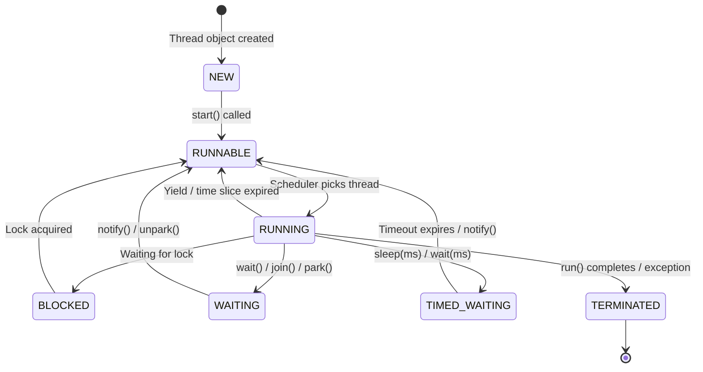
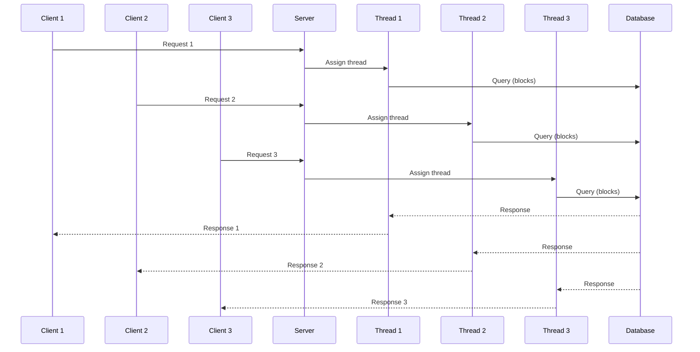
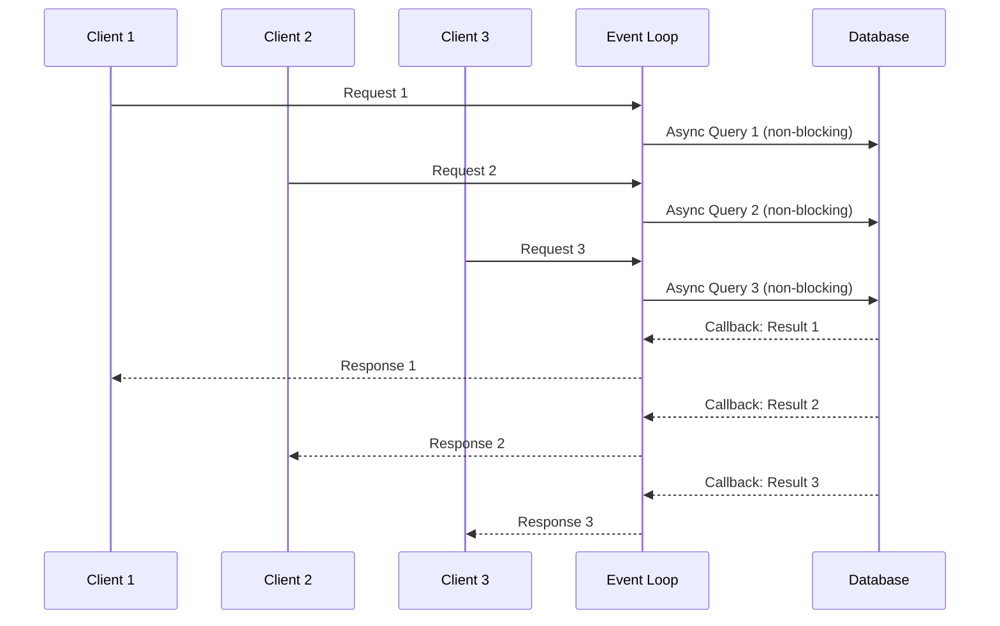

# Thread Fundamentals

## Thread vs Process

A **process** is an independent execution unit with its own memory space.
A **thread** is a lightweight execution unit within a process that shares memory with sibling threads.

```
PROCESS MODEL (Isolated Memory)
================================

  Process A                    Process B
 +------------------+        +------------------+
 | Code  | Data     |        | Code  | Data     |
 |-------+----------|        |-------+----------|
 | Heap             |        | Heap             |
 |------------------|        |------------------|
 | Stack (Thread 1) |        | Stack (Thread 1) |
 +------------------+        +------------------+
        |                           |
   Own virtual                 Own virtual
   address space               address space
        |                           |
   IPC needed to         IPC needed to
   communicate           communicate
   (pipes, sockets,      (pipes, sockets,
    shared memory)        shared memory)


THREAD MODEL (Shared Memory)
================================

  Process A
 +----------------------------------------------+
 | Code (shared)     | Data (shared)            |
 |--------------------+-------------------------|
 | Heap (shared)                                |
 |----------------------------------------------|
 | Stack T1  | Stack T2  | Stack T3  | Stack T4 |
 +----------------------------------------------+
      |           |           |           |
   Threads share code, data, heap, file descriptors
   Each thread has its OWN stack and registers
```

### Comparison Table

| Aspect              | Process                     | Thread                       |
|---------------------|-----------------------------|------------------------------|
| Memory              | Isolated address space       | Shared address space         |
| Creation cost       | Heavy (fork, copy pages)     | Light (new stack + registers)|
| Context switch      | Expensive (~1-10 us)         | Cheaper (~0.1-1 us)         |
| Communication       | IPC (pipes, sockets, mmap)   | Shared memory (direct)      |
| Crash isolation     | One crash does not kill others| One crash can kill all       |
| Debugging           | Easier (isolated)            | Harder (shared state bugs)  |
| Scalability         | Limited by OS overhead        | Limited by synchronization   |

### Context Switch Cost Breakdown

```
PROCESS CONTEXT SWITCH:
  1. Save CPU registers
  2. Save program counter
  3. Flush TLB (Translation Lookaside Buffer)  <-- EXPENSIVE
  4. Switch page tables                        <-- EXPENSIVE
  5. Restore new process state
  6. Cold cache (different working set)        <-- EXPENSIVE

THREAD CONTEXT SWITCH:
  1. Save CPU registers
  2. Save program counter
  3. Switch stack pointer
  4. Restore new thread state
  (No TLB flush, no page table switch -- same address space)
```

---

## Thread Lifecycle



### Java Thread States

```java
public class ThreadLifecycleDemo {
    public static void main(String[] args) throws InterruptedException {
        Object lock = new Object();

        Thread t = new Thread(() -> {
            // RUNNABLE -> RUNNING
            synchronized (lock) {
                try {
                    // RUNNING -> WAITING
                    lock.wait();
                } catch (InterruptedException e) {
                    Thread.currentThread().interrupt();
                }
            }
            // RUNNING -> TERMINATED (run completes)
        });

        System.out.println(t.getState()); // NEW
        t.start();
        Thread.sleep(50);
        System.out.println(t.getState()); // WAITING

        synchronized (lock) {
            lock.notify();
        }
        t.join();
        System.out.println(t.getState()); // TERMINATED
    }
}
```

---

## Green Threads, Virtual Threads, Goroutines, Coroutines

```
OS / KERNEL THREADS (1:1 model)
================================
  Java Thread 1  -->  OS Thread 1
  Java Thread 2  -->  OS Thread 2
  Java Thread 3  -->  OS Thread 3

  Each user thread maps to exactly one OS thread.
  Limited by OS thread count (~10K max practical).


GREEN THREADS / VIRTUAL THREADS (M:N model)
=============================================
  Virtual Thread 1  --+
  Virtual Thread 2  --+--> OS Thread 1 (carrier)
  Virtual Thread 3  --+
  Virtual Thread 4  --+--> OS Thread 2 (carrier)
  Virtual Thread 5  --+
  ...millions...    --+--> OS Thread N (carrier)

  Many virtual threads multiplexed onto few OS threads.
  Scheduler is in userspace, not the kernel.
```

### Java 21 Virtual Threads

```java
// Traditional platform thread -- expensive, limited to ~10K
Thread platformThread = new Thread(() -> doWork());
platformThread.start();

// Virtual thread -- cheap, can have millions
Thread virtualThread = Thread.ofVirtual().start(() -> doWork());

// ExecutorService with virtual threads
try (var executor = Executors.newVirtualThreadPerTaskExecutor()) {
    // Submit 1,000,000 tasks -- each gets its own virtual thread
    for (int i = 0; i < 1_000_000; i++) {
        executor.submit(() -> {
            // Blocking I/O automatically unmounts from carrier thread
            String result = httpClient.send(request, bodyHandler);
            return result;
        });
    }
}
```

**Key insight**: When a virtual thread blocks on I/O, it **unmounts** from its carrier OS thread. The carrier thread is free to run other virtual threads. No thread is wasted waiting.

### Goroutines (Go)

```
Goroutines use an M:N scheduler (GOMAXPROCS carrier threads).
Stack starts at ~2KB (grows dynamically), vs 1MB for OS threads.

  go func() { doWork() }()    // Launch a goroutine
  // Can launch millions with minimal memory
```

### Coroutines (Kotlin, Python)

```
Coroutines are cooperative: they yield control explicitly.
They run on a thread pool but can suspend without blocking the thread.

  Kotlin:  launch { delay(1000); doWork() }
  Python:  async def work(): await asyncio.sleep(1); do_work()
```

| Feature         | OS Thread    | Green/Virtual Thread | Goroutine     | Coroutine     |
|-----------------|-------------|----------------------|---------------|---------------|
| Scheduling      | Preemptive  | Cooperative/Preemptive| Cooperative*  | Cooperative   |
| Stack size      | ~1MB        | ~KB (grows)          | ~2KB (grows)  | Frame-based   |
| Max practical   | ~10K        | Millions             | Millions      | Millions      |
| Blocking I/O    | Blocks OS   | Auto-unmounts        | Auto-unmounts | Must use async|
| Language        | All         | Java 21+             | Go            | Kotlin/Python |

*Goroutines: Go 1.14+ added preemption at function calls.

---

## Thread Safety

A piece of code is **thread-safe** if it behaves correctly when accessed by multiple threads concurrently, with no additional synchronization needed from the caller.

### Why Thread Safety Matters

```
Thread-safe code:     Correctness guaranteed regardless of scheduling.
Non-thread-safe code: Works "most of the time" but produces subtle,
                      non-reproducible bugs under load.
                      -> Data corruption
                      -> Lost updates
                      -> Inconsistent reads
                      -> Crashes
```

### Ways to Achieve Thread Safety

1. **Immutability** -- If state never changes, no synchronization needed
2. **Confinement** -- If state is not shared, no synchronization needed (thread-local)
3. **Synchronization** -- Mutex, locks, atomic operations
4. **Lock-free algorithms** -- CAS-based data structures

---

## Race Condition

A **race condition** occurs when the correctness of a program depends on the relative timing of thread execution.

### Classic Example: Lost Update

```java
public class RaceConditionDemo {
    private static int counter = 0;  // Shared mutable state

    public static void main(String[] args) throws InterruptedException {
        Thread t1 = new Thread(() -> {
            for (int i = 0; i < 100_000; i++) {
                counter++;  // NOT ATOMIC: read -> increment -> write
            }
        });

        Thread t2 = new Thread(() -> {
            for (int i = 0; i < 100_000; i++) {
                counter++;
            }
        });

        t1.start(); t2.start();
        t1.join();  t2.join();

        // Expected: 200,000
        // Actual:   Some number < 200,000 (e.g., 137,422)
        System.out.println("Counter: " + counter);
    }
}
```

### Why the Bug Happens

```
counter++ is THREE operations at the CPU level:

Thread A                    Thread B
--------                    --------
READ counter (=5)
                            READ counter (=5)    <-- stale!
INCREMENT (5->6)
                            INCREMENT (5->6)     <-- same stale value!
WRITE counter (=6)
                            WRITE counter (=6)   <-- LOST UPDATE

Two increments happened but counter only went from 5 to 6.
```

---

## Critical Section

The **critical section** is the portion of code that accesses shared resources and must not be executed by more than one thread at a time.

```java
public class BankAccount {
    private double balance;

    // --- CRITICAL SECTION START ---
    public synchronized void transfer(BankAccount target, double amount) {
        if (this.balance >= amount) {
            this.balance -= amount;
            target.balance += amount;
        }
    }
    // --- CRITICAL SECTION END ---
}
```

**Design principle**: Keep critical sections as short as possible to minimize contention.

---

## Atomicity, Visibility, Ordering (Java Memory Model)

### Atomicity
An operation is **atomic** if it executes as a single, indivisible step.

```java
int x = 42;          // Atomic (32-bit write)
long y = 123456789L; // NOT guaranteed atomic on 32-bit JVM (two 32-bit writes)
counter++;           // NOT atomic (read + increment + write)
```

### Visibility
Changes made by one thread are **visible** to other threads.

```
WITHOUT visibility guarantee:

  Thread A (CPU Core 1)       Thread B (CPU Core 2)
  +-------------------+       +-------------------+
  | CPU Cache:        |       | CPU Cache:        |
  | flag = true       |       | flag = false      |  <-- STALE
  +-------------------+       +-------------------+
          |                           |
          +------+  Main Memory +-----+
                 | flag = true  |
                 +--------------+

  Thread B may NEVER see Thread A's write if the value
  stays in CPU cache and is never flushed to main memory.
```

### Ordering
The compiler and CPU may **reorder** instructions for optimization.

```java
// Source code order:
int a = 1;    // (1)
int b = 2;    // (2)
flag = true;  // (3)

// CPU/compiler might execute as:
flag = true;  // (3) -- reordered before (1) and (2)!
int b = 2;    // (2)
int a = 1;    // (1)
```

**Happens-before relationship**: The JMM defines which operations are guaranteed to be visible to other threads. Key rules:
- `synchronized` block exit happens-before subsequent entry on the same monitor
- `volatile` write happens-before subsequent read of the same variable
- `Thread.start()` happens-before any action in the started thread

---

## volatile Keyword

`volatile` guarantees **visibility** and **ordering**, but NOT **atomicity**.

```java
public class VolatileExample {
    private volatile boolean running = true;  // Visible across threads

    public void stop() {
        running = false;  // Write is immediately visible to all threads
    }

    public void run() {
        while (running) {  // Always reads from main memory, not cache
            doWork();
        }
    }
}
```

### What volatile Does NOT Do

```java
private volatile int counter = 0;

// STILL NOT THREAD-SAFE:
counter++;  // Read (volatile) -> Increment (local) -> Write (volatile)
            // Another thread can read between the read and write
```

### When to Use volatile

| Use Case                        | volatile Sufficient? |
|---------------------------------|---------------------|
| Boolean flag (stop signal)      | YES                 |
| Status/state read by many       | YES                 |
| Counter incremented by many     | NO (use AtomicInteger) |
| Double-checked locking          | YES (on the instance field) |

---

## Thread-per-Request vs Event Loop Model

### Thread-per-Request



```
Thread-per-Request Model:
  - One OS thread per connection
  - Thread blocks during I/O (DB call, file read, network)
  - Simple programming model (synchronous code)
  - Limited by thread count (~1K-10K connections)

  +-------+    +-------+    +-------+
  | Req 1 |    | Req 2 |    | Req 3 |   ... 10K max
  +---+---+    +---+---+    +---+---+
      |            |            |
  +---v---+    +---v---+    +---v---+
  | Thr 1 |    | Thr 2 |    | Thr 3 |   1 thread per request
  | BLOCK |    | BLOCK |    | BLOCK |   thread idle during I/O
  +-------+    +-------+    +-------+
```

### Event Loop (Single-Threaded Non-Blocking)



```
Event Loop Model:
  - Single thread handles ALL connections
  - I/O is non-blocking (register callback, move on)
  - Can handle 100K+ connections
  - Complex programming model (callbacks, promises)

  +-------+  +-------+  +-------+
  | Req 1 |  | Req 2 |  | Req 3 |   ... 100K+ connections
  +---+---+  +---+---+  +---+---+
      |          |          |
      +-----+----+----+----+
            |              
       +----v----+         
       |  EVENT  |  Single thread processes events sequentially
       |  LOOP   |  Never blocks -- registers callbacks for I/O
       +---------+         
```

### Comparison

| Aspect              | Thread-per-Request           | Event Loop                   |
|---------------------|------------------------------|------------------------------|
| Concurrency model   | Parallel (multi-threaded)    | Concurrent (single-threaded) |
| Max connections     | ~1K-10K                      | ~100K+                       |
| Programming model   | Simple (synchronous)         | Complex (async callbacks)    |
| CPU-bound work      | Good (parallel execution)    | Bad (blocks the loop)        |
| I/O-bound work      | Wasteful (threads idle)      | Efficient (no idle threads)  |
| Memory per conn     | ~1MB (thread stack)          | ~KB (event/callback)         |
| Debugging           | Stack traces available       | Callback hell, hard to trace |
| Examples            | Tomcat, Spring MVC           | Node.js, Netty, Nginx        |

### The Modern Hybrid: Virtual Threads

Java 21 virtual threads combine the best of both worlds:
- **Write synchronous code** (thread-per-request simplicity)
- **Get event-loop efficiency** (virtual threads unmount on I/O)
- Millions of virtual threads, each with its own stack trace

```java
// Simple synchronous code, but backed by virtual threads
try (var executor = Executors.newVirtualThreadPerTaskExecutor()) {
    for (int i = 0; i < 100_000; i++) {
        executor.submit(() -> {
            // Looks blocking, but virtual thread unmounts on I/O
            var result = restTemplate.getForObject(url, String.class);
            return process(result);
        });
    }
}
```

---

## Interview Cheat Sheet

```
Q: "What is thread safety?"
A: Code that produces correct results under concurrent access
   without requiring external synchronization.

Q: "Process vs Thread?"
A: Process = isolated memory. Thread = shared memory within process.
   Threads are cheaper to create and switch but harder to debug.

Q: "What is a race condition?"
A: When program correctness depends on thread scheduling order.
   Fix: synchronization (locks, atomics, immutability).

Q: "Explain the Java Memory Model in 30 seconds."
A: Three guarantees needed: Atomicity (indivisible ops),
   Visibility (writes seen by other threads),
   Ordering (no surprise reordering).
   synchronized/volatile/final establish happens-before.

Q: "When would you use virtual threads?"
A: I/O-heavy workloads with many concurrent connections.
   NOT for CPU-bound work (no benefit over platform threads).
```
