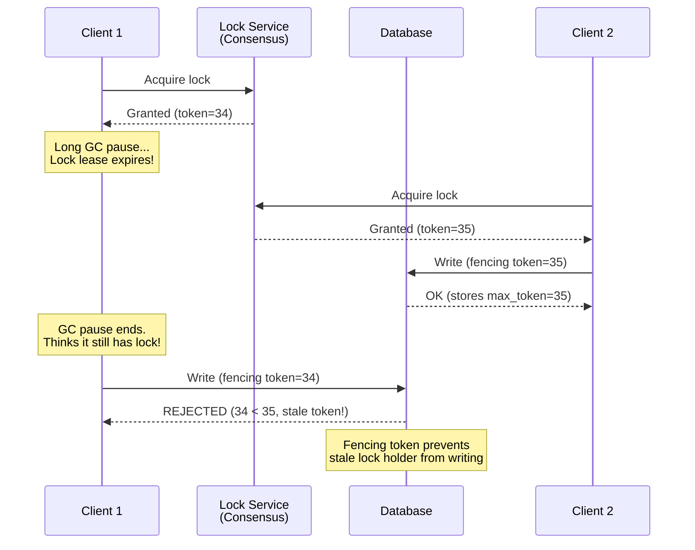

# Consensus in Practice

## Where Consensus Appears in Real Systems

Consensus is not a product -- it is an infrastructure primitive embedded inside many
systems. Understanding where it appears and why helps you reason about system design
trade-offs.

---

## Use Case 1: Leader Election

The most common use of consensus: picking one node to be "the leader" of something.

### How It Works

```
System: Kafka brokers (pre-KRaft, using ZooKeeper)

  Broker 1 ---+
  Broker 2 ---+--> ZooKeeper ensemble (ZAB consensus)
  Broker 3 ---+      |
                      v
              "Broker 2 is controller"
              (ephemeral znode -- if Broker 2 dies, lock released,
               another broker grabs it)
```

### Real Systems

| System | Consensus For | Mechanism |
|---|---|---|
| Kafka (old) | Controller election | ZooKeeper ephemeral znodes |
| Kafka (KRaft) | Controller election | Built-in Raft |
| Elasticsearch | Master election | Zen Discovery (Paxos-like) -> now a Raft-like protocol |
| Redis Sentinel | Master failover | Raft-like voting among sentinels |
| MongoDB | Primary election | Raft-like protocol in replica sets |

---

## Use Case 2: Metadata Management

Storing small but critical cluster metadata that MUST be consistent.

### Kafka KRaft Architecture

```
Before KRaft:                         After KRaft:
  Brokers --> ZooKeeper               Controller quorum (Raft)
  (external dependency)                 |   |   |
                                      C1  C2  C3  (3 controllers)
                                        \  |  /
                                      Raft consensus for:
                                        - Topic metadata
                                        - Partition assignments
                                        - Broker registrations
                                        - ACLs
```

Kafka's KRaft stores a **metadata log** via Raft consensus among controller nodes.
This removed the external ZooKeeper dependency, simplifying operations.

### What Gets Stored via Consensus

Only **small, critical, slowly-changing** metadata:
- Topic configurations and partition assignments
- Cluster membership (which brokers are alive)
- Access control lists
- Schema registry metadata

Data plane traffic (actual messages) does NOT go through consensus -- it uses replication
with configurable acknowledgment (acks=all, acks=1, etc.).

---

## Use Case 3: Distributed Locks

Consensus provides the foundation for reliable distributed locks.

### Google Chubby

Chubby is Google's distributed lock service, built on Paxos. It provides:
- Coarse-grained locks (held for minutes to hours, not milliseconds)
- Small file storage (like ZooKeeper znodes)
- Event notifications

```
Chubby cell: 5 servers running Paxos
  |
  +-- Lock: /ls/cell/master-election/my-service
  |     Owner: Server-7 (holds lock)
  |     Sequencer: epoch=42, sequence=108
  |
  +-- File: /ls/cell/config/my-service
        Contents: { "shard_count": 16, "version": 3 }
```

### etcd Distributed Locks

etcd provides locks using its Raft-based KV store with leases:

```
Lock acquisition:
  1. Create a key with a lease (TTL): /locks/my-resource/session-id
  2. Use etcd's revision-based ordering to determine who holds the lock
  3. Lowest revision = lock holder
  4. Others watch for deletion

Lock release:
  - Explicit delete, OR
  - Lease expires (if holder crashes)
```

### The Fencing Token Pattern

Distributed locks have a fundamental problem: a lock holder can be **paused** (GC, page
fault, network partition) while still thinking it holds the lock. Another node acquires
the lock, and now two nodes think they hold it.



**The fencing token is a monotonically increasing number issued with each lock grant.**
The storage layer rejects writes with tokens lower than the highest it has seen.

---

## Use Case 4: Configuration Store (etcd in Kubernetes)

### How Kubernetes Uses etcd

```
                 +------------------+
                 |   API Server     |
                 +--------+---------+
                          |
                          v
              +-----------+-----------+
              |     etcd cluster      |
              |   (3 or 5 nodes)      |
              +-----------------------+
              
              Stores ALL cluster state:
              /registry/pods/default/my-pod
              /registry/services/default/my-svc
              /registry/deployments/default/my-deploy
              /registry/configmaps/default/my-config
              /registry/secrets/default/my-secret
```

Every Kubernetes object (pod, service, deployment, configmap, secret) is stored in etcd.
The API server is the ONLY component that talks to etcd. All other components (kubelet,
scheduler, controller-manager) go through the API server.

### Why Consensus Matters Here

If etcd disagrees about the state of the cluster, Kubernetes breaks:
- Scheduler might schedule pods on a node that is actually dead
- Two controllers might both try to manage the same resource
- Configuration updates might be lost

etcd's Raft consensus ensures that even if 1 (of 3) or 2 (of 5) etcd nodes fail,
the cluster state remains consistent and available.

---

## Use Case 5: Replicated State Machines

The most powerful use of consensus: replicating an entire database.

### CockroachDB Architecture

```
CockroachDB stores data in sorted ranges.
Each range is its own Raft group.

  Node 1          Node 2          Node 3
  +------+        +------+        +------+
  | R1-L |        | R1-F |        | R1-F |   Range 1 Raft group
  | R2-F |        | R2-L |        | R2-F |   Range 2 Raft group
  | R3-F |        | R3-F |        | R3-L |   Range 3 Raft group
  +------+        +------+        +------+

  L = Leader, F = Follower

  A SQL transaction that spans ranges 1 and 3:
    1. Acquire write intents on both ranges
    2. Each write goes through that range's Raft leader
    3. Committed on majority ack within each Raft group
    4. Two-phase commit across ranges for atomicity
```

### TiDB / TiKV

Similar architecture: TiKV uses Multi-Raft with one Raft group per region.
PD (Placement Driver) manages region metadata and handles leader balancing.

---

## Performance Characteristics

### Latency Breakdown

```
Consensus write latency = network RTT + disk fsync + processing

Typical breakdown (3-node cluster, same datacenter):
  Network RTT:     0.1-0.5ms (LAN)
  Disk fsync:      0.5-5ms   (SSD) or 5-15ms (HDD)
  Processing:      0.01-0.1ms
  ---------------------------------
  Total:           ~1-6ms per write

Bottleneck: DISK FSYNC
  - Raft requires writing log to durable storage BEFORE acknowledging
  - This is the dominant cost
  - SSD vs HDD makes a massive difference
  - Some systems batch multiple entries per fsync to amortize
```

### Throughput Optimization: Batching

```
Without batching:
  Entry 1: fsync -> replicate -> commit -> fsync -> replicate -> commit -> ...
  ~1000-5000 operations/sec

With batching:
  [Entry 1, Entry 2, ..., Entry 50]: ONE fsync -> replicate -> commit
  ~50,000-200,000 operations/sec

etcd batches automatically when load is high.
CockroachDB batches per-range Raft entries.
```

### Performance by Cluster Size

| Cluster Size | Majority | Write Latency | Throughput | Fault Tolerance |
|---|---|---|---|---|
| 3 | 2 | Fastest (wait for 1 follower) | Highest | 1 failure |
| 5 | 3 | Moderate (wait for 2 followers) | Good | 2 failures |
| 7 | 4 | Slower (wait for 3 followers) | Lower | 3 failures |

In practice, 5 nodes is the sweet spot for most systems. It tolerates 2 failures (enough
for rolling upgrades) without too much performance cost.

---

## Split Brain Prevention

### The Problem

A network partition splits the cluster into two groups. If both groups elect a leader
and accept writes, the data diverges -- **split brain**.

### How Consensus Prevents It

Consensus algorithms require a **majority** for all decisions. Since a majority is > N/2,
at most one partition can have a majority. The minority partition cannot elect a leader
or commit entries.

```
5-node cluster, network partition:

  Partition A: [S1, S2, S3]  -- majority (3/5), can elect leader, CAN serve writes
  Partition B: [S4, S5]      -- minority (2/5), CANNOT elect leader, read-only at best

  When partition heals:
  S4, S5 rejoin and sync logs from the leader in Partition A.
  No data loss, no inconsistency.
```

### Fencing Tokens and Epoch Numbers

Even with consensus, components OUTSIDE the consensus group might not know about leadership
changes. Fencing tokens (or epoch numbers) solve this:

```
Epoch 1: Leader A is active, uses token=1 for external operations
Epoch 2: Leader A is partitioned. Leader B elected, uses token=2.

External storage:
  Operation with token=2: ACCEPTED (token >= max_seen)
  Operation with token=1 (from stale A): REJECTED (token < max_seen=2)
```

This is the same fencing pattern described in the distributed locks section. It is a
general principle: any resource accessed by a consensus-elected leader should validate
the epoch/fencing token.

---

## Interview Framework: Discussing Consensus in System Design

### Step 1: Identify Where You Need Consensus

"In this design, X is a critical piece of metadata / leader election / lock that must
be strongly consistent. I would use a consensus-based system like etcd or ZooKeeper for
this."

### Step 2: Justify the Choice

"We need consensus here because [inconsistency would cause split brain / data loss /
duplicate processing]. Using eventual consistency is not acceptable for [this specific
component]."

### Step 3: Scope It

"Only the [metadata / leader election / lock state] goes through consensus. The data
plane uses [replication with acks / eventual consistency / etc.] for throughput."

### Step 4: Address Performance

"Consensus adds latency (~1-5ms per write in LAN), but this is acceptable because this
path handles [low-volume metadata / infrequent leader changes / rare lock acquisitions].
High-throughput data does NOT go through consensus."

### Do NOT Use Consensus For

| Scenario | Why Not | Use Instead |
|---|---|---|
| High-throughput data writes | Too slow, leader bottleneck | Replication with tunable consistency |
| User session state | Not critical enough | Redis, Memcached |
| Analytics data | Eventual consistency is fine | Kafka, S3 |
| Cache state | Regenerable | Redis, local cache |

---

## Common Interview Questions with Answers

### Q: "How would you ensure only one instance of a service processes a task?"

> Use a distributed lock via a consensus-backed system like etcd or ZooKeeper. The
> service acquires a lock (key with a TTL lease). If the holder crashes, the lease
> expires and another instance acquires it. Use fencing tokens to protect against
> stale lock holders.

### Q: "How do you handle leader election for your service?"

> Register candidates in etcd/ZooKeeper. The node that creates the ephemeral key (or
> key with the lowest revision) is the leader. Other nodes watch for the key's deletion.
> On deletion, the next candidate becomes leader. The consensus backend ensures exactly
> one leader.

### Q: "What happens if the network partitions your cluster?"

> Consensus requires a majority. The partition with the majority continues operating;
> the minority partition becomes read-only or unavailable. When the partition heals,
> the minority nodes sync to the majority's state. No split brain occurs.

### Q: "Can you explain CAP theorem and how it relates to consensus?"

> CAP states that a distributed system cannot simultaneously provide Consistency,
> Availability, and Partition tolerance -- you must choose two. Consensus systems
> (Raft, Paxos) choose CP: they are consistent and partition-tolerant but sacrifice
> availability during partitions (the minority partition cannot serve writes). This is
> the right choice for metadata and coordination. For data that tolerates staleness,
> AP systems (Dynamo, Cassandra) are appropriate.

### Q: "What is the difference between 3 and 5 node clusters?"

> 3 nodes tolerates 1 failure (majority = 2). 5 nodes tolerates 2 failures (majority = 3).
> 5 nodes is preferred for production because you can perform a rolling upgrade (take 1
> node down) while still tolerating 1 additional failure. The trade-off is slightly higher
> write latency (waiting for 2 followers instead of 1) and more disk/network resources.

---

## Cheat Sheet

### Consensus in 10 Seconds

```
Consensus = N servers agree on a value/sequence even when some fail.
Raft: leader-based, understandable, used by etcd/CockroachDB.
Paxos: foundational, two-phase, used by Google internally.
Quorum: majority (N/2+1) required for any decision.
Latency: 1-5ms per write (dominated by disk fsync).
Cluster size: 3 or 5 nodes (rarely 7, never more).
```

### When to Use What

```
Need strong consistency for metadata?     --> etcd (Raft)
Need distributed locks?                   --> etcd or ZooKeeper
Need replicated database?                 --> CockroachDB / TiDB (Multi-Raft)
Need cluster membership / failure detect? --> Gossip (SWIM)
Need Byzantine tolerance?                 --> PBFT (rare outside blockchain)
```

### Key Numbers to Remember

| What | Number | Why |
|---|---|---|
| Minimum viable cluster | 3 nodes | Tolerates 1 failure |
| Production cluster | 5 nodes | Tolerates 2 failures + rolling upgrades |
| Write latency (LAN) | 1-5ms | Disk fsync dominates |
| Write latency (WAN) | 50-200ms | Cross-region RTT dominates |
| Failover time (Raft) | 1-10 seconds | Election timeout + election |
| Gossip convergence | O(log N) rounds | ~10s for 1000 nodes at 1s interval |
| PBFT nodes for f=1 | 4 nodes | 3f+1 rule |
| Raft/Paxos nodes for f=1 | 3 nodes | 2f+1 rule |

### The One Thing to Never Forget

> **Consensus is for the control plane, not the data plane.** Use it for metadata,
> leader election, locks, and configuration. NEVER route high-throughput data through
> a consensus protocol -- it will become the bottleneck.
