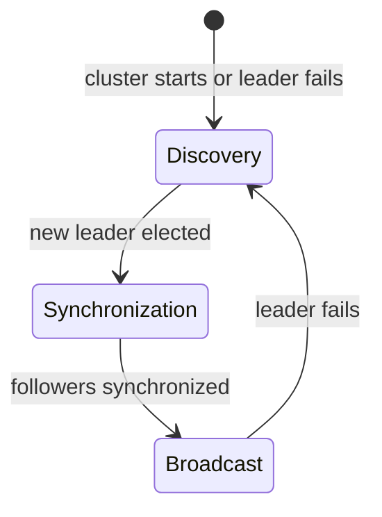
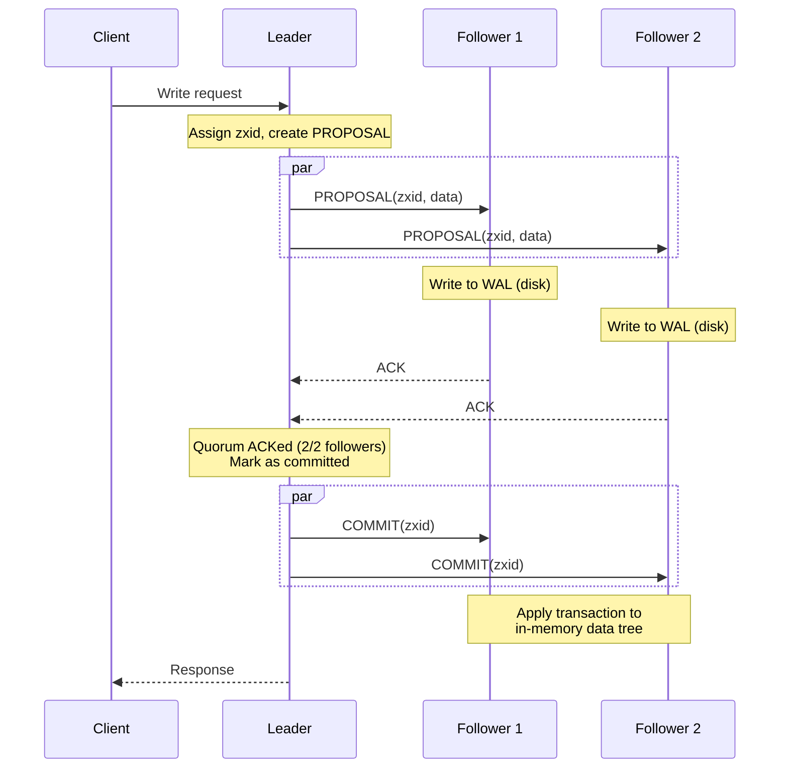
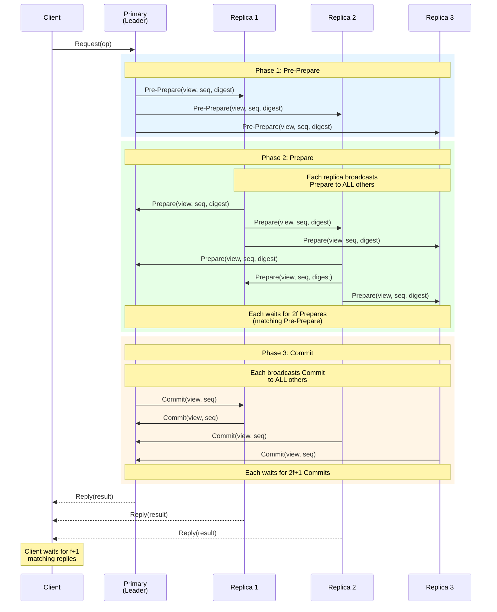
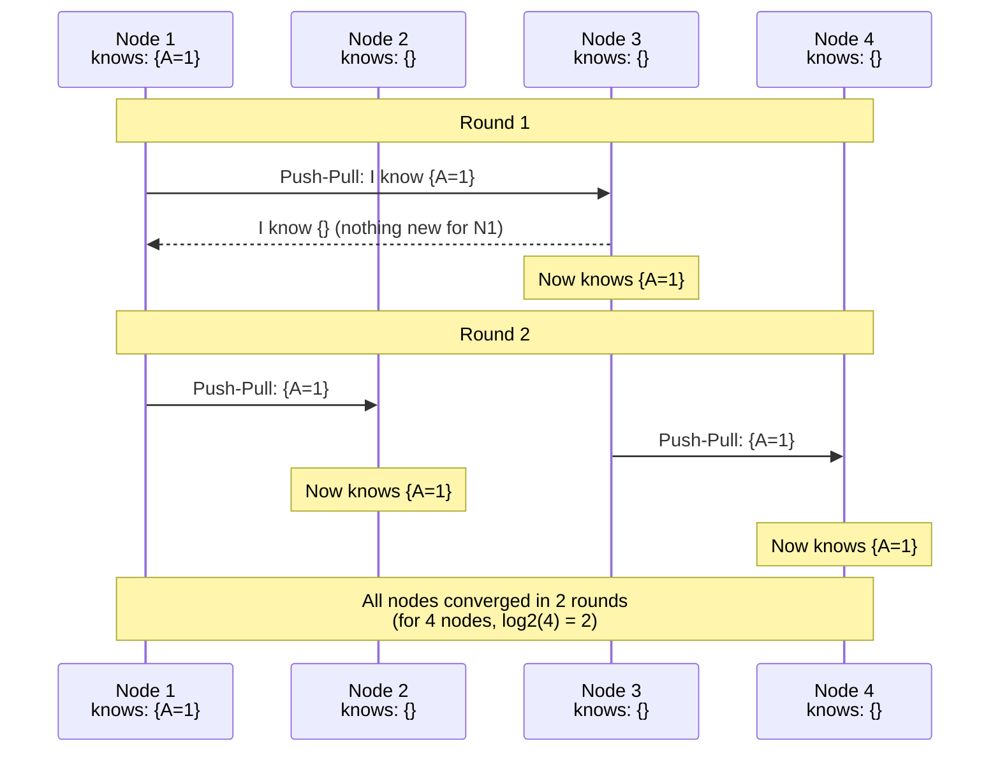

# Other Consensus and Agreement Protocols

## Overview

Raft and Paxos dominate the consensus conversation, but several other protocols appear
in real systems and interviews. This document covers ZAB, PBFT, Gossip, Viewstamped
Replication, and provides a comprehensive comparison.

---

## ZAB (ZooKeeper Atomic Broadcast)

ZAB is the consensus protocol behind Apache ZooKeeper. It was designed specifically for
ZooKeeper's primary-backup replication model, not as a general-purpose consensus algorithm.

### Why ZAB Exists

ZooKeeper needs:
1. **Total order broadcast**: all servers deliver the same messages in the same order
2. **Primary-backup**: one leader handles all writes, followers replicate
3. **FIFO guarantees**: a client's operations are applied in order

ZAB is not a generic consensus protocol -- it is an **atomic broadcast** protocol optimized
for the replicated state machine use case.

### Three Phases of ZAB



**Phase 1: Discovery (Leader Election)**
- Followers send their latest transaction ID (zxid) to prospective leaders
- The candidate with the highest zxid and support from a quorum becomes leader
- Leader learns the latest transactions from all followers in the quorum

**Phase 2: Synchronization**
- New leader ensures all followers have the same committed transactions
- Sends any transactions the follower is missing
- Follower acknowledges once synchronized
- Once a quorum of followers is synchronized, leader can begin broadcasting

**Phase 3: Broadcast (Normal Operation)**
- Leader receives client write requests
- Leader assigns a zxid (epoch + counter) and broadcasts a PROPOSAL
- Followers write to disk (WAL) and send ACK
- Once leader has ACK from a quorum, it sends COMMIT
- Followers apply the committed transaction

### Broadcast Sequence



### ZAB vs Raft

| Aspect | ZAB | Raft |
|---|---|---|
| Model | Atomic broadcast | Replicated state machine |
| Transaction IDs | Epoch-based zxid (epoch.counter) | Term + log index |
| Leader election | Based on highest zxid | Based on log up-to-dateness |
| Synchronization | Explicit phase after election | Integrated into AppendEntries |
| FIFO per client | Built into the protocol | Application-level concern |
| Specification | Less formally specified | TLA+ specification available |
| Reads | Can be served by followers (stale) or leader (fresh) | Default through leader |

### ZooKeeper in Practice

```
Typical ZooKeeper ensemble: 3 or 5 nodes

Used for:
  - Leader election for other services (Kafka, HBase)
  - Distributed locks
  - Configuration management
  - Service discovery
  - Group membership

Being replaced by:
  - etcd (Raft-based, used by Kubernetes)
  - Kafka KRaft (Kafka's own Raft, replacing ZK dependency)
```

---

## PBFT (Practical Byzantine Fault Tolerance)

### The Byzantine Problem

All protocols discussed so far (Raft, Paxos, ZAB) assume **crash-stop failures**: a
server either works correctly or is completely dead. They CANNOT handle servers that
lie, send conflicting messages, or behave maliciously.

**Byzantine fault tolerance (BFT)** handles arbitrary failures, including:
- A server sending different values to different peers
- A server claiming to have data it does not
- A server deliberately trying to cause inconsistency

### PBFT Core Idea

PBFT (Castro & Liskov, 1999) tolerates up to **f Byzantine faults** with **3f + 1** nodes.

```
Why 3f + 1?
  - f nodes might be Byzantine (lying)
  - f nodes might be offline (crashed)
  - You need f + 1 honest, live nodes to form a correct majority
  - Total: f (Byzantine) + f (crashed) + f + 1 (honest) = 3f + 1

For f=1: need 4 nodes (tolerate 1 Byzantine)
For f=2: need 7 nodes (tolerate 2 Byzantine)
For f=3: need 10 nodes (tolerate 3 Byzantine)
```

Compare with crash-fault-tolerant protocols:
```
Crash-stop (Raft/Paxos): 2f + 1 nodes for f failures
Byzantine (PBFT):        3f + 1 nodes for f failures

For 1 failure:  Raft needs 3,  PBFT needs 4
For 2 failures: Raft needs 5,  PBFT needs 7
```

### PBFT Three-Phase Protocol



**Phase 1 - Pre-Prepare**: Primary assigns a sequence number and broadcasts to all replicas.

**Phase 2 - Prepare**: Each replica broadcasts a Prepare message to ALL other replicas (not
just the primary). Once a replica collects 2f matching Prepare messages (plus the
Pre-Prepare), it is "prepared" and enters the Commit phase.

**Phase 3 - Commit**: Each replica broadcasts a Commit to ALL others. Once it collects 2f+1
matching Commits, it executes the operation and replies to the client.

The client waits for **f+1 identical replies** from different replicas.

### Why Three Phases?

```
Can we do it in two phases?

No. With only Pre-Prepare + Prepare:
- A Byzantine primary could send different Pre-Prepares to different replicas
- Replicas would "prepare" different things
- Without the Commit phase, replicas cannot confirm they all prepared the same thing

The Commit phase ensures: if any honest replica executes, enough honest replicas
have also committed to the same ordering, so the decision survives view changes.
```

### PBFT Performance

| Metric | Value |
|---|---|
| Message complexity | O(N^2) per decision |
| Latency | 3 message delays |
| Throughput | Limited by all-to-all broadcasts |
| Scalability | Practical up to ~20 nodes |

### Where PBFT Is Used

- **Blockchain**: Hyperledger Fabric uses a PBFT-like protocol
- **Permissioned distributed ledgers**: when you control who joins but do not fully trust them
- **Financial systems**: some clearinghouse systems
- **NOT** public blockchains (they use Proof of Work/Stake instead, for different reasons)

---

## Gossip Protocol

### What It Is

Gossip is NOT a consensus protocol. It is an **epidemic dissemination** protocol -- a way
to spread information across a cluster without centralized coordination. It is
**eventually consistent**, not strongly consistent.

### How It Works

```
Each node periodically (e.g., every second):
  1. Picks a RANDOM peer
  2. Exchanges state information with that peer
  3. Both update their local state with the union of what they know

Three styles:
  - Push: I tell you what I know
  - Pull: I ask you what you know
  - Push-Pull: We exchange (most efficient)
```

### Convergence

```
Round 0: 1 node knows the information
Round 1: ~2 nodes know (told 1 random peer)
Round 2: ~4 nodes know
Round 3: ~8 nodes know
...
Round k: ~2^k nodes know

For N nodes: convergence in O(log N) rounds

Example: 1000-node cluster, 1-second gossip interval
  Rounds to reach all: ~10 rounds = ~10 seconds
  (In practice, slightly longer due to redundant contacts)
```

### Gossip Sequence Example



### What Gossip Is Used For

| Use Case | System | Details |
|---|---|---|
| Cluster membership | Cassandra | Nodes gossip about which nodes are alive/dead |
| Failure detection | SWIM protocol | Combines gossip with direct/indirect probing |
| State dissemination | Consul (Serf) | Propagating cluster events and metadata |
| Anti-entropy | Dynamo-style DBs | Comparing Merkle trees to find diverged replicas |
| Metrics aggregation | Prometheus | Some gossip for alertmanager clustering |

### SWIM Protocol (Scalable Weakly-consistent Infection-style Membership)

SWIM is a membership protocol that combines gossip with direct probing:

```
Every T seconds, node A:
  1. Picks random node B
  2. Sends PING to B
  3. If B responds: B is alive
  4. If B does NOT respond within timeout:
     a. Pick k random nodes C1, C2, ..., Ck
     b. Ask them to PING B on A's behalf (indirect probe)
     c. If any Ci gets a response from B: B is alive
     d. If none: suspect B is dead
  5. Piggyback membership updates on all messages (gossip)
```

SWIM's advantages over pure heartbeat:
- **O(1) load per member per protocol period** (constant, not growing with cluster size)
- **Fast detection** (does not wait for multiple missed heartbeats)
- **Scalable** to thousands of nodes

### Gossip vs Consensus

| Property | Gossip | Consensus (Raft/Paxos) |
|---|---|---|
| Consistency | Eventual | Strong (linearizable) |
| Fault tolerance | Very high (works with many failures) | Requires majority alive |
| Speed | O(log N) rounds to converge | O(1) round trips for decision |
| Use case | Membership, metrics, soft state | Critical decisions, leader election, log replication |
| Complexity | Simple to implement | Complex to implement correctly |
| Message overhead | O(N) per round (each node contacts 1 peer) | O(N) per decision (leader contacts all) |

---

## Viewstamped Replication (VR)

Viewstamped Replication (Oki & Liskov, 1988) predates both Paxos and Raft. It is the
earliest leader-based replicated state machine protocol.

### Core Concepts

- **View**: similar to Raft's term. Each view has one primary.
- **View change**: similar to Raft's leader election.
- **Normal operation**: primary receives requests, assigns sequence numbers, broadcasts to
  replicas, waits for majority.

### VR vs Raft

| Aspect | Viewstamped Replication | Raft |
|---|---|---|
| Year | 1988 | 2014 |
| Views/Terms | Views (similar to terms) | Terms |
| Leader | Primary | Leader |
| Commit condition | Majority of replicas ACK | Majority of servers ACK |
| Election | View change protocol (all replicas participate) | RequestVote (candidate solicits votes) |
| Log gaps | None (like Raft) | None |
| Popularity | Academic; few production systems | Widespread production use |

### Why VR Matters

Raft's authors acknowledge VR as a major influence. VR and Raft are structurally very
similar. The main difference is Raft's explicit focus on understandability and its
complete specification (membership changes, snapshots, etc.).

If an interviewer asks "what came before Raft?", VR is the answer (alongside Paxos).

---

## Comparison: All Consensus Algorithms

### Fault Model Comparison

| Algorithm | Fault Model | Nodes for f Faults | Rounds (Steady State) |
|---|---|---|---|
| Paxos (Single-Decree) | Crash-stop | 2f+1 | 2 |
| Multi-Paxos | Crash-stop | 2f+1 | 1 (with stable leader) |
| Raft | Crash-stop | 2f+1 | 1 |
| ZAB | Crash-stop | 2f+1 | 1 |
| Viewstamped Replication | Crash-stop | 2f+1 | 1 |
| EPaxos | Crash-stop | 2f+1 | 1 (no conflicts) / 2 (conflicts) |
| PBFT | Byzantine | 3f+1 | 3 |

### Comprehensive Feature Comparison

| Feature | Raft | Multi-Paxos | ZAB | EPaxos | PBFT | Gossip |
|---|---|---|---|---|---|---|
| **Consistency** | Strong | Strong | Strong | Strong | Strong | Eventual |
| **Leader needed** | Yes | Yes (for perf) | Yes | No | Yes (primary) | No |
| **Understandability** | High | Low | Medium | Low | Medium | High |
| **WAN-friendly** | No | No | No | Yes | No | Yes |
| **Throughput** | Good | Good | Good | Very Good | Poor | N/A |
| **Message complexity** | O(N) | O(N) | O(N) | O(N) | O(N^2) | O(N) per round |
| **Handles Byzantine** | No | No | No | No | Yes | N/A |
| **Production systems** | etcd, Consul | Spanner, Chubby | ZooKeeper | Research | Hyperledger | Cassandra |
| **Spec completeness** | Full | Partial | Partial | Full | Full | Simple |

### Decision Tree: Which Protocol When?

```
Need consensus?
  |
  +-- Need to tolerate MALICIOUS nodes?
  |     |
  |     +-- YES --> PBFT (or blockchain consensus)
  |     |           Need: 3f+1 nodes, O(N^2) messages
  |     |
  |     +-- NO --> Crash-stop protocols (below)
  |
  +-- Need STRONG consistency?
  |     |
  |     +-- YES --> Raft, Paxos, or ZAB
  |     |     |
  |     |     +-- Multi-region, leaderless? --> EPaxos
  |     |     +-- Need complete spec?       --> Raft
  |     |     +-- Already using ZooKeeper?  --> ZAB (it's built in)
  |     |     +-- Google scale, expert team? --> Multi-Paxos
  |     |
  |     +-- NO --> Eventual consistency sufficient
  |           |
  |           +-- Membership / failure detection --> Gossip (SWIM)
  |           +-- State dissemination            --> Gossip
  |           +-- Anti-entropy repair            --> Gossip + Merkle trees
```

---

## Interview Tips

### Quick-Reference Answers

**"What is the difference between Raft and Paxos?"**
> Raft and Paxos achieve the same safety guarantees. The difference is specification
> completeness: Raft provides a complete, implementable algorithm including leader
> election, membership changes, and log compaction. Paxos describes the core consensus
> mechanism but leaves many practical details unspecified. Raft was explicitly designed
> for understandability.

**"When would you use PBFT?"**
> When you cannot trust all participants. In crash-stop models (Raft, Paxos), we assume
> failed nodes simply stop. PBFT handles nodes that actively lie or behave maliciously.
> The cost is needing 3f+1 nodes instead of 2f+1 and O(N^2) message complexity, so it
> is only practical for small clusters (~10-20 nodes). Permissioned blockchains like
> Hyperledger use PBFT-like protocols.

**"What is gossip protocol?"**
> Gossip is not consensus -- it is epidemic dissemination. Each node periodically picks a
> random peer and exchanges state. Information spreads exponentially, converging in O(log N)
> rounds. It is used for cluster membership (Cassandra), failure detection (SWIM protocol),
> and state dissemination (Consul/Serf). It is eventually consistent, highly fault tolerant,
> and scales to thousands of nodes.
