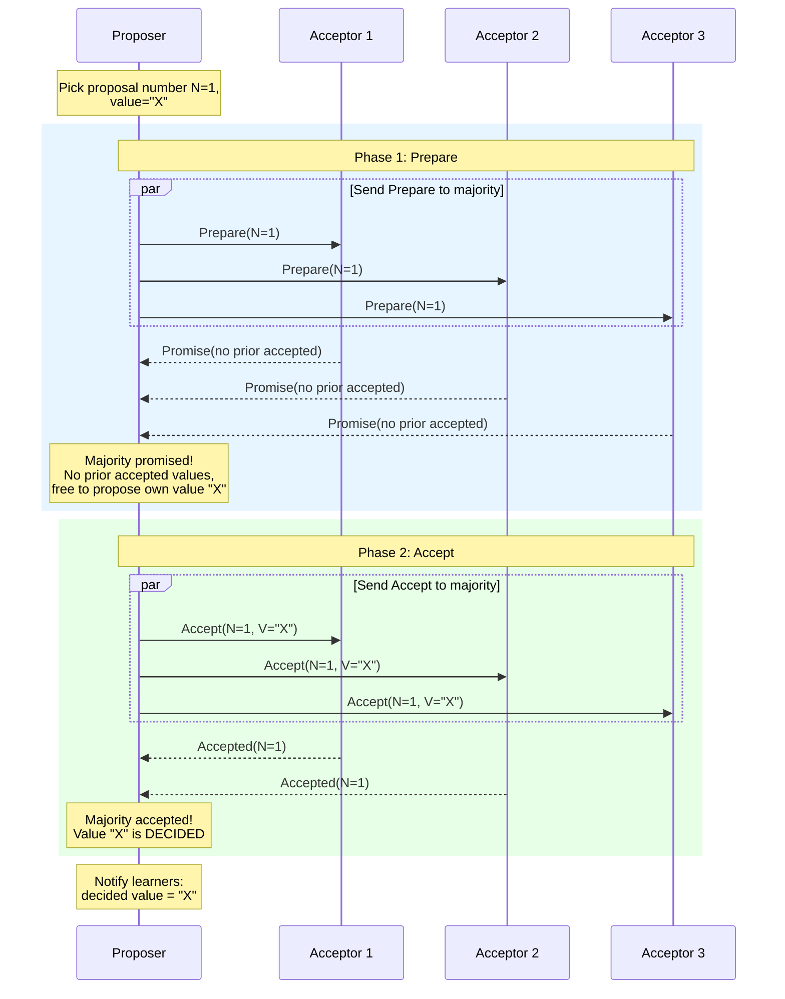
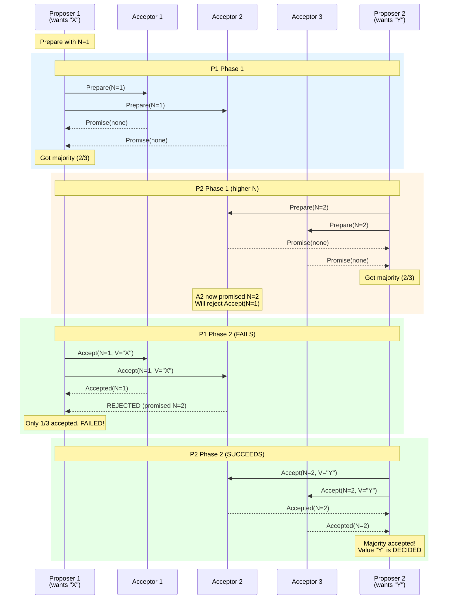

# Paxos Consensus Algorithm

## Context

Paxos was invented by Leslie Lamport in 1989 (published 1998, re-explained in "Paxos Made
Simple" in 2001). It is the foundational consensus algorithm -- every consensus protocol
designed since is either a variant of Paxos or explicitly reacts to it.

Paxos is famous for two things:
1. Being **provably correct** for achieving consensus
2. Being **notoriously difficult** to understand and implement

Google's Chubby lock service paper (2006) states:
> "There are significant gaps between the description of the Paxos algorithm
> and the needs of a real-world system... the final system will be based on
> an unproven protocol."

This is why Raft was invented. But you still need to understand Paxos for interviews
because (a) it appears in many real systems and papers, and (b) interviewers ask about it.

---

## Single-Decree Paxos (Synod Protocol)

Single-Decree Paxos solves the simplest version of consensus: getting a set of servers
to agree on **exactly one value**.

### The Three Roles

```
  +------------+     +------------+     +------------+
  |  Proposer  |     |  Acceptor  |     |  Learner   |
  +------------+     +------------+     +------------+
  | Proposes a |     | Votes on   |     | Learns the |
  | value with |     | proposals  |     | decided    |
  | a proposal |     | and stores |     | value      |
  | number     |     | accepted   |     |            |
  +------------+     +------------+     +------------+

In practice, each server plays ALL three roles.
A typical cluster has 2f+1 acceptors to tolerate f failures.
```

### Why "Just Voting" Does Not Work

Naive approach: proposer sends value, acceptors vote, majority wins.

Problem: Two proposers propose different values simultaneously. Each gets some votes.
Neither gets a majority. Or worse: if we let acceptors vote for multiple values,
different majorities could "decide" different values.

Paxos solves this with **two phases** and **proposal numbers**.

### Phase 1: Prepare ("Can I propose?")

```
1. Proposer picks a UNIQUE proposal number N (higher than any it has seen).
2. Proposer sends Prepare(N) to a majority of acceptors.
3. Each acceptor, on receiving Prepare(N):
   - If N > any proposal number it has already promised:
     - PROMISE: "I will not accept any proposal with number < N"
     - Reply with: the highest-numbered proposal it HAS accepted (if any)
   - If N <= an already-promised number:
     - REJECT (or ignore)
```

### Phase 2: Accept ("Please accept this value")

```
4. If proposer receives promises from a majority:
   - If any acceptor replied with a previously accepted value:
     - Proposer MUST use the value from the highest-numbered accepted proposal
     - (This is the critical constraint that ensures safety)
   - Otherwise: proposer can use its own value
   - Proposer sends Accept(N, value) to the same majority
5. Each acceptor, on receiving Accept(N, value):
   - If it has NOT promised to a higher proposal number:
     - ACCEPT: store (N, value) as its accepted proposal
     - Reply with accepted
   - Otherwise: REJECT
6. If proposer receives accepted from a majority:
   - The value is DECIDED (consensus reached!)
   - Notify all learners
```

### Full Protocol Sequence



### Competing Proposers: The Interesting Case



### Livelock: The Dueling Proposers Problem

Two proposers can repeatedly pre-empt each other, and neither ever succeeds:

```
P1: Prepare(1)  ->  majority promises
P2: Prepare(2)  ->  majority promises (invalidates P1's promises)
P1: Accept(1)   ->  REJECTED
P1: Prepare(3)  ->  majority promises (invalidates P2's promises)
P2: Accept(2)   ->  REJECTED
P2: Prepare(4)  ->  majority promises (invalidates P1's promises)
... forever ...
```

This is not a safety violation -- no wrong value is decided -- but the system makes no
progress. This is **livelock**.

Solutions:
- **Elect a distinguished proposer** (leader) who is the only one proposing
- **Random backoff** before retrying (similar to Ethernet collision backoff)
- **Leader lease** to prevent others from proposing during the lease

This is NOT a theoretical curiosity. FLP impossibility proves that no deterministic
consensus protocol can guarantee progress in an asynchronous system with even one failure.
Paxos trades liveness for safety: it is always safe but may not terminate.

---

## Multi-Paxos: From One Value to a Log

Single-Decree Paxos agrees on one value. To build a replicated log (like Raft's), you
need to agree on a **sequence** of values, one per log slot.

### Naive Approach

Run a separate instance of Single-Decree Paxos for each log slot:
- Slot 1: full Paxos to decide value for slot 1
- Slot 2: full Paxos to decide value for slot 2
- ...

This works but requires **2 round trips per slot** (Prepare + Accept).

### Stable Leader Optimization

Key insight: once a leader is established, Phase 1 (Prepare) can be done once and
reused for many slots.

```
Phase 1 (once):
  Leader: Prepare(N=5) for ALL future slots
  Acceptors: Promise for ALL future slots with proposal number N=5

Phase 2 (per slot, one round trip):
  Slot 7: Leader: Accept(N=5, slot=7, V="cmd A")  ->  Majority: Accepted
  Slot 8: Leader: Accept(N=5, slot=8, V="cmd B")  ->  Majority: Accepted
  Slot 9: Leader: Accept(N=5, slot=9, V="cmd C")  ->  Majority: Accepted
```

This reduces steady-state latency to **1 round trip** per decision, similar to Raft.

### Multi-Paxos vs Raft

Multi-Paxos with a stable leader ends up looking remarkably similar to Raft. The main
differences are:

| Aspect | Multi-Paxos | Raft |
|---|---|---|
| Log gaps | Slots can be decided out of order, gaps allowed | No gaps, strict sequential commit |
| Leader election | Not specified; "someone becomes distinguished" | Explicit mechanism with terms and RequestVote |
| Log repair | Complex; different slots may have different histories | Simple; leader overwrites follower logs |
| Specification completeness | Algorithm sketch; many implementation decisions left open | Complete, implementable specification |

---

## Why Paxos Is Hard

### The Implementation Gap

The Paxos papers describe the core algorithm. Building a real system requires solving:

1. **Leader election**: Not part of basic Paxos. You must add it.
2. **Log management**: Multi-Paxos allows gaps. How do you handle them?
3. **Snapshotting**: Not addressed by Paxos.
4. **Membership changes**: Lamport's paper is vague. Details are complex.
5. **Exactly-once semantics**: Client retries can cause duplicate execution.
6. **Read optimization**: Paxos says nothing about reads.
7. **Disk format**: What do you persist? When do you fsync?

Google's experience building Chubby (from the "Paxos Made Live" paper, 2007):
> "There are significant gaps between the description of the Paxos algorithm
> and the needs of a real-world system. In order to build a real-world system,
> an expert needs to use numerous ideas scattered in the literature and
> make several relatively small protocol extensions."

### Common Misconceptions

| Misconception | Reality |
|---|---|
| "Paxos is a single algorithm" | It is a family: Basic Paxos, Multi-Paxos, Fast Paxos, Cheap Paxos, EPaxos, etc. |
| "Paxos is slow" | With a stable leader (Multi-Paxos), it is 1 round trip, same as Raft |
| "Raft replaced Paxos" | Many systems still use Paxos variants (Spanner, Megastore) |
| "Paxos cannot handle leader failure" | It can, but the mechanism is not specified as clearly as in Raft |

---

## Raft vs Paxos: Detailed Comparison

| Criterion | Raft | Paxos (Multi-Paxos) |
|---|---|---|
| **Understandability** | Designed for it. Clear decomposition, no gaps in spec | Notoriously hard. Many key details left unspecified |
| **Implementation complexity** | Moderate. Complete spec can be implemented directly | High. Must fill in many gaps from literature |
| **Leader requirement** | Mandatory. All writes go through leader | Optional. Basic Paxos is leaderless; Multi-Paxos uses stable leader for performance |
| **Log model** | Sequential, no gaps | Gaps allowed, slots decided independently |
| **Steady-state performance** | 1 RTT (leader -> majority -> respond) | 1 RTT with stable leader (same) |
| **Election mechanism** | Explicit: randomized timeout, RequestVote, terms | Unspecified: "a distinguished proposer is selected" |
| **Safety proof** | TLA+ specification available | Original proof; TLA+ by Lamport |
| **Membership changes** | Specified: joint consensus or single-server | Unspecified in original; various approaches in literature |
| **Log compaction** | Specified: snapshots + InstallSnapshot RPC | Not addressed; must be added |
| **Real-world usage** | etcd, CockroachDB, TiKV, Consul | Chubby, Spanner, Megastore (Google systems) |
| **Fault model** | Crash-stop (non-Byzantine) | Crash-stop (non-Byzantine) |
| **Theoretical contribution** | Engineering contribution; same safety guarantees as Paxos | Foundational; first proof of consensus in async systems |

### When to Choose Which (In Practice)

**Use Raft (or a Raft library) when:**
- You need a well-specified, implementable protocol
- Your team is not distributed systems PhD researchers
- You want an existing library (etcd/raft, hashicorp/raft, etc.)

**Paxos variants appear when:**
- You are building at Google scale (they have the expertise)
- You need specific optimizations (Fast Paxos, EPaxos)
- You are reading research papers

---

## Flexible Paxos (FPaxos)

Heidi Howard's 2016 insight: Phase 1 and Phase 2 do not need the same quorum size.

### Standard Paxos Quorums

```
N = 5 acceptors
Phase 1 quorum: majority = 3
Phase 2 quorum: majority = 3

Constraint: Phase 1 quorum + Phase 2 quorum > N
Standard:   3 + 3 > 5  (true)
```

### Flexible Quorums

Any quorum sizes where Q1 + Q2 > N work:

```
N = 5 acceptors

Option A (standard):  Q1=3, Q2=3  (balanced)
Option B (write-fast): Q1=4, Q2=2  (small write quorum, faster commits)
Option C (read-fast):  Q1=2, Q2=4  (small prepare quorum, faster reconfiguration)
```

### Why This Matters

In Multi-Paxos with a stable leader, Phase 1 happens rarely (only during leader changes).
Phase 2 happens on every write. So making Phase 2 quorum smaller (e.g., Q2=2 with N=5)
means writes only need 2 acceptors instead of 3, at the cost of needing 4 for Phase 1
during leader election.

```
Trade-off:
  Smaller Q2 -> Faster writes (fewer nodes to wait for)
  Larger Q1  -> Slower recovery (need more nodes during leader change)

  Good when: leader is stable, leader changes are rare
  Bad when: frequent leader changes
```

---

## EPaxos (Egalitarian Paxos)

EPaxos (2013) is a leaderless Paxos variant that can commit commands in **one round trip**
without a stable leader, when commands do not conflict.

### Key Ideas

1. **No designated leader**: Any replica can propose any command
2. **Dependency tracking**: Each command records which other commands it depends on
3. **Fast path**: If a command has no conflicts, it commits in 1 RTT (with a fast quorum)
4. **Slow path**: If commands conflict, 2 RTTs (like standard Paxos)

### Fast Path (No Conflicts)

```
Client -> Replica R1: "SET x=1"
R1 -> fast quorum (>= (N/2 + (N/2+1)/2) replicas): PreAccept("SET x=1", deps=[])
Fast quorum -> R1: PreAcceptOK (no conflicts seen)
R1: Commit! Notify all replicas.
Total: 1 RTT
```

### Slow Path (Conflicts)

```
Client -> R1: "SET x=1"
Client -> R2: "SET x=2"  (concurrent, conflicting)

R1 -> replicas: PreAccept("SET x=1", deps=[])
R2 -> replicas: PreAccept("SET x=2", deps=[])

Some replicas see both and report conflicts.
R1: Enters Phase 2, must resolve dependency ordering.
R2: Enters Phase 2, must resolve dependency ordering.

Both eventually agree on an order (e.g., "SET x=1" before "SET x=2").
Total: 2 RTTs
```

### EPaxos Trade-offs

| Aspect | EPaxos | Multi-Paxos / Raft |
|---|---|---|
| Leader | None | Required for good performance |
| Best-case latency | 1 RTT (no conflicts) | 1 RTT (stable leader) |
| Conflict handling | 2 RTTs | N/A (leader serializes) |
| Load distribution | Even across replicas | Concentrated on leader |
| WAN performance | Better (any replica can commit locally) | Worse (must contact leader) |
| Complexity | Very high | Moderate (Raft) to high (Multi-Paxos) |
| Recovery | Very complex | Moderate |

### Where EPaxos Shines

Multi-region deployments where latency to a single leader is unacceptable:

```
  US-East          US-West          EU-West
  +------+         +------+         +------+
  |  R1  |         |  R2  |         |  R3  |
  +------+         +------+         +------+

With Multi-Paxos (leader in US-East):
  US-East client: 1ms write (local leader)
  US-West client: 70ms write (must cross continent to leader)
  EU-West client: 100ms write (must cross ocean to leader)

With EPaxos:
  US-East client: 70ms write (contact closest fast quorum)
  US-West client: 70ms write (contact closest fast quorum)
  EU-West client: 100ms write (contact closest fast quorum)
  
  EPaxos is better when workload is geographically distributed
  and commands rarely conflict (different keys).
```

---

## Interview Tips for Paxos

### What You Need to Know

For most system design interviews, you need:
1. The basic idea: two phases, proposal numbers, majority agreement
2. That it agrees on a single value (Single-Decree) or a log (Multi-Paxos)
3. Why it is hard to implement
4. How it compares to Raft
5. That Google uses it (Chubby, Spanner)

### 30-Second Explanation

> "Paxos is the foundational consensus algorithm. It works in two phases: in Phase 1
> (Prepare), a proposer asks a majority of acceptors to promise not to accept older
> proposals. In Phase 2 (Accept), the proposer sends a value and the majority accepts
> it. The critical rule is: if any acceptor already accepted a value, the proposer must
> use that value, which ensures only one value is ever decided. Multi-Paxos extends this
> to a sequence of decisions (a log) and optimizes by having a stable leader skip Phase 1.
> It's used in Google's Chubby and Spanner, but Raft is preferred for new systems because
> Raft provides a more complete and understandable specification."

### Paxos Summary Table

| Concept | Details |
|---|---|
| Goal | Agreement on a single value (Single-Decree) or sequence (Multi-Paxos) |
| Roles | Proposer, Acceptor, Learner |
| Quorum | Majority (N/2 + 1) for both phases |
| Key invariant | Proposer must adopt highest previously accepted value |
| Liveness risk | Dueling proposers can cause livelock |
| Stable leader | Optimization for Multi-Paxos (skip Phase 1 after initial) |
| Variants | Flexible Paxos, Fast Paxos, EPaxos, Cheap Paxos |
| Fault model | Crash-stop (non-Byzantine) |
| Used by | Google Chubby, Google Spanner, Google Megastore |
