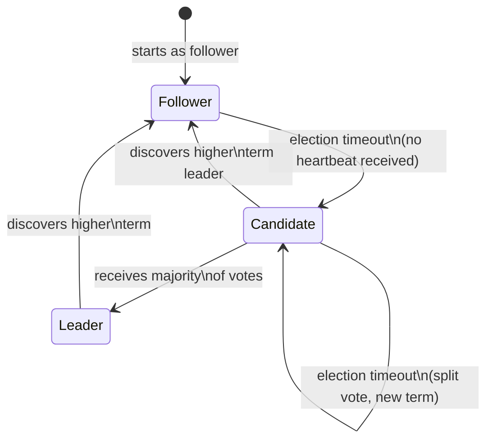
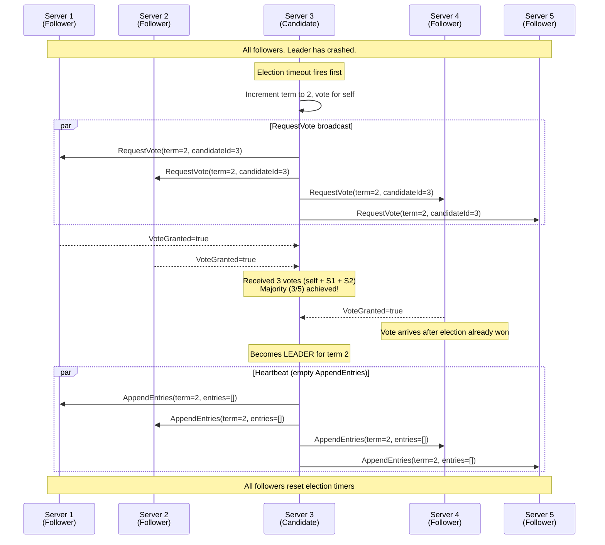
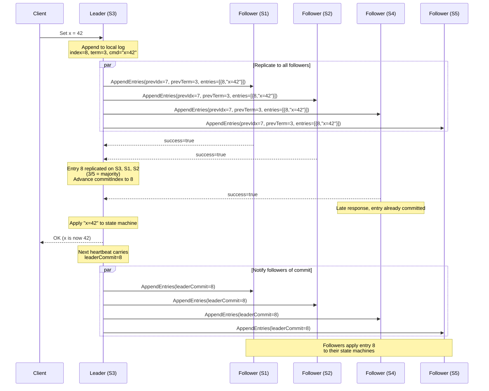
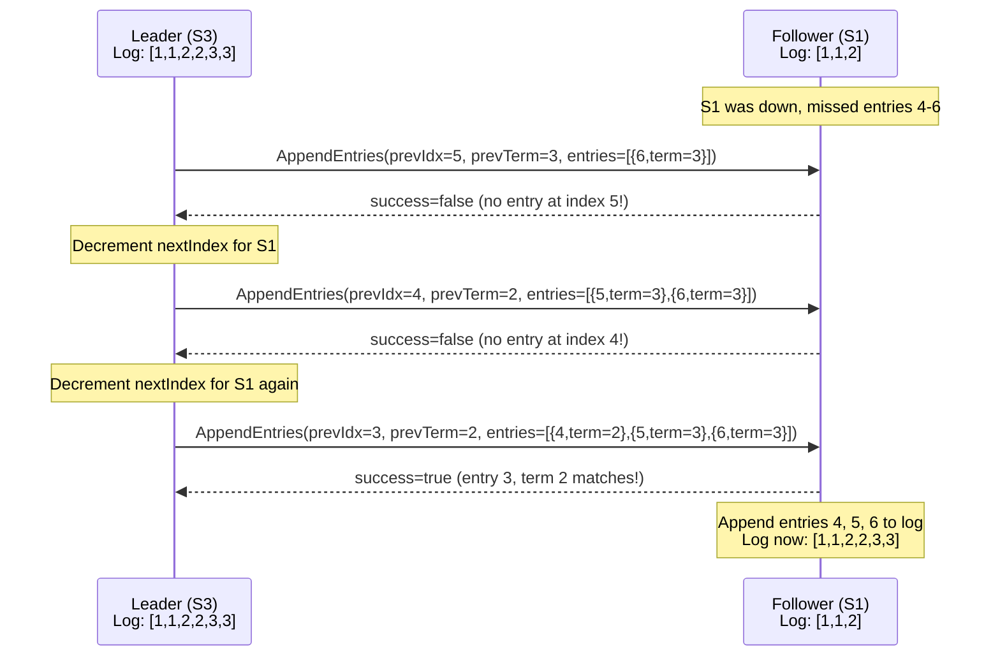
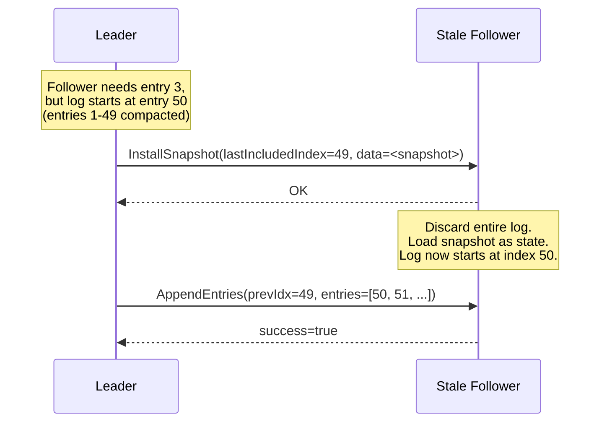

# Raft Consensus Algorithm

## Why This Exists

Distributed systems need multiple servers to agree on shared state. If you have 5 servers
storing "who is the current leader?" or "what is the latest committed transaction?", they
must reach **consensus** -- a single agreed-upon answer -- even when some servers crash,
networks partition, or messages arrive out of order.

Before Raft, the standard answer was Paxos. But Paxos is notoriously hard to understand
and even harder to implement correctly. Diego Ongaro and John Ousterhout designed Raft
in 2014 with one explicit goal: **understandability**. Their paper literally measured
comprehension by giving students exams on Raft vs Paxos -- Raft won decisively.

Today, Raft is THE consensus algorithm for interviews and for most real-world systems.

---

## The Core Problem

```
Given N servers (typically 3, 5, or 7):
- They must agree on a LINEAR SEQUENCE of commands
- The system works as long as a MAJORITY (N/2 + 1) are alive
- Crashed servers can rejoin and catch up
- No two servers ever disagree on committed entries
```

This is the **replicated state machine** model:

```
  Client           Consensus Module          State Machine
    |                    |                        |
    |--- Command ------->|                        |
    |                    |--- Replicate to ------->|
    |                    |    majority             |
    |                    |--- Apply committed ---->|
    |<--- Response ------|    entry                |
    |                    |                        |
```

Every server starts with the same initial state. If they apply the same commands in the
same order, they reach the same final state. Raft's job: ensure that ordered log is
identical on every server.

---

## The Three Sub-Problems

Raft decomposes consensus into three relatively independent pieces:

| Sub-Problem | What It Solves |
|---|---|
| **Leader Election** | Who is in charge right now? |
| **Log Replication** | How does the leader copy entries to followers? |
| **Safety** | What guarantees prevent inconsistency? |

---

## Sub-Problem 1: Leader Election

### Key Concepts

**Term**: A logical clock that divides time into periods. Each term has at most one leader.
Terms increase monotonically. If a server sees a higher term, it immediately updates its own
term and reverts to follower state.

```
  Term 1          Term 2          Term 3          Term 4
|-- Leader A --|-- Leader B --|-- (no leader) --|-- Leader C --|
                                 election         
                                 failed           
```

**Server States**: Every server is in exactly one of three states.



**Election Timeout**: Each follower has a randomized timer (e.g., 150-300ms). If it does
not hear from a leader before the timer fires, it assumes the leader is dead and starts
an election.

### The Election Process Step by Step

1. Follower's election timeout expires
2. Follower increments its **currentTerm** and transitions to **Candidate**
3. Candidate votes for itself
4. Candidate sends **RequestVote RPC** to all other servers
5. Each server votes for at most one candidate per term (first-come-first-served)
6. If candidate receives votes from a majority: becomes **Leader**
7. If candidate hears from a new leader with equal or higher term: reverts to **Follower**
8. If election timeout expires again (nobody won): increment term, start new election

### RequestVote RPC

```
RequestVote Arguments:
  term           - candidate's term
  candidateId    - candidate requesting vote
  lastLogIndex   - index of candidate's last log entry
  lastLogTerm    - term of candidate's last log entry

RequestVote Response:
  term           - currentTerm of voter (for candidate to update itself)
  voteGranted    - true if candidate received vote
```

A server grants a vote only if:
1. The candidate's term >= voter's current term
2. The voter has not already voted for someone else in this term
3. The candidate's log is at least as up-to-date as the voter's (safety restriction)

### Election Sequence: 5-Node Cluster



### Split Vote Handling

The randomized election timeout is critical. Without randomization, multiple servers could
time out simultaneously, each vote for themselves, and nobody gets a majority.

```
Scenario: 4-node cluster, S1 and S3 both timeout simultaneously

S1 votes for S1, S3 votes for S3
S2 votes for S1 (first to arrive), S4 votes for S3 (first to arrive)

Result: S1 has 2 votes, S3 has 2 votes -- neither has majority (3)!

Both candidates' election timers expire.
Because timers are RANDOM, one will fire first next round.
Say S1 fires first -- it gets votes from S2, S4 before S3 even starts.
S1 wins.
```

The randomized timeout range (150-300ms) makes split votes rare, and repeated split
votes exponentially unlikely.

### Pre-Vote Optimization

In production systems (like etcd), a **Pre-Vote** phase prevents disruption from
partitioned nodes. Before starting a real election, a candidate sends a PreVote to check
if it *could* win. If it cannot, it does not increment the term, avoiding unnecessary
term inflation that would disrupt the current leader.

---

## Sub-Problem 2: Log Replication

Once a leader is elected, it handles all client requests by appending entries to its log
and replicating them.

### The Log Structure

```
                    Log Index:  1    2    3    4    5    6    7    8
                    -----------------------------------------------
  Leader (S3):      Term:      |1  | 1  | 2  | 2  | 2  | 3  | 3  | 3  |
                    Command:   |x=1| y=2| x=3| y=4| z=5| x=6| y=7| z=8|
                    -----------------------------------------------
                                                         ^
                                                    commitIndex = 5
                                                    (majority replicated)

  Follower (S1):    Term:      |1  | 1  | 2  | 2  | 2  | 3  | 3  |
                    Command:   |x=1| y=2| x=3| y=4| z=5| x=6| y=7|
                    -----------------------------------------------
                    (one entry behind leader, but committed entries match)
```

Key properties:
- Each entry has an **index** (position) and **term** (when the leader created it)
- Two entries with the same index and term are guaranteed identical
- If an entry is committed, all preceding entries are also committed
- **commitIndex**: the highest index known to be replicated on a majority

### AppendEntries RPC

```
AppendEntries Arguments:
  term            - leader's term
  leaderId        - so followers can redirect clients
  prevLogIndex    - index of entry just before new ones
  prevLogTerm     - term of prevLogIndex entry
  entries[]       - log entries to store (empty for heartbeat)
  leaderCommit    - leader's commitIndex

AppendEntries Response:
  term            - currentTerm (for leader to update itself)
  success         - true if follower contained matching prevLogIndex/prevLogTerm
```

### Replication Sequence: Normal Operation



### Log Repair: When a Follower Falls Behind

A follower might miss entries (it was down, partitioned, or slow). The leader detects this
through the **consistency check**: prevLogIndex/prevLogTerm must match.



**Optimization**: Instead of decrementing one at a time, the follower can return the
conflicting term and the first index of that term, letting the leader skip back faster.
This is what etcd implements.

### What Happens with Conflicting Entries

If a follower has entries from a previous leader that the current leader does not have,
those entries are **unconditionally overwritten**. This is safe because uncommitted entries
have no durability guarantee.

```
Before repair:
  Leader log:    [1][1][2][3][3][3]
  Follower log:  [1][1][2][2][2]
                              ^^^
                              These entries were from a leader
                              that crashed before committing them

After repair:
  Leader log:    [1][1][2][3][3][3]
  Follower log:  [1][1][2][3][3][3]     <-- entries 4,5 overwritten
```

---

## Sub-Problem 3: Safety

Safety ensures that once a log entry is committed, no future leader can overwrite it.

### The Election Restriction

A candidate can only win an election if its log is **at least as up-to-date** as a
majority of servers. "Up-to-date" means:
1. Higher last log term wins
2. If terms are equal, longer log wins

This ensures the new leader has every committed entry:

```
Scenario: 5 servers. Entries through index 4 are committed.

  S1: [1][1][2][2]         <-- has all committed entries
  S2: [1][1][2][2][3]      <-- has extra uncommitted entry
  S3: [1][1][2]            <-- missing committed entry 4
  S4: [1][1][2][2]         <-- has all committed entries
  S5: [1][1][2][2]         <-- has all committed entries

Who can become leader?
  S2: YES -- longest log, highest last term (3)
  S1: YES -- has all committed entries, can get votes from S3, S4, S5
  S4: YES -- same as S1
  S5: YES -- same as S1
  S3: NO  -- its last log term is 2 at index 3, behind S1/S4/S5 who have
             term 2 at index 4. S3 cannot get a majority.

Key insight: S3 is missing committed entry 4. The election restriction
PREVENTS S3 from becoming leader, which would lose that entry.
```

### The Commit Rule

A leader cannot commit entries from previous terms by counting replicas alone. It must
commit an entry from its **own current term** first, which implicitly commits all
preceding entries.

This prevents the following dangerous scenario:

```
Time 1 (Term 2): Leader S1 replicates entry [index=3, term=2] to S1, S2 (2 of 5)
Time 2: S1 crashes
Time 3 (Term 3): S5 becomes leader (gets votes from S3, S4, S5)
         S5 writes entry [index=3, term=3]
Time 4: S5 crashes
Time 5 (Term 4): S1 becomes leader again
         S1 sees entry [index=3, term=2] on S1, S2
         
WRONG: S1 cannot commit entry [index=3, term=2] just because it is on a majority!
         S5 already overwrote it with term=3 on S5 (and maybe others)

RIGHT:  S1 must first commit a NEW entry [index=4, term=4] on a majority.
         Once index=4/term=4 is committed, index=3/term=2 is implicitly committed
         because any future leader must have index=4 and therefore also index=3.
```

### The Log Matching Property

If two logs contain an entry with the same index and term, then:
1. They store the same command
2. All preceding entries are also identical

This is maintained by the consistency check in AppendEntries. A leader only creates one
entry per index in a given term, and the consistency check ensures followers build
identical prefixes.

---

## Membership Changes

Clusters sometimes need to add or remove servers. Doing this naively can cause **two
disjoint majorities** -- a split brain.

### The Problem

```
Changing from {S1, S2, S3} to {S1, S2, S3, S4, S5}

If S1, S2 use old config (majority = 2 of 3) and S3, S4, S5 use new config
(majority = 3 of 5), then:

  S1 + S2 = majority under OLD config -> elect leader A
  S3 + S4 + S5 = majority under NEW config -> elect leader B

  TWO LEADERS! Split brain!
```

### Solution 1: Joint Consensus (Original Raft Paper)

A two-phase approach:
1. Leader creates a **C_old,new** configuration entry requiring majorities of BOTH old and new
2. Once C_old,new is committed, leader creates **C_new** configuration entry
3. Once C_new is committed, old servers not in new config can be shut down

During the joint phase, agreement requires a majority of the old config AND a majority
of the new config.

### Solution 2: Single-Server Changes (Simpler, Used in Practice)

Add or remove one server at a time. When changing by a single server, old and new
majorities are guaranteed to overlap by at least one server, preventing split brain.

```
3-node cluster -> 4-node cluster:
  Old majority: 2 of {A, B, C}
  New majority: 3 of {A, B, C, D}
  Any 2-of-3 and any 3-of-4 MUST share at least 1 server.

To go from 3 to 5 nodes, do two single-server additions.
```

This is what etcd, Consul, and most production systems use.

---

## Log Compaction: Snapshots

The log cannot grow forever. Raft uses **snapshots** to compact it.

### How Snapshots Work

```
BEFORE snapshot:
  Log: [1][1][2][2][3][3][3][3][3][3][3]
                                        ^
                                   commitIndex = 11

  State machine has applied all entries through index 11.

AFTER snapshot at index 8:
  Snapshot: { lastIncludedIndex: 8, lastIncludedTerm: 3, state: <full state machine state> }
  Log: [3][3][3]    (only entries 9, 10, 11 remain)
```

Each server takes snapshots independently when its log exceeds a threshold.

### InstallSnapshot RPC

If a leader needs to bring a very stale follower up to date, it sends its snapshot:



### Snapshot Size Considerations

| Approach | Pros | Cons |
|---|---|---|
| Full snapshot | Simple, self-contained | Large, slow to create |
| Incremental snapshot | Smaller, faster | Complex to manage |
| Copy-on-write (fork) | Non-blocking | Uses extra memory |

Most implementations (etcd, CockroachDB) use full snapshots with a copy-on-write fork.

---

## Full Walkthrough: Leader Crash and Recovery

Let's trace through a complete scenario with a 5-node cluster.

### Initial State

```
All 5 servers running. S1 is leader for term 3.
Committed log (all servers): [1][1][2][2][3]  (5 entries)

  S1 (Leader, term=3):   commitIndex=5, nextIndex={S2:6, S3:6, S4:6, S5:6}
  S2 (Follower, term=3): commitIndex=5
  S3 (Follower, term=3): commitIndex=5
  S4 (Follower, term=3): commitIndex=5
  S5 (Follower, term=3): commitIndex=5
```

### Step 1: Client Sends Command to Leader

```
Client -> S1: "SET balance=100"
S1 appends to log: index=6, term=3, cmd="SET balance=100"

S1's log: [1][1][2][2][3][3]
                            ^-- new, uncommitted
```

### Step 2: Leader Replicates

```
S1 sends AppendEntries(prevIdx=5, prevTerm=3, entries=[{6, term=3, "SET balance=100"}])
  -> S2: receives, appends entry 6.  Replies success=true.
  -> S3: receives, appends entry 6.  Replies success=true.
  -> S4: NETWORK DELAY -- no reply yet.
  -> S5: receives, appends entry 6.  Replies success=true.

S1 has entry 6 on S1, S2, S3, S5 = 4 of 5 = majority.
S1 advances commitIndex to 6. Applies "SET balance=100" to state machine.
S1 replies to client: OK.
```

### Step 3: Leader Crashes

```
S1 CRASHES before sending next heartbeat.
S4 never got entry 6.

State:
  S1 (CRASHED): log=[1][1][2][2][3][3], commitIndex=6
  S2 (Follower): log=[1][1][2][2][3][3], commitIndex=5 (hasn't heard about commit 6 yet)
  S3 (Follower): log=[1][1][2][2][3][3], commitIndex=5
  S4 (Follower): log=[1][1][2][2][3],    commitIndex=5 (missing entry 6!)
  S5 (Follower): log=[1][1][2][2][3][3], commitIndex=5
```

### Step 4: Election Timeout, New Election

```
S3's election timer fires first (randomized).
S3 increments term to 4, becomes Candidate, votes for self.
S3 sends RequestVote(term=4, lastLogIndex=6, lastLogTerm=3) to all.

  S2: S3's log (index=6, term=3) >= S2's log (index=6, term=3). Grants vote.
  S4: S3's log (index=6, term=3) > S4's log (index=5, term=3). Grants vote.
  S5: S3's log (index=6, term=3) >= S5's log (index=6, term=3). Grants vote.

S3 has 4 votes (self + S2 + S4 + S5). Becomes LEADER for term 4.

Note: S4 could NOT have won this election because its log is shorter.
The election restriction guarantees the new leader has entry 6.
```

### Step 5: New Leader Starts Heartbeats

```
S3 (new leader, term 4) sends heartbeats:

To S2: AppendEntries(prevIdx=6, prevTerm=3, entries=[], leaderCommit=6)
  S2: prevLogIndex=6 matches. No new entries. Updates commitIndex to 6.
  S2 applies entry 6 to state machine.

To S4: AppendEntries(prevIdx=6, prevTerm=3, entries=[], leaderCommit=6)
  S4: Does not have entry at index 6! Replies success=false.

To S5: AppendEntries(prevIdx=6, prevTerm=3, entries=[], leaderCommit=6)
  S5: prevLogIndex=6 matches. Updates commitIndex to 6.
```

### Step 6: Log Repair for S4

```
S3 decrements nextIndex[S4] from 6 to 5.
S3 sends: AppendEntries(prevIdx=5, prevTerm=3, entries=[{6, term=3, "SET balance=100"}])

S4: prevLogIndex=5, prevLogTerm=3 matches! Appends entry 6. Replies success=true.
S4: leaderCommit=6, so applies entries through 6 to state machine.

All servers now have: log=[1][1][2][2][3][3], commitIndex=6.
Consistency restored!
```

### Step 7: S1 Recovers

```
S1 comes back online. Still thinks it's leader of term 3.
S1 sends AppendEntries(term=3, ...) to others.
S2 replies with term=4. S1 sees higher term.
S1 immediately steps down to Follower, updates term to 4.
S1 already has the correct log (it was the one that wrote entry 6).
Next heartbeat from S3 brings S1 up to date on commitIndex.

Cluster fully recovered. S3 is leader. All 5 servers consistent.
```

---

## Raft Timing and Configuration

### Critical Timing Constraints

```
broadcastTime << electionTimeout << MTBF

Where:
  broadcastTime  = time to send RPC and get response (~0.5-20ms)
  electionTimeout = time before starting election (~150-300ms)
  MTBF           = mean time between server failures (~months)
```

If electionTimeout is too short: unnecessary elections, wasted bandwidth.
If electionTimeout is too long: slow failure detection, longer downtime.

### Typical Production Settings

| Parameter | Typical Value | Notes |
|---|---|---|
| Election timeout | 1000-5000ms | Higher in WAN deployments |
| Heartbeat interval | 100-500ms | Must be << election timeout |
| Cluster size | 3 or 5 | 7 is rare; beyond 7 is almost never |
| Snapshot threshold | 10,000 entries | Tuned per workload |
| Max AppendEntries batch | 64 entries | Prevents large RPC payloads |

---

## Raft in Real-World Systems

### etcd (Kubernetes)

etcd is the most prominent Raft implementation. It stores all Kubernetes cluster state.

```
Kubernetes Architecture:
  API Server -----> etcd (Raft cluster, typically 3 or 5 nodes)
                    Stores: pod specs, service configs, secrets, RBAC

Key design decisions in etcd:
  - Uses Raft for linearizable reads and writes
  - Pre-Vote enabled by default to prevent disruption
  - Learner nodes (non-voting) for safe membership changes
  - WAL (write-ahead log) + snapshots on disk
  - gRPC for transport
```

### CockroachDB

Uses Raft at the **range level** -- each range (chunk of data, ~512MB) has its own Raft
group. A single CockroachDB cluster might run thousands of concurrent Raft groups.

```
CockroachDB Range Architecture:
  Table Data -> Split into Ranges (64MB-512MB each)
  Each Range -> 3 replicas across nodes
  Each Range -> Independent Raft group

  Range 1: [a-f]  -> Raft group on nodes {1, 3, 5}
  Range 2: [f-m]  -> Raft group on nodes {2, 4, 6}
  Range 3: [m-z]  -> Raft group on nodes {1, 2, 3}
```

### TiKV (TiDB Storage Engine)

Uses Multi-Raft -- similar to CockroachDB, with Raft per region.

### HashiCorp Consul

Uses Raft for its KV store and service catalog. Single Raft group per datacenter.

### Comparison of Real-World Raft Implementations

| System | Raft Scope | Cluster Size | Read Optimization | Language |
|---|---|---|---|---|
| etcd | Whole cluster | 3-7 | Serializable reads, read index | Go |
| CockroachDB | Per range | 3 (per range) | Leaseholder reads | Go |
| TiKV | Per region | 3 (per region) | Lease read | Rust |
| Consul | Per datacenter | 3-7 | Stale reads option | Go |
| RethinkDB | Per shard | 3 (per shard) | Outdated reads option | C++ |

---

## Read Optimization

Raft guarantees linearizability for writes. But reads from the leader alone are not
safe -- the leader might have been deposed without knowing it. Options:

### Option 1: Read Through Raft Log

Treat reads as log entries. Fully linearizable but slow (disk write + replication).

### Option 2: ReadIndex

Leader confirms it is still leader by getting heartbeat acknowledgments from a majority,
then serves the read at its current commitIndex. No log entry needed.

```
Client -> Leader: Read x
Leader -> Followers: Heartbeat (confirm I'm still leader)
Followers -> Leader: Yes, you are leader for term T
Leader: Serve read at commitIndex (guaranteed to reflect all committed writes)
```

### Option 3: Lease-Based Reads

Leader holds a time-based lease. If the lease has not expired, the leader can serve reads
without network round trips. Relies on bounded clock drift.

```
Risk: If clocks drift beyond the lease bound, stale reads are possible.
etcd uses ReadIndex by default, lease reads as an option.
CockroachDB uses leaseholder with epoch-based leases.
```

---

## Why Raft Was Designed: Understandability

From the Raft paper (Ongaro & Ousterhout, 2014):

> "We had two goals in designing Raft: it must provide a complete and practical
> foundation for system building... and it must be significantly easier to
> understand than Paxos."

Design choices driven by understandability:

| Design Choice | Why |
|---|---|
| Strong leader | All writes go through one server; simpler mental model |
| Leader election as separate phase | Clear decomposition of concerns |
| Randomized timeouts | Simpler than Paxos's priority/ranking schemes |
| No holes in the log | Entries committed in strict order (unlike Multi-Paxos) |
| Joint consensus (then single-server) | Handles membership without separate protocol |

The Raft paper includes a user study comparing students who learned Raft vs Paxos.
Raft students scored significantly higher on comprehension quizzes, with the difference
being statistically significant (p < 0.001).

---

## Raft's Limitations

| Limitation | Explanation |
|---|---|
| Leader bottleneck | All writes go through one server |
| WAN performance | Requires majority to be in same region for low latency |
| Cluster size | Practical limit around 5-7; beyond that, performance degrades |
| Read scalability | By default, reads also go through leader |
| Not Byzantine-tolerant | Assumes crash-stop failures only, not malicious nodes |

---

## Interview Cheat Sheet: Raft

### When to Mention Raft in Interviews

- "We need strong consistency for this metadata/configuration/leader election"
- "This data is critical and must survive server failures"
- "We need a replicated state machine"
- "We need distributed locks or leader election"

### 30-Second Explanation

> "Raft is a consensus algorithm that lets a cluster of servers agree on a
> sequence of commands even when some servers fail. It elects a leader that
> handles all writes and replicates them to followers. Writes are committed
> once a majority acknowledges them. If the leader fails, a new election
> picks a server with the most up-to-date log. The key insight is the
> election restriction: only candidates with all committed entries can win,
> so no committed data is ever lost. It's used by etcd, CockroachDB, and
> Consul."

### Key Numbers

| Metric | Value | Why It Matters |
|---|---|---|
| Minimum cluster | 3 nodes | Tolerates 1 failure |
| Recommended | 5 nodes | Tolerates 2 failures, allows rolling upgrades |
| Write latency | 1-10ms (LAN) | Dominated by disk fsync + network RTT |
| Failover time | 1-5 seconds | Election timeout + election + new leader |
| Max cluster size | ~7 | Beyond this, agreement cost dominates |

### Raft Summary Table

| Concept | Details |
|---|---|
| Goal | Replicated state machine via ordered log |
| Roles | Leader, Follower, Candidate |
| Quorum | Strict majority (N/2 + 1) |
| Election | Randomized timeout, RequestVote RPC, one vote per term |
| Replication | AppendEntries RPC, commit on majority ack |
| Safety | Election restriction (candidate log must be up-to-date) |
| Membership | Single-server changes (production) or joint consensus |
| Compaction | Snapshots to truncate log |
| Fault model | Crash-stop (NOT Byzantine) |
| Used by | etcd, CockroachDB, TiKV, Consul, RethinkDB |
