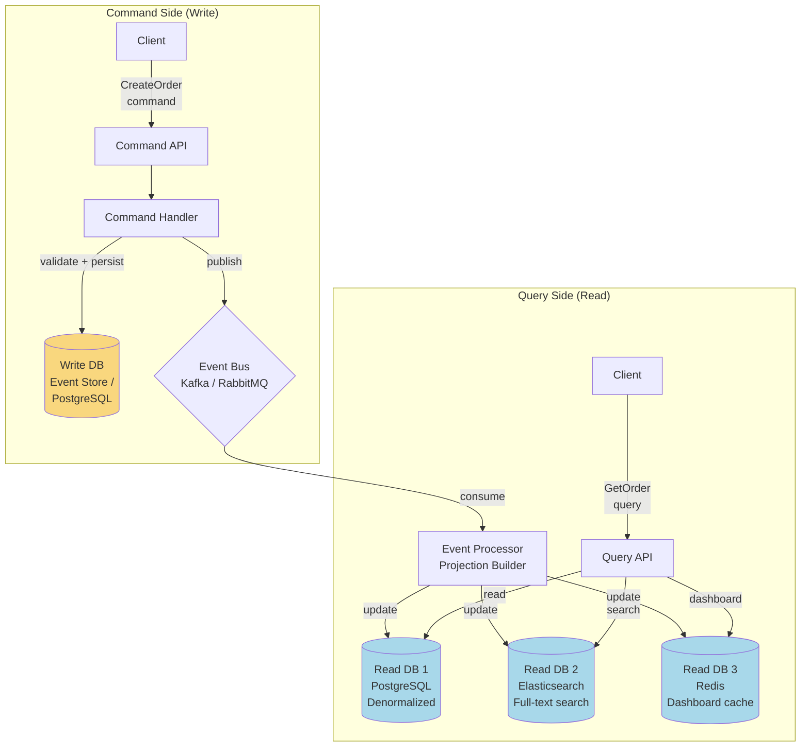
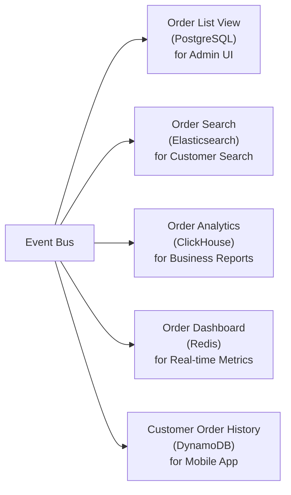
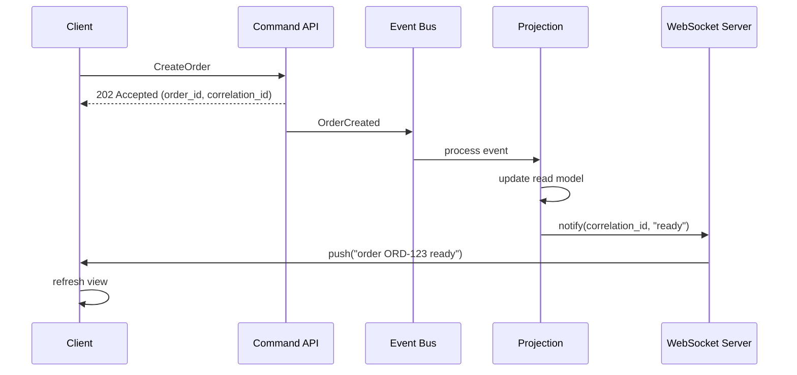
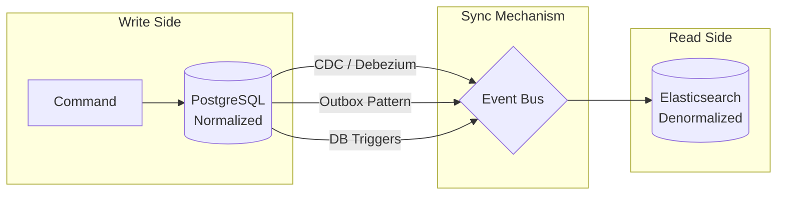
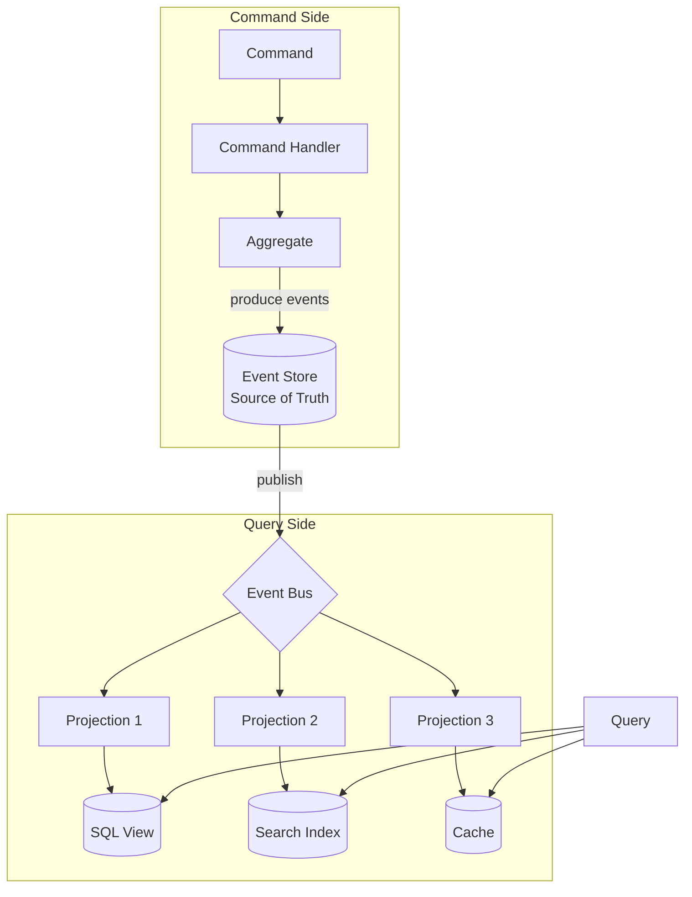

# CQRS -- Deep Implementation

> **Prerequisite:** `01-foundations/10-message-queues/event-driven-patterns.md` introduced
> CQRS conceptually. This document covers implementation: architecture, write/read model
> design, eventual consistency strategies, and when to use (or avoid) CQRS.

---

## 1. Core Principle: Separate Reads from Writes

CQRS (Command Query Responsibility Segregation) splits a system into two sides:

- **Command side (write model):** Accepts commands, validates business rules, persists
  state changes. Optimized for consistency and correctness.
- **Query side (read model):** Serves queries from denormalized, pre-computed views.
  Optimized for read performance and flexibility.

The two sides can use **different data models, different databases, and different
scaling strategies**.

```
Traditional single-model:
  Client --> [read/write] --> Single DB
  (same schema serves both reads and writes -- compromise on both)

CQRS separated:
  Client --> [command] --> Write Model --> Event Bus --> Read Model --> [query] --> Client
  (each side optimized for its job)
```

---

## 2. Architecture



The write DB and read DBs are **separate storage systems**. The event bus transfers
state changes from write to read side asynchronously.

---

## 3. Write Model -- Commands and Domain Logic

### 3.1 Command Design

Commands are **imperative** -- they represent an intent to change state. They may be
accepted or rejected based on business rules.

```python
from dataclasses import dataclass
from typing import List
from decimal import Decimal


# Commands are named as imperative verbs
@dataclass
class CreateOrder:
    order_id: str
    customer_id: str
    items: List[dict]
    total: Decimal

@dataclass
class CancelOrder:
    order_id: str
    reason: str

@dataclass
class AddItemToOrder:
    order_id: str
    item_id: str
    quantity: int
    unit_price: Decimal
```

**Command vs Event naming convention:**

| Command (imperative, intent)   | Event (past tense, fact)       |
|--------------------------------|--------------------------------|
| `CreateOrder`                  | `OrderCreated`                 |
| `CancelOrder`                  | `OrderCancelled`               |
| `ShipOrder`                    | `OrderShipped`                 |
| `AddItemToOrder`               | `ItemAddedToOrder`             |

Commands may be **rejected**. Events have already happened -- they cannot be rejected.

### 3.2 Command Handler

The command handler is the entry point for all writes. It loads the aggregate,
validates the command, and persists the resulting events.

```python
class CreateOrderHandler:
    def __init__(self, event_store, event_bus, customer_repo):
        self.event_store = event_store
        self.event_bus = event_bus
        self.customer_repo = customer_repo

    def handle(self, cmd: CreateOrder):
        # --- Validation ---
        customer = self.customer_repo.find(cmd.customer_id)
        if customer is None:
            raise CustomerNotFoundError(cmd.customer_id)
        if customer.is_suspended:
            raise CustomerSuspendedError(cmd.customer_id)
        if cmd.total <= 0:
            raise InvalidOrderError("Total must be positive")
        if len(cmd.items) == 0:
            raise InvalidOrderError("Order must have at least one item")

        # --- Aggregate logic ---
        order = OrderAggregate(cmd.order_id)
        order.create(
            customer_id=cmd.customer_id,
            items=cmd.items,
            total=cmd.total,
        )

        # --- Persist events ---
        events = order.get_uncommitted_events()
        self.event_store.append_events(
            aggregate_id=cmd.order_id,
            aggregate_type="Order",
            events=events,
            expected_version=0,  # new aggregate
        )

        # --- Publish for read side ---
        for event in events:
            self.event_bus.publish(event)

        return {"order_id": cmd.order_id, "version": order.version}
```

### 3.3 Write Model Database

The write-side database is optimized for **consistency** and **transactional integrity**.

```
Option A: Event Store (Event Sourcing + CQRS)
  - Append-only event log
  - Aggregate loaded by replaying events
  - See event-sourcing-deep.md for full schema

Option B: Traditional relational DB (CQRS without Event Sourcing)
  - Standard normalized schema
  - Rich domain model with validation
  - Publishes domain events after commit

Both approaches feed events to the read side.
```

---

## 4. Read Model -- Projections and Query Optimization

### 4.1 Denormalized for Speed

The read model is **denormalized** and **pre-computed**. It avoids JOINs, complex
aggregations, and anything that adds latency to reads.

```sql
-- Write model (normalized, third normal form):
-- orders(id, customer_id, status, created_at)
-- order_items(id, order_id, product_id, quantity, unit_price)
-- customers(id, name, email, tier)
-- products(id, name, category)

-- Read model (denormalized, single-table for the UI):
CREATE TABLE order_summary_view (
    order_id        UUID PRIMARY KEY,
    customer_name   VARCHAR(255),         -- denormalized from customers
    customer_email  VARCHAR(255),         -- denormalized from customers
    customer_tier   VARCHAR(50),          -- denormalized from customers
    item_count      INT,                  -- pre-computed
    total_amount    DECIMAL(10,2),
    status          VARCHAR(50),
    created_at      TIMESTAMPTZ,
    shipped_at      TIMESTAMPTZ,
    top_item_name   VARCHAR(255),         -- most expensive item, pre-computed
    -- no JOINs needed at query time
    updated_at      TIMESTAMPTZ DEFAULT NOW()
);

-- Read is a single-row fetch:
SELECT * FROM order_summary_view WHERE order_id = $1;
-- vs. the write model which would require 3+ JOINs
```

### 4.2 Multiple Read Models

Different clients have different query needs. CQRS allows **multiple read models**,
each optimized for a specific use case.



| Read Model        | Storage        | Optimized For                      |
|-------------------|----------------|------------------------------------|
| Admin order list  | PostgreSQL     | Filtered pagination, sorting       |
| Customer search   | Elasticsearch  | Full-text search, faceted filters  |
| Business reports  | ClickHouse     | Aggregations, time-series queries  |
| Real-time metrics | Redis          | Sub-millisecond dashboard reads    |
| Mobile API        | DynamoDB       | Single-partition key lookups       |

Each read model is an independent projection that consumes the same event stream.

### 4.3 Projection Event Handler

```python
class OrderSearchProjection:
    """Builds an Elasticsearch index from order events."""

    def __init__(self, es_client, checkpoint_store):
        self.es = es_client
        self.checkpoint_store = checkpoint_store

    def handle_event(self, event: dict):
        event_type = event["event_type"]

        if event_type == "OrderCreated":
            self.es.index("orders", id=event["aggregate_id"], body={
                "order_id": event["aggregate_id"],
                "customer_id": event["event_data"]["customer_id"],
                "items": event["event_data"]["items"],
                "total": event["event_data"]["total"],
                "status": "CREATED",
                "created_at": event["timestamp"],
            })

        elif event_type == "OrderShipped":
            self.es.update("orders", id=event["aggregate_id"], body={
                "doc": {
                    "status": "SHIPPED",
                    "tracking_number": event["event_data"]["tracking_number"],
                    "shipped_at": event["timestamp"],
                }
            })

        elif event_type == "OrderCancelled":
            self.es.update("orders", id=event["aggregate_id"], body={
                "doc": {"status": "CANCELLED"}
            })

        # Update checkpoint
        self.checkpoint_store.save("OrderSearchProjection", event["global_position"])
```

---

## 5. Handling Eventual Consistency

The read model lags behind the write model. After a successful write, the client may
query the read model and NOT see the change yet. There are four strategies to handle
this.

### 5.1 Optimistic UI

Show the expected result immediately in the UI without waiting for the read model.

```
User clicks "Place Order"
  -> Command accepted (write side returns 200 OK)
  -> UI immediately shows "Order ORD-123: Processing"
  -> Read model catches up in background
  -> Next page load shows the real state from the read model
```

```javascript
// Frontend: optimistic update
async function placeOrder(orderData) {
    const result = await api.post('/commands/create-order', orderData);

    // Immediately update local state (optimistic)
    localState.orders.push({
        orderId: result.order_id,
        status: 'PROCESSING',
        ...orderData,
    });

    // Later, when read model catches up, real state replaces optimistic state
}
```

**Best for:** Non-critical UIs where brief inconsistency is acceptable.

### 5.2 Polling

Client polls the read model until it reflects the expected change.

```python
# Backend: return a version token with the write response
@app.post("/commands/create-order")
def create_order(cmd):
    result = handler.handle(cmd)
    return {"order_id": result["order_id"], "version": result["version"]}

# Frontend: poll until read model catches up
async function waitForReadModel(orderId, expectedVersion) {
    for (let attempt = 0; attempt < 10; attempt++) {
        const order = await api.get(`/queries/orders/${orderId}`);
        if (order.version >= expectedVersion) {
            return order;  // read model has caught up
        }
        await sleep(200);  // wait 200ms between polls
    }
    throw new Error("Read model did not catch up in time");
}
```

**Best for:** Critical flows where the user must see the result (e.g., payment).

### 5.3 Subscription / Push Notification

The server pushes an update when the projection has processed the event.



**Best for:** Real-time dashboards, collaborative UIs.

### 5.4 Version-Based Consistency

The write response includes the event version. The client sends this version with
subsequent reads. The query API blocks until the read model has processed at least
that version.

```python
# Write side returns version
POST /commands/create-order -> { "order_id": "ORD-123", "version": 7 }

# Read side accepts minimum version
GET /queries/orders/ORD-123?min_version=7

# Query API implementation
@app.get("/queries/orders/{order_id}")
def get_order(order_id: str, min_version: int = 0):
    order = read_db.get(order_id)

    if order is None or order["version"] < min_version:
        # Wait for projection to catch up (with timeout)
        order = wait_for_version(order_id, min_version, timeout_ms=3000)

    if order is None:
        raise HTTPException(404)

    return order
```

**Best for:** APIs where strong read-after-write consistency is needed for specific flows.

### 5.5 Comparison

| Strategy         | Complexity | Latency          | User Experience        | When to Use              |
|------------------|------------|------------------|------------------------|--------------------------|
| Optimistic UI    | Low        | Zero (fake)      | Smooth but can be wrong| Non-critical actions     |
| Polling          | Low        | 200ms - 2s       | Brief spinner          | Important confirmations  |
| Push/Subscription| Medium     | Real-time        | Best UX                | Dashboards, collaboration|
| Version-based    | High       | Blocks until sync| Consistent             | APIs, critical reads     |

---

## 6. When to Use CQRS

### 6.1 Strong Signals for CQRS

```
1. Read/write ratio is heavily skewed
   Reads: 10,000 req/s    Writes: 100 req/s
   -> Scale read infrastructure independently

2. Read and write models have different shapes
   Write: normalized, relational, with complex validation
   Read: denormalized, document-oriented, pre-aggregated
   -> A single model is a bad compromise for both

3. Complex domain with rich business logic
   The write model enforces invariants, state machines, validation rules.
   Queries need flat, pre-joined data for the UI.
   -> Separate models reduce complexity on both sides

4. Multiple query patterns from different clients
   Admin UI needs paginated tables with filters
   Mobile app needs single-entity lookups
   Analytics needs time-series aggregations
   -> Multiple read models, each optimized for its consumer

5. Event-driven architecture / Event Sourcing already in use
   Events naturally flow from write to read side
   -> CQRS is the natural read strategy for event-sourced systems
```

### 6.2 When NOT to Use CQRS

```
1. Simple CRUD application
   Same data shape for reads and writes. One or two entities.
   CQRS adds unnecessary complexity.

2. Small team or early-stage project
   CQRS requires infrastructure (event bus, multiple DBs, projections).
   Small teams should optimize for velocity, not architectural purity.

3. Strong consistency is a hard requirement everywhere
   If every read MUST reflect the latest write, eventual consistency
   is a liability, not a feature.

4. Low traffic, low scale
   If a single PostgreSQL instance handles both reads and writes
   with room to spare, CQRS overhead is not justified.

5. No domain complexity
   If the write model is just "save this JSON," there is no domain
   logic that benefits from separation.
```

---

## 7. CQRS Without Event Sourcing

CQRS does NOT require Event Sourcing. You can separate read and write models using
traditional databases and change notifications.



**How it works:**
1. Write side uses a standard relational DB with normalized schema
2. Changes are captured via CDC (Debezium), outbox pattern, or DB triggers
3. Changes are published to an event bus
4. Read side consumes changes and updates denormalized views

**This is simpler than full Event Sourcing because:**
- No event replay or event store
- No aggregate pattern required
- Standard ORM / CRUD on the write side
- Familiar tooling (PostgreSQL + Debezium + Elasticsearch)

**Trade-offs vs full ES+CQRS:**
- No temporal queries ("what was the state at time T?")
- No event replay for debugging
- No projection rebuild from scratch (need data migration scripts instead)
- Limited audit trail (only CDC captures raw changes)

---

## 8. CQRS + Event Sourcing: The Full Pattern

When combined, Event Sourcing provides the write model and CQRS provides the read
model. This is the most powerful -- and most complex -- architecture.



**The full lifecycle:**

```
1. Client sends command: CreateOrder(customer, items, total)
2. Command handler loads aggregate from Event Store (replay events)
3. Aggregate validates: customer exists? total positive? items in stock?
4. Aggregate produces event: OrderCreated(...)
5. Event Store appends event (optimistic concurrency check)
6. Event published to bus (Kafka)
7. Projection A (Order Summary) updates PostgreSQL read table
8. Projection B (Order Search) updates Elasticsearch index
9. Projection C (Dashboard Metrics) updates Redis counters
10. Client queries any read model for the data it needs
```

### 8.1 End-to-End Code Example

```python
# --- Full stack: command -> event store -> projection -> query ---

# 1. API Layer
@app.post("/commands/create-order")
def handle_create_order(request):
    cmd = CreateOrder(
        order_id=str(uuid4()),
        customer_id=request.customer_id,
        items=request.items,
        total=request.total,
    )
    result = create_order_handler.handle(cmd)
    return {"order_id": cmd.order_id, "version": result["version"]}


@app.get("/queries/orders/{order_id}")
def query_order(order_id: str):
    # Read from denormalized view -- no joins, single row fetch
    return read_db.get("order_summary_view", order_id)


@app.get("/queries/orders/search")
def search_orders(q: str):
    # Full-text search from Elasticsearch projection
    return es_client.search("orders", query={"match": {"items": q}})


# 2. Command Handler (see event-sourcing-deep.md for full implementation)
# 3. Event Store (see event-sourcing-deep.md for full implementation)

# 4. Kafka Consumer / Projection Runner
def run_projections():
    """Background worker that feeds events to all projections."""
    consumer = KafkaConsumer("domain-events", group_id="projections")
    projections = [
        OrderSummaryProjection(read_db),
        OrderSearchProjection(es_client),
        DashboardMetricsProjection(redis_client),
    ]

    for message in consumer:
        event = json.loads(message.value)
        for projection in projections:
            try:
                projection.handle_event(event)
            except Exception as e:
                # Dead letter queue for failed projection events
                dlq.send(event, error=str(e), projection=projection.__class__.__name__)
```

---

## 9. Scaling CQRS

### 9.1 Independent Scaling

```
Write Side:
  - Typically lower traffic (10-100x less than reads)
  - Scale vertically or with sharded event store
  - Consistency is the priority -> fewer, stronger nodes

Read Side:
  - High traffic, high throughput
  - Scale horizontally: add read replicas, cache layers
  - Each read model scales independently
  - Elasticsearch: add nodes to cluster
  - Redis: add replicas, use cluster mode
  - PostgreSQL read replicas: add streaming replicas

  Example:
    Write: 1 PostgreSQL primary (100 writes/sec)
    Read:  5 PostgreSQL replicas (50,000 reads/sec)
           3-node Elasticsearch cluster (10,000 searches/sec)
           Redis cluster (100,000 dashboard reads/sec)
```

### 9.2 Projection Partitioning

For high event volumes, partition projection processing across workers.

```python
# Kafka consumer group with multiple partitions
# Each worker handles a subset of aggregates

# Worker 1: partitions 0-3 (aggregate IDs hashing to these partitions)
# Worker 2: partitions 4-7
# Worker 3: partitions 8-11

# All workers build the SAME projection, but each handles different aggregates
# Kafka consumer group protocol handles partition assignment automatically
```

---

## 10. Common Mistakes

### 10.1 Querying the Write Model

```
WRONG: Frontend queries the event store or write DB directly.
  - Event stores are not designed for rich queries
  - Bypasses the read model optimization
  - Creates coupling between UI and domain model

RIGHT: Always query through the read model.
  - Projections are designed for the exact queries clients need
  - Write model changes do not break queries
```

### 10.2 One Giant Read Model

```
WRONG: A single denormalized table that serves ALL clients.
  - Becomes a schema nightmare
  - Different clients need different shapes
  - Updates become expensive (update 50 columns for each event)

RIGHT: Multiple focused read models, each for a specific use case.
  - Admin list view: flat table with filters
  - Customer search: Elasticsearch with full-text
  - Dashboard: Redis with counters
```

### 10.3 Synchronous Projection Updates

```
WRONG: Command handler waits for ALL projections to update before responding.
  - Defeats the purpose of CQRS
  - Write latency depends on slowest projection
  - Projections become a write bottleneck

RIGHT: Command handler persists events and returns immediately.
  - Projections update asynchronously
  - Eventual consistency is a feature, not a bug
  - Use the consistency strategies from Section 5 where needed
```

---

## 11. CQRS Decision Matrix

| Factor                    | Use CQRS        | Skip CQRS          |
|---------------------------|------------------|---------------------|
| Read/write ratio          | > 10:1           | ~ 1:1               |
| Data model complexity     | Different shapes | Same shape          |
| Query patterns            | Multiple, varied | Single, simple      |
| Scale requirements        | High, asymmetric | Low, symmetric      |
| Team experience           | Comfortable with eventual consistency | Needs strong consistency everywhere |
| Domain complexity         | Rich domain logic| Simple CRUD         |
| Event Sourcing in use     | Natural fit      | Not required        |
| Time-to-market pressure   | Can invest upfront| Need speed         |

---

## Key Takeaways

```
1. CQRS separates the write model (commands) from the read model (queries).
2. The write side is optimized for consistency; the read side for performance.
3. Multiple read models can serve different clients from the same event stream.
4. Eventual consistency is the fundamental trade-off -- use optimistic UI,
   polling, subscriptions, or version-based reads to handle the gap.
5. CQRS without Event Sourcing is simpler: just separate read/write DBs with CDC.
6. CQRS with Event Sourcing is the full pattern: most powerful, most complex.
7. Do NOT use CQRS for simple CRUD -- the overhead is not justified.
8. Scale independently: write side for consistency, read side for throughput.
```
