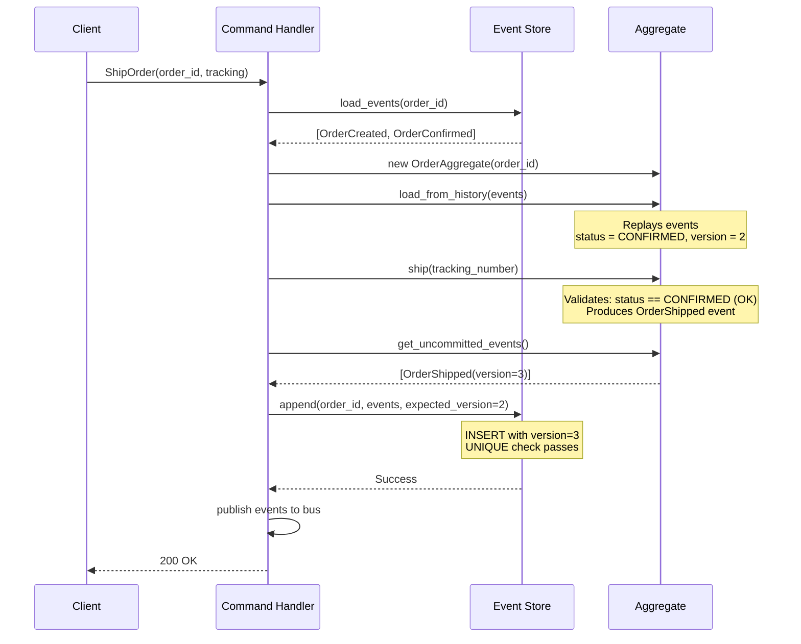
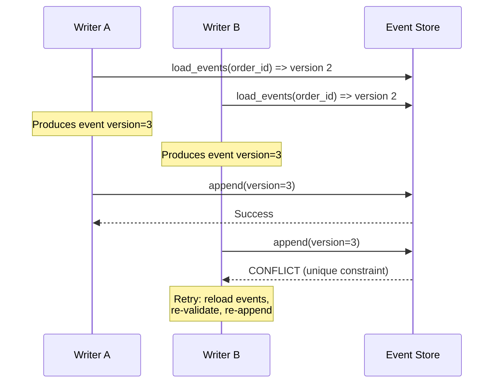
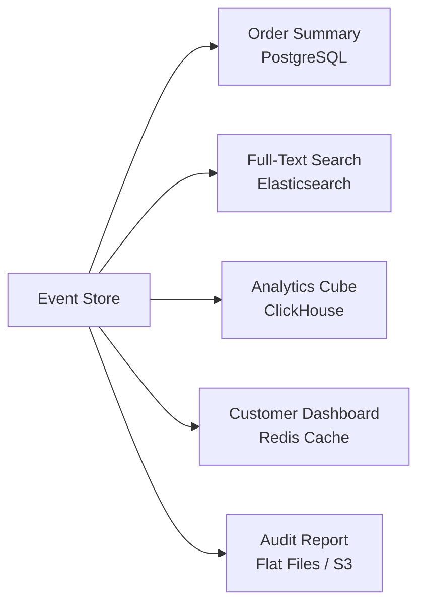
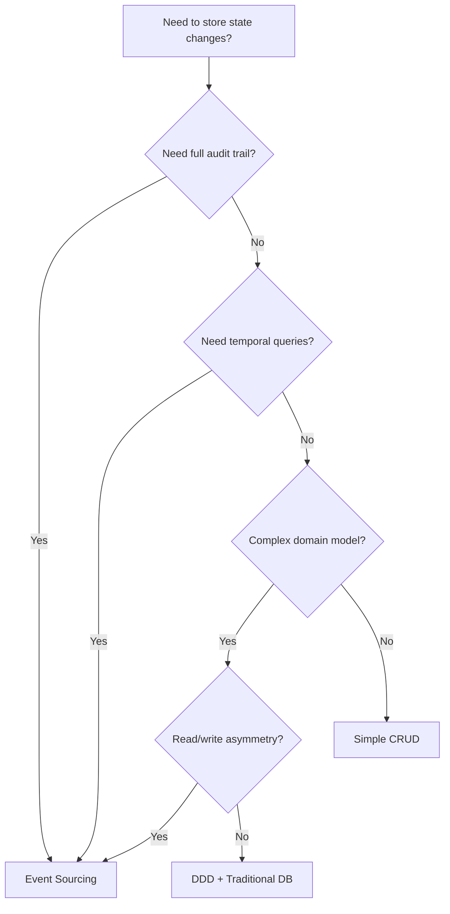

# Event Sourcing -- Deep Implementation

> **Prerequisite:** `01-foundations/10-message-queues/event-driven-patterns.md` covered the
> conceptual overview. This document goes deep into implementation: schemas, code,
> concurrency control, snapshots, projections, and schema evolution.

---

## 1. Core Principle: Store Events, Not State

Traditional systems store the **latest state** of an entity. Event sourcing stores the
**full sequence of state-changing events** and derives current state by replaying them.

```
Traditional (state-based):
+------------------------------+
| orders                       |
| id=ORD-1 | status=SHIPPED    |   <-- how did it get here? unknown
| total=95.00 | items=3        |
+------------------------------+

Event-sourced:
+---------------------------------------------+
| Event 1: OrderCreated   { total: 100.00 }   |
| Event 2: ItemRemoved    { item: X, -5.00 }  |
| Event 3: OrderConfirmed { }                  |
| Event 4: PaymentReceived { amount: 95.00 }   |
| Event 5: OrderShipped   { tracking: "ZX9" }  |
+---------------------------------------------+
Replay => status=SHIPPED, total=95.00, items=3

Every transition is recorded. You can answer:
  - "What was the order state before shipping?"
  - "When was the item removed, and by whom?"
  - "Replay with a bug fix to see what SHOULD have happened."
```

The event store is the **single source of truth**. All other representations (database
rows, search indices, caches) are derived projections.

---

## 2. Event Store Design

### 2.1 Schema

The event store table captures every domain event with full context.

```sql
CREATE TABLE event_store (
    -- Identity
    event_id        UUID        PRIMARY KEY DEFAULT gen_random_uuid(),
    aggregate_id    UUID        NOT NULL,
    aggregate_type  VARCHAR(255) NOT NULL,   -- 'Order', 'Account', 'Cart'

    -- Event payload
    event_type      VARCHAR(255) NOT NULL,   -- 'OrderCreated', 'ItemAdded'
    event_data      JSONB       NOT NULL,    -- the event body
    event_version   INT         NOT NULL DEFAULT 1,  -- schema version of this event type

    -- Ordering / concurrency
    version         INT         NOT NULL,    -- aggregate version (1, 2, 3...)
    global_position BIGSERIAL   NOT NULL,    -- global ordering across all aggregates

    -- Temporal
    timestamp       TIMESTAMPTZ NOT NULL DEFAULT NOW(),

    -- Traceability
    metadata        JSONB       DEFAULT '{}',  -- correlation_id, causation_id, user_id

    -- Concurrency guard: one version per aggregate instance
    UNIQUE (aggregate_id, version)
);

-- Fast lookups by aggregate
CREATE INDEX idx_event_store_aggregate
    ON event_store (aggregate_id, version ASC);

-- Global ordering for projections that consume everything
CREATE INDEX idx_event_store_global
    ON event_store (global_position ASC);

-- Filter by event type (useful for projections that handle one event type)
CREATE INDEX idx_event_store_type
    ON event_store (event_type, global_position ASC);
```

**Column explanations:**

| Column           | Purpose                                                    |
|------------------|------------------------------------------------------------|
| `event_id`       | Globally unique event identifier, used for idempotency     |
| `aggregate_id`   | Groups events belonging to the same entity instance        |
| `aggregate_type` | Distinguishes entity types sharing the same store          |
| `event_type`     | The domain event name, drives deserialization              |
| `event_data`     | The event payload as JSON                                  |
| `event_version`  | Schema version of this particular event type               |
| `version`        | Sequence number within the aggregate (1, 2, 3...)          |
| `global_position`| Monotonically increasing position across the entire store  |
| `timestamp`      | When the event was persisted                               |
| `metadata`       | Correlation ID, causation ID, user context, trace IDs      |

### 2.2 Append-Only, Immutable

The event store is **append-only**. No `UPDATE` or `DELETE` is ever performed on events.

```sql
-- Application-level rule: NEVER do this
UPDATE event_store SET event_data = '...' WHERE event_id = '...';  -- FORBIDDEN
DELETE FROM event_store WHERE aggregate_id = '...';                 -- FORBIDDEN

-- Only INSERTs are allowed
INSERT INTO event_store (aggregate_id, aggregate_type, event_type, event_data, version)
VALUES ($1, $2, $3, $4, $5);
```

For production enforcement, you can use a Postgres rule or trigger:

```sql
CREATE RULE prevent_update AS ON UPDATE TO event_store DO INSTEAD NOTHING;
CREATE RULE prevent_delete AS ON DELETE TO event_store DO INSTEAD NOTHING;
```

### 2.3 Optimistic Concurrency Control

Two concurrent commands targeting the same aggregate must not silently overwrite each
other. The `UNIQUE(aggregate_id, version)` constraint enforces this.

```sql
-- Writer 1 loads aggregate at version 5, produces event for version 6
INSERT INTO event_store (aggregate_id, aggregate_type, event_type, event_data, version)
VALUES ('agg-123', 'Order', 'ItemAdded', '{"item":"X"}', 6);
-- Succeeds: version 6 did not exist

-- Writer 2 also loaded at version 5, tries to write version 6
INSERT INTO event_store (aggregate_id, aggregate_type, event_type, event_data, version)
VALUES ('agg-123', 'Order', 'OrderShipped', '{}', 6);
-- FAILS: unique constraint violation on (aggregate_id, version)
-- Writer 2 must reload, re-validate, and retry
```

This is **optimistic locking** -- no row-level locks are held during command processing.
Conflicts are detected at write time and resolved by retrying.

### 2.4 EventStoreDB -- Dedicated Solution

[EventStoreDB](https://www.eventstore.com/) is a purpose-built database for event
sourcing. It replaces the SQL table above with a stream-native storage engine.

```
Key features:
- Streams: events grouped by stream ID (analogous to aggregate_id)
- Global log: all events across all streams in write order
- Subscriptions: push-based projection updates (catch-up, persistent)
- Optimistic concurrency: expected version on append
- Projections: built-in JavaScript projection engine
- Competing consumers: multiple workers on the same subscription

When to choose EventStoreDB over SQL:
- Dedicated event-sourced system (not retrofitting an existing DB)
- Need built-in subscriptions and projections
- High event volume (millions/day)
- Want first-class support for event sourcing primitives
```

---

## 3. Aggregate + Event Relationship

### 3.1 The Aggregate Pattern

An **aggregate** is a cluster of domain objects treated as a single unit for state
changes. In event sourcing, the aggregate:

1. **Loads** its history by replaying past events
2. **Validates** incoming commands against current state
3. **Produces** new events (but does not persist them itself)
4. **Applies** events to update its in-memory state

```python
from dataclasses import dataclass, field
from typing import List
from datetime import datetime
from uuid import uuid4
import json


@dataclass
class DomainEvent:
    """Base class for all domain events."""
    event_id: str = field(default_factory=lambda: str(uuid4()))
    aggregate_id: str = ""
    event_type: str = ""
    event_data: dict = field(default_factory=dict)
    version: int = 0
    timestamp: datetime = field(default_factory=datetime.utcnow)
    metadata: dict = field(default_factory=dict)


# --- Concrete events ---

class OrderCreated(DomainEvent):
    def __init__(self, aggregate_id: str, customer_id: str, items: list, total: float):
        super().__init__(
            aggregate_id=aggregate_id,
            event_type="OrderCreated",
            event_data={"customer_id": customer_id, "items": items, "total": total},
        )

class OrderConfirmed(DomainEvent):
    def __init__(self, aggregate_id: str):
        super().__init__(
            aggregate_id=aggregate_id,
            event_type="OrderConfirmed",
            event_data={},
        )

class OrderShipped(DomainEvent):
    def __init__(self, aggregate_id: str, tracking_number: str):
        super().__init__(
            aggregate_id=aggregate_id,
            event_type="OrderShipped",
            event_data={"tracking_number": tracking_number},
        )

class OrderCancelled(DomainEvent):
    def __init__(self, aggregate_id: str, reason: str):
        super().__init__(
            aggregate_id=aggregate_id,
            event_type="OrderCancelled",
            event_data={"reason": reason},
        )
```

### 3.2 Aggregate Root

```python
class AggregateRoot:
    """Base class for event-sourced aggregates."""

    def __init__(self, aggregate_id: str):
        self.aggregate_id = aggregate_id
        self.version = 0                   # current version after replay
        self._uncommitted_events: List[DomainEvent] = []

    def load_from_history(self, events: List[DomainEvent]):
        """Rebuild state by replaying persisted events."""
        for event in events:
            self._apply(event, is_new=False)
            self.version = event.version

    def _apply(self, event: DomainEvent, is_new: bool = True):
        """Route event to the correct handler and optionally track as uncommitted."""
        handler_name = f"_on_{self._to_snake_case(event.event_type)}"
        handler = getattr(self, handler_name, None)
        if handler is None:
            raise ValueError(f"No handler for {event.event_type}")
        handler(event)
        if is_new:
            self.version += 1
            event.version = self.version
            self._uncommitted_events.append(event)

    def get_uncommitted_events(self) -> List[DomainEvent]:
        return list(self._uncommitted_events)

    def clear_uncommitted_events(self):
        self._uncommitted_events.clear()

    @staticmethod
    def _to_snake_case(name: str) -> str:
        import re
        return re.sub(r'(?<!^)(?=[A-Z])', '_', name).lower()


class OrderAggregate(AggregateRoot):
    """Order aggregate -- full domain logic."""

    def __init__(self, aggregate_id: str):
        super().__init__(aggregate_id)
        self.customer_id = None
        self.items = []
        self.total = 0.0
        self.status = "DRAFT"
        self.tracking_number = None

    # --- Command methods (validate + produce events) ---

    def create(self, customer_id: str, items: list, total: float):
        if self.status != "DRAFT":
            raise ValueError("Order already created")
        if total <= 0:
            raise ValueError("Total must be positive")
        self._apply(OrderCreated(self.aggregate_id, customer_id, items, total))

    def confirm(self):
        if self.status != "CREATED":
            raise ValueError(f"Cannot confirm order in status {self.status}")
        self._apply(OrderConfirmed(self.aggregate_id))

    def ship(self, tracking_number: str):
        if self.status != "CONFIRMED":
            raise ValueError(f"Cannot ship order in status {self.status}")
        self._apply(OrderShipped(self.aggregate_id, tracking_number))

    def cancel(self, reason: str):
        if self.status in ("SHIPPED", "CANCELLED"):
            raise ValueError(f"Cannot cancel order in status {self.status}")
        self._apply(OrderCancelled(self.aggregate_id, reason))

    # --- Event handlers (mutate state) ---

    def _on_order_created(self, event: DomainEvent):
        self.customer_id = event.event_data["customer_id"]
        self.items = event.event_data["items"]
        self.total = event.event_data["total"]
        self.status = "CREATED"

    def _on_order_confirmed(self, event: DomainEvent):
        self.status = "CONFIRMED"

    def _on_order_shipped(self, event: DomainEvent):
        self.status = "SHIPPED"
        self.tracking_number = event.event_data["tracking_number"]

    def _on_order_cancelled(self, event: DomainEvent):
        self.status = "CANCELLED"
```

### 3.3 Command Processing Flow



**Concurrency conflict scenario:**



### 3.4 Event Store Implementation (Python)

```python
import psycopg2
from psycopg2.extras import RealDictCursor


class PostgresEventStore:
    """Event store backed by PostgreSQL with optimistic concurrency."""

    def __init__(self, connection_string: str):
        self.conn = psycopg2.connect(connection_string)

    def load_events(self, aggregate_id: str) -> List[DomainEvent]:
        """Load all events for an aggregate, ordered by version."""
        with self.conn.cursor(cursor_factory=RealDictCursor) as cur:
            cur.execute("""
                SELECT event_id, aggregate_id, aggregate_type, event_type,
                       event_data, event_version, version, timestamp, metadata
                FROM event_store
                WHERE aggregate_id = %s
                ORDER BY version ASC
            """, (aggregate_id,))
            rows = cur.fetchall()

        return [self._row_to_event(row) for row in rows]

    def append_events(
        self,
        aggregate_id: str,
        aggregate_type: str,
        events: List[DomainEvent],
        expected_version: int,
    ):
        """
        Append events with optimistic concurrency check.
        Raises ConcurrencyError if expected_version does not match.
        """
        try:
            with self.conn.cursor() as cur:
                for event in events:
                    cur.execute("""
                        INSERT INTO event_store
                            (event_id, aggregate_id, aggregate_type,
                             event_type, event_data, event_version,
                             version, timestamp, metadata)
                        VALUES (%s, %s, %s, %s, %s, %s, %s, %s, %s)
                    """, (
                        event.event_id,
                        aggregate_id,
                        aggregate_type,
                        event.event_type,
                        json.dumps(event.event_data),
                        event.version,          # event schema version
                        event.version,          # aggregate sequence version
                        event.timestamp,
                        json.dumps(event.metadata),
                    ))
            self.conn.commit()
        except psycopg2.errors.UniqueViolation:
            self.conn.rollback()
            raise ConcurrencyError(
                f"Aggregate {aggregate_id} was modified concurrently. "
                f"Expected version {expected_version}."
            )

    def load_all_events(self, after_position: int = 0, limit: int = 1000) -> list:
        """Load events globally for projections, starting after a position."""
        with self.conn.cursor(cursor_factory=RealDictCursor) as cur:
            cur.execute("""
                SELECT * FROM event_store
                WHERE global_position > %s
                ORDER BY global_position ASC
                LIMIT %s
            """, (after_position, limit))
            return cur.fetchall()

    @staticmethod
    def _row_to_event(row: dict) -> DomainEvent:
        event = DomainEvent()
        event.event_id = str(row["event_id"])
        event.aggregate_id = str(row["aggregate_id"])
        event.event_type = row["event_type"]
        event.event_data = row["event_data"]
        event.version = row["version"]
        event.timestamp = row["timestamp"]
        event.metadata = row.get("metadata", {})
        return event


class ConcurrencyError(Exception):
    pass
```

### 3.5 Command Handler

```python
class CommandHandler:
    """Orchestrates command processing."""

    def __init__(self, event_store: PostgresEventStore, event_bus):
        self.event_store = event_store
        self.event_bus = event_bus

    def handle_ship_order(self, order_id: str, tracking_number: str):
        # 1. Load aggregate from event history
        events = self.event_store.load_events(order_id)
        if not events:
            raise ValueError(f"Order {order_id} not found")

        order = OrderAggregate(order_id)
        order.load_from_history(events)

        # 2. Execute command (validates + produces events)
        order.ship(tracking_number)

        # 3. Persist new events with concurrency check
        new_events = order.get_uncommitted_events()
        self.event_store.append_events(
            aggregate_id=order_id,
            aggregate_type="Order",
            events=new_events,
            expected_version=order.version - len(new_events),
        )

        # 4. Publish events for projections and other services
        for event in new_events:
            self.event_bus.publish(event)

        order.clear_uncommitted_events()
```

---

## 4. Projections

### 4.1 What Are Projections?

Projections are **materialized read views** built by consuming events. The event store
is write-optimized (append-only log); projections are read-optimized (denormalized,
indexed, pre-computed).

```
Event Store (source of truth)          Projections (derived views)
+-------------------------------+
| OrderCreated(ORD-1, $100)     |----> Order Summary Table
| OrderConfirmed(ORD-1)         |      { id: ORD-1, status: SHIPPED, total: $100 }
| OrderShipped(ORD-1, "ZX9")   |
| OrderCreated(ORD-2, $50)     |----> Customer Order Count
| OrderCancelled(ORD-2, "oos") |      { customer-A: 1 active, 1 cancelled }
+-------------------------------+
                                 ----> Daily Revenue Report
                                       { 2025-01-15: $100, cancelled: $50 }

Same events, three completely different read-optimized views.
```

### 4.2 Projection Types

**Live / Catch-Up Projections:**
- Start from global position 0 (or a checkpoint) and consume events sequentially
- Run in the same process as the application or as a background worker
- Can rebuild from scratch at any time by resetting the checkpoint to 0

**Async / Eventually Consistent Projections:**
- Subscribe to events via a message bus (Kafka, RabbitMQ)
- Lag behind the write model by milliseconds to seconds
- Most common in production systems

```python
class OrderSummaryProjection:
    """Builds a denormalized order summary for fast reads."""

    def __init__(self, read_db):
        self.read_db = read_db
        self.checkpoint = 0  # last processed global_position

    def process_event(self, event: dict):
        handler = getattr(self, f"_handle_{event['event_type'].lower()}", None)
        if handler:
            handler(event)
        self.checkpoint = event["global_position"]
        self._save_checkpoint()

    def _handle_ordercreated(self, event):
        data = event["event_data"]
        self.read_db.upsert("order_summary", {
            "order_id": event["aggregate_id"],
            "customer_id": data["customer_id"],
            "total": data["total"],
            "item_count": len(data["items"]),
            "status": "CREATED",
            "created_at": event["timestamp"],
        })

    def _handle_orderconfirmed(self, event):
        self.read_db.update("order_summary",
            {"order_id": event["aggregate_id"]},
            {"status": "CONFIRMED"})

    def _handle_ordershipped(self, event):
        self.read_db.update("order_summary",
            {"order_id": event["aggregate_id"]},
            {"status": "SHIPPED",
             "tracking": event["event_data"]["tracking_number"]})

    def _handle_ordercancelled(self, event):
        self.read_db.update("order_summary",
            {"order_id": event["aggregate_id"]},
            {"status": "CANCELLED"})

    def _save_checkpoint(self):
        self.read_db.upsert("projection_checkpoints", {
            "projection_name": "OrderSummaryProjection",
            "last_position": self.checkpoint,
        })
```

### 4.3 Rebuilding Projections -- The Superpower

The single greatest advantage of event sourcing: any projection can be destroyed and
rebuilt from scratch by replaying the entire event history.

```
Scenario: You need a new report -- "revenue by product category"

Step 1: Write a new projection handler (ProductCategoryRevenueProjection)
Step 2: Reset its checkpoint to 0
Step 3: Replay ALL events from the event store
Step 4: Projection is fully caught up with a new, complete view

No data migration. No backfill scripts. No "we lost that data."
Everything is in the events.
```

**Rebuild process:**

```python
def rebuild_projection(event_store: PostgresEventStore, projection):
    """Destroy and rebuild a projection from scratch."""
    projection.reset()  # drop table / truncate
    projection.checkpoint = 0

    while True:
        events = event_store.load_all_events(
            after_position=projection.checkpoint,
            limit=1000,
        )
        if not events:
            break
        for event in events:
            projection.process_event(event)

    print(f"Rebuilt projection, processed up to position {projection.checkpoint}")
```

### 4.4 Multiple Projections from Same Events



Each projection is independently scalable, uses the optimal storage for its query
pattern, and can be rebuilt without affecting others.

---

## 5. Snapshots

### 5.1 The Problem

Replaying millions of events to reconstruct an aggregate is slow. An order with
10,000 events (many item additions/removals in a catalog) would require reading and
applying all 10,000 events on every command.

### 5.2 The Solution: Periodic Snapshots

Store the aggregate's full state at a specific version. On load, read the snapshot
then replay only events after the snapshot version.

```
Without snapshots:
  Load aggregate = replay events 1..10,000  (slow: ~200ms)

With snapshot at version 9,990:
  Load aggregate = load snapshot(9990) + replay events 9991..10,000  (fast: ~5ms)
```

### 5.3 Snapshot Table

```sql
CREATE TABLE aggregate_snapshots (
    aggregate_id    UUID        NOT NULL,
    aggregate_type  VARCHAR(255) NOT NULL,
    version         INT         NOT NULL,        -- version at snapshot time
    state_data      JSONB       NOT NULL,        -- serialized aggregate state
    created_at      TIMESTAMPTZ NOT NULL DEFAULT NOW(),
    PRIMARY KEY (aggregate_id, version)
);

-- Keep only the latest snapshot per aggregate for fast lookup
CREATE INDEX idx_snapshots_latest
    ON aggregate_snapshots (aggregate_id, version DESC);
```

### 5.4 Loading with Snapshots

```python
class SnapshotAwareEventStore:
    """Event store that uses snapshots to optimize aggregate loading."""

    def __init__(self, event_store: PostgresEventStore, snapshot_repo):
        self.event_store = event_store
        self.snapshot_repo = snapshot_repo

    def load_aggregate(self, aggregate_id: str, aggregate_class) -> AggregateRoot:
        aggregate = aggregate_class(aggregate_id)

        # 1. Try to load latest snapshot
        snapshot = self.snapshot_repo.load_latest(aggregate_id)
        if snapshot:
            aggregate.restore_from_snapshot(snapshot["state_data"])
            aggregate.version = snapshot["version"]
            after_version = snapshot["version"]
        else:
            after_version = 0

        # 2. Replay only events AFTER the snapshot
        events = self.event_store.load_events_after(aggregate_id, after_version)
        aggregate.load_from_history(events)

        return aggregate

    def save_snapshot(self, aggregate: AggregateRoot, aggregate_type: str):
        """Take a snapshot of the current aggregate state."""
        self.snapshot_repo.save({
            "aggregate_id": aggregate.aggregate_id,
            "aggregate_type": aggregate_type,
            "version": aggregate.version,
            "state_data": aggregate.to_snapshot(),
        })
```

### 5.5 Snapshot Frequency Strategy

| Strategy               | Trigger                             | Trade-off                    |
|------------------------|-------------------------------------|------------------------------|
| Every N events         | After every 100 or 1,000 events     | Simple, predictable          |
| Time-based             | Every hour or daily                 | Good for low-frequency aggs  |
| On-demand              | When event count since last snapshot exceeds threshold | Balanced           |
| Never                  | Aggregates have few events (< 50)   | Simplest, no overhead        |

```python
# Snapshot every 100 events
SNAPSHOT_FREQUENCY = 100

def should_snapshot(aggregate: AggregateRoot, last_snapshot_version: int) -> bool:
    events_since_snapshot = aggregate.version - last_snapshot_version
    return events_since_snapshot >= SNAPSHOT_FREQUENCY
```

**Important:** Snapshots are an **optimization**, not a requirement. The event store
remains the source of truth. Snapshots can be deleted and rebuilt at any time.

---

## 6. Event Schema Evolution

Events are immutable, but your domain evolves. Over months and years, event schemas
will change. This is one of the hardest problems in event sourcing.

### 6.1 Upcasting -- Transform Old Events on Read

Upcasting converts old event formats to the current format at read time. The stored
events are never modified.

```python
class EventUpcaster:
    """Transforms old event versions to the current schema on read."""

    def upcast(self, event: DomainEvent) -> DomainEvent:
        # OrderCreated v1 -> v2: added "currency" field
        if event.event_type == "OrderCreated" and event.version == 1:
            event.event_data["currency"] = "USD"  # default
            event.version = 2

        # OrderCreated v2 -> v3: "total" became a Money object
        if event.event_type == "OrderCreated" and event.version == 2:
            event.event_data["total"] = {
                "amount": event.event_data["total"],
                "currency": event.event_data.pop("currency"),
            }
            event.version = 3

        return event
```

```
Stored event (v1):  { "total": 100 }
After upcast (v3):  { "total": { "amount": 100, "currency": "USD" } }

The event store still contains the v1 event. Upcasting happens in memory on read.
```

### 6.2 Versioned Event Types

Include the version in the event type name itself. Handle each version explicitly.

```python
# Version is part of the event type
class OrderCreatedV1(DomainEvent):
    event_type = "OrderCreated_v1"

class OrderCreatedV2(DomainEvent):
    event_type = "OrderCreated_v2"

# Aggregate handles both versions
class OrderAggregate(AggregateRoot):
    def _on_order_created_v1(self, event):
        self.total = event.event_data["total"]
        self.currency = "USD"  # default for v1

    def _on_order_created_v2(self, event):
        self.total = event.event_data["total"]["amount"]
        self.currency = event.event_data["total"]["currency"]
```

### 6.3 Lazy vs Eager Migration

| Approach        | How                                    | Pros                       | Cons                        |
|-----------------|----------------------------------------|----------------------------|-----------------------------|
| **Lazy (upcasting)** | Transform on read, never change store | Zero downtime, simple deploy | Read-time overhead, upcaster chain grows |
| **Eager (copy-transform)** | Rewrite entire event store to new schema | Clean store, fast reads | Expensive, risky, downtime possible |
| **Hybrid**      | Upcast on read, batch-migrate in background | Best of both | More complex infrastructure |

**Recommendation:** Start with lazy upcasting. Only consider eager migration if the
upcaster chain becomes unmanageable (> 5 versions deep).

### 6.4 Compatibility Rules

Events are a contract between the write model and all projections/consumers. Follow
these rules to avoid breaking changes:

```
SAFE changes (backward compatible):
  + Add a new optional field with a default value
  + Add a new event type
  + Add new metadata fields

UNSAFE changes (require upcasting or versioning):
  - Remove a field
  - Rename a field
  - Change a field's type (string -> int)
  - Change the semantics of a field

NEVER DO:
  - Modify an existing event in the store
  - Delete events from the store (use compensating events instead)
  - Change the meaning of an event type
```

---

## 7. Event Replay for Debugging and Testing

### 7.1 Debugging Production Issues

```
Scenario: Customer reports order was incorrectly cancelled.

Steps:
1. Query event store for the aggregate:
   SELECT * FROM event_store WHERE aggregate_id = 'ORD-XYZ' ORDER BY version;

2. See the full history:
   v1: OrderCreated { customer: "Alice", total: 50 }
   v2: OrderConfirmed {}
   v3: OrderCancelled { reason: "payment_timeout" }

3. Cross-reference with metadata:
   v3 metadata: { "correlation_id": "pay-retry-789", "triggered_by": "PaymentService" }

4. Root cause: PaymentService timed out and sent a cancel, but payment actually succeeded.
   Fix: increase timeout, add idempotency check.
```

### 7.2 Testing with Event Replay

Replay production events in a test environment to reproduce bugs or validate fixes.

```python
def test_replay_production_bug():
    """Reproduce the cancellation bug using real production events."""
    events = load_events_from_file("fixtures/ord-xyz-events.json")

    order = OrderAggregate("ORD-XYZ")
    order.load_from_history(events)

    # After replay, verify the incorrect state
    assert order.status == "CANCELLED"

    # Now apply the fix (new validation rule) and replay
    order_fixed = OrderAggregateFixed("ORD-XYZ")
    order_fixed.load_from_history(events[:2])  # only CreatedConfirmed

    # The fixed version rejects the invalid cancel
    with pytest.raises(ValueError, match="payment pending"):
        order_fixed.cancel("payment_timeout")
```

---

## 8. Temporal Queries

Event sourcing enables **time travel** -- reconstructing the state of any aggregate at
any point in time.

```python
def get_state_at_time(event_store, aggregate_id: str, point_in_time: datetime):
    """Reconstruct aggregate state as it was at a specific timestamp."""
    events = event_store.load_events(aggregate_id)

    # Filter to only events that occurred before the target time
    events_before = [e for e in events if e.timestamp <= point_in_time]

    aggregate = OrderAggregate(aggregate_id)
    aggregate.load_from_history(events_before)
    return aggregate
```

```sql
-- SQL equivalent: what events existed for this order as of March 15?
SELECT * FROM event_store
WHERE aggregate_id = 'ORD-123'
  AND timestamp <= '2025-03-15T23:59:59Z'
ORDER BY version ASC;
```

**Use cases for temporal queries:**
- Regulatory compliance: "What was the account balance at end of Q3?"
- Dispute resolution: "What was the order state when the customer called support?"
- Auditing: "Who changed what, and when?"
- Debugging: "What was the state right before the bug triggered?"

---

## 9. Java Implementation (Spring Boot Style)

For teams working in Java, here is the equivalent aggregate and event store pattern.

```java
// --- Domain Events ---

public abstract class DomainEvent {
    private final String eventId = UUID.randomUUID().toString();
    private final String eventType;
    private final Instant timestamp = Instant.now();
    private int version;
    private Map<String, Object> metadata = new HashMap<>();

    protected DomainEvent(String eventType) {
        this.eventType = eventType;
    }
    // getters omitted for brevity
}

public class OrderCreated extends DomainEvent {
    private final String customerId;
    private final List<String> items;
    private final BigDecimal total;

    public OrderCreated(String customerId, List<String> items, BigDecimal total) {
        super("OrderCreated");
        this.customerId = customerId;
        this.items = items;
        this.total = total;
    }
}

public class OrderShipped extends DomainEvent {
    private final String trackingNumber;

    public OrderShipped(String trackingNumber) {
        super("OrderShipped");
        this.trackingNumber = trackingNumber;
    }
}


// --- Aggregate Root ---

public abstract class AggregateRoot {
    protected String aggregateId;
    protected int version = 0;
    private final List<DomainEvent> uncommittedEvents = new ArrayList<>();

    public void loadFromHistory(List<DomainEvent> events) {
        for (DomainEvent event : events) {
            applyEvent(event, false);
            this.version = event.getVersion();
        }
    }

    protected void apply(DomainEvent event) {
        applyEvent(event, true);
    }

    private void applyEvent(DomainEvent event, boolean isNew) {
        // Route to on(EventType) method via reflection or pattern matching
        routeEvent(event);
        if (isNew) {
            this.version++;
            event.setVersion(this.version);
            uncommittedEvents.add(event);
        }
    }

    protected abstract void routeEvent(DomainEvent event);

    public List<DomainEvent> getUncommittedEvents() {
        return Collections.unmodifiableList(uncommittedEvents);
    }

    public void clearUncommittedEvents() {
        uncommittedEvents.clear();
    }
}


// --- Order Aggregate ---

public class OrderAggregate extends AggregateRoot {
    private String customerId;
    private List<String> items;
    private BigDecimal total;
    private String status = "DRAFT";

    public OrderAggregate(String aggregateId) {
        this.aggregateId = aggregateId;
    }

    // Command: create order
    public void create(String customerId, List<String> items, BigDecimal total) {
        if (!"DRAFT".equals(status)) throw new IllegalStateException("Already created");
        if (total.compareTo(BigDecimal.ZERO) <= 0) throw new IllegalArgumentException("Positive total required");
        apply(new OrderCreated(customerId, items, total));
    }

    // Command: ship order
    public void ship(String trackingNumber) {
        if (!"CONFIRMED".equals(status)) throw new IllegalStateException("Must be confirmed to ship");
        apply(new OrderShipped(trackingNumber));
    }

    @Override
    protected void routeEvent(DomainEvent event) {
        if (event instanceof OrderCreated e) on(e);
        else if (event instanceof OrderShipped e) on(e);
        // ... other event types
    }

    private void on(OrderCreated event) {
        this.customerId = event.getCustomerId();
        this.items = event.getItems();
        this.total = event.getTotal();
        this.status = "CREATED";
    }

    private void on(OrderShipped event) {
        this.status = "SHIPPED";
    }
}
```

---

## 10. Summary: Event Sourcing Decision Framework

```
+-----------------------------------------------------------------------+
|  QUESTION                              | ANSWER -> USE EVENT SOURCING  |
+----------------------------------------+-------------------------------+
| Need complete audit trail?             | Yes -> strong signal          |
| Need temporal queries (state at T)?    | Yes -> strong signal          |
| Complex domain with many state         |                               |
|   transitions?                         | Yes -> good fit               |
| Multiple consumers need the same       |                               |
|   change notifications?                | Yes -> good fit               |
| Regulatory / compliance requirements?  | Yes -> strong signal          |
| Simple CRUD, few state transitions?    | No  -> use traditional DB     |
| Team has no ES experience?             | No  -> start with CQRS only   |
| Entity updated thousands of times/sec? | No  -> event volume too high  |
+----------------------------------------+-------------------------------+
```



---

## Key Takeaways

```
1. Events are the source of truth. State is derived, never stored directly.
2. The event store is append-only with optimistic concurrency (version check).
3. Aggregates validate commands and produce events. Events mutate aggregate state.
4. Projections are disposable, rebuildable read views -- the superpower of ES.
5. Snapshots are a performance optimization, not a correctness mechanism.
6. Schema evolution uses upcasting (lazy, on read) or versioned event types.
7. Temporal queries and event replay enable debugging, compliance, and testing.
8. Start simple: SQL-backed event store, add EventStoreDB if event volume demands it.
```
