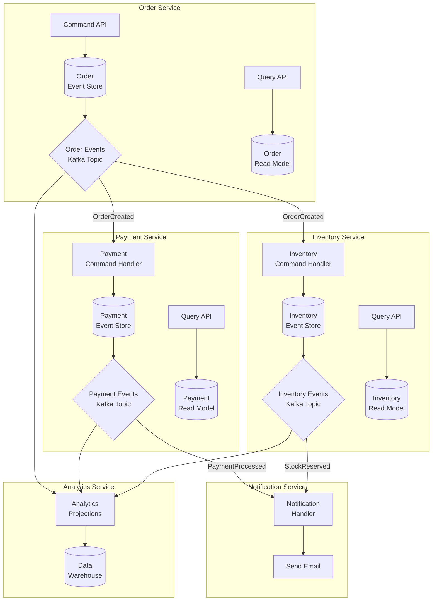
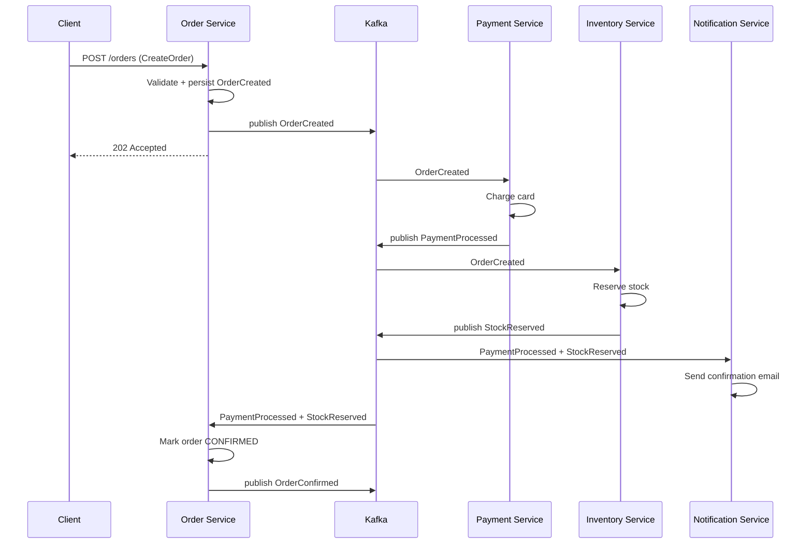
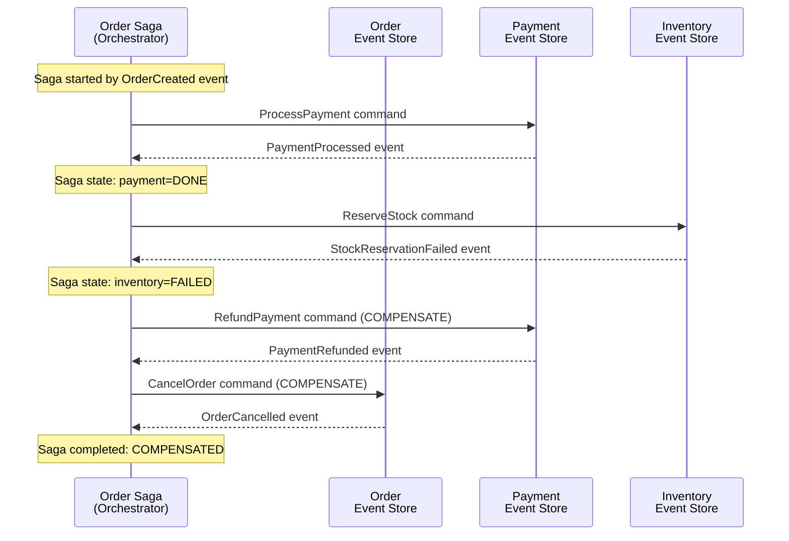

# Event Sourcing & CQRS -- Implementation Patterns

> **Prerequisites:** `event-sourcing-deep.md` and `cqrs-deep.md` in this directory.
> This document covers cross-cutting implementation patterns: microservices integration,
> testing, sagas, event storming, and real-world case studies.

---

## 1. Event-Driven Microservices with ES + CQRS

### 1.1 Architecture: Multi-Service Event Flows

In a microservices architecture, each service owns its data and communicates through
events. Event Sourcing provides the write model within each service, and CQRS provides
read models that can span services.



### 1.2 Event Flow: Order Placement



### 1.3 Cross-Service Projection

A single read model can combine events from multiple services.

```python
class OrderDashboardProjection:
    """
    Combines events from Order, Payment, and Inventory services
    into a single denormalized view for the admin dashboard.
    """

    def __init__(self, read_db):
        self.read_db = read_db

    def handle_event(self, event: dict):
        event_type = event["event_type"]
        order_id = event.get("aggregate_id") or event["event_data"].get("order_id")

        if event_type == "OrderCreated":
            self.read_db.upsert("dashboard_orders", {
                "order_id": order_id,
                "customer_id": event["event_data"]["customer_id"],
                "total": event["event_data"]["total"],
                "status": "CREATED",
                "payment_status": "PENDING",
                "inventory_status": "PENDING",
                "created_at": event["timestamp"],
            })

        elif event_type == "PaymentProcessed":
            self.read_db.update("dashboard_orders",
                {"order_id": order_id},
                {"payment_status": "PAID",
                 "payment_id": event["event_data"]["payment_id"]})

        elif event_type == "PaymentFailed":
            self.read_db.update("dashboard_orders",
                {"order_id": order_id},
                {"payment_status": "FAILED",
                 "status": "PAYMENT_FAILED"})

        elif event_type == "StockReserved":
            self.read_db.update("dashboard_orders",
                {"order_id": order_id},
                {"inventory_status": "RESERVED"})

        elif event_type == "OrderConfirmed":
            self.read_db.update("dashboard_orders",
                {"order_id": order_id},
                {"status": "CONFIRMED"})
```

---

## 2. Testing Event-Sourced Systems

### 2.1 Given / When / Then

The standard testing pattern for event-sourced aggregates:

- **Given:** A history of past events (the aggregate's current state)
- **When:** A command is executed
- **Then:** Expect specific new events (or an error)

```python
import pytest

class TestOrderAggregate:
    """Given/When/Then tests for the Order aggregate."""

    def test_create_order(self):
        """Given no prior events, when CreateOrder, then OrderCreated."""
        # Given
        order = OrderAggregate("ORD-1")

        # When
        order.create(customer_id="CUST-1", items=["item-A"], total=100.0)

        # Then
        events = order.get_uncommitted_events()
        assert len(events) == 1
        assert events[0].event_type == "OrderCreated"
        assert events[0].event_data["customer_id"] == "CUST-1"
        assert events[0].event_data["total"] == 100.0

    def test_confirm_order(self):
        """Given OrderCreated, when Confirm, then OrderConfirmed."""
        # Given
        order = OrderAggregate("ORD-1")
        order.load_from_history([
            make_event("OrderCreated", {"customer_id": "C1", "items": ["A"], "total": 50}),
        ])

        # When
        order.confirm()

        # Then
        events = order.get_uncommitted_events()
        assert len(events) == 1
        assert events[0].event_type == "OrderConfirmed"

    def test_cannot_ship_unconfirmed_order(self):
        """Given OrderCreated (not confirmed), when Ship, then error."""
        # Given
        order = OrderAggregate("ORD-1")
        order.load_from_history([
            make_event("OrderCreated", {"customer_id": "C1", "items": ["A"], "total": 50}),
        ])

        # When / Then
        with pytest.raises(ValueError, match="Cannot ship"):
            order.ship("TRACK-123")

    def test_cannot_cancel_shipped_order(self):
        """Given OrderCreated + Confirmed + Shipped, when Cancel, then error."""
        # Given
        order = OrderAggregate("ORD-1")
        order.load_from_history([
            make_event("OrderCreated", {"customer_id": "C1", "items": ["A"], "total": 50}),
            make_event("OrderConfirmed", {}),
            make_event("OrderShipped", {"tracking_number": "ZX9"}),
        ])

        # When / Then
        with pytest.raises(ValueError, match="Cannot cancel"):
            order.cancel("changed mind")

    def test_full_lifecycle(self):
        """Given creation through shipping, verify final state."""
        order = OrderAggregate("ORD-1")
        order.create("CUST-1", ["item-A", "item-B"], 150.0)
        order.confirm()
        order.ship("TRACK-456")

        assert order.status == "SHIPPED"
        assert order.tracking_number == "TRACK-456"
        assert len(order.get_uncommitted_events()) == 3


def make_event(event_type: str, data: dict, version: int = 0) -> DomainEvent:
    """Helper to create test events."""
    event = DomainEvent()
    event.event_type = event_type
    event.event_data = data
    event.version = version
    return event
```

### 2.2 Projection Testing

Test projections by feeding events and asserting read model state.

```python
class TestOrderSummaryProjection:
    def setup_method(self):
        self.read_db = InMemoryReadDB()
        self.projection = OrderSummaryProjection(self.read_db)

    def test_order_created_builds_summary(self):
        self.projection.process_event({
            "event_type": "OrderCreated",
            "aggregate_id": "ORD-1",
            "event_data": {"customer_id": "C1", "items": ["A", "B"], "total": 100},
            "timestamp": "2025-01-15T10:00:00Z",
            "global_position": 1,
        })

        summary = self.read_db.get("order_summary", "ORD-1")
        assert summary["status"] == "CREATED"
        assert summary["item_count"] == 2
        assert summary["total"] == 100

    def test_order_shipped_updates_status(self):
        # First create
        self.projection.process_event({
            "event_type": "OrderCreated",
            "aggregate_id": "ORD-1",
            "event_data": {"customer_id": "C1", "items": ["A"], "total": 50},
            "timestamp": "2025-01-15T10:00:00Z",
            "global_position": 1,
        })
        # Then ship
        self.projection.process_event({
            "event_type": "OrderShipped",
            "aggregate_id": "ORD-1",
            "event_data": {"tracking_number": "ZX9"},
            "timestamp": "2025-01-15T12:00:00Z",
            "global_position": 2,
        })

        summary = self.read_db.get("order_summary", "ORD-1")
        assert summary["status"] == "SHIPPED"
        assert summary["tracking"] == "ZX9"

    def test_projection_rebuilds_from_scratch(self):
        """Verify that replaying all events produces the same read model."""
        events = [
            {"event_type": "OrderCreated", "aggregate_id": "ORD-1",
             "event_data": {"customer_id": "C1", "items": ["A"], "total": 50},
             "timestamp": "2025-01-15T10:00:00Z", "global_position": 1},
            {"event_type": "OrderConfirmed", "aggregate_id": "ORD-1",
             "event_data": {},
             "timestamp": "2025-01-15T11:00:00Z", "global_position": 2},
        ]

        for event in events:
            self.projection.process_event(event)

        # Save state
        expected = self.read_db.get("order_summary", "ORD-1")

        # Rebuild from scratch
        self.read_db.clear()
        self.projection.checkpoint = 0
        for event in events:
            self.projection.process_event(event)

        rebuilt = self.read_db.get("order_summary", "ORD-1")
        assert rebuilt == expected  # identical after rebuild
```

### 2.3 Integration Test: Command to Query

```python
class TestEndToEnd:
    """Integration test: send command, verify query result."""

    def test_create_and_query_order(self, event_store, event_bus, read_db):
        # Send command
        handler = CreateOrderHandler(event_store, event_bus, customer_repo)
        result = handler.handle(CreateOrder(
            order_id="ORD-1",
            customer_id="CUST-1",
            items=[{"id": "PROD-1", "qty": 2}],
            total=Decimal("99.99"),
        ))

        # Run projection (in test, synchronously)
        projection = OrderSummaryProjection(read_db)
        events = event_store.load_all_events(after_position=0)
        for event in events:
            projection.process_event(event)

        # Query read model
        order = read_db.get("order_summary", "ORD-1")
        assert order["customer_id"] == "CUST-1"
        assert order["total"] == 99.99
        assert order["status"] == "CREATED"
```

---

## 3. Audit Trail -- For Free

Event sourcing provides a **complete, immutable audit trail** with zero additional
effort. Every state change is recorded as an event with timestamp, user context,
and causation chain.

```sql
-- "Who changed this order, when, and why?"
SELECT event_type, event_data, timestamp,
       metadata->>'user_id' AS changed_by,
       metadata->>'correlation_id' AS trace
FROM event_store
WHERE aggregate_id = 'ORD-123'
ORDER BY version ASC;

-- Result:
-- v1  OrderCreated    {"total":100}    user:alice    trace:req-001
-- v2  ItemRemoved     {"item":"X"}     user:alice    trace:req-002
-- v3  OrderConfirmed  {}               user:bob      trace:req-003
-- v4  OrderShipped    {"track":"ZX9"}  user:system   trace:batch-007
```

**Regulatory compliance:**
- Financial services: SOX, PCI-DSS require full transaction audit trails
- Healthcare: HIPAA requires access and modification logging
- GDPR: "right to be forgotten" requires special handling (see Pitfalls section)
- Any domain with disputes: full history resolves "he said, she said"

---

## 4. Event Storming

Event Storming is a **collaborative workshop technique** for discovering domain events,
commands, aggregates, and bounded contexts. Created by Alberto Brandolini.

### 4.1 The Process

```
Step 1 (Orange sticky notes): Domain Events
  Write every event you can think of. Past tense. No filtering.
  Examples: "OrderPlaced", "PaymentFailed", "InventoryReserved"

Step 2 (Blue sticky notes): Commands
  What triggers each event? Imperative. May come from users or systems.
  Examples: "PlaceOrder", "ProcessPayment", "ReserveInventory"

Step 3 (Yellow sticky notes): Aggregates
  Group related events and commands. Identify the entities that own them.
  Examples: "Order", "Payment", "Inventory"

Step 4 (Pink sticky notes): External Systems
  Identify integrations: payment gateways, email providers, third-party APIs.

Step 5 (Lilac sticky notes): Read Models / Views
  What do users need to see? Dashboards, reports, search.

Step 6: Draw boundaries
  Group aggregates into Bounded Contexts (potential microservice boundaries).
```

### 4.2 Visual Layout

```
+------------------------------------------------------------------------+
|                         EVENT STORMING BOARD                           |
|                                                                        |
|  [Command]        [Aggregate]      [Event]           [External]        |
|  (blue)           (yellow)         (orange)          (pink)            |
|                                                                        |
|  PlaceOrder  -->  Order       -->  OrderPlaced  -->  Payment Gateway   |
|  AddItem     -->  Order       -->  ItemAdded                           |
|  ProcessPay  -->  Payment     -->  PaymentProcessed                    |
|  ProcessPay  -->  Payment     -->  PaymentFailed  --> Email Service    |
|  ReserveStock--> Inventory    -->  StockReserved                       |
|  ShipOrder   -->  Shipment    -->  OrderShipped  -->  Logistics API    |
|                                                                        |
|  Bounded Context boundaries:                                           |
|  [--- Order Context ---]  [--- Payment Context ---]  [--- Fulfillment]|
+------------------------------------------------------------------------+
```

### 4.3 From Event Storming to Implementation

```
Event Storming output          Implementation
-----------------------        --------------------------------
Orange (Events)           -->  Domain event classes
Blue (Commands)           -->  Command classes + handlers
Yellow (Aggregates)       -->  Aggregate root classes
Pink (External Systems)   -->  Anti-corruption layers / adapters
Bounded Contexts          -->  Microservice boundaries
Event flow arrows         -->  Kafka topics / event bus routing
```

---

## 5. Saga + Event Sourcing

Sagas coordinate multi-step processes across event-sourced aggregates. Each saga step
is itself an event, providing a complete audit trail of the distributed transaction.

### 5.1 Orchestration Saga with Event Sourcing



### 5.2 Saga State as Events

The saga itself can be event-sourced, making it fully auditable and recoverable.

```python
class OrderSaga:
    """
    Orchestration saga for order processing.
    Its own state transitions are events.
    """

    def __init__(self, saga_id: str):
        self.saga_id = saga_id
        self.state = "STARTED"
        self.payment_status = None
        self.inventory_status = None

    def on_order_created(self, event):
        """Trigger: start the saga."""
        self.state = "AWAITING_PAYMENT"
        return [ProcessPaymentCommand(
            order_id=event.aggregate_id,
            amount=event.event_data["total"],
        )]

    def on_payment_processed(self, event):
        self.payment_status = "DONE"
        self.state = "AWAITING_INVENTORY"
        return [ReserveStockCommand(
            order_id=event.event_data["order_id"],
            items=event.event_data["items"],
        )]

    def on_payment_failed(self, event):
        self.payment_status = "FAILED"
        self.state = "COMPENSATING"
        return [CancelOrderCommand(
            order_id=event.event_data["order_id"],
            reason="Payment failed",
        )]

    def on_stock_reserved(self, event):
        self.inventory_status = "RESERVED"
        self.state = "COMPLETED"
        return [ConfirmOrderCommand(order_id=event.event_data["order_id"])]

    def on_stock_reservation_failed(self, event):
        self.inventory_status = "FAILED"
        self.state = "COMPENSATING"
        commands = []
        if self.payment_status == "DONE":
            commands.append(RefundPaymentCommand(
                order_id=event.event_data["order_id"],
            ))
        commands.append(CancelOrderCommand(
            order_id=event.event_data["order_id"],
            reason="Out of stock",
        ))
        return commands
```

### 5.3 Saga Recovery

Because the saga is event-sourced, it can recover from crashes by replaying its events.

```
Scenario: Saga process crashes after payment processed but before inventory check.

Recovery:
1. Load saga events from event store
2. Replay: OrderCreated -> started, PaymentProcessed -> awaiting_inventory
3. Saga resumes from "AWAITING_INVENTORY" state
4. Re-sends ReserveStockCommand (idempotent on receiver)
```

---

## 6. Real-World Case Studies

### 6.1 LMAX Exchange -- Event Sourcing for Financial Trading

```
System: High-frequency trading platform processing 6 million orders/second.

Architecture:
- Single-threaded event-sourced business logic processor
- All state changes are events written to a journal (event store)
- No database at all -- state is in-memory, rebuilt from journal on startup
- Replaying the journal IS the recovery mechanism

Key design decisions:
- Single thread eliminates concurrency complexity entirely
- Input events are journaled BEFORE processing (ensures no lost events)
- Output events are published AFTER processing
- Entire business day can be replayed in seconds (for testing and audit)

Lesson: Event sourcing is not just about databases. The journal IS the database.
Performance: sub-microsecond latency for order matching.
```

### 6.2 Walmart -- Event Sourcing for Inventory Management

```
Problem: Track inventory across 11,000+ stores with real-time visibility.

Solution:
- Each inventory change is an event: received, sold, transferred, damaged, counted
- Current inventory is a projection: SUM of all events for each SKU/location
- Temporal queries: "what was the inventory of SKU-123 at Store-456 on Friday?"
- Multiple projections: real-time availability, replenishment triggers, shrink reports

Benefits:
- Complete audit trail for shrink analysis (theft, damage, miscounting)
- Temporal queries for inventory reconciliation
- New reports are just new projections -- no data migration needed
- Event replay to investigate discrepancies
```

### 6.3 Uber -- Cadence / Temporal (Event Sourcing for Workflows)

```
System: Cadence (now Temporal) -- workflow orchestration engine.

How it uses event sourcing internally:
- Every workflow execution is an event-sourced entity
- Events: WorkflowStarted, TaskScheduled, TaskCompleted, TimerFired, etc.
- Workflow state is reconstructed by replaying the event history
- Enables "replay debugging": re-execute workflow logic against recorded events

Why event sourcing:
- Workflows can run for days/weeks -- must survive process restarts
- Event replay is the recovery mechanism after crash
- Full history for debugging: "why did this ride dispatch fail?"
- Deterministic replay: given same events, same result (for testing)

Scale: millions of concurrent workflows, billions of events/day.
```

### 6.4 Event Store Usage by Domain

| Domain              | Why Event Sourcing                              | Key Events                              |
|---------------------|------------------------------------------------|-----------------------------------------|
| Banking / Finance   | Regulatory audit trail, ledger reconciliation   | Deposit, Withdrawal, Transfer           |
| E-commerce          | Order lifecycle tracking, dispute resolution    | OrderPlaced, Shipped, Returned          |
| Healthcare          | Patient record integrity, HIPAA compliance      | DiagnosisRecorded, MedicationPrescribed |
| Gaming              | Player action history, anti-cheat analysis      | ItemPurchased, QuestCompleted           |
| Supply Chain        | Track goods through pipeline, audit shrink      | ShipmentReceived, QualityChecked        |
| Insurance           | Claim lifecycle, regulatory reporting           | ClaimFiled, ClaimAssessed, ClaimPaid    |

---

## 7. Common Pitfalls

### 7.1 Event Explosion

```
Problem: Aggregate has too many events (millions) making replay slow.

Causes:
- Using events for high-frequency metrics (page views, clicks)
- Overly fine-grained events (one event per field change)
- No aggregate boundaries (one giant aggregate for everything)

Solutions:
- Snapshots (see event-sourcing-deep.md Section 5)
- Redesign aggregate boundaries (smaller aggregates, fewer events each)
- Use traditional storage for high-frequency, low-value data
- Archive old events (keep last N years in hot store, rest in cold storage)
```

### 7.2 Large Aggregates

```
Problem: Aggregate tries to enforce too many invariants, grows unbounded.

Example (bad):
  CatalogAggregate
    - All 10 million products in one aggregate
    - Every product change is an event
    - Replay takes minutes

Solution: Follow DDD aggregate design rules:
  - Keep aggregates small (protect a single consistency boundary)
  - ProductAggregate (one per product, few events each)
  - Use eventual consistency between aggregates
```

### 7.3 Coupling Via Events

```
Problem: Downstream services depend on event schema details, creating tight coupling.

Symptoms:
- Changing an event field breaks three other services
- Services parse event data they should not need
- Event schema becomes a "god object" with fields for every consumer

Solutions:
- Published language: define a clear contract for public events
- Internal vs external events: rich internal events, slim public events
- Anti-corruption layer: each consumer transforms events to its own model
- Schema registry: enforce backward compatibility rules (Avro, Protobuf)
```

### 7.4 GDPR and Right to Erasure

```
Problem: Events are immutable, but GDPR requires deleting personal data.

Event sourcing says "never delete events."
GDPR says "you must delete personal data on request."

Solutions:
1. Crypto-shredding: Encrypt personal data in events with per-user key.
   To "delete" a user, delete the encryption key. Events remain but data
   is unreadable.

2. Separation: Store personal data outside the event store (separate table).
   Events reference a user_id but contain no PII. Delete from the separate
   table on request.

3. Tombstone events: Add a "DataErased" event. Projections treat it as
   a signal to blank out personal data in read models. Original events
   still exist but projections no longer expose the data.

Recommended: Crypto-shredding. It preserves event integrity while satisfying
the legal requirement.
```

---

## 8. Interview Questions with Answers

### Q1: "Explain Event Sourcing. Why would you use it over a traditional database?"

```
Answer:
Event Sourcing stores every state change as an immutable event rather than
overwriting the current state. The current state is derived by replaying events.

Use it when you need:
- Complete audit trail (finance, healthcare, compliance)
- Temporal queries ("what was the state at time T?")
- Ability to rebuild read models from scratch (add new reports without migration)
- Debugging via event replay

Avoid it when:
- Simple CRUD with no audit needs
- Team is unfamiliar (steep learning curve)
- Very high-frequency updates to the same entity (event volume)
```

### Q2: "How do you handle the performance problem of replaying millions of events?"

```
Answer:
Snapshots. Periodically save the aggregate's full state at a specific event version.
On load, read the snapshot and replay only events after the snapshot.

Without snapshot: replay events 1 to 1,000,000 (slow)
With snapshot at 999,990: load snapshot + replay 10 events (fast)

Snapshot frequency depends on event volume -- typically every 100 to 1,000 events.
Snapshots are an optimization, not the source of truth. They can be deleted and
rebuilt.
```

### Q3: "What is CQRS and how does it relate to Event Sourcing?"

```
Answer:
CQRS separates the write model (commands) from the read model (queries) into
different data stores, each optimized for its purpose.

Relation to Event Sourcing:
- Event Sourcing provides the write model (events are the source of truth)
- CQRS provides the read model (projections built from events)
- They are independent patterns but work extremely well together
- You CAN use CQRS without Event Sourcing (separate read/write DBs with CDC)
- You CAN use Event Sourcing without CQRS (less common, but possible)
```

### Q4: "How do you handle eventual consistency in CQRS?"

```
Answer:
Four strategies, chosen based on the use case:

1. Optimistic UI: Show expected result immediately, update later when read model
   catches up. Best for non-critical actions.

2. Polling: Client polls read model until it reflects the write. Best for
   important confirmations (payment result).

3. Push/WebSocket: Server notifies client when projection is updated. Best for
   real-time dashboards.

4. Version-based: Write returns a version number. Client passes it to queries.
   Query API blocks until read model reaches that version. Best for APIs that
   need strong read-after-write consistency.
```

### Q5: "How do you test an event-sourced system?"

```
Answer:
Given/When/Then pattern for aggregates:
- Given a history of past events (sets up aggregate state)
- When a command is executed
- Then expect specific new events OR a validation error

For projections:
- Feed a sequence of events, assert read model state
- Verify rebuild produces identical results

For integration:
- Send command through handler, run projection, query read model
- Compare results across the full stack
```

### Q6: "You have an event schema that needs to change. How do you handle it?"

```
Answer:
Events are immutable -- you cannot change existing events in the store.

Strategy 1 (preferred): Upcasting
- Transform old event formats to the current format on read
- Old events stay untouched in the store
- Upcaster chain: v1 -> v2 -> v3 applied sequentially
- Zero downtime

Strategy 2: Versioned event types
- OrderCreated_v1, OrderCreated_v2
- Aggregate handles both versions explicitly

Strategy 3 (last resort): Copy-transform
- Rewrite the entire event store to the new schema
- Expensive, risky, requires downtime

Rules: Adding optional fields is safe. Removing or renaming fields requires
upcasting. Never modify events in place.
```

### Q7: "Design an event-sourced banking system. What are the aggregates, events, and projections?"

```
Answer:

Aggregates:
- Account (owner, type, status)
- Transaction (not a simple record -- an aggregate tracking a transfer lifecycle)

Events:
- AccountOpened(owner, type, initial_deposit)
- MoneyDeposited(amount, source)
- MoneyWithdrawn(amount, destination)
- TransferInitiated(from, to, amount)
- TransferCompleted(transfer_id)
- TransferFailed(transfer_id, reason)
- AccountFrozen(reason)
- AccountClosed(reason)

Projections:
- Current Balance: SUM(deposits) - SUM(withdrawals) per account
- Transaction History: chronological list for statement generation
- Daily Ledger: aggregated totals for reconciliation
- Fraud Detection: pattern analysis across all transactions
- Regulatory Report: quarterly summaries for compliance

Why Event Sourcing is ideal for banking:
- Regulatory requirement for complete audit trail
- Temporal queries for dispute resolution
- Balance is derived, not stored -- eliminates double-spend bugs
- New compliance reports = new projections without data migration
```

### Q8: "What is Event Storming and how does it inform Event Sourcing design?"

```
Answer:
Event Storming is a collaborative workshop technique (by Alberto Brandolini)
where domain experts and engineers discover:

1. Domain Events (orange): what happens in the system -- "OrderPlaced"
2. Commands (blue): what triggers events -- "PlaceOrder"
3. Aggregates (yellow): what owns the events -- "Order"
4. External Systems (pink): integrations -- "Payment Gateway"
5. Read Models (lilac): what users need to see -- "Order Dashboard"

The output maps directly to implementation:
- Events -> event classes
- Commands -> command handlers
- Aggregates -> aggregate roots
- Boundaries between groups -> microservice boundaries

It bridges the gap between domain knowledge and technical design before writing
any code.
```

---

## 9. Implementation Checklist

```
Event Store:
  [ ] Append-only table with optimistic concurrency (version)
  [ ] Global position for projection catch-up
  [ ] Metadata: correlation_id, causation_id, user_id
  [ ] Immutability enforced (no UPDATE/DELETE)
  [ ] Indexes: aggregate_id+version, global_position, event_type

Aggregates:
  [ ] Load from event history (replay)
  [ ] Validate commands against current state
  [ ] Produce events (not persist -- command handler persists)
  [ ] Apply events to mutate internal state

Projections:
  [ ] Checkpoint tracking (resume after restart)
  [ ] Idempotent event handling (reprocessing is safe)
  [ ] Rebuild capability (reset checkpoint, replay all)
  [ ] Error handling with dead-letter queue

Schema Evolution:
  [ ] Upcaster chain for old event versions
  [ ] Backward compatibility rules documented
  [ ] Schema registry for cross-service events

Testing:
  [ ] Given/When/Then for every aggregate command
  [ ] Projection tests with event sequences
  [ ] Integration: command -> event store -> projection -> query
  [ ] Concurrency: test optimistic locking under contention

Operations:
  [ ] Snapshot strategy for aggregates with many events
  [ ] Monitoring: projection lag, event store growth, error rates
  [ ] GDPR: crypto-shredding or data separation strategy
```

---

## Key Takeaways

```
1. Event-sourced microservices communicate via domain events on Kafka topics.
   Each service owns its event store and projections.

2. Test with Given/When/Then: given past events, when command, then new events.
   Projections tested by feeding events and asserting read model state.

3. Audit trail is free -- every change is an event with timestamp and user context.

4. Event Storming maps directly to implementation: events, commands, aggregates,
   and bounded contexts discovered collaboratively before writing code.

5. Sagas coordinate cross-aggregate workflows. Event-sourced sagas are fully
   auditable and recoverable from crashes.

6. Real-world: LMAX (trading), Walmart (inventory), Uber/Temporal (workflows).
   Event sourcing is proven at massive scale in demanding domains.

7. Watch for pitfalls: event explosion, large aggregates, coupling via events,
   and GDPR compliance (use crypto-shredding).
```
