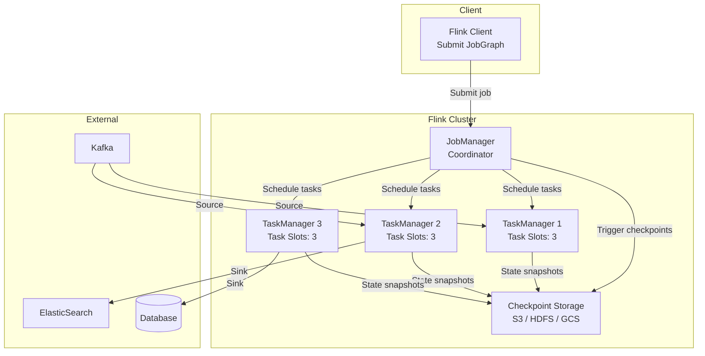
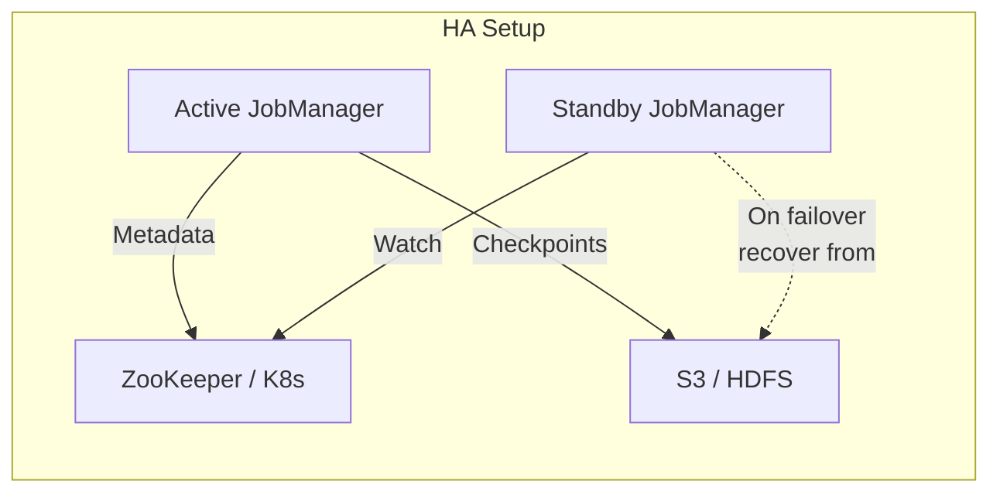
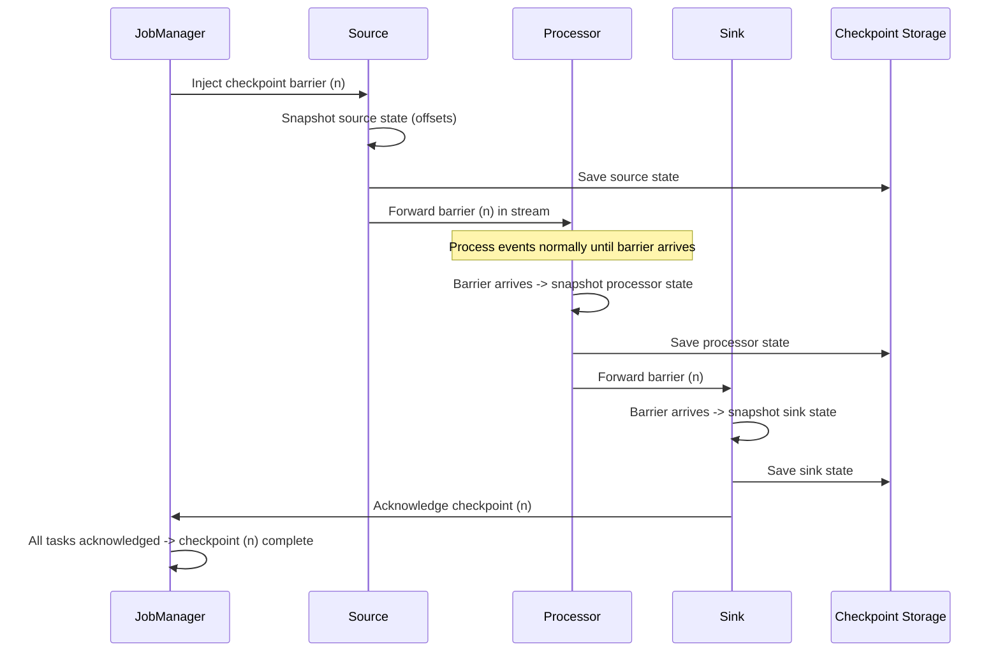

# Apache Flink

## What Is Flink?

Apache Flink is a **distributed stream processing framework**. Unlike Kafka Streams
(a library), Flink is a full framework with its own cluster: a JobManager that
orchestrates work, and TaskManagers that execute it. This gives Flink capabilities
that a library cannot match -- massive state, sophisticated checkpointing, complex
event processing, and unified batch+stream processing.

Flink's core philosophy: **streams are the fundamental abstraction**. Batch is just
a special case of stream processing (bounded streams). This means Flink applies the
same engine, the same optimizations, and the same guarantees to both.

---

## Architecture



### Components

| Component | Role | Details |
|---|---|---|
| **JobManager** | Master/coordinator | Schedules tasks, triggers checkpoints, handles failures |
| **TaskManager** | Worker | Runs task slots, manages memory, network buffers |
| **Task Slot** | Unit of resource | One thread for one parallel pipeline. TM with 3 slots runs 3 parallel tasks |
| **Checkpoint Coordinator** | Part of JobManager | Initiates and coordinates distributed snapshots |
| **State Backend** | Per TaskManager | Stores operator state (memory or RocksDB) |

### High Availability



JobManager HA uses leader election (ZooKeeper or Kubernetes). On failure, standby
takes over, recovers job state from the latest checkpoint.

---

## DataStream API

The core API for stream processing. Source -> Transformations -> Sink.

```java
StreamExecutionEnvironment env = StreamExecutionEnvironment.getExecutionEnvironment();

// Source: read from Kafka
DataStream<Event> events = env.fromSource(
    KafkaSource.<Event>builder()
        .setBootstrapServers("kafka:9092")
        .setTopics("events")
        .setGroupId("flink-processor")
        .setStartingOffsets(OffsetsInitializer.latest())
        .setValueOnlyDeserializer(new EventDeserializer())
        .build(),
    WatermarkStrategy
        .<Event>forBoundedOutOfOrderness(Duration.ofSeconds(5))
        .withTimestampAssigner((event, ts) -> event.getTimestamp()),
    "kafka-source"
);

// Transformations
DataStream<EnrichedEvent> enriched = events
    .filter(e -> e.getType().equals("purchase"))
    .keyBy(Event::getUserId)
    .process(new EnrichmentFunction())  // stateful processing
    .name("enrich-purchases");

// Sink: write to ElasticSearch
enriched.sinkTo(
    new Elasticsearch7SinkBuilder<EnrichedEvent>()
        .setHosts(new HttpHost("elasticsearch", 9200, "http"))
        .setEmitter((element, context, indexer) -> {
            indexer.add(new IndexRequest("purchases")
                .id(element.getId())
                .source(element.toJson(), XContentType.JSON));
        })
        .build()
).name("elasticsearch-sink");

env.execute("Purchase Processing Pipeline");
```

### Key Transformations

```java
// Map: 1-to-1 transformation
events.map(e -> new SimpleEvent(e.getKey(), e.getValue().toUpperCase()));

// FlatMap: 1-to-many
events.flatMap((event, collector) -> {
    for (String word : event.getText().split(" ")) {
        collector.collect(new WordEvent(word, 1));
    }
});

// Filter
events.filter(e -> e.getAmount() > 100);

// KeyBy: partition by key (required for stateful operations)
events.keyBy(Event::getUserId);

// Reduce: rolling aggregation
keyed.reduce((a, b) -> new Event(a.key, a.value + b.value));

// Process: full control (access to state, timers, side outputs)
keyed.process(new KeyedProcessFunction<String, Event, Alert>() {
    private ValueState<Integer> countState;
    
    @Override
    public void open(Configuration params) {
        countState = getRuntimeContext().getState(
            new ValueStateDescriptor<>("count", Integer.class));
    }
    
    @Override
    public void processElement(Event event, Context ctx, Collector<Alert> out) {
        Integer count = countState.value();
        count = (count == null) ? 1 : count + 1;
        countState.update(count);
        
        if (count > 3) {
            out.collect(new Alert(event.getUserId(), "Too many events"));
        }
        
        // Register a timer to fire 1 hour from now
        ctx.timerService().registerEventTimeTimer(
            event.getTimestamp() + 3600000);
    }
    
    @Override
    public void onTimer(long timestamp, OnTimerContext ctx, Collector<Alert> out) {
        // Timer fired -- reset count
        countState.clear();
    }
});
```

---

## Checkpointing: Exactly-Once Processing

Flink's exactly-once is based on the **Chandy-Lamport distributed snapshot algorithm**.

### How It Works



### Checkpoint Barriers

Barriers are special markers injected into the data stream. They flow through the
pipeline like regular events but trigger state snapshots at each operator.

```
Data stream:  [e1] [e2] [e3] |BARRIER-5| [e4] [e5] |BARRIER-6| [e6] ...

Before barrier-5: events belong to checkpoint 4
Between barrier-5 and barrier-6: events belong to checkpoint 5
After barrier-6: events belong to checkpoint 6
```

### Barrier Alignment

When an operator has multiple inputs, it must ALIGN barriers -- wait for barriers
from all inputs before taking its snapshot.

```
Input 1: [e1] [e2] |B5| [e3] [e4]
Input 2: [e5] |B5| [e6] [e7] [e8]

Operator must wait for B5 from BOTH inputs before snapshotting.
While waiting for Input 1's B5, Input 2's events after B5 are buffered.
```

**Unaligned checkpoints** (Flink 1.11+): Do not buffer. Instead, include in-flight
records in the checkpoint. Faster checkpointing at cost of larger checkpoint size.

### Configuration

```java
StreamExecutionEnvironment env = StreamExecutionEnvironment.getExecutionEnvironment();

// Enable checkpointing every 60 seconds
env.enableCheckpointing(60000);

// Exactly-once mode (default)
env.getCheckpointConfig().setCheckpointingMode(CheckpointingMode.EXACTLY_ONCE);

// Tolerate up to 3 consecutive checkpoint failures
env.getCheckpointConfig().setTolerableCheckpointFailureNumber(3);

// Minimum pause between checkpoints (to avoid back-to-back checkpoints)
env.getCheckpointConfig().setMinPauseBetweenCheckpoints(30000);

// Checkpoint timeout -- fail if not completed within 10 minutes
env.getCheckpointConfig().setCheckpointTimeout(600000);

// Keep checkpoints on job cancellation (for savepoint-like recovery)
env.getCheckpointConfig().setExternalizedCheckpointCleanup(
    ExternalizedCheckpointCleanup.RETAIN_ON_CANCELLATION);
```

---

## Savepoints

Savepoints are **manually triggered checkpoints** that you control. They are used for
planned operations, not failure recovery.

| | Checkpoint | Savepoint |
|---|---|---|
| **Triggered by** | Flink automatically (periodic) | User manually (CLI/API) |
| **Purpose** | Failure recovery | Upgrades, migrations, A/B testing |
| **Storage** | Checkpoint storage (may be cleaned up) | User-defined path (persisted indefinitely) |
| **Lifecycle** | Managed by Flink | Managed by user |
| **Format** | May use incremental format | Always full snapshot |

### Savepoint Operations

```bash
# Create a savepoint
flink savepoint <jobId> s3://my-bucket/savepoints/

# Cancel job with savepoint (stop gracefully)
flink cancel -s s3://my-bucket/savepoints/ <jobId>

# Resume from savepoint
flink run -s s3://my-bucket/savepoints/savepoint-abc123 myJob.jar

# Resume with state schema evolution
flink run -s s3://my-bucket/savepoints/savepoint-abc123 \
  --allowNonRestoredState myJobV2.jar
```

**Key use cases**:
- **Application upgrades**: Savepoint -> deploy new version -> resume from savepoint
- **Flink version upgrades**: Savepoint -> upgrade cluster -> resume
- **A/B testing**: Savepoint -> fork into two jobs with different logic
- **Migration**: Savepoint on cluster A -> restore on cluster B

---

## State Backends

| Backend | State Location | Checkpoint Mechanism | Max State Size | Use Case |
|---|---|---|---|---|
| **HashMapStateBackend** | JVM heap | Full snapshot to storage | Limited by heap (GBs) | Small state, low latency |
| **EmbeddedRocksDBStateBackend** | RocksDB on disk | Incremental snapshots | Terabytes | Large state, production |

### RocksDB State Backend (Production Standard)

```java
env.setStateBackend(new EmbeddedRocksDBStateBackend(true)); // true = incremental

// Configure checkpoint storage
env.getCheckpointConfig().setCheckpointStorage("s3://my-bucket/checkpoints");
```

**Incremental checkpointing**: Instead of snapshotting the entire state each time,
only the changes since the last checkpoint are uploaded. Critical for large state.

```
Full checkpoints:
  CP1: 10 GB upload
  CP2: 10 GB upload
  CP3: 10 GB upload

Incremental checkpoints:
  CP1: 10 GB upload (base)
  CP2:  1 GB upload (delta from CP1)
  CP3:  1 GB upload (delta from CP2)
  CP4: 10 GB upload (periodic base compaction)
```

### State Types

```java
// ValueState: single value per key
ValueState<Integer> count = getRuntimeContext().getState(
    new ValueStateDescriptor<>("count", Integer.class));

// ListState: list of values per key
ListState<Event> events = getRuntimeContext().getListState(
    new ListStateDescriptor<>("events", Event.class));

// MapState: map of key-value pairs per key
MapState<String, Double> features = getRuntimeContext().getMapState(
    new MapStateDescriptor<>("features", String.class, Double.class));

// ReducingState: automatically reduces added values
ReducingState<Long> sum = getRuntimeContext().getReducingState(
    new ReducingStateDescriptor<>("sum", Long::sum, Long.class));

// AggregatingState: custom aggregation
AggregatingState<Event, Average> avg = getRuntimeContext().getAggregatingState(
    new AggregatingStateDescriptor<>("avg", new AverageAggregate(), ...));
```

---

## Windowing in Flink

### All Window Types with Code

```java
DataStream<Event> events = env.fromSource(kafkaSource, watermarkStrategy, "src");

// Tumbling window (5 minutes, event time)
events.keyBy(Event::getUserId)
    .window(TumblingEventTimeWindows.of(Time.minutes(5)))
    .aggregate(new CountAggregate());

// Sliding window (10 min size, 5 min slide)
events.keyBy(Event::getUserId)
    .window(SlidingEventTimeWindows.of(Time.minutes(10), Time.minutes(5)))
    .aggregate(new CountAggregate());

// Session window (30 min gap)
events.keyBy(Event::getUserId)
    .window(EventTimeSessionWindows.withGap(Time.minutes(30)))
    .aggregate(new SessionAggregate());

// Global window with custom trigger
events.keyBy(Event::getUserId)
    .window(GlobalWindows.create())
    .trigger(CountTrigger.of(100))  // fire every 100 elements
    .aggregate(new BatchAggregate());

// Processing time variants
events.keyBy(Event::getUserId)
    .window(TumblingProcessingTimeWindows.of(Time.minutes(5)))
    .aggregate(new CountAggregate());
```

### Handling Late Data

```java
// With allowed lateness
DataStream<Result> results = events
    .keyBy(Event::getUserId)
    .window(TumblingEventTimeWindows.of(Time.minutes(5)))
    .allowedLateness(Time.minutes(2))  // keep window 2 extra minutes
    .sideOutputLateData(lateOutputTag)  // side output for VERY late data
    .aggregate(new CountAggregate());

// Access late data side output
DataStream<Event> lateEvents = results.getSideOutput(lateOutputTag);
lateEvents.addSink(new DeadLetterSink());  // send to dead letter queue
```

### Custom Window Functions

```java
// ProcessWindowFunction: access to all elements in the window + metadata
events.keyBy(Event::getUserId)
    .window(TumblingEventTimeWindows.of(Time.minutes(5)))
    .process(new ProcessWindowFunction<Event, Result, String, TimeWindow>() {
        @Override
        public void process(String key, Context context, 
                          Iterable<Event> elements, Collector<Result> out) {
            long windowStart = context.window().getStart();
            long windowEnd = context.window().getEnd();
            int count = 0;
            for (Event e : elements) { count++; }
            out.collect(new Result(key, count, windowStart, windowEnd));
        }
    });
```

---

## Complex Event Processing (CEP)

Flink CEP allows you to detect patterns in event streams -- think of it as regex
for event sequences.

```java
import org.apache.flink.cep.CEP;
import org.apache.flink.cep.PatternStream;
import org.apache.flink.cep.pattern.Pattern;

// Detect: 3 failed logins followed by a successful login within 5 minutes
Pattern<LoginEvent, ?> pattern = Pattern
    .<LoginEvent>begin("failures")
        .where(new SimpleCondition<LoginEvent>() {
            public boolean filter(LoginEvent event) {
                return event.getType().equals("FAILED");
            }
        })
        .timesOrMore(3)                          // 3 or more failures
    .followedBy("success")                        // followed by
        .where(new SimpleCondition<LoginEvent>() {
            public boolean filter(LoginEvent event) {
                return event.getType().equals("SUCCESS");
            }
        })
    .within(Time.minutes(5));                     // within 5 minutes

DataStream<LoginEvent> loginEvents = events.keyBy(LoginEvent::getUserId);

PatternStream<LoginEvent> patternStream = CEP.pattern(loginEvents, pattern);

DataStream<Alert> alerts = patternStream.select(
    new PatternSelectFunction<LoginEvent, Alert>() {
        public Alert select(Map<String, List<LoginEvent>> matches) {
            List<LoginEvent> failures = matches.get("failures");
            LoginEvent success = matches.get("success").get(0);
            return new Alert(
                success.getUserId(),
                "Suspicious login: " + failures.size() + " failures then success",
                success.getTimestamp()
            );
        }
    }
);
```

### CEP Pattern Operators

| Operator | Meaning | Example |
|---|---|---|
| `begin("name")` | Start pattern | First event in sequence |
| `followedBy("name")` | Non-strict contiguous | Allow unrelated events in between |
| `followedByAny("name")` | Non-deterministic | Match any following occurrence |
| `next("name")` | Strict contiguous | Immediately next event |
| `times(n)` | Exactly N occurrences | `.times(3)` |
| `timesOrMore(n)` | At least N | `.timesOrMore(3)` |
| `oneOrMore()` | One or more | Like regex `+` |
| `optional()` | Zero or one | Like regex `?` |
| `within(time)` | Time constraint | Pattern must complete within duration |
| `where(condition)` | Filter condition | Match events meeting criteria |

---

## Table API and Flink SQL

SQL on streams. Flink treats streams as dynamic tables that change over time.

```java
StreamTableEnvironment tableEnv = StreamTableEnvironment.create(env);

// Register a Kafka source as a table
tableEnv.executeSql("""
    CREATE TABLE orders (
        order_id STRING,
        customer_id STRING,
        amount DOUBLE,
        order_time TIMESTAMP(3),
        WATERMARK FOR order_time AS order_time - INTERVAL '5' SECOND
    ) WITH (
        'connector' = 'kafka',
        'topic' = 'orders',
        'properties.bootstrap.servers' = 'kafka:9092',
        'format' = 'json',
        'scan.startup.mode' = 'latest-offset'
    )
""");

// Windowed aggregation in SQL
tableEnv.executeSql("""
    CREATE TABLE hourly_revenue AS
    SELECT 
        customer_id,
        TUMBLE_START(order_time, INTERVAL '1' HOUR) AS window_start,
        TUMBLE_END(order_time, INTERVAL '1' HOUR) AS window_end,
        COUNT(*) AS order_count,
        SUM(amount) AS total_revenue
    FROM orders
    GROUP BY 
        customer_id,
        TUMBLE(order_time, INTERVAL '1' HOUR)
""");

// Pattern matching in SQL (MATCH_RECOGNIZE)
tableEnv.executeSql("""
    SELECT *
    FROM orders
    MATCH_RECOGNIZE (
        PARTITION BY customer_id
        ORDER BY order_time
        MEASURES
            FIRST(A.order_time) AS start_time,
            LAST(A.order_time) AS end_time,
            COUNT(A.order_id) AS order_count
        ONE ROW PER MATCH
        AFTER MATCH SKIP PAST LAST ROW
        PATTERN (A{3,})
        DEFINE
            A AS A.amount > 1000
    )
""");
```

---

## Unified Batch and Stream Processing

Flink's vision: one engine for both. Set execution mode and the same code works on
bounded (batch) and unbounded (stream) data.

```java
// Stream mode (default) -- for unbounded data
env.setRuntimeMode(RuntimeExecutionMode.STREAMING);

// Batch mode -- for bounded data (optimized execution)
env.setRuntimeMode(RuntimeExecutionMode.BATCH);

// Automatic -- Flink decides based on sources
env.setRuntimeMode(RuntimeExecutionMode.AUTOMATIC);
```

**Batch mode optimizations**: Sort-based shuffles instead of hash-based, no
checkpointing needed (just restart from the beginning on failure), operator
chaining optimizations.

---

## Flink vs Kafka Streams vs Spark Streaming: Comparison

| Criteria | Apache Flink | Kafka Streams | Spark Structured Streaming |
|---|---|---|---|
| **Type** | Framework (separate cluster) | Library (embedded in app) | Framework (Spark cluster) |
| **Processing model** | True streaming (event-at-a-time) | True streaming (event-at-a-time) | Micro-batch (small batch intervals) |
| **Latency** | Milliseconds | Milliseconds | Seconds (micro-batch interval) |
| **Source/Sink** | Any (Kafka, files, DB, custom) | Kafka only | Any (Kafka, files, DB, custom) |
| **State size** | Terabytes (RocksDB + incremental CP) | Gigabytes (RocksDB on local disk) | Gigabytes (in executor memory) |
| **Exactly-once** | Chandy-Lamport checkpointing | Kafka transactions | Micro-batch WAL/checkpointing |
| **Windowing** | Excellent (all types, CEP) | Good (tumbling, sliding, session) | Good (tumbling, sliding) |
| **Event time** | First-class (watermarks built-in) | Supported (timestamp extractors) | Supported (watermarks) |
| **CEP** | Yes (Flink CEP library) | No (must build manually) | No (must build manually) |
| **SQL** | Flink SQL (streaming SQL) | ksqlDB (separate product) | Spark SQL (mature) |
| **Batch** | Yes (unified engine) | No (stream only) | Yes (Spark's strength) |
| **Deployment** | K8s, YARN, standalone | Just deploy your JAR | K8s, YARN, standalone |
| **Ops complexity** | High (JM + TMs + HA) | Low (just your app) | High (Spark cluster) |
| **Scaling** | Add TaskManagers | Add app instances | Add executors |
| **Community** | Large, growing fast | Kafka ecosystem | Largest (Spark) |
| **Best for** | Complex streaming, large state | Kafka-centric, moderate complexity | Batch-first with streaming needs |

### Decision Matrix

```
Need CEP / pattern matching?                      --> Flink
Source is only Kafka + want simple deployment?     --> Kafka Streams
Already have Spark cluster + batch is primary?     --> Spark Structured Streaming
Need terabytes of state?                           --> Flink
Want a library, not a framework?                   --> Kafka Streams
Need unified batch + stream?                       --> Flink or Spark
Millisecond latency required?                      --> Flink or Kafka Streams
Team knows SQL, wants quick results?               --> Flink SQL or ksqlDB
```

---

## Real-World Deployments

### Alibaba (Largest Flink Deployment)

- **Scale**: Thousands of Flink jobs, processes billions of events per second
- **Use case**: Real-time search indexing, recommendation engine, fraud detection
- **Singles' Day (11.11)**: Flink powers the real-time dashboard showing transaction
  volume, GMV, and logistics in real time
- Alibaba is the largest contributor to Flink (created Blink, merged back into Flink)

### Uber

- **Use case**: Real-time analytics, dynamic pricing, ETA computation
- **Architecture**: Kafka -> Flink -> Apache Pinot (real-time OLAP)
- **Scale**: Trillions of events per day across multiple Flink clusters
- Uses Flink for feature computation for ML models (real-time features)

### Netflix

- **Use case**: Real-time monitoring, A/B test analysis, content recommendations
- **Architecture**: Kafka -> Flink -> Druid/ElasticSearch
- **Keystone pipeline**: Processes trillions of events per day for analytics
- Uses Flink for real-time anomaly detection in streaming infrastructure health

### Lyft

- **Use case**: Real-time pricing, marketplace health, event processing
- **FlinkK8sOperator**: Open-sourced their Kubernetes operator for Flink
- Migrated from Spark Streaming to Flink for lower latency

### Stripe

- **Use case**: Real-time fraud scoring, payment event processing
- Uses Flink for sub-second fraud detection on payment transactions

---

## When to Use Flink

### Use Flink When:

- You need **complex event processing** (CEP pattern matching on event streams)
- Your state is **very large** (terabytes) and needs incremental checkpointing
- You need **event-time processing** with sophisticated watermark strategies
- You have **multiple sources** beyond Kafka (files, databases, custom)
- You want **unified batch + stream** processing with one engine
- You need **low-latency** true streaming (not micro-batch)
- You are building a **central stream processing platform** for your org

### Do NOT Use Flink When:

- Your use case is simple Kafka-to-Kafka transformations (use Kafka Streams)
- You want zero operational overhead (Flink requires cluster management)
- Your team only knows SQL and wants minimal infrastructure (consider ksqlDB)
- Batch processing is your primary workload with occasional streaming (consider Spark)

---

## Flink Operational Checklist

```
[ ] Checkpoint interval tuned (balance between recovery time and overhead)
[ ] Checkpoint storage on durable storage (S3, HDFS, GCS)
[ ] Incremental checkpointing enabled for RocksDB state backend
[ ] Savepoint taken before every deployment
[ ] Watermark strategy configured correctly for your data characteristics
[ ] Parallelism set based on input partitions and throughput requirements
[ ] Memory configuration tuned (JVM heap, managed memory, network buffers)
[ ] Metrics exported to monitoring system (Prometheus + Grafana)
[ ] Alerting on checkpoint failures, backpressure, consumer lag
[ ] Dead letter queue for malformed events
[ ] State TTL configured to prevent unbounded state growth
```

### State TTL (Preventing Unbounded State Growth)

```java
StateTtlConfig ttlConfig = StateTtlConfig
    .newBuilder(Time.hours(24))           // Expire state after 24 hours
    .setUpdateType(UpdateType.OnCreateAndWrite)  // Reset TTL on write
    .setStateVisibility(NeverReturnExpired)       // Never return expired values
    .cleanupFullSnapshot()                        // Clean up during checkpoints
    .build();

ValueStateDescriptor<Long> stateDescriptor = 
    new ValueStateDescriptor<>("count", Long.class);
stateDescriptor.enableTimeToLive(ttlConfig);
```
