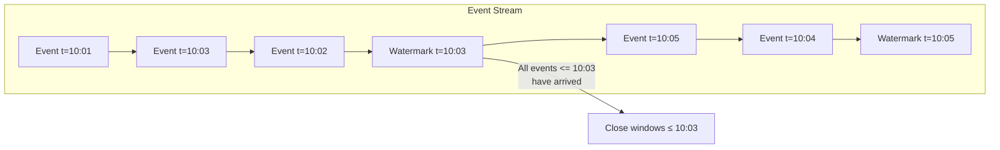
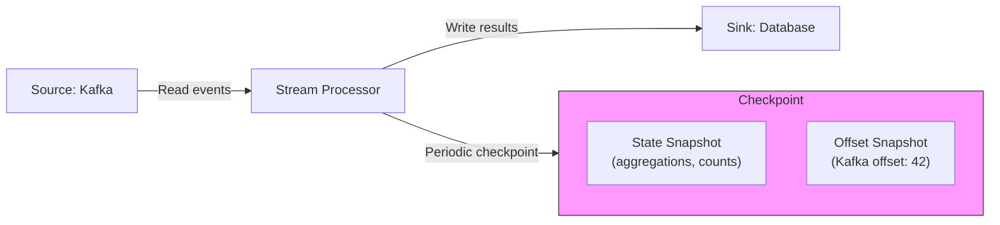
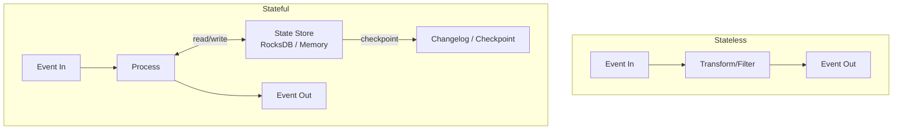
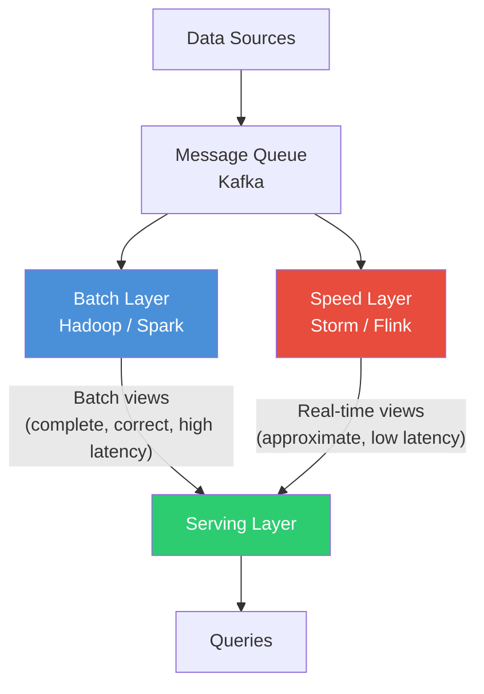
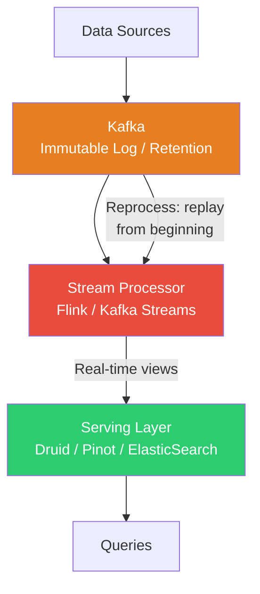

# Stream Processing Fundamentals

## Batch vs Stream Processing

Before diving into stream processing, understand the fundamental difference between
the two paradigms that process data at scale.

**Batch processing** operates on bounded, finite datasets. You collect data over a period,
then process it all at once. Think MapReduce, Spark batch jobs, nightly ETL runs.

**Stream processing** operates on unbounded, infinite datasets. You process data as it
arrives, one event (or micro-batch) at a time. Think Kafka Streams, Flink, real-time
fraud detection.

### Comparison Table

| Criteria | Batch Processing | Stream Processing |
|---|---|---|
| **Latency** | Minutes to hours | Milliseconds to seconds |
| **Data scope** | Bounded (finite dataset) | Unbounded (infinite stream) |
| **Completeness** | Complete -- all data present | Incomplete -- data still arriving |
| **Throughput** | Very high (optimized bulk ops) | High (per-event overhead) |
| **Complexity** | Simpler (no time semantics) | Complex (windowing, watermarks, late data) |
| **Fault tolerance** | Restart failed job from scratch | Checkpoint and resume from offset |
| **State management** | Implicit (full dataset in memory/disk) | Explicit (state stores, checkpoints) |
| **Resource usage** | Bursty (idle then spike) | Steady (continuous consumption) |
| **Correctness** | Easier (all data available) | Harder (out-of-order, late data) |
| **Use cases** | Reports, ML training, data warehouse loads | Alerts, dashboards, fraud detection |
| **Examples** | Spark, MapReduce, Hive | Flink, Kafka Streams, Dataflow |
| **Result freshness** | Stale until next batch completes | Near real-time |

**Key insight**: Stream processing is strictly harder than batch processing. A stream
processor that handles unbounded data correctly can also handle bounded data. The
reverse is not true.

---

## Stream Processing Core Concepts

### Event Time vs Processing Time

This distinction is the single most important concept in stream processing.

```
Event Time:      When the event ACTUALLY happened (embedded in the event)
Processing Time: When the event is OBSERVED by the system (wall clock)
```

**Why they differ:**
1. **Network delays** -- events traverse multiple hops before reaching the processor
2. **Mobile/IoT** -- devices go offline, buffer events, send them later
3. **Partitioning** -- events from different partitions arrive at different rates
4. **Backpressure** -- slow consumers fall behind, widening the gap

```
Timeline example:

Event Time:       10:00:00  10:00:01  10:00:02  10:00:03  10:00:04
                     |         |         |         |         |
Events produced:     A         B         C         D         E

Processing Time:  10:00:01  10:00:05  10:00:03  10:00:02  10:00:06
                     |         |         |         |         |
Events received:     A         B         C         D         E
                                                ^
                                   D arrived before B and C!
```

**Out-of-order events** are the norm, not the exception. Any stream processing system
that assumes events arrive in order is fundamentally broken.

**Why event time matters**: If you are computing "revenue per minute," you need to group
events by when the purchase happened (event time), not when your server received the
message (processing time). Otherwise, a network hiccup shifts revenue between windows.

---

### Windowing

Windowing groups unbounded data into finite chunks for aggregation. Without windows,
you cannot answer questions like "how many clicks in the last 5 minutes?"

#### Tumbling Windows (Fixed, Non-Overlapping)

Fixed-size, non-overlapping windows. Every event belongs to exactly one window.

```mermaid
gantt
    title Tumbling Windows (5-minute)
    dateFormat HH:mm
    axisFormat %H:%M
    section Windows
    Window 1 :w1, 00:00, 5m
    Window 2 :w2, 00:05, 5m
    Window 3 :w3, 00:10, 5m
    Window 4 :w4, 00:15, 5m
    section Events
    e1 :milestone, 00:02, 0m
    e2 :milestone, 00:04, 0m
    e3 :milestone, 00:07, 0m
    e4 :milestone, 00:11, 0m
    e5 :milestone, 00:13, 0m
    e6 :milestone, 00:18, 0m
```



```
|--Window 1--|--Window 2--|--Window 3--|--Window 4--|
|  e1   e2  |  e3        |  e4   e5   |  e6        |
0          5           10           15           20  (minutes)
```

**Use case**: Hourly/daily aggregation, billing windows, metric rollups.

#### Sliding Windows (Overlapping)

Fixed-size windows that advance by a slide interval. Events can belong to
multiple windows.

```
Window size = 10 min, Slide = 5 min

|-----Window 1 (0-10)------|
         |-----Window 2 (5-15)------|
                  |-----Window 3 (10-20)------|
0        5        10       15       20        25
              ^
          This event is in Window 1 AND Window 2
```

**Use case**: Moving averages, "clicks in the last 10 minutes updated every minute."

#### Session Windows (Gap-Based)

Dynamic windows defined by a gap of inactivity. No fixed size -- they grow as long
as events keep arriving within the gap duration.

```
Session gap = 3 min

User A: |--e1--e2------e3--|        (gap > 3min)        |--e4--e5--|
        |   Session 1      |                            | Session 2|
        0    1    2    5    8   9  10  11  12  13  14   15   16

User A had a session from 0-5, went inactive, then started a new session at 14.
```

**Use case**: User session analysis, clickstream analysis, shopping cart activity.

#### Global Windows

A single window that encompasses all data. Only useful with custom triggers.

```
|----------------------------Global Window------------------------------|
| e1  e2  e3  e4  e5  e6  ...  eN  ...                                |
Start                                                            Never ends
```

**Use case**: Global aggregations with custom trigger logic (e.g., emit every 1000 events).

---

### Watermarks

> **Watermark**: An assertion that all events with event time <= T have arrived.

Watermarks solve the fundamental problem: **when can you close a window?**

In a perfect world with no late data, you would close the [10:00, 10:05) window at
exactly 10:05. But events arrive late, so you need a mechanism to say "I believe all
events up to 10:05 have now arrived."



#### Heuristic Watermarks vs Perfect Watermarks

| | Perfect Watermark | Heuristic Watermark |
|---|---|---|
| **Definition** | Guarantees no late data -- 100% correct | Best-guess estimate -- may be wrong |
| **Requirement** | Must know ALL sources completely | Statistical estimation from observed data |
| **Late data** | Never happens | Can happen -- need allowed lateness |
| **Latency** | May wait a long time for stragglers | Lower latency, accepts some inaccuracy |
| **When possible** | Ordered sources (e.g., single Kafka partition) | Distributed sources, mobile, IoT |
| **In practice** | Rare | This is what you will use 99% of the time |

#### Allowed Lateness

For heuristic watermarks, you must define what happens to VERY late data:

```
Window [10:00, 10:05) closes at watermark 10:05
Allowed lateness = 2 minutes

Timeline:
  10:05  -- Watermark arrives, window emits first result
  10:06  -- Late event (t=10:03) arrives -> UPDATE window result
  10:07  -- Window is GARBAGE COLLECTED (10:05 + 2min lateness)
  10:09  -- Very late event (t=10:04) arrives -> DROPPED (past allowed lateness)
```

**Trade-off**: More allowed lateness = more correct results but more memory usage
(must keep window state around longer).

---

### Triggers

**Trigger**: Determines WHEN a window emits its results.

Windows can emit results at different points:

| Trigger Type | When It Fires | Use Case |
|---|---|---|
| **Event time** | When watermark passes window end | Standard -- wait for completeness |
| **Processing time** | Every N seconds of wall-clock time | Periodic partial updates |
| **Element count** | After N elements arrive | Batch-like behavior in streams |
| **Early** | Before watermark (speculative results) | Low-latency dashboards |
| **Late** | After watermark (updated results) | Handle late-arriving data |
| **Composite** | Combination of the above | Early speculative + on-time + late updates |

**The ideal trigger pattern** (from the Dataflow model):

```
Early results:   Fire every 1 minute (speculative)
On-time result:  Fire when watermark passes window end
Late results:    Fire for each late element within allowed lateness
```

This gives you: low-latency speculative results + correct on-time result + updates
for late data.

---

### Accumulation Modes

When a window fires multiple times (early, on-time, late), how do you combine results?

| Mode | Behavior | Output | Use Case |
|---|---|---|---|
| **Discarding** | Each firing shows only NEW data since last firing | Delta | When downstream sums all firings |
| **Accumulating** | Each firing shows COMPLETE window result | Running total | When downstream takes latest value |
| **Accumulating & Retracting** | Each firing includes retraction of previous + new complete result | Retraction + total | When downstream cannot simply replace |

**Example**: Window counting page views, fires at t=1 (early), t=5 (on-time), t=7 (late)

```
Actual events in window: [A, B] at t=1, [C] at t=3, [D] at t=6 (late)

Discarding mode:
  t=1: emit 2       (A, B)
  t=5: emit 1       (C only, since last firing)
  t=7: emit 1       (D only)
  Downstream sums: 2 + 1 + 1 = 4 ✓

Accumulating mode:
  t=1: emit 2       (A, B)
  t=5: emit 3       (A, B, C -- full window)
  t=7: emit 4       (A, B, C, D -- full window)
  Downstream takes latest: 4 ✓

Accumulating & Retracting mode:
  t=1: emit 2               (A, B)
  t=5: emit retract(2), 3   (undo previous 2, new total 3)
  t=7: emit retract(3), 4   (undo previous 3, new total 4)
  Downstream applies retractions correctly ✓
```

---

## Exactly-Once Processing

The holy grail of stream processing. Three levels of delivery guarantees:

| Guarantee | Meaning | How |
|---|---|---|
| **At-most-once** | Events may be lost, never duplicated | Fire and forget |
| **At-least-once** | Events never lost, may be duplicated | Retry on failure |
| **Exactly-once** | Events processed exactly once | At-least-once + deduplication |

**Exactly-once is actually "effectively once"** -- under the hood, events may be
delivered multiple times, but the system ensures the EFFECT is as if each event
was processed exactly once.

### Two Pillars of Exactly-Once

#### 1. Idempotent Processing

An operation is idempotent if applying it multiple times has the same effect as
applying it once.

```python
# NOT idempotent -- re-processing doubles the count
def process(event):
    db.execute("UPDATE counts SET value = value + 1 WHERE key = ?", event.key)

# Idempotent -- re-processing has no additional effect
def process(event):
    db.execute("""
        INSERT INTO events (event_id, key, value) 
        VALUES (?, ?, ?)
        ON CONFLICT (event_id) DO NOTHING
    """, event.id, event.key, event.value)
```

#### 2. Checkpointing

Periodically snapshot the processing state so you can resume from the last
checkpoint on failure instead of reprocessing from the beginning.



**On failure**: Restore state from checkpoint, rewind source to checkpointed offset,
replay events. Combined with idempotent sinks, this achieves exactly-once.

---

## Stateful vs Stateless Stream Processing

### Stateless Processing

Each event is processed independently. No memory of previous events.

```
Examples:
- Filter: drop events that don't match a predicate
- Map: transform event format (JSON -> Avro)
- FlatMap: split one event into multiple
- Route: send events to different outputs based on content
```

**Advantages**: Simple, horizontally scalable, no checkpointing complexity.

### Stateful Processing

Processing depends on accumulated state from previous events.

```
Examples:
- Count: "how many events of type X in the last hour?"
- Join: "combine user click with user profile"
- Aggregation: "running average of sensor readings"
- Deduplication: "have I seen this event ID before?"
- Pattern detection: "alert if 3 failed logins in 5 minutes"
```

**Challenges**:
- State must survive failures (checkpoint it)
- State must be partitioned (too large for one machine)
- State access must be fast (in-memory or embedded DB like RocksDB)
- State must be rebalanced when scaling out



---

## Lambda Architecture

Proposed by Nathan Marz (creator of Apache Storm). Combines batch and stream
processing to get the best of both worlds.



### Three Layers

| Layer | Purpose | Technology | Properties |
|---|---|---|---|
| **Batch Layer** | Process complete dataset, produce batch views | Hadoop, Spark | High latency, complete, correct |
| **Speed Layer** | Process recent data in real-time | Storm, Flink | Low latency, approximate, incremental |
| **Serving Layer** | Merge batch + speed views for queries | Druid, Cassandra | Serves both views to end users |

### How It Works

1. All data goes to both batch and speed layers
2. Batch layer periodically reprocesses ALL data, producing "batch views"
3. Speed layer processes only recent data since last batch run, producing "real-time views"
4. Serving layer merges both: batch view + real-time view = complete picture
5. When batch catches up, real-time view for that period is discarded

### Problems with Lambda

- **Two codebases**: Must implement logic twice (batch + stream) and keep them in sync
- **Operational complexity**: Two systems to deploy, monitor, and debug
- **Semantic differences**: Batch and stream may produce slightly different results
- **Debugging nightmare**: When results differ, which layer has the bug?

---

## Kappa Architecture

Proposed by Jay Kreps (co-creator of Kafka). Uses ONLY stream processing.



### How It Works

1. All data flows through Kafka (with long retention or infinite retention via tiered storage)
2. Stream processor consumes from Kafka, produces serving views
3. **To reprocess**: Deploy new version of stream processor, replay from beginning of Kafka log
4. Once new version catches up, switch queries to new output, shut down old version

### Why Kappa Works

- Kafka with long retention IS the "batch layer" -- you can replay everything
- Modern stream processors (Flink) handle both real-time AND historical reprocessing
- One codebase, one system, one set of semantics

---

## Lambda vs Kappa: Comparison

| Criteria | Lambda Architecture | Kappa Architecture |
|---|---|---|
| **Codebases** | Two (batch + stream) | One (stream only) |
| **Complexity** | High (two systems) | Lower (one system) |
| **Reprocessing** | Batch layer handles it | Replay Kafka log |
| **Correctness** | Batch layer is source of truth | Stream processor must be correct |
| **Latency** | Low (speed layer) + Correct (batch layer) | Low and correct (if done right) |
| **Operational cost** | High (Hadoop/Spark + Storm/Flink) | Lower (Kafka + Flink) |
| **Data retention** | Batch stores everything (HDFS) | Kafka must retain data (tiered storage) |
| **ML/complex analytics** | Easier (Spark for ML) | Harder (stream ML is maturing) |
| **Debugging** | Which layer has the bug? | One place to look |
| **Industry trend** | Legacy, declining | Growing, preferred for new systems |

### Why Kappa Is Winning

1. **Kafka tiered storage** makes infinite retention practical and affordable
2. **Flink** can process both bounded and unbounded data with one API
3. **Stream processing maturity** -- exactly-once, state management, SQL on streams
4. **Operational simplicity** -- one system to maintain beats two every time
5. **Developer experience** -- write logic once, run it on real-time and historical data

**The catch**: Some use cases genuinely need batch. Training ML models on petabytes of
data is still more practical with Spark. The pragmatic answer: Kappa for real-time
pipelines, batch for heavy analytics/ML. But the gap is closing.

---

## The Dataflow Model (Google)

Google's seminal paper (2015) unified these concepts into a coherent model, later
implemented as Apache Beam. The model answers four questions:

| Question | Concept | Implementation |
|---|---|---|
| **What** results are computed? | Transformations | ParDo, GroupByKey, Combine |
| **Where** in event time? | Windowing | Tumbling, Sliding, Session |
| **When** are results emitted? | Watermarks + Triggers | Early, On-time, Late firings |
| **How** do refinements relate? | Accumulation | Discarding, Accumulating, Retracting |

```python
# Apache Beam pseudocode implementing all four questions
(pipeline
  | ReadFromKafka(topic="events")                    # Source
  | WindowInto(FixedWindows(5 * 60))                 # WHERE: 5-min tumbling windows
  | WithAllowedLateness(2 * 60)                      # WHEN: allow 2 min late data
  | TriggeredBy(                                      # WHEN: trigger policy
      AfterWatermark()
        .with_early_firings(AfterProcessingTime(60))  #   early: every 1 min
        .with_late_firings(AfterCount(1))              #   late: each late element
    )
  | AccumulationMode(ACCUMULATING)                    # HOW: full window each time
  | CombinePerKey(sum)                                # WHAT: sum values per key
  | WriteToSink(bigquery_table)                       # Sink
)
```

---

## Summary: Mental Model for Stream Processing

```
1. Data arrives as an unbounded stream of events
2. Each event has an EVENT TIME (when it happened) and arrives at a PROCESSING TIME
3. Events are grouped into WINDOWS (tumbling, sliding, session)
4. WATERMARKS tell us when we think all events for a window have arrived
5. TRIGGERS tell us when to emit results (early, on-time, late)
6. ACCUMULATION MODES tell us how multiple firings relate
7. CHECKPOINTING + IDEMPOTENCY give us exactly-once guarantees
8. STATE STORES let us keep aggregations across events
9. All of this runs on a framework (Flink, Kafka Streams, Beam)
```

Understanding these fundamentals is framework-agnostic. Whether you use Flink, Kafka
Streams, or Google Dataflow, you are applying these same concepts.
