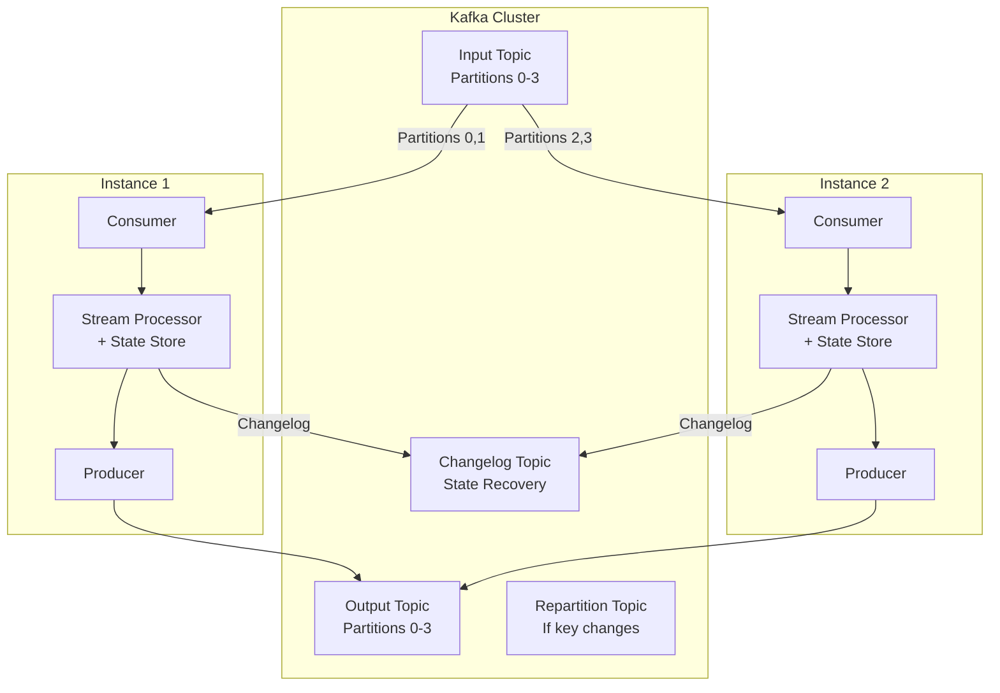
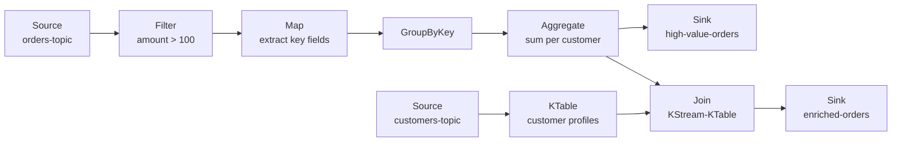
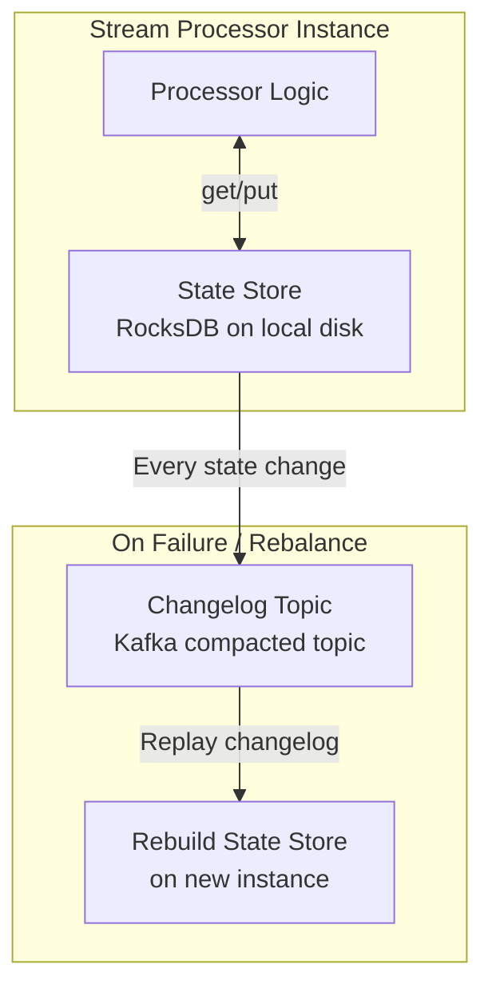
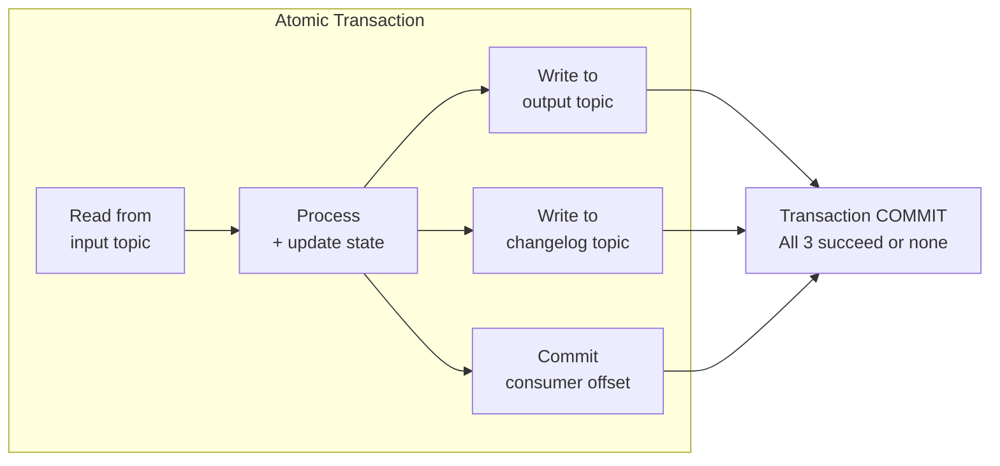

# Kafka Streams

## What Is Kafka Streams?

Kafka Streams is a **Java/Scala client library** for building stream processing
applications on top of Apache Kafka. The critical distinction: it is a library, not
a framework or cluster. Your application is a normal JVM process that happens to
consume from Kafka, process events, and produce back to Kafka.

**No separate processing cluster.** No YARN. No Mesos. No Kubernetes operator needed
(though you can deploy on Kubernetes). Just a JAR in your application.

```
Traditional stream processing:
  App --> Kafka --> [Flink Cluster (JobManager + TaskManagers)] --> Kafka --> App

Kafka Streams:
  [Your App (with Kafka Streams library embedded)] <--> Kafka
```

---

## Architecture



### How Parallelism Works

- **Stream Task**: One per input partition. If input topic has 4 partitions, you get 4 tasks.
- **Instances**: You can run multiple instances of your app. Kafka Streams uses Kafka's
  consumer group protocol to distribute tasks across instances.
- **Scaling**: Add more instances (up to number of partitions). Tasks are rebalanced automatically.

```
4 partitions, 1 instance:  Instance 1 handles tasks [0, 1, 2, 3]
4 partitions, 2 instances: Instance 1 handles [0, 1], Instance 2 handles [2, 3]
4 partitions, 4 instances: Each instance handles 1 task
4 partitions, 5 instances: One instance is idle (more instances than partitions)
```

---

## Key Abstractions

### KStream (Record Stream)

An unbounded stream of key-value records. Each record is an independent event.
Analogous to an INSERT in a database -- each record is a new fact.

```java
// KStream: each record is an event
// Key: userId, Value: clickEvent
// Record 1: (user1, {page: "/home", time: 10:00})
// Record 2: (user1, {page: "/cart", time: 10:01})
// Record 3: (user1, {page: "/home", time: 10:02})
// All three records exist independently
```

### KTable (Changelog Stream)

A changelog stream where each record is an UPDATE to a key. The latest value for a
key represents the current state. Analogous to an UPSERT in a database.

```java
// KTable: each record updates the state for that key
// Key: userId, Value: userProfile
// Record 1: (user1, {name: "Alice", city: "NYC"})      -> state: {user1: NYC}
// Record 2: (user2, {name: "Bob", city: "SF"})          -> state: {user1: NYC, user2: SF}
// Record 3: (user1, {name: "Alice", city: "London"})    -> state: {user1: London, user2: SF}
// Record 1 is superseded by Record 3
```

### GlobalKTable

Like KTable, but replicated on EVERY instance. Used for small reference data that
every task needs (e.g., country codes, config).

```
Regular KTable: partitioned across instances (each instance has subset)
GlobalKTable:   fully replicated (every instance has complete copy)
```

| | KStream | KTable | GlobalKTable |
|---|---|---|---|
| **Semantics** | Append (INSERT) | Upsert (UPDATE) | Upsert (UPDATE) |
| **All records matter?** | Yes | Only latest per key | Only latest per key |
| **Partitioning** | By key | By key | Full copy everywhere |
| **Use case** | Events, clicks, logs | Profiles, balances, state | Lookup tables, config |
| **Backed by** | Kafka topic | Compacted Kafka topic | Compacted Kafka topic |

---

## Topology: Source, Processor, Sink

A Kafka Streams application is a **topology** -- a directed acyclic graph (DAG) of
stream processors.



### DSL vs Processor API

**DSL (Domain Specific Language)**: High-level, declarative. Covers 90% of use cases.

```java
StreamsBuilder builder = new StreamsBuilder();

KStream<String, Order> orders = builder.stream("orders-topic");

orders
    .filter((key, order) -> order.getAmount() > 100)
    .mapValues(order -> new EnrichedOrder(order))
    .groupByKey()
    .windowedBy(TimeWindows.ofSizeWithNoGrace(Duration.ofMinutes(5)))
    .count()
    .toStream()
    .to("order-counts");
```

**Processor API**: Low-level, imperative. Full control over processing, state, scheduling.

```java
builder.addSource("source", "input-topic");
builder.addProcessor("process", () -> new CustomProcessor(), "source");
builder.addStateStore(
    Stores.keyValueStoreBuilder(
        Stores.persistentKeyValueStore("my-store"),
        Serdes.String(), Serdes.Long()
    ), "process");
builder.addSink("sink", "output-topic", "process");
```

---

## Stateful Operations

### State Stores

Every stateful operation (aggregation, join, dedup) needs a state store.

| Store Type | Backed By | Durability | Performance | Use Case |
|---|---|---|---|---|
| **Persistent (RocksDB)** | RocksDB on disk + changelog topic | Survives restarts | Good (memory-mapped) | Default, production use |
| **In-Memory** | HashMap + changelog topic | Lost on restart (rebuilt from changelog) | Fastest | Small state, testing |



**Changelog topics**: Every write to a state store is also written to a compacted
Kafka topic. On failure, the state store is rebuilt by replaying this changelog.
This is how Kafka Streams achieves fault-tolerant state without an external database.

### Aggregations

```java
// Count orders per customer in 5-minute tumbling windows
KStream<String, Order> orders = builder.stream("orders");

KTable<Windowed<String>, Long> orderCounts = orders
    .groupByKey()
    .windowedBy(TimeWindows.ofSizeWithNoGrace(Duration.ofMinutes(5)))
    .count(Materialized.as("order-counts-store"));
```

### Joins

Kafka Streams supports three join types:

| Join | Left | Right | Windowed? | Description |
|---|---|---|---|---|
| **KStream-KStream** | KStream | KStream | Yes (must have window) | Join two event streams within a time window |
| **KStream-KTable** | KStream | KTable | No | Enrich stream events with table lookups |
| **KTable-KTable** | KTable | KTable | No | Join two changelog streams (like a DB join) |

#### KStream-KStream Join (Windowed)

```java
// Join orders with payments within a 10-minute window
KStream<String, Order> orders = builder.stream("orders");
KStream<String, Payment> payments = builder.stream("payments");

KStream<String, OrderWithPayment> joined = orders.join(
    payments,
    (order, payment) -> new OrderWithPayment(order, payment),
    JoinWindows.ofTimeDifferenceWithNoGrace(Duration.ofMinutes(10)),
    StreamJoined.with(Serdes.String(), orderSerde, paymentSerde)
);
```

**Why windowed?** Two unbounded streams cannot be joined without a window -- you would
need to keep ALL history forever. The window bounds how far back to look for matches.

#### KStream-KTable Join (Lookup Enrichment)

```java
// Enrich orders with customer profiles
KStream<String, Order> orders = builder.stream("orders");
KTable<String, Customer> customers = builder.table("customers");

KStream<String, EnrichedOrder> enriched = orders.join(
    customers,
    (order, customer) -> new EnrichedOrder(order, customer)
);
// No window needed: KTable always has latest state for each key
```

#### KTable-KTable Join

```java
// Join user profiles with user preferences
KTable<String, Profile> profiles = builder.table("profiles");
KTable<String, Preferences> prefs = builder.table("preferences");

KTable<String, UserInfo> userInfo = profiles.join(
    prefs,
    (profile, pref) -> new UserInfo(profile, pref)
);
```

---

## Windowed Operations

```java
// Tumbling window: non-overlapping, fixed size
orders.groupByKey()
    .windowedBy(TimeWindows.ofSizeWithNoGrace(Duration.ofMinutes(5)))
    .count();

// Sliding window: overlapping, advance by slide interval
orders.groupByKey()
    .windowedBy(SlidingWindows.ofTimeDifferenceWithNoGrace(Duration.ofMinutes(10)))
    .count();

// Session window: gap-based, dynamic size
orders.groupByKey()
    .windowedBy(SessionWindows.ofInactivityGapWithNoGrace(Duration.ofMinutes(30)))
    .count();

// With grace period for late data
orders.groupByKey()
    .windowedBy(
        TimeWindows.ofSizeAndGrace(
            Duration.ofMinutes(5),    // window size
            Duration.ofMinutes(2)     // grace period for late events
        )
    )
    .count();
```

---

## Exactly-Once Semantics

Kafka Streams achieves exactly-once via **Kafka transactions**:

```java
Properties props = new Properties();
props.put(StreamsConfig.PROCESSING_GUARANTEE_CONFIG, 
          StreamsConfig.EXACTLY_ONCE_V2);  // Enable EOS
```

### How It Works

1. **Read** input from Kafka (consumer offsets tracked)
2. **Process** events, update state stores
3. **Write** output to Kafka + commit offsets + flush state store changelog
4. All three operations are wrapped in a **Kafka transaction** (atomic commit)



**On failure**: Transaction is aborted, offsets are not committed, output is not visible
to downstream consumers (read_committed isolation), state store is rebuilt from the
last committed changelog.

---

## Interactive Queries

Query state stores directly from your application -- no external database needed.

```java
// In your Kafka Streams application
KafkaStreams streams = new KafkaStreams(topology, props);
streams.start();

// Query the state store
ReadOnlyKeyValueStore<String, Long> store = streams.store(
    StoreQueryParameters.fromNameAndType(
        "order-counts-store",
        QueryableStoreTypes.keyValueStore()
    )
);

// Get count for a specific customer
Long count = store.get("customer-123");

// Iterate over all entries
KeyValueIterator<String, Long> iter = store.all();
while (iter.hasNext()) {
    KeyValue<String, Long> entry = iter.next();
    System.out.println(entry.key + " -> " + entry.value);
}
iter.close();
```

### Distributed Queries

Since state is partitioned across instances, a key might be on a different instance.
Kafka Streams provides metadata to discover which instance has a given key.

```java
// Find which instance holds the state for a key
StreamsMetadata metadata = streams.queryMetadataForKey(
    "order-counts-store", 
    "customer-123",
    Serdes.String().serializer()
);

if (metadata.equals(StreamsMetadata.NOT_AVAILABLE)) {
    // Rebalancing in progress
} else if (metadata.hostInfo().equals(thisInstance)) {
    // Key is local, query directly
    Long count = store.get("customer-123");
} else {
    // Key is on another instance, make an RPC call
    String remoteHost = metadata.hostInfo().host();
    int remotePort = metadata.hostInfo().port();
    // Call remote instance's REST API
}
```

**Pattern**: Each Kafka Streams instance exposes a REST API. Queries first check local
state, then forward to the correct remote instance if needed.

---

## ksqlDB: SQL on Kafka Streams

ksqlDB is a SQL engine built on Kafka Streams. Write SQL instead of Java.

```sql
-- Create a stream from a Kafka topic
CREATE STREAM orders (
    order_id VARCHAR KEY,
    customer_id VARCHAR,
    amount DOUBLE,
    order_time TIMESTAMP
) WITH (
    kafka_topic = 'orders',
    value_format = 'JSON',
    timestamp = 'order_time'
);

-- Create a table (materialized view) from aggregation
CREATE TABLE order_counts AS
    SELECT customer_id,
           COUNT(*) AS total_orders,
           SUM(amount) AS total_amount
    FROM orders
    WINDOW TUMBLING (SIZE 1 HOUR)
    GROUP BY customer_id
    EMIT CHANGES;

-- Push query (continuous, streaming results)
SELECT * FROM order_counts EMIT CHANGES;

-- Pull query (point-in-time lookup, like a REST call)
SELECT * FROM order_counts WHERE customer_id = 'cust-123';

-- Stream-Table join
CREATE STREAM enriched_orders AS
    SELECT o.order_id, o.amount, c.name, c.tier
    FROM orders o
    LEFT JOIN customers c ON o.customer_id = c.customer_id
    EMIT CHANGES;
```

**ksqlDB vs Kafka Streams**: ksqlDB is for simpler use cases and rapid prototyping.
Kafka Streams (Java) is for complex logic, custom serializers, advanced testing.

---

## Code Examples

### Classic Word Count

```java
StreamsBuilder builder = new StreamsBuilder();

KStream<String, String> textLines = builder.stream("text-input");

KTable<String, Long> wordCounts = textLines
    .flatMapValues(line -> Arrays.asList(line.toLowerCase().split("\\W+")))
    .groupBy((key, word) -> word)
    .count(Materialized.as("word-counts-store"));

wordCounts.toStream().to("word-counts-output", 
    Produced.with(Serdes.String(), Serdes.Long()));

KafkaStreams streams = new KafkaStreams(builder.build(), props);
streams.start();
```

### Real-Time Fraud Detection (Windowed Aggregation)

```java
StreamsBuilder builder = new StreamsBuilder();

KStream<String, Transaction> transactions = builder.stream("transactions",
    Consumed.with(Serdes.String(), transactionSerde));

// Flag users with > 3 transactions in 1 minute
KTable<Windowed<String>, Long> suspiciousActivity = transactions
    .groupByKey()
    .windowedBy(TimeWindows.ofSizeAndGrace(
        Duration.ofMinutes(1),
        Duration.ofSeconds(30)
    ))
    .count(Materialized.as("transaction-counts"));

suspiciousActivity.toStream()
    .filter((windowedKey, count) -> count > 3)
    .map((windowedKey, count) -> KeyValue.pair(
        windowedKey.key(),
        new FraudAlert(windowedKey.key(), count, 
                       windowedKey.window().startTime())
    ))
    .to("fraud-alerts", Produced.with(Serdes.String(), fraudAlertSerde));
```

### Order-Payment Matching (Stream-Stream Join)

```java
StreamsBuilder builder = new StreamsBuilder();

KStream<String, Order> orders = builder.stream("orders",
    Consumed.with(Serdes.String(), orderSerde));
KStream<String, Payment> payments = builder.stream("payments",
    Consumed.with(Serdes.String(), paymentSerde));

// Join orders and payments by orderId within 30-minute window
KStream<String, MatchedOrder> matched = orders.join(
    payments,
    (order, payment) -> new MatchedOrder(order, payment),
    JoinWindows.ofTimeDifferenceAndGrace(
        Duration.ofMinutes(30),
        Duration.ofMinutes(5)
    ),
    StreamJoined.with(Serdes.String(), orderSerde, paymentSerde)
);

matched.to("matched-orders");

// Detect unmatched orders (left join, filter nulls)
KStream<String, Order> unmatched = orders.leftJoin(
    payments,
    (order, payment) -> payment == null ? order : null,
    JoinWindows.ofTimeDifferenceAndGrace(
        Duration.ofMinutes(30),
        Duration.ofMinutes(5)
    ),
    StreamJoined.with(Serdes.String(), orderSerde, paymentSerde)
).filter((key, value) -> value != null);

unmatched.to("unmatched-orders");
```

---

## When to Use Kafka Streams

### Use Kafka Streams When:

- You are **already using Kafka** as your message backbone
- You want a **library, not a framework** (embed in your microservice)
- Your processing is **moderate complexity** (filters, joins, aggregations)
- You want **exactly-once** with minimal configuration
- You need **interactive queries** (serve state directly from the app)
- Your team is **Java/Kotlin** and wants familiar tooling
- You want **simple deployment** (just deploy your JAR, no cluster to manage)

### Do NOT Use Kafka Streams When:

- Your source is NOT Kafka (Kafka Streams only reads from Kafka)
- You need **complex event processing** (CEP pattern matching) -- use Flink
- You need **very large state** (terabytes) -- Flink state backends scale better
- You need **advanced windowing** (event-time session windows with retractions) -- Flink
- You need to process **out-of-Kafka data** (files, databases) -- use Flink or Spark

### Kafka Streams vs Flink: Quick Comparison

| | Kafka Streams | Apache Flink |
|---|---|---|
| **Deployment** | Library (embedded in app) | Framework (separate cluster) |
| **Source** | Kafka only | Kafka, files, DB, custom |
| **State size** | Moderate (RocksDB on local disk) | Large (RocksDB + incremental checkpoints) |
| **Windowing** | Good | Excellent (CEP, custom windows) |
| **SQL** | ksqlDB | Flink SQL |
| **Exactly-once** | Kafka transactions | Distributed checkpointing |
| **Ops complexity** | Low (just your app) | High (JobManager + TaskManagers) |
| **Scaling** | Add app instances | Add TaskManagers |
| **Language** | Java/Kotlin | Java/Scala/Python/SQL |
| **Learning curve** | Lower | Higher |

---

## Operational Considerations

### Monitoring Key Metrics

```
Consumer lag:        How far behind the processor is (should be near 0)
Processing rate:     Events per second per instance
State store size:    Disk usage for RocksDB state
Rebalance frequency: How often consumers rebalance (should be rare)
Commit latency:      Time to commit offsets + flush state
```

### Common Pitfalls

1. **Hot partitions**: One key gets disproportionate traffic, overloading one task.
   Fix: better key selection or repartitioning.

2. **State store too large**: RocksDB fills up local disk.
   Fix: more partitions to spread state, or window your state to bound growth.

3. **Changelog topic retention**: Changelog topics grow unbounded without compaction.
   Fix: Ensure cleanup.policy=compact on changelog topics.

4. **Rebalancing storms**: Frequent instance starts/stops trigger constant rebalancing.
   Fix: Static membership (group.instance.id), graceful shutdown.

5. **Serialization errors**: Poison pills (malformed records) crash the processor.
   Fix: Use DeserializationExceptionHandler to skip or dead-letter bad records.

```java
// Handle bad records instead of crashing
props.put(
    StreamsConfig.DEFAULT_DESERIALIZATION_EXCEPTION_HANDLER_CLASS_CONFIG,
    LogAndContinueExceptionHandler.class
);
```
