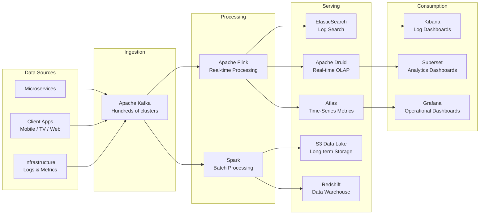
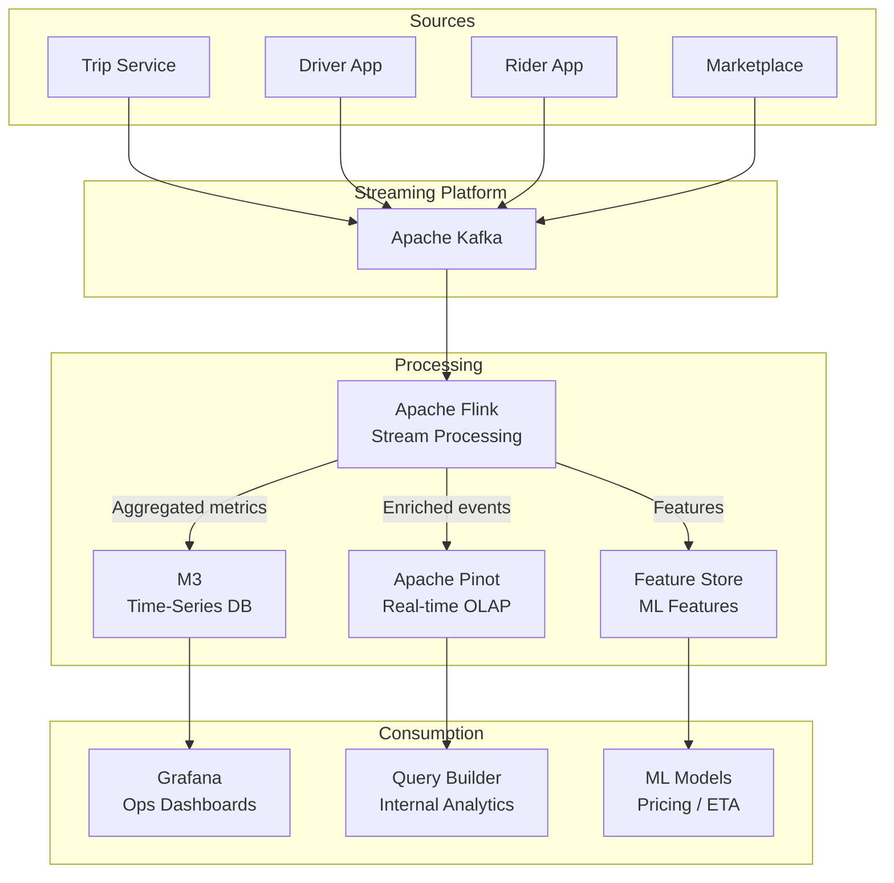
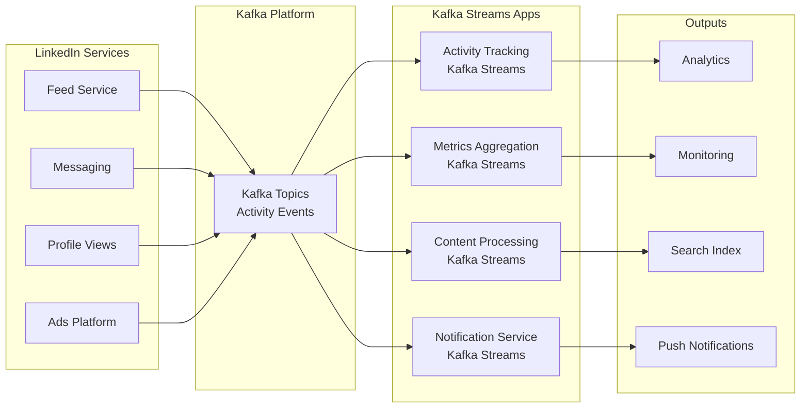
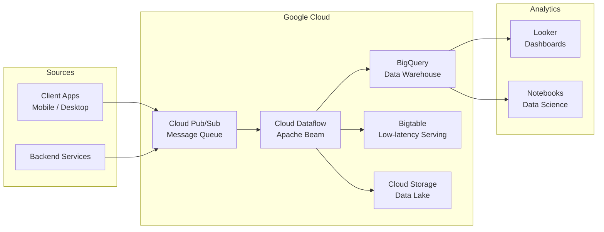
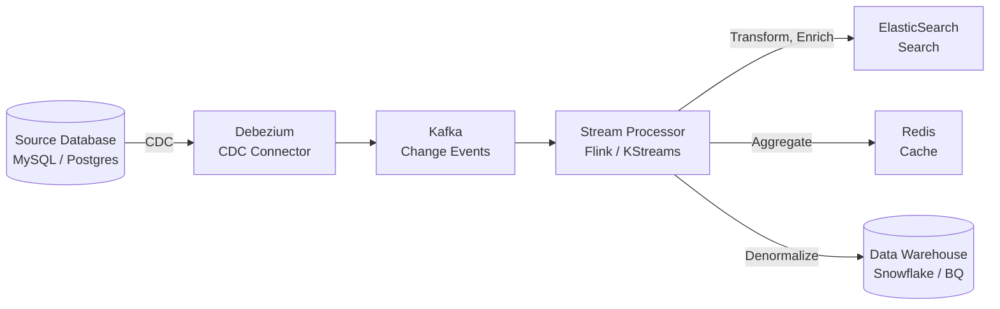
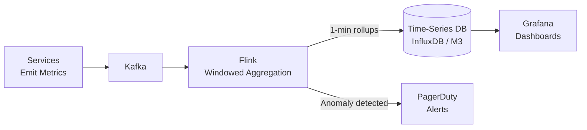
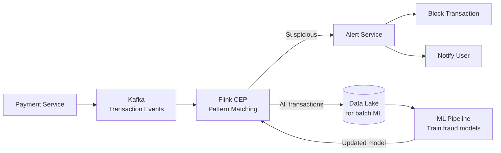
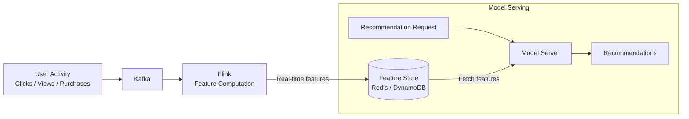
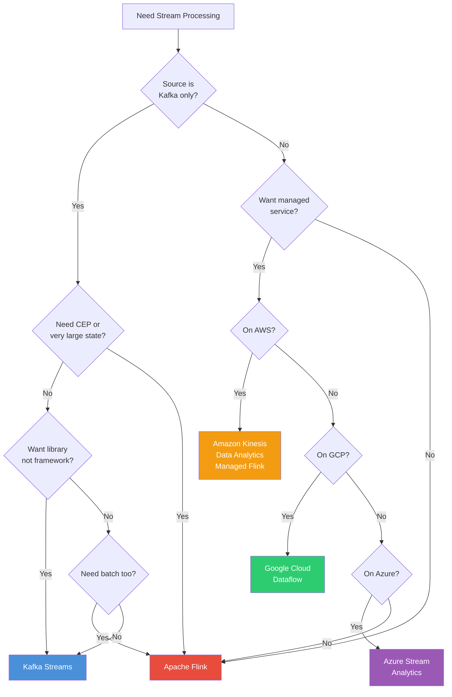

# Real-World Stream Processing Architectures

## Netflix Real-Time Data Pipeline

Netflix processes trillions of events per day across its streaming infrastructure.
Their Keystone pipeline is the backbone for real-time analytics, monitoring, and
operational intelligence.



### Key Design Decisions

- **Kafka as the central nervous system**: Every service emits events to Kafka. This
  decouples producers from consumers completely.
- **Flink for real-time path**: Sub-second analytics, anomaly detection, A/B test
  data processing. Flink's event-time processing handles Netflix's globally
  distributed events correctly.
- **Spark for batch path**: Heavy analytics, ML training, data warehouse loads.
  Batch jobs run on the same data via Kafka's long retention.
- **Multiple serving layers**: Each optimized for its query pattern (search, OLAP,
  time-series). No single database serves all needs.

### Scale Numbers

```
Events per day:       ~1 trillion+
Kafka clusters:       Hundreds
Kafka messages/sec:   Millions per second per cluster
Flink jobs:           Hundreds of streaming jobs
Data volume:          Petabytes per day ingested
```

---

## Uber Real-Time Analytics

Uber's real-time analytics platform powers dynamic pricing, ETA estimation,
marketplace health monitoring, and operational dashboards.



### Uber's Architecture Patterns

1. **CDC for database changes**: Debezium captures changes from MySQL/Postgres,
   publishes to Kafka. Flink processes these change streams.
2. **Feature engineering**: Flink computes real-time ML features (e.g., "number of
   available drivers in a 1km radius in the last 5 minutes"). These features feed
   directly into ML model serving.
3. **Apache Pinot**: Uber co-created Pinot specifically for real-time OLAP queries
   on streaming data. Supports both real-time ingestion from Kafka and batch from HDFS.

---

## LinkedIn Kafka Streams Usage

LinkedIn (the birthplace of Kafka) uses Kafka Streams extensively for activity
tracking, metrics, and content processing.



**Why Kafka Streams at LinkedIn**: LinkedIn's infrastructure is deeply Kafka-native.
Kafka Streams as a library embeds directly in their microservices without needing
a separate processing cluster. Each service owns its own stream processing logic.

---

## Spotify Event Delivery

Spotify uses Google Cloud's managed services for their streaming pipeline.



**Key insight**: Spotify chose managed services (Pub/Sub, Dataflow, BigQuery) over
self-managed Kafka + Flink. Trade-off: less control but zero operational burden.
For many organizations, this is the right choice.

---

## Common Stream Processing Patterns

### Pattern 1: Real-Time ETL (Change Data Capture)

The most common pattern. Capture changes from a source database, stream them through
a processor, and materialize into a destination optimized for queries.



```java
// Flink CDC example: capture MySQL changes, transform, write to ES
MySqlSource<String> mySqlSource = MySqlSource.<String>builder()
    .hostname("mysql-host")
    .port(3306)
    .databaseList("orders_db")
    .tableList("orders_db.orders")
    .username("cdc_user")
    .password("cdc_pass")
    .deserializer(new JsonDebeziumDeserializationSchema())
    .build();

DataStream<String> changes = env.fromSource(
    mySqlSource, WatermarkStrategy.noWatermarks(), "MySQL CDC");

changes
    .map(new ParseAndTransform())
    .sinkTo(elasticsearchSink);
```

### Pattern 2: Real-Time Dashboards

Aggregate streaming events into a time-series database, visualize with Grafana.



```java
// Flink: compute p99 latency per service per minute
events.keyBy(MetricEvent::getServiceName)
    .window(TumblingEventTimeWindows.of(Time.minutes(1)))
    .aggregate(new PercentileAggregate(99))
    .addSink(new InfluxDBSink());
```

### Pattern 3: Fraud Detection

Use CEP to detect suspicious patterns in real-time transaction streams.



```java
// Flink CEP: detect card used in two different countries within 1 hour
Pattern<Transaction, ?> fraudPattern = Pattern
    .<Transaction>begin("first")
        .where(new SimpleCondition<Transaction>() {
            public boolean filter(Transaction t) { return true; }
        })
    .followedBy("second")
        .where(new IterativeCondition<Transaction>() {
            public boolean filter(Transaction second, 
                                  Context<Transaction> ctx) {
                Transaction first = ctx.getEventsForPattern("first")
                    .iterator().next();
                return !second.getCountry().equals(first.getCountry());
            }
        })
    .within(Time.hours(1));
```

### Pattern 4: Real-Time Recommendations

Compute user features from event streams, serve them to ML models in real-time.



```java
// Flink: compute real-time user features
// Feature: "number of items viewed in category X in last 30 minutes"
events.keyBy(e -> e.getUserId() + ":" + e.getCategory())
    .window(SlidingEventTimeWindows.of(Time.minutes(30), Time.minutes(1)))
    .aggregate(new CountAggregate())
    .addSink(new RedisSink(redisConfig, new FeatureRedisMapper()));
```

---

## Choosing a Stream Processing Framework

### Decision Flowchart



### Quick Reference Table

| Scenario | Recommended | Why |
|---|---|---|
| Kafka in, Kafka out, moderate logic | **Kafka Streams** | Library, no cluster, Kafka-native |
| Complex patterns, large state, multi-source | **Apache Flink** | Most capable framework |
| Batch-first with some streaming | **Spark Structured Streaming** | Leverage existing Spark |
| AWS, want managed service | **Amazon Managed Flink** | Managed Flink, no ops |
| GCP, want managed service | **Google Dataflow** | Managed Beam, autoscaling |
| Azure, want managed service | **Azure Stream Analytics** | SQL-first, managed |
| Simple routing/filtering only | **Kafka Streams** or even **Kafka Connect** | Keep it simple |
| Team knows only SQL | **ksqlDB** or **Flink SQL** | SQL on streams |

---

## Interview Questions with Answers

### Q1: How would you design a real-time fraud detection system?

**Answer structure:**

1. **Ingestion**: All transactions flow into Kafka (partitioned by card_id for ordering).
2. **Stream processing**: Flink consumes from Kafka, applies rules and ML scoring:
   - Rule-based: Flink CEP patterns (e.g., same card in two countries within 1 hour)
   - ML-based: Flink enriches transactions with features from feature store,
     calls ML model service for scoring
3. **Decision**: Score above threshold triggers alert. Two paths:
   - Synchronous: Block the transaction (requires sub-100ms latency)
   - Asynchronous: Flag for manual review
4. **State**: Flink maintains per-card state (recent transactions, velocity counters)
   using RocksDB state backend with incremental checkpoints.
5. **Exactly-once**: Critical for financial data. Flink checkpointing ensures no
   transaction is scored twice or skipped.
6. **Late data**: Allowed lateness window. Very late events go to dead letter queue
   for batch reconciliation.

### Q2: Explain the trade-offs between Kafka Streams and Flink.

**Answer:**

Kafka Streams is a library you embed in your application. No separate cluster.
Operationally simple -- deploy like any JVM app. But limited: Kafka-only sources,
state bound by local disk, no CEP, simpler windowing.

Flink is a full distributed framework. Separate cluster with JobManager and
TaskManagers. Operationally complex but far more powerful: any source/sink,
terabytes of state with incremental checkpointing, CEP pattern matching,
sophisticated watermark strategies, unified batch+stream.

**Choose Kafka Streams when**: source is Kafka, logic is moderate, you want simplicity.
**Choose Flink when**: you need CEP, very large state, multi-source, or a central
platform for your organization.

### Q3: How do watermarks handle late data in stream processing?

**Answer:**

A watermark is the system's assertion that "all events with event-time <= W have
arrived." When the watermark passes a window's end time, that window can fire.

In practice, watermarks are heuristic -- they are estimates based on observed
event timestamps. Late events (arriving after the watermark) are handled by:

1. **Allowed lateness**: Keep the window open for additional time. Late events
   update the window's result.
2. **Side outputs**: Events arriving after allowed lateness are sent to a side
   output (dead letter queue) for separate handling.
3. **Accumulating mode**: Each time a late event triggers a window update,
   the full updated result is emitted.

The trade-off is correctness vs resource usage: more allowed lateness means more
correct results but more memory for keeping windows alive.

### Q4: Design a real-time dashboard showing "orders per minute" with < 5 second delay.

**Answer:**

```
Order Service -> Kafka (orders topic) -> Flink -> InfluxDB -> Grafana

Flink job:
1. Consume from Kafka with event-time watermarks (5-second bounded out-of-orderness)
2. KeyBy(region) to get per-region counts
3. Tumbling window of 1 minute
4. Trigger: early firing every 5 seconds (speculative) + on-time at watermark
5. Accumulating mode (latest value replaces previous)
6. Sink to InfluxDB with tags (region, window_start)

Grafana: Query InfluxDB, auto-refresh every 5 seconds, show per-region order rates
```

The early trigger gives you speculative results within 5 seconds. The on-time
trigger corrects any inaccuracies once the watermark passes. Allowed lateness of
2 minutes handles stragglers, and Grafana always shows the latest value.

### Q5: What is the difference between Lambda and Kappa architecture?

**Answer:**

Lambda has three layers: batch (reprocess all data periodically for correctness),
speed (process recent data in real-time for low latency), and serving (merge both
views). Downside: two codebases, two systems, potential semantic mismatches.

Kappa uses only stream processing. Kafka retains data long-term. To reprocess,
deploy a new version of the stream processor and replay from the beginning of the
Kafka log. One codebase, one system, one set of semantics.

Kappa is winning because: (1) Kafka tiered storage makes long retention affordable,
(2) Flink can process both bounded and unbounded data, (3) one codebase is always
easier to maintain. However, Lambda still has a role when batch-specific frameworks
(Spark for ML training on petabytes of data) are genuinely superior for the workload.

### Q6: How does Flink achieve exactly-once processing?

**Answer:**

Flink uses the Chandy-Lamport distributed snapshot algorithm. The JobManager
periodically injects checkpoint barriers into the data stream. These barriers
flow through the DAG like regular events. When an operator receives barriers
from all its inputs, it snapshots its state to durable storage (S3/HDFS).

This gives a consistent snapshot: the state of every operator at a logically
consistent point in the stream. On failure, Flink restores state from the
last successful checkpoint, rewinds sources to the checkpointed offsets, and
replays. Combined with idempotent sinks (or two-phase commit sinks), this
achieves exactly-once end-to-end semantics.

Key mechanisms: barrier alignment (or unaligned checkpoints for speed),
incremental checkpointing for large state, and checkpoint coordination by
the JobManager.

### Q7: You have a Kafka topic with 10M events/sec. How would you process it in real-time?

**Answer:**

1. **Kafka partitioning**: Ensure the topic has enough partitions (e.g., 256+) for
   parallelism. Partition by a key that distributes load evenly.
2. **Flink cluster sizing**: Set parallelism equal to partition count. Each parallel
   subtask reads from one or more Kafka partitions. With 256 partitions and 16
   TaskManagers with 16 slots each, you get 256 parallel readers.
3. **State backend**: RocksDB with incremental checkpointing. Tune RocksDB block
   cache, write buffer sizes for your state access pattern.
4. **Network**: Ensure sufficient network bandwidth. 10M events/sec at 1KB each =
   10 GB/sec. Need fast networking between Kafka and Flink cluster.
5. **Backpressure handling**: Monitor backpressure metrics. If processors are slow,
   scale out or optimize the processing logic.
6. **Checkpointing**: Unaligned checkpoints for lower checkpoint latency at high
   throughput. Checkpoint interval tuned so checkpoints complete before the next
   one starts.
7. **Sink considerations**: Ensure the sink can handle the throughput. Batch writes,
   async I/O, or buffering before writing to the sink.

---

## Architecture Anti-Patterns

| Anti-Pattern | Problem | Fix |
|---|---|---|
| **Processing-time-only** | Results change depending on system load | Use event time with watermarks |
| **No dead letter queue** | Poison pills crash the pipeline | DLQ for malformed/unprocessable events |
| **Unbounded state** | State grows forever, OOM | State TTL, windowed state, periodic cleanup |
| **Synchronous external calls** | Each event blocks on HTTP call, kills throughput | Flink AsyncIO or batch external lookups |
| **No backpressure handling** | Slow consumer drops events | Use Kafka (built-in backpressure) + monitor lag |
| **Checkpoint to same storage as state** | Checkpoint corrupts with state | Separate durable storage (S3) for checkpoints |
| **No idempotent sinks** | Replayed events cause duplicates | Upsert with event ID, or transactional sinks |
| **Ignoring late data** | Silent data loss | Allowed lateness + side outputs |
| **Over-partitioning** | Too many small tasks, scheduling overhead | Match partitions to actual parallelism needed |
| **Under-testing** | Works in dev, breaks in prod | Use Flink MiniCluster / Kafka Streams TopologyTestDriver for unit tests |
