# Decomposition and Migration Patterns

## Overview

Breaking a monolith into microservices -- or designing a greenfield microservices
architecture -- requires disciplined decomposition. This document covers how to
split services, how to migrate incrementally, how to handle the database problem,
and the anti-patterns that turn microservices into a distributed monolith.

---

## 1. Decomposition Strategies

The fundamental question: **where do you draw the service boundary?**

### 1.1 By Business Capability

Align each service with a **business function** -- something the business does
to generate value.

| Business Capability    | Service               | Responsibilities                          |
|------------------------|-----------------------|-------------------------------------------|
| Order Management       | Order Service         | Create, track, cancel orders              |
| Payment Processing     | Payment Service       | Charge, refund, invoicing                 |
| Inventory Management   | Inventory Service     | Stock levels, reservations, replenishment |
| Shipping & Fulfillment | Shipping Service      | Carrier selection, tracking, delivery     |
| Customer Management    | Customer Service      | Profiles, preferences, loyalty            |

**Advantages**: Stable boundaries (business capabilities change slowly), clear ownership,
teams organized by business function.

**Risk**: Business capabilities can be ambiguous -- "does pricing belong to Product
or to Order?"

### 1.2 By Subdomain (DDD Bounded Contexts)

Use Domain-Driven Design: identify **bounded contexts** and make each one a service.
A bounded context is a boundary within which a domain model has a specific, consistent
meaning.

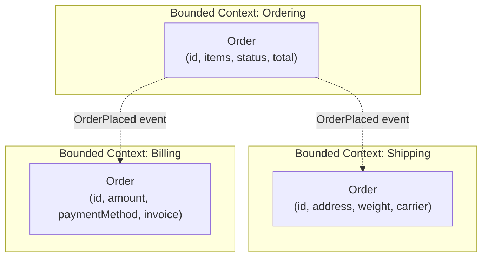

**Key insight**: The concept of "Order" means different things in each context.
In Ordering, it is items and a total. In Shipping, it is a weight and destination.
In Billing, it is an amount and invoice. **These are different models, not the same
entity shared across services.**

> **Deep dive on DDD**: See `03-advanced/10-ddd/`

**Advantages**: Well-defined boundaries with clear data ownership, naturally low coupling.
**Risk**: Requires DDD expertise; incorrect boundaries create excessive cross-service calls.

### 1.3 By Verb / Use Case

Each significant operation becomes a service.

| Use Case                | Service                    |
|-------------------------|----------------------------|
| Place Order             | OrderPlacementService      |
| Process Payment         | PaymentProcessingService   |
| Send Notification       | NotificationService        |
| Generate Report         | ReportingService           |

**Advantages**: Simple to reason about, clear single responsibility.
**Risk**: Can lead to **nano-services** (too fine-grained). If PlaceOrder always
calls ValidateOrder, ProcessPayment, and ReserveInventory in sequence, you have
created a distributed monolith with extra network hops.

### Comparison

| Strategy             | Boundary Source          | Stability    | Risk                        |
|----------------------|--------------------------|-------------|------------------------------|
| Business Capability  | What the business does   | High        | Ambiguous capability boundaries |
| Subdomain (DDD)      | Bounded contexts         | High        | Requires DDD expertise       |
| Verb / Use Case      | What the system does     | Medium      | Nano-services, tight coupling |

**Recommendation**: Start with business capabilities, refine using DDD bounded
contexts. Avoid pure verb decomposition for core services.

---

## 2. Strangler Fig Pattern

### What

A migration strategy where you **incrementally replace** parts of a monolith with
new microservices, rather than rewriting everything at once. Named after the
strangler fig tree, which grows around a host tree, eventually replacing it entirely.

### Why

Big-bang rewrites fail. They take years, requirements drift, and the old system
keeps changing. The Strangler Fig lets you migrate piece by piece, with the old
and new systems running side by side.

### Three Phases

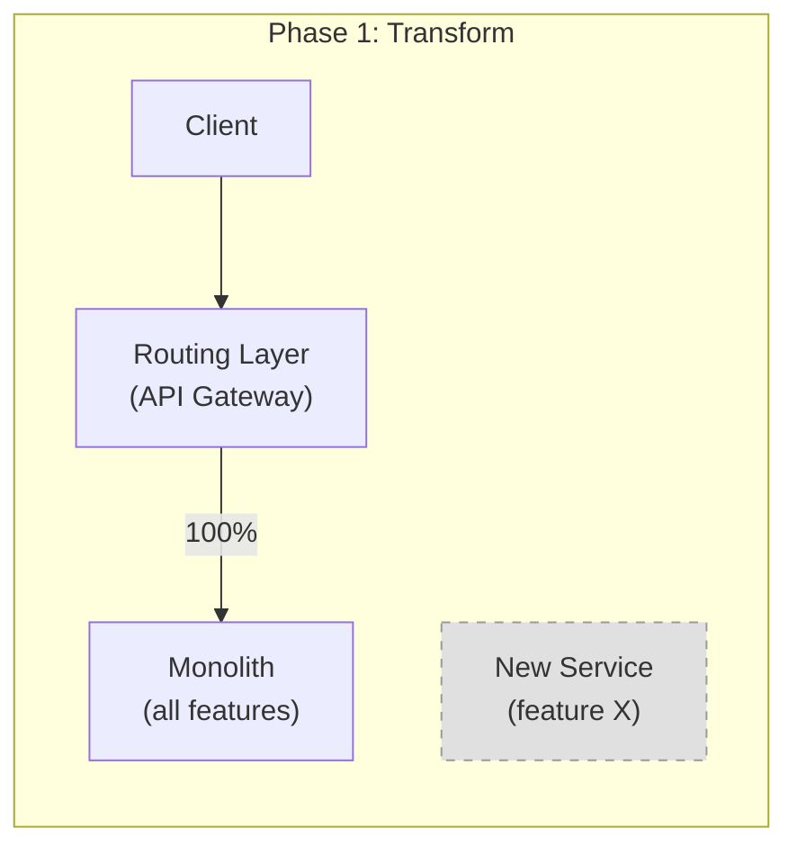

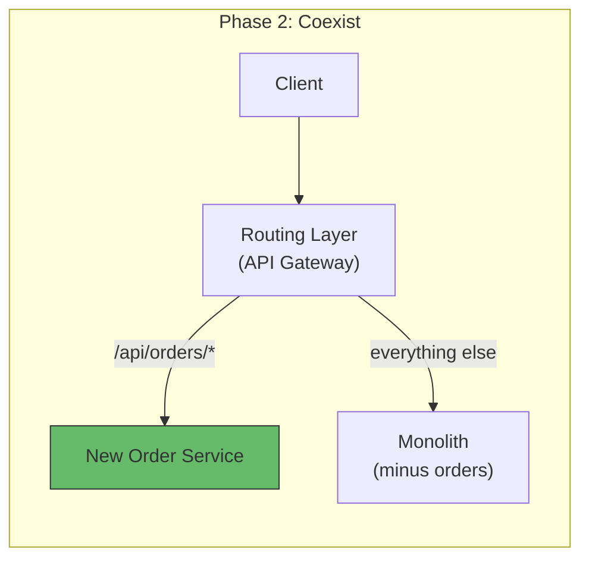

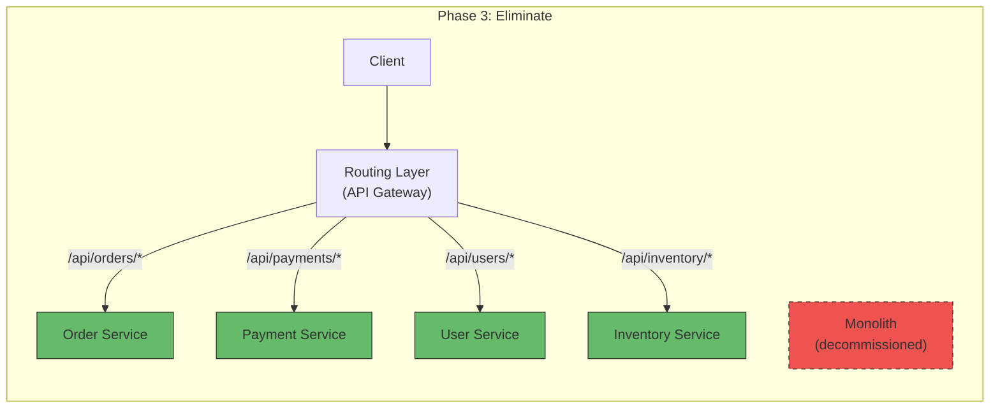

### Detailed Migration Flow

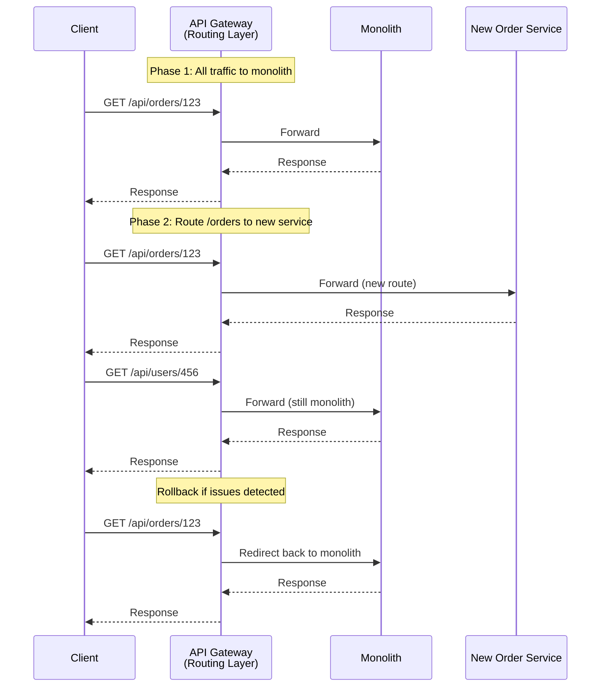

### Implementation Checklist

1. **Introduce a routing layer** (API Gateway or reverse proxy) in front of the monolith.
2. **Pick a seam** -- a bounded context or feature with clear boundaries and few
   dependencies on monolith internals.
3. **Build the new service** alongside the monolith.
4. **Route traffic** for that feature to the new service via the gateway.
5. **Run both** -- verify correctness, monitor error rates.
6. **Retire monolith code** for that feature once confident.
7. **Repeat** for the next feature.

---

## 3. Anti-Corruption Layer (ACL)

### What

A translation layer between the old system (monolith) and the new system
(microservice) that prevents the old model from "corrupting" the new domain model.

### Why

During migration, the new service often needs data from the monolith. The monolith's
data model is messy (years of accumulated tech debt, mixed concerns). The ACL translates
between old and new models so the new service has a clean domain model.

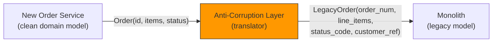

**Example**: The monolith stores order status as integer codes (1=pending, 2=shipped,
3=cancelled). The new service uses an enum (PENDING, SHIPPED, CANCELLED). The ACL
translates between them.

```java
// Anti-Corruption Layer: translate legacy model to clean model
public class OrderACL {
    private final LegacyOrderClient legacyClient;

    public Order getOrder(String orderId) {
        LegacyOrder legacy = legacyClient.fetchOrder(orderId);
        return Order.builder()
            .id(orderId)
            .status(mapStatus(legacy.getStatusCode()))
            .items(legacy.getLineItems().stream()
                .map(this::mapItem)
                .collect(toList()))
            .total(calculateTotal(legacy.getLineItems()))
            .build();
    }

    private OrderStatus mapStatus(int code) {
        return switch (code) {
            case 1 -> OrderStatus.PENDING;
            case 2 -> OrderStatus.SHIPPED;
            case 3 -> OrderStatus.CANCELLED;
            default -> throw new UnknownStatusException(code);
        };
    }
}
```

---

## 4. Database Decomposition

The hardest part of microservices migration: **splitting the shared database**.

### The Problem

In a monolith, all modules share one database. When you extract a service, it still
needs access to data that remains in the monolith's database.

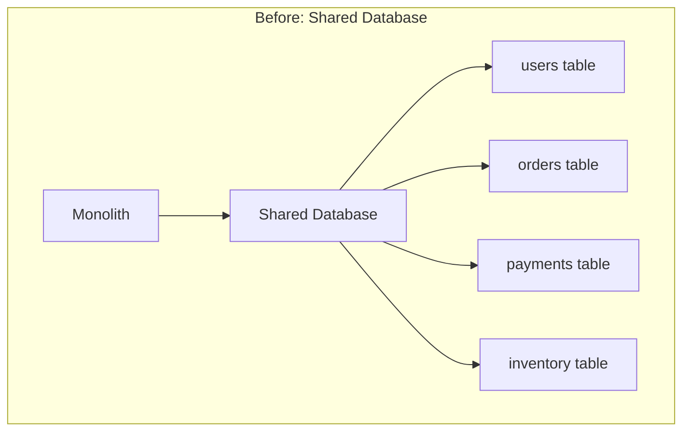

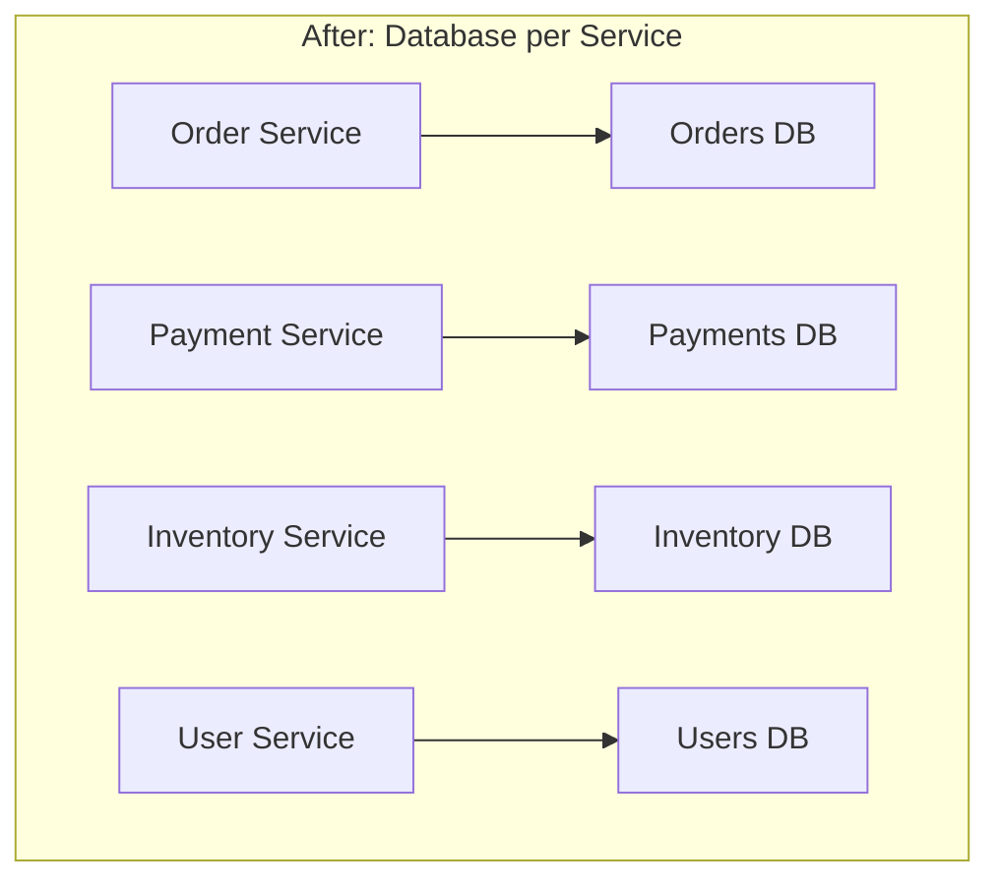

### Migration Strategies

#### Strategy 1: Schema Split

Split the monolith's database into logical schemas first, then physically separate.

```
Step 1: Assign each table to a service (logical ownership)
Step 2: Create schema boundaries (remove cross-schema JOINs)
Step 3: Replace JOINs with API calls or events
Step 4: Move schemas to separate databases
```

#### Strategy 2: CDC for Data Sync

Use Change Data Capture to replicate data from the monolith's DB to the new
service's DB during the transition period.

> **Deep dive**: See `02-core-system-design/05-distributed-transactions/outbox-and-cdc.md`

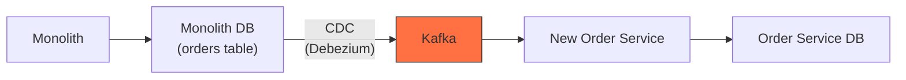

#### Strategy 3: Event-Driven Migration

The new service publishes events for its writes. The monolith subscribes to stay
in sync during the transition. Once migration is complete, the monolith stops
subscribing.

### Handling JOINs After Split

Before (monolith):
```sql
SELECT o.id, o.total, u.name, u.email
FROM orders o JOIN users u ON o.user_id = u.id
WHERE o.id = 123;
```

After (microservices -- no cross-service JOINs):
```java
// Option 1: API composition (synchronous)
Order order = orderService.getOrder(123);
User user = userService.getUser(order.getUserId());
return new OrderWithUser(order, user);

// Option 2: Denormalize (async, via events)
// Order Service stores user_name and user_email locally,
// updated via UserUpdated events from User Service.
```

---

## 5. Feature Flags for Gradual Rollout

During migration, use feature flags to control which code path is active.

```java
if (featureFlags.isEnabled("use-new-order-service")) {
    // Call new microservice
    return orderServiceClient.getOrder(orderId);
} else {
    // Call monolith's internal module
    return legacyOrderModule.getOrder(orderId);
}
```

**Benefits**:
- **Instant rollback**: Flip the flag, not a deployment.
- **Gradual rollout**: Enable for 5% of users, then 25%, then 100%.
- **A/B comparison**: Run both paths, compare results (shadow mode).

**Tools**: LaunchDarkly, Unleash, Flagsmith, simple config-based toggles.

---

## 6. Anti-Patterns

### 6.1 Distributed Monolith

**What**: Services that are deployed independently in name, but in practice must be
deployed together, share a database, or cannot function without synchronous calls
to each other.

**Symptoms**:
- Changing Service A requires coordinated changes in Services B and C.
- Services share database tables.
- A single service being down causes widespread failure.
- You need to deploy services in a specific order.

**Root cause**: Service boundaries drawn along technical layers (UI service, business
logic service, data access service) instead of business domains.

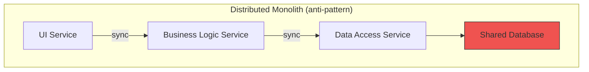

**Fix**: Redefine boundaries by business capability. Each service owns its data
and can function (in degraded mode) when dependencies are unavailable.

### 6.2 Nano-Services

**What**: Services that are too small, doing one tiny operation each.

**Symptoms**:
- A single user request traverses 10+ services.
- Network latency dominates processing time.
- Each service has more infrastructure boilerplate than business logic.
- A simple change requires updating 5 services.

**Example**: Separate services for ValidateEmail, ValidateAddress, ValidatePhone
instead of a single Validation or User service.

**Fix**: Merge related nano-services back into a cohesive service. A microservice
should be "micro" enough to be owned by one team, not so micro that it has no
meaningful business logic.

### 6.3 Shared Library Coupling

**What**: Services that share a common library containing domain logic, entities, or
DTOs. When the shared library changes, all dependent services must be redeployed.

**Symptoms**:
- A change to `common-models.jar` triggers rebuilds of 15 services.
- The shared library grows into a "god library" with everything in it.
- Services are locked to the same language/framework.

**Fix**: Shared libraries should contain only **infrastructure utilities** (logging,
metrics, serialization helpers) -- never domain models. Each service defines its own
models. Use events/APIs to share data, not shared code.

---

## 7. When Microservices Are Wrong: The Segment Story

In 2017, Segment (customer data platform) made the decision to move **back from
microservices to a monolith**.

**What happened**:
- They had 120+ microservices for handling customer data destinations (one service
  per integration: Google Analytics, Mixpanel, Amplitude, etc.).
- Each service had identical structure: receive event, transform, send to destination.
- Maintaining 120+ copies of similar infrastructure (queues, retry logic, monitoring)
  created enormous operational burden.
- A single engineer could manage the monolith version; the microservices version
  required a platform team.

**Lesson**: Microservices are justified when services have **different scaling needs,
different release cadences, and different domain logic**. When 120 services share
the same structure and differ only in a configuration file, a monolith with a
plugin architecture is the right answer.

### When Microservices Make Sense vs When They Do Not

| Microservices make sense when...          | Microservices are overkill when...         |
|-------------------------------------------|--------------------------------------------|
| Services have different scaling needs     | All components scale the same way          |
| Teams need independent deployment         | One team owns everything                   |
| Domain complexity justifies boundaries    | Business logic is simple / uniform         |
| Different tech stacks are truly needed    | One language/framework suffices            |
| Organization is large (50+ engineers)     | Small team (< 10 engineers)                |

---

## 8. Conway's Law

> "Organizations which design systems are constrained to produce designs which
> are copies of the communication structures of these organizations."
> -- Melvin Conway, 1967

### What It Means

Your system architecture will mirror your org chart. If you have a Frontend team,
Backend team, and Database team, you will get a three-tier architecture. If you
have cross-functional teams organized by business domain (Order team, Payment team),
you will get microservices organized by domain.

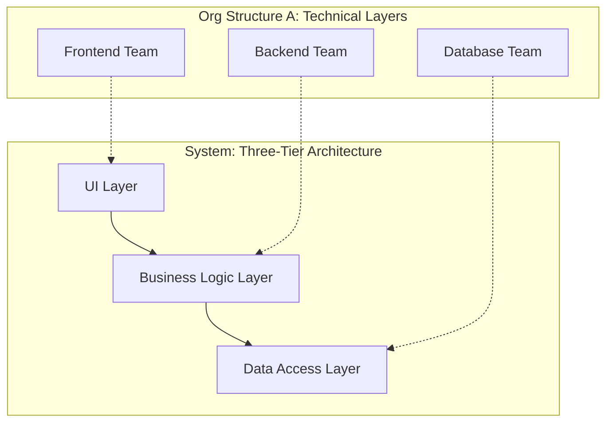

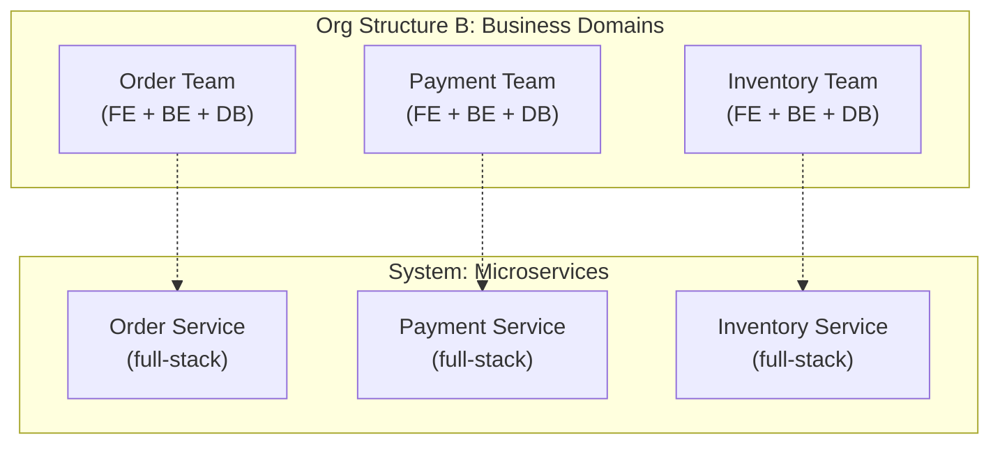

### Inverse Conway Maneuver

If you want a microservices architecture, **reorganize your teams first** to match
the desired architecture. The system will follow.

**Amazon's "two-pizza teams"**: Each team (small enough to be fed by two pizzas)
owns a service end-to-end. This organizational structure *drives* the microservices
architecture, not the other way around.

---

## 9. Interview Questions

**Q1: How would you decompose a monolithic e-commerce application into microservices?**
Start by identifying bounded contexts using DDD: Orders, Payments, Inventory,
Shipping, Users, Catalog, Notifications. Each bounded context becomes a service
with its own database. Use the Strangler Fig pattern to migrate incrementally --
start with the domain that changes most frequently or has the most distinct scaling
needs (often Orders or Catalog).

**Q2: What is the Strangler Fig pattern, and how does the routing layer work?**
Place an API Gateway in front of the monolith. For each migrated feature, add a
routing rule that sends traffic to the new microservice instead of the monolith.
The monolith and microservices coexist. Once all routes are migrated, decommission
the monolith. The gateway enables instant rollback by switching routes.

**Q3: How do you handle database JOINs after splitting into microservices?**
Two approaches: (1) API composition -- the calling service fetches from multiple
services and merges in memory. (2) Denormalization via events -- subscribe to domain
events and maintain a local read model with the needed data. Choose API composition
for simple cases, denormalization for high-read-throughput scenarios.

**Q4: What is a distributed monolith, and how do you avoid it?**
A distributed monolith has microservice boundaries but monolith coupling: shared
databases, coordinated deployments, synchronous dependency chains. Avoid it by
drawing boundaries along business domains (not technical layers), giving each
service its own database, and using async communication (events) instead of
synchronous chains.

**Q5: When should you NOT use microservices?**
When your team is small (< 10 engineers), domain complexity is low, all components
have the same scaling needs, or the services would share identical structure
(Segment's 120-identical-services story). A well-structured monolith or modular
monolith is often the right starting point.

**Q6: Explain Conway's Law and how it applies to microservices.**
Conway's Law states that system architecture mirrors organizational structure. To
build microservices effectively, organize teams by business domain (cross-functional
"two-pizza" teams), not by technical layer. Each team owns their service end-to-end.
The inverse Conway maneuver: reshape the org to get the architecture you want.

**Q7: What is an Anti-Corruption Layer, and when do you need one?**
An ACL is a translation layer between a legacy system and a new service. It prevents
the legacy data model from "corrupting" the new clean domain model. You need it
during migration when the new service must read/write data in the monolith's
database or API, which has a different (often messier) model.

---

## 10. Key Takeaways

1. **Decompose by business capability or DDD bounded context** -- not by technical
   layer, not by verb.
2. **Strangler Fig** is the safest migration strategy: build alongside, route
   incrementally, retire gradually.
3. **Database decomposition is the hardest part** -- use schema split, CDC, or
   event-driven sync. Eliminate cross-service JOINs.
4. **Anti-Corruption Layer** protects new services from legacy model contamination.
5. **Feature flags** enable safe, gradual migration with instant rollback.
6. **Avoid distributed monoliths** (shared DB, coordinated deploys) and
   **nano-services** (too fine-grained, excessive overhead).
7. **Conway's Law is real** -- if you want microservices, organize your teams by
   business domain first.
8. **Microservices are not always the answer** -- a modular monolith is often
   simpler and sufficient for smaller teams.
