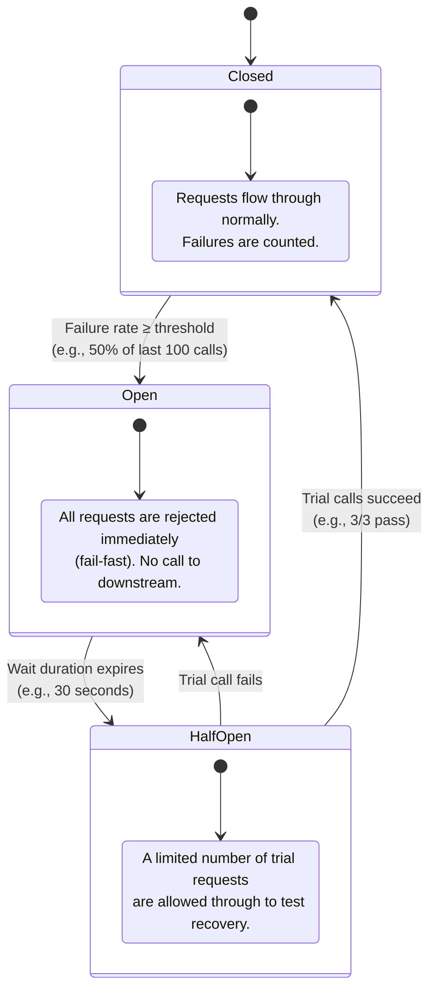
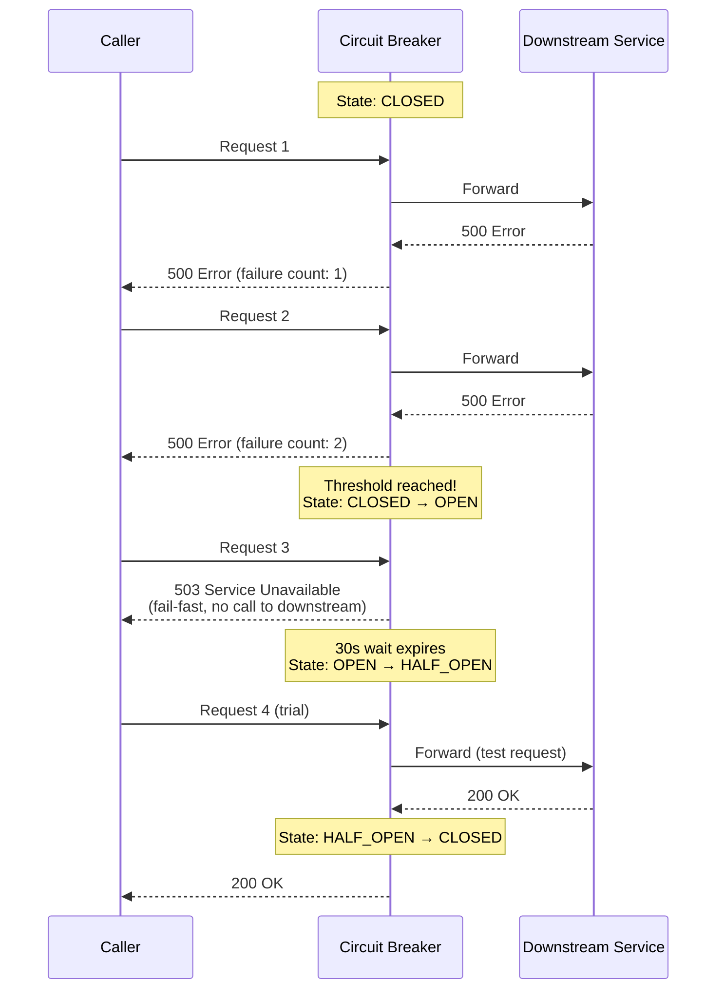
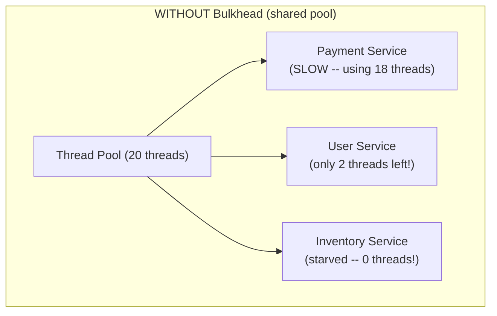
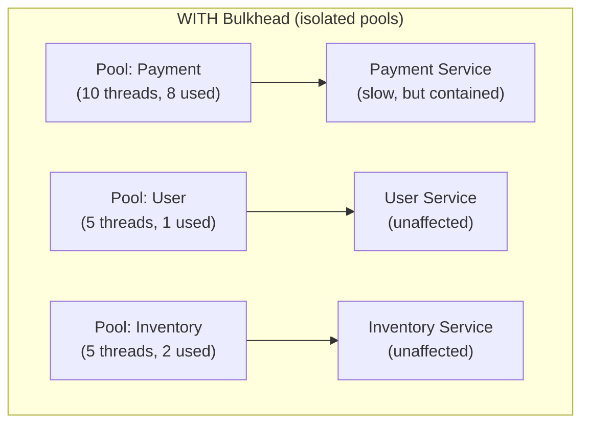
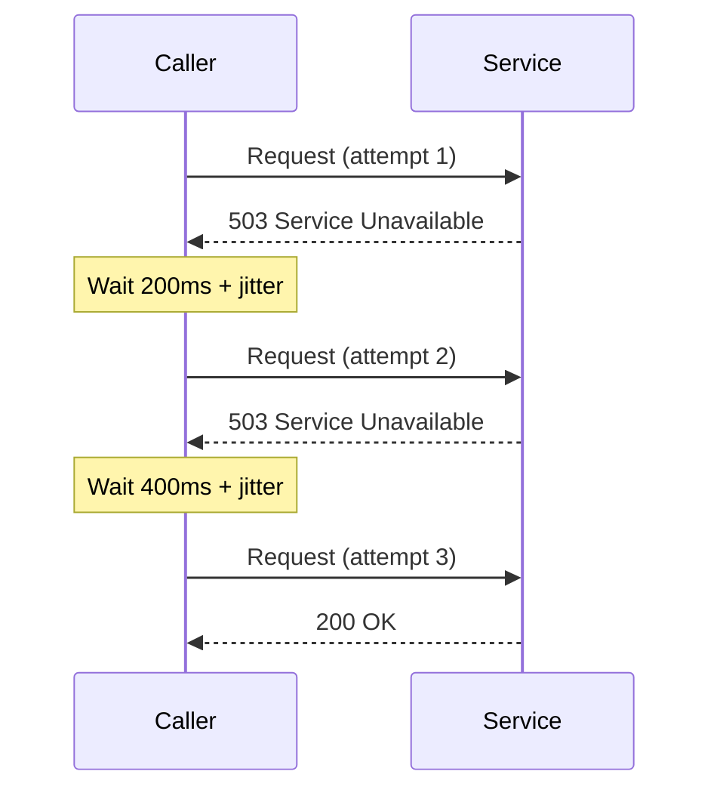
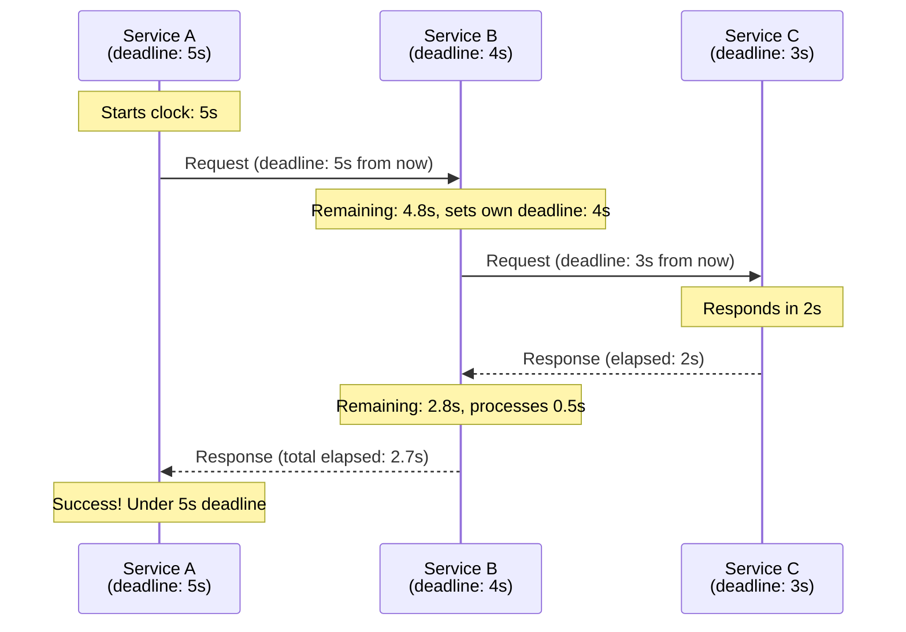
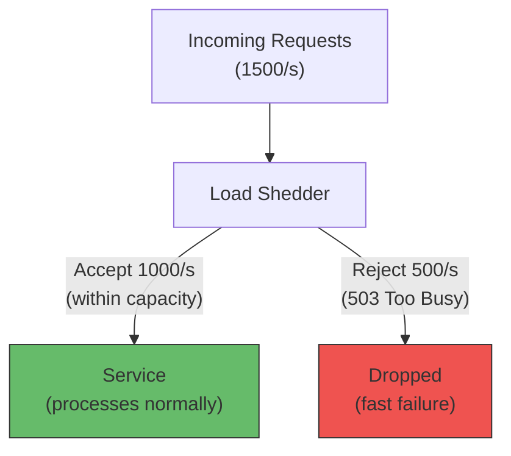
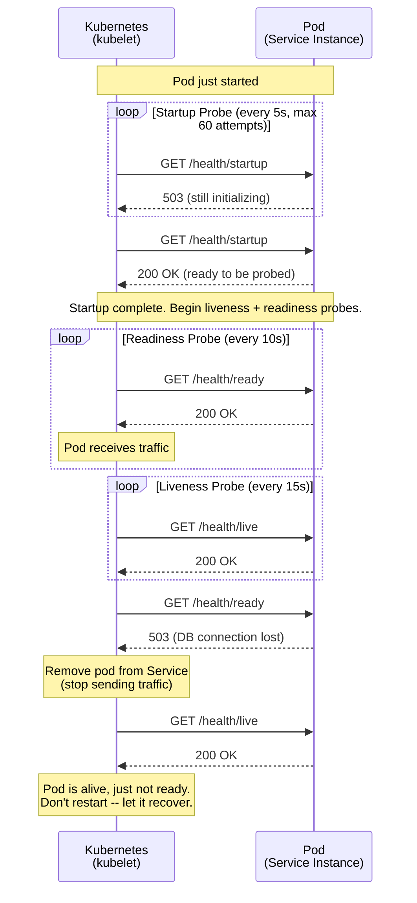
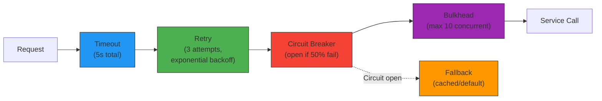

# Resilience Patterns

## Overview

In a distributed system, **failure is not a possibility -- it is a certainty**. Networks
partition, services crash, databases become slow, and dependencies become unavailable.
Resilience patterns are defensive techniques that allow a system to **continue
operating** (possibly in a degraded mode) when parts of it fail.

This document covers eight essential resilience patterns, each with: what it is,
why it matters, how it works, a Mermaid diagram, code examples, and real-world usage.

---

## 1. Circuit Breaker

### What

A proxy that monitors calls to a downstream service and **stops sending requests**
when the failure rate exceeds a threshold. Named after the electrical circuit breaker
that prevents a house fire by cutting power.

### Why

Without a circuit breaker, a slow/failing downstream service causes:
- Thread/connection pool exhaustion in the caller.
- Cascading failures across the entire call chain.
- User-visible latency spikes (waiting for timeouts on every request).

### How: Three States



### Sequence Flow



### Code Example (Resilience4j -- Java)

```java
// Configuration
CircuitBreakerConfig config = CircuitBreakerConfig.custom()
    .failureRateThreshold(50)           // Open when 50% of calls fail
    .slidingWindowSize(100)             // Evaluate last 100 calls
    .waitDurationInOpenState(Duration.ofSeconds(30))  // Wait before half-open
    .permittedNumberOfCallsInHalfOpenState(3)         // 3 trial calls
    .slowCallRateThreshold(80)          // Also open if 80% are slow
    .slowCallDurationThreshold(Duration.ofSeconds(2)) // "Slow" = > 2s
    .build();

CircuitBreaker circuitBreaker = CircuitBreaker.of("paymentService", config);

// Usage with decorator pattern
Supplier<PaymentResponse> decoratedCall = CircuitBreaker
    .decorateSupplier(circuitBreaker, () -> paymentService.charge(order));

Try<PaymentResponse> result = Try.ofSupplier(decoratedCall)
    .recover(CallNotPermittedException.class,
             ex -> PaymentResponse.fallback("Circuit open -- try later"));
```

### Real-World

- **Netflix**: Invented Hystrix (now deprecated) for circuit breaking across
  hundreds of microservices. A single slow recommendation service could take
  down the entire streaming platform without it.
- **Uber**: Uses circuit breakers between ride-matching and payment services
  to prevent payment slowdowns from blocking ride requests.

---

## 2. Bulkhead

### What

Isolate different parts of a system into **compartments** so that a failure in one
does not exhaust resources in another. Named after the watertight compartments in
a ship's hull.

### Why (The Titanic Analogy)

The Titanic had bulkheads, but they did not extend high enough. Water overflowed
from one compartment to the next, sinking the entire ship. In software: if all
service calls share a single thread pool, one slow dependency drains the pool,
starving all other calls.

### How: Two Approaches

| Type                  | Mechanism                                     | Overhead   |
|-----------------------|-----------------------------------------------|------------|
| **Thread pool bulkhead** | Each dependency gets its own thread pool with a fixed size. | Higher (thread context switching) |
| **Semaphore bulkhead**   | Each dependency gets a semaphore (counter) limiting concurrent calls. | Lower (no extra threads) |





### Code Example (Resilience4j)

```java
// Thread Pool Bulkhead
ThreadPoolBulkheadConfig poolConfig = ThreadPoolBulkheadConfig.custom()
    .maxThreadPoolSize(10)          // Max 10 threads for this dependency
    .coreThreadPoolSize(5)          // Keep 5 alive
    .queueCapacity(20)              // Queue up to 20 overflow requests
    .keepAliveDuration(Duration.ofMillis(100))
    .build();

ThreadPoolBulkhead bulkhead = ThreadPoolBulkhead.of("paymentPool", poolConfig);

CompletionStage<PaymentResponse> result = bulkhead.executeCompletionStage(
    () -> CompletableFuture.supplyAsync(() -> paymentService.charge(order))
);

// Semaphore Bulkhead (lighter weight)
BulkheadConfig semConfig = BulkheadConfig.custom()
    .maxConcurrentCalls(15)         // Max 15 concurrent calls
    .maxWaitDuration(Duration.ofMillis(500))  // Wait up to 500ms for a permit
    .build();

Bulkhead semBulkhead = Bulkhead.of("inventoryBulkhead", semConfig);

Supplier<InventoryResponse> decorated = Bulkhead
    .decorateSupplier(semBulkhead, () -> inventoryService.check(itemId));
```

### Real-World

- **Amazon**: Each AWS service uses bulkheads to prevent one customer's blast
  radius from affecting others (cell-based architecture).
- **Netflix**: Hystrix thread pools were effectively bulkheads -- each downstream
  service had its own isolated pool.

---

## 3. Retry with Exponential Backoff

### What

Automatically retry a failed request, waiting progressively longer between attempts.
Add **jitter** (randomness) to prevent thundering herd when many clients retry
simultaneously.

### Why

Many failures are **transient**: a brief network blip, a momentary overload, a
connection reset. A single retry often succeeds. Without backoff, aggressive retries
can DDoS your own downstream service.

### How

**Exponential Backoff Formula**:
```
wait_time = min(base_delay * 2^attempt + random_jitter, max_delay)
```

Example with `base_delay = 100ms`, `max_delay = 10s`:

| Attempt | Base Wait | With Jitter (example) | Cumulative |
|---------|-----------|----------------------|------------|
| 1       | 200ms     | 237ms                | 237ms      |
| 2       | 400ms     | 451ms                | 688ms      |
| 3       | 800ms     | 823ms                | 1.51s      |
| 4       | 1600ms    | 1742ms               | 3.25s      |
| 5       | 3200ms    | 3089ms               | 6.34s      |



### Critical Requirement: Idempotency

Retries are **only safe** for idempotent operations. If charging a credit card is
not idempotent, a retry could double-charge the customer.

| Operation       | Idempotent? | Safe to Retry?        |
|-----------------|-------------|------------------------|
| GET /user/123   | Yes         | Always                 |
| PUT /user/123   | Yes         | Always (full replace)  |
| DELETE /order/5 | Yes         | Always                 |
| POST /payments  | **No**      | Only with idempotency key |

**Idempotency key pattern**: Client generates a unique key (UUID) per logical
operation. Server deduplicates by this key.

### Retry Budget

To avoid retry storms: set a **retry budget** -- the percentage of total traffic
that can be retries (e.g., max 20% of requests can be retries). If the retry budget
is exhausted, stop retrying and fail fast.

### Code Example (Resilience4j)

```java
RetryConfig config = RetryConfig.custom()
    .maxAttempts(4)                              // 1 initial + 3 retries
    .waitDuration(Duration.ofMillis(200))        // Base wait
    .intervalFunction(IntervalFunction
        .ofExponentialRandomBackoff(
            Duration.ofMillis(200),              // Initial interval
            2.0,                                 // Multiplier
            Duration.ofSeconds(10)               // Max interval
        ))
    .retryOnResult(response -> response.getStatusCode() == 503)
    .retryOnException(e -> e instanceof IOException)
    .ignoreExceptions(BusinessException.class)   // Don't retry business errors
    .build();

Retry retry = Retry.of("paymentRetry", config);

Supplier<PaymentResponse> retryableCall = Retry
    .decorateSupplier(retry, () -> paymentService.charge(order));
```

### Real-World

- **AWS SDK**: All AWS SDKs implement exponential backoff with jitter by default.
- **Google Cloud**: Recommends "full jitter" (`random_between(0, min(cap, base * 2^n))`).
- **Stripe**: Requires idempotency keys for payment retries.

---

## 4. Timeout

### What

Set an upper bound on how long a caller will wait for a response. If the deadline
passes, the call is aborted and an error is returned.

### Why

Without timeouts, a slow downstream service can hold caller resources indefinitely,
leading to thread exhaustion and cascading failures.

### How: Two Types

| Type                  | What it limits                                    |
|-----------------------|---------------------------------------------------|
| **Connection timeout**| Time to establish TCP connection (typically 1-5s)  |
| **Read/request timeout** | Time to receive the full response (varies by operation) |

### Timeout Propagation (Deadline Context)

In a chain of calls (A calls B, B calls C), timeouts must **propagate**. If A has
a 5s timeout, B must set a shorter timeout for C (e.g., 4s) to leave time for its
own processing.



**gRPC has this built in**: `grpc-timeout` header propagates deadlines automatically.
In REST, you must implement this manually (pass `X-Request-Deadline` header).

### Code Example

```java
// Java HttpClient with connection and read timeouts
HttpClient client = HttpClient.newBuilder()
    .connectTimeout(Duration.ofSeconds(2))      // Connection timeout
    .build();

HttpRequest request = HttpRequest.newBuilder()
    .uri(URI.create("http://payment-service/charge"))
    .timeout(Duration.ofSeconds(5))             // Read timeout
    .POST(HttpRequest.BodyPublishers.ofString(body))
    .build();

try {
    HttpResponse<String> response = client.send(request,
        HttpResponse.BodyHandlers.ofString());
} catch (HttpTimeoutException e) {
    // Handle timeout -- invoke fallback
    return PaymentResponse.timeout();
}
```

### Real-World

- **Google SRE**: "Deadline propagation is mandatory for all RPCs."
- **gRPC**: Built-in deadline propagation via `grpc-timeout` metadata.
- **AWS**: API Gateway has a hard 29-second timeout for Lambda integrations.

---

## 5. Fallback

### What

When a primary call fails (error, timeout, circuit open), return an **alternative
response** instead of propagating the failure.

### Why

Some degraded response is almost always better than an error page. Users can still
browse a product catalog even if the recommendation engine is down.

### Fallback Strategies

| Strategy               | Example                                               |
|------------------------|-------------------------------------------------------|
| **Default value**      | Return empty recommendations list                     |
| **Cached data**        | Return last-known-good response from local cache      |
| **Degraded service**   | Call a simpler backup service (e.g., static content)   |
| **Graceful error**     | Show "Recommendations unavailable" instead of 500     |

### Decision Tree

```
Primary call failed?
├── Is cached data available and still relevant?
│   └── YES: Return cached data
│   └── NO:
│       ├── Is a default value meaningful?
│       │   └── YES: Return default (empty list, default config)
│       │   └── NO:
│       │       ├── Is there a backup service?
│       │       │   └── YES: Call backup service
│       │       │   └── NO: Return graceful error message
```

### Code Example (Resilience4j)

```java
// Circuit breaker with fallback chain
CircuitBreaker cb = CircuitBreaker.of("recommendations", config);
Cache<String, List<Product>> localCache = Caffeine.newBuilder()
    .expireAfterWrite(Duration.ofMinutes(10))
    .build();

public List<Product> getRecommendations(String userId) {
    try {
        // Try primary service
        List<Product> result = CircuitBreaker.decorateSupplier(cb,
            () -> recommendationService.getFor(userId)).get();
        localCache.put(userId, result);   // Update cache on success
        return result;
    } catch (Exception e) {
        // Fallback 1: cached data
        List<Product> cached = localCache.getIfPresent(userId);
        if (cached != null) return cached;

        // Fallback 2: default popular products
        return productService.getPopular();
    }
}
```

### Real-World

- **Netflix**: If the personalized recommendation engine fails, show
  "Top 10 in your country" (static, pre-computed).
- **Amazon**: If real-time pricing service is slow, display cached price
  with "Price may vary" disclaimer.

---

## 6. Rate Limiting (Service-Side)

### What

A service **limits the rate** at which it accepts incoming requests to protect
itself from being overwhelmed. This is different from API Gateway rate limiting
(which protects per-client) -- service-side rate limiting protects the service
regardless of source.

### Why

Even if the API Gateway has rate limits, internal service-to-service calls can
overwhelm a service. A bulk import job in Service A could DDoS Service B.

### Algorithms (Brief Recap)

| Algorithm          | Behavior                                             |
|--------------------|------------------------------------------------------|
| **Token Bucket**   | Tokens refill at fixed rate; each request costs a token |
| **Sliding Window** | Count requests in a rolling time window               |
| **Leaky Bucket**   | Requests processed at constant rate; excess queued    |

> **Deep dive**: See `02-core-system-design/06-rate-limiting/algorithms.md`

### Code Example

```java
// Resilience4j RateLimiter
RateLimiterConfig config = RateLimiterConfig.custom()
    .limitForPeriod(100)                    // 100 requests per period
    .limitRefreshPeriod(Duration.ofSeconds(1))  // Period = 1 second
    .timeoutDuration(Duration.ofMillis(500))    // Wait max 500ms for permit
    .build();

RateLimiter limiter = RateLimiter.of("inventoryService", config);

Supplier<InventoryResponse> limited = RateLimiter
    .decorateSupplier(limiter, () -> inventoryService.check(itemId));
```

---

## 7. Load Shedding

### What

When a service is **overloaded**, actively **reject** excess requests (return 503)
to protect the requests it can handle. Unlike rate limiting (which is per-client
or per-key), load shedding is based on the service's own capacity.

### Why

Rate limiting says "this client can send 100 req/s." Load shedding says "I can
only handle 1000 req/s total right now, regardless of who is calling."

### How



**Strategies**:
- **Queue-based**: Reject when the request queue exceeds a threshold.
- **Latency-based**: When p99 latency exceeds SLO, start rejecting new requests.
- **CPU-based**: When CPU utilization exceeds 85%, shed load.

### Rate Limiting vs Load Shedding

| Dimension          | Rate Limiting                    | Load Shedding                     |
|--------------------|----------------------------------|-----------------------------------|
| **Scope**          | Per-client / per-key             | Server-wide                       |
| **Purpose**        | Fairness among callers           | Protect server capacity           |
| **Trigger**        | Client exceeds their quota       | Server exceeds its capacity       |
| **Response**       | 429 Too Many Requests            | 503 Service Unavailable           |

### Real-World

- **Google**: Uses CoDel (Controlled Delay) for load shedding -- requests that
  have waited too long in the queue are dropped because the client has likely
  already timed out.
- **Amazon**: "If you are going to fail, fail fast" -- better to quickly reject
  a request than slowly fail it.

---

## 8. Health Checks

### What

Endpoints that report whether a service instance is functioning. Kubernetes
(and other orchestrators) use these to decide whether to route traffic to an
instance or restart it.

### Three Types of Probes (Kubernetes)

| Probe       | Question              | Failure Action              | Typical Endpoint |
|-------------|------------------------|-----------------------------|------------------|
| **Liveness**  | "Are you alive?"     | Restart the container       | `/health/live`   |
| **Readiness** | "Can you serve traffic?" | Remove from load balancer | `/health/ready`  |
| **Startup**   | "Are you done starting up?" | Wait (don't kill yet)  | `/health/startup`|



### Implementation

```java
// Spring Boot Actuator (automatic health endpoints)
// application.yml
management:
  endpoints:
    web:
      exposure:
        include: health
  endpoint:
    health:
      probes:
        enabled: true         // Enables /health/liveness and /health/readiness
      group:
        liveness:
          include: livenessState
        readiness:
          include: readinessState, db, redis, kafka

// Custom health indicator
@Component
public class KafkaHealthIndicator implements HealthIndicator {
    @Override
    public Health health() {
        if (kafkaConsumer.isConnected()) {
            return Health.up().withDetail("lag", kafkaConsumer.getLag()).build();
        }
        return Health.down().withDetail("error", "Kafka broker unreachable").build();
    }
}
```

### Best Practices

- **Liveness**: Only check the process itself. Do NOT check external dependencies
  (DB, Kafka). If the DB is down and liveness fails, Kubernetes restarts the pod...
  which still cannot reach the DB. Restart loop.
- **Readiness**: Check external dependencies here. Remove from LB if the pod
  cannot serve (DB down, cache cold).
- **Startup**: Use for services with slow initialization (loading ML models,
  warming caches). Prevents premature liveness kills.

---

## 9. Resilience Library Comparison

| Feature              | **Resilience4j** (Java)        | **Polly** (.NET)             | **Hystrix** (Java, deprecated) |
|----------------------|-------------------------------|-------------------------------|-------------------------------|
| **Status**           | Active, recommended           | Active, recommended           | Deprecated (2018), read-only  |
| **Circuit breaker**  | Yes                           | Yes                           | Yes                           |
| **Retry**            | Yes                           | Yes                           | No (use Ribbon)               |
| **Bulkhead**         | Thread pool + semaphore       | Semaphore                     | Thread pool                   |
| **Rate limiter**     | Yes                           | Yes                           | No                            |
| **Timeout**          | Yes                           | Yes                           | Yes                           |
| **Fallback**         | Via decorators                | Via `.Fallback()`             | Via `@HystrixCommand`        |
| **Metrics**          | Micrometer                    | App Insights / Prometheus     | Hystrix Dashboard             |
| **Reactive support** | Yes (RxJava, Project Reactor) | Yes (async/await)             | RxJava 1                      |
| **Approach**         | Functional decorators         | Policy builders               | Annotations / command pattern |

**Verdict**: Use Resilience4j (Java) or Polly (.NET). Hystrix is only relevant
for understanding the concepts it pioneered.

---

## 10. Combining Patterns: Order Matters

Resilience patterns are most effective when **composed**. The order of composition
determines behavior.

### Recommended Order (Outside-In)

```
Request
  → Timeout (outermost: cap total time)
    → Retry (retry within the timeout budget)
      → Circuit Breaker (stop retrying if circuit is open)
        → Bulkhead (limit concurrency)
          → Actual Service Call
```



### Code: Composing with Resilience4j

```java
// Define all components
Timeout timeout = Timeout.of("paymentTimeout",
    TimeoutConfig.custom().timeoutDuration(Duration.ofSeconds(5)).build());

Retry retry = Retry.of("paymentRetry",
    RetryConfig.custom().maxAttempts(3)
        .intervalFunction(IntervalFunction.ofExponentialBackoff(200, 2.0))
        .build());

CircuitBreaker cb = CircuitBreaker.of("paymentCB",
    CircuitBreakerConfig.custom().failureRateThreshold(50)
        .slidingWindowSize(100).build());

Bulkhead bulkhead = Bulkhead.of("paymentBulkhead",
    BulkheadConfig.custom().maxConcurrentCalls(10).build());

// Compose: Timeout → Retry → CircuitBreaker → Bulkhead → Call
// Resilience4j applies decorators inside-out, so declare in reverse:
Supplier<PaymentResponse> composedCall = Decorators
    .ofSupplier(() -> paymentService.charge(order))
    .withBulkhead(bulkhead)            // innermost
    .withCircuitBreaker(cb)
    .withRetry(retry)
    .withFallback(asList(
        CallNotPermittedException.class,
        BulkheadFullException.class,
        TimeoutException.class
    ), ex -> PaymentResponse.fallback("Service temporarily unavailable"))
    .decorate();

// Execute with timeout wrapper
Try<PaymentResponse> result = Try.ofSupplier(
    Timeout.decorateSupplier(timeout, composedCall)  // outermost
);
```

### Why Order Matters

| Wrong order                          | Problem                                               |
|--------------------------------------|-------------------------------------------------------|
| Circuit breaker outside retry        | CB counts each retry attempt as separate failure. 3 retries = 3 failures counted, opening the circuit prematurely. |
| Timeout inside retry                 | Each retry gets its own timeout. Total time = retries x timeout (could be 15s for 3 retries x 5s). |
| Bulkhead outside circuit breaker     | Bulkhead semaphore is held even when CB fails fast, wasting permits. |

---

## 11. Interview Questions

**Q1: Your checkout service calls Payment, Inventory, and Shipping. How do you prevent a slow Payment service from taking down the entire checkout?**
- **Bulkhead**: Separate thread pool for Payment calls so it cannot exhaust the shared pool.
- **Timeout**: 3s read timeout on Payment calls.
- **Circuit breaker**: After 50% failures in a 10s window, stop calling Payment and return a fallback ("Payment processing delayed, you will be notified").
- **Fallback**: Queue the payment for async retry; return 202 Accepted to the user.

**Q2: What is the difference between rate limiting and load shedding?**
Rate limiting is per-client fairness ("you can send 100 req/s"). Load shedding is
server-wide protection ("I can only handle 1000 req/s regardless of who is calling").
Rate limiting returns 429; load shedding returns 503.

**Q3: Should liveness probes check database connectivity?**
No. If the DB is down and liveness fails, Kubernetes restarts the pod, which still
cannot reach the DB -- creating a restart loop. Use readiness to remove from LB;
use liveness only to detect the process being stuck (deadlock, OOM).

**Q4: How do you handle retries safely for non-idempotent operations?**
Use an idempotency key. The client generates a UUID for each logical operation and
sends it with the request. The server deduplicates: if it has already processed that
key, it returns the cached result instead of processing again.

**Q5: Explain how to prevent a "retry storm".**
Three defenses: (1) Exponential backoff with jitter spreads retries over time.
(2) Retry budget limits total retries to e.g. 20% of traffic. (3) Circuit breaker
stops retries entirely when the failure rate is high.

---

## 12. Key Takeaways

1. **Circuit Breaker** is the single most important resilience pattern -- it prevents
   cascading failures and gives downstream services time to recover.
2. **Bulkheads** prevent one slow dependency from starving all others.
3. **Never retry without backoff and jitter** -- you will DDoS your own service.
4. **Timeouts must propagate** through the call chain (deadline context).
5. **Fallbacks** turn hard failures into graceful degradation.
6. **Liveness != Readiness** -- confusing them causes restart loops.
7. **Compose patterns in the right order**: Timeout > Retry > Circuit Breaker > Bulkhead.
8. **Resilience is not optional** -- in a distributed system, every network call
   will eventually fail.
