# Service Communication Patterns

## Overview

In a microservices architecture, services must communicate across process boundaries.
The choice between synchronous and asynchronous communication -- and which specific
pattern to use -- has profound implications for coupling, latency, availability,
and operational complexity. This document covers every communication pattern you
need to know for system design interviews and production systems.

> **Phase 1 recap**: REST, gRPC, and GraphQL were covered in `01-foundations/04-api-design/`.
> This document focuses on *how services find and talk to each other* rather than
> the wire protocol itself.

---

## 1. Synchronous Communication

Synchronous = the caller **blocks** (or awaits) until it receives a response.
The call chain is coupled at runtime: if Service B is down, Service A's request fails.

### 1.1 Protocol Recap (Brief)

| Protocol  | Format    | Best For                          | Weakness                        |
|-----------|-----------|-----------------------------------|---------------------------------|
| **REST**  | JSON/HTTP | Public APIs, CRUD, broad tooling  | Chatty for complex aggregation  |
| **gRPC**  | Protobuf  | Internal service-to-service, streaming | Not browser-native (needs proxy) |
| **GraphQL** | JSON/HTTP | Client-driven queries, BFF layer | Complexity, N+1 if naive         |

**Rule of thumb**: gRPC between internal services, REST for external/public APIs,
GraphQL when the client needs flexible query shapes.

---

### 1.2 Service Discovery

When Service A wants to call Service B, how does it know **which IP:port** to use?
In a dynamic environment (containers, auto-scaling), addresses change constantly.

#### Client-Side Discovery

The client queries a **service registry**, gets a list of healthy instances,
and picks one (usually via round-robin or weighted selection).

```
Flow:
1. Service B instances register themselves with the registry on startup.
2. Service A asks the registry: "Where is Service B?"
3. Registry returns: [10.0.1.5:8080, 10.0.1.6:8080, 10.0.1.7:8080]
4. Service A picks one and sends the request directly.
```

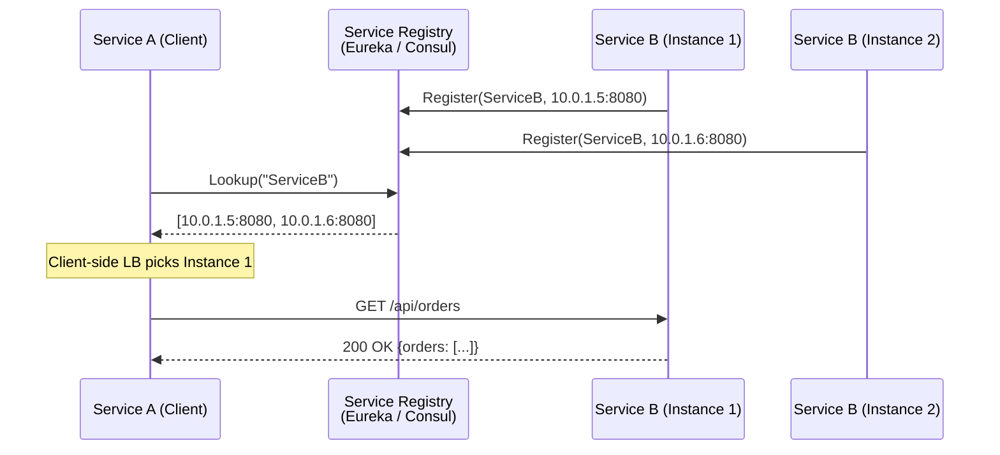

**Technologies**: Netflix Eureka, HashiCorp Consul, Apache ZooKeeper.

**Pros**: No single-point-of-failure LB; client has full control over balancing strategy.
**Cons**: Every service must embed discovery logic; language coupling (need a client library
for each language in your stack).

#### Server-Side Discovery

The client sends requests to a **load balancer** (or DNS name), which queries the
registry and forwards to a healthy instance. The client has no idea how many instances
exist.

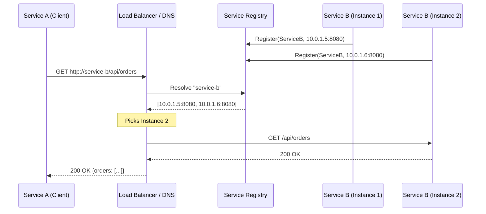

**Technologies**: Kubernetes DNS + kube-proxy, AWS ALB/NLB + Service Discovery,
Consul + Envoy, Istio VirtualService.

**Pros**: Client is simple -- just use a hostname; no discovery library needed.
**Cons**: The load balancer is in the critical path (potential bottleneck / SPOF
unless itself HA).

#### Comparison Table

| Dimension           | Client-Side                  | Server-Side                     |
|---------------------|------------------------------|---------------------------------|
| **Client complexity** | High (needs library)       | Low (just a hostname)           |
| **Load balancer**   | Embedded in client           | Separate infrastructure         |
| **Language coupling**| Yes (need SDK per language)  | No -- any HTTP client works     |
| **Extra hop**       | No                           | Yes (through LB)                |
| **Kubernetes-native** | Less common                | Default (`ClusterIP` + DNS)     |
| **Example tech**    | Eureka + Ribbon              | K8s Service, AWS ALB            |

> **Interview tip**: In Kubernetes, server-side discovery is the default.
> `service-b.namespace.svc.cluster.local` resolves to a virtual IP that
> `kube-proxy` load-balances across pods. This is why you rarely implement
> client-side discovery in K8s-based microservices.

---

### 1.3 API Gateway Patterns

The API Gateway is the **single entry point** for external clients. It sits between
clients and the mesh of internal services.

> **Deep dive**: See `01-foundations/04-api-design/api-gateway-and-patterns.md`.

Key patterns handled at the gateway:

| Pattern                 | What it does                                              |
|-------------------------|-----------------------------------------------------------|
| **Routing**             | `/users/*` to User Service, `/orders/*` to Order Service  |
| **Composition**         | Aggregate responses from multiple services into one       |
| **Protocol translation**| Accept REST from client, call gRPC internally             |
| **Auth enforcement**    | Validate JWT / API key before forwarding                  |
| **Rate limiting**       | Throttle per-client or per-plan                           |

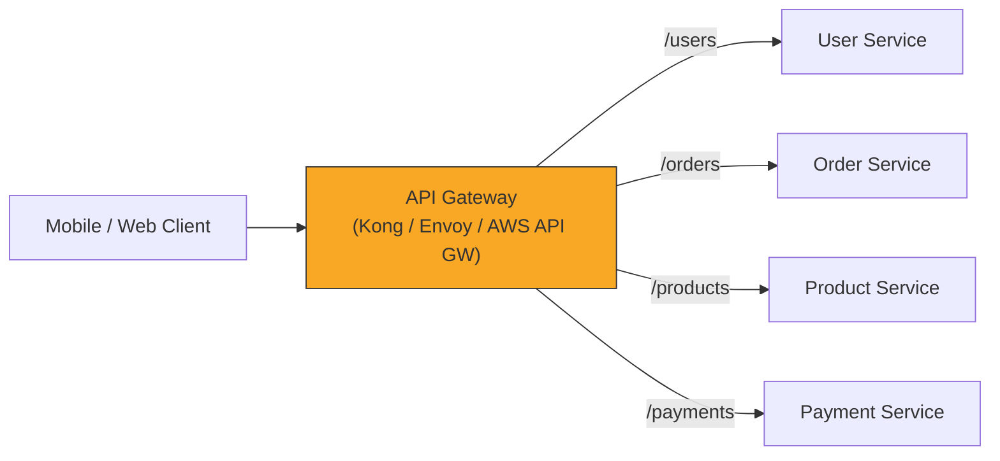

#### Composition / Aggregation

A single client request may need data from multiple services. The gateway (or a
BFF layer) fans out internally and merges responses.

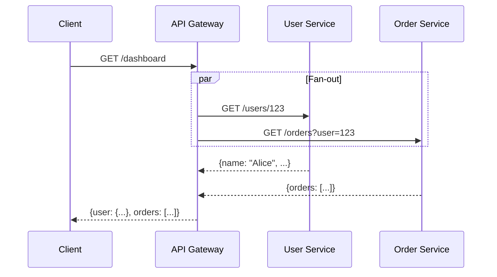

---

### 1.4 Backend for Frontend (BFF)

**Problem**: Mobile apps need small, flat payloads (battery, bandwidth). Web SPAs
need rich, nested responses. A single general-purpose API satisfies neither well.

**Solution**: One dedicated backend per client type.

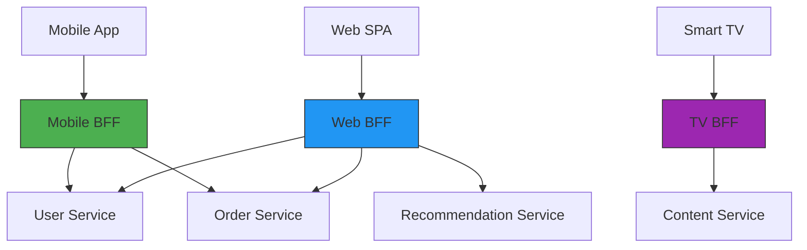

**Key benefits**:
- **Tailored payloads**: Mobile BFF returns only fields the app needs.
- **Independent deployment**: Mobile team deploys Mobile BFF without touching Web BFF.
- **Different caching strategies**: Mobile BFF caches aggressively (offline support);
  Web BFF uses short TTLs for real-time dashboards.

**When NOT to use BFF**:
- Only one client type -- a general API Gateway is enough.
- Very similar client needs -- BFF adds operational cost without benefit.

> **Real-world**: SoundCloud, Netflix, and Shopify use BFF extensively. Netflix has
> separate "experience APIs" per device type.

---

## 2. Asynchronous Communication

Asynchronous = the caller **does not wait** for a response (or waits for an ack,
not the final result). Services are decoupled at runtime.

### 2.1 Message Broker

A message broker sits between services, accepting messages from producers and
delivering them to consumers.

| Broker         | Model             | Ordering | Persistence | Best For                         |
|----------------|-------------------|----------|-------------|----------------------------------|
| **Kafka**      | Log-based pub/sub | Per-partition | Yes     | Event streaming, high throughput |
| **RabbitMQ**   | Queue + exchange  | Per-queue | Yes        | Task queues, complex routing     |
| **Amazon SQS** | Queue             | Best-effort| Yes      | Simple async, serverless         |
| **Amazon SNS** | Fan-out           | No       | No          | Notifications, pub/sub           |
| **NATS**       | Pub/sub + queue   | No       | JetStream   | Low-latency, cloud-native        |

#### Request / Async-Response Pattern

The caller sends a request message and includes a **correlation ID** and a
**reply-to** address. The responder processes the request asynchronously and
publishes the response to the reply topic/queue.

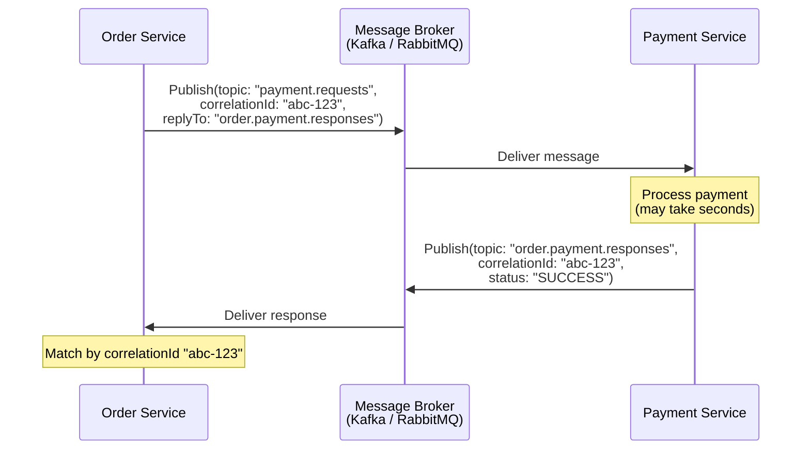

### 2.2 Event-Driven Communication

Services publish **domain events** when something significant happens. Other services
subscribe and react independently. The publisher has **zero knowledge** of who
consumes the event.

```
Order Service publishes:  OrderPlaced { orderId: 123, items: [...], total: 59.99 }

Consumers:
  - Inventory Service: reserve stock
  - Payment Service: charge customer
  - Notification Service: send confirmation email
  - Analytics Service: update dashboards
```

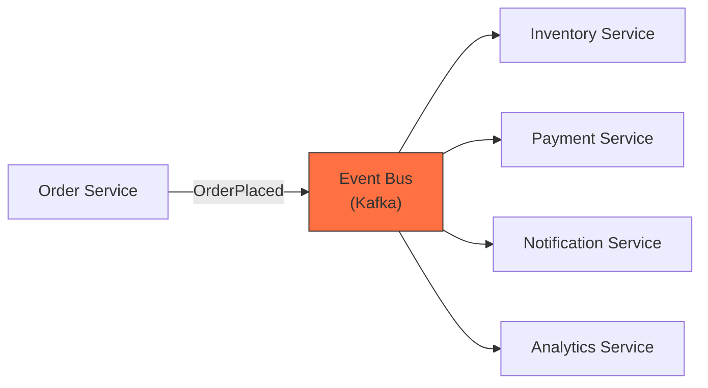

---

### 2.3 Sync vs Async Flow Comparison

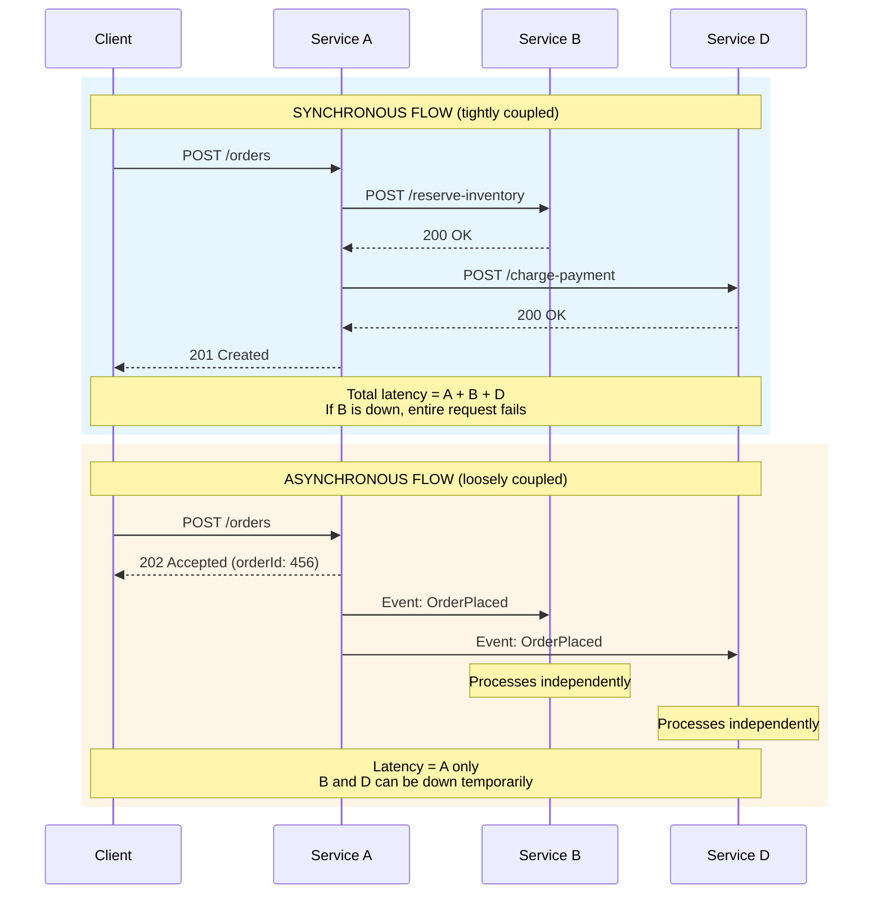

| Dimension         | Synchronous                        | Asynchronous                         |
|-------------------|------------------------------------|--------------------------------------|
| **Coupling**      | Runtime dependency                 | Only on message schema               |
| **Latency**       | Sum of all call latencies          | Just the first service               |
| **Error handling**| Cascade: one failure breaks chain  | Independent: failures are isolated   |
| **Consistency**   | Easier to achieve strong consistency | Eventual consistency                |
| **Debugging**     | Follow the call stack              | Trace correlation IDs through logs   |
| **Complexity**    | Simple mental model                | Need broker, DLQ, idempotency        |

---

## 3. Communication Patterns

### 3.1 Request-Response (Synchronous)

The classic HTTP call: caller sends request, blocks, receives response.

```
Service A ---HTTP POST /pay---> Service B
Service A <--200 OK {txId}---- Service B
```

**Use when**: You need an immediate answer to proceed. Example: validating a credit
card before confirming an order.

### 3.2 Fire-and-Forget (Asynchronous)

The caller publishes a message and moves on. It does not expect or wait for any response.

```
Service A ---Publish("UserRegistered")--> Broker --> Service B (Notification)
```

**Use when**: The downstream work is non-critical or can be retried independently.
Example: sending a welcome email after signup.

### 3.3 Publish-Subscribe

A producer publishes an event to a **topic**. Zero or more subscribers receive a
copy. The producer is unaware of subscribers.

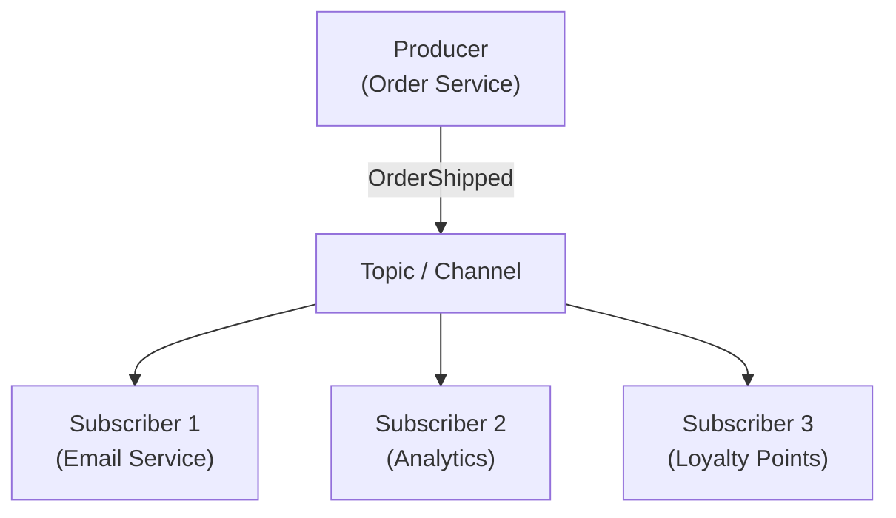

**Key property**: Adding a new subscriber requires **zero changes** to the producer.

### 3.4 Request-Async Response (Correlation ID)

The caller sends a request message that includes a **correlationId** and a
**replyTo** destination. The responder processes asynchronously and publishes the
response to the reply destination with the same correlationId.

```java
// Producer: create a payment request with correlation ID
String correlationId = UUID.randomUUID().toString();

Message request = MessageBuilder
    .withPayload(new PaymentRequest(orderId, amount))
    .setHeader("correlationId", correlationId)
    .setHeader("replyTo", "order.payment.responses")
    .build();

kafkaTemplate.send("payment.requests", request);

// Store correlationId -> orderId mapping for later matching

// Consumer: listen on the reply topic
@KafkaListener(topics = "order.payment.responses")
public void handlePaymentResponse(PaymentResponse response,
        @Header("correlationId") String correlationId) {
    Order order = findOrderByCorrelationId(correlationId);
    order.updatePaymentStatus(response.getStatus());
}
```

### 3.5 Choreography vs Orchestration

Two approaches to coordinate multi-service workflows:

| Approach          | How it works                                  | Pros                         | Cons                         |
|-------------------|-----------------------------------------------|------------------------------|------------------------------|
| **Choreography**  | Each service reacts to events, no central coordinator | Loose coupling, simple services | Hard to understand full flow |
| **Orchestration** | A central orchestrator directs each step explicitly   | Clear flow, easier to debug   | Orchestrator is a coupling point |

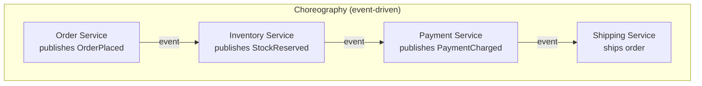

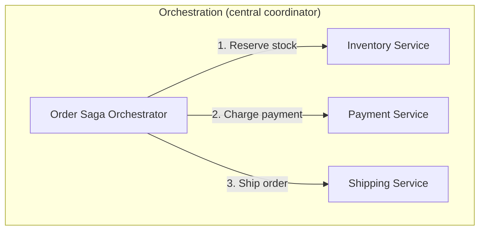

> **Deep dive**: See `02-core-system-design/05-distributed-transactions/saga-pattern.md`
> for Saga patterns with choreography and orchestration, including compensation flows.

---

## 4. Choosing the Right Communication Pattern

### Decision Matrix

```
Is the response needed immediately to continue?
├── YES: Synchronous (REST / gRPC)
│   ├── Is it a public-facing API?  --> REST
│   ├── Is it internal + high-throughput? --> gRPC
│   └── Does the client need flexible queries? --> GraphQL / BFF
│
└── NO: Asynchronous
    ├── Does anyone need the result?
    │   ├── NO:  Fire-and-forget
    │   └── YES: Request-Async Response (correlation ID)
    │
    └── Should multiple services react?
        └── YES: Publish-Subscribe
```

### Real-World Communication Map (E-Commerce)

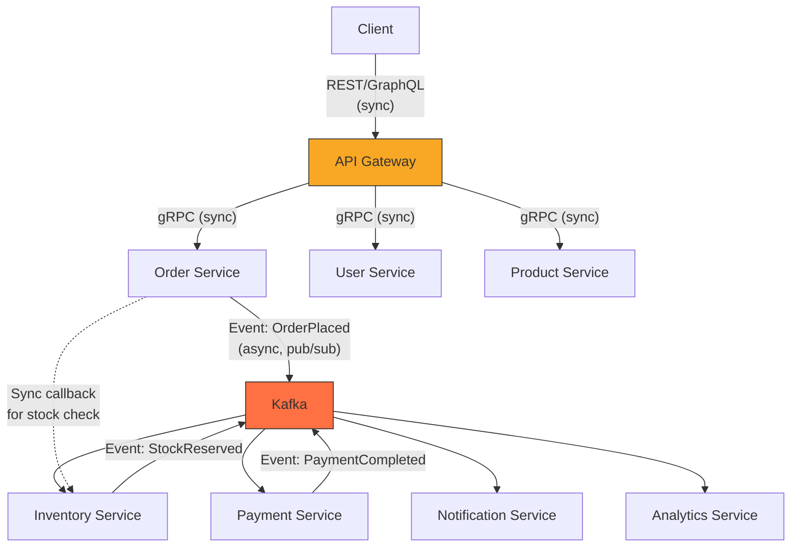

**Pattern**: Read path is synchronous (user needs immediate response), write path
is asynchronous (eventual consistency is acceptable for order processing pipeline).

---

## 5. Interview Questions

**Q1: How would you handle communication between 20+ microservices?**
Use a service mesh (e.g., Istio) for infrastructure concerns (mTLS, retry,
circuit breaking) and an event bus (Kafka) for async event-driven communication.
Synchronous calls (gRPC) only for queries that need immediate responses.

**Q2: What happens when a synchronous downstream service is slow?**
Timeout + circuit breaker + fallback. The circuit breaker opens after N failures,
returning a cached/default response instead of waiting. See `resilience-patterns.md`.

**Q3: How do you avoid tight coupling with synchronous calls?**
- Use async events wherever possible (fire-and-forget, pub-sub).
- Use BFF or Gateway composition instead of service-to-service HTTP.
- Use correlation IDs for request-async-response when you need a result but not
  immediately.

**Q4: Client-side vs server-side discovery -- which do you prefer?**
In Kubernetes: server-side discovery is built in (DNS + kube-proxy). For non-K8s
environments or when you need fine-grained client control (canary routing, latency-based),
client-side with Consul or Eureka is appropriate.

**Q5: When would you use fire-and-forget vs request-async-response?**
Fire-and-forget when the producer does not need to know the outcome (e.g., audit log,
email notification). Request-async-response when the producer needs the result to
continue a later step (e.g., payment confirmation for order processing), tracked
via correlation ID.

---

## 6. Key Takeaways

1. **Default to async** for inter-service writes; use sync only when the caller
   truly needs an immediate answer.
2. **Service discovery** is infrastructure, not application logic -- prefer
   server-side (K8s DNS) unless you have strong reasons for client-side.
3. **API Gateway** handles cross-cutting concerns; **BFF** tailors API shape per
   client type. They can coexist.
4. **Correlation IDs** are essential for tracing, debugging, and matching async
   request-response pairs.
5. **Choreography** gives loose coupling but hides the big picture;
   **Orchestration** gives visibility but introduces a coordinator.
   Choose based on workflow complexity.
