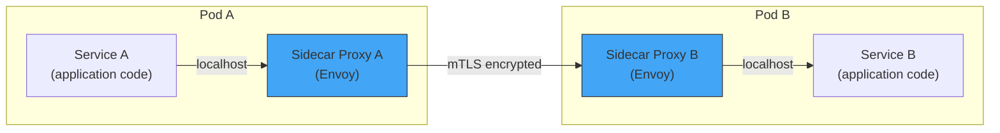
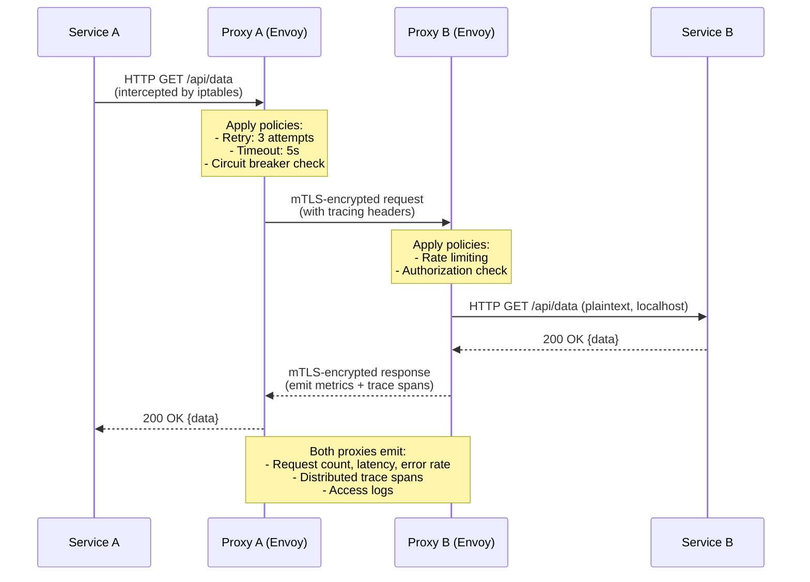
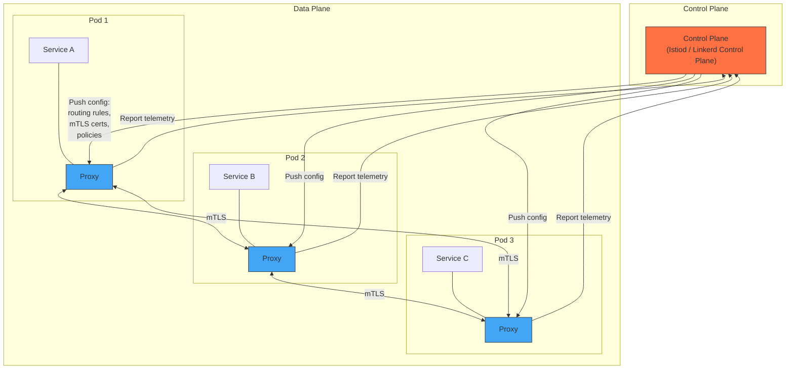
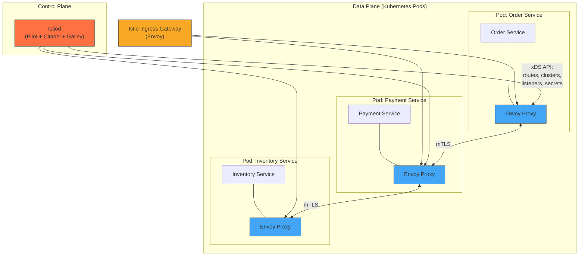
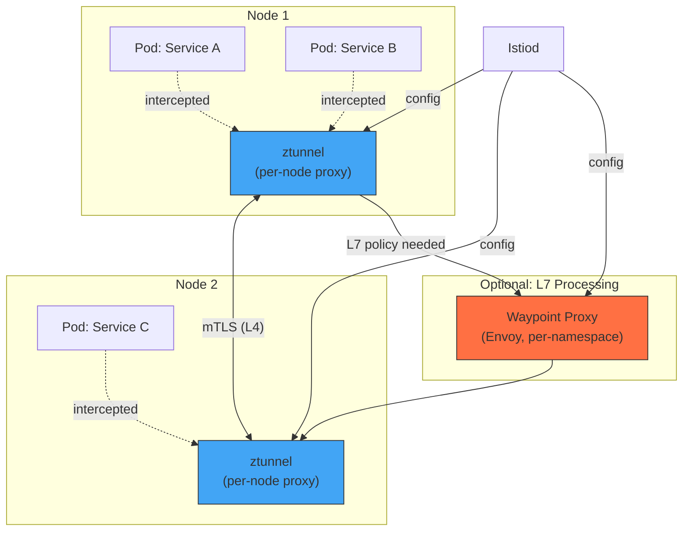
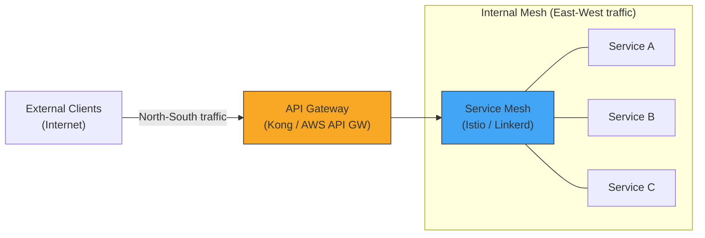

# Service Mesh

## Overview

A service mesh is a dedicated **infrastructure layer** that handles service-to-service
communication. It provides traffic management, security, and observability **without
requiring changes to application code**.

The core insight: every microservice needs retry logic, circuit breaking, mTLS,
tracing, and metrics. Instead of each team implementing these in every language
and framework, push this responsibility into the **infrastructure**.

---

## 1. The Problem

Without a service mesh, each service must implement:

| Concern               | What each service must do                            |
|-----------------------|------------------------------------------------------|
| **Retries**           | Retry failed requests with backoff                   |
| **Circuit breaking**  | Stop calling failing dependencies                    |
| **Mutual TLS**        | Encrypt all service-to-service traffic               |
| **Load balancing**    | Distribute requests across instances                 |
| **Observability**     | Emit metrics, traces, logs for every call            |
| **Traffic control**   | Canary deploys, A/B testing, traffic mirroring       |
| **Access control**    | Which service can call which?                        |

**This leads to**:
- Duplicated code across languages (Java, Go, Python each need their own library).
- Inconsistent implementations (Team A's retry logic differs from Team B's).
- Application developers spending time on infrastructure instead of business logic.
- Upgrading a resilience library requires redeploying every service.

---

## 2. The Sidecar Proxy Pattern

The fundamental building block of a service mesh: deploy a **proxy** alongside
every service instance. All inbound and outbound traffic flows through this proxy.



**How it works**:
1. Service A makes a plain HTTP/gRPC call to `service-b:8080`.
2. iptables rules (injected by the mesh) intercept the outbound traffic and
   redirect it to Sidecar Proxy A.
3. Proxy A applies policies (retry, timeout, circuit breaking), encrypts with
   mTLS, and forwards to Proxy B.
4. Proxy B decrypts, applies inbound policies (rate limiting, auth), and
   forwards to Service B on localhost.
5. Service A and B have **zero knowledge** of the mesh.

### Detailed Request Flow



---

## 3. Architecture: Data Plane vs Control Plane



| Component         | Role                                                    | Example                |
|-------------------|---------------------------------------------------------|------------------------|
| **Data plane**    | Proxy instances that handle actual traffic               | Envoy, linkerd2-proxy  |
| **Control plane** | Manages configuration, certificates, policies for proxies | Istiod, Linkerd CP     |

**Analogy**: The control plane is air traffic control (issues instructions). The
data plane is the fleet of airplanes (handles actual flights).

---

## 4. Istio (The Most Feature-Rich Mesh)

### Architecture



**Istiod** is the unified control plane (formerly three separate components):
- **Pilot**: Converts routing rules into Envoy configuration, pushes via xDS API.
- **Citadel**: Issues and rotates mTLS certificates (SPIFFE identity).
- **Galley**: Validates configuration.

### 4.1 Traffic Management

Istio gives you fine-grained control over traffic without touching application code.

| Feature              | What it does                                              | Use case                          |
|----------------------|-----------------------------------------------------------|-----------------------------------|
| **Canary release**   | Send 5% of traffic to v2, 95% to v1                      | Gradual rollout                   |
| **A/B testing**      | Route based on headers (`x-user-group: beta`)             | Feature testing                   |
| **Traffic mirroring**| Copy live traffic to a shadow service (fire-and-forget)   | Testing new version with real traffic |
| **Fault injection**  | Inject 5s delay or 500 errors into 10% of requests       | Chaos engineering                 |
| **Retries**          | Automatic retries with backoff                            | Transient failure handling        |
| **Timeouts**         | Per-route timeout configuration                           | Deadline enforcement              |

```yaml
# Istio VirtualService: canary release
apiVersion: networking.istio.io/v1beta1
kind: VirtualService
metadata:
  name: payment-service
spec:
  hosts:
    - payment-service
  http:
    - route:
        - destination:
            host: payment-service
            subset: v1
          weight: 95
        - destination:
            host: payment-service
            subset: v2
          weight: 5
      retries:
        attempts: 3
        perTryTimeout: 2s
        retryOn: 5xx,reset,connect-failure
      timeout: 10s
```

### 4.2 Security

| Feature                  | What Istio provides                                    |
|--------------------------|--------------------------------------------------------|
| **Automatic mTLS**       | All service-to-service traffic encrypted by default     |
| **Identity**             | SPIFFE-based identity per service (not IP-based)        |
| **Authorization**        | "Service A can call Service B, but not Service C"       |
| **JWT validation**       | Validate tokens at the proxy level                      |

```yaml
# Istio AuthorizationPolicy: only Order Service can call Payment Service
apiVersion: security.istio.io/v1beta1
kind: AuthorizationPolicy
metadata:
  name: payment-service-policy
  namespace: production
spec:
  selector:
    matchLabels:
      app: payment-service
  rules:
    - from:
        - source:
            principals: ["cluster.local/ns/production/sa/order-service"]
      to:
        - operation:
            methods: ["POST"]
            paths: ["/api/charge"]
```

### 4.3 Observability

Istio provides **automatic** observability for all meshed traffic -- no code changes.

| Signal          | What you get                                            | Tool integration      |
|-----------------|---------------------------------------------------------|-----------------------|
| **Metrics**     | Request count, latency (p50/p99), error rate per service | Prometheus + Grafana  |
| **Traces**      | Distributed traces across service calls                  | Jaeger / Zipkin       |
| **Access logs** | Detailed logs for every request                          | ELK / Loki           |
| **Topology**    | Live service dependency graph                            | Kiali                 |

---

## 5. Linkerd

Linkerd is a lighter-weight alternative to Istio.

| Aspect           | Linkerd                                      | Istio                           |
|------------------|----------------------------------------------|---------------------------------|
| **Proxy**        | linkerd2-proxy (Rust, purpose-built)         | Envoy (C++, general-purpose)    |
| **Resource usage** | ~10 MB RAM per proxy                       | ~50-100 MB RAM per proxy        |
| **Complexity**   | Simpler, fewer features                      | More features, more complexity  |
| **mTLS**         | Automatic                                    | Automatic                       |
| **Traffic mgmt** | Basic (traffic split, retries)               | Advanced (fault injection, mirroring) |
| **Adoption**     | Easier to get started                        | Steeper learning curve          |

**When to choose Linkerd**: You want mesh benefits (mTLS, observability, retries)
without the operational overhead of Istio. Your traffic management needs are simple.

**When to choose Istio**: You need advanced traffic control (fault injection,
mirroring, complex routing rules), or you are already invested in the Envoy ecosystem.

---

## 6. Ambient Mesh (Istio Without Sidecars)

Traditional service mesh adds a sidecar proxy to every pod, which:
- Increases memory and CPU usage (Envoy per pod).
- Complicates debugging (another process in the pod).
- Adds latency (two extra network hops per request).

**Ambient mesh** (introduced by Istio) removes sidecars entirely.

### Architecture



**Two layers**:
1. **ztunnel** (zero-trust tunnel): A per-node proxy (DaemonSet) that handles L4
   concerns (mTLS, TCP-level telemetry). Lightweight, Rust-based.
2. **Waypoint proxy**: An optional per-namespace Envoy instance for L7 concerns
   (HTTP routing, retries, authorization policies). Only deployed when needed.

**Benefits**: Lower resource overhead, simpler pod model, same security guarantees.

---

## 7. Service Mesh vs API Gateway

These are **complementary**, not competing.



| Dimension            | API Gateway                        | Service Mesh                        |
|----------------------|------------------------------------|-------------------------------------|
| **Traffic type**     | North-South (external to internal) | East-West (internal to internal)    |
| **Client**           | External (browsers, mobile apps)   | Internal services                   |
| **Concerns**         | Auth, rate limiting, API versioning, request transformation | mTLS, retries, circuit breaking, observability |
| **Protocol**         | HTTP/REST (often)                  | Any (HTTP, gRPC, TCP)               |
| **Deployment**       | Edge of network                    | Alongside every service             |
| **Example**          | Kong, AWS API Gateway, Apigee      | Istio, Linkerd, Consul Connect      |

**They coexist**: API Gateway handles edge concerns (auth, rate limiting for
external clients), service mesh handles internal communication concerns (mTLS,
retries between services).

---

## 8. When to Use a Service Mesh

### Use When

- You have **many services** (10+) communicating over the network.
- You need **mTLS everywhere** for zero-trust security.
- You want **consistent observability** across all services without code changes.
- You need **advanced traffic management** (canary, A/B, fault injection).
- Your services are in **multiple languages** -- mesh is language-agnostic.
- You are already on **Kubernetes** (meshes integrate tightly with K8s).

### Do NOT Use When

- You have **fewer than 5 services** -- the overhead is not justified.
- Your services are a **monolith** or a modular monolith -- no service-to-service traffic.
- You are not on Kubernetes (mesh setup on VMs is significantly harder).
- Your team is **small** and cannot absorb the operational complexity.
- Latency requirements are **extreme** (sub-millisecond) -- proxies add ~1ms per hop.
- You can achieve your goals with a **library** (Resilience4j) because you only
  use one language.

### Decision Framework

```
Do you have 10+ services communicating over the network?
├── NO: Use a resilience library (Resilience4j / Polly)
└── YES:
    ├── Is your team experienced with Kubernetes?
    │   ├── NO: Start with Linkerd (simpler) or a library
    │   └── YES:
    │       ├── Do you need advanced traffic control (fault injection, mirroring)?
    │       │   ├── YES: Istio
    │       │   └── NO: Linkerd
    │       └── Are sidecar resource costs a concern?
    │           └── YES: Istio Ambient Mesh
```

---

## 9. Comparison Table: Istio vs Linkerd vs Consul Connect

| Feature                  | **Istio**                     | **Linkerd**                  | **Consul Connect**            |
|--------------------------|-------------------------------|------------------------------|-------------------------------|
| **Proxy**                | Envoy (C++)                   | linkerd2-proxy (Rust)        | Envoy or built-in proxy      |
| **Control plane**        | Istiod                        | Linkerd CP                   | Consul server                |
| **mTLS**                 | Automatic                     | Automatic                    | Automatic                    |
| **Traffic splitting**    | Yes (weighted, header-based)  | Yes (weighted)               | Yes (weighted)               |
| **Fault injection**      | Yes                           | No                           | No                           |
| **Traffic mirroring**    | Yes                           | No                           | No                           |
| **Multi-cluster**        | Yes                           | Yes                          | Yes (native)                 |
| **Non-K8s support**      | Limited                       | No                           | Yes (VMs, ECS, Nomad)        |
| **Resource overhead**    | High (~50-100 MB/proxy)       | Low (~10 MB/proxy)           | Medium                       |
| **Complexity**           | High                          | Low                          | Medium                       |
| **Observability**        | Prometheus, Jaeger, Kiali     | Prometheus, Jaeger, Viz      | Prometheus, built-in UI      |
| **Ambient mode**         | Yes (ztunnel)                 | No                           | No                           |
| **CNCF status**          | Graduated                     | Graduated                    | Not CNCF (HashiCorp)        |
| **Best for**             | Feature-rich, advanced needs  | Simplicity, low overhead     | Multi-platform (K8s + VMs)   |

---

## 10. Interview Questions

**Q1: What is a service mesh, and why would you use one?**
A service mesh is an infrastructure layer (sidecar proxies + control plane) that
handles service-to-service concerns (mTLS, retries, circuit breaking, observability)
transparently. You use it to avoid duplicating this logic in every service, especially
in polyglot environments with many services.

**Q2: How does the sidecar proxy intercept traffic without application changes?**
In Kubernetes, an init container modifies iptables rules to redirect all inbound/outbound
traffic through the sidecar proxy (usually Envoy on port 15001). The application
thinks it is talking directly to the target service.

**Q3: What is the difference between data plane and control plane?**
The data plane (Envoy proxies) handles actual traffic -- routing, encryption,
retries. The control plane (Istiod) manages configuration -- it pushes routing rules,
certificates, and policies to all proxies via the xDS API.

**Q4: When would you NOT use a service mesh?**
Fewer than 5 services, not on Kubernetes, very small team, extreme latency
requirements (sub-ms), or single-language stack where a library like Resilience4j
covers your needs without the operational overhead.

**Q5: Explain Istio Ambient Mesh and why it exists.**
Ambient mesh removes sidecar proxies. Instead, a per-node ztunnel handles L4 (mTLS,
TCP telemetry) and optional per-namespace waypoint proxies handle L7 (HTTP routing,
authorization). This reduces resource overhead (no Envoy per pod) while maintaining
security and observability.

**Q6: Service mesh vs API Gateway -- are they redundant?**
No. API Gateway handles north-south traffic (external clients to internal services)
with edge concerns (auth, rate limiting, API versioning). Service mesh handles
east-west traffic (service to service) with infrastructure concerns (mTLS, retries,
observability). They coexist.

---

## 11. Key Takeaways

1. A service mesh moves cross-cutting communication concerns from **application code**
   to **infrastructure**, making them consistent and language-agnostic.
2. The **sidecar proxy** is the fundamental building block -- it intercepts all
   traffic transparently.
3. **Data plane** = proxies that handle traffic. **Control plane** = brain that
   manages proxy configuration.
4. **Istio** is the most feature-rich (but heaviest). **Linkerd** is simpler and
   lighter. **Consul Connect** supports non-Kubernetes environments.
5. **Ambient mesh** eliminates sidecars for lower overhead while preserving
   security and observability.
6. Service mesh and API Gateway are **complementary**: gateway for north-south,
   mesh for east-west.
7. Do not adopt a service mesh unless you have the **service count and team
   maturity** to justify the operational cost.
